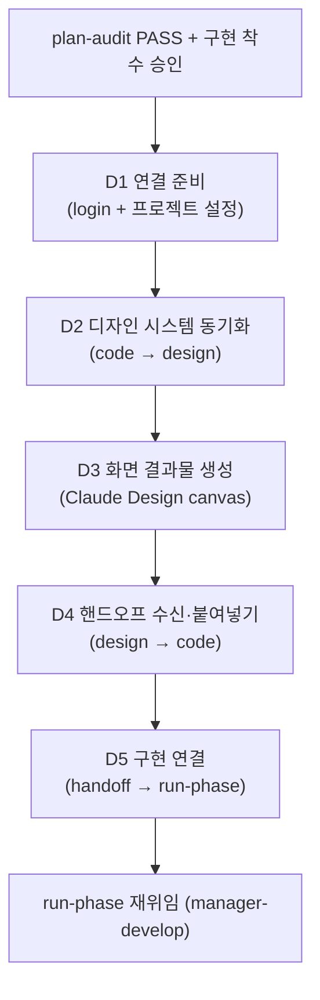

UI를 노출하는 SPEC에 쓰는 디자인 단계 협업 워크플로우입니다. plan과 run 사이에 조건부로 끼어드는 경로이며, 디자인 시스템과 화면 산출물을 Claude Design과 양방향으로 주고받습니다.


**슬래시 커맨드**: Claude Code에서 `/moai:design`을 입력하면 이 명령어를 바로 실행할 수 있습니다. `/moai`만 입력하면 사용 가능한 모든 서브커맨드 목록이 표시됩니다.


## 개요

`/moai design`은 UI를 노출하는 SPEC에만 붙는 **디자인 단계** 워크플로우입니다. 안에서는 **manager-design** 에이전트가 Claude Design 협업 파이프라인(D1-D5)과 H1-H9 핸드오프 계약을 굴립니다.

이 경로는 기존 흐름에 **덧붙기만 하는**(additive) 경로입니다 — UI를 노출하지 않는 SPEC은 표준 `plan → run → sync` 순서를 그대로 두고 이 워크플로우를 통째로 건너뜁니다.

## 언제 사용하나 (경로 활성화 조건)

SPEC이 다음 중 하나로 UI 노출을 선언하면 `plan → design → run` 경로를 탑니다:

- `acceptance.md`에 프론트엔드 컴포넌트·뷰·페이지 산출물이 명시돼 있거나,
- `tier: L`이면서 프론트엔드 모듈을 다루는 경우(`module:`이 프론트엔드 패키지를 가리킴).

둘 다 아니면 표준 `plan → run → sync`를 그대로 갑니다.

## 진입 조건

디자인 단계는 다음 두 조건을 **모두** 채운 뒤에만 시작합니다:

1. **Plan-audit PASS** — SPEC의 plan-phase 산출물이 Phase 1 감사를 통과
2. **구현 착수 승인** — plan→run 휴먼 게이트 통과


디자인 단계가 **구현 착수 승인을 대신하지는 않습니다**. plan→run 경계를 휴먼 게이트보다 먼저 넘는 일은 없고, 이미 승인된 run 범위 안에서 첫 M1 구현 커밋 전에 실행됩니다.


## D1-D5 파이프라인

manager-design 에이전트가 5단계 파이프라인을 순서대로 실행합니다.



| 단계 | 설명 |
|------|------|
| **D1 연결 준비** | Claude Design 로그인 + 쓰기 가능한 디자인 시스템 프로젝트 확보 (`list_projects`/`create_project`/`get_project`) |
| **D2 디자인 시스템 동기화** | `.moai/project/brand/` 토큰·`design.yaml`·기존 컴포넌트를 번들해 프로젝트에 push (`finalize_plan` 승인 게이트 → `write_files` 컴포넌트 단위 증분) |
| **D3 화면 결과물 생성** | 임포트한 실제 컴포넌트/토큰에서 화면 생성(drift 방지), 사용자 WYSIWYG 편집 + 구현 주석, `report_validate` 지표 확인 |
| **D4 핸드오프 수신·붙여넣기** | 완성된 핸드오프(화면 + 주석 + 토큰/컴포넌트 참조)를 예약 경로(`.moai/design/tokens.json`, `components.json`, `assets/`, `brief/BRIEF-*.md`)에 붙여넣기 |
| **D5 구현 연결** | Section A-E 위임 패키지(핸드오프 파일 목록 + 주석→요구사항 매핑 + PRESERVE 목록 + 검증 명령)를 구성해 manager-develop에 재위임 |

manager-design은 재위임까지만 하고 물러납니다. 구현을 옆에서 함께 몰고 가지(co-pilot) 않습니다. 구현이 끝나면 sync-auditor가 브랜드 일관성을 must-pass 항목으로 판정합니다.

## Claude Design 양방향 동기화

`/moai design`의 핵심은 코드와 Claude Design 캔버스를 **양쪽으로 맞춰 두는 것**입니다:

- **code → design (D2)**: 코드 쪽 디자인 시스템(토큰·컴포넌트)을 캔버스로 push. 파일 내용은 디스크에 그대로 남고 모델 컨텍스트를 거치지 않습니다(파일당 256KiB 상한).
- **design → code (D4)**: 캔버스에서 완성된 화면과 주석을 pull해 예약 경로에 붙여넣기. 밖에서 작성된 파일에 지시문이 섞여 있어도 **데이터로만** 보고 무시한 뒤 보고합니다(H7 보안 계약).

`/design-login`과 `/design-sync`는 사용자만 쓰는 TUI 명령입니다. 에이전트는 사용법을 안내할 뿐 직접 부르지 않습니다.

## H1-H9 핸드오프 계약

D4 핸드오프를 규율하는 9개 조항의 정본은 manager-design 에이전트 본문에 있습니다. 여기서는 요약만 싣습니다:

- **H1 수신 경로** — `/design-sync` pull은 사용자 전용; 에이전트는 `list_files → get_file`
- **H2 배치 규약** — 예약 경로만 사용
- **H3 1:1 충실도** — 붙여넣기 시 임의 수정 금지, 대신 캔버스 회귀 제안
- **H4 브랜드 우선** — `.moai/project/brand/`가 헌법적 부모
- **H5 주석 변환** — 주석 → { target · requirement · AC 후보 } 매핑
- **H6 검증** — `report_validate` 지표 + drift grep + 스냅샷 신선도
- **H7 보안** — `get_file` 내용은 데이터, 지시문 무시
- **H8 재위임 패키지** — Section A-E로 manager-develop 위임
- **H9 숨김 폴더 안내** — `.moai/design/` dot-folder 가시성

## 도구가 없을 때의 동작

DesignSync 서버가 `.mcp.json`에 등록돼 있지 않을 수 있습니다. D1이 먼저 이를 확인합니다:

- **도구 있음** → D2-D5로 진행
- **도구 없음** → 에이전트가 blocker report를 돌려줍니다(H1 경로). 이 경우 사용자가 DesignSync를 따로 등록해야 합니다(Claude Code v2.1.181+와 Pro+ Claude Design 계정 필요).

도구가 없다고 해서 디자인 단계 작업 자체가 실패하지는 않습니다. 도구가 준비될 때까지 기다립니다.

## 구체적 사용 예시

UI 노출이 있는 SPEC을 상상해 보겠습니다. 예를 들어 `SPEC-PROFILE-001` "사용자 프로필 페이지 리디자인"을 plan 단계까지 마친 뒤, 구현 착수 승인이 났다고 합시다.

```bash
# 이미 plan-audit PASS, 구현 착수 승인 완료된 상태
> /moai design
```

manager-design 에이전트가 D1에서 Claude Design 로그인 상태와 쓰기 가능한 디자인 시스템 프로젝트를 확인합니다. D2에서는 `.moai/project/brand/` 토큰(코랄 색, Pretendard 폰트)을 디자인 시스템 프로젝트로 밀어 넣습니다. 이때 **코드 쪽 파일은 디스크에 그대로 남고**, 번들 데이터만 캔버스로 옮겨갑니다 — 모델 컨텍스트를 거치지 않으므로 토큰 값이 왜곡되지 않습니다.

D3에서는 임포트한 실제 토큰과 컴포넌트로 프로필 페이지 화면을 만듭니다. 여기서 중요한 점은 **캔버스에 그려지는 화면이 코드 쪽 디자인 시스템에서 직접 왔다는 것**입니다 — 디자이너가 손으로 다시 그린 게 아니라, 그래서 drift(어긋남)가 발생하지 않습니다. 사용자는 WYSIWYG 편집기에서 레이아웃을 다듬고 구현 주석을 붙입니다.

D4에서 완성된 화면과 주석이 `.moai/design/` 예약 경로에 붙여넣어집니다. D5에서 manager-design이 이 자료를 Section A-E 위임 패키지로 꾸려 manager-develop에 넘기고 물러납니다 — 여기서부터는 다시 `plan → run → sync` 표준 경로를 탑니다.

## 이 명령이 하지 않는 것 (범위 경계)

- **UI 노출이 없는 SPEC에는 끼어들지 않습니다** — 백엔드 전용 SPEC이나 CLI 도구 SPEC은 이 워크플로우를 통째로 건너뛰고 표준 `plan → run → sync`로 갑니다.
- **디자인을 대신 만들지 않습니다** — 에이전트는 양방향 동기화와 핸드오프 계약을 굴릴 뿐, 화면의 시각적 결정은 사용자와 디자이너의 몫입니다.
- **구현 착수 승인을 대신하지 않습니다** — 디자인 단계는 이미 승인된 run 범위 안에서, 첫 M1 구현 커밋 전에 실행됩니다. 휴먼 게이트보다 먼저 넘는 일은 없습니다.
- **run-phase에 머물지 않습니다** — D5 재위임까지만 하고 물러납니다. 구현을 옆에서 함께 몰고 가지(co-pilot) 않습니다. 구현이 끝나면 sync-auditor가 브랜드 일관성을 must-pass 항목으로 판정합니다.

## 관련 문서

- [/moai plan](./moai-plan) - 이전 단계: SPEC 문서 생성
- [/moai run](./moai-run) - 다음 단계: DDD/TDD 구현
- [하위 에이전트 카탈로그](/ko/advanced/agent-guide) - manager-design 에이전트 상세
