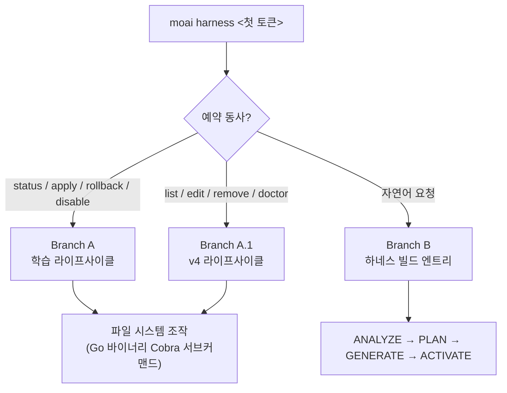

프로젝트 고유의 동적 전문가 팀 (하네스)을 생성하고, 하네스 학습 라이프사이클을 관리합니다.


**슬래시 커맨드**: Claude Code에서 `/moai:harness <자연어 요청>`을 입력하면 이 명령어를 바로 실행할 수 있습니다.


## 개요

`/moai:harness`는 MoAI-ADK의 **Harness v4 Builder**를 실행하여 프로젝트 요구사항에 맞춘 동적 전문가 팀을 자동 생성합니다.

v3의 세 번째 기둥인 **에이전틱 하네스**를 그대로 체감할 수 있는 명령어입니다 — 하네스가 하네스를 만드는 재귀 구조입니다. 범용 에이전트 카탈로그로 부족한 프로젝트 고유 영역 (예: 특정 DB 마이그레이션 절차, 사내 API 규약)이 있으면, 자연어 한 문장으로 그 영역의 전문가 팀을 스캐폴드할 수 있습니다. 생성된 하네스는 **재귀적 자가 학습** 서브시스템과 이어집니다 — 사용 관찰이 축적되면 하네스가 스스로 개선 제안을 만들고, 사용자 승인 게이트를 거쳐 지침이 진화합니다.

### Harness v4 Builder란?

Harness v4 Builder는 Socratic 인터뷰 기반의 4-phase 워크플로우 (ANALYZE → PLAN → GENERATE → ACTIVATE)로 팀을 구성합니다.

| 단계 | 설명 |
|------|------|
| ANALYZE | 프로젝트 구조, 사용 언어, 기존 에이전트 인벤토리 분석 |
| PLAN | 필요한 팀 규모(3~5명), 각 팀원의 역할, worktree 격리 여부 결정 |
| GENERATE | `.claude/agents/harness/` 에이전트 파일, `.moai/harness/manifest.json` 생성 |
| ACTIVATE | 팀 등록 및 `/harness:<name>` 커맨드 활성화 |

## 단일 `harness` 서브커맨드 라우팅

`moai harness`는 단일 Cobra 서브커맨드 트리이며, 첫 번째 인자($ARGUMENTS의 첫 토큰)에 따라 세 가지 경로 중 하나로 분기합니다 — 별도의 명령어를 도입하지 않는 **argument-branching 라우팅**입니다.

| 첫 토큰 | 라우팅 대상 | 설명 |
| ------- | ----------- | ---- |
| `status` / `apply` / `rollback` / `disable` | **Branch A — 학습 라이프사이클** | 관찰 누적 → 패턴 → 규칙 → 자동 진화 제안의 4계층 학습 시스템 관리 |
| `list` / `edit` / `remove` / `doctor` | **Branch A.1 — v4 라이프사이클** | 생성된 하네스 열거, 편집, 원자 삭제, 참조 무결성 진단 |
| 그 외 (자연어) | **Branch B — 하네스 빌드 엔트리** | v4 Builder의 ANALYZE → PLAN → GENERATE → ACTIVATE 4-phase로 새 하네스 생성 |



모든 동사는 `moai harness <verb>` Go 바이너리 Cobra 서브커맨드 트리를 통해 동일하게 dispatch됩니다 — 학습 동사와 v4 동사가 각각 다른 Go 바이너리로 분리되지 않습니다.

## 사용 방법

### 1단계: 자연어로 팀 생성 요청

```bash
> /moai:harness <자연어 요청>
```

**예시:**
```
우리 Go 백엔드 프로젝트에 맞는 전문가 팀을 만들어줘.
DB 마이그레이션, REST API 엔드포인트, 단위 테스트를 각각 담당할 팀이 필요해.
```

### 2단계: Builder의 자동 처리

Builder가 4-phase를 자동 실행합니다:

1. **ANALYZE**: Go, PostgreSQL, REST API 기술 스택 감지
2. **PLAN**: DB Engineer, API Developer, Test Engineer 3인 팀 구성 결정
3. **GENERATE**:
   - `.claude/agents/harness/db-engineer.md`
   - `.claude/agents/harness/api-developer.md`
   - `.claude/agents/harness/test-engineer.md`
   - `.moai/harness/manifest.json` 생성
4. **ACTIVATE**: `/harness:backend-team` 커맨드 등록

### 3단계: 생성된 팀 활용

생성 후 모든 작업에서 팀을 자동 활용:

```bash
/moai run SPEC-BACKEND-001
```

MoAI가 SPEC 복잡도를 분석하여 manifest의 phase 순서대로 팀원을 자동 위임합니다.

## Harness v4 라이프사이클 관리 (Branch A.1)

생성된 하네스는 `moai harness` 서브커맨드로 관리합니다. 네 가지 v4 라이프사이클 동사가 Go 바이너리 Cobra 서브커맨드로 dispatch됩니다.

### moai harness list

생성된 모든 하네스 목록을 조회합니다:

```bash
moai harness list
```

출력 정보: 하네스 이름, 도메인, 엔트리 커맨드, manifest에 선언된 스케줄 (선언 시에만 표시).

### moai harness edit <name>

manifest.json과 에이전트 정의 파일 경로를 표시하여 편집을 안내합니다 — manifest가 SSOT입니다:

```bash
moai harness edit backend-team
```

편집 대상:
- `.claude/commands/harness/<name>/manifest.json` (SSOT)
- `.claude/agents/harness/hns-<name>*-specialist.md` (전문가 정의)
- `.claude/skills/hns-<name>*/` (컴패니언 스킬)

### moai harness remove <name>

하네스 및 모든 연관 파일을 원자적으로 삭제합니다:

```bash
moai harness remove backend-team
```

삭제되는 항목:
- `.claude/commands/harness/<name>.md` (thin-wrapper command)
- `.claude/commands/harness/<name>/manifest.json` (SSOT)
- `.claude/workflows/hns-<name>-run.js` (Runner)
- `.claude/agents/harness/hns-<name>*-specialist.md` (전문가)
- `.claude/skills/hns-<name>*/` (컴패니언 스킬)


`remove`는 fail-closed로 동작합니다 — 산출물 중 하나라도 누락되면 삭제를 중단하고 누락 파일을 보고합니다. orphan 산출물이 남지 않도록 보장합니다.


### moai harness doctor

모든 하네스의 참조 무결성을 검증하는 smoke gate입니다:

```bash
moai harness doctor
```

검사 항목:
- 모든 하네스의 manifest / specialist / skill 파일 존재 여부
- manifest와 산출물 간 교차 참조 일치
- 스케줄 선언의 스키마 유효성 (무효 시 ERROR 심각도)

## 하네스 학습 라이프사이클 — 재귀적 자가 학습 (Branch A)

하네스는 생성하고 끝나는 정적 산출물이 아닙니다. `moai harness` 서브커맨드로 **학습 서브시스템**의 라이프사이클을 관리합니다. 학습 동사 (status / apply / rollback / disable)는 Branch A로 라우팅됩니다.

| 명령어 | 설명 |
|--------|------|
| `moai harness status` | 학습 상태 확인 (관찰 수, 패턴, 제안, tier 분포, rate-limit 윈도우) |
| `moai harness apply` | Tier-4 제안 적용 (오케스트레이터 AskUserQuestion 승인 게이트 통과 필요) |
| `moai harness rollback <YYYY-MM-DD>` | 지정한 날짜의 스냅샷으로 롤백 (날짜 인자 필수) |
| `moai harness disable` | 학습 비활성화 (harness.yaml `learning.enabled: false` 설정) |

**4계층 학습 사다리** — 관찰이 쌓일수록 학습 단계가 올라갑니다:

| Tier | 관찰 수 | 동작 |
|------|---------|------|
| TierObservation | ≥1 | 단순 기록 |
| TierHeuristic | ≥3 | 패턴 인식 |
| TierRule | ≥5 | 규칙 형성 |
| TierAutoUpdate | ≥10 | 자동 업데이트 제안 (사용자 승인 필수) |

**산출물**: `.moai/harness/` 디렉터리 (usage-log.jsonl, learned-rules.yaml, proposals/, learning-history/snapshots/)

### Tier-4 적용 게이트

Tier-4 (TierAutoUpdate) 제안은 파일 수정 전 **반드시** 오케스트레이터 발행 `AskUserQuestion` 라운드를 거쳐야 합니다. 워크플로우 본체는 오케스트레이터의 메인 컨텍스트에서 실행되며, 하위 에이전트는 `AskUserQuestion`을 직접 호출할 수 없습니다 — 하위 에이전트가 사용자 입력이 필요하면 구조화된 blocker report를 반환하고 오케스트레이터가 게이트를 재실행합니다.

승인 시 5-layer safety pipeline이 실행됩니다:

1. **FrozenGuard** — path-prefix check (보호된 경로 수정 차단)
2. **Schema validation** — 제안 필드의 스키마 검증
3. **Diff inspection** — 변경 내용 검사
4. **Rate-limit window** — 주당 최대 3회, 24시간 쿨다운 (harness.yaml `rate_limit` SSOT)
5. **Snapshot creation** — 수정 전 스냅샷을 `.moai/harness/learning-history/snapshots/<ISO-DATE>/`에 저장


`moai harness apply --execute --id <proposal-id>` CLI 경로는 **별도의 ungated trust boundary**입니다 — `AskUserQuestion` 승인 게이트 없이 Go execute pipeline로 직접 적용합니다. CLI 프로세스는 사용자에게 프롬프트할 수 없으므로, `--execute`는 호출 전에 다른 수단으로 승인을 획득한 호출자를 위한 명시적 opt-in입니다. 기본 `apply` (no `--execute`)는 payload-only로 JSON만 출력하고 파일을 수정하지 않습니다.


자동 진화는 항상 **사용자 승인 게이트** 아래에서만 적용됩니다. 언제든 `moai harness rollback <YYYY-MM-DD>`로 복원할 수 있습니다.

## Manifest 구조

Harness v4는 **manifest.json**으로 팀 구성을 정의합니다.

### manifest.json 예시

```json
{
  "spec_id": "HARNESS-BACKEND-001",
  "name": "Backend Development Team",
  "version": "1.0.0",
  "created_at": "2026-07-01T10:00:00Z",
  "worktree_isolation": "L1_optional",
  
  "phases": [
    {
      "name": "plan",
      "teammates": [
        {
          "name": "architect",
          "role": "API 아키텍처 전문가",
          "model": "inherit",
          "skills": ["moai-foundation-core"]
        }
      ]
    },
    {
      "name": "run",
      "teammates": [
        {
          "name": "db-engineer",
          "role": "DB 설계 및 마이그레이션",
          "model": "inherit"
        },
        {
          "name": "api-developer",
          "role": "REST API 엔드포인트",
          "model": "inherit"
        },
        {
          "name": "test-engineer",
          "role": "단위 테스트",
          "model": "inherit"
        }
      ]
    }
  ]
}
```

### Phase 필드

| 필드 | 설명 |
|------|------|
| `name` | 단계 이름 (`plan`, `run`, `sync`) |
| `teammates` | 이 단계에 참여할 팀원 배열 |

### Teammate 필드

| 필드 | 기본값 | 설명 |
|------|--------|------|
| `name` | 필수 | 팀원 고유 식별자 |
| `role` | 필수 | 팀원의 역할 설명 |
| `model` | `inherit` | 모델 선택 (`inherit`, `sonnet`, `opus`) |
| `skills` | `[]` | 사전 로드할 스킬 목록 |

팀원마다 모델을 다르게 지정할 수 있는 것 (`model` 필드)은 토크노믹스 설계의 연장입니다 — 아키텍처 결정처럼 추론이 무거운 역할과 반복적 테스트 작성처럼 가벼운 역할에 같은 모델을 쓸 이유가 없습니다.

## Worktree 격리

Harness v4는 선택적 worktree 격리를 지원합니다.

### L1_optional (기본값)

```json
"worktree_isolation": "L1_optional"
```

Claude Code가 병렬 팀원 간 충돌 감지 시 자동으로 L1 워크트리를 생성합니다.

- **선택적**: 충돌 시에만 격리 적용
- **자동**: 런타임이 충돌 감지 후 자동 생성
- **비용**: 워크트리 격리 시 메모리 증가

### none

```json
"worktree_isolation": "none"
```

모든 팀원이 프로젝트 루트에서 작업합니다 (최소 메모리 사용).

## 팀 위임 워크플로우

Harness가 활성화되면 MoAI는 해당 팀을 자동으로 활용합니다.

### SPEC 실행 시 팀 위임

```bash
> /moai run SPEC-BACKEND-001
```

**MoAI의 자동 판단:**
1. SPEC 복잡도 추정 (파일 수, 코드 라인 수)
2. 적합한 하네스 선택
3. manifest phase 순서대로 팀원 순차/병렬 위임

### Phase 기반 위임 예시

```
PLAN Phase:
  → architect 팀원이 아키텍처 설계 담당

RUN Phase:
  → db-engineer, api-developer 병렬 위임
  → test-engineer 순차 위임 (테스트)

SYNC Phase:
  → 문서 생성 및 PR 작성 (기본 manager-docs)
```

## 자연어 요청의 힘

Harness v4 Builder는 Socratic 인터뷰 방식으로 요구사항을 파악합니다.

### 효과적인 요청 예시

```
우리 팀은 Python FastAPI 백엔드를 개발 중입니다.
API 엔드포인트, 데이터 검증, 에러 핸들링을 잘하는 팀이 필요합니다.
```

Builder가 자동으로:
- Python, FastAPI, asyncio 기술 스택 감지
- 3~5명 팀 규모 결정
- 각 팀원의 특화 영역 설정
- 필요한 스킬 사전 로드

### 불명확한 요청은 Builder가 물어봅니다

```
팀이 필요합니다.

→ Builder: 프로젝트의 주요 기술은? (언어, 프레임워크)
→ Builder: 팀이 집중할 영역은? (백엔드, 프론트엔드, 전체)
→ Builder: 특별히 필요한 전문성은?
```

## 관련 문서

- [Harness v4 Builder 가이드](/advanced/builder-agents) - Builder 4-phase 상세
- [에이전트 가이드](/advanced/agent-guide) - 11개 에이전트 카탈로그 이해
- [SPEC 기반 개발](/workflow-commands/moai-plan) - SPEC 워크플로우 개요


**팁**: Harness를 한 번 생성하면, 모든 후속 작업에서 그 팀이 자동으로 활용됩니다. `/harness:team-name` 커맨드로 언제든 재사용할 수 있습니다.

