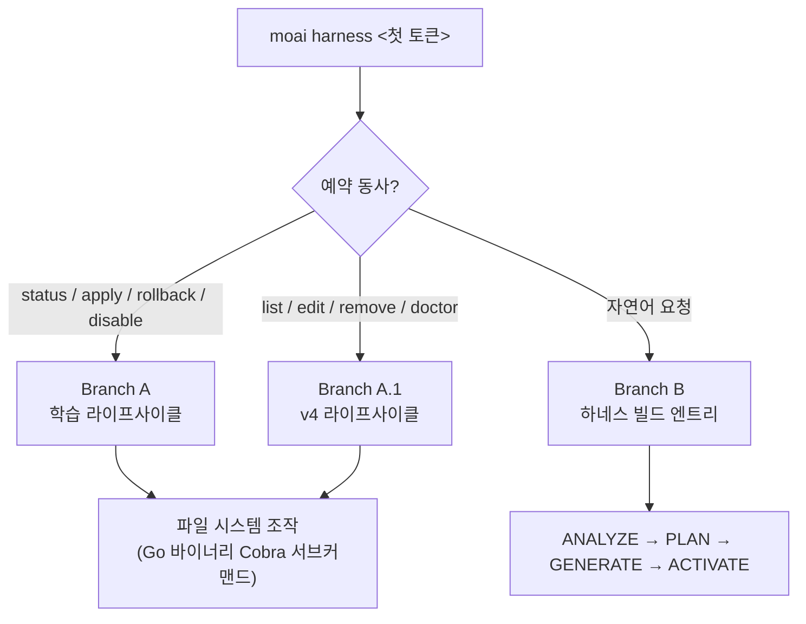

이 프로젝트에만 맞는 전문가 세트 (하네스)를 만들고, 하네스의 학습 라이프사이클을 관리합니다.


**슬래시 커맨드**: Claude Code에서 `/moai:harness <자연어 요청>`을 입력하면 이 명령어를 바로 실행할 수 있습니다.


## 개요

`/moai:harness`는 MoAI-ADK의 **Harness v4 Builder**를 돌려 프로젝트 요구사항에 맞는 전문가 세트를 만들어 냅니다. Builder는 오케스트레이터가 직접 굴리며 (Agent Teams 정적 계층이 아닙니다), 이렇게 만든 하네스는 manifest 기반 Runner가 서브에이전트(sub-agent)나 dynamic-workflow 프리미티브로 전문가를 하나씩 내보냅니다.

v3의 세 번째 핵심인 **에이전틱 하네스**를 가장 직접 체감하게 되는 명령어입니다. 하네스가 하네스를 만드는 재귀 구조, 그게 이 명령어의 본질입니다. 범용 에이전트 카탈로그로는 감당이 안 되는 프로젝트 고유 영역(예: 특정 DB 마이그레이션 절차, 사내 API 규약)이 있으면, 자연어 한 문장으로 그 영역을 맡을 전문가 팀의 뼈대를 세울 수 있습니다. 이렇게 만든 하네스는 **에이전틱 루프 엔지니어링** 서브시스템 (재귀적 자가 학습)으로 이어집니다. 쓰면서 쌓인 관찰이 일정 수준을 넘으면 하네스가 스스로 개선안을 내놓고, 사용자 승인 게이트를 지나 지침이 조금씩 바뀝니다.

### Harness v4 Builder란?

Harness v4 Builder는 Socratic 인터뷰를 바탕으로 4-phase 워크플로우 (ANALYZE → PLAN → GENERATE → ACTIVATE)를 돌며 전문가 세트를 짭니다. 이 4-phase는 오케스트레이터가 직접 밟습니다. dynamic-workflow 스크립트가 아닙니다.

| 단계 | 설명 |
|------|------|
| ANALYZE | 프로젝트 구조와 사용 언어, 이미 있는 에이전트 목록을 살핌 |
| PLAN | 전문가 수(3~5명), 각자의 역할, worktree 격리 여부를 정함 |
| GENERATE | `.claude/agents/harness/hns-<name>*-specialist.md` 전문가 파일, `.claude/commands/harness/<name>/manifest.json` (SSOT), `.claude/workflows/hns-<name>-run.js` Runner 생성 |
| ACTIVATE | manifest 등록 및 `/harness:<name>` 커맨드 활성화 (smoke gate) |

## 단일 `harness` 서브커맨드 라우팅

`moai harness`는 Cobra 서브커맨드 트리 하나로 되어 있고, 첫 번째 인자($ARGUMENTS의 첫 토큰)를 보고 세 갈래 중 하나로 빠집니다 — 명령어를 새로 늘리지 않는 **argument-branching 라우팅**입니다.

| 첫 토큰 | 라우팅 대상 | 설명 |
| ------- | ----------- | ---- |
| `status` / `apply` / `rollback` / `disable` | **Branch A — 학습 라이프사이클** | 관찰 누적 → 패턴 → 규칙 → 자동 진화 제안으로 이어지는 4계층 학습 시스템 관리 |
| `list` / `edit` / `remove` / `doctor` | **Branch A.1 — v4 라이프사이클** | 만들어 둔 하네스 목록 보기, 편집, 통째 삭제, 참조 무결성 진단 |
| 그 외 (자연어) | **Branch B — 하네스 빌드 엔트리** | v4 Builder의 ANALYZE → PLAN → GENERATE → ACTIVATE 4-phase로 새 하네스 만들기 |



모든 동사는 `moai harness <verb>`라는 하나의 Go 바이너리 Cobra 서브커맨드 트리를 거쳐 똑같이 dispatch됩니다. 학습 동사와 v4 동사가 서로 다른 Go 바이너리로 갈라지지 않습니다.

## 사용 방법

### 1단계: 자연어로 팀 생성 요청

```bash
> /moai:harness <자연어 요청>
```

**예시:**
```
우리 Go 백엔드 프로젝트에 맞는 전문가 팀을 만들어줘.
DB 마이그레이션, REST API 엔드포인트, 단위 테스트를 각각 담당할 팀이 필요해.
```

### 2단계: Builder의 자동 처리

Builder가 4-phase를 알아서 돕니다:

1. **ANALYZE**: Go, PostgreSQL, REST API 기술 스택을 감지
2. **PLAN**: DB Engineer, API Developer, Test Engineer 세 역할로 구성하기로 결정
3. **GENERATE**:
   - `.claude/agents/harness/hns-backend-team-db-specialist.md`
   - `.claude/agents/harness/hns-backend-team-api-specialist.md`
   - `.claude/agents/harness/hns-backend-team-test-specialist.md`
   - `.claude/commands/harness/backend-team/manifest.json` (SSOT)
   - `.claude/workflows/hns-backend-team-run.js` (Runner)
4. **ACTIVATE**: `/harness:backend-team` 커맨드 등록 (smoke gate)

### 3단계: 생성된 팀 활용

한 번 만들어 두면 이후 작업에서 그 팀이 알아서 붙습니다:

```bash
/moai run SPEC-BACKEND-001
```

MoAI가 SPEC 복잡도를 재고, manifest에 적힌 phase 순서대로 팀원에게 일을 넘깁니다.

## Harness v4 라이프사이클 관리 (Branch A.1)

만들어 둔 하네스는 `moai harness` 서브커맨드로 관리합니다. v4 라이프사이클 동사 네 개가 Go 바이너리 Cobra 서브커맨드로 dispatch됩니다.

### moai harness list

만들어 둔 하네스를 모두 훑어봅니다:

```bash
moai harness list
```

출력 정보: 하네스 이름, 도메인, 엔트리 커맨드, manifest에 적힌 스케줄 (적혀 있을 때만 표시).

### moai harness edit <name>

manifest.json과 에이전트 정의 파일의 경로를 짚어 주며 편집을 안내합니다 — SSOT는 manifest입니다:

```bash
moai harness edit backend-team
```

편집 대상:
- `.claude/commands/harness/<name>/manifest.json` (SSOT)
- `.claude/agents/harness/hns-<name>*-specialist.md` (전문가 정의)
- `.claude/skills/hns-<name>*/` (컴패니언 스킬)

### moai harness remove <name>

하네스와 딸린 파일을 한 번에, 남김없이 지웁니다:

```bash
moai harness remove backend-team
```

삭제되는 항목:
- `.claude/commands/harness/<name>.md` (thin-wrapper command)
- `.claude/commands/harness/<name>/manifest.json` (SSOT)
- `.claude/workflows/hns-<name>-run.js` (Runner)
- `.claude/agents/harness/hns-<name>*-specialist.md` (전문가)
- `.claude/skills/hns-<name>*/` (컴패니언 스킬)


`remove`는 fail-closed로 동작합니다 — 산출물 중 하나라도 안 보이면 삭제를 멈추고 어떤 파일이 없는지 알려 줍니다. 떠도는 산출물이 남지 않게 하려는 장치입니다.


### moai harness doctor

모든 하네스의 참조가 어긋나지 않았는지 확인하는 smoke gate입니다:

```bash
moai harness doctor
```

검사 항목:
- 하네스마다 manifest / specialist / skill 파일이 다 있는지
- manifest와 산출물이 서로 제대로 가리키고 있는지
- 스케줄 선언이 스키마에 맞는지 (어긋나면 ERROR 심각도)

## 하네스 학습 라이프사이클 — 에이전틱 루프 엔지니어링 (Branch A)

하네스는 한 번 만들고 끝나는 정적 산출물이 아닙니다. `moai harness` 서브커맨드로 **학습 서브시스템**의 라이프사이클을 관리합니다. 학습 동사 (status / apply / rollback / disable)는 Branch A로 빠집니다.

| 명령어 | 설명 |
|--------|------|
| `moai harness status` | 학습 상태 확인 (관찰 수, 패턴, 제안, tier 분포, rate-limit 윈도우) |
| `moai harness apply` | Tier-4 제안 적용 (오케스트레이터의 AskUserQuestion 승인 게이트를 지나야 함) |
| `moai harness rollback <YYYY-MM-DD>` | 해당 날짜의 스냅샷으로 되돌리기 (날짜 인자 필수) |
| `moai harness disable` | 학습 끄기 (harness.yaml에 `learning.enabled: false` 설정) |

**4계층 학습 사다리** — 관찰이 쌓일수록 한 칸씩 올라갑니다:

| Tier | 관찰 수 | 동작 |
|------|---------|------|
| TierObservation | ≥1 | 단순 기록 |
| TierHeuristic | ≥3 | 패턴 인식 |
| TierRule | ≥5 | 규칙 형성 |
| TierAutoUpdate | ≥10 | 자동 업데이트 제안 (사용자 승인 필수) |

**산출물**: `.moai/harness/` 디렉터리 (usage-log.jsonl, learned-rules.yaml, proposals/, learning-history/snapshots/)

### Tier-4 적용 게이트

Tier-4 (TierAutoUpdate) 제안은 파일에 손대기 전에 **반드시** 오케스트레이터가 띄우는 `AskUserQuestion` 라운드를 지나야 합니다. 워크플로우 본체는 오케스트레이터의 메인 컨텍스트에서 돌고, 하위 에이전트는 `AskUserQuestion`을 직접 부를 수 없습니다. 하위 에이전트에게 사용자 입력이 필요하면 정해진 형식의 blocker report를 돌려주고, 게이트는 오케스트레이터가 다시 엽니다.

승인이 떨어지면 5-layer safety pipeline이 돕니다:

1. **FrozenGuard** — path-prefix check (보호된 경로는 손대지 못하게 막음)
2. **Schema validation** — 제안 필드가 스키마에 맞는지 확인
3. **Diff inspection** — 무엇이 바뀌는지 들여다보기
4. **Rate-limit window** — 주당 최대 3회, 24시간 쿨다운 (harness.yaml `rate_limit`이 SSOT)
5. **Snapshot creation** — 손대기 전 스냅샷을 `.moai/harness/learning-history/snapshots/<ISO-DATE>/`에 저장


`moai harness apply --execute --id <proposal-id>` CLI 경로는 **게이트가 걸리지 않는 별도의 신뢰 경계**입니다 — `AskUserQuestion` 승인 게이트를 거치지 않고 Go execute pipeline로 곧장 적용합니다. CLI 프로세스는 사용자에게 물어볼 방법이 없기 때문에, `--execute`는 호출하기 전에 다른 방법으로 이미 승인을 받아 둔 쪽을 위한 명시적 opt-in입니다. `--execute` 없이 그냥 `apply`를 쓰면 payload만 JSON으로 뱉고 파일에는 손대지 않습니다.


자동 진화는 언제나 **사용자 승인 게이트** 아래에서만 적용됩니다. 마음에 안 들면 `moai harness rollback <YYYY-MM-DD>`로 언제든 되돌릴 수 있습니다.

## Manifest 구조

Harness v4는 전문가 세트의 구성을 **manifest.json** (`.claude/commands/harness/<name>/manifest.json`, SSOT)에 적어 둡니다. Runner는 이 manifest를 읽고 phase마다 전문가를 오케스트레이터 직속 서브에이전트나 dynamic-workflow 프리미티브로 내보냅니다 — Agent Teams 정적 계층에 등록해 두는 방식이 아닙니다.

### manifest.json 예시

```json
{
  "spec_id": "HARNESS-BACKEND-001",
  "name": "Backend Development Team",
  "version": "1.0.0",
  "created_at": "2026-07-01T10:00:00Z",
  "worktree_isolation": "L1_optional",
  
  "phases": [
    {
      "name": "plan",
      "teammates": [
        {
          "name": "architect",
          "role": "API 아키텍처 전문가",
          "model": "inherit",
          "skills": ["moai-foundation-core"]
        }
      ]
    },
    {
      "name": "run",
      "teammates": [
        {
          "name": "db-engineer",
          "role": "DB 설계 및 마이그레이션",
          "model": "inherit"
        },
        {
          "name": "api-developer",
          "role": "REST API 엔드포인트",
          "model": "inherit"
        },
        {
          "name": "test-engineer",
          "role": "단위 테스트",
          "model": "inherit"
        }
      ]
    }
  ]
}
```

### Phase 필드

| 필드 | 설명 |
|------|------|
| `name` | 단계 이름 (`plan`, `run`, `sync`) |
| `teammates` | 이 단계에 들어올 팀원 배열 |

### Teammate 필드

| 필드 | 기본값 | 설명 |
|------|--------|------|
| `name` | 필수 | 팀원을 구분하는 고유 이름 |
| `role` | 필수 | 이 팀원이 맡는 역할 |
| `model` | `inherit` | 쓸 모델 (`inherit`, `sonnet`, `opus`) |
| `skills` | `[]` | 미리 읽어 둘 스킬 목록 |

팀원마다 모델을 따로 지정할 수 있다는 점 (`model` 필드) 역시 비용 절감 설계의 연장선입니다. 아키텍처를 결정하는 무거운 역할과 반복적인 테스트를 찍어 내는 가벼운 역할에 굳이 같은 모델을 붙일 이유가 없습니다.

## Worktree 격리

Harness v4에서 worktree 격리는 골라 쓸 수 있습니다.

### L1_optional (기본값)

```json
"worktree_isolation": "L1_optional"
```

동시에 움직이는 팀원끼리 부딪히면 Claude Code가 알아서 L1 워크트리를 만들어 줍니다.

- **선택적**: 충돌이 났을 때만 격리
- **자동**: 런타임이 충돌을 감지하는 즉시 생성
- **비용**: 워크트리를 나누면 메모리를 더 씀

### none

```json
"worktree_isolation": "none"
```

팀원 모두가 프로젝트 루트에서 그대로 작업합니다 (메모리를 가장 적게 씀).

## 전문가 디스패치 워크플로우

하네스가 켜지면 manifest 기반 Runner가 그 전문가 세트를 알아서 씁니다.

### SPEC 실행 시 전문가 디스패치

```bash
> /moai run SPEC-BACKEND-001
```

**오케스트레이터가 직접 판단하는 순서:**
1. SPEC 복잡도를 어림잡음 (파일 수, 코드 라인 수)
2. 알맞은 하네스를 고름
3. manifest의 phase 순서대로 전문가를 서브에이전트(sub-agent)나 dynamic-workflow 프리미티브로 내보냄

### Phase 기반 디스패치 예시

```
PLAN Phase:
  → architect 전문가가 아키텍처 설계 담당

RUN Phase:
  → db-specialist, api-specialist 순차 서브에이전트 디스패치
  → test-specialist 서브에이전트 디스패치 (테스트)

SYNC Phase:
  → 문서 생성 및 PR 작성 (기본 manager-docs)
```

## 자연어 요청만으로 충분한 이유

Harness v4 Builder는 Socratic 인터뷰로 요구사항을 캐냅니다.

### 효과적인 요청 예시

```
우리 팀은 Python FastAPI 백엔드를 개발 중입니다.
API 엔드포인트, 데이터 검증, 에러 핸들링을 잘하는 팀이 필요합니다.
```

Builder가 알아서 이렇게 처리합니다:
- Python, FastAPI, asyncio 기술 스택을 감지
- 팀 규모를 3~5명으로 결정
- 팀원마다 맡을 영역을 정함
- 필요한 스킬을 미리 읽어 둠

### 요청이 흐릿하면 Builder가 물어봅니다

```
팀이 필요합니다.

→ Builder: 프로젝트의 주요 기술은? (언어, 프레임워크)
→ Builder: 팀이 집중할 영역은? (백엔드, 프론트엔드, 전체)
→ Builder: 특별히 필요한 전문성은?
```

## 관련 문서

- [Harness v4 Builder 가이드](/ko/advanced/builder-agents) - Builder 4-phase 상세
- [에이전트 가이드](/ko/advanced/agent-guide) - 11개 에이전트 카탈로그 이해
- [SPEC 기반 개발](/ko/workflow-commands/moai-plan) - SPEC 워크플로우 개요


**팁**: 하네스는 한 번만 만들어 두면 이후 작업에서 그 팀이 알아서 붙습니다. `/harness:team-name` 커맨드로 언제든 다시 불러 쓸 수 있습니다.

