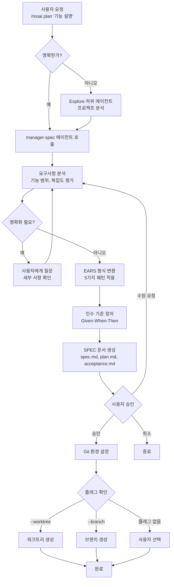
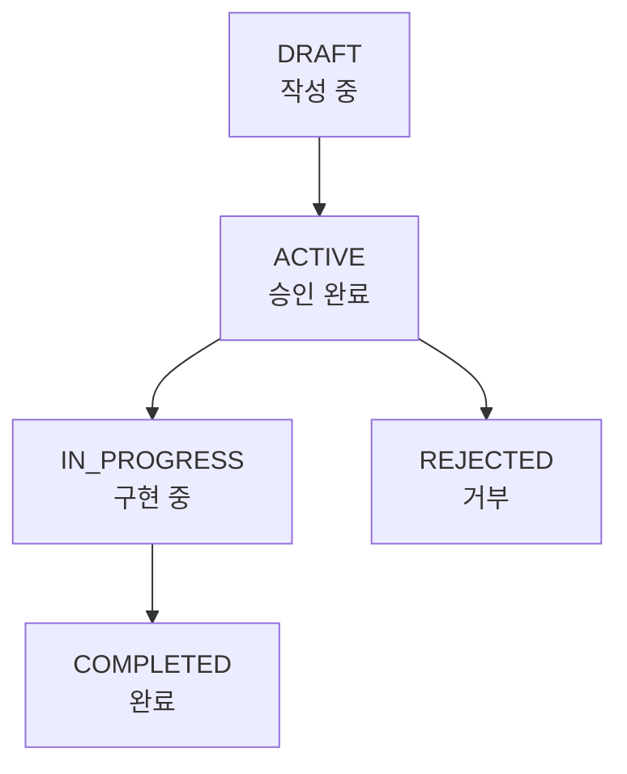

EARS 형식으로 명확한 SPEC 문서를 생성하여, AI와 나눈 대화를 영구적인 요구사항
문서로 만듭니다.


**슬래시 커맨드**: Claude Code에서 `/moai:plan`을 입력하면 이 명령어를 바로 실행할 수 있습니다. `/moai`만 입력하면 사용 가능한 모든 서브커맨드 목록이 표시됩니다.


## 개요

`/moai plan`은 MoAI-ADK 워크플로우의 **Phase 1 (Plan)** 명령어입니다. 자연어로
된 기능 요청을 **EARS** (Easy Approach to Requirements Syntax) 형식의 구조화된
SPEC 문서로 변환합니다. 내부적으로 **manager-spec** 에이전트가 요구사항을
분석하고, 모호함 없는 명세서를 생성합니다.



**SPEC이 왜 필요한가요?**

**바이브코딩** (Vibe Coding)의 가장 큰 문제는 **맥락 유실**입니다.

AI와 대화하다 세션이 끊기면 **이전 논의 내용이 모두 사라집니다**. 토큰 한도를
초과하면 **오래된 대화부터 잘립니다**. 다음 날 작업을 재개하면 **어제 결정한
사항을 기억하지 못합니다**.

**SPEC 문서가 이 문제를 해결합니다.**

요구사항을 **파일로 저장**하여 영구 보존합니다. EARS 형식으로 **모호함 없이**
구조화합니다. 세션이 끊겨도 SPEC만 읽으면 **이어서 작업**할 수 있습니다.



## 사용법

Claude Code 대화창에서 다음과 같이 입력합니다:

```bash
> /moai plan "구현하고 싶은 기능 설명"
```

**사용 예시:**

```bash
# 간단한 기능
> /moai plan "사용자 로그인 기능"

# 상세한 기능 설명
> /moai plan "JWT 기반 사용자 인증: 로그인, 회원가입, 토큰 갱신 API"

# 리팩토링 요청
> /moai plan "레거시 인증 시스템을 JWT 기반으로 리팩토링"
```

## 지원 플래그

| 플래그              | 설명                        | 예시                                |
| ------------------- | --------------------------- | ----------------------------------- |
| `--worktree`        | 워크트리 자동 생성 (최우선) | `/moai plan "기능" --worktree`      |
| `--branch`          | 전통적 브랜치 생성          | `/moai plan "기능" --branch`        |
| `--resume SPEC-XXX` | 중단된 SPEC 작업 재개       | `/moai plan --resume SPEC-AUTH-001` |
| `--team`            | 에이전트 팀 모드 강제       | `/moai plan "기능" --team`          |
| `--solo`            | 하위 에이전트 모드 강제     | `/moai plan "기능" --solo`          |
| `--seq`             | 병렬 대신 순차 진단          | `/moai plan "기능" --seq`           |
| `--ultrathink`      | Sequential Thinking MCP 활성화 | `/moai plan "기능" --ultrathink`  |

### 플래그 우선순위

플래그가 여러 개 지정되면 다음 순서로 적용됩니다:

1. **--worktree** (최우선): 독립된 Git 워크트리 생성
2. **--branch** (차선): 전통적 feature 브랜치 생성
3. **플래그 없음** (기본): SPEC만 생성, 사용자 선택에 따라 브랜치 생성

### --worktree 플래그

SPEC 생성과 동시에 **독립된 Git 워크트리**를 만들어 병렬 개발 환경을 준비합니다:

```bash
> /moai plan "결제 시스템 구현" --worktree
```

이 옵션을 사용하면:

1. SPEC 문서를 생성합니다
2. SPEC를 커밋합니다 (워크트리 생성 필수 조건)
3. `feature/SPEC-{ID}` 브랜치로 워크트리를 생성합니다
4. 메인 코드에 영향 없이 독립적으로 개발할 수 있습니다


  `--worktree` 옵션은 **여러 기능을 동시에 개발**할 때 유용합니다. 각 SPEC이
  독립된 워크트리에서 작업되므로 서로 충돌하지 않습니다.


## EARS 형식 요구사항

SPEC 문서는 **EARS** (Easy Approach to Requirements Syntax) 형식으로 요구사항을
정의합니다. 5가지 패턴이 있으며, manager-spec 에이전트가 자연어를 자동으로
적절한 패턴으로 변환합니다.

| 패턴             | 형식                          | 용도               | 예시                                             |
| ---------------- | ----------------------------- | ------------------ | ------------------------------------------------ |
| **Ubiquitous**   | "시스템은 ~해야 한다"         | 항상 적용되는 규칙 | "시스템은 모든 API 요청을 로깅해야 한다"         |
| **Event-driven** | "WHEN ~하면, THEN ~해야 한다" | 이벤트 반응        | "WHEN 로그인하면, THEN JWT를 발급해야 한다"      |
| **State-driven** | "WHILE ~인 동안, ~해야 한다"  | 상태 기반 동작     | "WHILE 로그인 상태인 동안, 세션을 유지해야 한다" |
| **Unwanted**     | "시스템은 ~하면 안 된다"      | 금지 사항          | "시스템은 비밀번호를 평문 저장하면 안 된다"      |
| **Optional**     | "가능하다면, ~해야 한다"      | 선택적 기능        | "가능하다면, 2단계 인증을 지원해야 한다"         |


  EARS 형식을 외울 필요는 없습니다. manager-spec 에이전트가 자연어를 **자동으로
  변환**합니다. 여러분은 원하는 기능을 자연스럽게 설명하기만 하면 됩니다.


## 실행 과정

`/moai plan`이 내부적으로 수행하는 과정입니다:



**핵심 포인트:**

- 요청이 불명확하면 **Explore 하위 에이전트**가 프로젝트를 분석합니다
- manager-spec 에이전트가 요구사항이 불분명하면 **사용자에게 추가 질문**을
  합니다
- 모든 요구사항에 **Given-When-Then 형식의 인수 기준**을 자동 생성합니다
- 생성된 SPEC 문서는 사용자의 **승인을 받은 후** 확정됩니다

## SPEC 생성 단계

### Phase 1A: 프로젝트 분석 (선택적)

요청이 모호하거나 프로젝트 상황을 파악해야 할 때 실행됩니다:

| 실행 조건                | 생략 조건               |
| ------------------------ | ----------------------- |
| 불명확한 요청            | 명확한 SPEC 제목        |
| 기존 파일/패턴 발견 필요 | resume 시나리오         |
| 프로젝트 상태 불확실     | 기존 SPEC 컨텍스트 존재 |

### Phase 1B: SPEC 계획

**manager-spec** 에이전트가 다음 작업을 수행합니다:

- 프로젝트 문서 분석 (product.md, structure.md, tech.md)
- 1-3개 SPEC 후보 제안 및 네이밍
- 중복 SPEC 확인 (.moai/specs/)
- EARS 구조 설계
- 구현 계획 및 기술 제약조건 식별
- 라이브러리 버전 확인 (안정버전만, beta/alpha 제외)

### Phase 1.5: 사전 검증 게이트

SPEC 생성 전 일반적인 오류를 방지합니다:

**Step 1 - 문서 유형 분류:**

- SPEC, Report, Documentation 키워드 감지
- Report는 .moai/reports/로 라우팅
- Documentation은 .moai/docs/로 라우팅

**Step 2 - SPEC ID 검증 (모든 검사 통과 필수):**

- **ID 형식**: `SPEC-도메인-번호` 패턴 (예: `SPEC-AUTH-001`)
- **도메인 이름**: 승인된 도메인 목록 (AUTH, API, UI, DB, REFACTOR, FIX, UPDATE,
  PERF, TEST, DOCS, INFRA, DEVOPS, SECURITY 등)
- **ID 유일성**: .moai/specs/에서 중복 확인
- **디렉토리 구조**: 반드시 디렉토리 생성, 플랫 파일 금지

**복합 도메인 규칙:** 최대 2개 도메인 권장 (예: UPDATE-REFACTOR-001), 최대 3개
허용

### Phase 2: SPEC 문서 생성

세 개 파일이 동시에 생성됩니다:

**spec.md:**

- YAML 프론트매터 (7개 필수 필드: id, version, status, created, updated, author,
  priority)
- HISTORY 섹션 (프론트매터 바로 다음)
- 완전한 EARS 구조 (5가지 요구사항 유형)
- conversation_language로 작성된 콘텐츠

**plan.md:**

- 작업 분해 구현 계획
- 기술 스택 명세 및 의존성
- 위험 분석 및 완화 전략

**acceptance.md:**

- 최소 2개 Given/When/Then 시나리오
- 엣지 케이스 테스트 시나리오
- 성능 및 품질 게이트 기준

**품질 제약조건:**

- 요구사항 모듈: SPEC당 최대 5개
- 인수 기준: 최소 2개 Given/When/Then 시나리오
- 기술 용어와 함수명은 영어 유지

### Phase 3: Git 환경 설정 (조건부)

**실행 조건:** Phase 2 완료 AND 다음 중 하나:

- --worktree 플래그 제공
- --branch 플래그 제공 또는 사용자가 브랜치 생성 선택
- 설정에서 브랜치 생성 허용 (git_strategy 설정)

**생략 시점:** develop_direct 워크플로우, 플래그 없고 "현재 브랜치 사용" 선택

## 출력 결과

SPEC 문서는 `.moai/specs/` 디렉토리에 저장됩니다:

```
.moai/
└── specs/
    └── SPEC-AUTH-001/
        ├── spec.md          # EARS 요구사항
        ├── plan.md          # 구현 계획
        └── acceptance.md     # 인수 기준
```

**SPEC 문서의 기본 구조:**

```yaml
---
id: SPEC-AUTH-001
version: 1.0.0
status: ACTIVE
created: 2026-01-28
updated: 2026-01-28
author: 개발팀
priority: HIGH
---
```

## SPEC 상태 관리

SPEC 문서는 다음과 같은 상태 라이프사이클을 가집니다:



| 상태          | 설명                 | `/moai run` 실행 가능 |
| ------------- | -------------------- | --------------------- |
| `DRAFT`       | 아직 작성 중         | 아니오                |
| `ACTIVE`      | 승인 완료, 구현 대기 | **예**                |
| `IN_PROGRESS` | 현재 구현 중         | 예 (이어서)           |
| `COMPLETED`   | 구현 및 검증 완료    | 아니오                |
| `REJECTED`    | 거부됨, 재작성 필요  | 아니오                |

## 실전 예시

### 예시: JWT 인증 SPEC 생성

**1단계: 명령어 실행**

```bash
> /moai plan "JWT 기반 사용자 인증 시스템: 회원가입, 로그인, 토큰 갱신"
```

**2단계: manager-spec이 질문** (필요시)

manager-spec 에이전트가 세부 사항을 확인하기 위해 질문할 수 있습니다:

- "비밀번호 최소 길이는 몇 자인가요?"
- "토큰 만료 시간은 얼마로 설정하나요?"
- "소셜 로그인도 포함하나요?"

**3단계: SPEC 문서 생성 결과**

다음과 같은 구조의 SPEC 문서가 생성됩니다:

```yaml
---
id: SPEC-AUTH-001
title: JWT 기반 사용자 인증 시스템
priority: HIGH
status: ACTIVE
---
```

```markdown
# 요구사항 (EARS 형식)

## Ubiquitous

- 시스템은 모든 비밀번호를 bcrypt로 해싱하여 저장해야 한다
- 시스템은 모든 인증 요청을 로깅해야 한다

## Event-driven

- WHEN 유효한 자격증명으로 로그인하면, THEN JWT 액세스 토큰(1시간)과 리프레시
  토큰(7일)을 발급해야 한다

## Unwanted

- 시스템은 비밀번호를 평문으로 저장하면 안 된다
- 시스템은 만료된 토큰으로 API 접근을 허용하면 안 된다
```

**4단계: 사용자 승인 후 Git 환경 설정**

```bash
# --worktree 플래그 사용 시
> /moai plan "JWT 인증" --worktree

# 결과:
# 1. SPEC 문서 생성 (.moai/specs/SPEC-AUTH-001/)
# 2. SPEC 커밋 (feat(spec): Add SPEC-AUTH-001)
# 3. 워크트리 생성 (.git/worktrees/SPEC-AUTH-001)
# 4. 워크트리 경로 표시
```

**5단계: `/clear` 실행 후 구현 단계로 이동**

```bash
# 토큰 정리
> /clear

# 구현 시작
> /moai run SPEC-AUTH-001
```

## 자주 묻는 질문

### Q: SPEC 문서를 수동으로 수정할 수 있나요?

네, `.moai/specs/SPEC-XXX/spec.md` 파일을 직접 편집할 수 있습니다. 요구사항을
추가하거나 인수 기준을 수정한 후 `/moai run`을 실행하면 수정된 내용이
반영됩니다.

### Q: SPEC 없이 바로 코드를 작성할 수는 없나요?

Claude Code에서 직접 코드를 작성할 수도 있지만, SPEC 없이 작업하면 세션이 끊길
때마다 맥락을 잃게 됩니다. **복잡한 기능일수록 SPEC을 먼저 만드는 것이
효율적**입니다.

### Q: SPEC ID는 어떤 규칙으로 생성되나요?

`SPEC-도메인-번호` 형식입니다 (예: `SPEC-AUTH-001`)

- `SPEC-AUTH-001`: 인증 관련 첫 번째 SPEC
- `SPEC-PAYMENT-002`: 결제 관련 두 번째 SPEC

도메인은 기능의 영역에 따라 manager-spec이 자동으로 결정합니다.

### Q: `/moai plan`과 `/moai`의 차이는 무엇인가요?

`/moai plan`은 **SPEC 문서 생성만** 담당합니다. `/moai`는 SPEC 생성부터 구현,
문서화까지 **전체 워크플로우**를 자동으로 수행합니다.

### Q: --worktree와 --branch의 차이는 무엇인가요?

**--worktree**는 독립된 작업 디렉토리를 생성하여 완전히 격리된 환경을
제공합니다. **--branch**는 현재 리포지토리에 새 브랜치를 만듭니다. 여러 기능을
동시에 개발하려면 --worktree를 추천합니다.

## v2.9.0 신규 기능

### Delta Markers (브라운필드 분류)

기존 코드베이스(브라운필드) 프로젝트에서 SPEC 요구사항을 분류합니다.

| 마커 | 의미 | 설명 |
|------|------|------|
| `[EXISTING]` | 기존 유지 | 변경 없이 참조만 |
| `[MODIFY]` | 수정 | 기존 코드 변경 |
| `[NEW]` | 신규 | 새로 생성 |
| `[REMOVE]` | 삭제 | 기존 코드 제거 |

### spec-compact.md 생성

Plan phase에서 SPEC 문서의 요약본(`spec-compact.md`)을 자동 생성합니다. Run phase에서 ~30% 토큰을 절약합니다.

### Exclusions 필수화 ("What NOT to Build")

모든 SPEC 문서에 **Out of Scope / Exclusions** 섹션이 필수입니다. 범위 이탈을 사전에 방지합니다.

### What/Why 제약

SPEC 요구사항은 **What** (무엇)과 **Why** (왜)만 기술합니다. **How** (어떻게)는 구현 단계에서 결정하며, SPEC에 과명세하지 않습니다.

### Decision Point 3.5: 실행 모드 선택 게이트

Plan 완료 후 Run 시작 전, 실행 환경을 자동 감지하고 사용자에게 최적 모드를 제안합니다.

**감지 항목:**
1. tmux 가용성 (`$TMUX` 환경 변수)
2. 현재 LLM 모드 (`llm.yaml`의 `team_mode`: cc/glm/cg)

**tmux 사용 가능 시:**
- Worktree + \{현재 모드\} (Recommended)
- Team Mode (in-process)
- Sub-agent Mode (sequential)

**tmux 사용 불가 시:**
- Sub-agent Mode (Recommended)
- Team Mode (in-process)

## 관련 문서

- [SPEC 기반 개발](/core-concepts/spec-based-dev) - EARS 형식 상세 설명
- [/moai run](./moai-2-run) - 다음 단계: DDD 구현
- [/moai sync](./moai-3-sync) - 최종 단계: 문서 동기화
