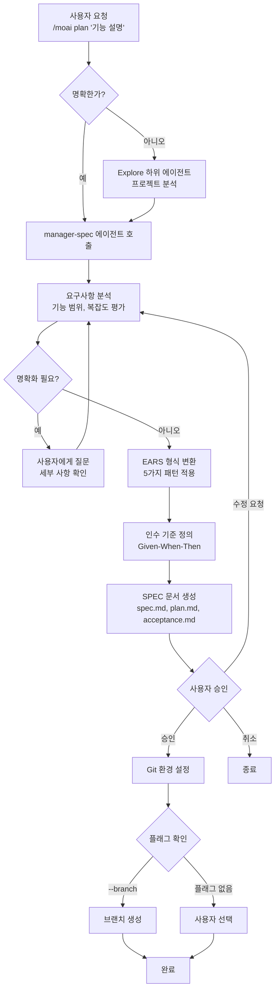
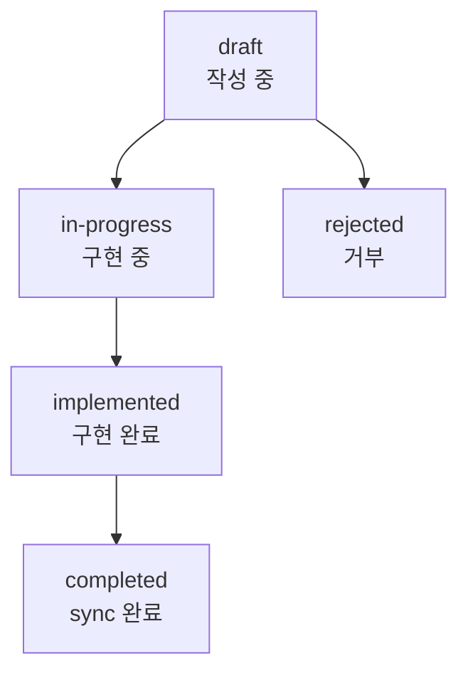

AI와 나눈 대화를 오래 남는 요구사항 문서로 바꿉니다. 자연어로 던진 요청이 구조화된 SPEC 문서가 되고, 이 문서가 이후 모든 단계의 기준이 됩니다.


**슬래시 커맨드**: Claude Code에서 `/moai:plan`을 입력하면 이 명령어를 바로 실행할 수 있습니다. `/moai`만 입력하면 사용 가능한 모든 서브커맨드 목록이 표시됩니다.


## 개요

`/moai plan`은 MoAI-ADK 워크플로우의 **Phase 1 (Plan)** 명령어입니다. 자연어로 적은 기능 요청을 **GEARS** (Generalized Expression for AI-Ready Specs) 형식의 SPEC 문서로 바꿉니다. 안에서는 **manager-spec** 에이전트가 요구사항을 뜯어보고 해석의 여지가 없는 명세서를 씁니다.

v3.0.0부터 GEARS가 정본 표기법이고, 기존 **EARS** (Easy Approach to Requirements Syntax)는 6개월간 하위 호환으로 남습니다. 두 표기법의 차이와 마이그레이션은 [GEARS 표기법 섹션](#gears-notation)을 참조하세요.

계획 단계는 v3 비용 설계에서 추론을 가장 깊게 쓰는 자리입니다. 여기서 요구사항이 또렷해질수록 뒤따르는 구현 단계에서 다시 손대는 일과 토큰 낭비가 줄어듭니다. 그래서 MoAI-ADK는 "계획은 깊게, 구현은 싸게"라는 배분 원칙을 따릅니다. 만들어진 SPEC은 **plan-auditor**가 따로 감사합니다. 만든 에이전트가 자기 결과를 스스로 채점하지 않습니다.



**SPEC이 왜 필요한가요?**

**바이브코딩** (Vibe Coding)에서 가장 크게 걸리는 문제가 **맥락 유실**입니다.

AI와 대화하다 세션이 끊기면 **앞서 나눈 논의가 통째로 사라집니다**. 토큰 한도를 넘기면 **오래된 대화부터 잘려 나갑니다**. 다음 날 다시 앉으면 AI는 **어제 무엇을 정했는지 기억하지 못합니다**.

**SPEC 문서가 여기를 막아 줍니다.**

요구사항을 **파일로 저장**해 두면 사라지지 않습니다. v3.0.0부터 정식 표기법인 **GEARS** 형식으로 **해석의 여지 없이** 정리합니다 (기존 EARS 표기법은 6개월간 하위 호환 유지). 세션이 끊겨도 SPEC만 다시 읽으면 **하던 자리에서 이어서** 작업할 수 있습니다.



## 사용법

Claude Code 대화창에서 다음과 같이 입력합니다:

```bash
> /moai plan "구현하고 싶은 기능 설명"
```

**사용 예시:**

```bash
# 간단한 기능
> /moai plan "사용자 로그인 기능"

# 상세한 기능 설명
> /moai plan "JWT 기반 사용자 인증: 로그인, 회원가입, 토큰 갱신 API"

# 리팩토링 요청
> /moai plan "레거시 인증 시스템을 JWT 기반으로 리팩토링"
```

## 지원 플래그

| 플래그         | 설명                              | 예시                                     |
| -------------- | --------------------------------- | ---------------------------------------- |
| `--branch`     | 전통적 브랜치 생성                | `/moai plan "기능" --branch`             |
| `--resume`     | 기존 SPEC에서 이어서 계획 재개    | `/moai plan --resume SPEC-AUTH-001`      |
| `--issue`      | GitHub 이슈 생성 (옵트인)         | `/moai plan "기능" --issue`              |

### 플래그 우선순위

브랜치 전략 플래그가 지정되면 다음 순서로 적용됩니다:

1. **--branch**: 전통적 feature 브랜치 생성
2. **플래그 없음** (기본): SPEC만 생성, BODP 게이트에서 사용자가 브랜치 전략을 선택

`--issue`는 브랜치 전략과 별개로 켜고 끄는 옵션입니다. **GitHub 이슈는 기본적으로 만들지 않으며**(late-branch 옵트인 정책), 이슈가 필요하면 `--issue` 플래그를 직접 붙여야 합니다.

### 워크트리에서 계획하려면

plan은 작업 공간을 만들지 않습니다. 격리된 환경에서 계획하려면 **먼저 워크트리에 들어간 뒤** plan을 실행하세요:

```bash
moai cc -w payment          # 워크트리에 진입 (그 자리에서)
> /moai plan "결제 시스템 구현"
```

현재 세션을 유지한 채 새 tmux 창에서 열려면 `--spawn`을 붙입니다:

```bash
moai cc -w payment --spawn
```


  **여러 기능을 동시에 개발**할 때는 기능마다 워크트리를 따로 잡으면 서로 부딪히지
  않습니다. 진입은 런처가 맡고, plan은 그 안에서 그대로 돌아갑니다.


## 요구사항 표기법 (EARS / GEARS)

SPEC 문서는 **EARS** (Easy Approach to Requirements Syntax) 형식으로 요구사항을 적습니다. 패턴은 다섯 가지이고, manager-spec 에이전트가 자연어를 알맞은 패턴으로 알아서 옮겨 줍니다.

v3.0.0부터는 **GEARS** (Generalized Expression for AI-Ready Specs)가 정식 표기법입니다. EARS의 다섯 가지 핵심 패턴은 그대로 두되, AI 코딩 에이전트가 더 또렷하게 읽도록 의미 경계를 다듬은 표기법입니다. 기존 EARS는 6개월간 하위 호환으로 남고, 새로 쓰는 SPEC은 GEARS 패턴을 따르기를 권합니다. 두 표기법의 차이와 마이그레이션은 [GEARS 표기법 섹션](#gears-notation)을 참조하세요.

| 패턴             | 형식                          | 용도               | 예시                                             |
| ---------------- | ----------------------------- | ------------------ | ------------------------------------------------ |
| **Ubiquitous**   | "시스템은 ~해야 한다"         | 항상 적용되는 규칙 | "시스템은 모든 API 요청을 로깅해야 한다"         |
| **Event-driven** | "WHEN ~하면, THEN ~해야 한다" | 이벤트 반응        | "WHEN 로그인하면, THEN JWT를 발급해야 한다"      |
| **State-driven** | "WHILE ~인 동안, ~해야 한다"  | 상태 기반 동작     | "WHILE 로그인 상태인 동안, 세션을 유지해야 한다" |
| **Unwanted**     | "시스템은 ~하면 안 된다"      | 금지 사항          | "시스템은 비밀번호를 평문 저장하면 안 된다"      |
| **Optional**     | "가능하다면, ~해야 한다"      | 선택적 기능        | "가능하다면, 2단계 인증을 지원해야 한다"         |


  EARS 형식을 외울 필요는 없습니다. manager-spec 에이전트가 자연어를 **알아서
  옮겨 줍니다**. 원하는 기능을 말하듯이 설명하기만 하면 됩니다.


## 실행 과정

`/moai plan`이 내부적으로 수행하는 과정입니다:


```mermaid
flowchart TD
    A["사용자 요청<br/>/moai plan '기능 설명'"] --> B{명확한가?}
    B -->|아니오| C["Explore 하위 에이전트<br/>프로젝트 분석"]
    B -->|예| D["manager-spec 에이전트 호출"]
    C --> D
    D --> E["요구사항 분석<br/>기능 범위, 복잡도 평가"]
    E --> F{"명확화 필요?"}
    F -->|예| G["사용자에게 질문<br/>세부 사항 확인"]
    G --> E
    F -->|아니오| H["EARS 형식 변환<br/>5가지 패턴 적용"]
    H --> I["인수 기준 정의<br/>Given-When-Then"]
    I --> J["SPEC 문서 생성<br/>spec.md, plan.md, acceptance.md"]
    J --> K{"사용자 승인"}
    K -->|승인| L["Git 환경 설정"]
    K -->|수정 요청| E
    K -->|취소| M["종료"]
    L --> N{"플래그 확인"}
    N -->|--branch| P["브랜치 생성"]
    N -->|플래그 없음| Q["사용자 선택"]
    P --> R["완료"]
    Q --> R
```

**핵심 포인트:**

- 요청이 흐릿하면 **Explore 하위 에이전트**가 프로젝트를 먼저 들여다봅니다
- 요구사항이 여전히 불분명하면 manager-spec 에이전트가 **사용자에게 되묻습니다**
- 모든 요구사항에 **Given-When-Then 형식의 인수 기준**이 자동으로 붙습니다
- 만들어진 SPEC 문서는 사용자가 **승인해야** 확정됩니다

## SPEC 생성 단계

`/moai plan`은 15개 Phase와 2개 Decision Point로 짜인 워크플로우를 따릅니다. Phase 1-3은 맥락 파악, Phase 4-7은 심층 인터뷰, Phase 8부터가 본격적인 SPEC 조립입니다.

### Phase 1-3: 컨텍스트 발견

| Phase | 이름 | 설명 |
|-------|------|------|
| Phase 1 | Brain 제안 감지 | Brain IDEA 스캔 및 SPEC 후보 식별 |
| Phase 2 | 프로젝트 탐색 (선택) | `Explore` 서브에이전트 코드베이스 분석 |
| Phase 3 | 명확도 평가 | 1-10 점수 기반 명확도 평가 및 건너뛰기 조건 |

요청이 모호하거나 프로젝트 상황부터 봐야 할 때 Phase 1-3이 돌아갑니다. 요청이 이미 또렷하면 Phase 3에서 건너뛸 수 있습니다.

### Phase 4-7: 심층 인터뷰

명확도 점수가 4-10인 경우 실행됩니다:

| Phase | 이름 | 설명 |
|-------|------|------|
| Phase 4 | 심층 인터뷰 루프 | 1-5 라운드 주제 중심 인터뷰 |
| Phase 5 | UltraThink 자동 활성화 | 복잡도 ≥ 7일 때 확장 추론 활성화 |
| Phase 6 | 심층 리서치 | `Explore` 서브에이전트 research.md 산출물 |
| Phase 7 | 디자인 방향 | UI/UX 키워드 감지 시 의도 우선 디자인 방향 |

### Phase 8: SPEC 계획

**manager-spec** 에이전트가 다음 작업을 수행합니다:

- 프로젝트 문서 분석 (product.md, structure.md, tech.md)
- 1-3개 SPEC 후보 제안 및 네이밍
- 중복 SPEC 확인 (.moai/specs/)
- GEARS 구조 설계 (EARS 레거시 형식도 허용)
- 구현 계획 및 기술 제약조건 식별
- 라이브러리 버전 확인 (안정버전만, beta/alpha 제외)

### Decision Point 1: 사용자 승인 게이트 (HUMAN GATE)

Phase 8이 끝나면 사용자가 직접 승인해야 다음 단계로 넘어갑니다. 선택지는 네 가지입니다:

| 선택 | 의미 |
|------|------|
| **Proceed** | 현재 SPEC으로 진행 |
| **Annotate** | 피드백 반영 후 재작성 (1-6 라운드 반복) |
| **Draft** | SPEC을 draft 상태로 보존하고 대기 |
| **Cancel** | SPEC 생성 중단 |

### Phase 9: 사전 검증 게이트

SPEC을 만들기 전에 흔한 실수부터 걸러 냅니다:

**Step 1 - 문서 유형 분류:**

- SPEC, Report, Documentation 키워드 감지
- Report는 .moai/reports/로 라우팅
- Documentation은 .moai/docs/로 라우팅

**Step 2 - SPEC ID 검증 (모든 검사 통과 필수):**

- **ID 형식**: `SPEC-도메인-번호` 패턴 (예: `SPEC-AUTH-001`)
- **도메인 이름**: 승인된 도메인 목록 (AUTH, API, UI, DB, REFACTOR, FIX, UPDATE,
  PERF, TEST, DOCS, INFRA, DEVOPS, SECURITY 등)
- **ID 유일성**: .moai/specs/에서 중복 확인
- **디렉토리 구조**: 반드시 디렉토리 생성, 플랫 파일 금지

**복합 도메인 규칙:** 최대 2개 도메인 권장 (예: UPDATE-REFACTOR-001), 최대 3개 허용

### Phase 10: SPEC 문서 생성

파일 세 개가 한꺼번에 만들어집니다:

**spec.md:**

- YAML 프론트매터 (**12개 필수 필드**: id, title, version, status, created, updated,
  author, priority, phase, module, lifecycle, tags)
- HISTORY 섹션 (프론트매터 바로 다음)
- 완전한 GEARS/EARS 구조 (5가지 요구사항 유형)
- conversation_language로 작성된 콘텐츠

**plan.md:**

- 작업 분해 구현 계획
- 기술 스택 명세 및 의존성
- 위험 분석 및 완화 전략

**acceptance.md:**

- 최소 2개 Given/When/Then 시나리오
- 엣지 케이스 테스트 시나리오
- 성능 및 품질 게이트 기준

**품질 제약조건:**

- 요구사항 모듈: SPEC당 최대 5개
- 인수 기준: 최소 2개 Given/When/Then 시나리오
- 기술 용어와 함수명은 영어 유지

### Phase 11: plan-auditor 독립 감사

**plan-auditor** 서브에이전트가 manager-spec이 쓴 SPEC 산출물을 따로 감사합니다. 만든 에이전트가 자기 결과를 채점하지 않는다는 **독립 감사 원칙**을 지키기 위해서입니다.

- 최대 3회까지 반복 (Retry Loop Contract)
- 라운드를 돌다 점수가 떨어지면 STOP 신호와 함께 범위를 줄이자고 제안
- 판정은 PASS / PASS-with-debt / FAIL 세 가지
- 감사 보고서는 `.moai/reports/plan-audit/`에 쌓입니다

### Phase 12: GitHub 이슈 생성 (조건부)

이 단계는 기본적으로 **건너뜁니다** (late-branch 옵트인 정책). `--issue` 플래그를 직접 붙인 경우에만 GitHub 이슈를 만들고 SPEC과 서로 참조하도록 연결합니다.

### Phase 13: Git 환경 설정 (조건부)

**BODP (Branch Origin Decision Protocol) 게이트**를 통해 브랜치 전략을 결정합니다:

- **--branch**: 전통적 feature 브랜치 생성
- **현재 브랜치 유지**: 플래그 없이 현재 체크아웃에서 계속

### Phase 14: MX 태그 계획

구현 단계에서 `@MX` 코드 주석을 어디에 달지 미리 짚어 둡니다:

- `@MX:ANCHOR` — 불변 계약 (high fan_in 함수)
- `@MX:WARN` — 위험 구간 (goroutine, 복잡도 ≥ 15)
- `@MX:NOTE` — 컨텍스트/의도 기록

### Phase 15: SPEC 품질 게이트

GEARS/EARS 요구사항을 인수 기준(AC)이 빠짐없이 덮고 있는지 확인하고, 보안 범위도 함께 점검합니다.

### Decision Point 2/3/3.5: 실행 모드 선택

SPEC이 다 만들어지면 다음 단계를 고릅니다. 자세한 내용은 [Decision Point 3.5 섹션](#decision-point-35-실행-모드-선택-게이트)을 참조하세요.

## 출력 결과

SPEC 문서는 `.moai/specs/` 디렉토리에 저장됩니다:

```
.moai/
└── specs/
    └── SPEC-AUTH-001/
        ├── spec.md          # GEARS 요구사항
        ├── plan.md          # 구현 계획
        └── acceptance.md     # 인수 기준
```

**SPEC 문서의 기본 구조:**

```yaml
---
id: SPEC-AUTH-001
version: 1.0.0
status: draft
created: 2026-01-28
updated: 2026-01-28
author: 개발팀
priority: HIGH
---
```

## SPEC 상태 관리

SPEC 문서의 상태는 다음 라이프사이클을 따라 움직입니다:


```mermaid
flowchart TD
    A["draft<br/>작성 중"] --> B["in-progress<br/>구현 중"]
    B --> C["implemented<br/>구현 완료"]
    C --> D["completed<br/>sync 완료"]
    A --> E["rejected<br/>거부"]
```

| 상태           | 설명                 | `/moai run` 실행 가능 |
| -------------- | -------------------- | --------------------- |
| `draft`        | SPEC 작성 완료, 승인 대기 | 예 (승인 후)      |
| `in-progress`  | 현재 구현 중         | 예 (이어서)           |
| `implemented`  | 구현 완료, sync 대기 | 아니오                |
| `completed`    | sync 완료, 전체 완료 | 아니오                |
| `rejected`     | 거부됨, 재작성 필요  | 아니오                |

## 브라운필드 분류 — Delta Markers

이미 코드가 있는 (브라운필드) 프로젝트에서는 SPEC 요구사항을 다음 네 갈래로 나눠 적습니다.

| 마커 | 의미 | 설명 |
|------|------|------|
| `[EXISTING]` | 기존 유지 | 변경 없이 참조만 |
| `[MODIFY]` | 수정 | 기존 코드 변경 |
| `[NEW]` | 신규 | 새로 생성 |
| `[REMOVE]` | 삭제 | 기존 코드 제거 |

## 토큰 절약 장치 — spec-compact.md

Plan phase는 SPEC 문서의 요약본 (`spec-compact.md`)을 함께 만들어 둡니다. Run phase에서는 전체 spec.md 대신 이 요약본을 읽어 **토큰을 약 30% 아낍니다**. 비용 절감 장치가 SPEC 라이프사이클 안에 아예 박혀 있는 대표적인 예입니다.

## 범위 이탈 방지 — Exclusions와 What/Why 제약

**Exclusions 필수화 ("What NOT to Build")**: 모든 SPEC 문서에 **Out of Scope / Exclusions** 섹션을 반드시 넣습니다. 범위가 새는 것을 미리 막기 위해서입니다.

**What/Why 제약**: SPEC 요구사항에는 **What** (무엇)과 **Why** (왜)만 적습니다. **How** (어떻게)는 구현 단계에서 정하며, SPEC에 미리 못 박지 않습니다.

## Decision Point 3.5: 실행 모드 선택 게이트

Plan이 끝나고 Run이 시작되기 전에, 실행 환경을 살펴본 뒤 어떤 모드가 가장 잘 맞을지 제안합니다.

**감지 항목:**
1. tmux 가용성 (`$TMUX` 환경 변수)
2. 현재 LLM 모드 (`llm.yaml`의 `team_mode`: cc/glm/cg)

**tmux 사용 가능 시:**
- Worktree + 현재 모드 (권장)
- Sub-agent Mode (순차)

**tmux 사용 불가 시:**
- Sub-agent Mode (권장)


Agent Teams 정적 오케스트레이션 계층(Module 3)은 걷어냈습니다. `--team` 플래그와 Team Mode 옵션은 더 이상 제공하지 않고, 억지로 지정하면 `MODE_TEAM_UNAVAILABLE` 폴백이 걸려 Sub-agent Mode로 넘어갑니다. CG 모드(Claude+GLM)는 `moai cg` 명령으로 들어갑니다.


## 실전 예시

### 예시: JWT 인증 SPEC 생성

**1단계: 명령어 실행**

```bash
> /moai plan "JWT 기반 사용자 인증 시스템: 회원가입, 로그인, 토큰 갱신"
```

**2단계: manager-spec이 질문** (필요시)

manager-spec 에이전트가 세부 사항을 확인하려고 이렇게 물어볼 수 있습니다:

- "비밀번호 최소 길이는 몇 자인가요?"
- "토큰 만료 시간은 얼마로 설정하나요?"
- "소셜 로그인도 포함하나요?"

**3단계: SPEC 문서 생성 결과**

다음과 같은 구조의 SPEC 문서가 생성됩니다:

```yaml
---
id: SPEC-AUTH-001
title: JWT 기반 사용자 인증 시스템
priority: HIGH
status: draft
---
```

```markdown
# 요구사항 (GEARS/EARS 형식)

## Ubiquitous

- 시스템은 모든 비밀번호를 bcrypt로 해싱하여 저장해야 한다
- 시스템은 모든 인증 요청을 로깅해야 한다

## Event-driven

- WHEN 유효한 자격증명으로 로그인하면, THEN JWT 액세스 토큰(1시간)과 리프레시
  토큰(7일)을 발급해야 한다

## Unwanted

- 시스템은 비밀번호를 평문으로 저장하면 안 된다
- 시스템은 만료된 토큰으로 API 접근을 허용하면 안 된다
```

**4단계: 사용자 승인 후 Git 환경 설정**

```bash
# --branch 플래그 사용 시
> /moai plan "JWT 인증" --branch

# 결과:
# 1. SPEC 문서 생성 (.moai/specs/SPEC-AUTH-001/)
# 2. SPEC 커밋 (feat(spec): Add SPEC-AUTH-001)
# 3. feature/SPEC-AUTH-001 브랜치 생성 및 전환
```

**5단계: `/clear` 실행 후 구현 단계로 이동**

```bash
# 토큰 정리
> /clear

# 구현 시작
> /moai run SPEC-AUTH-001
```

## 자주 묻는 질문

### Q: SPEC 문서를 수동으로 수정할 수 있나요?

네, `.moai/specs/SPEC-XXX/spec.md` 파일을 직접 열어 고치면 됩니다. 요구사항을 더하거나 인수 기준을 손본 뒤 `/moai run`을 실행하면 고친 내용이 그대로 반영됩니다.

### Q: SPEC 없이 바로 코드를 작성할 수는 없나요?

Claude Code에서 곧바로 코드를 써도 됩니다. 다만 SPEC 없이 가면 세션이 끊길 때마다 맥락을 다시 잃습니다. **기능이 복잡할수록 SPEC을 먼저 만들어 두는 편이 결국 빠릅니다**.

### Q: SPEC ID는 어떤 규칙으로 생성되나요?

`SPEC-도메인-번호` 형식입니다 (예: `SPEC-AUTH-001`)

- `SPEC-AUTH-001`: 인증 관련 첫 번째 SPEC
- `SPEC-PAYMENT-002`: 결제 관련 두 번째 SPEC

도메인은 기능이 어느 영역에 속하는지 보고 manager-spec이 알아서 정합니다.

### Q: `/moai plan`과 `/moai`의 차이는 무엇인가요?

`/moai plan`은 **SPEC 문서 생성만** 담당합니다. `/moai`는 SPEC 생성부터 구현, 문서화까지 **전체 워크플로우**를 자동으로 수행합니다.

### Q: 워크트리에서 작업하려면 어떻게 하나요?

plan에는 워크트리를 만드는 플래그가 없습니다. 워크트리는 런처로 **먼저 들어간 뒤**(`moai cc -w <이름>`) plan을 실행하세요. **--branch**는 지금 리포지토리에 새 브랜치만 파는 별개 옵션입니다. 여러 기능을 동시에 개발한다면 워크트리로 들어가는 쪽이 서로 부딪히지 않습니다.

## GEARS 표기법 (v3.0.0+) {#gears-notation}

MoAI-ADK v3.0.0부터는 SPEC을 쓸 때 **GEARS**(Generalized Expression for AI-Ready Specs)를 권장 표기법으로 씁니다. 기존 EARS 표기법은 **6개월** 동안 하위 호환으로 남으니, 그 사이에 천천히 GEARS로 옮기면 됩니다. 새로 만드는 SPEC은 처음부터 GEARS 패턴을 따르기를 권합니다.

GEARS는 EARS의 5가지 핵심 패턴을 그대로 두면서, AI 코딩 에이전트가 더 또렷하게 읽도록 의미 경계만 다듬은 표기법입니다. 크게 바뀐 곳은 두 군데입니다 — **IF/THEN 패턴 폐기**(WHEN으로 정규화)와 **WHERE의 의미 재정의**(정적 전제조건/구성/기능 플래그).

참고 자료: Σ\*/SubLang, **"GEARS: The Spec Syntax That Makes AI Coding Actually Work"**, DEV Community 2026-01-23. <https://dev.to/sublang/gears-the-spec-syntax-that-makes-ai-coding-actually-work-4f3f>

### 5가지 패턴 비교표

| 표기 패턴 | EARS (legacy) | GEARS (canonical) | Lint 동작 |
|---|---|---|---|
| Ubiquitous (보편) | `The system shall <action>` | Same | 변경 없음 |
| Event-driven (WHEN) | `WHEN <event>, the system shall <action>` | Same | 변경 없음 |
| State-driven (WHILE) | `WHILE <state>, the system shall <action>` | Same (stateful precondition) | 변경 없음 |
| Precondition (WHERE) | `WHERE <feature-exists>, the system shall <action>` | `WHERE <precondition>, the system shall <action>` (재정의: 정적 전제조건, 구성, 기능 플래그) | lint 계층에서는 변경 없음 |
| Negative trigger | `IF <condition>, THEN the system shall <action>` | **DEPRECATED** — 대신 `WHEN <event-detected>, the system shall <action>` 사용 | **신규: `LegacyEARSKeyword` warning** |

### 하위 호환 기간 (6개월)

마이그레이션 윈도우는 v3.0.0 출시 시점부터 **6개월**, 또는 `SPEC-V3R6-GEARS-SWEEP-001`(provisional) 일괄 정정 SPEC이 끝나는 시점 중 먼저 오는 쪽까지입니다. 윈도우 안에서는 이렇게 동작합니다.

- **비-strict 모드(기본값)**: `LegacyEARSKeyword` 코드의 warning만 뜨고 lint는 통과
- **`--strict` 모드(opt-in)**: warning이 error로 올라가 CI를 막음
- **기존 88개 SPEC**: 본 SPEC 범위에서는 손대지 않음(REQ-GM-007). 일괄 정정은 후속 SWEEP SPEC이 맡음

### LegacyEARSKeyword 진단

`internal/spec/lint.go`의 `isLegacyEARSPattern()` 헬퍼가 EARS legacy IF/THEN 패턴을 잡아내면 다음 메시지를 띄웁니다.

```
REQ <REQ-ID>: GEARS migration: replace IF/THEN with WHEN/event normalization; see https://adk.mo.ai.kr/en/workflow-commands/moai-plan/#gears-notation
```

- **코드**: `LegacyEARSKeyword`
- **심각도**: warning (비-strict) / error (`--strict`)
- **출처**: `internal/spec/lint.go`

### 도구 작성자를 위한 안내

downstream 도구(검증기, 코드 생성기, IDE 플러그인 등)에서 SPEC 텍스트를 매칭한다면 이렇게 옮겨 두세요.

- `IF .* THEN` 매칭을 `WHEN .* shall` 매칭으로 바꾸기
- deprecation 윈도우가 6개월이라는 점을 감안해, 윈도우가 끝날 때까지는 두 패턴을 모두 인식하도록 구현하기
- `LegacyEARSKeyword` finding 코드를 upgrade 신호로 쓰기

### 마이그레이션 예시

**Before (EARS legacy):**

```
IF input is null, THEN the system shall return an error.
```

**After (GEARS canonical):**

```
WHEN input is null is detected, the system shall return an error.
```

이렇게 정규화하면 트리거가 "조건"이 아니라 "사건"으로 드러납니다. AI 에이전트가 의도를 해석할 때 헷갈릴 여지가 줄고, 테스트 케이스를 쓸 때 입력과 검증 시점도 더 분명해집니다.

## 적응형 추천 배치 (Adaptive Recommendation Placement)

MoAI-ADK v0.1.0부터 **AskUserQuestion 추천**이 사용자의 결정 패턴에 맞춰 개인화됩니다. 시스템이 선택을 기록해 두었다가, 시스템 기본값이 아니라 실제로 관측된 다수 선택을 근거로 다음 질문의 옵션을 다듬습니다. 루프가 관찰을 쌓고 시스템이 그 관찰로 배운다는 점에서, v3의 **에이전틱 루프 엔지니어링** (재귀적 자가 학습) 원칙이 질문과 추천 영역까지 내려온 사례입니다.

### 작동 원리

MoAI가 `AskUserQuestion`으로 물을 때는 추천을 어디에 놓을지 정하는 다섯 가지 원칙이 걸립니다:

1. **Fisher 정보 타이밍** — 불확실성이 가장 큰 지점(p≈0.5, Fisher 정보 I=p(1−p)가 최대가 되는 결정 경계)에서 질문을 띄웁니다. p≈0이나 p≈1처럼 사실상 답이 정해진 상황에서는 시스템이 알아서 처리하고 질문을 넘깁니다.

2. **질문 순서 — 정보이익 내림차순** — 물어볼 게 여러 개면 예상 정보이익이 큰 것부터 늘어놓아, 중요한 결정을 먼저 마치게 합니다.

3. **통계적 다수 합리적 기본값** — 추천 옵션(`(권장)` 표시)은 결정 기록에서 실제로 많이 고른 쪽을 반영합니다. **시스템이 밀고 싶은 정책 기본값이 아닙니다**. 데이터가 아직 모자라면(cold-start) *"기본 설정 기반, 개인화에 N건 관찰 필요"*라고 그대로 밝힙니다.

4. **전제조건 공개** — 추천 옵션마다 어떤 전제에서 성립하는지를 *"Recommended when <precondition>"* 형식으로 적어, 트레이드오프를 그 자리에서 따져 볼 수 있게 합니다.

5. **숙련도에 따른 추천 강도** — 세션 횟수에 따라 추천을 미는 세기가 달라집니다:
   - **전문가**(20+ 세션): 약하게 — 추론한 선호를 `(권장)`으로 덮어쓰지 않고 알려 주기만 함(정보 위주, 자율성 존중)
   - **일반 사용자**(5-19 세션): 강하게 — `(권장)` 표시와 함께 근거를 있는 그대로 제시
   - **Cold-start**(<5 세션): 중립 — 덮어쓰지 않고 시스템 기본값을 그대로 씀

### 프라이버시 및 안전

- **세션 범위 토글**: `moai preference toggle`로 프로젝트별 개인화를 끌 수 있음(세션이 끝나면 유지되지 않음)
- **민감 도메인 게이트**: 보안 관련 주제(취약점, 침투 테스트, 유출)에는 중립 추천만 붙이고 로그를 공개
- **자동 감쇠**: 일시적 선호는 28일 뒤 soft-delete, 사용자가 직접 표시한 안정 선호는 계속 보관
- **Advisory 캡처**: PostToolUse 캡처 훅은 어떤 경우에도 AskUserQuestion 실행을 막지 않음(fail-open 설계)
- **Recovery-Signal Carve-Out**: recovery 턴(compact 복구, prompt_too_long 등)에서는 advisory 훅이 복구에 자리를 내줌(recovery-signal carve-out 준거, doctrine-honest)

### 기술 구현


**내부 동작**: 다섯 가지 원칙의 명세는 `.claude/rules/moai/core/askuser-protocol.md` § Recommendation Placement Principles에 있고, `moai.md`로 렌더링됩니다. 캡처 훅은 `internal/hook/user_decision_capture.go`에 있으며 schema 허용 파싱과 도메인 분류를 지원합니다. 감쇠 정책은 power-law 함수 `(age+1)^(-0.5)`를 따르고 α는 0.5로 고정입니다(Standard tier). 전체 아키텍처와 수용 기준은 프로젝트의 SPEC 문서를 참조하세요.


## 관련 문서

- [SPEC 기반 개발](/ko/core-concepts/spec-based-dev) - EARS 형식 상세 설명
- [/moai run](./moai-run) - 다음 단계: DDD 구현
- [/moai sync](./moai-sync) - 최종 단계: 문서 동기화
- [/moai goal](./moai-goal) - plan→run→sync 체인을 자동으로 이어 붙이는 자율 루프 (v3.1)
