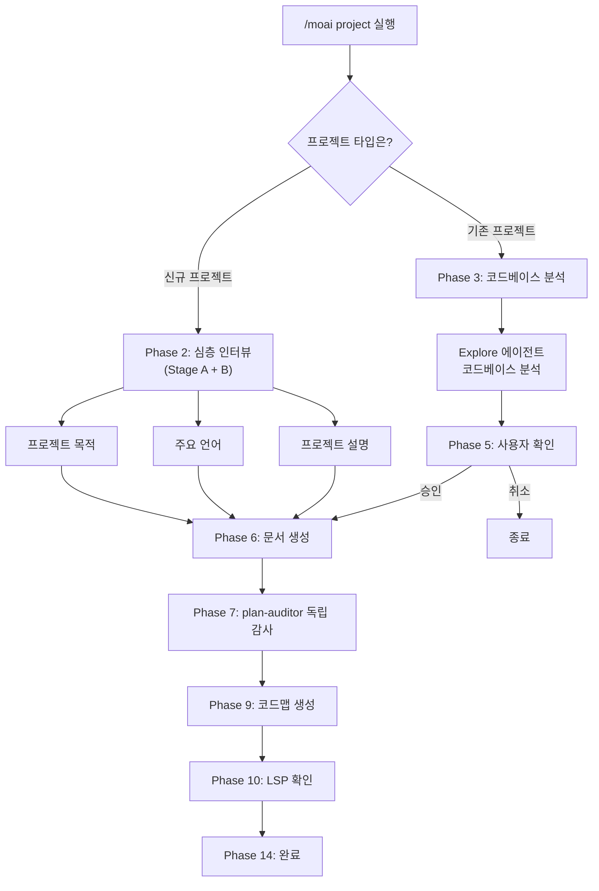
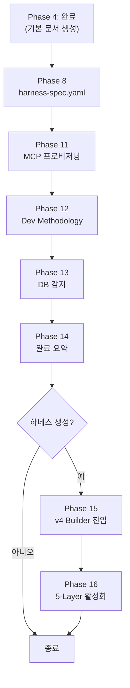
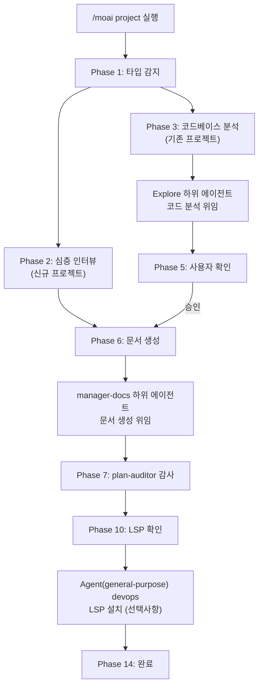

프로젝트의 코드베이스를 훑어, AI가 이 프로젝트를 이해하는 데 필요한 기초 문서를 만들어 둡니다.


**슬래시 커맨드**: Claude Code에서 `/moai:project`를 입력하면 이 명령어를 바로 실행할 수 있습니다. `/moai`만 입력하면 사용 가능한 모든 서브커맨드 목록이 표시됩니다.


## 개요

`/moai project`는 MoAI-ADK 워크플로우의 **프로젝트 문서 생성** 명령어입니다. 소스 코드와 설정 파일, 디렉토리 구조를 읽어 AI가 프로젝트를 빠르게 파악하도록 돕습니다.

에이전틱 하네스 관점에서 보면 이 명령어는 하네스의 **바닥 공사**입니다. 에이전트가 세션마다 코드베이스를 처음부터 다시 뒤지게 두는 대신, 프로젝트 지식을 파일로 굳혀 둡니다. 파일에 기억을 남겨 두는 것이 하네스 설계의 기본 패턴이고, `/moai project`가 그 첫 삽을 뜹니다. 세션마다 되풀이될 탐색 비용을 문서 한 번 만드는 것으로 갈음하니 비용도 그만큼 줄어듭니다.


**왜 프로젝트 문서가 필요한가요?**

Claude Code는 새 대화를 시작할 때마다 이 프로젝트를 하나도 모르는 상태입니다.
`/moai project`가 만든 문서를 읽고 나서야 AI가 다음을 알게 됩니다:

- 이 프로젝트가 **무슨 일을 하는지** (product.md)
- 코드가 **어떻게 짜여 있는지** (structure.md)
- 어떤 **기술을 쓰는지** (tech.md)

이 문서가 있어야 `/moai plan`이나 `/moai run` 같은 이후 명령어에서 AI가 프로젝트
맥락에 맞게 제대로 움직입니다.



## 사용법

```bash
> /moai project
```

인자나 옵션 없이 그냥 실행하면 지금 있는 프로젝트 디렉토리를 알아서 분석합니다.

## 생성되는 문서

`/moai project`는 `.moai/project/` 디렉토리 아래에 핵심 문서 세 개와 아키텍처 코드맵을 만듭니다:

```
.moai/
└── project/
    ├── product.md      # 프로젝트 개요
    ├── structure.md    # 디렉토리 구조 분석
    ├── tech.md         # 기술 스택 정보
    └── codemaps/       # 아키텍처 코드맵 (Phase 9)
```

문서를 만드는 김에 프로젝트에 맞는 **하네스까지 함께 꾸리는 것**도 이 명령어의 몫입니다. 분석해 둔 기술 스택을 바탕으로 이 프로젝트 전용 에이전트 팀(하네스)을 같이 세울 수 있습니다. 하네스 생성은 [/moai harness](./moai-harness)에서 자세히 다룹니다.

### product.md - 프로젝트 개요

프로젝트의 핵심 정보를 담습니다:

| 항목              | 설명                     | 예시                               |
| ----------------- | ------------------------ | ---------------------------------- |
| **프로젝트 이름** | 프로젝트의 공식 명칭     | "MoAI-ADK"                         |
| **설명**          | 프로젝트가 하는 일       | "AI 기반 개발 도구 키트"           |
| **타겟 사용자**   | 누구를 위한 프로젝트인지 | "Claude Code를 사용하는 개발자"    |
| **핵심 기능**     | 주요 기능 목록           | "SPEC 생성, DDD 구현, 문서 자동화" |
| **프로젝트 상태** | 현재 개발 단계           | "v1.1.0, Production"               |

### structure.md - 디렉토리 구조

프로젝트의 파일과 폴더가 어떻게 짜였는지 정리합니다:

| 항목               | 설명                                      |
| ------------------ | ----------------------------------------- |
| **디렉토리 트리**  | 전체 폴더 구조 시각화                     |
| **주요 폴더 목적** | 각 폴더가 하는 역할 설명                  |
| **모듈 구성**      | 핵심 모듈 간 관계                         |
| **진입점**         | 프로그램 시작 파일 (main.py, index.ts 등) |

### tech.md - 기술 스택

프로젝트가 쓰는 기술 정보를 모아 둡니다:

| 항목                | 설명                | 예시                          |
| ------------------- | ------------------- | ----------------------------- |
| **프로그래밍 언어** | 사용 언어 및 버전   | "Python 3.12, TypeScript 5.5" |
| **프레임워크**      | 주요 프레임워크     | "FastAPI 0.115, React 19"     |
| **데이터베이스**    | DB 종류 및 ORM      | "PostgreSQL 16, SQLAlchemy"   |
| **빌드 도구**       | 빌드 및 패키지 관리 | "Poetry, Vite"                |
| **배포 환경**       | 호스팅 및 CI/CD     | "Docker, GitHub Actions"      |

## 실행 과정

`/moai project`는 프로젝트 타입에 따라 서로 다른 워크플로우를 탑니다.

### 신규 프로젝트 vs 기존 프로젝트



## 상세 워크플로우

### Phase 1: 프로젝트 타입 감지

무엇보다 먼저 프로젝트 타입을 확인합니다.


  **[HARD] 규칙**: 프로젝트 타입부터 물어봐야 합니다. 코드베이스를 뒤지기 전에
  사용자에게 지금 상황을 먼저 확인합니다.


**질문**: 어떤 타입의 프로젝트인가요?

| 옵션              | 설명                                                 |
| ----------------- | ---------------------------------------------------- |
| **신규 프로젝트** | 맨바닥에서 시작하는 프로젝트. 질문에 답하며 정보를 채움 |
| **기존 프로젝트** | 이미 코드가 있는 프로젝트. 코드를 알아서 분석         |

### Phase 2: 심층 인터뷰 (신규 프로젝트)

신규 프로젝트를 골랐다면 2단계 **심층 인터뷰** (Deep Interview)로 들어갑니다 — 명확도 점수에 따라 라운드 수가 달라지는 Stage A (Vision-Domain / Technology-Constraints / Scope, `project.max_rounds`까지)와 반드시 거치는 Stage B 확장 라운드입니다. 이때 다음을 물어봅니다:

**질문 1 - 프로젝트 목적**:

- **Web Application**: 프론트엔드, 백엔드, 또는 풀스택 웹 앱
- **API Service**: REST API, GraphQL, 또는 마이크로서비스
- **CLI Tool**: 명령줄 유틸리티 또는 자동화 도구
- **Library/Package**: 재사용 가능한 코드 라이브러리 또는 SDK

**질문 2 - 주요 언어**:

- **Python**: 백엔드, 데이터 사이언스, 자동화
- **TypeScript/JavaScript**: 웹, Node.js, 프론트엔드
- **Go**: 고성능 서비스, CLI 도구
- **Other**: Rust, Java, Ruby 등 (상세 질문)

**질문 3 - 프로젝트 설명** (자유 입력):

- 프로젝트 이름
- 주요 기능 또는 목표
- 타겟 사용자

모은 정보로 초기 문서를 만든 뒤 Phase 6 문서 생성으로 넘어갑니다.

### Phase 3: 코드베이스 분석 (기존 프로젝트)

기존 프로젝트를 골랐다면 분석은 **Explore 에이전트**에게 맡깁니다.


  **에이전트 위임**: 코드베이스 분석은 Explore 하위 에이전트가 맡습니다.
  MoAI는 그 결과만 받아 사용자에게 보여 줍니다.


**분석 목표**:

- **프로젝트 구조**: 메인 디렉토리, 진입점, 아키텍처 패턴
- **기술 스택**: 언어, 프레임워크, 핵심 의존성
- **핵심 기능**: 주요 기능과 비즈니스 로직 위치
- **빌드 시스템**: 빌드 도구, 패키지 관리자, 스크립트

**Explore 에이전트 출력**:

- 감지된 기본 언어
- 식별된 프레임워크
- 아키텍처 패턴 (MVC, Clean Architecture, Microservices 등)
- 주요 디렉토리 매핑 (source, tests, config, docs)
- 의존성 카탈로그
- 진입점 식별

### Phase 4: 심층 인터뷰 (기존 프로젝트)

코드베이스 분석이 끝나면 기존 프로젝트도 2단계 **심층 인터뷰**를 거칩니다 — 명확도 점수에 따라 라운드 수가 달라지는 Stage A (Ownership-Goal / Constraints / Scope-Priority, `project.max_rounds`까지)와 반드시 거치는 Stage B 확장 라운드입니다. 코드만 봐서는 드러나지 않는 소유권·목표·우선순위를 사용자에게서 직접 듣습니다.

### Phase 5: 사용자 확인

분석 결과를 사용자에게 보여 주고 승인을 받습니다.

**표시 내용**:

- 감지된 언어
- 프레임워크
- 아키텍처
- 핵심 기능 목록

**옵션**:

- **진행**: 문서 생성을 그대로 이어 감
- **상세 검토**: 분석 내용을 먼저 하나씩 확인
- **취소**: 프로젝트 설정을 다시 손봄

### Phase 6: 문서 생성

문서 작성은 **manager-docs 에이전트**에게 맡깁니다.

**전달 내용**:

- Phase 3 분석 결과 (또는 Phase 2 인터뷰 입력)
- Phase 5 사용자 확인
- 출력 디렉토리: `.moai/project/`
- 언어: config의 conversation_language

**생성 파일**:

| 파일             | 내용                                                                     |
| ---------------- | ------------------------------------------------------------------------ |
| **product.md**   | 프로젝트 이름, 설명, 타겟 사용자, 핵심 기능, 유스케이스                  |
| **structure.md** | 디렉토리 트리, 각 디렉토리의 목적, 핵심 파일 위치, 모듈 구성             |
| **tech.md**      | 기술 스택 개요, 프레임워크 선택 근거, 개발 환경 요구사항, 빌드/배포 설정 |

### Phase 7: plan-auditor 독립 감사

문서를 만든 뒤 **plan-auditor** 서브에이전트가 조건에 따라 산출물을 따로 감사하고, 필요하면 재시도 루프를 돕니다 — 만든 에이전트(manager-docs)가 자기 결과를 채점하지 않는다는 독립 감사 원칙을 프로젝트 문서에도 그대로 적용한 것입니다.

### Phase 9: 코드맵 생성

Explore와 manager-docs가 `.moai/project/codemaps/`에 아키텍처 코드맵을 만듭니다.

### Phase 10: 개발 환경 확인

감지한 기술 스택에 맞는 LSP 서버가 깔려 있는지 확인합니다.

**언어별 LSP 매핑** (16개 언어 지원):

| 언어                  | LSP 서버                   | 확인 명령어                        |
| --------------------- | -------------------------- | ---------------------------------- |
| Python                | pyright 또는 pylsp         | `which pyright`                    |
| TypeScript/JavaScript | typescript-language-server | `which typescript-language-server` |
| Go                    | gopls                      | `which gopls`                      |
| Rust                  | rust-analyzer              | `which rust-analyzer`              |
| Java                  | jdtls (Eclipse JDT)        | -                                  |
| Ruby                  | solargraph                 | `which solargraph`                 |
| PHP                   | intelephense               | npm 통해 확인                      |
| C/C++                 | clangd                     | `which clangd`                     |
| Kotlin                | kotlin-language-server     | -                                  |
| Scala                 | metals                     | -                                  |
| Swift                 | sourcekit-lsp              | -                                  |
| Elixir                | elixir-ls                  | -                                  |
| Flutter               | dart language-server       | Dart SDK 내장                      |
| C#                    | OmniSharp 또는 csharp-ls   | -                                  |
| R                     | languageserver (R 패키지)  | -                                  |

**LSP가 없을 때 고를 수 있는 것**:

- **LSP 없이 계속**: 그대로 끝까지 진행
- **설치 안내 표시**: 감지한 언어의 설정 가이드를 보여 줌
- **지금 자동 설치**: `Agent(general-purpose)` devops 스코프로 설치 (확인을 거침)

### Phase 14: 완료

사용자의 언어로 완료 메시지를 띄웁니다.

- 생성된 파일 목록
- 위치: `.moai/project/`
- 상태: 성공 또는 부분 완료

**다음 단계 옵션**:

- **SPEC 작성**: `/moai plan`으로 기능 명세서 쓰기
- **문서 검토**: 만들어진 파일을 열어 확인하기
- **새 세션 시작**: 컨텍스트를 비우고 새로 시작하기

## 확장 단계 (Phase 8-16)

기본 문서를 다 만든 (Phase 0-4) 다음, `/moai project`는 프로젝트 환경을 두루 갖추는 확장 단계로 이어집니다.



### Phase 8: harness-spec.yaml 브리지

인터뷰 답변을 모아 `.moai/project/harness-spec.yaml`을 만듭니다. 8-필드 스키마로 프로젝트 맥락을 하네스 빌더에게 넘겨 주는 다리 역할을 하는 파일이며, 사용자에게 다시 묻지 않고 interview.md 답변에서 바로 뽑아냅니다.

### Phase 11: MCP 서버 프로비저닝

기술 스택을 감지한 뒤 `mcp-matrix.yaml`에서 알맞은 MCP 서버를 고릅니다. 오케스트레이터 승인을 받으면 `.mcp.json`에 덧붙여 적습니다 (additive write) — 기존 MCP 설정을 덮어쓰지 않습니다.

### Phase 13: DB 감지

Grep/Glob으로 DB 키워드를 훑어 `db-detection.json`을 만듭니다. 지원하는 DB 엔진 갈래는 다음과 같습니다:

- **Relational/SQL**: PostgreSQL, MySQL, MariaDB, SQLite, Oracle, SQL Server, CockroachDB, Supabase, Neon, Planetscale
- **NoSQL Document**: MongoDB, Firestore, Firebase, Couchbase
- **NoSQL Key-Value**: Redis, DynamoDB, Cassandra, ScyllaDB, Riak
- **Search/Analytics**: Elasticsearch, ClickHouse, Snowflake, InfluxDB

### Phase 15-16: v4 Builder 연동

Phase 15는 v4 하네스 빌더로 넘깁니다 — Context-First Discovery와 오케스트레이터가 직접 도는 4-phase Builder (ANALYZE → PLAN → GENERATE → ACTIVATE)가 하네스를 만듭니다. Phase 16은 CLAUDE.md에 마커를 심고 main.md 라우터에 등록해 5-Layer를 켠 다음, 생성이 끝나면 smoke gate를 돌립니다.


Phase 15-16은 건너뛸 수 있는 단계입니다 — `/moai project`를 돌릴 때 하네스가 필요하면 이어서 진행하고, 필요 없으면 Phase 14에서 끝냅니다.


## 언제 사용하나?

### 반드시 실행해야 하는 경우

- **새 프로젝트에 MoAI-ADK를 처음 붙일 때** - AI가 프로젝트를 이해할 기초 문서가 있어야 합니다
- **기존 프로젝트에 MoAI-ADK를 들일 때** - 이미 코드가 쌓인 프로젝트에서도 문서를 알아서 만들어 줍니다

### 다시 실행하면 좋은 경우

- **프로젝트 구조가 크게 바뀐 뒤** - 디렉토리 구조나 기술 스택이 달라졌을 때
- **굵직한 기술을 새로 들인 뒤** - 예: 데이터베이스 교체, 프레임워크 추가
- **팀원이 새로 합류할 때** - 최신 문서를 놓고 온보딩할 수 있습니다


  `/moai project`는 기존 문서를 **덮어씁니다**. 직접 손본 내용이 있다면
  실행하기 전에 백업해 두세요.


## 실전 예시

### 예시 1: 새 프로젝트에서 시작

#### 1단계: 명령어 실행

먼저 터미널에서 프로젝트를 초기화하고 Claude Code를 실행합니다.

```bash
# 터미널에서 프로젝트 초기화
$ moai init my-api-project
$ cd my-api-project

# Claude Code에서 프로젝트 문서 생성
> /moai project
```

#### 2단계: 프로젝트 타입 선택

새로운 프로젝트이므로 "신규 프로젝트"를 선택합니다.

```bash
AI: 프로젝트 타입을 선택해주세요:
1. 신규 프로젝트 (처음부터 시작)
2. 기존 프로젝트 (코드가 있음)

User: 1
```

AI가 신규 프로젝트용 정보 수집 모드로 넘어갑니다.

#### 3단계: 프로젝트 목적 선택

프로젝트의 목적을 선택합니다.

```bash
AI: 프로젝트 목적을 선택해주세요:
1. Web Application
2. API Service
3. CLI Tool
4. Library/Package

User: 2
```

API Service를 골라 REST API 서버 프로젝트라고 알려 줍니다.

#### 4단계: 주요 언어 선택

사용할 프로그래밍 언어를 선택합니다.

```bash
AI: 주요 언어를 선택해주세요:
1. Python
2. TypeScript/JavaScript
3. Go
4. Other

User: 1
```

Python을 골라 백엔드 API 서버 개발 환경을 잡습니다.

#### 5단계: 프로젝트 상세 정보 입력

프로젝트에 대한 자세한 정보를 입력합니다.

```bash
AI: 프로젝트에 대해 설명해주세요 (이름, 목표, 타겟 사용자):

User: REST API 서버입니다. 사용자 인증과 데이터 관리 기능이 있습니다. 개발자를 위한 도구입니다.
```

여기서 적은 내용이 `product.md`를 쓰는 재료가 됩니다.

#### 6단계: 문서 생성 완료

AI가 그동안 모은 정보로 문서를 만들어 냅니다.

```bash
[문서 생성 중...]

완료! .moai/project/ 디렉토리에 3개의 문서가 생성되었습니다.
```

생성된 문서:

- `.moai/project/product.md` - 프로젝트 개요
- `.moai/project/structure.md` - 디렉토리 구조
- `.moai/project/tech.md` - 기술 스택

### 예시 2: 기존 프로젝트에 MoAI-ADK 도입

#### 1단계: 프로젝트 디렉토리 이동 및 초기화

이미 코드가 있는 프로젝트로 옮겨 가서 MoAI-ADK를 초기화합니다.

```bash
# 이미 있는 프로젝트 디렉토리로 이동
$ cd ~/projects/existing-api

# MoAI-ADK 초기화
$ moai init

# Claude Code에서 프로젝트 문서 생성
> /moai project
```

#### 2단계: 프로젝트 타입 선택

기존 프로젝트라고 고릅니다.

```bash
AI: 프로젝트 타입을 선택해주세요:
1. 신규 프로젝트 (처음부터 시작)
2. 기존 프로젝트 (코드가 있음)

User: 2
```

기존 프로젝트 모드로 들어가 코드베이스 분석을 시작합니다.

#### 3단계: 코드베이스 자동 분석

Explore 에이전트가 알아서 프로젝트를 훑습니다.

```bash
[Explore 에이전트가 코드베이스를 분석 중...]

분석 결과:
- 언어: Python 3.12
- 프레임워크: FastAPI 0.115
- 데이터베이스: PostgreSQL 16
- 아키텍처: Clean Architecture
- 핵심 기능:
  * 사용자 인증
  * 데이터 CRUD
  * API 엔드포인트 관리
```

에이전트가 프로젝트 구조와 의존성, 패턴을 알아서 짚어 냅니다.

#### 4단계: 분석 결과 확인

분석 결과를 살펴본 뒤 문서 생성을 승인합니다.

```bash
이 분석으로 문서를 생성하시겠습니까?
1. 진행
2. 상세 검토
3. 취소

User: 1
```

분석 결과가 맞으면 "진행"을 골라 문서 생성을 이어 갑니다.

#### 5단계: 문서 생성

manager-docs 에이전트가 분석 결과를 놓고 문서를 씁니다.

```bash
[manager-docs 에이전트가 문서 생성 중...]

완료! 다음 파일이 생성되었습니다:
- .moai/project/product.md
- .moai/project/structure.md
- .moai/project/tech.md
```

문서 셋은 각각 프로젝트의 다른 면을 담당합니다.

#### 6단계: LSP 확인 및 완료

개발 환경이 제대로 갖춰졌는지 확인합니다.

```bash
LSP 서버 'pyright'가 설치되어 있습니다.

다음 단계를 선택해주세요:
1. SPEC 작성 (/moai plan)
2. 문서 검토
3. 새 세션 시작
```

LSP 서버가 이미 깔려 있으니 곧바로 개발에 들어가면 됩니다.

### 예시 3: 프로젝트 문서 생성 후 워크플로우 진행

#### 1단계: 프로젝트 문서 생성 (최초 1회)

프로젝트를 처음 세팅할 때 문서를 만들어 둡니다.

```bash
> /moai project
```

이 단계는 프로젝트마다 한 번이면 충분합니다.

#### 2단계: SPEC 생성

프로젝트 문서가 만들어졌다면 AI는 이미 프로젝트를 파악한 상태입니다.

```bash
> /moai plan "사용자 인증 기능 구현"
```

기술 스택과 구조를 알고 시작하니 SPEC도 그만큼 정확하게 나옵니다.


  `/moai project`는 프로젝트당 보통 **한두 번**이면 됩니다. 매번 돌릴 필요는
  없고, 프로젝트 구조가 크게 바뀌었을 때만 다시 실행하세요.


## 에이전트 체인



## 자주 묻는 질문

### Q: 프로젝트 문서 없이 `/moai plan`을 실행하면 어떻게 되나요?

SPEC이 만들어지기는 합니다. 다만 AI가 기술 스택이나 구조를 모르는 상태라 **기술적으로 어긋난 판단**을 할 수 있습니다. `/moai project`를 먼저 돌리기를 권합니다.

### Q: 비공개 코드도 분석하나요?

`/moai project`는 **로컬에서만** 돕니다. 코드가 밖으로 나가지 않고, 만들어진 문서도 `.moai/project/` 디렉토리에 그대로 남습니다.

### Q: 모노레포 프로젝트에서도 동작하나요?

네, 모노레포도 지원합니다. 루트 디렉토리에서 실행하면 프로젝트 전체 구조를 훑습니다.

### Q: LSP 서버가 없으면 어떻게 되나요?

LSP 서버가 없어도 문서는 그대로 만들어집니다. 다만 이후 `/moai run` 단계에서 코드 품질 진단이 반쪽이 될 수 있습니다. Phase 10에서 LSP 설치 안내를 띄워 줍니다.

## 관련 문서

- [빠른 시작](/getting-started/quickstart) - 전체 워크플로우 튜토리얼
- [/moai plan](./moai-plan) - 다음 단계: SPEC 문서 생성
- [/moai harness](./moai-harness) - 프로젝트 전용 하네스 생성
- [SPEC 기반 개발](/core-concepts/spec-based-dev) - SPEC 방법론 상세 설명
- [하위 에이전트 카탈로그](/advanced/agent-guide) - Explore, manager-docs 에이전트 상세
