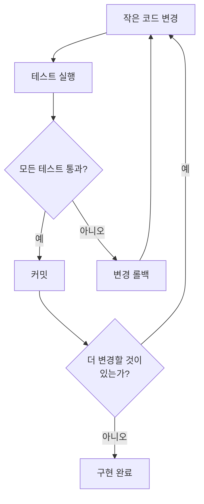
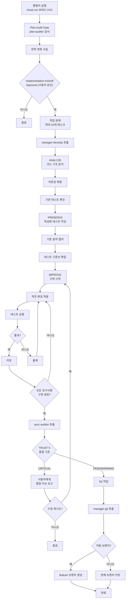

SPEC 문서를 보고 코드를 구현하는 Run 단계 명령어입니다. 프로젝트 상태에 따라 TDD (RED-GREEN-REFACTOR)나 DDD (ANALYZE-PRESERVE-IMPROVE) 사이클이 걸리며, 이 문서는 기존 코드를 안전하게 손보는 DDD 사이클을 중심으로 설명합니다.


**슬래시 커맨드**: Claude Code에서 `/moai:run`을 입력하면 이 명령어를 바로 실행할 수 있습니다. `/moai`만 입력하면 사용 가능한 모든 서브커맨드 목록이 표시됩니다.


## 개요

`/moai run`은 MoAI-ADK 워크플로우의 **Phase 2 (Run)** 명령어입니다. Phase 1에서 만든 SPEC 문서를 읽고 **ANALYZE-PRESERVE-IMPROVE** 사이클로, 이미 돌아가던 기능을 망가뜨리지 않으면서 코드를 구현합니다. 안에서는 **manager-develop** 에이전트가 전 과정을 챙깁니다.

구현 단계는 3-Phase 파이프라인에서 토큰을 가장 많이 먹습니다. 그래서 v3의 비용 절감 설계도 이 단계에 몰려 있습니다. SPEC 요약본 (`spec-compact.md`)을 자동으로 읽어 토큰을 약 30% 아끼고, SPEC 복잡도에 맞춰 검증 깊이를 조절하는 Harness Level Routing이 굳이 안 해도 될 감사 비용을 덜어 냅니다. 진행 상황은 파일로 남으니 세션이 끊겨도 하던 자리에서 이어 갈 수 있습니다.


**DDD를 집 리모델링으로 이해하기**

DDD의 ANALYZE-PRESERVE-IMPROVE 사이클은 **집 리모델링**과 같습니다:

| 단계         | 비유                | 실제 작업                       |
| ------------ | ------------------- | ------------------------------- |
| **ANALYZE**  | 집 점검하기         | 현재 코드 구조와 문제점 파악    |
| **PRESERVE** | 현재 상태 사진 찍기 | 특성화 테스트로 기존 동작 기록  |
| **IMPROVE**  | 방 하나씩 리모델링  | 테스트를 통과하면서 조금씩 개선 |

집 전체를 한 번에 뜯어내면 위험하듯, 코드도 **조금씩 바꾸고 그때마다 확인**하는 편이 안전합니다.



## 사용법

Plan 단계에서 생성된 SPEC ID를 인자로 전달합니다:

```bash
# Plan 단계 완료 후 반드시 /clear 실행
> /clear

# SPEC ID를 지정하여 구현 시작
> /moai run SPEC-AUTH-001
```


  `/moai run`을 실행하기 전에 반드시 `/clear`를 먼저 하세요. Plan 단계에서 쓴
  토큰을 비워야 Run 단계가 컨텍스트 윈도우를 온전히 씁니다.
  GLM-5.3와 Opus 5는 1M 컨텍스트 (권장 사용량 50%), Sonnet/Haiku 계열은
  200K 컨텍스트 (권장 사용량 90%)입니다.


## 지원 플래그

| 플래그              | 설명                    | 예시                               |
| ------------------- | ----------------------- | ---------------------------------- |
| `--resume SPEC-XXX` | 중단된 구현 작업 재개   | `/moai run --resume SPEC-AUTH-001` |
| `--solo`            | 하위 에이전트 모드 강제 | `/moai run SPEC-AUTH-001 --solo`   |
| `--mode <값>`       | 디스패치 모드 지정        | `/moai run SPEC-AUTH-001 --mode loop` |

**Resume 기능:**

다시 실행하면 마지막으로 성공한 체크포인트부터 이어 갑니다.

**`--mode` 디스패치 모드:**

`--mode`는 `/moai run` 워크플로우를 어느 갈래로 태울지 고르는 옵션입니다 (Phase 4의 6-모드 실행 카탈로그와는 별개로 움직입니다):

- `autopilot` (기본): Phase 4에서 규모를 보고 고른 뒤 구현으로 들어감
- `loop`: Ralph 엔진의 진단형 루프에 넘김 (`loop.md` 참조)
- `team`: 폐지 — `MODE_TEAM_UNAVAILABLE`을 띄우고 `autopilot`으로 되돌아감 (Agent Teams 정적 계층 폐지)
- `pipeline`: 거부 — `MODE_PIPELINE_ONLY_UTILITY` 오류를 냄 (pipeline 모드는 유틸리티 서브커맨드 전용)

## DDD 사이클

`/moai run`은 **ANALYZE -> PRESERVE -> IMPROVE** 세 단계를 차례로 밟습니다. 각 단계에서 무슨 일이 벌어지는지 하나씩 보겠습니다.

### 1. ANALYZE (분석)

기존 코드를 읽고 SPEC 요구사항과 맞춰 보며 무엇을 해야 하는지 정리합니다.

**분석 항목:**

| 항목        | 설명                 | 예시                               |
| ----------- | -------------------- | ---------------------------------- |
| 코드 구조   | 파일, 모듈, 의존성   | "auth.py가 user_service.py에 의존" |
| 도메인 경계 | 비즈니스 로직의 범위 | "인증 도메인과 사용자 도메인 분리" |
| 테스트 현황 | 기존 테스트 커버리지 | "현재 45% 커버리지"                |
| 기술 부채   | 개선이 필요한 부분   | "SQL Injection 취약점 발견"        |

### 2. PRESERVE (보존)

기존 코드가 지금 어떻게 동작하는지를 **특성화 테스트**로 남겨 둡니다. 리팩토링을 끝낸 뒤에도 기존 기능이 그대로인지 확인해 주는 **안전망**입니다.


**특성화 테스트란?**

"이 코드가 맞느냐 틀리느냐"를 따지는 테스트가 아닙니다. **"지금은 이렇게 동작한다"를
그대로 남기는** 테스트입니다.

예를 들어 기존 로그인 함수가 성공했을 때 `{"status": "success"}`를 돌려준다면, 그
동작을 테스트로 박아 둡니다. 나중에 코드를 바꿨는데 이 테스트가 깨지면, 기존
동작이 바뀌었다는 신호를 바로 받게 됩니다.



### 3. IMPROVE (개선)

SPEC 요구사항을 따라 **작은 단위로** 코드를 고치고, 고칠 때마다 테스트를 돌려 기존 동작이 그대로인지 확인합니다.

**핵심 원칙: 작은 변경 + 매번 검증**



## 실행 과정

`/moai run`이 내부적으로 수행하는 전체 과정입니다:



## 단계별 상세

### Phase 3: JIT Language Detection (언어 자동 감지)

프로젝트의 주력 언어를 알아서 감지해, 에이전트를 띄울 때 그 언어에 맞는 스킬을 함께 넣어 줍니다. 16개 언어를 똑같이 지원합니다.

| 감지 파일 | 언어 스킬 |
|-----------|-----------|
| `go.mod` | moai-lang-go |
| `package.json` (typescript) | moai-lang-typescript |
| `pyproject.toml` | moai-lang-python |
| `Cargo.toml` | moai-lang-rust |
| `pom.xml` / `build.gradle` | moai-lang-java |

### Phase 4: Scale-Based Mode Selection (규모 기반 모드 선택)

SPEC 규모를 보고 가장 잘 맞는 실행 모드를 알아서 고릅니다. 작은 작업에 무거운 파이프라인을 돌리지 않는 것 역시 비용을 줄이는 원칙입니다.

| 패턴 | 기준 | 실행 모드 |
|------|------|-----------|
| 버그 수정 | 파일 ≤ 3, 단일 도메인 | **Fix Mode** |
| 단일 기능 | 파일 ≤ 5, 단일 도메인 | **Focused Mode** |
| 도메인 내 기능 | 파일 5-10 | **Standard Mode** |
| 멀티 도메인 | 파일 ≥ 10 또는 도메인 ≥ 3 | **Full Pipeline** |

### Harness Level Routing (품질 깊이 라우팅)

Run phase에 들어갈 때 SPEC 복잡도를 보고 품질 파이프라인을 얼마나 깊게 돌릴지 정합니다.

| 레벨 | 대상 | evaluator | 건너뛰는 Phase |
|------|------|-----------|---------------|
| **minimal** | 단순 버그 수정, 설정 변경 | 비활성 | 0, 0.5, 2.0, 2.5, 2.75, 2.8a |
| **standard** | 일반 기능 개발 (기본값) | final-pass (Phase 16만) | 없음 |
| **thorough** | 보안/결제 등 중요 기능 | per-sprint (Phase 10 + 2.8a) | 없음 |

실패하면 자동으로 한 단계씩 올립니다: minimal → standard → thorough (최대 2회)

### Plan Audit Gate

`/moai run`에 들어가면 가장 먼저 걸리는 필수 게이트입니다. **plan-auditor** 서브에이전트가 plan 단계에서 나온 SPEC 산출물을 따로 감사합니다.

- plan-auditor는 manager-spec과 별개의 에이전트입니다 — 만든 에이전트가 자기 결과를 채점하지 않습니다
- SPEC 산출물 해시가 그대로이고 직전 판정 점수가 0.90 이상이면 skip-eligible (캐시된 판정을 재사용)
- 그렇지 않으면 plan-auditor를 다시 돌려 새로 판정합니다
- 판정은 PASS / PASS-with-debt / FAIL 세 가지


Plan Audit Gate의 skip 정책(plan-auditor 재실행 생략)은 점수를 근거로 삼습니다. 하지만 아래의 **Implementation Kickoff Approval**은 점수와 아무 상관 없는 별개의 사용자 승인 게이트이고, 어떤 경우에도 건너뛸 수 없습니다 (REQ-ATR-015).


### Implementation Kickoff Approval

Plan Audit Gate를 지난 뒤, 구현에 들어가기 전에 사용자에게 직접 승인을 받는 **휴먼 게이트** (HUMAN GATE)입니다.

- plan-auditor 판정 요약과 SPEC 산출물을 사용자에게 보여 줍니다
- `AskUserQuestion`으로 "run 진입 / 추가 검토 / 중단" 세 가지 선택지를 냅니다
- 점수가 0.90을 넘겨도, PASS-with-debt라도 이 승인은 건너뛰지 않습니다
- 사용자가 승인해야 비로소 구현 단계가 시작됩니다

### Phase 1: 분석 및 계획

**manager-develop** 하위 에이전트가 다음 작업을 수행합니다:

- SPEC 문서 완전 분석
- 요구사항 및 성공 기준 추출
- 구현 단계 및 개별 작업 식별
- 기술 스택 및 의존성 요구사항 결정
- 복잡도 및 노력 추정
- 단계별 접근 방식의 상세 실행 전략 생성

**출력:** plan_summary, requirements 목록, success_criteria, effort_estimate를 포함한 실행 계획

### Phase 6: 작업 분해

승인된 실행 계획을 하나씩 검토할 수 있는 최소 단위 작업으로 쪼갭니다:

**작업 구조:**

- **Task ID**: SPEC 내 순차적 (TASK-001, TASK-002 등)
- **Description**: 명확한 작업 문장
- **Requirement Mapping**: 충족하는 SPEC 요구사항
- **Dependencies**: 선행 작업 목록
- **Acceptance Criteria**: 완료 검증 방법

**제약조건:** SPEC 하나당 작업은 최대 10개. 더 필요하면 SPEC을 쪼개는 편이 낫습니다

쪼갠 결과는 `.moai/specs/SPEC-{ID}/tasks.md`에 남습니다. Git으로 추적할 수 있고 Drift Guard가 이 파일을 참조합니다.

### Phase 10: Sprint Contract (thorough 전용)

thorough 레벨에서만 돌아갑니다. 구현을 시작하기 전에 sync-auditor와 "무엇을 끝난 것으로 볼지"를 미리 합의합니다.

**합의 내용:**
- 반드시 통과해야 할 구체적인 테스트 케이스
- 미리 짚어 둔 엣지 케이스
- 물러설 수 없는 임계값 (커버리지 %, 성능 목표, 보안 요구사항)

최대 두 라운드까지 조율한 뒤 evaluator 권고안으로 확정합니다.

### Phase 2: DDD 구현

**manager-develop** 하위 에이전트가 ANALYZE-PRESERVE-IMPROVE 사이클을 실행합니다:

**요구사항:**

- 작업 추적 초기화
- 완전한 ANALYZE-PRESERVE-IMPROVE 사이클 실행
- 각 변환 후 기존 테스트 통과 검증
- 커버리지 없는 코드 경로에 특성화 테스트 생성
- 테스트 커버리지 85% 이상 달성

**출력:** files_modified, characterization_tests_created, test_results, behavior_preserved, structural_metrics

### Phase 13: 품질 검증

**sync-auditor** 하위 에이전트가 TRUST 5 검증을 수행합니다:

| TRUST 5 요소  | 검증 항목                          |
| ------------- | ---------------------------------- |
| **Tested**    | 테스트 존재 및 통과, DDD 규율 유지 |
| **Readable**  | 프로젝트 규칙 준수, 문서 포함      |
| **Unified**   | 기존 프로젝트 패턴 따름            |
| **Secured**   | 보안 취약점 없음, OWASP 준수       |
| **Trackable** | 명확한 커밋 메시지, 이력 분석 지원 |

**추가 검증:**

- 테스트 커버리지 85% 이상
- 동작 보존: 기존 테스트 변경 없이 통과
- 특성화 테스트 통과: 동작 스냅샷 일치
- 구조적 개선: 결합도 및 응집도 지표 개선

**출력:** trust_5_validation 결과, coverage_percentage, overall_status (PASS/WARNING/CRITICAL), issues_found

### Phase 19: sync-auditor 독립 감사

thorough 레벨에서는 sync-auditor 서브에이전트가 4차원 (Functionality/Security/Craft/Consistency) 능동 평가와 TRUST 5 정적 검증을 함께 돌립니다. 만든 에이전트가 아니라 따로 붙은 감사자가 품질을 판정합니다.


Security가 FAIL이면 전체가 FAIL입니다. 수정-평가 사이클을 최대 3회 돈 뒤 사용자에게 보고합니다.


### Drift Guard (범위 이탈 감지)

DDD/TDD 사이클이 끝나면 계획과 실제 변경을 맞대어 봅니다:

- drift ≤ 20%: 기록만 남김
- 20% < drift ≤ 30%: 경고
- drift > 30%: Phase 14 재계획 게이트를 띄움

### Phase 19: Git 작업 (조건부)

**manager-git** 하위 에이전트가 Git 자동화를 수행합니다:

**실행 조건:**

- quality_status가 PASS 또는 WARNING
- git_strategy.automation.auto_branch가 true이면 feature 브랜치 생성
- auto_branch가 false이면 현재 브랜치에 직접 커밋

### Phase 20: 완료 및 안내

사용자에게 다음 옵션을 제시합니다:

| 옵션           | 설명                                  |
| -------------- | ------------------------------------- |
| 문서 동기화    | `/moai sync` 실행하여 문서 및 PR 생성 |
| 다른 기능 구현 | `/moai plan`으로 추가 SPEC 생성       |
| 결과 검토      | 로컬에서 구현 및 테스트 커버리지 확인 |
| 완료           | 세션 종료                             |

## 토큰 절약 장치 — spec-compact.md

Run phase에 들어가면 SPEC 요약본을 알아서 읽어 **토큰을 약 30% 아낍니다**. `.moai/specs/SPEC-{ID}/spec-compact.md`가 있으면 전체 spec.md 대신 이쪽을 씁니다.

## 품질 게이트

구현이 끝나면 다음 기준을 하나도 빠짐없이 통과해야 합니다:

| 항목            | 기준         | 설명                                 |
| --------------- | ------------ | ------------------------------------ |
| LSP 오류        | **0개**      | 타입 체커, 린터 오류 없음            |
| 타입 오류       | **0개**      | pyright, mypy, tsc 등 타입 오류 없음 |
| 린트 오류       | **0개**      | ruff, eslint 등 린터 오류 없음       |
| 테스트 커버리지 | **85% 이상** | 코드 테스트 커버리지 목표            |
| 동작 보존       | **100%**     | 모든 특성화 테스트 통과              |



**85% 커버리지는 왜 필요한가요?**

100%가 아니라 85%를 목표로 잡는 이유가 있습니다.

**100%는 현실적으로 무리**이고, 채우려다 보면 의미 없는 테스트만 늘어납니다. **85%면 핵심
로직**은 대부분 덮입니다. 남는 15%는 설정 파일이나 에러 핸들러처럼 테스트로 잡기
까다로운 코드입니다.



## 실전 예시

### 예시: SPEC-AUTH-001 구현

**1단계: Plan 단계에서 SPEC 생성 완료**

```bash
> /moai plan "JWT 기반 사용자 인증: 회원가입, 로그인, 토큰 갱신"
# SPEC-AUTH-001 생성 완료
```

**2단계: 토큰 정리 후 구현 시작**

```bash
> /clear
> /moai run SPEC-AUTH-001
```

**3단계: manager-develop이 자동으로 수행하는 작업**

manager-develop 에이전트가 SPEC을 구현하면서 밟는 네 개의 Phase입니다.

---

#### Phase 1: 전략 계획

SPEC 문서를 분석하고 구현 전략을 수립합니다.

```bash
Phase 1: 전략 계획
- SPEC 문서 분석 완료
- 요구사항 5개 추출
- 작업 7개로 분해 (TASK-001 ~ TASK-007)
- 예상 복잡도: 중간
```

---

#### Phase 6: 작업 분해

구현 작업을 세부 단위로 나눕니다.

```bash
Phase 6: 작업 분해
- TASK-001: 사용자 모델 정의
- TASK-002: 비밀번호 해싱 유틸리티
- TASK-003: JWT 토큰 생성/검증
- TASK-004: 회원가입 API
- TASK-005: 로그인 API
- TASK-006: 토큰 갱신 API
- TASK-007: 입력 검증 미들웨어
```

---

#### Phase 2: DDD 구현

ANALYZE-PRESERVE-IMPROVE 사이클로 안전하게 구현합니다.

**ANALYZE 단계** - 기존 코드를 이해합니다:

```bash
ANALYZE 단계:
- 기존 코드 구조 분석: src/auth/ (4개 파일)
- 테스트 커버리지 확인: 현재 32%
- 의존성 매핑: bcrypt, PyJWT, SQLAlchemy
```

**PRESERVE 단계** - 기존 동작을 보호합니다:

```bash
PRESERVE 단계:
- 특성화 테스트 12개 작성
- 기존 동작 캡처 완료
- 테스트 기준선 확립: 32%
```

**IMPROVE 단계** - 점진적으로 구현합니다:

```bash
IMPROVE 단계:
- 반복 1: TASK-001 사용자 모델 (테스트 통과)
- 반복 2: TASK-002 비밀번호 해싱 (테스트 통과)
- 반복 3: TASK-003 JWT 토큰 (테스트 통과)
- 반복 4: TASK-004 회원가입 API (테스트 통과)
- 반복 5: TASK-005 로그인 API (테스트 통과)
- 반복 6: TASK-006 토큰 갱신 (테스트 통과)
- 반복 7: TASK-007 입력 검증 (테스트 통과)
```

---

#### Phase 13: 품질 검증

TRUST 5 다섯 가지 요소로 품질을 검증합니다.

```bash
Phase 13: 품질 검증
- TRUST 5 다섯 가지 요소 모두 통과
- 테스트 커버리지: 89%
- LSP 오류: 0개
- 타입 오류: 0개
- 특성화 테스트: 12/12 통과
- 새 테스트: 24/24 통과
- 상태: PASS
```

---

#### Phase 19: Git 작업

Conventional Commits으로 커밋을 생성합니다.

```bash
Phase 19: Git 작업
- 브랜치: feature/SPEC-AUTH-001
- 커밋 7개 생성 (Conventional Commits)
```

---

#### Phase 20: 완료

구현이 완료되면 다음 단계로 안내합니다.

```bash
Phase 20: 완료
- 구현 완료
- 다음 단계: /moai sync
```

**4단계: 구현 완료 후 Sync 단계로 이동**

```bash
> /clear
> /moai sync SPEC-AUTH-001
```

## 자주 묻는 질문

### Q: 새 프로젝트에서 기존 코드가 없으면 PRESERVE 단계는 어떻게 되나요?

지킬 기존 코드가 없으면 PRESERVE 단계는 **금방 지나갑니다**. 새로 쓰는 코드의 테스트는 IMPROVE 단계에서 함께 씁니다.

### Q: TDD와 DDD 중 어떤 사이클이 적용되나요?

`quality.yaml`의 `development_mode` 설정을 따릅니다. 새 기능을 만들 때는 TDD (RED-GREEN-REFACTOR)가, 테스트 커버리지가 낮은 기존 프로젝트를 리팩토링할 때는 DDD (ANALYZE-PRESERVE-IMPROVE)가 잘 맞습니다.

### Q: 구현 도중 토큰이 부족하면 어떻게 하나요?

manager-develop 에이전트가 **진행 상황을 알아서 저장해 둡니다**. `/clear` 후 `/moai run SPEC-XXX`를 다시 실행하면 SPEC 문서를 보고 하던 자리에서 이어 갑니다.

### Q: 테스트 커버리지 85%를 달성하기 어려우면?

`quality.yaml`에서 커버리지 목표를 낮출 수는 있지만 **권하지 않습니다**. 85%는 핵심 로직이 테스트를 거쳤다고 말할 수 있는 최소선입니다. 커버리지가 모자라면 manager-develop이 빠진 테스트를 알아서 채웁니다.

### Q: Phase 13에서 CRITICAL 상태가 나오면 어떻게 하나요?

품질 이슈를 사용자에게 알리고 다시 고쳐 볼지 물어봅니다. "예"를 고르면 IMPROVE 단계로 돌아가 수정을 이어 갑니다.

### Q: `/moai run`과 `/moai`의 차이는 무엇인가요?

`/moai run`은 **이미 생성된 SPEC을 바탕으로 구현만** 수행합니다. `/moai`는 SPEC 생성부터 구현, 문서화까지 **전체 워크플로우**를 자동으로 수행합니다.

## 칸반 모드 — 한 번에 끝까지 (v3.1)

`/moai run`은 한 페이즈만 돌립니다. 그 뒤의 sync는 사용자가 다시 명령을 넣어야 이어집니다. **칸반 모드** (Kanban Mode)는 이 "이어 붙이기"를 자동화하는 진입 스위치입니다. 세션 런처에 `--kanban`을 붙여 시작하면, `plan → run → sync` 세 단계가 리드 세션의 조율 아래 자동으로 이어 붙여집니다.

```bash
# SPEC 한 건을 칸반 모드로 진입 — 종료까지 한 번에
$ claude --kanban SPEC-AUTH-001
```

네 개의 휴먼 게이트(구현 착수 승인, verify CRITICAL/HIGH 결정, sync 게이트 2개)는 그대로 발화합니다. 칸반 모드가 "휴먼 게이트를 건너뛰는" 것이 아니라 "페이즈 사이의 왕복"을 자동화하는 것입니다. 혼합 백엔드 런처(`moai cg`)에서는 거부되고, 4시간 벽시계 상한 안에서 굴러갑니다. 자세한 계약과 네 단계의 흐름은 [칸반 모드](/ko/advanced/kanban-mode)에서 다룹니다.

## 관련 문서

- [도메인 주도 개발](/ko/core-concepts/ddd) - ANALYZE-PRESERVE-IMPROVE 사이클 상세 설명
- [TRUST 5 품질 시스템](/ko/core-concepts/trust-5) - 품질 게이트 상세 설명
- [/moai plan](./moai-plan) - 이전 단계: SPEC 문서 생성
- [/moai sync](./moai-sync) - 다음 단계: 문서 동기화 및 PR
- [/moai goal](./moai-goal) - run-phase 자율성의 `ac_converge` 골 (v3.1)
- [칸반 모드](/ko/advanced/kanban-mode) - run→verify→sync 체인을 자동으로 묶는 진입 스위치 (v3.1)
