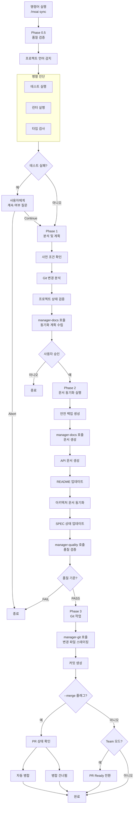

구현 완료된 코드의 문서를 동기화하고, Git 자동화를 통해 배포를 준비합니다.


**슬래시 커맨드**: Claude Code에서 `/moai:sync`를 입력하면 이 명령어를 바로 실행할 수 있습니다. `/moai`만 입력하면 사용 가능한 모든 서브커맨드 목록이 표시됩니다.


## 개요

`/moai sync`는 MoAI-ADK 워크플로우의 **Phase 3 (Sync)** 명령어입니다. Phase
2에서 구현이 완료된 코드를 분석하여 문서를 자동 생성하고, Git 커밋 및 PR (Pull
Request) 을 만들어 배포 준비를 완료합니다. 내부적으로 **manager-docs**
에이전트가 전체 과정을 관리합니다.


**왜 문서 동기화가 필요한가요?**

코드를 작성한 후 문서를 따로 작성하는 것은 번거롭고, 코드와 문서가 불일치하기
쉽습니다. `/moai sync`는 이 문제를 해결합니다:

- **코드를 분석**하여 API 문서를 **자동 생성**합니다
- README와 CHANGELOG를 **자동 업데이트**합니다
- Git 커밋과 PR을 **자동으로 생성**합니다

코드 변경과 문서가 항상 동기화되므로 "문서가 오래됐어요"라는 문제가 사라집니다.



## 사용법

Run 단계가 완료된 후 실행합니다:

```bash
# Run 단계 완료 후 /clear 실행 (권장)
> /clear

# 문서 동기화 및 PR 생성
> /moai sync
```

## 지원 모드

| 모드          | 설명                        | 사용 시기                  |
| ------------- | --------------------------- | -------------------------- |
| `auto` (기본) | 변경 파일만 스마트 동기화   | 일상 개발                  |
| `force`       | 전체 문서 재생성            | 오류 복구, 대규모 리팩토링 |
| `status`      | 읽기 전용 상태 확인         | 빠른 건강 체크             |
| `project`     | 프로젝트 전체 문서 업데이트 | 마일스톤 완료, 주기 동기화 |

### 모드별 사용법

```bash
# 기본 모드 (변경 파일만)
> /moai sync

# 전체 재생성
> /moai sync --mode force

# 상태 확인만
> /moai sync --mode status

# 프로젝트 전체 업데이트
> /moai sync --mode project
```

## 지원 플래그

| 플래그    | 설명                 | 예시                 |
| --------- | -------------------- | -------------------- |
| `--pr`   | changelog 프롬프트 건너뛰고 PR 자동 열기 | `/moai sync --pr` |
| `--merge` | 완료 후 PR 자동 병합 | `/moai sync --merge` |
| `--team`  | 에이전트 팀 모드 강제 | `/moai sync --team`   |
| `--solo`  | 하위 에이전트 모드 강제 | `/moai sync --solo`   |

### --pr 플래그

changelog 프롬프트를 건너뛰고 자동으로 PR을 엽니다:

```bash
> /moai sync --pr
```

**사용 사례**: changelog 정보를 수동으로 입력하지 않고 빠르게 PR을 만들고 싶을 때. changelog는 PR 리뷰 중에 나중에 추가할 수 있습니다.

### --merge 플래그

Sync 완료 후 자동으로 PR을 병합하고 브랜치를 정리합니다:

```bash
> /moai sync --merge
```

**작업 흐름:**

1. CI/CD 상태 확인 (gh pr checks)
2. 머지 충돌 확인 (gh pr view --json mergeable)
3. 통과 및 병합 가능 시: 자동 병합 (gh pr merge --squash --delete-branch)
4. develop 브랜치로 체크아웃, pull, 로컬 브랜치 삭제


  `--merge` 옵션은 **CI/CD가 통과한 경우에만** PR을 자동 병합합니다. 안전한
  자동화를 보장합니다.


**토큰 효율화 전략:**

- SPEC 문서의 메타데이터와 요약만 로드합니다
- 이전 단계에서 변경된 파일 목록을 캐싱하여 재활용합니다
- 문서 템플릿을 사용하여 생성 시간을 단축합니다

## 실행 과정

`/moai sync`가 내부적으로 수행하는 전체 과정입니다:



## 단계별 상세

### Phase 0.5: 품질 검증 (병렬 진단)

문서 동기화 전 프로젝트 품질을 검증합니다.

**Step 1 - 프로젝트 언어 감지:**

| 언어                | 표시 파일                                  |
| ------------------- | ------------------------------------------ |
| Python              | pyproject.toml, setup.py, requirements.txt |
| TypeScript          | tsconfig.json, package.json (typescript)   |
| JavaScript          | package.json (no tsconfig)                 |
| Go                  | go.mod, go.sum                             |
| Rust                | Cargo.toml, Cargo.lock                     |
| 기타 11개 언어 지원 |

**Step 2 - 병렬 진단:**

세 가지 도구가 동시에 실행됩니다:

| 진단 도구   | 목적             | 타임아웃 |
| ----------- | ---------------- | -------- |
| 테스트 실행 | 테스트 실패 탐지 | 180초    |
| 린터        | 코드 스타일 검사 | 120초    |
| 타입 검사   | 타입 오류 검사   | 120초    |

**Step 3 - 테스트 실패 처리:**

테스트가 실패하면 사용자에게 선택지를 제시합니다:

- **Continue**: 실패와 상관없이 계속
- **Abort**: 중단하고 종료

**Step 4 - 코드 리뷰:**

**manager-quality** 하위 에이전트가 TRUST 5 품질 검증을 수행하고 종합 보고를
생성합니다.

**Step 5 - 품질 보고서 생성:**

test-runner, linter, type-checker, code-review의 상태를 집계하고 전체 상태 (PASS
또는 WARN)를 결정합니다.

### Phase 1: 분석 및 계획

**manager-docs** 하위 에이전트가 동기화 전략을 수립합니다.

**출력:** documents_to_update, specs_requiring_sync,
project_improvements_needed, estimated_scope

### Phase 2: 문서 동기화 실행

**Step 1 - 안전 백업 생성:**

수정 전에 백업을 생성합니다:

- 타임스탬프 생성
- 백업 디렉토리: `.moai-backups/sync-{timestamp}/`
- 중요 파일 복사: README.md, docs/, .moai/specs/
- 백업 무결성 검증

**Step 2 - 문서 동기화:**

**manager-docs** 하위 에이전트가 다음 작업을 수행합니다:

- Living Documents에 변경된 코드 반영
- API 문서 자동 생성 및 업데이트
- README 필요 시 업데이트
- 아키텍처 문서 동기화
- 프로젝트 이슈 수정 및 깨진 참조 복구
- SPEC 문서가 구현과 일치하도록 확인
- 변경된 도메인 감지 및 도메인별 업데이트 생성
- 동기화 보고서 생성: `.moai/reports/sync-report-{timestamp}.md`

**Step 3 - 사후 동기화 품질 검증:**

**manager-quality** 하위 에이전트가 TRUST 5 기준으로 동기화 품질을 검증합니다:

- 모든 프로젝트 링크 완료
- 문서 잘 포맷됨
- 모든 문서 일관성 유지
- 자격증명 노출 없음
- 모든 SPEC 적절히 연결됨

**Step 4 - SPEC 상태 업데이트:**

완료된 SPEC의 상태를 일괄 업데이트하여 "completed"로 설정하고 버전 변경 및 상태
전환을 기록합니다.

### Phase 3: Git 작업 및 PR

**manager-git** 하위 에이전트가 Git 작업을 수행합니다:

**Step 1 - 커밋 생성:**

- 모든 변경된 문서, 보고서, README, docs/ 파일 스테이징
- 동기화된 문서, 프로젝트 수리, SPEC 업데이트를 나열하는 단일 커밋 생성
- git log로 커밋 검증

**Step 2 - PR Ready 전환 (Team 모드만):**

- git_strategy.mode에서 설정 확인
- Team 모드이면: Draft PR에서 Ready로 전환 (gh pr ready)
- 설정된 경우 리뷰어 지정 및 라벨 할당
- Personal 모드이면: 건너뜀

**Step 3 - 자동 병합 (--merge 플래그 시):**

- gh pr checks로 CI/CD 상태 확인
- gh pr view --json mergeable로 머지 충돌 확인
- 통과하고 병합 가능하면: gh pr merge --squash --delete-branch 실행
- develop 체크아웃, pull, 로컬 브랜치 삭제

### Phase 4: 완료 및 다음 단계

**표준 완료 보고:**

다음 내용을 요약하여 표시합니다:

- mode, scope, 업데이트/생성된 파일 수
- 프로젝트 개선 사항
- 업데이트된 문서
- 생성된 보고서
- 백업 위치

**워크트리 모드 다음 단계 (git 컨텍스트에서 자동 감지):**

| 옵션                 | 설명                         |
| -------------------- | ---------------------------- |
| 메인 디렉토리로 복귀 | 워크트리에서 나와서 메인으로 |
| 워크트리에서 계속    | 현재 워크트리에서 작업 계속  |
| 다른 워크트리로 전환 | 다른 워크트리 선택           |
| 이 워크트리 제거     | 워크트리 정리                |

**브랜치 모드 다음 단계 (git 컨텍스트에서 자동 감지):**

| 옵션                  | 설명                      |
| --------------------- | ------------------------- |
| 변경사항 커밋 및 푸시 | 원격에 변경사항 업로드    |
| 메인 브랜치로 복귀    | develop 또는 main으로     |
| PR 생성               | Pull Request 생성         |
| 브랜치에서 계속       | 현재 브랜치에서 작업 계속 |

**표준 다음 단계:**

| 옵션           | 설명                     |
| -------------- | ------------------------ |
| 다음 SPEC 생성 | `/moai plan` 실행        |
| 새 세션 시작   | `/clear` 실행            |
| PR 검토        | Team 모드: gh pr view    |
| 개발 계속      | Personal 모드: 계속 작업 |

## 생성되는 문서

`/moai sync`가 자동으로 생성하거나 업데이트하는 문서는 다음과 같습니다:

### API 문서

구현된 코드에서 API 엔드포인트, 함수 시그니처, 클래스 구조를 분석하여 문서를
생성합니다.

| 문서 유형    | 내용                         | 생성 조건               |
| ------------ | ---------------------------- | ----------------------- |
| API 레퍼런스 | 엔드포인트, 요청/응답 스키마 | REST API가 포함된 경우  |
| 함수 문서    | 파라미터, 반환값, 예외       | 공개 함수가 포함된 경우 |
| 클래스 문서  | 속성, 메서드, 상속 관계      | 클래스가 포함된 경우    |

### README 업데이트

프로젝트의 README.md를 다음과 같이 업데이트합니다:

- **사용법 섹션**: 새로 추가된 기능의 사용 예시
- **API 섹션**: 새 엔드포인트 목록 추가
- **의존성 섹션**: 새로 추가된 라이브러리 반영

### CHANGELOG 작성

[Keep a Changelog](https://keepachangelog.com) 형식으로 변경 이력을 기록합니다:

```markdown
## [Unreleased]

### Added

- JWT 기반 사용자 인증 시스템 (SPEC-AUTH-001)
  - POST /api/auth/register - 회원가입
  - POST /api/auth/login - 로그인
  - POST /api/auth/refresh - 토큰 갱신
```

## Git 자동화

`/moai sync`는 문서 생성 후 Git 작업을 자동으로 수행합니다.

### 커밋 메시지 형식

MoAI-ADK는 [Conventional Commits](https://www.conventionalcommits.org/) 형식을
따릅니다:

| 접두사     | 용도      | 예시                                        |
| ---------- | --------- | ------------------------------------------- |
| `feat`     | 새 기능   | `feat(auth): add JWT authentication`        |
| `fix`      | 버그 수정 | `fix(auth): resolve token expiration issue` |
| `docs`     | 문서      | `docs(auth): update API documentation`      |
| `refactor` | 리팩토링  | `refactor(auth): centralize auth logic`     |
| `test`     | 테스트    | `test(auth): add characterization tests`    |

## 품질 게이트

Sync 단계의 품질 기준은 Run 단계보다 문서 중심입니다:

| 항목     | 기준          | 설명                        |
| -------- | ------------- | --------------------------- |
| LSP 오류 | **0개**       | 코드에 오류가 없어야 합니다 |
| 경고     | **최대 10개** | 문서 생성 시 일부 경고 허용 |
| LSP 상태 | **Clean**     | 전체적으로 깨끗한 상태      |


  품질 게이트를 통과하지 못하면 문서 생성과 PR 생성이 **중단**됩니다. 먼저
  `/moai run`으로 돌아가 코드 문제를 수정하거나, `/moai fix`로 빠르게 오류를
  수정하세요.


## 실전 예시

### 예시: 문서 동기화 및 PR 생성

**1단계: Run 단계 완료 확인**

```bash
# Run 단계가 완료되었는지 확인
# manager-ddd가 "DONE" 또는 "COMPLETE" 마커를 출력했어야 합니다
```

**2단계: 토큰 정리 후 Sync 실행**

```bash
> /clear
> /moai sync
```

**3단계: manager-docs가 자동으로 수행하는 작업**

manager-docs 에이전트가 문서 동기화를 위해 수행하는 4개의 Phase입니다.

---

#### Phase 0.5: 품질 검증

문서 생성 전 프로젝트 상태를 검증합니다.

```bash
Phase 0.5: 품질 검증
  프로젝트 언어: Python
  테스트: 36/36 통과
  린터: 0 오류
  타입 검사: 0 오류
  커버리지: 89%
  전체 상태: PASS
```

---

#### Phase 1: 분석 및 계획

Git 변경 사항을 분석하고 동기화 계획을 수립합니다.

```bash
Phase 1: 분석 및 계획
  Git 변경: 12개 파일 수정
  동기화 계획: API 문서 1개, README 업데이트, CHANGELOG 추가
  사용자 승인: 완료
```

---

#### Phase 2: 문서 동기화

필요한 문서를 생성하고 기존 문서를 업데이트합니다.

```bash
Phase 2: 문서 동기화
  백업 생성: .moai-backups/sync-20260128-143052/
  API 문서: docs/api/auth.md (신규)
  README.md: 사용법 섹션 업데이트
  CHANGELOG.md: v1.1.0 항목 추가
  SPEC-AUTH-001 상태: ACTIVE → COMPLETED

  품질 검증: 모든 항목 통과
```

---

#### Phase 3: Git 작업

커밋을 생성하고 PR을 엽니다.

```bash
Phase 3: Git 작업
  커밋 생성: docs(auth): synchronize documentation for SPEC-AUTH-001
  PR 상태: Draft → Ready (Team 모드)
```

**4단계: 생성된 PR 확인**

```bash
# 터미널에서 PR 확인
$ gh pr view 42
```

생성된 PR에는 SPEC 요구사항, 변경 파일 목록, 테스트 결과가 자동으로 포함됩니다.

## 자주 묻는 질문

### Q: PR을 자동으로 만들고 싶지 않으면?

`git-strategy.yaml`에서 `auto_pr: false`로 설정하면 커밋까지만 자동으로
수행합니다. PR은 원하는 시점에 직접 만들 수 있습니다.

### Q: CHANGELOG 형식을 바꿀 수 있나요?

현재는 [Keep a Changelog](https://keepachangelog.com) 형식을 기본으로
사용합니다. 커스텀 형식은 향후 지원 예정입니다.

### Q: 문서만 생성하고 Git 작업은 하지 않으려면?

`git-strategy.yaml`에서 `auto_commit: false`로 설정하면 문서 생성만 수행합니다.
Git 작업은 수동으로 진행할 수 있습니다.

### Q: 품질 게이트 실패 시 어떻게 하나요?

두 가지 방법이 있습니다:

```bash
# 방법 1: /moai fix로 빠른 수정
> /moai fix "린트 오류 수정"

# 방법 2: /moai run으로 다시 구현
> /moai run SPEC-AUTH-001
```

수정 후 다시 `/moai sync`를 실행하세요.

### Q: `/moai sync`와 `/moai`의 차이는 무엇인가요?

`/moai sync`는 **구현 완료된 코드의 문서화만** 담당합니다. `/moai`는 SPEC
생성부터 구현, 문서화까지 **전체 워크플로우**를 자동으로 수행합니다.

## v2.9.0 신규 기능

### 워크트리 컨텍스트 Auto-Merge

워크트리 환경에서 실행 시 auto-merge가 기본 동작으로 변경됩니다.

**워크트리 컨텍스트 감지:**
- 현재 git 디렉토리 경로에 `/.moai/worktrees/` 포함 여부
- 또는 `.moai/worktrees/registry.json`에 현재 SPEC-ID의 활성 항목 존재

**플래그 동작 변경:**

| 플래그 | v2.8 이전 | v2.9.0 이후 |
|--------|----------|------------|
| (없음) | 머지 안 함 | 워크트리 컨텍스트에서 **자동 머지** |
| `--merge` | 자동 머지 | **Deprecated** (경고 표시) |
| `--no-merge` | N/A | 자동 머지 건너뛰기 |

**Auto-merge 실행 조건:**
1. 모든 CI/CD 체크 통과
2. 머지 충돌 없음
3. `--no-merge` 플래그 미설정


CI 실패 또는 충돌 시 자동 머지를 수행하지 않으며, 복구 명령어와 함께 오류를 보고합니다.


### 포스트-머지 자동 클린업

PR 머지 성공 후 자동 정리를 수행합니다.

**조건:** Auto-merge 성공 AND `workflow.worktree.auto_cleanup == true`

**정리 항목:**
1. 워크트리 디렉토리 제거
2. 피처 브랜치 삭제 (`--delete-branch`)
3. 워크트리 레지스트리 업데이트


클린업 실패는 머지 결과에 영향을 주지 않습니다. 실패 시: `moai worktree done SPEC-{ID}`로 수동 정리하세요.


## 관련 문서

- [/moai run](/workflow-commands/moai-run) - 이전 단계: DDD 구현
- [TRUST 5 품질 시스템](/core-concepts/trust-5) - 품질 게이트 상세 설명
- [빠른 시작](/getting-started/quickstart) - 전체 워크플로우 튜토리얼
