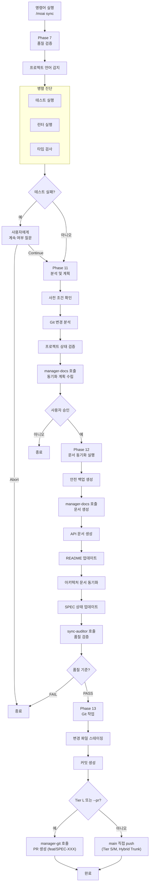

구현이 끝난 코드에 맞춰 문서를 갱신하고, Git 작업을 자동으로 처리해 배포까지 준비해 둡니다. 3-Phase 라이프사이클의 마지막 단계입니다.


**슬래시 커맨드**: Claude Code에서 `/moai:sync`를 입력하면 이 명령어를 바로 실행할 수 있습니다. `/moai`만 입력하면 사용 가능한 모든 서브커맨드 목록이 표시됩니다.


## 개요

`/moai sync`는 MoAI-ADK 워크플로우의 **Phase 3 (Sync)** 명령어입니다. Phase 2에서 구현을 마친 코드를 훑어 문서를 만들고, Git 커밋과 PR (Pull Request)까지 붙여 배포 준비를 끝냅니다. 안에서는 **manager-docs** 에이전트가 전 과정을 챙깁니다.

동기화 결과물은 **sync-auditor**가 따로 평가합니다. 문서를 만든 에이전트와 검사하는 에이전트가 나뉘어 있으니, "동기화했다"는 말이 아니라 확인된 증거로 단계가 닫힙니다.


**왜 문서 동기화가 필요한가요?**

코드를 다 짜고 나서 문서를 따로 쓰는 일은 번거롭고, 그러다 보면 코드와 문서가
쉽게 어긋납니다. `/moai sync`가 이 틈을 메웁니다:

- **코드를 읽어** API 문서를 **직접 만들어 줍니다**
- README와 CHANGELOG를 **알아서 갱신합니다**
- Git 커밋과 PR도 **자동으로 만듭니다**

코드가 바뀔 때마다 문서가 따라오니 "문서가 오래됐어요"라는 말이 나올 일이 없습니다.



## 사용법

Run 단계가 완료된 후 실행합니다:

```bash
# Run 단계 완료 후 /clear 실행 (권장)
> /clear

# 문서 동기화 및 PR 생성
> /moai sync
```

## 지원 모드

| 모드          | 설명                        | 사용 시기                  |
| ------------- | --------------------------- | -------------------------- |
| `auto` (기본) | 변경 파일만 스마트 동기화   | 일상 개발                  |
| `force`       | 전체 문서 재생성            | 오류 복구, 대규모 리팩토링 |
| `status`      | 읽기 전용 상태 확인         | 빠른 건강 체크             |
| `project`     | 프로젝트 전체 문서 업데이트 | 마일스톤 완료, 주기 동기화 |

기본값인 `auto` 모드가 바뀐 파일만 골라 처리하는 것도 비용을 줄이려는 설계입니다. 전체 문서를 굳이 다시 만들 이유가 없으면 그만큼 토큰을 쓰지 않습니다.

### 모드별 사용법

```bash
# 기본 모드 (변경 파일만)
> /moai sync

# 전체 재생성
> /moai sync --mode force

# 상태 확인만
> /moai sync --mode status

# 프로젝트 전체 업데이트
> /moai sync --mode project
```

## 지원 플래그

| 플래그    | 설명                 | 예시                 |
| --------- | -------------------- | -------------------- |
| `--pr`   | changelog 프롬프트 건너뛰고 PR 자동 열기 (Tier L 또는 리뷰 필요 시) | `/moai sync --pr` |
| `--skip-mx` | MX 태그 검사 건너뛰기 | `/moai sync --skip-mx` |


`--merge`와 `--team` / `--solo` 플래그는 **Deprecated**되었거나 아예 **빠졌습니다**.

- `--merge`: Hybrid Trunk 1-person OSS 운영에서는 Tier S/M이 main에 바로 push하는 게 기본이라, PR 자동 병합이 더는 필요하지 않습니다. Tier L에서 PR을 만든 뒤 병합해야 한다면 `gh pr merge`를 직접 실행하세요.
- `--team` / `--solo`: Agent Teams 정적 오케스트레이션 계층이 RETIRED되었습니다. `--team`을 주면 `MODE_TEAM_UNAVAILABLE` 폴백이 걸리고, 남은 모드가 서브에이전트 하나뿐이라 `--solo`도 쓸 일이 없습니다.


### --pr 플래그

changelog를 묻는 프롬프트를 건너뛰고 곧바로 PR을 엽니다:

```bash
> /moai sync --pr
```

**언제 쓰나**: changelog를 일일이 입력하지 않고 PR부터 빠르게 올리고 싶을 때 씁니다. changelog는 PR 리뷰 도중에 나중에 채워도 됩니다.

### Tier-based PR 라우팅

PR을 만들지 말지는 SPEC tier를 보고 알아서 정해집니다 (Hybrid Trunk 1-person OSS 기본 동작):

| Tier | PR 생성 | 실행 주체 |
| ---- | ------- | --------- |
| **Tier S** (≤ 300 LOC, < 5 files) | main 직접 push (PR 없음) | manager-develop 또는 orchestrator |
| **Tier M** (300-1000 LOC, 5-15 files) | main 직접 push (PR 없음) | manager-develop 또는 orchestrator |
| **Tier L** (> 1000 LOC 또는 constitutional) | `feat/SPEC-XXX` 브랜치에서 PR via manager-git | manager-git |
| **명시적 `--pr`** (모든 tier) | `feat/SPEC-XXX` 브랜치에서 PR via manager-git | manager-git |

Tier S/M은 CI 4 status checks와 pre-push hook이 안전을 받쳐 주므로 main에 바로 push합니다. Tier L은 건드리는 범위가 넓어서 PR 리뷰 기간과 전체 CI 매트릭스 검증을 거쳐야 합니다.

**토큰을 아끼는 방법:**

- SPEC 문서에서 메타데이터와 요약만 읽습니다
- 앞 단계에서 얻은 변경 파일 목록을 캐싱해 두었다가 다시 씁니다
- 문서 템플릿을 써서 생성 시간을 줄입니다

## 실행 과정

`/moai sync`가 내부적으로 수행하는 전체 과정입니다:


```mermaid
flowchart TD
    A["명령어 실행<br/>/moai sync"] --> B["Phase 7<br/>품질 검증"]

    B --> C["프로젝트 언어 감지"]
    C --> D["병렬 진단 실행"]

    subgraph D["병렬 진단"]
        D1["테스트 실행"]
        D2["린터 실행"]
        D3["타입 검사"]
    end

    D --> E{"테스트 실패?"}
    E -->|예| F["사용자에게<br/>계속 여부 질문"]
    F -->|Abort| G["종료"]
    F -->|Continue| H["Phase 1 계속"]

    E -->|아니오| H["Phase 11<br/>분석 및 계획"]

    H --> I["사전 조건 확인"]
    I --> J["Git 변경 분석"]
    J --> K["프로젝트 상태 검증"]
    K --> L["manager-docs 호출<br/>동기화 계획 수립"]

    L --> M{"사용자 승인"}
    M -->|아니오| N["종료"]
    M -->|예| O["Phase 12<br/>문서 동기화 실행"]

    O --> P["안전 백업 생성"]
    P --> Q["manager-docs 호출<br/>문서 생성"]
    Q --> R["API 문서 생성"]
    R --> S["README 업데이트"]
    S --> T["아키텍처 문서 동기화"]
    T --> U["SPEC 상태 업데이트"]

    U --> V["sync-auditor 호출<br/>품질 검증"]
    V --> W{"품질 기준?"}
    W -->|FAIL| G
    W -->|PASS| X["Phase 13<br/>Git 작업"]

    X --> Y["변경 파일 스테이징"]
    Y --> Z["커밋 생성"]
    Z --> AA{"Tier L 또는 --pr?"}
    AA -->|예| AB["manager-git 호출<br/>PR 생성 (feat/SPEC-XXX)"]
    AB --> AC["완료"]
    AA -->|아니오| AD["main 직접 push<br/>(Tier S/M, Hybrid Trunk)"]
    AD --> AC
```

## 단계별 상세

### Phase 7: 품질 검증 (병렬 진단)

문서를 손대기 전에 프로젝트 품질부터 확인합니다.

**Step 1 - 프로젝트 언어 감지:**

| 언어                | 표시 파일                                  |
| ------------------- | ------------------------------------------ |
| Python              | pyproject.toml, setup.py, requirements.txt |
| TypeScript          | tsconfig.json, package.json (typescript)   |
| JavaScript          | package.json (no tsconfig)                 |
| Go                  | go.mod, go.sum                             |
| Rust                | Cargo.toml, Cargo.lock                     |
| 기타 11개 언어 지원 |

**Step 2 - 병렬 진단:**

세 가지 도구를 한꺼번에 돌립니다:

| 진단 도구   | 목적             | 타임아웃 |
| ----------- | ---------------- | -------- |
| 테스트 실행 | 테스트 실패 탐지 | 180초    |
| 린터        | 코드 스타일 검사 | 120초    |
| 타입 검사   | 타입 오류 검사   | 120초    |

**Step 3 - 테스트 실패 처리:**

테스트가 깨지면 사용자에게 두 갈래를 내놓습니다:

- **Continue**: 실패를 무릅쓰고 계속
- **Abort**: 여기서 멈추고 종료

**Step 4 - 코드 리뷰:**

**sync-auditor** 하위 에이전트가 TRUST 5 품질 검증을 돌리고 결과를 한데 모아 보고합니다.

**Step 5 - 품질 보고서 생성:**

test-runner, linter, type-checker, code-review의 상태를 모아 전체 상태 (PASS 또는 WARN)를 정합니다.

### Phase 11: 분석 및 계획

**manager-docs** 하위 에이전트가 동기화를 어떻게 진행할지 짭니다.

**출력:** documents_to_update, specs_requiring_sync, project_improvements_needed, estimated_scope

### Phase 12: 문서 동기화 실행

**Step 1 - 안전 백업 생성:**

파일에 손대기 전에 백업부터 떠 둡니다:

- 타임스탬프 생성
- 백업 디렉토리: `.moai-backups/sync-{timestamp}/`
- 중요 파일 복사: README.md, docs/, .moai/specs/
- 백업 무결성 검증

**Step 2 - 문서 동기화:**

**manager-docs** 하위 에이전트가 다음 작업을 수행합니다:

- 바뀐 코드를 Living Documents에 반영
- API 문서를 만들고 갱신
- 필요하면 README도 손보기
- 아키텍처 문서 맞추기
- 프로젝트 이슈를 고치고 끊어진 참조를 되살리기
- SPEC 문서가 구현과 어긋나지 않는지 확인
- 바뀐 도메인을 찾아 도메인별 갱신 내용 만들기
- 동기화 보고서 남기기: `.moai/reports/sync-report-{timestamp}.md`

**Step 3 - 사후 동기화 품질 검증:**

**sync-auditor** 하위 에이전트가 TRUST 5 기준으로 동기화 품질을 점검합니다:

- 프로젝트 링크가 빠짐없이 걸렸는가
- 문서 서식이 제대로 잡혔는가
- 문서끼리 어긋나는 곳은 없는가
- 자격증명이 새어 나가지 않았는가
- SPEC이 모두 알맞게 연결됐는가

**Step 4 - SPEC 상태 업데이트 (3-Phase 클로즈):**

manager-docs는 SPEC 아티팩트의 프론트매터 상태를 `in-progress`에서 `implemented`로 넘깁니다. 마지막 `completed` 전환은 커밋을 따로 내지 않고 이 sync 커밋에 함께 실립니다 — run 단계에서 `in-progress`로 들어온 SPEC이 sync 단계에서 `implemented`를 거쳐, sync 커밋과 함께 `completed`로 닫히는 셈입니다. manager-docs는 spec.md/plan.md/acceptance.md 본문에는 손대지 않고 프론트매터 상태 전환만 맡습니다.

### Phase 13: Git 작업 및 PR

**manager-git** 하위 에이전트가 Git 작업을 수행합니다:

**Step 1 - 커밋 생성:**

- 바뀐 문서, 보고서, README, docs/ 파일을 모두 스테이징
- 동기화한 문서, 손본 프로젝트 항목, SPEC 갱신 내역을 한 커밋에 정리
- git log로 커밋이 제대로 들어갔는지 확인

**Step 2 - Tier-based PR 라우팅:**

SPEC tier에 따라 Git 작업 경로가 갈립니다:

- **Tier S/M** (기본): main 브랜치에 바로 push. CI 4 status checks와 pre-push hook이 안전을 받쳐 줍니다.
- **Tier L 또는 `--pr` 플래그**: manager-git이 `feat/SPEC-XXX` 브랜치에서 PR을 엽니다 (`gh pr create`). PR을 연 다음 리뷰어를 지정하고 라벨을 붙입니다.


`--merge` 플래그는 Deprecated되었습니다. Tier L PR을 병합하려면 CI가 통과한 뒤 `gh pr merge --squash --delete-branch`를 직접 실행하세요.


### Phase 14: 완료 및 다음 단계

**표준 완료 보고:**

다음 내용을 간추려 보여 줍니다:

- mode, scope, 업데이트/생성된 파일 수
- 프로젝트 개선 사항
- 업데이트된 문서
- 생성된 보고서
- 백업 위치

**워크트리 모드 다음 단계 (git 컨텍스트에서 자동 감지):**

| 옵션                 | 설명                         |
| -------------------- | ---------------------------- |
| 메인 디렉토리로 복귀 | 워크트리에서 나와서 메인으로 |
| 워크트리에서 계속    | 현재 워크트리에서 작업 계속  |
| 다른 워크트리로 전환 | 다른 워크트리 선택           |
| 이 워크트리 제거     | 워크트리 정리                |

**브랜치 모드 다음 단계 (git 컨텍스트에서 자동 감지):**

| 옵션                  | 설명                      |
| --------------------- | ------------------------- |
| 변경사항 커밋 및 푸시 | 원격에 변경사항 업로드    |
| 메인 브랜치로 복귀    | develop 또는 main으로     |
| PR 생성               | Pull Request 생성         |
| 브랜치에서 계속       | 현재 브랜치에서 작업 계속 |

**표준 다음 단계:**

| 옵션           | 설명                     |
| -------------- | ------------------------ |
| 다음 SPEC 생성 | `/moai plan` 실행        |
| 새 세션 시작   | `/clear` 실행            |
| PR 검토        | Tier L: `gh pr view`     |
| 개발 계속      | Tier S/M: 계속 작업      |

## 생성되는 문서

`/moai sync`가 알아서 만들거나 갱신하는 문서는 다음과 같습니다:

### API 문서

구현된 코드에서 API 엔드포인트, 함수 시그니처, 클래스 구조를 읽어 문서로 옮깁니다.

| 문서 유형    | 내용                         | 생성 조건               |
| ------------ | ---------------------------- | ----------------------- |
| API 레퍼런스 | 엔드포인트, 요청/응답 스키마 | REST API가 포함된 경우  |
| 함수 문서    | 파라미터, 반환값, 예외       | 공개 함수가 포함된 경우 |
| 클래스 문서  | 속성, 메서드, 상속 관계      | 클래스가 포함된 경우    |

### README 업데이트

프로젝트의 README.md에서 다음을 손봅니다:

- **사용법 섹션**: 새로 붙은 기능의 사용 예시
- **API 섹션**: 새 엔드포인트를 목록에 추가
- **의존성 섹션**: 새로 들인 라이브러리 반영

### CHANGELOG 작성

[Keep a Changelog](https://keepachangelog.com) 형식으로 변경 이력을 남깁니다:

```markdown
## [Unreleased]

### Added

- JWT 기반 사용자 인증 시스템 (SPEC-AUTH-001)
  - POST /api/auth/register - 회원가입
  - POST /api/auth/login - 로그인
  - POST /api/auth/refresh - 토큰 갱신
```

## Git 자동화

`/moai sync`는 문서 생성 후 Git 작업을 자동으로 수행합니다.

### 커밋 메시지 형식

MoAI-ADK는 [Conventional Commits](https://www.conventionalcommits.org/) 형식을 따릅니다:

| 접두사     | 용도      | 예시                                        |
| ---------- | --------- | ------------------------------------------- |
| `feat`     | 새 기능   | `feat(auth): add JWT authentication`        |
| `fix`      | 버그 수정 | `fix(auth): resolve token expiration issue` |
| `docs`     | 문서      | `docs(auth): update API documentation`      |
| `refactor` | 리팩토링  | `refactor(auth): centralize auth logic`     |
| `test`     | 테스트    | `test(auth): add characterization tests`    |

## PR 머지 후 CI 모니터링

`/moai sync`가 PR을 연 직후, MoAI-ADK는 두 단계로 자동 모니터링을 돌립니다. Wave 1은 CI 결과를 폴링하며 어느 required check가 깨졌는지 가려내고, Wave 2는 실패가 나온 경우 자동 fix 루프로 들어갑니다. PR을 올린 뒤 사람이 CI 화면을 들여다보고 있을 필요 없이 루프가 결과를 지켜보고 대응합니다. 에이전틱 루프 엔지니어링이 CI 영역까지 뻗은 구조입니다.

### Wave 1 — CI 결과 폴링

- 30초 간격으로 `gh pr checks` 호출 (GitHub API rate limit을 존중)
- hard timeout은 30분 — 그 안에 required check가 끝나지 않으면
  watch loop가 exit code 3으로 종료
- required check 정의 SSoT: `.github/required-checks.yml`
- auxiliary check는 fail해도 merge를 막지 않음 (warning만 남김)

### Wave 2 — 자동 fix 루프 (최대 3회)

required check가 fail하면 MoAI-ADK가 자동 fix 루프로 들어갑니다.

- iteration마다 **새 commit**으로 fix를 얹음 (force-push / amend 금지)
- PR push 한 번당 최대 3 iterations (세션 단위가 아님)
- iteration이 4번째로 넘어가면 blocking AskUserQuestion을 띄워 사용자에게 넘김

### 자동 처리 vs 사람 결정 필요

| 결함 유형                  | 자동 처리?    | 비고                                         |
| -------------------------- | ------------- | -------------------------------------------- |
| lint error                 | 자동          | `golangci-lint`로 autofix되는 항목           |
| format drift               | 자동          | `gofmt` / `prettier` 등                      |
| test syntax error          | 자동          | import 누락 / 컴파일 에러                    |
| **data race**              | **사람 결정** | semantic failure — 의도한 동시성인지 사람이 판단 |
| **deadlock**               | **사람 결정** | semantic failure                             |
| **panic**                  | **사람 결정** | semantic failure                             |
| **test assertion failure** | **사람 결정** | spec과 코드 중 어느 쪽이 옳은지 사람이 판단  |

### auto-fix가 절대 건드리지 않는 파일


auto-fix 루프는 다음 파일에 **절대 손대지 않습니다**:

- `.env`, `.env.*` (환경변수 / 비밀)
- credentials 파일
- `scripts/ci-watch/run.sh` (Wave 2 infrastructure)
- `.github/required-checks.yml` (Wave 1 SSoT)


### 관련 문서

- 폴링 doctrine SSoT: `.claude/rules/moai/workflow/ci-watch-protocol.md`
- auto-fix doctrine SSoT: `.claude/rules/moai/workflow/ci-autofix-protocol.md`

## 품질 게이트

Sync 단계의 품질 기준은 Run 단계보다 문서 쪽에 무게가 실립니다:

| 항목     | 기준          | 설명                        |
| -------- | ------------- | --------------------------- |
| LSP 오류 | **0개**       | 코드에 오류가 없어야 합니다 |
| 경고     | **최대 10개** | 문서 생성 시 일부 경고 허용 |
| LSP 상태 | **Clean**     | 전체적으로 깨끗한 상태      |


  품질 게이트를 넘지 못하면 문서 생성도 PR 생성도 **거기서 멈춥니다**. 먼저
  `/moai run`으로 돌아가 코드 문제를 잡거나, `/moai fix`로 오류를 빠르게
  털어 내세요.


## Sync 단계 Human Gates

Sync 과정에는 HUMAN GATE가 두 개 있습니다. 이 게이트는 저절로 열리지 않으며, FAIL이나 INCONCLUSIVE 판정이 나오면 체인이 거기서 멈춥니다.

| 게이트 | 이름 | 시점 | 역할 |
| ------ | ---- | ---- | ---- |
| `gate-sync-1` | Pre-Sync Quality | Phase 3 진입 전 | 작업 트리가 clean하고 모든 테스트가 통과하는지 확인 |
| `gate-sync-2` | Documentation Scope | 문서 생성 범위 승인 | divergence report를 사용자가 검토하고 문서 재생성 범위 승인 |

`gate-sync-1`은 코드 품질이 sync에 들어갈 조건을 갖췄는지 봅니다 — 테스트가 깨져 있거나 작업 트리가 지저분하면 문서 생성으로 넘어가지 않습니다. `gate-sync-2`는 어떤 문서를 다시 만들지 사용자가 짚고 넘어가는 승인 단계입니다 — 자동 생성이 엉뚱한 문서까지 건드리는 일을 막아 줍니다.


sync-auditor 판정이 FAIL이나 INCONCLUSIVE로 나오거나 게이트가 막으면 체인이 거기서 끊깁니다. 게이트를 지나지 않고 저절로 끝나는 경우는 없습니다.


## 워크트리 컨텍스트 Auto-Merge

워크트리 환경에서 실행하면 auto-merge가 기본으로 걸립니다.

**워크트리 컨텍스트 감지:**
- 지금 git 디렉토리 경로에 `/.moai/worktrees/`가 들어 있는지
- 아니면 `.moai/worktrees/registry.json`에 현재 SPEC-ID의 활성 항목이 있는지

**플래그 동작:**

워크트리 컨텍스트에서는 플래그를 따로 주지 않아도 자동 머지가 기본입니다. `--merge` 플래그는 **Deprecated**되었으니 (쓰면 경고가 뜹니다), Tier L PR을 병합해야 하면 CI가 통과한 뒤 `gh pr merge`를 직접 실행하세요. `/moai sync`가 받는 플래그는 `--pr` / `--merge` (deprecated) / `--skip-mx` 셋뿐입니다.

**Auto-merge가 걸리는 조건:**
1. CI/CD 체크를 모두 통과
2. 머지 충돌이 없음


CI가 실패했거나 충돌이 있으면 자동 머지를 하지 않고, 복구 명령어와 함께 오류를 알려 줍니다.


### 포스트-머지 자동 클린업

PR이 무사히 머지되면 뒷정리까지 알아서 합니다.

**조건:** Auto-merge 성공 AND `workflow.worktree.auto_cleanup == true`

**정리 항목:**
1. 워크트리 디렉토리 제거
2. 피처 브랜치 삭제 (`--delete-branch`)
3. 워크트리 레지스트리 갱신


정리에 실패해도 머지 결과에는 영향이 없습니다. 실패했다면 `moai worktree done SPEC-{ID}`로 직접 정리하세요.


## `/cd` 캐시 보존 재개 (CC 2.1.169+)

디렉터리를 옮겨 가며 여러 단계를 이어 갈 때 (예: run과 sync 사이에 L2 worktree로 들어갈 때) Claude Code 2.1.169+는 `/cd <path>`를 내줍니다. 세션의 작업 디렉터리를 **프롬프트 캐시를 살려 둔 채** 옮기는 명령이라, cwd가 바뀌어도 그동안 쌓인 추론 컨텍스트를 처음부터 다시 만들지 않습니다. 새 터미널을 여는 방식과 비교하면 차이가 분명합니다. `/cd`는 컨텍스트를 그대로 들고 가고, 새 터미널은 맨바닥에서 시작합니다. run-phase 컨텍스트를 안고 L2 worktree에서 sync-phase로 넘어갈 때는 `/cd <worktree-path>`가 가장 걸리는 것 없는 길입니다. 캐시 적중률이 곧 토큰 비용이니, 프롬프트 캐시를 아껴 두는 습관은 비용 면에서도 남는 장사입니다. 이 전환이 `cwd` 필드에 어떻게 찍히는지는 [Statusline 가이드](/ko/advanced/statusline)를 참조하세요.

## 실전 예시

### 예시: 문서 동기화 및 PR 생성

**1단계: Run 단계 완료 확인**

```bash
# Run 단계가 완료되었는지 확인
# manager-develop가 "DONE" 또는 "COMPLETE" 마커를 출력했어야 합니다
```

**2단계: 토큰 정리 후 Sync 실행**

```bash
> /clear
> /moai sync
```

**3단계: manager-docs가 자동으로 수행하는 작업**

manager-docs 에이전트가 문서를 맞추면서 밟는 네 개의 Phase입니다.

---

#### Phase 7: 품질 검증

문서를 만들기 전에 프로젝트 상태를 확인합니다.

```bash
Phase 7: 품질 검증
  프로젝트 언어: Python
  테스트: 36/36 통과
  린터: 0 오류
  타입 검사: 0 오류
  커버리지: 89%
  전체 상태: PASS
```

---

#### Phase 11: 분석 및 계획

Git 변경 사항을 살펴보고 동기화 계획을 짭니다.

```bash
Phase 11: 분석 및 계획
  Git 변경: 12개 파일 수정
  동기화 계획: API 문서 1개, README 업데이트, CHANGELOG 추가
  사용자 승인: 완료
```

---

#### Phase 12: 문서 동기화

필요한 문서를 새로 만들고 기존 문서를 손봅니다.

```bash
Phase 12: 문서 동기화
  백업 생성: .moai-backups/sync-20260128-143052/
  API 문서: docs/api/auth.md (신규)
  README.md: 사용법 섹션 업데이트
  CHANGELOG.md: v1.1.0 항목 추가
  SPEC-AUTH-001 상태: ACTIVE → COMPLETED

  품질 검증: 모든 항목 통과
```

---

#### Phase 13: Git 작업

커밋을 만들고 PR을 엽니다.

```bash
Phase 13: Git 작업
  커밋 생성: docs(auth): synchronize documentation for SPEC-AUTH-001
  Push: main 직접 push (Tier M, Hybrid Trunk)
```

**4단계: 생성된 PR 확인**

```bash
# 터미널에서 PR 확인
$ gh pr view 42
```

이렇게 열린 PR에는 SPEC 요구사항, 변경 파일 목록, 테스트 결과가 알아서 담깁니다.

## 자주 묻는 질문

### Q: PR을 자동으로 만들고 싶지 않으면?

Hybrid Trunk 운영에서 Tier S/M SPEC은 기본적으로 main에 바로 push하므로 PR 자체가 생기지 않습니다. Tier L에서도 PR 없이 커밋만 남기고 싶다면, sync가 끝난 뒤 `git push` 시점을 직접 잡으면 됩니다.

### Q: CHANGELOG 형식을 바꿀 수 있나요?

지금은 [Keep a Changelog](https://keepachangelog.com) 형식을 기본으로 씁니다. 형식을 직접 정하는 기능은 나중에 지원할 예정입니다.

### Q: 문서만 생성하고 Git 작업은 하지 않으려면?

`git-strategy.yaml`에 `auto_commit: false`를 넣으면 문서만 만들고 멈춥니다. Git 작업은 직접 하면 됩니다.

### Q: 품질 게이트 실패 시 어떻게 하나요?

두 가지 방법이 있습니다:

```bash
# 방법 1: /moai fix로 빠른 수정
> /moai fix "린트 오류 수정"

# 방법 2: /moai run으로 다시 구현
> /moai run SPEC-AUTH-001
```

수정 후 다시 `/moai sync`를 실행하세요.

### Q: `/moai sync`와 `/moai`의 차이는 무엇인가요?

`/moai sync`는 **구현 완료된 코드의 문서화만** 담당합니다. `/moai`는 SPEC 생성부터 구현, 문서화까지 **전체 워크플로우**를 자동으로 수행합니다.

## 관련 문서

- [/moai run](/workflow-commands/moai-run) - 이전 단계: DDD 구현
- [TRUST 5 품질 시스템](/core-concepts/trust-5) - 품질 게이트 상세 설명
- [빠른 시작](/getting-started/quickstart) - 전체 워크플로우 튜토리얼
