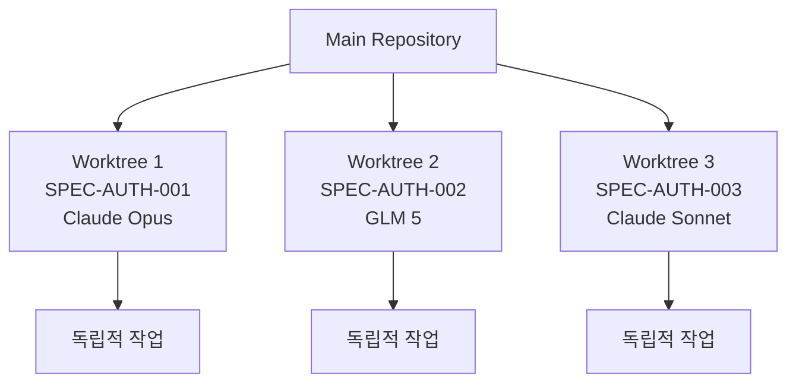
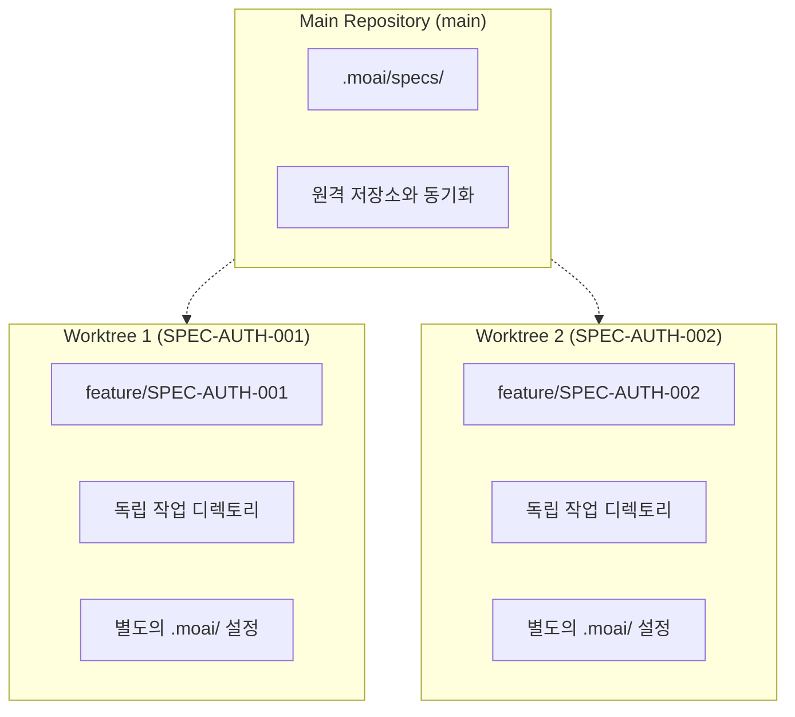
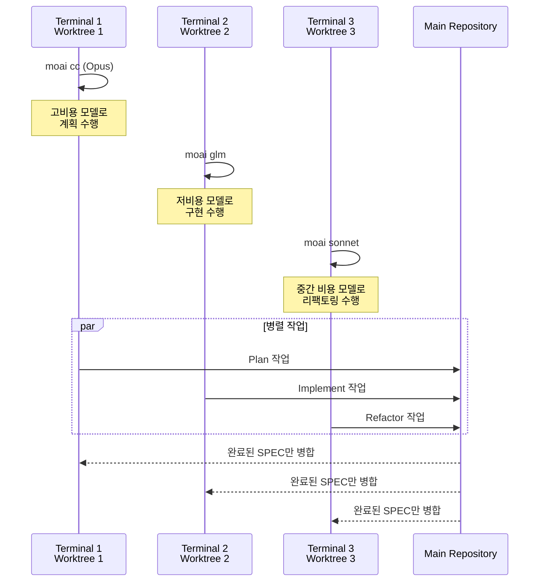
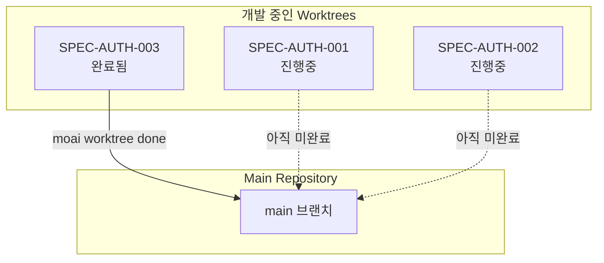

# Git Worktree 개요

Git Worktree는 MoAI-ADK에서 병렬 개발을 위한 핵심 기능입니다. 각 SPEC을 독립적인
환경에서 개발할 수 있도록 완전한 격리를 제공합니다.

## 왜 Worktree가 필요한가요?

### 문제점: LLM 설정의 공유

기존 MoAI-ADK에서 `moai glm` 또는 `moai cc` 명령어로 LLM을 변경하면 **모든 열린
세션에 동일한 LLM이 적용**됩니다. 이로 인해 다음과 같은 문제가 발생합니다:

- **SPEC 간 간섭**: 다른 SPEC을 개발할 때 LLM 설정이 서로 영향을 미침
- **병렬 개발 불가**: 동시에 여러 SPEC을 개발할 수 없음
- **비용 효율성 저하**: 모든 세션에서 고비용 Opus를 사용해야 함

### 해결책: 완전한 격리

Git Worktree를 사용하면 각 SPEC이 **완전히 독립적인 Git 상태와 LLM 설정**을
유지합니다:



## 핵심 워크플로우

### 3단계 개발 프로세스

Git Worktree를 활용한 MoAI-ADK 개발은 3단계로 구성됩니다:

```mermaid
flowchart TD
    subgraph Phase1["Phase 1: Plan (Terminal 1)"]
        A1[/moai plan<br/>feature description<br/>--worktree/] --> A2[SPEC 문서 생성]
        A2 --> A3[Worktree 자동 생성]
        A3 --> A4[Feature 브랜치 생성]
    end

    subgraph Phase2["Phase 2: Implement (Terminals 2, 3, 4...)"]
        B1[moai worktree go SPEC-ID] --> B2[Worktree 진입]
        B2 --> B3[moai glm<br/>LLM 변경]
        B3 --> B4[/moai run SPEC-ID]
        B4 --> B5[/moai sync SPEC-ID]
    end

    subgraph Phase3["Phase 3: Merge & Cleanup"]
        C1[moai worktree done SPEC-ID] --> C2[main 체크아웃]
        C2 --> C3[병합]
        C3 --> C4[정리]
    end

    Phase1 --> Phase2
    Phase2 --> Phase3
```

### 단계별 상세 설명

#### 1단계: Plan (Terminal 1)

Claude 4.5 Opus를 사용하여 SPEC 문서를 생성합니다:

```bash
> /moai plan "인증 시스템 추가" --worktree
```

**작업 내용**:

- EARS 형식의 SPEC 문서 자동 생성
- 해당 SPEC을 위한 Worktree 자동 생성
- Feature 브랜치 자동 생성 및 전환

**결과물**:

- `.moai/specs/SPEC-AUTH-001/spec.md`
- 새로운 Worktree 디렉토리
- `feature/SPEC-AUTH-001` 브랜치

#### 2단계: Implement (Terminals 2, 3, 4...)

GLM 5 또는 다른 비용 효율적인 모델을 사용하여 구현합니다:

```bash
# Worktree 진입 (새 터미널)
$ moai worktree go SPEC-AUTH-001

# LLM 변경
$ moai glm

# 개발 시작
$ claude
> /moai run SPEC-AUTH-001
> /moai sync SPEC-AUTH-001
```

**장점**:

- 완전히 격리된 작업 환경
- GLM 비용 효율성 (Opus 대비 70% 절감)
- 충돌 없는 무제한 병렬 개발

#### 3단계: Merge & Cleanup

```bash
moai worktree done SPEC-AUTH-001              # main → 병합 → 정리
moai worktree done SPEC-AUTH-001 --push       # 위 작업 + 원격 저장소에 푸시
```

## Worktree 명령어 참조

| 명령어                   | 설명                       | 사용 예시                      |
| ------------------------ | -------------------------- | ------------------------------ |
| `moai worktree new SPEC-ID`    | 새 Worktree 생성           | `moai worktree new SPEC-AUTH-001`    |
| `moai worktree go SPEC-ID`     | Worktree 진입 (새 셸 열기) | `moai worktree go SPEC-AUTH-001`     |
| `moai worktree list`           | Worktree 목록 표시         | `moai worktree list`                 |
| `moai worktree done SPEC-ID`   | 병합 및 정리               | `moai worktree done SPEC-AUTH-001`   |
| `moai worktree remove SPEC-ID` | Worktree 제거              | `moai worktree remove SPEC-AUTH-001` |
| `moai worktree status`         | Worktree 상태 확인         | `moai worktree status`               |
| `moai worktree clean`          | 병합된 Worktree 정리       | `moai worktree clean --merged-only`  |
| `moai worktree config`         | Worktree 설정 확인         | `moai worktree config root`          |

## Worktree의 핵심 장점

### 1. 완전한 격리 (Complete Isolation)

각 SPEC은 독립적인 Git 상태를 유지합니다:



**장점**:

- 각 Worktree에서 독립적으로 커밋 가능
- 브랜치 간 충돌 없이 작업
- 완료된 SPEC만 main에 병합

### 2. LLM 독립성 (LLM Independence)

각 Worktree는 별도의 LLM 설정을 유지합니다:



### 3. 무제한 병렬 개발 (Unlimited Parallel)

동시에 여러 SPEC을 개발할 수 있습니다:

```bash
# Terminal 1: SPEC-AUTH-001 계획
> /moai plan "인증 시스템" --worktree

# Terminal 2: SPEC-AUTH-002 구현 (GLM)
$ moai worktree go SPEC-AUTH-002
$ moai glm
> /moai run SPEC-AUTH-002

# Terminal 3: SPEC-AUTH-003 구현 (GLM)
$ moai worktree go SPEC-AUTH-003
$ moai glm
> /moai run SPEC-AUTH-003

# Terminal 4: SPEC-AUTH-004 문서화
$ moai worktree go SPEC-AUTH-004
> /moai sync SPEC-AUTH-004
```

### 4. 안전한 병합 (Safe Merge)

완료된 SPEC만 main 브랜치에 병합됩니다:



## 병렬 개발 시각화

여러 터미널에서 동시에 작업하는 모습:

```mermaid
graph TB
    subgraph Terminal1["Terminal 1: Planning"]
        T1A[/moai plan<br/>--worktree/]
        T1B[Claude Opus<br/>고비용/고품질]
        T1C[SPEC 문서 생성]
    end

    subgraph Terminal2["Terminal 2: Implementing"]
        T2A[moai worktree go<br/>SPEC-AUTH-001]
        T2B[moai glm<br/>저비용]
        T2C[/moai run<br/>DDD 구현]
    end

    subgraph Terminal3["Terminal 3: Implementing"]
        T3A[moai worktree go<br/>SPEC-AUTH-002]
        T3B[moai glm<br/>저비용]
        T3C[/moai run<br/>DDD 구현]
    end

    subgraph Terminal4["Terminal 4: Documenting"]
        T4A[moai worktree go<br/>SPEC-AUTH-003]
        T4B[moai sonnet<br/>중간 비용]
        T4C[/moai sync<br/>문서화]
    end

    T1C --> T2A
    T1C --> T3A
    T1C --> T4A
```

## 다음 단계

- **[완벽 가이드](/worktree/faq)** - Git Worktree의 모든 명령어와 상세 사용법
- **[실제 사용 예시](/worktree/faq)** - 실제 프로젝트에서의 사용 사례
- **[자주 묻는 질문](/worktree/faq)** - FAQ 및 문제 해결

## 관련 문서

- [MoAI-ADK 문서](https://adk.mo.ai.kr)
- [SPEC 시스템](../spec/)
- [DDD 워크플로우](../workflow/)
