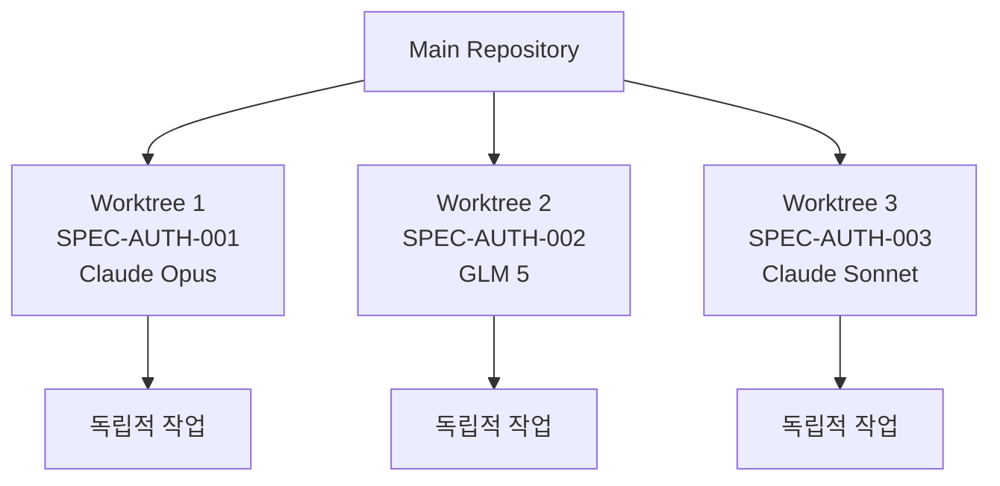
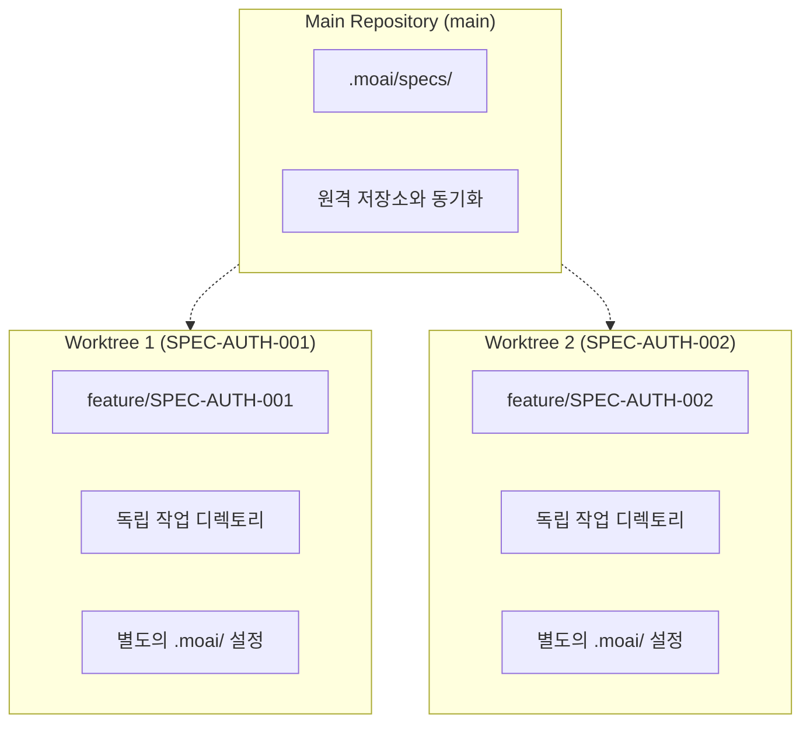
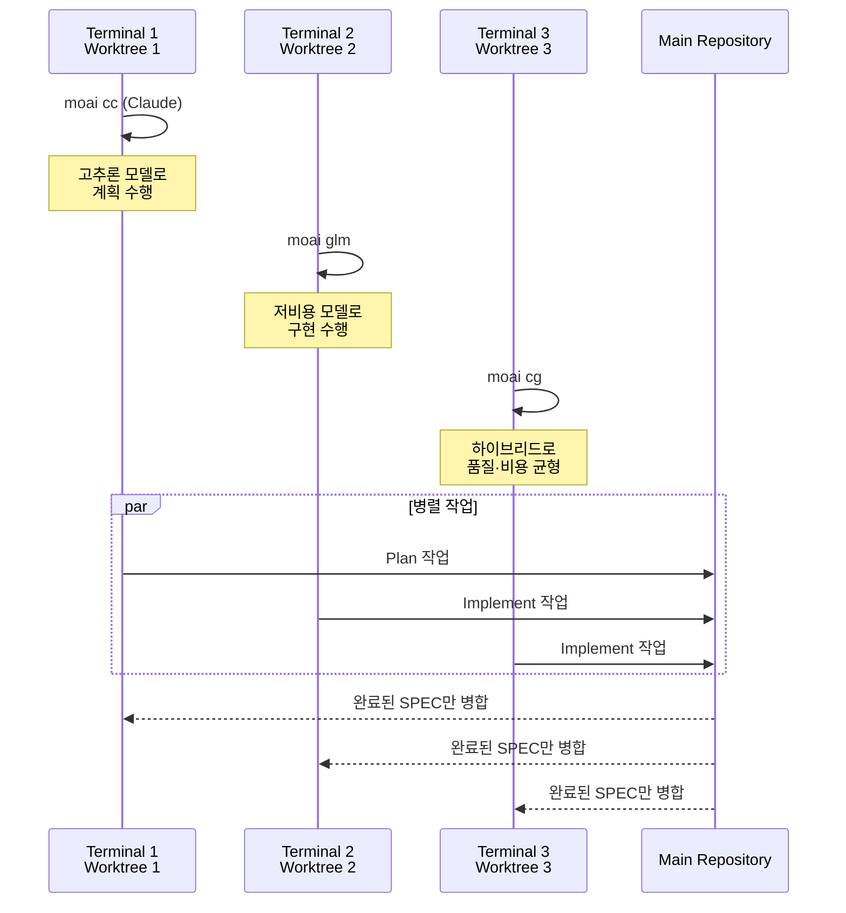
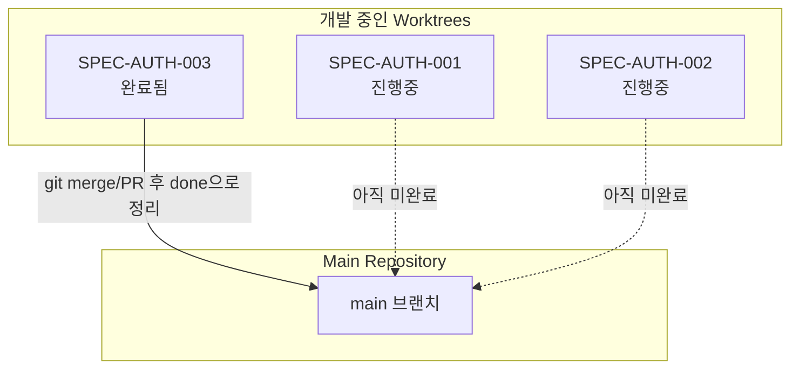

Git Worktree는 MoAI-ADK 병렬 개발의 기반입니다. SPEC마다 완전히 독립된 작업
공간을 만들어, 서로 다른 Git 상태와 서로 다른 LLM 설정을 동시에 굴릴 수 있게
합니다.



MoAI-ADK v3.0의 핵심 가치인 **토크노믹스** (Token Economics) 관점에서 보면,
Worktree는 "계획은 깊게, 구현은 싸게"를 실제로 실행하는 장치입니다. 계획
터미널에서는 고추론 Claude 모델을 쓰고, 구현 터미널에서는 저비용 GLM을 쓰는
식으로 — 작업 단계마다 알맞은 모델을 배정하는 일이 Worktree 격리 없이는
불가능하기 때문입니다.

## 왜 Worktree가 필요한가요?

### 문제: LLM 설정이 세션 간에 공유된다

Worktree 없이 `moai glm`이나 `moai cc`로 LLM 백엔드를 바꾸면, 같은 프로젝트의
**모든 열린 세션에 동일한 설정이 적용**됩니다. 그 결과:

- **SPEC 간 간섭** — 한 SPEC에서 바꾼 LLM 설정이 다른 SPEC 작업에 영향을 줍니다
- **병렬 개발 불가** — 여러 SPEC을 동시에 서로 다른 조건으로 진행할 수 없습니다
- **토큰 낭비** — 단순 구현 작업까지 전부 고비용 모델로 돌아갑니다

### 해결: 완전한 격리

Git Worktree를 쓰면 각 SPEC이 **독립적인 Git 상태와 LLM 설정**을 갖습니다:


```mermaid
graph TB
    A[Main Repository] --> B[Worktree 1<br/>SPEC-AUTH-001<br/>Claude Opus]
    A --> C[Worktree 2<br/>SPEC-AUTH-002<br/>GLM 5]
    A --> D[Worktree 3<br/>SPEC-AUTH-003<br/>Claude Sonnet]

    B --> E[독립적 작업]
    C --> F[독립적 작업]
    D --> G[독립적 작업]
```

## 핵심 워크플로우

### 3단계 개발 프로세스

Worktree를 활용한 MoAI-ADK 개발은 세 단계로 흘러갑니다:

```mermaid
flowchart TD
    subgraph Phase1["Phase 1: Plan (Terminal 1)"]
        A1[/moai plan<br/>feature description<br/>--worktree/] --> A2[SPEC 문서 생성]
        A2 --> A3[Worktree 자동 생성]
        A3 --> A4[Feature 브랜치 생성]
    end

    subgraph Phase2["Phase 2: Implement (Terminals 2, 3, 4...)"]
        B1[moai worktree go SPEC-ID] --> B2[Worktree 진입]
        B2 --> B3[moai glm<br/>LLM 변경]
        B3 --> B4[/moai run SPEC-ID]
        B4 --> B5[/moai sync SPEC-ID]
    end

    subgraph Phase3["Phase 3: Merge & Cleanup"]
        C1[git merge 또는 PR로<br/>base 병합] --> C2[moai worktree done SPEC-ID]
        C2 --> C3[Worktree 제거]
        C3 --> C4[선택: 브랜치 삭제]
    end

    Phase1 --> Phase2
    Phase2 --> Phase3
```

### 단계별 상세 설명

#### 1단계: Plan (Terminal 1)

계획 단계는 추론 품질이 결과를 좌우하므로 Claude(Opus급) 모델로 SPEC 문서를
작성합니다:

```bash
> /moai plan "인증 시스템 추가" --worktree
```

**작업 내용**:

- EARS 형식의 SPEC 문서 자동 생성
- 해당 SPEC 전용 Worktree 자동 생성
- Feature 브랜치 자동 생성 및 전환

**결과물**:

- `.moai/specs/SPEC-AUTH-001/spec.md`
- 새로운 Worktree 디렉토리
- `feature/SPEC-AUTH-001` 브랜치

#### 2단계: Implement (Terminals 2, 3, 4...)

구현 단계는 물량이 많은 대신 SPEC이 이미 방향을 잡아둔 상태라, GLM 같은 비용
효율적인 모델이 제 몫을 합니다:

```bash
# Worktree 진입 (새 터미널)
$ moai worktree go SPEC-AUTH-001

# LLM 변경
$ moai glm

# 개발 시작
$ claude
> /moai run SPEC-AUTH-001
> /moai sync SPEC-AUTH-001
```

**장점**:

- 완전히 격리된 작업 환경
- GLM 비용 효율 (Opus 대비 약 70% 절감)
- 충돌 없는 무제한 병렬 개발

#### 3단계: Cleanup

```bash
moai worktree done SPEC-AUTH-001                    # worktree 정리 (병합/푸시는 git으로 별도 수행)
moai worktree done SPEC-AUTH-001 --delete-branch    # 정리 + 로컬 브랜치 삭제
```

## Worktree 명령어 참조

| 명령어                   | 설명                       | 사용 예시                      |
| ------------------------ | -------------------------- | ------------------------------ |
| `moai worktree new SPEC-ID`    | 새 Worktree 생성           | `moai worktree new SPEC-AUTH-001`    |
| `moai worktree go SPEC-ID`     | Worktree 경로 출력 (`cd`용) | `cd "$(moai worktree go SPEC-AUTH-001)"` |
| `moai worktree list`           | Worktree 목록 표시         | `moai worktree list`                 |
| `moai worktree done SPEC-ID`   | Worktree 정리 (병합은 별도) | `moai worktree done SPEC-AUTH-001`   |
| `moai worktree remove [path]`  | Worktree 제거 (경로 지정)  | `moai worktree remove ~/.moai/worktrees/your-project/SPEC-AUTH-001` |
| `moai worktree status`         | Worktree 상태 확인         | `moai worktree status`               |
| `moai worktree clean`          | 병합된 Worktree 정리       | `moai worktree clean --merged-only`  |
| `moai worktree config`         | Worktree 설정 확인         | `moai worktree config root`          |

## Worktree의 핵심 장점

### 1. 완전한 격리 (Complete Isolation)

각 SPEC은 독립적인 Git 상태를 유지합니다:


```mermaid
graph TB
    subgraph Main["Main Repository (main)"]
        M1[.moai/specs/]
        M2[원격 저장소와 동기화]
    end

    subgraph WT1["Worktree 1 (SPEC-AUTH-001)"]
        W1A[feature/SPEC-AUTH-001]
        W1B[독립 작업 디렉토리]
        W1C[별도의 .moai/ 설정]
    end

    subgraph WT2["Worktree 2 (SPEC-AUTH-002)"]
        W2A[feature/SPEC-AUTH-002]
        W2B[독립 작업 디렉토리]
        W2C[별도의 .moai/ 설정]
    end

    Main -.-> WT1
    Main -.-> WT2
```

**장점**:

- 각 Worktree에서 독립적으로 커밋 가능
- 브랜치 간 충돌 없이 작업
- 완료된 SPEC만 main에 병합

### 2. LLM 독립성 (LLM Independence)

각 Worktree는 별도의 LLM 실행 모드를 유지합니다. 아래처럼 세 터미널이 각각
`moai cc`(Claude 전용), `moai glm`(GLM 전용), `moai cg`(Claude 리더 + GLM 워커
하이브리드)로 다르게 돌아가도 서로 간섭하지 않습니다:


```mermaid
sequenceDiagram
    participant T1 as Terminal 1<br/>Worktree 1
    participant T2 as Terminal 2<br/>Worktree 2
    participant T3 as Terminal 3<br/>Worktree 3
    participant Main as Main Repository

    T1->>T1: moai cc (Claude)
    Note over T1: 고추론 모델로<br/>계획 수행

    T2->>T2: moai glm
    Note over T2: 저비용 모델로<br/>구현 수행

    T3->>T3: moai cg
    Note over T3: 하이브리드로<br/>품질·비용 균형

    par 병렬 작업
        T1->>Main: Plan 작업
        T2->>Main: Implement 작업
        T3->>Main: Implement 작업
    end

    Main-->>T1: 완료된 SPEC만 병합
    Main-->>T2: 완료된 SPEC만 병합
    Main-->>T3: 완료된 SPEC만 병합
```

### 3. 무제한 병렬 개발 (Unlimited Parallel)

동시에 여러 SPEC을 진행할 수 있습니다:

```bash
# Terminal 1: SPEC-AUTH-001 계획
> /moai plan "인증 시스템" --worktree

# Terminal 2: SPEC-AUTH-002 구현 (GLM)
$ moai worktree go SPEC-AUTH-002
$ moai glm
> /moai run SPEC-AUTH-002

# Terminal 3: SPEC-AUTH-003 구현 (GLM)
$ moai worktree go SPEC-AUTH-003
$ moai glm
> /moai run SPEC-AUTH-003

# Terminal 4: SPEC-AUTH-004 문서화
$ moai worktree go SPEC-AUTH-004
> /moai sync SPEC-AUTH-004
```

### 4. 안전한 병합 (Safe Merge)

완료된 SPEC만 main 브랜치에 병합됩니다:


```mermaid
flowchart TB
    subgraph Development["개발 중인 Worktrees"]
        D1[SPEC-AUTH-001<br/>진행중]
        D2[SPEC-AUTH-002<br/>진행중]
        D3[SPEC-AUTH-003<br/>완료됨]
    end

    subgraph Main["Main Repository"]
        M[main 브랜치]
    end

    D3 -->|git merge/PR 후 done으로 정리| M
    D1 -.->|아직 미완료| M
    D2 -.->|아직 미완료| M
```

## 병렬 개발 시각화

여러 터미널에서 동시에 작업하는 모습입니다. 단계별로 모델이 다르게 배정되는
것이 토크노믹스의 핵심입니다:

```mermaid
graph TB
    subgraph Terminal1["Terminal 1: Planning"]
        T1A[/moai plan<br/>--worktree/]
        T1B[Claude Opus<br/>고비용/고품질]
        T1C[SPEC 문서 생성]
    end

    subgraph Terminal2["Terminal 2: Implementing"]
        T2A[moai worktree go<br/>SPEC-AUTH-001]
        T2B[moai glm<br/>저비용]
        T2C[/moai run<br/>DDD 구현]
    end

    subgraph Terminal3["Terminal 3: Implementing"]
        T3A[moai worktree go<br/>SPEC-AUTH-002]
        T3B[moai glm<br/>저비용]
        T3C[/moai run<br/>DDD 구현]
    end

    subgraph Terminal4["Terminal 4: Documenting"]
        T4A[moai worktree go<br/>SPEC-AUTH-003]
        T4B[moai cc<br/>Claude]
        T4C[/moai sync<br/>문서화]
    end

    T1C --> T2A
    T1C --> T3A
    T1C --> T4A
```

## 다음 단계

- **[완벽 가이드](/ko/worktree/guide)** — 모든 Worktree 명령어와 상세 사용법
- **[실제 사용 예시](/ko/worktree/examples)** — 실제 프로젝트에서의 사용 사례
- **[자주 묻는 질문](/ko/worktree/faq)** — FAQ 및 문제 해결

## 관련 문서

- [MoAI-ADK 문서](https://adk.mo.ai.kr)
- [SPEC 시스템](/ko/core-concepts/spec-based-dev/)
- [DDD 워크플로우](/ko/core-concepts/ddd/)
