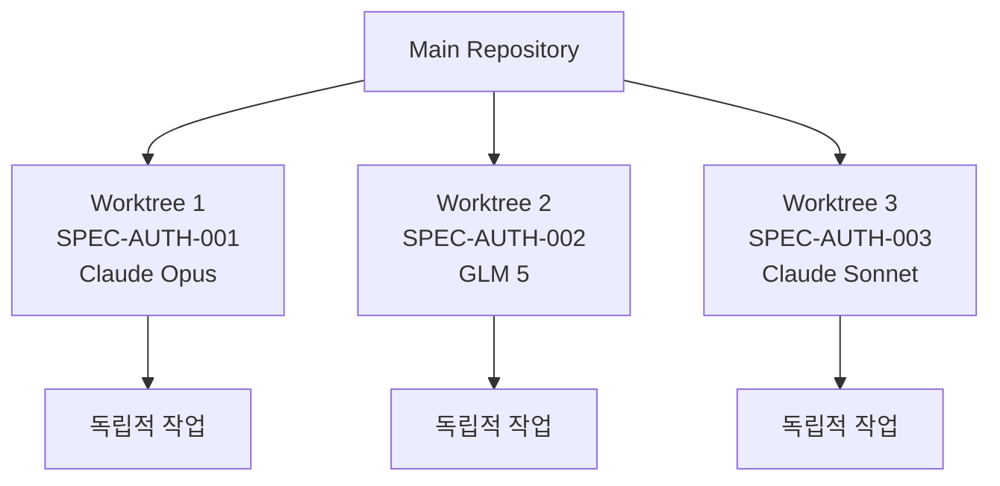
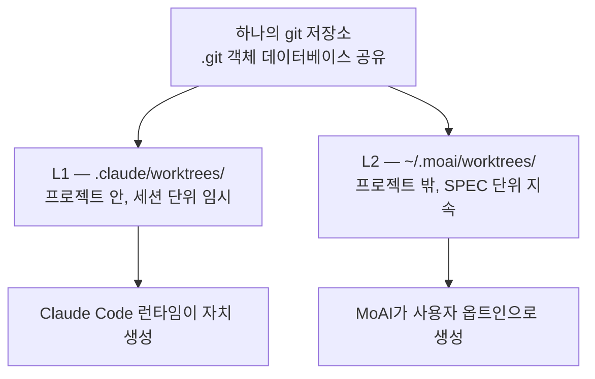
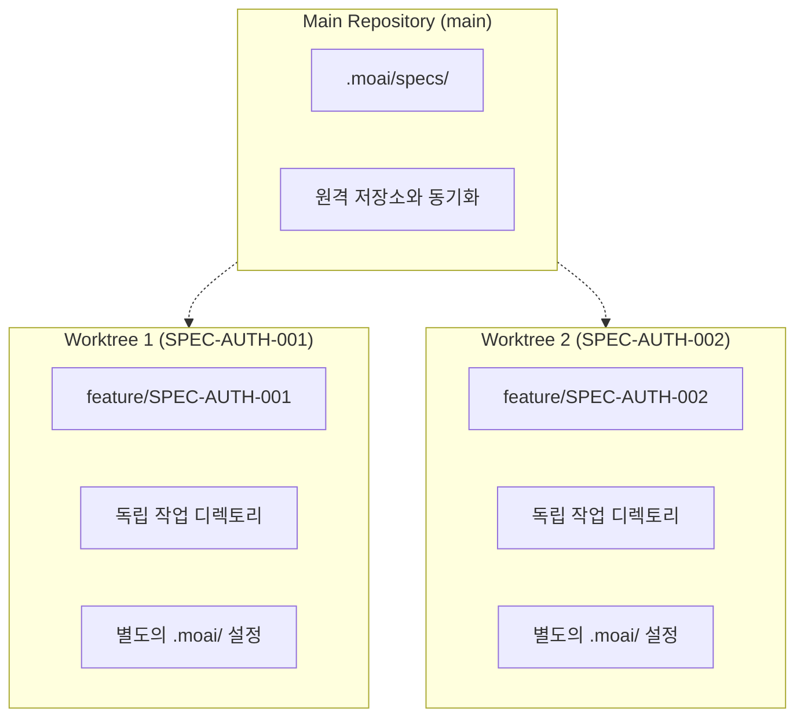
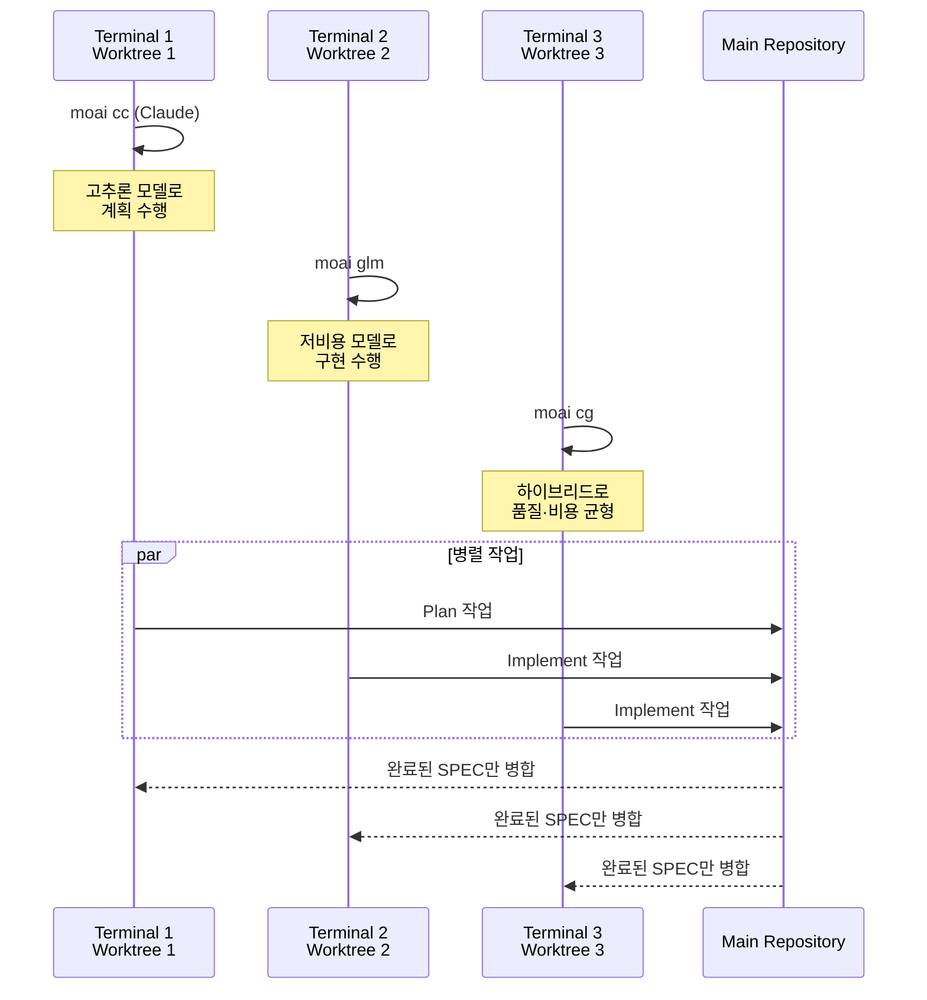
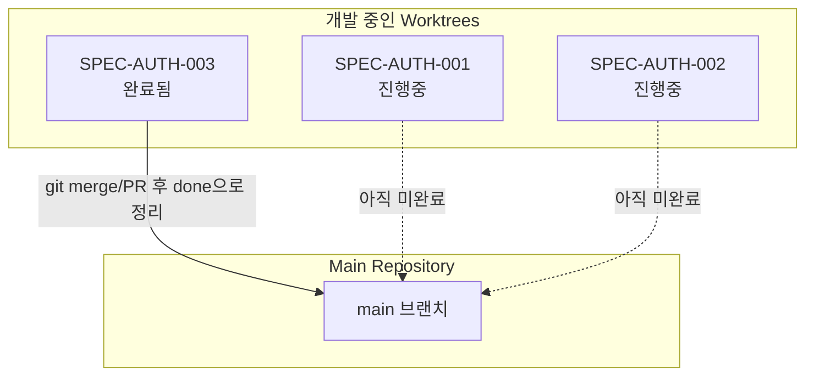

 <strong>소속 가치</strong>:  에이전틱 하네스

<!-- @value: agentic-harness -->

Git Worktree는 MoAI-ADK 병렬 개발의 바탕입니다. 하나의 저장소에서 여러
갈래의 작업을 서로 겹치지 않게 나란히 진행할 수 있게 해 주기 때문에,
에이전트가 동시에 움직여도 한쪽 결과가 다른 쪽을 덮어쓰는 일이 생기지
않습니다. SPEC(고유 ID를 가진 단일 작업 단위) 하나당 독립된 작업 공간이
하나씩 생긴다고 생각하면, 왜 이것이 "통제 장치"인지가 한눈에 잡힙니다.

비유하자면, 하나의 공유 창고를 여러 대의 작업대로 나누는 것과 같습니다.
창고 자체, 곧 저장소는 하나지만, 각 작업대에서는 서로 다른 부품을 조립하고
서로 다른 도구를 꺼내 쓸 수 있습니다. 누군가 인증 기능을 붙이는 동안 다른
누군가는 결제 로직을 손봐도 두 사람의 부품이 섞이지 않습니다. 작업대에서
완성된 결과물만 창고의 메인 진열대, 곧 main 브랜치로 옮겨 놓습니다. 그래서
"아직 덜 끝난 작업이 main을 흔드는" 사고가 원천적으로 막힙니다.


플랫폼 계층의 배경 설명은 [워크트리](/ko/claude-code/agentic/worktrees)에 있습니다. MoAI-ADK 기준 설명은 이 문서입니다.


세 가지 핵심 가치 가운데 **에이전틱 하네스**(품질 통제) 관점에서 보면,
Worktree는 SPEC마다 작업 공간을 완전히 갈라 놓는 통제 장치입니다. 에이전트가
병렬로 움직여도 서로의 작업을 덮어쓰지 않고, 완료된 SPEC만 main에 병합되도록
보장합니다. 토크노믹스(비용 효율) 쪽 이득도 따라옵니다. worktree마다
LLM(대형 언어 모델) 실행 모드를 따로 지정할 수 있으니, 계획 터미널에서는
추론이 강한 Claude 모델을, 구현 터미널에서는 저비용 GLM(z.ai의 다국어 언어
모델)을 쓰는 식으로 단계마다 모델을 나눠 배정할 수 있습니다. 비용이 비싼
자리와 단순한 자리를 구분해 사람이하듯 모델을 배치하는 셈입니다.

## 왜 Worktree가 필요한가요?

### 문제: LLM 설정이 세션 간에 공유된다

Worktree 없이 `moai glm`이나 `moai cc`로 LLM 백엔드를 바꾸면, 같은 프로젝트에서
**열려 있는 모든 세션에 같은 설정이 걸립니다**. 이유는 단순합니다. 설정이
프로젝트 단위로 하나만 있기 때문입니다. 그 결과 세 가지 골치 아픈 일이 겹쳐서
나타납니다.

- **SPEC 간 간섭** — 한 SPEC에서 바꾼 LLM 설정이 다른 SPEC 작업까지 흔듭니다
- **병렬 개발 불가** — 여러 SPEC을 서로 다른 조건으로 동시에 진행할 수 없습니다
- **토큰 낭비** — 단순 구현 작업까지 전부 비싼 모델로 돌아갑니다

### 해결: 완전한 격리

Git Worktree를 쓰면 SPEC마다 **Git 상태와 LLM 설정이 서로 독립적으로 움직입니다**.
격리가 핵심입니다. 한 터미널에서는 인증 작업을 Claude로 돌리고, 다른 터미널에서는
결제 작업을 GLM으로 돌려도 두 설정이 서로에게 닿지 않습니다.


```mermaid
graph TB
    A[Main Repository] --> B[Worktree 1<br/>SPEC-AUTH-001<br/>Claude Opus]
    A --> C[Worktree 2<br/>SPEC-AUTH-002<br/>GLM 5]
    A --> D[Worktree 3<br/>SPEC-AUTH-003<br/>Claude Sonnet]

    B --> E[독립적 작업]
    C --> F[독립적 작업]
    D --> G[독립적 작업]
```

## 작업 공간의 두 겹: L1과 L2

MoAI-ADK가 다루는 워크트리는 크게 두 겹입니다. 둘 다 결국 git worktree(하나의
git 저장소가 여러 작업 디렉토리를 거느리는 근본 메커니즘) 위에 올라타 있지만,
**누가 만들고 어디에 사는지, 얼마나 오래 사는지**가 다릅니다. 이 차이를 알아야
"내가 지금 어느 worktree에서 일하고 있나?"를 헷갈리지 않습니다.

1. **L1 — `.claude/worktrees/`**: 프로젝트 디렉토리 안쪽에 생깁니다. Claude Code
   런타임이 스스로 만들고, 세션이 끝나면 깨끗한 상태의 트리는 자동으로
   정리됩니다. 세션 단위의 임시 공간이라고 생각하면 됩니다.
2. **L2 — `~/.moai/worktrees/`**: 프로젝트 바깥, 사용자 홈 디렉터리 아래에
   생깁니다. MoAI가 SPEC 단위 병렬 개발을 위해 사용자가 옵트인해 만들고, run과
   sync 단계를 거치는 동안 같은 트리를 재사용합니다. 폐기는 사용자가
   `moai worktree done`으로 명시적으로 해야 합니다.

아래에 짧은 그림으로 두 겹의 위치와 주체를 한눈에 잡아 봅니다. 더 깊은 생성·폐기
생명주기와 `isolation: worktree` 동작은 [플랫폼 기초 워크트리 문서](/ko/claude-code/agentic/worktrees)가
다룹니다.


```mermaid
flowchart TD
    Repo[하나의 git 저장소<br/>.git 객체 데이터베이스 공유]
    Repo --> L1[L1 — .claude/worktrees/<br/>프로젝트 안, 세션 단위 임시]
    Repo --> L2[L2 — ~/.moai/worktrees/<br/>프로젝트 밖, SPEC 단위 지속]
    L1 --> Who1[Claude Code 런타임이 자치 생성]
    L2 --> Who2[MoAI가 사용자 옵트인으로 생성]
```

핵심은 **공유와 격리의 분리**입니다. 저장소의 히스토리와 원격(remote)은 한 곳에서
함께 관리하면서, 작업 디렉토리와 거기에 묶인 LLM 설정만 트리별로 완전히 갈라
놓습니다. 그래서 어느 worktree에서 커밋하더라도 다른 worktree가 곧바로 그
커밋을 인식하고, 브랜치가 꼬이지 않습니다. MoAI-ADK는 그 위에 "어떤 worktree에
들어갈지"와 "어떤 LLM 모드로 돌릴지"를 한 번에 묶어 주는 진입자(`moai cc` ·
`moai glm` · `moai cg`)를 얹은 것입니다.

## 핵심 워크플로우

### 3단계 개발 프로세스

Worktree를 쓰는 MoAI-ADK 개발은 세 단계로 흘러갑니다. 계획을 세우고, worktree에
들어가 구현하고, 다시 빠져나와 정리합니다. 한눈에 흐름을 그리면 아래와 같습니다.

```mermaid
flowchart TD
    subgraph Phase1["Phase 1: Plan (Terminal 1, 메인 체크아웃)"]
        A1[/moai plan<br/>기능 설명/] --> A2[SPEC 문서 생성]
        A2 --> A3[구현 범위 확정]
    end

    subgraph Phase2["Phase 2: Implement (Terminals 2, 3, 4...)"]
        B1["moai glm -w SPEC-AUTH-001"] --> B2[Worktree 생성 및 진입]
        B2 --> B3[/moai run SPEC-ID]
        B3 --> B4[/moai sync SPEC-ID]
    end

    subgraph Phase3["Phase 3: Merge & Cleanup"]
        C1[git merge 또는 PR로<br/>base 병합] --> C2[moai worktree done 브랜치]
        C2 --> C3[Worktree 제거]
        C3 --> C4[선택: 브랜치 삭제]
    end

    Phase1 --> Phase2
    Phase2 --> Phase3
```

### 단계별 상세 설명

#### 1단계: Plan (Terminal 1)

계획 단계는 추론 품질이 결과를 가르므로 Claude(Opus급) 모델로 SPEC 문서를
씁니다. 이 단계는 메인 체크아웃에서 그대로 진행합니다. worktree를 아직 만들지
않는 이유는, 계획 산출물은 마크다운 문서뿐이라 다른 작업과 충돌할 일이 없고,
모든 worktree가 이 계획을 참고할 수 있어야 하기 때문입니다.

```bash
> /moai plan "인증 시스템 추가"
```

**결과물**:

- `.moai/specs/SPEC-AUTH-001/spec.md`
- 구현 단계에서 쓸 SPEC ID

#### 2단계: Implement (Terminals 2, 3, 4...)

구현 단계는 물량은 많지만 SPEC이 이미 방향을 잡아 둔 상태라, GLM처럼 값싼
모델로도 충분히 제 몫을 합니다. 워크트리 진입은 런처(`moai cc` · `moai glm` ·
`moai cg`)의 `-w` 플래그가 맡습니다. 지정한 이름의 워크트리가 없으면 그 자리에서
만들어 줍니다.

```bash
# 새 터미널: 워크트리를 만들면서 GLM 백엔드로 진입
$ moai glm -w SPEC-AUTH-001

# 진입한 세션에서 곧바로 개발 시작
> /moai run SPEC-AUTH-001
> /moai sync SPEC-AUTH-001
```

현재 세션을 유지한 채 워크트리를 하나 더 열고 싶다면 `--spawn` 을 붙입니다.
tmux 새 창에서 뜨고, 원래 창은 그대로 남습니다. 한 터미널을 끄지 않고도
새 SPEC 작업 공간을 추가로 띄울 수 있어 병렬 개발이 자연스럽습니다.

```bash
$ moai glm -w SPEC-AUTH-002 --spawn
```

**장점**:

- 완전히 격리된 작업 환경
- GLM 비용 효율 (절감 폭은 [CG 모드](/ko/multi-llm/cg-mode) 참고)
- 충돌 없는 무제한 병렬 개발

#### 3단계: Cleanup

```bash
moai worktree done feature/SPEC-AUTH-001                    # worktree 정리 (병합/푸시는 git으로 별도 수행)
moai worktree done feature/SPEC-AUTH-001 --delete-branch    # 정리 + 로컬 브랜치 삭제
```

## Worktree 명령어 참조

워크트리에 **들어가는** 일과 **목록을 보는** 일은 `moai worktree` 의 몫이 아닙니다.
진입은 런처가, 조회는 git 이 맡습니다. 역할을 셋으로 나눠 외우면 헷갈리지 않습니다.
들어갈 때는 런처(`moai cc`/`moai glm`/`moai cg`), 목록을 볼 때는 `git worktree list`,
만들어진 worktree를 관리할 때는 `moai worktree`입니다.

| 하려는 일               | 명령어                          | 사용 예시                              |
| ----------------------- | ------------------------------- | -------------------------------------- |
| Worktree 만들고 진입    | `moai cc -w <이름>`             | `moai glm -w SPEC-AUTH-001`            |
| 세션 유지한 채 새 창에서 열기 | `moai cc -w <이름> --spawn` | `moai cg -w SPEC-AUTH-002 --spawn`     |
| Worktree 목록 확인      | `git worktree list`             | `git worktree list`                    |

`moai worktree` 는 만들어진 워크트리를 관리합니다:

| 명령어                        | 설명                            | 사용 예시                              |
| ----------------------------- | ------------------------------- | -------------------------------------- |
| `moai worktree sync [브랜치]` | base 브랜치 변경을 반영          | `moai worktree sync --strategy rebase` |
| `moai worktree done <브랜치>` | Worktree 정리 (병합은 별도)      | `moai worktree done feature/SPEC-AUTH-001` |
| `moai worktree remove <경로>` | 경로를 지정해 Worktree 제거      | `moai worktree remove ~/.moai/worktrees/your-project/SPEC-AUTH-001` |
| `moai worktree clean`         | 병합된/방치된 Worktree 정리      | `moai worktree clean --merged-only`    |
| `moai worktree recover`       | Worktree 레지스트리 복구         | `moai worktree recover`                |
| `moai worktree snapshot`      | 작업 트리 상태 캡처              | `moai worktree snapshot`               |
| `moai worktree verify`        | 스냅샷과 현재 상태 대조          | `moai worktree verify --snapshot <경로>` |
| `moai worktree restore`       | 스냅샷 HEAD 상태로 되돌리기      | `moai worktree restore --snapshot <경로>` |

## Worktree의 핵심 장점

### 1. 완전한 격리 (Complete Isolation)

SPEC마다 Git 상태가 따로 관리됩니다. 곧 한 SPEC에서 커밋해도 다른 SPEC의
작업 디렉토리는 그대로입니다. 아래 그림처럼 main 저장소가 두 worktree를
거느리고, 각 worktree는 자기 브랜치와 자기 `.moai/` 설정을 따로 가집니다.


```mermaid
graph TB
    subgraph Main["Main Repository (main)"]
        M1[.moai/specs/]
        M2[원격 저장소와 동기화]
    end

    subgraph WT1["Worktree 1 (SPEC-AUTH-001)"]
        W1A[feature/SPEC-AUTH-001]
        W1B[독립 작업 디렉토리]
        W1C[별도의 .moai/ 설정]
    end

    subgraph WT2["Worktree 2 (SPEC-AUTH-002)"]
        W2A[feature/SPEC-AUTH-002]
        W2B[독립 작업 디렉토리]
        W2C[별도의 .moai/ 설정]
    end

    Main -.-> WT1
    Main -.-> WT2
```

**장점**:

- 각 Worktree에서 독립적으로 커밋 가능
- 브랜치 간 충돌 없이 작업
- 완료된 SPEC만 main에 병합

### 2. LLM 독립성 (LLM Independence)

Worktree마다 LLM 실행 모드를 따로 잡을 수 있습니다. 아래처럼 세 터미널이 각각
`moai cc`(Claude 전용), `moai glm`(GLM 전용), `moai cg`(Claude 리더 + GLM 워커
하이브리드)로 다르게 돌아가도 서로 간섭하지 않습니다. 이것이 단계마다 모델을
다르게 배정하는 토크노믹스의 실체입니다.


```mermaid
sequenceDiagram
    participant T1 as Terminal 1<br/>Worktree 1
    participant T2 as Terminal 2<br/>Worktree 2
    participant T3 as Terminal 3<br/>Worktree 3
    participant Main as Main Repository

    T1->>T1: moai cc (Claude)
    Note over T1: 고추론 모델로<br/>계획 수행

    T2->>T2: moai glm
    Note over T2: 저비용 모델로<br/>구현 수행

    T3->>T3: moai cg
    Note over T3: 하이브리드로<br/>품질·비용 균형

    par 병렬 작업
        T1->>Main: Plan 작업
        T2->>Main: Implement 작업
        T3->>Main: Implement 작업
    end

    Main-->>T1: 완료된 SPEC만 병합
    Main-->>T2: 완료된 SPEC만 병합
    Main-->>T3: 완료된 SPEC만 병합
```

### 3. 무제한 병렬 개발 (Unlimited Parallel)

동시에 여러 SPEC을 진행할 수 있습니다. 터미널을 하나 더 열고 `-w`로 새 worktree에
들어가면, 그 안에서는 완전히 별개의 작업이 돌아갑니다. 아래는 네 터미널이 네 SPEC을
동시에 다루는 모습입니다.

```bash
# Terminal 1: SPEC-AUTH-001 계획 (메인 체크아웃)
> /moai plan "인증 시스템"

# Terminal 2: SPEC-AUTH-002 구현 (GLM)
$ moai glm -w SPEC-AUTH-002
> /moai run SPEC-AUTH-002

# Terminal 3: SPEC-AUTH-003 구현 (GLM)
$ moai glm -w SPEC-AUTH-003
> /moai run SPEC-AUTH-003

# Terminal 4: SPEC-AUTH-004 문서화 (Claude)
$ moai cc -w SPEC-AUTH-004
> /moai sync SPEC-AUTH-004
```

### 4. 안전한 병합 (Safe Merge)

완료된 SPEC만 main 브랜치에 병합됩니다. 아직 진행 중인 worktree는 실선이
아닌 점선으로 표시됩니다. 곧 "준비되지 않은 작업은 main에 닿지 않는다"는
뜻이고, 이것이 에이전틱 하네스가 보장하는 안전망입니다.


```mermaid
flowchart TB
    subgraph Development["개발 중인 Worktrees"]
        D1[SPEC-AUTH-001<br/>진행중]
        D2[SPEC-AUTH-002<br/>진행중]
        D3[SPEC-AUTH-003<br/>완료됨]
    end

    subgraph Main["Main Repository"]
        M[main 브랜치]
    end

    D3 -->|git merge/PR 후 done으로 정리| M
    D1 -.->|아직 미완료| M
    D2 -.->|아직 미완료| M
```

## 병렬 개발 시각화

여러 터미널에서 동시에 작업하는 모습입니다. worktree가 완전히 격리된 덕분에
충돌 없이 병렬로 진행되는데, 이것이 에이전틱 하네스의 핵심입니다. 단계마다
알맞은 모델을 배정할 수 있는 것은 여기에 따라오는 토크노믹스 이득입니다.
아래 그림은 한 터미널이 계획을 만들면 그 결과가 세 개의 구현/문서 worktree로
흘러가는 모습을 보여 줍니다.

```mermaid
graph TB
    subgraph Terminal1["Terminal 1: Planning"]
        T1A[/moai plan/]
        T1B[Claude Opus<br/>고비용/고품질]
        T1C[SPEC 문서 생성]
    end

    subgraph Terminal2["Terminal 2: Implementing"]
        T2A["moai glm -w<br/>SPEC-AUTH-001"]
        T2B[저비용 백엔드]
        T2C[/moai run<br/>DDD 구현]
    end

    subgraph Terminal3["Terminal 3: Implementing"]
        T3A["moai glm -w<br/>SPEC-AUTH-002"]
        T3B[저비용 백엔드]
        T3C[/moai run<br/>DDD 구현]
    end

    subgraph Terminal4["Terminal 4: Documenting"]
        T4A["moai cc -w<br/>SPEC-AUTH-003"]
        T4B[Claude 백엔드]
        T4C[/moai sync<br/>문서화]
    end

    T1C --> T2A
    T1C --> T3A
    T1C --> T4A
```

## 다음 단계

- **[완벽 가이드](/ko/worktree/guide)** — 모든 Worktree 명령어와 상세 사용법
- **[실제 사용 예시](/ko/worktree/examples)** — 실제 프로젝트에 적용한 사례
- **[자주 묻는 질문](/ko/worktree/faq)** — FAQ 및 문제 해결

## 관련 문서

- [MoAI-ADK 문서](https://adk.mo.ai.kr)
- [SPEC 시스템](/ko/core-concepts/spec-based-dev/)
- [DDD 워크플로우](/ko/core-concepts/ddd/)
