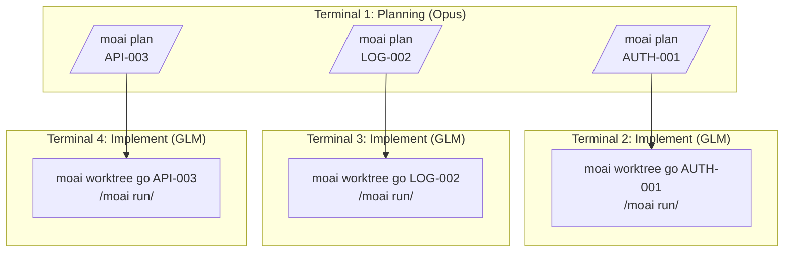
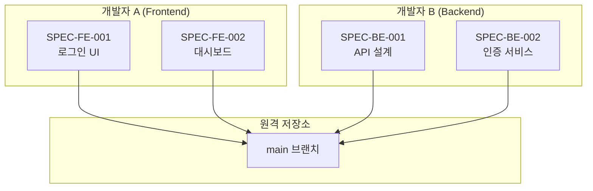
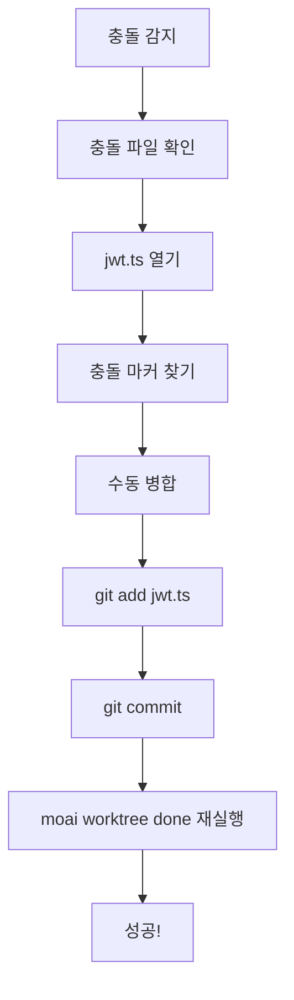
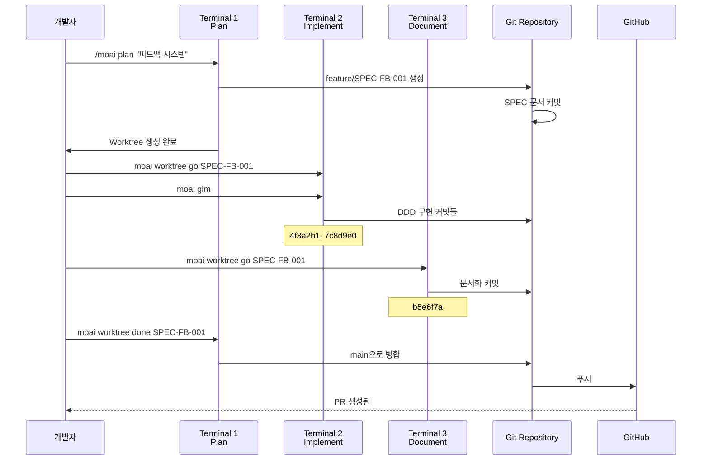

# Git Worktree 실제 사용 예시

실제 프로젝트에서 Git Worktree를 활용하는 구체적인 예시들을 통해 실무 적용
방법을 배워보세요.

## 목차

1. [단일 SPEC 개발](#단일-spec-개발)
2. [병렬 SPEC 개발](#병렬-spec-개발)
3. [팀 협업 시나리오](#팀-협업-시나리오)
4. [문제 해결 사례](#문제-해결-사례)

---

## 단일 SPEC 개발

### 시나리오: 사용자 인증 시스템 구현

#### 1단계: SPEC 계획 (Terminal 1)

```bash
# 프로젝트 루트에서
$ cd /Users/goos/MoAI/moai-project

# SPEC 계획 생성
> /moai plan "JWT 기반 사용자 인증 시스템 구현" --worktree

# 출력
✓ MoAI-ADK SPEC Manager v2.0
━━━━━━━━━━━━━━━━━━━━━━━━━━━━━━━━━━━━━━━━━━

SPEC 분석 중...
  - 기능 요구사항: 8개 발견
  - 기술 요구사항: 5개 발견
  - API 엔드포인트: 6개 식별

SPEC 문서 생성 중...
  ✓ .moai/specs/SPEC-AUTH-001/spec.md
  ✓ .moai/specs/SPEC-AUTH-001/requirements.md
  ✓ .moai/specs/SPEC-AUTH-001/api-design.md

Worktree 생성 중...
  ✓ 브랜치 생성: feature/SPEC-AUTH-001
  ✓ Worktree 생성: /Users/goos/MoAI/moai-project/.moai/worktrees/SPEC-AUTH-001
  ✓ 브랜치 전환 완료

━━━━━━━━━━━━━━━━━━━━━━━━━━━━━━━━━━━━━━━━━━
다음 단계:
  1. 새 터미널에서 실행: moai worktree go SPEC-AUTH-001
  2. LLM 변경: moai glm
  3. Claude 시작: claude
  4. 개발 시작: /moai run SPEC-AUTH-001

비용 절감 팁: 구현 단계에서는 'moai glm'로 70% 비용 절감!
━━━━━━━━━━━━━━━━━━━━━━━━━━━━━━━━━━━━━━━━━━
```

#### 2단계: Worktree 진입 및 구현 (Terminal 2)

```bash
# 새 터미널 열기
$ moai worktree go SPEC-AUTH-001

# 새 터미널이 열리고 Worktree로 이동
# 프롬프트가 변경됨
(SPEC-AUTH-001) ~/moai-project/.moai/worktrees/SPEC-AUTH-001

# LLM을 저비용 모델로 변경
(SPEC-AUTH-001) $ moai glm
✓ LLM 변경: GLM 5 (70% 비용 절감)

# Claude Code 시작
(SPEC-AUTH-001) $ claude
Claude Code v1.0.0
Type 'help' for available commands

# DDD 구현 시작
> /moai run SPEC-AUTH-001

# 출력
✓ MoAI-ADK DDD Executor v2.0
━━━━━━━━━━━━━━━━━━━━━━━━━━━━━━━━━━━━━━━━━━

Phase 1: ANALYZE
  ✓ 요구사항 분석 완료
  ✓ 기존 코드 분석 완료
  ✓ 테스트 커버리지: 85% 목표

Phase 2: PRESERVE
  ✓ 특성화 테스트 12개 생성
  ✓ 기존 동작 보존 확인

Phase 3: IMPROVE
  ✓ JWT 인증 미들웨어 구현
  ✓ 리프레시 토큰 로테이션 구현
  ✓ 로그아웃 토큰 무효화 구현

━━━━━━━━━━━━━━━━━━━━━━━━━━━━━━━━━━━━━━━━━━
구현 완료!
  - 커밋: 4f3a2b1 (feat: JWT authentication middleware)
  - 커밋: 7c8d9e0 (feat: refresh token rotation)
  - 커밋: 2a1b3c4 (feat: token invalidation on logout)

다음 단계:
  1. 테스트 실행: pytest tests/auth/
  2. 문서화: /moai sync SPEC-AUTH-001
  3. 완료: moai worktree done SPEC-AUTH-001
━━━━━━━━━━━━━━━━━━━━━━━━━━━━━━━━━━━━━━━━━━
```

#### 3단계: 문서화 (같은 Terminal 2)

```bash
# 문서화 실행
> /moai sync SPEC-AUTH-001

# 출력
✓ MoAI-ADK Documentation Generator v2.0
━━━━━━━━━━━━━━━━━━━━━━━━━━━━━━━━━━━━━━━━━━

문서 생성 중...
  ✓ API 문서: docs/api/auth.md
  ✓ 아키텍처 다이어그램: docs/diagrams/auth-flow.mmd
  ✓ 사용자 가이드: docs/guides/authentication.md

커밋 완료:
  ✓ b5e6f7a (docs: authentication documentation)

━━━━━━━━━━━━━━━━━━━━━━━━━━━━━━━━━━━━━━━━━━
문서화 완료!
다음 단계: moai worktree done SPEC-AUTH-001 --push
━━━━━━━━━━━━━━━━━━━━━━━━━━━━━━━━━━━━━━━━━━
```

#### 4단계: 완료 및 병합 (Terminal 1)

```bash
# 프로젝트 루트로 돌아와서
$ cd /Users/goos/MoAI/moai-project

# Worktree 완료
$ moai worktree done SPEC-AUTH-001 --push

# 출력
✓ MoAI-ADK Worktree Manager v2.0
━━━━━━━━━━━━━━━━━━━━━━━━━━━━━━━━━━━━━━━━━━

Worktree 완료 중: SPEC-AUTH-001

1. main 브랜치로 전환...
   ✓ Switched to branch 'main'

2. feature 브랜치 병합...
   ✓ Merge 'feature/SPEC-AUTH-001' into main

3. 원격 저장소에 푸시...
   ✓ github.com:username/repo.git
   ✓ Branch 'main' set up to track remote branch 'main'

4. Worktree 정리...
   ✓ Worktree 제거: .moai/worktrees/SPEC-AUTH-001
   ✓ 브랜치 제거: feature/SPEC-AUTH-001

━━━━━━━━━━━━━━━━━━━━━━━━━━━━━━━━━━━━━━━━━━
✓ SPEC-AUTH-001 완료!

총 커밋: 4개
  - 2e9b4c3 docs: authentication documentation
  - 7c8d9e0 feat: refresh token rotation
  - 4f3a2b1 feat: JWT authentication middleware
  - b5e6f7a feat: token invalidation on logout

━━━━━━━━━━━━━━━━━━━━━━━━━━━━━━━━━━━━━━━━━━
```

---

## 병렬 SPEC 개발

### 시나리오: 3개 SPEC 동시 개발



#### Terminal 1: 계획 (모든 SPEC)

```bash
# SPEC 1: 인증
> /moai plan "JWT 인증 시스템" --worktree
✓ SPEC-AUTH-001 생성 완료

# SPEC 2: 로깅
> /moai plan "구조화된 로깅 시스템" --worktree
✓ SPEC-LOG-002 생성 완료

# SPEC 3: API
> /moai plan "REST API v2" --worktree
✓ SPEC-API-003 생성 완료

# Worktree 확인
moai worktree list
SPEC-AUTH-001  feature/SPEC-AUTH-001  /path/to/SPEC-AUTH-001
SPEC-LOG-002   feature/SPEC-LOG-002   /path/to/SPEC-LOG-002
SPEC-API-003   feature/SPEC-API-003   /path/to/SPEC-API-003
```

#### Terminal 2: AUTH-001 구현

```bash
$ moai worktree go SPEC-AUTH-001
(SPEC-AUTH-001) $ moai glm
(SPEC-AUTH-001) $ claude
> /moai run SPEC-AUTH-001
# ... 구현 진행 중 ...
```

#### Terminal 3: LOG-002 구현

```bash
$ moai worktree go SPEC-LOG-002
(SPEC-LOG-002) $ moai glm
(SPEC-LOG-002) $ claude
> /moai run SPEC-LOG-002
# ... 구현 진행 중 ...
```

#### Terminal 4: API-003 구현

```bash
$ moai worktree go SPEC-API-003
(SPEC-API-003) $ moai glm
(SPEC-API-003) $ claude
> /moai run SPEC-API-003
# ... 구현 진행 중 ...
```

#### 병렬 진행 상황 모니터링

```bash
# Terminal 1에서 모든 Worktree 상태 확인
$ moai worktree status --verbose

Worktree: SPEC-AUTH-001
Branch: feature/SPEC-AUTH-001
Status: 3 commits ahead of main
LLM: GLM 5
Last activity: 5 minutes ago

Worktree: SPEC-LOG-002
Branch: feature/SPEC-LOG-002
Status: 2 commits ahead of main
LLM: GLM 5
Last activity: 3 minutes ago

Worktree: SPEC-API-003
Branch: feature/SPEC-API-003
Status: 4 commits ahead of main
LLM: GLM 5
Last activity: 7 minutes ago
```

---

## 팀 협업 시나리오

### 시나리오: 2명 개발자 협업



#### 개발자 A: Frontend 개발

```bash
# 개발자 A의 머신에서
git clone https://github.com/team/project.git
cd project

# Frontend SPEC 생성
> /moai plan "로그인 UI 컴포넌트" --worktree
✓ SPEC-FE-001 생성

# Worktree에서 개발
moai worktree go SPEC-FE-001
(SPEC-FE-001) $ moai glm
(SPEC-FE-001) $ claude
> /moai run SPEC-FE-001

# 구현 완료 후 원격에 푸시
(SPEC-FE-001) $ exit
moai worktree done SPEC-FE-001 --push
✓ 완료 및 PR 생성됨
```

#### 개발자 B: Backend 개발

```bash
# 개발자 B의 머신에서
git clone https://github.com/team/project.git
cd project

# Backend SPEC 생성
> /moai plan "인증 API 서비스" --worktree
✓ SPEC-BE-001 생성

# Worktree에서 개발
moai worktree go SPEC-BE-001
(SPEC-BE-001) $ moai glm
(SPEC-BE-001) $ claude
> /moai run SPEC-BE-001

# 구현 완료 후 원격에 푸시
(SPEC-BE-001) $ exit
moai worktree done SPEC-BE-001 --push
✓ 완료 및 PR 생성됨
```

#### PR 병합 및 통합

```bash
# 팀 리드 또는 CI 시스템에서
gh pr list
# FE-001  Login UI Component          Ready
# BE-001  Authentication API Service  Ready

# PR 병합
gh pr merge FE-001 --merge
gh pr merge BE-001 --merge

# 모든 개발자가 최신 상태 유지
git pull origin main
```

---

## 문제 해결 사례

### 사례 1: 병합 충돌 해결

```bash
$ moai worktree done SPEC-AUTH-001 --push

# 출력
✗ 병합 충돌 발생!
충돌 파일:
  - src/auth/jwt.ts
  - tests/auth.test.ts

해결 단계:
1. 충돌 파일을 편집하여 해결
2. git add <파일>
3. git commit
4. moai worktree done SPEC-AUTH-001 --push 다시 실행
```

**해결 과정**:



```bash
# 충돌 해결
cd .moai/worktrees/SPEC-AUTH-001
code src/auth/jwt.ts

# 충돌 마커 확인
<<<<<<< HEAD
const secret = process.env.JWT_SECRET;
=======
const secret = config.jwt.secret;
>>>>>>> feature/SPEC-AUTH-001

# 수동으로 병합
const secret = process.env.JWT_SECRET || config.jwt.secret;

# staging 후 커밋
git add src/auth/jwt.ts
git commit -m "fix: resolve merge conflict in JWT config"

# 완료 재시도
cd /Users/goos/MoAI/moai-project
moai worktree done SPEC-AUTH-001 --push
✓ 완료!
```

### 사례 2: Worktree 손상 복구

```bash
$ moai worktree go SPEC-AUTH-001
✗ Worktree가 손상되었습니다.

# 진단
$ moai worktree status SPEC-AUTH-001
✗ Worktree 디렉토리가 존재하지 않습니다

# 복구
$ moai worktree remove SPEC-AUTH-001 --force
✓ 기존 Worktree 제거

$ moai worktree new SPEC-AUTH-001
✓ Worktree 재생성 완료
```

### 사례 3: 디스크 공간 부족

```bash
$ df -h
Filesystem      Size  Used Avail Use%
/dev/disk1     500G  480G   20G  96%

# 오래된 Worktree 정리
$ moai worktree clean --older-than 14

# 정리될 Worktree:
  - SPEC-OLD-001 (30일 전)
  - SPEC-OLD-002 (45일 전)
  - SPEC-OLD-003 (60일 전)

계속 진행하시겠습니까? [y/N] y

✓ 3개 Worktree 정리 완료
✓ 12GB 디스크 공간 확보
```

---

## 실제 프로젝트 워크플로우

### 완전한 개발 사이클 예시



---

## 성공 사례

### 사례: 스타트업에서의 적용

```bash
# 상황: 3개의 기능을 동시에 개발해야 함
# 시간: 1주일
# 개발자: 2명

# 1일차: 모든 SPEC 계획
> /moai plan "사용자 관리" --worktree
> /moai plan "결제 시스템" --worktree
> /moai plan "알림 시스템" --worktree

# 2-4일차: 병렬 구현
# Terminal 1: 사용자 관리
$ moai worktree go SPEC-USER-001 && moai glm
# Terminal 2: 결제 시스템
$ moai worktree go SPEC-PAY-001 && moai glm
# Terminal 3: 알림 시스템
$ moai worktree go SPEC-NOTIF-001 && moai glm

# 5-6일차: 문서화 및 테스트
# 각 Worktree에서 /moai sync 실행

# 7일차: 병합
$ moai worktree done SPEC-USER-001 --push
$ moai worktree done SPEC-PAY-001 --push
$ moai worktree done SPEC-NOTIF-001 --push

# 결과
# - 3개의 기능 모두 완료
# - 병렬 개발으로 시간 단축 66%
# - GLM 사용으로 비용 절감 70%
```

---

## 팁과 요령

### 팁 1: 터미널 관리

```bash
# tmux 사용하여 세션 관리
tmux new-session -d -s spec-user 'moai worktree go SPEC-USER-001'
tmux new-session -d -s spec-pay 'moai worktree go SPEC-PAY-001'

# 세션 목록
tmux ls
spec-user: 1 windows
spec-pay: 1 windows

# 세션 전환
tmux attach-session -t spec-user
```

### 팁 2: 진행 상황 추적

```bash
# 모든 Worktree 진행 상황
for spec in $(moai worktree list --porcelain | awk '{print $1}'); do
    echo "=== $spec ==="
    cd ~/.moai/worktrees/$spec
    git log --oneline -5
    echo ""
done
```

### 팁 3: 자동화 스크립트

```bash
#!/bin/bash
# auto-workflow.sh

SPEC_ID=$1

echo "1. SPEC 계획 생성..."
> /moai plan "$2" --worktree

echo "2. Worktree 진입..."
moai worktree go $SPEC_ID

echo "3. LLM 변경..."
moai glm

echo "4. Claude 시작..."
claude

# 사용법
# ./auto-workflow.sh SPEC-AUTH-001 "인증 시스템"
```

## 관련 문서

- [Git Worktree 개요](./index)
- [완벽 가이드](./guide)
- [자주 묻는 질문](./faq)
