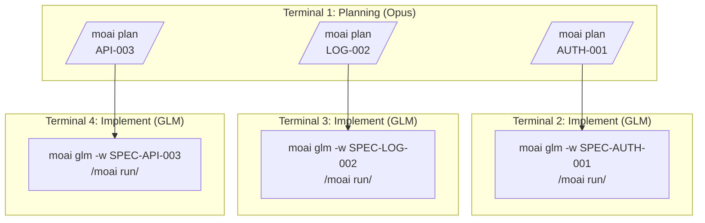
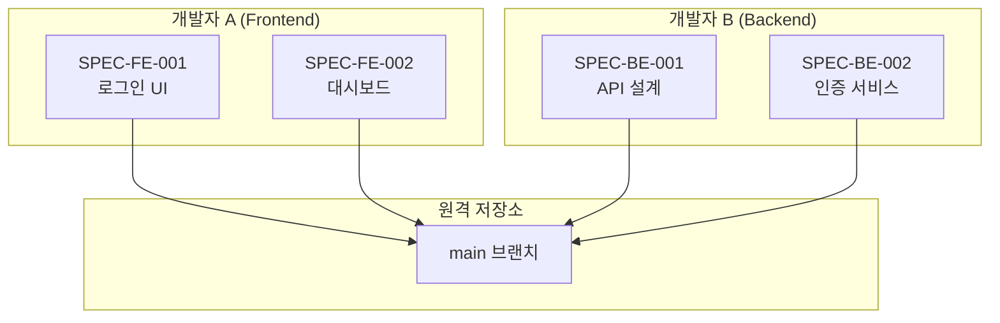
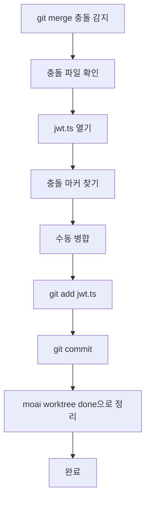
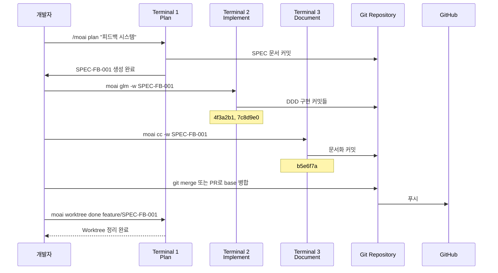

실제 프로젝트에서 Git Worktree를 어떻게 쓰는지, 단일 SPEC 개발부터 병렬
개발·팀 협업·문제 해결까지 구체적인 시나리오로 살펴봅니다. 시나리오마다 어느
단계에 어떤 모델을 쓸지에 대한 비용 판단도 함께 담았습니다.

## 목차

1. [단일 SPEC 개발](#단일-spec-개발)
2. [병렬 SPEC 개발](#병렬-spec-개발)
3. [팀 협업 시나리오](#팀-협업-시나리오)
4. [문제 해결 사례](#문제-해결-사례)

---

## 단일 SPEC 개발

### 시나리오: 사용자 인증 시스템 구현

#### 1단계: SPEC 계획 (Terminal 1)

계획은 메인 체크아웃에서 그대로 진행합니다.

```bash
# 프로젝트 루트에서
$ cd /path/to/your-project

# SPEC 계획 생성
> /moai plan "JWT 기반 사용자 인증 시스템 구현"

# 진행 요약 (예시)
SPEC 분석 중...
  - 요구사항을 EARS 형식으로 정리

SPEC 문서 생성:
  ✓ .moai/specs/SPEC-AUTH-001/spec.md
  ✓ .moai/specs/SPEC-AUTH-001/plan.md
  ✓ .moai/specs/SPEC-AUTH-001/acceptance.md

다음 단계:
  1. 새 터미널에서 실행: moai glm -w SPEC-AUTH-001
  2. 개발 시작: /moai run SPEC-AUTH-001
```

#### 2단계: Worktree 진입 및 구현 (Terminal 2)

계획이 끝났으니 구현 단계에서는 값싼 모델로 갈아탑니다. 워크트리 생성과 진입,
백엔드 전환이 런처 한 줄에서 함께 끝납니다:

```bash
# 새 터미널: 워크트리가 없으면 만들고, GLM 백엔드로 그 안에서 세션 시작
$ moai glm -w SPEC-AUTH-001

# 진입한 세션에서 DDD 구현 시작
> /moai run SPEC-AUTH-001

# 진행 요약 (예시)
Phase 1: ANALYZE
  ✓ 요구사항·기존 코드 분석

Phase 2: PRESERVE
  ✓ 특성화 테스트 생성, 기존 동작 보존 확인

Phase 3: IMPROVE
  ✓ JWT 인증 미들웨어 구현
  ✓ 리프레시 토큰 로테이션 구현
  ✓ 로그아웃 토큰 무효화 구현

구현 완료 — feature/SPEC-AUTH-001에 커밋됨

다음 단계:
  1. 테스트 실행: 프로젝트 언어의 테스트 명령 (예: go test ./... / npm test / pytest)
  2. 문서화: /moai sync SPEC-AUTH-001
  3. base 병합(git merge/PR) 후 정리: moai worktree done feature/SPEC-AUTH-001
```

#### 3단계: 문서화 (같은 Terminal 2)

```bash
# 문서화 실행
> /moai sync SPEC-AUTH-001

# 진행 요약 (예시)
문서 동기화 중...
  ✓ 코드맵·문서 갱신
  ✓ SPEC 상태 전이 및 커밋

문서화 완료 — feature/SPEC-AUTH-001에 커밋됨
다음 단계: base 병합(git merge/PR) 후 moai worktree done feature/SPEC-AUTH-001
```

#### 4단계: base 병합과 정리 (Terminal 1)

`moai worktree done`은 병합도 푸시도 하지 않습니다. base 브랜치에 병합하는 일은
`git merge`나 PR로 먼저 끝낸 뒤, Worktree만 정리하면 됩니다.

```bash
# 프로젝트 루트로 돌아와서
$ cd /path/to/your-project

# base 브랜치로 병합 (git 또는 PR)
$ git checkout main
$ git merge feature/SPEC-AUTH-001
$ git push origin main

# Worktree 정리 + 브랜치 삭제
$ moai worktree done feature/SPEC-AUTH-001 --delete-branch

# 출력
✓ Done: worktree for branch feature/SPEC-AUTH-001
  Path: ~/.moai/worktrees/your-project/SPEC-AUTH-001
  Worktree removed.
  Branch feature/SPEC-AUTH-001 deleted.
```

---

## 병렬 SPEC 개발

### 시나리오: 3개 SPEC 동시 개발

계획은 한 터미널에서 추론이 강한 모델(Opus)로 몰아서 끝내고, 구현은 GLM으로
바꿔 세 터미널에 나눠 돌립니다:


```mermaid
graph TB
    subgraph T1["Terminal 1: Planning (Opus)"]
        P1[/moai plan<br/>AUTH-001/]
        P2[/moai plan<br/>LOG-002/]
        P3[/moai plan<br/>API-003/]
    end

    subgraph T2["Terminal 2: Implement (GLM)"]
        I1["moai glm -w SPEC-AUTH-001<br/>/moai run/"]
    end

    subgraph T3["Terminal 3: Implement (GLM)"]
        I2["moai glm -w SPEC-LOG-002<br/>/moai run/"]
    end

    subgraph T4["Terminal 4: Implement (GLM)"]
        I3["moai glm -w SPEC-API-003<br/>/moai run/"]
    end

    P1 --> I1
    P2 --> I2
    P3 --> I3
```

#### Terminal 1: 계획 (모든 SPEC)

```bash
# SPEC 1: 인증
> /moai plan "JWT 인증 시스템"
✓ SPEC-AUTH-001 생성 완료

# SPEC 2: 로깅
> /moai plan "구조화된 로깅 시스템"
✓ SPEC-LOG-002 생성 완료

# SPEC 3: API
> /moai plan "REST API v2"
✓ SPEC-API-003 생성 완료
```

#### Terminal 2: AUTH-001 구현

```bash
$ moai glm -w SPEC-AUTH-001
> /moai run SPEC-AUTH-001
# ... 구현 진행 중 ...
```

#### Terminal 3: LOG-002 구현

```bash
$ moai glm -w SPEC-LOG-002
> /moai run SPEC-LOG-002
# ... 구현 진행 중 ...
```

#### Terminal 4: API-003 구현

```bash
$ moai glm -w SPEC-API-003
> /moai run SPEC-API-003
# ... 구현 진행 중 ...
```

tmux를 쓰고 있다면 터미널을 네 개 열 것 없이 한 창에서 `--spawn` 으로 전부
띄울 수 있습니다:

```bash
$ moai glm -w SPEC-AUTH-001 --spawn
$ moai glm -w SPEC-LOG-002 --spawn
$ moai glm -w SPEC-API-003 --spawn
```

#### 병렬 진행 상황 모니터링

워크트리 목록은 git이 그대로 보여 줍니다.

```bash
# Terminal 1에서 등록된 Worktree 확인
$ git worktree list
/path/to/your-project                                      4f3a2b1 [main]
/path/to/your-project/.claude/worktrees/SPEC-AUTH-001      7c8d9e0 [feature/SPEC-AUTH-001]
/path/to/your-project/.claude/worktrees/SPEC-LOG-002       2a1b3c4 [feature/SPEC-LOG-002]
/path/to/your-project/.claude/worktrees/SPEC-API-003       9f8e7d6 [feature/SPEC-API-003]

# 특정 Worktree의 최근 작업 확인
$ git -C .claude/worktrees/SPEC-AUTH-001 log --oneline -5
```

---

## 팀 협업 시나리오

### 시나리오: 2명 개발자 협업


```mermaid
graph TB
    subgraph Dev1["개발자 A (Frontend)"]
        F1[SPEC-FE-001<br/>로그인 UI]
        F2[SPEC-FE-002<br/>대시보드]
    end

    subgraph Dev2["개발자 B (Backend)"]
        B1[SPEC-BE-001<br/>API 설계]
        B2[SPEC-BE-002<br/>인증 서비스]
    end

    subgraph Remote["원격 저장소"]
        R[main 브랜치]
    end

    F1 --> R
    F2 --> R
    B1 --> R
    B2 --> R
```

#### 개발자 A: Frontend 개발

```bash
# 개발자 A의 머신에서
git clone https://github.com/team/project.git
cd project

# Frontend SPEC 생성
> /moai plan "로그인 UI 컴포넌트"
✓ SPEC-FE-001 생성

# Worktree에서 개발
$ moai glm -w SPEC-FE-001
> /moai run SPEC-FE-001

# 구현 완료 후 브랜치 푸시 + PR 생성 (git/gh)
$ git push -u origin feature/SPEC-FE-001
$ gh pr create --fill

# PR 머지 후 Worktree 정리
$ moai worktree done feature/SPEC-FE-001 --delete-branch
```

#### 개발자 B: Backend 개발

```bash
# 개발자 B의 머신에서
git clone https://github.com/team/project.git
cd project

# Backend SPEC 생성
> /moai plan "인증 API 서비스"
✓ SPEC-BE-001 생성

# Worktree에서 개발
$ moai glm -w SPEC-BE-001
> /moai run SPEC-BE-001

# 구현 완료 후 브랜치 푸시 + PR 생성 (git/gh)
$ git push -u origin feature/SPEC-BE-001
$ gh pr create --fill

# PR 머지 후 Worktree 정리
$ moai worktree done feature/SPEC-BE-001 --delete-branch
```

#### PR 병합 및 통합

```bash
# 팀 리드 또는 CI 시스템에서
gh pr list
# FE-001  Login UI Component          Ready
# BE-001  Authentication API Service  Ready

# PR 병합
gh pr merge FE-001 --merge
gh pr merge BE-001 --merge

# 모든 개발자가 최신 상태 유지
git pull origin main
```

---

## 문제 해결 사례

### 사례 1: 병합 충돌 해결

병합은 `git merge`나 PR에서 일어나므로 충돌도 그 단계에서 납니다. Worktree
CLI는 병합에 관여하지 않습니다.

```bash
$ git checkout main
$ git merge feature/SPEC-AUTH-001

# 출력
✗ 병합 충돌 발생!
충돌 파일:
  - src/auth/jwt.ts
  - tests/auth.test.ts
```

**해결 과정**:


```mermaid
flowchart TD
    A[git merge 충돌 감지] --> B[충돌 파일 확인]
    B --> C[jwt.ts 열기]
    C --> D[충돌 마커 찾기]
    D --> E[수동 병합]
    E --> F[git add jwt.ts]
    F --> G[git commit]
    G --> H[moai worktree done으로 정리]
    H --> I[완료]
```

```bash
# 충돌 해결
code src/auth/jwt.ts

# 충돌 마커 확인
<<<<<<< HEAD
const secret = process.env.JWT_SECRET;
=======
const secret = config.jwt.secret;
>>>>>>> feature/SPEC-AUTH-001

# 수동으로 병합
const secret = process.env.JWT_SECRET || config.jwt.secret;

# staging 후 커밋
git add src/auth/jwt.ts
git commit -m "fix: resolve merge conflict in JWT config"
git push origin main

# 병합이 끝났으면 Worktree 정리
moai worktree done feature/SPEC-AUTH-001 --delete-branch
✓ 완료!
```

### 사례 2: Worktree 레지스트리 손상 복구

디렉터리를 손으로 옮겼거나 지워서 git이 워크트리를 못 찾는 상태입니다.

```bash
# 1. 레지스트리 복구 — repair 후 stale 참조 prune, 인식된 목록 출력
$ moai worktree recover
Scanning for worktrees in /path/to/your-project...
Recovered 2 worktree(s):
  /path/to/your-project/.claude/worktrees/SPEC-AUTH-001  [feature/SPEC-AUTH-001]
  /path/to/your-project/.claude/worktrees/SPEC-LOG-002   [feature/SPEC-LOG-002]

# 2. 그래도 남아 있는 망가진 항목은 경로를 지정해 제거
$ moai worktree remove ~/.moai/worktrees/your-project/SPEC-AUTH-001 --force

# 3. 다시 만들면서 진입
$ moai glm -w SPEC-AUTH-001
```

### 사례 3: 디스크를 차지하는 Worktree 정리

```bash
$ df -h
Filesystem      Size  Used Avail Use%
/dev/disk1     500G  480G   20G  96%

# 1. base에 병합된 Worktree 정리
$ moai worktree clean --merged-only
  Removing merged worktree: .claude/worktrees/SPEC-LOG-002 [feature/SPEC-LOG-002]
Removed 1 merged worktree(s).

# 2. 병합은 안 됐지만 아무것도 안 남은 방치 Worktree 확인 (미리보기)
$ moai worktree clean --stale
  Keeping .claude/worktrees/SPEC-API-003 [feature/SPEC-API-003]: uncommitted or untracked changes

Would remove 1 stale worktree(s):
  .claude/worktrees/SPEC-TMP-009 [feature/SPEC-TMP-009]

This was a preview. Re-run with --yes to remove them.

# 3. 목록을 확인했으면 실제로 제거 (브랜치는 그대로 남습니다)
$ moai worktree clean --stale --yes
  Removing stale worktree: .claude/worktrees/SPEC-TMP-009 [feature/SPEC-TMP-009]
Removed 1 stale worktree(s). Branches were left intact.
```

---

## 실제 프로젝트 워크플로우

### 완전한 개발 사이클 예시


```mermaid
sequenceDiagram
    participant Dev as 개발자
    participant T1 as Terminal 1<br/>Plan
    participant T2 as Terminal 2<br/>Implement
    participant T3 as Terminal 3<br/>Document
    participant Git as Git Repository
    participant Remote as GitHub

    Dev->>T1: /moai plan "피드백 시스템"
    T1->>Git: SPEC 문서 커밋
    T1->>Dev: SPEC-FB-001 생성 완료

    Dev->>T2: moai glm -w SPEC-FB-001
    T2->>Git: DDD 구현 커밋들
    Note over T2: 4f3a2b1, 7c8d9e0

    Dev->>T3: moai cc -w SPEC-FB-001
    T3->>Git: 문서화 커밋
    Note over T3: b5e6f7a

    Dev->>Git: git merge 또는 PR로 base 병합
    Git->>Remote: 푸시
    Dev->>T1: moai worktree done feature/SPEC-FB-001
    T1-->>Dev: Worktree 정리 완료
```

---

## 성공 사례

### 사례: 스타트업 적용

```bash
# 상황: 3개의 기능을 동시에 개발해야 함
# 개발자: 2명

# 1) 모든 SPEC 계획 (메인 체크아웃)
> /moai plan "사용자 관리"
> /moai plan "결제 시스템"
> /moai plan "알림 시스템"

# 2) 병렬 구현 — tmux 한 창에서 세 세션 띄우기
$ moai glm -w SPEC-USER-001 --spawn
$ moai glm -w SPEC-PAY-001 --spawn
$ moai glm -w SPEC-NOTIF-001 --spawn

# 3) 문서화 — 각 Worktree 세션에서 /moai sync 실행

# 4) base 병합(git merge/PR) 후 Worktree 정리
$ moai worktree done feature/SPEC-USER-001 --delete-branch
$ moai worktree done feature/SPEC-PAY-001 --delete-branch
$ moai worktree done feature/SPEC-NOTIF-001 --delete-branch

# 결과
# - 3개의 기능 모두 완료
# - 병렬 개발으로 개발 흐름 단축
# - GLM 사용으로 비용 절감 70%
```

---

## 팁과 요령

### 팁 1: tmux 창 관리는 --spawn 에 맡기기

`--spawn` 은 tmux 새 창에서 같은 명령을 다시 실행하고, 이동할 pane ID를
출력합니다. 포커스는 현재 창에 그대로 남습니다.

```bash
$ moai glm -w SPEC-USER-001 --spawn
Spawned pane %7 running `moai glm -w SPEC-USER-001` in /path/to/your-project
Switch to it with: tmux select-window -t %7
```

tmux 밖에서 `--spawn` 을 쓰면 아무것도 바꾸지 않고 오류로 끝냅니다. 이때는
플래그를 빼고 현재 터미널에서 실행하세요.

### 팁 2: 진행 상황 추적

```bash
# 모든 Worktree 목록
git worktree list

# 각 Worktree의 최근 커밋 훑기
for wt in .claude/worktrees/*/; do
    echo "=== $wt ==="
    git -C "$wt" log --oneline -5
    echo ""
done
```

### 팁 3: 정리 루틴 스크립트

```bash
#!/bin/bash
# clean-worktrees.sh — 주기적으로 돌리는 정리 루틴

# 병합된 Worktree 제거
moai worktree clean --merged-only

# 방치된 Worktree는 먼저 미리보기로 확인 (자동 삭제하지 않음)
moai worktree clean --stale

echo "정리 대상을 확인했으면 --yes 를 붙여 다시 실행하세요."
```

## 관련 문서

- [Git Worktree 개요](/ko/worktree/)
- [완벽 가이드](/ko/worktree/guide)
- [자주 묻는 질문](/ko/worktree/faq)
