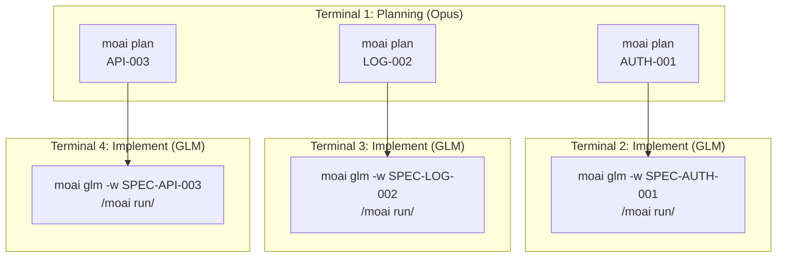
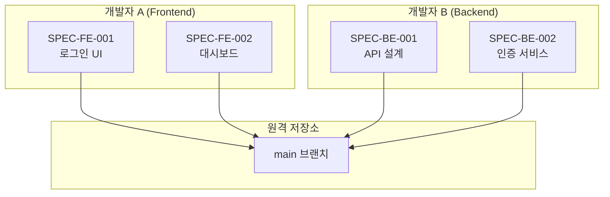
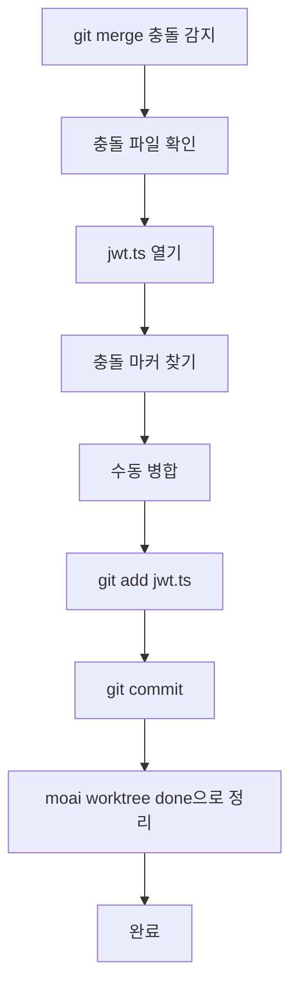
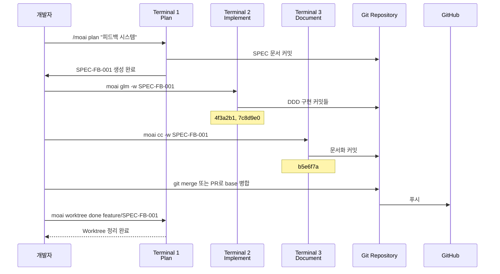

이 페이지는 Git Worktree(작업 트리 — 하나의 저장소에서 여러 작업 디렉터리를
갈라 내는 git의 기능)를 실제 프로젝트에서 어떻게 쓰는지 구체적인 시나리오로
보여 줍니다. 워크트리가 무엇이고 왜 필요한지는 [개요](/ko/worktree/)와
[완벽 가이드](/ko/worktree/guide)에서 이미 익혔다고 가정합니다. 이제 그
개념이 실제 명령 흐름에서 어떻게 펼쳐지는지를, 초보자도 따라 할 수 있도록
번호 매긴 단계로 풀어 보겠습니다.

>  **한 줄 요약** — 워크트리는 "저장소를 통째로
> 복제하지 않고도, 여러 작업을 서로 엉키지 않게 나란히 진행하게 해 주는 격리
> 수단"입니다. 이 페이지의 모든 시나리오는 그 격리를 어떻게 만들고, 쓰고,
> 정리하는지를 보여 줍니다.

## 왜 시나리오가 필요한가

워크트리의 가치는 "작업이 서로 엉키지 않게 한다"는 한 문장으로 요약되지만,
그 한 문장이 현실이 되려면 실제로 언제 워크트리를 만들고, 언제 합치고, 언제
버릴지를 명령으로 옮겨야 합니다. 개념만 알면 "그래서 지금 이 상황에서
무엇을 치야 하지?"에 막히게 됩니다. 그래서 이 페이지는 가장 흔한 네 가지
상황을 명령 흐름까지 보여 줍니다.

1. **단일 SPEC(단일 작업 단위) 개발** — 가장 기본이 되는 한 줄 흐름입니다.
2. **병렬 SPEC 개발** — 여러 작업을 동시에 돌릴 때 워크트리가 빛을 발합니다.
3. **팀 협업 시나리오** — 두 명 이상이 각자의 워크트리에서 일할 때의 약속입니다.
4. **문제 해결 사례** — 충돌, 레지스트리 손상, 디스크 정리까지 실전 대응입니다.

각 단계에는 "이 단계에서는 왜 이 명령을 쓰는가"를 한 줄로 달아 두었습니다.
명령을 외우려 하지 말고, 그 이유를 익히면 다른 상황에서도 스스로 명령을
조립할 수 있습니다.

## 목차

1. [Step 1 — 메인 체크아웃에서 SPEC 계획하기](#step-1--메인-체크아웃에서-spec-계획하기)
2. [Step 2 — 워크트리를 만들어 구현 시작하기](#step-2--워크트리를-만들어-구현-시작하기)
3. [Step 3 — 같은 워크트리에서 문서화하기](#step-3--같은-워크트리에서-문서화하기)
4. [Step 4 — base에 병합하고 워크트리 정리하기](#step-4--base에-병합하고-워크트리-정리하기)
5. [병렬 SPEC 개발](#병렬-spec-개발)
6. [팀 협업 시나리오](#팀-협업-시나리오)
7. [문제 해결 사례](#문제-해결-사례)
8. [팁과 요령](#팁과-요령)

---

아래 네 단계는 가장 기본이 되는 시나리오인 "단일 SPEC 개발"을 처음부터
끝까지 따라가는 흐름입니다. 계획은 메인 체크아웃(원래 프로젝트 디렉터리)에서
추론이 강한 모델로 진행하고, 구현은 워크트리 안에서 비용이 낮은 모델로
바꿔서 돌립니다. 이 모델 분배가 워크트리를 쓰는 가장 실질적인 이유 중 하나입니다.

## Step 1 — 메인 체크아웃에서 SPEC 계획하기

첫 단계는 워크트리를 만들지 않고, 익숙한 메인 체크아웃에서 그대로 진행합니다.
이유는 두 가지입니다. 첫째, 계획 단계에서는 코드를 쓰지 않고 SPEC 문서만
만들므로 다른 작업과 엉킬 일이 없습니다. 둘째, 메인 체크아웃에서 계획하면
여러 SPEC의 계획서를 나란히 두고 서로 참조하기 편합니다.

```bash
# 프로젝트 루트에서
$ cd /path/to/your-project

# SPEC 계획 생성
> /moai plan "JWT 기반 사용자 인증 시스템 구현"

# 진행 요약 (예시)
SPEC 분석 중...
  - 요구사항을 EARS 형식으로 정리

SPEC 문서 생성:
  ✓ .moai/specs/SPEC-AUTH-001/spec.md
  ✓ .moai/specs/SPEC-AUTH-001/plan.md
  ✓ .moai/specs/SPEC-AUTH-001/acceptance.md

다음 단계:
  1. 새 터미널에서 실행: moai glm -w SPEC-AUTH-001
  2. 개발 시작: /moai run SPEC-AUTH-001
```

계획이 끝나면 SPEC 세 개 문서(spec, plan, acceptance)가 메인 체크아웃에
생깁니다. 이 문서들은 앞으로 워크트리에서 구현할 때의 "설계도"가 됩니다.

## Step 2 — 워크트리를 만들어 구현 시작하기

이제 워크트리를 만들고 그 안으로 들어갑니다. `moai glm -w` 명령 하나가
"워크트리가 없으면 만들고, 값싼 GLM 백엔드로 전환하고, 그 안에서 세션을
시작한다"는 세 가지 일을 한 줄에 끝냅니다. 워크트리는 별도 디렉터리이므로,
여기서 코드를 쓰면 메인 체크아웃의 파일과 섞이지 않습니다.

```bash
# 새 터미널: 워크트리가 없으면 만들고, GLM 백엔드로 그 안에서 세션 시작
$ moai glm -w SPEC-AUTH-001

# 진입한 세션에서 DDD 구현 시작
> /moai run SPEC-AUTH-001

# 진행 요약 (예시)
Phase 1: ANALYZE
  ✓ 요구사항·기존 코드 분석

Phase 2: PRESERVE
  ✓ 특성화 테스트 생성, 기존 동작 보존 확인

Phase 3: IMPROVE
  ✓ JWT 인증 미들웨어 구현
  ✓ 리프레시 토큰 로테이션 구현
  ✓ 로그아웃 토큰 무효화 구현

구현 완료 — feature/SPEC-AUTH-001에 커밋됨

다음 단계:
  1. 테스트 실행: 프로젝트 언어의 테스트 명령 (예: go test ./... / npm test / pytest)
  2. 문서화: /moai sync SPEC-AUTH-001
  3. base 병합(git merge/PR) 후 정리: moai worktree done feature/SPEC-AUTH-001
```

왜 구현 단계에서 모델을 GLM으로 바꿀까요? 구현은 토큰을 많이 쓰지만
한 단계 한 단계의 추론 깊이는 계획만큼 깊지 않아도 됩니다. 그래서 비용이
낮은 모델로 돌려도 품질을 크게 떨어뜨리지 않으면서 비용을 아낄 수 있습니다.
이 절감 효과와 그 근거는 [CG 모드](/ko/multi-llm/cg-mode)에 정리되어 있습니다.

## Step 3 — 같은 워크트리에서 문서화하기

구현이 끝났다고 워크트리를 바로 버리면 안 됩니다. 문서화(`sync`)는 방금
구현한 코드의 맥락(어떤 파일을 고쳤는지, 어떤 SPEC AC를 만족했는지)을
그대로 활용해야 하므로, 같은 워크트리 안에서 이어서 돌리는 것이 가장
자연스럽습니다. 새 워크트리를 파면 그 맥락이 끊어집니다.

```bash
# 문서화 실행 (같은 Terminal 2, 같은 워크트리)
> /moai sync SPEC-AUTH-001

# 진행 요약 (예시)
문서 동기화 중...
  ✓ 코드맵·문서 갱신
  ✓ SPEC 상태 전이 및 커밋

문서화 완료 — feature/SPEC-AUTH-001에 커밋됨
다음 단계: base 병합(git merge/PR) 후 moai worktree done feature/SPEC-AUTH-001
```

## Step 4 — base에 병합하고 워크트리 정리하기

마지막 단계는 두 동작으로 나뉩니다. 먼저 작업 브랜치를 base 브랜치에
합치고(push까지), 그 다음에 워크트리를 정리합니다. 주의할 점은
`moai worktree done`이 병합과 푸시를 대신하지 않는다는 것입니다. 이 명령은
"워크트리 디렉터리와 (옵션으로) 브랜치를 지우는" 역할만 합니다. 그래서
반드시 `git merge`나 PR로 병합을 끝낸 뒤에 호출해야 합니다.

```bash
# 프로젝트 루트로 돌아와서
$ cd /path/to/your-project

# base 브랜치로 병합 (git 또는 PR)
$ git checkout main
$ git merge feature/SPEC-AUTH-001
$ git push origin main

# Worktree 정리 + 브랜치 삭제
$ moai worktree done feature/SPEC-AUTH-001 --delete-branch

# 출력
✓ Done: worktree for branch feature/SPEC-AUTH-001
  Path: ~/.moai/worktrees/your-project/SPEC-AUTH-001
  Worktree removed.
  Branch feature/SPEC-AUTH-001 deleted.
```

이 순서(병합 → 정리)를 지키는 것이 중요합니다. 정리를 먼저 하면 병합할
브랜치가 사라질 수 있고, 병합 없이 정리하면 작업 내용이 base에 닿지 않은
채로 사라집니다. "병합은 git이, 정리는 `done`이"라는 역할 분담을 기억하세요.

---

## 병렬 SPEC 개발

### 시나리오: 3개 SPEC 동시 개발

워크트리가 진가를 발휘하는 순간은 여러 SPEC을 동시에 돌릴 때입니다.
계획은 한 터미널에서 추론이 강한 모델(Opus)로 몰아서 끝내고, 구현은
GLM으로 바꿔 세 터미널에 나눠 돌립니다. 각 구현 세션은 각자의 워크트리에
갇혀 있으므로, 파일 편집이 서로 섞일 일이 없습니다.


```mermaid
graph TD
    subgraph T1["Terminal 1: Planning (Opus)"]
        P1["moai plan<br/>AUTH-001"]
        P2["moai plan<br/>LOG-002"]
        P3["moai plan<br/>API-003"]
    end

    subgraph T2["Terminal 2: Implement (GLM)"]
        I1["moai glm -w SPEC-AUTH-001<br/>/moai run/"]
    end

    subgraph T3["Terminal 3: Implement (GLM)"]
        I2["moai glm -w SPEC-LOG-002<br/>/moai run/"]
    end

    subgraph T4["Terminal 4: Implement (GLM)"]
        I3["moai glm -w SPEC-API-003<br/>/moai run/"]
    end

    P1 --> I1
    P2 --> I2
    P3 --> I3
```

#### Terminal 1: 계획 (모든 SPEC)

```bash
# SPEC 1: 인증
> /moai plan "JWT 인증 시스템"
✓ SPEC-AUTH-001 생성 완료

# SPEC 2: 로깅
> /moai plan "구조화된 로깅 시스템"
✓ SPEC-LOG-002 생성 완료

# SPEC 3: API
> /moai plan "REST API v2"
✓ SPEC-API-003 생성 완료
```

#### Terminal 2-4: 각 워크트리에서 구현

```bash
$ moai glm -w SPEC-AUTH-001
> /moai run SPEC-AUTH-001
# ... 구현 진행 중 ...
```

```bash
$ moai glm -w SPEC-LOG-002
> /moai run SPEC-LOG-002
# ... 구현 진행 중 ...
```

```bash
$ moai glm -w SPEC-API-003
> /moai run SPEC-API-003
# ... 구현 진행 중 ...
```

tmux(터미널 멀티플렉서)를 쓰고 있다면 터미널을 네 개 열 것 없이 한 창에서
`--spawn`으로 전부 띄울 수 있습니다. `--spawn`은 tmux의 새 창에서 같은 명령을
다시 실행해 줍니다.

```bash
$ moai glm -w SPEC-AUTH-001 --spawn
$ moai glm -w SPEC-LOG-002 --spawn
$ moai glm -w SPEC-API-003 --spawn
```

#### 병렬 진행 상황 모니터링

워크트리 목록은 git이 그대로 보여 줍니다. `moai`가 워크트리를 만들더라도
결국 git 워크트리이므로, 익숙한 git 명령으로 현황을 들여다볼 수 있습니다.

```bash
# Terminal 1에서 등록된 Worktree 확인
$ git worktree list
/path/to/your-project                                      4f3a2b1 [main]
/path/to/your-project/.claude/worktrees/SPEC-AUTH-001      7c8d9e0 [feature/SPEC-AUTH-001]
/path/to/your-project/.claude/worktrees/SPEC-LOG-002       2a1b3c4 [feature/SPEC-LOG-002]
/path/to/your-project/.claude/worktrees/SPEC-API-003       9f8e7d6 [feature/SPEC-API-003]

# 특정 Worktree의 최근 작업 확인
$ git -C .claude/worktrees/SPEC-AUTH-001 log --oneline -5
```

---

## 팀 협업 시나리오

### 시나리오: 2명 개발자 협업

두 명이 같은 원격 저장소를 바라보면서 각자의 컴퓨터에서 워크트리를 쓰는
상황입니다. 핵심은 각 개발자가 자기 컴퓨터 안에서만 워크트리를 쓴다는 점입니다.
워크트리는 로컬 격리 수단이지, 원격 협업 메커니즘이 아닙니다. 원격과의
동기화는 여전히 git push와 PR이 맡습니다.


```mermaid
graph TD
    subgraph Dev1["개발자 A (Frontend)"]
        F1[SPEC-FE-001<br/>로그인 UI]
        F2[SPEC-FE-002<br/>대시보드]
    end

    subgraph Dev2["개발자 B (Backend)"]
        B1[SPEC-BE-001<br/>API 설계]
        B2[SPEC-BE-002<br/>인증 서비스]
    end

    subgraph Remote["원격 저장소"]
        R[main 브랜치]
    end

    F1 --> R
    F2 --> R
    B1 --> R
    B2 --> R
```

#### 개발자 A: Frontend 개발

```bash
# 개발자 A의 머신에서
git clone https://github.com/team/project.git
cd project

# Frontend SPEC 생성
> /moai plan "로그인 UI 컴포넌트"
✓ SPEC-FE-001 생성

# Worktree에서 개발
$ moai glm -w SPEC-FE-001
> /moai run SPEC-FE-001

# 구현 완료 후 브랜치 푸시 + PR 생성 (git/gh)
$ git push -u origin feature/SPEC-FE-001
$ gh pr create --fill

# PR 머지 후 Worktree 정리
$ moai worktree done feature/SPEC-FE-001 --delete-branch
```

#### 개발자 B: Backend 개발

```bash
# 개발자 B의 머신에서
git clone https://github.com/team/project.git
cd project

# Backend SPEC 생성
> /moai plan "인증 API 서비스"
✓ SPEC-BE-001 생성

# Worktree에서 개발
$ moai glm -w SPEC-BE-001
> /moai run SPEC-BE-001

# 구현 완료 후 브랜치 푸시 + PR 생성 (git/gh)
$ git push -u origin feature/SPEC-BE-001
$ gh pr create --fill

# PR 머지 후 Worktree 정리
$ moai worktree done feature/SPEC-BE-001 --delete-branch
```

#### PR 병합 및 통합

```bash
# 팀 리드 또는 CI 시스템에서
gh pr list
# FE-001  Login UI Component          Ready
# BE-001  Authentication API Service  Ready

# PR 병합
gh pr merge FE-001 --merge
gh pr merge BE-001 --merge

# 모든 개발자가 최신 상태 유지
git pull origin main
```

---

## 문제 해결 사례

실전에서는 이론적 흐름이 항상 매끄럽게만 돌아가지 않습니다. 아래 세 가지는
가장 흔히 부딪히는 상황과 그 대응입니다.

### 사례 1: 병합 충돌 해결

병합은 `git merge`나 PR에서 일어나므로 충돌도 그 단계에서 납니다. Worktree
CLI는 병합에 관여하지 않으므로, 충돌 해결도 표준 git 흐름을 그대로 따릅니다.

```bash
$ git checkout main
$ git merge feature/SPEC-AUTH-001

# 출력
✗ 병합 충돌 발생!
충돌 파일:
  - src/auth/jwt.ts
  - tests/auth.test.ts
```

**해결 과정**:


```mermaid
flowchart TD
    A[git merge 충돌 감지] --> B[충돌 파일 확인]
    B --> C[jwt.ts 열기]
    C --> D[충돌 마커 찾기]
    D --> E[수동 병합]
    E --> F[git add jwt.ts]
    F --> G[git commit]
    G --> H[moai worktree done으로 정리]
    H --> I[완료]
```

```bash
# 충돌 해결
code src/auth/jwt.ts

# 충돌 마커 확인
<<<<<<< HEAD
const secret = process.env.JWT_SECRET;
=======
const secret = config.jwt.secret;
>>>>>>> feature/SPEC-AUTH-001

# 수동으로 병합
const secret = process.env.JWT_SECRET || config.jwt.secret;

# staging 후 커밋
git add src/auth/jwt.ts
git commit -m "fix: resolve merge conflict in JWT config"
git push origin main

# 병합이 끝났으면 Worktree 정리
moai worktree done feature/SPEC-AUTH-001 --delete-branch
✓ 완료!
```

### 사례 2: Worktree 레지스트리 손상 복구

디렉터리를 손으로 옮겼거나 지워서 git이 워크트리를 못 찾는 상태입니다.
이때는 `moai worktree recover`가 레지스트리를 다시 살펴 망가진 참조를
정리합니다.

```bash
# 1. 레지스트리 복구 — repair 후 stale 참조 prune, 인식된 목록 출력
$ moai worktree recover
Scanning for worktrees in /path/to/your-project...
Recovered 2 worktree(s):
  /path/to/your-project/.claude/worktrees/SPEC-AUTH-001  [feature/SPEC-AUTH-001]
  /path/to/your-project/.claude/worktrees/SPEC-LOG-002   [feature/SPEC-LOG-002]

# 2. 그래도 남아 있는 망가진 항목은 경로를 지정해 제거
$ moai worktree remove ~/.moai/worktrees/your-project/SPEC-AUTH-001 --force

# 3. 다시 만들면서 진입
$ moai glm -w SPEC-AUTH-001
```

### 사례 3: 디스크를 차지하는 Worktree 정리

워크트리는 저장소를 통째로 복제하지 않는다고는 하지만, 각각이 디스크
공간을 씁니다. 오래 쌓여 있으면 정리가 필요합니다.

```bash
$ df -h
Filesystem      Size  Used Avail Use%
/dev/disk1     500G  480G   20G  96%

# 1. base에 병합된 Worktree 정리
$ moai worktree clean --merged-only
  Removing merged worktree: .claude/worktrees/SPEC-LOG-002 [feature/SPEC-LOG-002]
Removed 1 merged worktree(s).

# 2. 병합은 안 됐지만 아무것도 안 남은 방치 Worktree 확인 (미리보기)
$ moai worktree clean --stale
  Keeping .claude/worktrees/SPEC-API-003 [feature/SPEC-API-003]: uncommitted or untracked changes

Would remove 1 stale worktree(s):
  .claude/worktrees/SPEC-TMP-009 [feature/SPEC-TMP-009]

This was a preview. Re-run with --yes to remove them.

# 3. 목록을 확인했으면 실제로 제거 (브랜치는 그대로 남습니다)
$ moai worktree clean --stale --yes
  Removing stale worktree: .claude/worktrees/SPEC-TMP-009 [feature/SPEC-TMP-009]
Removed 1 stale worktree(s). Branches were left intact.
```

안전 장치가 두 겹입니다. `--merged-only`는 이미 base에 합쳐진 것만
지우고, `--stale`은 미리보기를 먼저 보여준 뒤 `--yes`를 붙여야 실제로
지웁니다. 브랜치 자체는 워크트리 정리와 무관하게 남아 있으므로, 나중에
다시 돌아갈 수 있습니다.

---

## 실제 프로젝트 워크플로우

아래 시퀀스는 앞의 네 단계를 처음부터 끝까지 한 흐름을 한 장에 그린
것입니다. 개발자가 터미널을 옮겨 가며 계획, 구현, 문서화를 진행하고,
마지막에 base 병합과 정리로 닫는 모양을 확인하세요.


```mermaid
sequenceDiagram
    participant Dev as 개발자
    participant T1 as Terminal 1<br/>Plan
    participant T2 as Terminal 2<br/>Implement
    participant T3 as Terminal 3<br/>Document
    participant Git as Git Repository
    participant Remote as GitHub

    Dev->>T1: /moai plan "피드백 시스템"
    T1->>Git: SPEC 문서 커밋
    T1->>Dev: SPEC-FB-001 생성 완료

    Dev->>T2: moai glm -w SPEC-FB-001
    T2->>Git: DDD 구현 커밋들
    Note over T2: 4f3a2b1, 7c8d9e0

    Dev->>T3: moai cc -w SPEC-FB-001
    T3->>Git: 문서화 커밋
    Note over T3: b5e6f7a

    Dev->>Git: git merge 또는 PR로 base 병합
    Git->>Remote: 푸시
    Dev->>T1: moai worktree done feature/SPEC-FB-001
    T1-->>Dev: Worktree 정리 완료
```

---

## 성공 사례

### 사례: 스타트업 적용

```bash
# 상황: 3개의 기능을 동시에 개발해야 함
# 개발자: 2명

# 1) 모든 SPEC 계획 (메인 체크아웃)
> /moai plan "사용자 관리"
> /moai plan "결제 시스템"
> /moai plan "알림 시스템"

# 2) 병렬 구현 — tmux 한 창에서 세 세션 띄우기
$ moai glm -w SPEC-USER-001 --spawn
$ moai glm -w SPEC-PAY-001 --spawn
$ moai glm -w SPEC-NOTIF-001 --spawn

# 3) 문서화 — 각 Worktree 세션에서 /moai sync 실행

# 4) base 병합(git merge/PR) 후 Worktree 정리
$ moai worktree done feature/SPEC-USER-001 --delete-branch
$ moai worktree done feature/SPEC-PAY-001 --delete-branch
$ moai worktree done feature/SPEC-NOTIF-001 --delete-branch

# 결과
# - 3개의 기능 모두 완료
# - 병렬 개발로 개발 흐름 단축
# - GLM 사용으로 비용 절감
```

구현 세션을 GLM으로 돌린 덕에 비용이 눈에 띄게 줄었습니다. 절감 폭과 그
근거는 [CG 모드](/ko/multi-llm/cg-mode)에 정리되어 있습니다.

---

## 팁과 요령

### 팁 1: tmux 창 관리는 --spawn 에 맡기기

`--spawn`은 tmux 새 창에서 같은 명령을 다시 실행하고, 이동할 pane ID를
출력합니다. 포커스는 현재 창에 그대로 남습니다.

```bash
$ moai glm -w SPEC-USER-001 --spawn
Spawned pane %7 running `moai glm -w SPEC-USER-001` in /path/to/your-project
Switch to it with: tmux select-window -t %7
```

tmux 밖에서 `--spawn`을 쓰면 아무것도 바꾸지 않고 오류로 끝냅니다. 이때는
플래그를 빼고 현재 터미널에서 실행하세요.

### 팁 2: 진행 상황 추적

```bash
# 모든 Worktree 목록
git worktree list

# 각 Worktree의 최근 커밋 훑기
for wt in .claude/worktrees/*/; do
    echo "=== $wt ==="
    git -C "$wt" log --oneline -5
    echo ""
done
```

### 팁 3: 정리 루틴 스크립트

```bash
#!/bin/bash
# clean-worktrees.sh — 주기적으로 돌리는 정리 루틴

# 병합된 Worktree 제거
moai worktree clean --merged-only

# 방치된 Worktree는 먼저 미리보기로 확인 (자동 삭제하지 않음)
moai worktree clean --stale

echo "정리 대상을 확인했으면 --yes 를 붙여 다시 실행하세요."
```

정리 루틴을 스크립트로 묶어 두면, 주기적으로 돌릴 때 실수로 방치된
워크트리를 지우는 일을 막을 수 있습니다. 미리보기(`--stale`만) → 확인 →
`--yes`의 두 단계를 거치는 습관이 디스크를 안전하게 유지해 줍니다.

## 관련 문서

- [Git Worktree 개요](/ko/worktree/)
- [완벽 가이드](/ko/worktree/guide)
- [자주 묻는 질문](/ko/worktree/faq)
