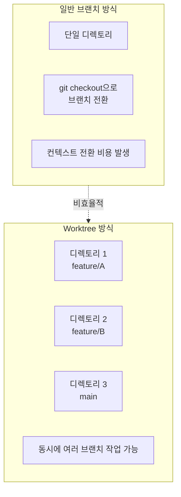
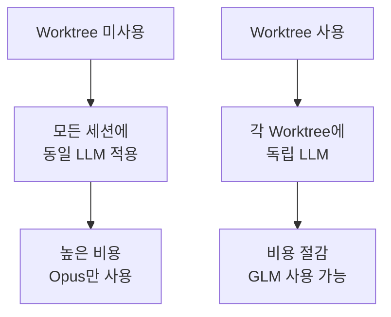
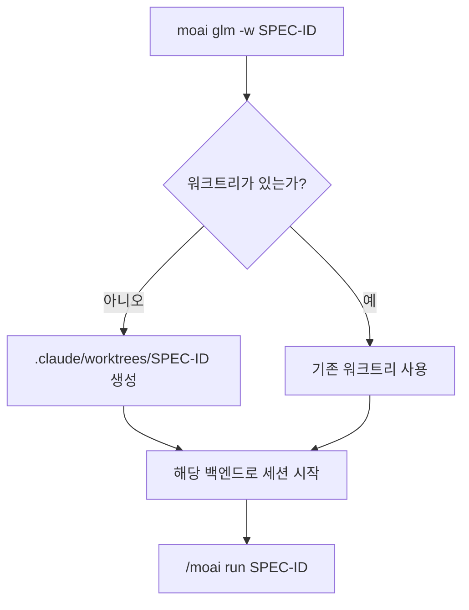
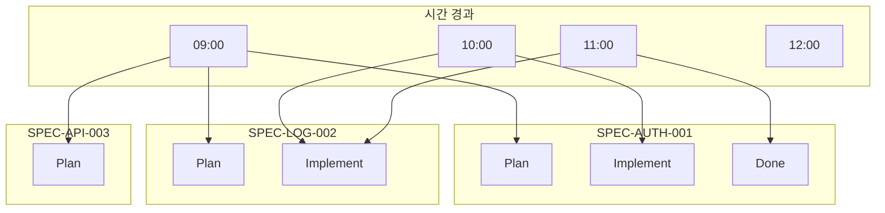
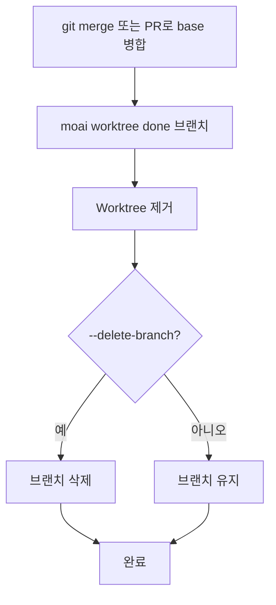
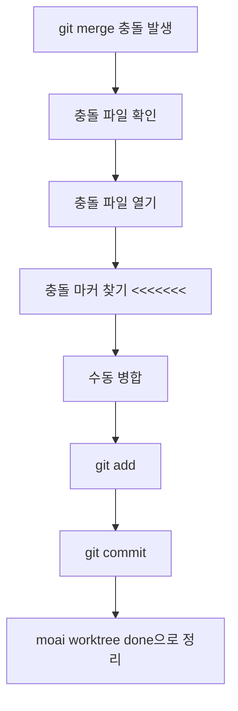
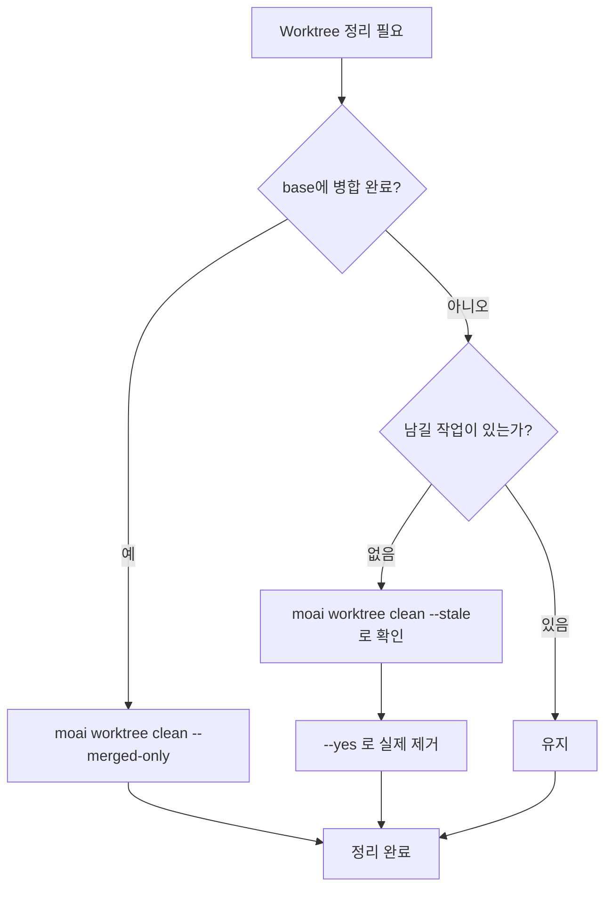
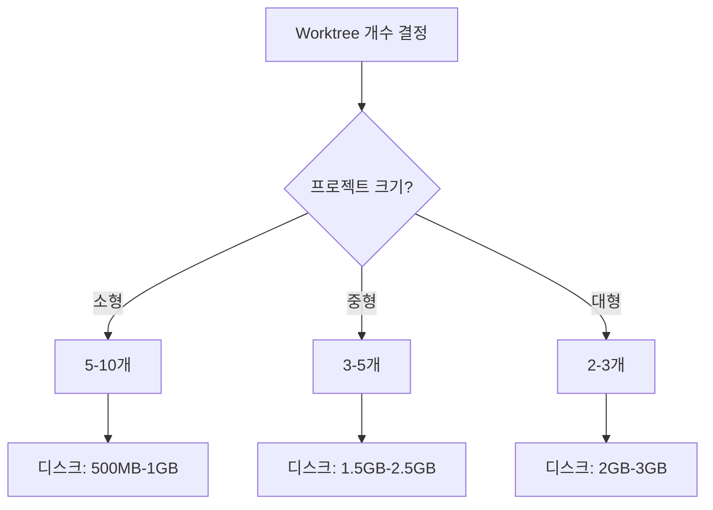
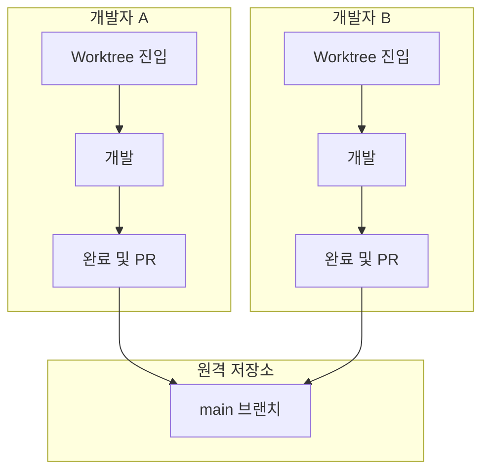

Git Worktree를 처음 쓰다 보면 "이거 일반 브랜치랑 뭐가 다르지?", "디스크를 얼마나 먹지?", "언제 정리해야 하지?" 같은 질문이 끊이지 않습니다. 이 페이지는 그런 질문 가운데 가장 자주 받는 것들을 모아서, 처음 접하는 사람도 한 번 읽고 넘어갈 수 있을 만큼 친절하게 풀어놓은 FAQ입니다.

MoAI-ADK에서 워크트리는 "혼자 쓸 때는 선택, 여러 SPEC(작업 단위)을 동시에 돌릴 때는 사실상 필수"인 도구입니다. 그래서 이 FAQ도 단순한 사용법을 넘어, 메인 체크아웃 보호, LLM 설정 분리, 정리 시점처럼 실전에서 자주 부딪히는 주제까지 아우릅니다. 각 답변은 두세 문장으로 친구에게 설명할 수 있는 수준까지 단순화했고, 명령어와 그림은 그대로 실행할 수 있게 남겨둡니다.

빠른 찾기를 원한다면 아래 목차에서 해당 항목으로 바로 건너뛰면 됩니다. 처음부터 끝까지 순서대로 읽어도, 궁금한 질문만 찾아 읽어도 괜찮습니다.

## 목차

1. [기본 개념](#기본-개념)
2. [사용 관련](#사용-관련)
3. [문제 해결](#문제-해결)
4. [성능 및 최적화](#성능-및-최적화)
5. [팀 협업](#팀-협업)

---

## 기본 개념

### Q: Git Worktree와 일반 브랜치의 차이점은 무엇인가요?

**A**: 한마디로 "작업 공간이 한 개냐 여러 개냐"의 차이입니다.

일반 브랜치는 **책상 하나**에 비유할 수 있습니다. 책상 위에는 한 번에 하나의 문서만 펼쳐둘 수 있어서, 다른 브랜치로 넘어가려면 `git checkout`으로 "지금 펼쳐둔 문서를 다른 버전으로 교체"해야 합니다. 작업 내용을 기억하고 컨텍스트를 다시 띄우는 비용이 매번 듭니다.

반면 Git Worktree는 **책상을 여러 개 놓는 것**과 같습니다. 각 책상(디렉토리)에는 서로 다른 브랜치가 이미 펼쳐져 있어서, 디렉토리만 옮기면 그 브랜치의 작업을 그대로 이어갈 수 있습니다. 체크아웃 비용이 0에 가깝고, 여러 브랜치를 동시에 열어둔 채로 왔다 갔다 할 수 있습니다.



**주요 차이점**:

| 특징          | 일반 브랜치         | Git Worktree    |
| ------------- | ------------------- | --------------- |
| 작업 디렉토리 | 1개 공유            | N개 독립        |
| 브랜치 전환   | `git checkout` 필요 | 디렉토리 이동만 |
| 동시 작업     | 불가능              | 가능            |
| LLM 설정      | 공유됨              | 독립적          |
| 충돌 가능성   | 높음                | 낮음            |

---

### Q: 왜 Worktree를 사용해야 하나요?

**A**: 이유는 크게 **LLM 설정 독립**과 **병렬 개발** 두 갈래입니다. 초보자가 가장 먼저 체감하는 이점은 "각 워크트리마다 다른 AI 모델을 쓸 수 있다"는 점입니다.

1. **LLM 설정 독립성** — SPEC마다 다른 LLM을 배정할 수 있습니다
   - Plan 단계: Opus (고품질 추론)
   - Implement 단계: GLM (저비용)
   - Document 단계: Sonnet (중간)

2. **병렬 개발** — 여러 SPEC을 동시에 진행할 수 있습니다
3. **충돌 방지** — 작업 공간이 따로 놀아 충돌이 거의 나지 않습니다
4. **비용 절감** — 구현 단계에 GLM을 쓰면 비용이 줄어듭니다. 절감 폭은 [CG 모드](/ko/multi-llm/cg-mode)에 정리되어 있습니다

왜 이런 분리가 가능한지 한 줄로 요약하면, 워크트리마다 `.moai/config/`가 따로 존재하기 때문입니다. 그래서 한 워크트리에서 GLM을 켜도 다른 워크트리의 Claude 설정은 흔들리지 않습니다.



---

### Q: MoAI-ADK에서 Worktree는 필수인가요?

**A**: 아니요, 필수는 아니지만 **강력히 권장**합니다. 기준은 단순합니다 — 동시에 몇 개의 SPEC을 돌리느냐에 따라 권장도가 달라집니다.

- **단일 SPEC 개발**: Worktree 없이도 충분히 가능
- **다중 SPEC 개발**: Worktree가 사실상 필수
- **팀 협업**: Worktree로 충돌 방지
- **비용 최적화**: Worktree로 LLM 분리

한 번에 하나씩 순차로 진행한다면 메인 체크아웃에서 그대로 작업해도 됩니다. 다만 두 개 이상의 SPEC을 병렬로 돌리기 시작하면, 워크트리 없이는 브랜치 전환 비용과 설정 충돌이 금세 눈에 띕니다.

---

## 사용 관련

### Q: Worktree로 어떻게 진입하나요?

**A**: 런처의 `-w` 플래그를 씁니다. 지정한 이름의 워크트리가 없으면 그 자리에서 만들어 주므로, 생성과 진입이 한 줄에서 끝납니다. 처음 쓴다면 아래 세 가지 명령 중 하나를 그대로 복사해 실행해 보세요.

```bash
# 워크트리를 만들면서 GLM 백엔드로 진입
moai glm -w SPEC-AUTH-001

# 같은 워크트리를 Claude 백엔드로 진입
moai cc -w SPEC-AUTH-001

# Claude 리더 + GLM 팀원 하이브리드로 진입
moai cg -w SPEC-AUTH-001
```

짧은 이름은 `.claude/worktrees/<이름>/` 아래에서 해석됩니다. 이미 만들어 둔 워크트리가 다른 곳에 있다면 절대 경로를 주면 됩니다 — `~/.moai/worktrees/` 또는 `<프로젝트>/.claude/worktrees/` 아래여야 하고, 그 밖의 경로는 거부됩니다.

**진입 후 작업 흐름**:



---

### Q: 현재 세션을 유지한 채로 워크트리를 하나 더 열 수 있나요?

**A**: `--spawn` 을 붙이면 됩니다. tmux 새 창에서 같은 명령이 실행되고, 지금 창은 포커스까지 그대로 유지됩니다. 한 터미널에서 SPEC을 여러 개 동시에 띄우고 싶을 때 유용합니다.

```bash
moai glm -w SPEC-AUTH-002 --spawn
# Spawned pane %7 running `moai glm -w SPEC-AUTH-002` in /path/to/your-project
# Switch to it with: tmux select-window -t %7
```

`--spawn` 은 tmux 안에서만 동작합니다. tmux 밖에서 쓰면 아무것도 바꾸지 않고 오류로 끝나므로, 그때는 플래그를 빼고 현재 터미널에서 실행하세요. `-w` 만 쓰면 현재 프로세스가 워크트리 세션으로 교체된다는 점이 `--spawn` 과의 차이입니다.

---

### Q: 만들어 둔 Worktree 목록은 어떻게 보나요?

**A**: git 명령을 그대로 씁니다. `moai worktree` 에는 목록 명령이 없기 때문에, 표준 git 명령으로 확인합니다.

```bash
git worktree list
```

특정 워크트리의 상태나 최근 커밋도 `git -C` 로 확인합니다 — 디렉토리로 이동할 필요 없이 그 자리에서 상태를 볼 수 있어서 정리 전 점검에도 편합니다.

```bash
git -C .claude/worktrees/SPEC-AUTH-001 status
git -C .claude/worktrees/SPEC-AUTH-001 log --oneline -5
```

---

### Q: 여러 Worktree를 동시에 사용할 수 있나요?

**A**: 네, 개수 제한 없이 가능합니다. 터미널을 여러 개 띄워 두고 각각 다른 워크트리에 진입하면, 서로 영향을 주지 않고 병렬로 작업이 진행됩니다.

```bash
# Terminal 1
moai glm -w SPEC-AUTH-001

# Terminal 2
moai glm -w SPEC-LOG-002

# Terminal 3
moai glm -w SPEC-API-003

# 모두 동시에 작업 가능
```

tmux를 쓰고 있다면 한 창에서 `--spawn` 으로 전부 띄울 수 있습니다. 터미널을 일일이 열 필요 없이 한 번에 병렬 작업 환경이 갖춰집니다.

```bash
moai glm -w SPEC-AUTH-001 --spawn
moai glm -w SPEC-LOG-002 --spawn
moai glm -w SPEC-API-003 --spawn
```

**병렬 작업 시각화**:



---

### Q: Worktree를 완료하는 방법은?

**A**: `moai worktree done`은 Worktree를 지우고, 원하면 브랜치까지 삭제합니다. 다만 **병합도 푸시도 하지 않습니다**. base 병합은 `git merge`나 PR로 먼저 끝내세요. 인자는 경로가 아니라 브랜치 이름입니다.

```bash
# Worktree 제거만
moai worktree done feature/SPEC-AUTH-001

# Worktree 제거 + 브랜치 삭제
moai worktree done feature/SPEC-AUTH-001 --delete-branch

# 자동화용 무출력 모드 (PR 머지 후 정리)
moai worktree done feature/SPEC-AUTH-001 --auto
```

**완료 프로세스**:



---

### Q: `moai worktree done` 과 `moai worktree remove` 는 뭐가 다른가요?

**A**: 무엇을 인자로 받는지가 다릅니다. `done`은 브랜치 이름으로 찾고, `remove`는 파일 시스템 경로로 찾습니다.

| | `done` | `remove` |
|---|---|---|
| 인자 | 브랜치 이름 (`feature/SPEC-AUTH-001`) | 파일 시스템 경로 |
| 하는 일 | 그 브랜치의 워크트리를 찾아 제거 | 그 경로의 워크트리를 제거 |
| 브랜치 삭제 | `--delete-branch` 로 선택 가능 | 하지 않음 |
| 자동화 모드 | `--auto` 지원 | 없음 |

브랜치를 알고 있으면 `done`, 경로만 알거나 브랜치가 깨진 워크트리를 치울 때는 `remove` 를 쓰면 됩니다.

---

## 문제 해결

### Q: `moai worktree clean --stale` 은 안전한가요?

**A**: 안전하도록 설계돼 있습니다. 세 겹의 보호가 걸려 있어서, 실수로 작업을 날릴 일이 거의 없습니다.

1. **기본이 미리보기입니다.** `--stale` 만 주면 제거 예정 목록만 출력하고 실제로 지우지 않습니다. `--yes` 를 붙여야 삭제가 일어납니다
2. **잃을 것이 있으면 지우지 않습니다.** 작업 트리가 깨끗하고(미커밋 변경도, untracked 파일도 없음) 브랜치에 base를 넘어서는 고유 커밋이 없는 워크트리만 대상이 됩니다. 하나라도 어긋나면 유지되고 그 이유가 함께 출력됩니다
3. **브랜치는 절대 삭제하지 않습니다.** 워크트리 디렉터리가 사라져도 커밋은 브랜치 이름으로 그대로 남아 언제든 다시 꺼낼 수 있습니다

메인 체크아웃과 지금 명령을 실행 중인 워크트리도 항상 보호 대상에서 빠집니다. 그래서 "내가 지금 일하고 있는 공간"이 잘려 나갈 일은 없습니다.

```bash
# 1) 무엇이 지워질지 먼저 확인
$ moai worktree clean --stale
  Keeping .claude/worktrees/SPEC-API-003 [feature/SPEC-API-003]: uncommitted or untracked changes

Would remove 1 stale worktree(s):
  .claude/worktrees/SPEC-TMP-009 [feature/SPEC-TMP-009]

This was a preview. Re-run with --yes to remove them.

# 2) 확인했으면 실제 제거
$ moai worktree clean --stale --yes
```

`--stale` 과 `--merged-only` 는 함께 쓸 수 없습니다. 병합 여부로 정리하려면 `--merged-only`, 방치 여부로 정리하려면 `--stale` 을 쓰세요.

---

### Q: Worktree 충돌이 발생했어요

**A**: 병합 충돌은 `git merge`나 PR 단계에서 납니다. Worktree CLI는 병합에 관여하지 않으니, 표준 git 충돌 해결 흐름을 그대로 따르면 됩니다.



**실제 예시**:

```bash
git checkout main
git merge feature/SPEC-AUTH-001
✗ 병합 충돌 발생!

# 1. 충돌 파일 확인
git status
# 충돌 파일: src/auth/jwt.ts

# 2. 충돌 해결
code src/auth/jwt.ts

# 3. 충돌 마커 확인 및 수정
<<<<<<< HEAD
const secret = process.env.JWT_SECRET;
=======
const secret = config.jwt.secret;
>>>>>>> feature/SPEC-AUTH-001

# 4. 병합
const secret = process.env.JWT_SECRET || config.jwt.secret;

# 5. 커밋
git add src/auth/jwt.ts
git commit -m "fix: resolve merge conflict"
git push origin main

# 6. 병합 후 Worktree 정리
moai worktree done feature/SPEC-AUTH-001 --delete-branch
✓ 완료!
```

---

### Q: Worktree 레지스트리가 손상되었어요

**A**: 디렉터리를 손으로 옮기거나 지우면 git이 워크트리를 못 찾습니다. 예를 들어 파인더에서 `.claude/worktrees/SPEC-AUTH-001` 폴더를 직접 드래그해서 다른 곳으로 옮기면, git의 레지스트리와 실제 위치가 어긋나면서 오류가 납니다. 다음 순서로 복구하세요.

```bash
# 1. 레지스트리 복구 (git worktree repair + prune + 목록 출력)
$ moai worktree recover
Scanning for worktrees in /path/to/your-project...
Recovered 2 worktree(s):
  /path/to/your-project/.claude/worktrees/SPEC-AUTH-001  [feature/SPEC-AUTH-001]
  /path/to/your-project/.claude/worktrees/SPEC-LOG-002   [feature/SPEC-LOG-002]

# 2. 현재 상태 확인
$ git worktree list

# 3. 그래도 남은 망가진 항목은 경로를 지정해 제거
$ moai worktree remove ~/.moai/worktrees/your-project/SPEC-AUTH-001 --force

# 4. 다시 만들면서 진입
$ moai glm -w SPEC-AUTH-001
```

---

### Q: 디스크 공간이 부족해요

**A**: 병합이 끝난 Worktree부터 정리하세요. 워크트리는 디스크를 꽤 잡아먹기 때문에(트리마다 프로젝트 파일 전체가 한 벌씩 복사됨), 쌓이면 금방 수 기가바이트를 넘습니다.

```bash
# 1. 디스크 사용량 확인
$ du -sh .claude/worktrees/*
2.5G    .claude/worktrees/SPEC-AUTH-001
1.8G    .claude/worktrees/SPEC-LOG-002
3.2G    .claude/worktrees/SPEC-API-003

# 2. base에 병합된 Worktree 정리
$ moai worktree clean --merged-only

# 3. 병합은 안 됐지만 아무것도 안 남은 Worktree 확인 후 정리
$ moai worktree clean --stale
$ moai worktree clean --stale --yes
```

**정리 전략**:



---

### Q: LLM이 예상대로 작동하지 않아요

**A**: Worktree마다 LLM 설정이 어떻게 잡혀 있는지 확인하세요. 워크트리는 `.moai/config/`를 독립적으로 갖기 때문에, 메인 체크아웃에서 바꾼 설정이 지금 작업 중인 워크트리에 반영돼 있지 않을 수 있습니다.

```bash
# 현재 LLM 백엔드 확인 (Worktree별 설정은 .moai/config/sections/llm.yaml에 기록됨)
cat .moai/config/sections/llm.yaml

# 백엔드를 바꾸려면 그 워크트리로 다시 진입
moai cc -w SPEC-AUTH-001   # Claude 백엔드로 전환

# 다른 Worktree는 영향 없음
git -C .claude/worktrees/SPEC-LOG-002 show HEAD:.moai/config/sections/llm.yaml
```

---

### Q: Git 명령어가 작동하지 않아요

**A**: 올바른 디렉토리에 있는지 확인하세요. 워크트리 안에서 git 명령이 이상하게 작동한다면, 대부분은 "내가 지금 어느 트리에 있는지"가 꼬인 경우입니다.

```bash
# 현재 워크트리 루트 확인
git rev-parse --show-toplevel

# Git 상태 확인
git status
# On branch feature/SPEC-AUTH-001
# nothing to commit, working tree clean

# 만약 Git 오류가 발생하면
git fetch --all
git rebase origin/feature/SPEC-AUTH-001
```

---

## 성능 및 최적화

### Q: Worktree가 성능에 영향을 주나요?

**A**: 영향은 크지 않습니다. 일상적인 개발에서 체감하기 어려운 수준이며, 장점이 단점을 훌쩍 넘습니다.

**장점**:

- Worktree가 서로 독립적이라 캐시가 잘 먹음
- Git 작업이 빠름 (로컬 브랜치)
- 파일 시스템 캐시 활용

**단점**:

- 디스크 공간 소모 (Worktree마다 중복)
- 처음 Worktree를 만들 때 시간이 좀 걸림

**최적화 팁**:

```bash
# 1. 필요 없는 Worktree 제거
moai worktree clean --merged-only

# 2. Git 가비지 컬렉션
git gc --aggressive --prune=now

# 3. stale 참조 정리
moai worktree clean
```

---

### Q: 몇 개의 Worktree를 생성할 수 있나요?

**A**: 이론적으로는 제한이 없지만, 실제로는 디스크 공간과 메모리가 개수를 좌우합니다. 워크트리를 무한정 만들 수는 있지만, 기계의 자원이 허락하는 만큼만 현명하게 늘리는 것이 좋습니다.

**제한 요인**:

1. **디스크 공간**: 각 Worktree는 약 100MB-1GB 사용
2. **메모리**: 각 Worktree에서 열린 세션
3. **파일 시스템**: 동시에 열 수 있는 파일 수

**권장 사항**:

- **소형 프로젝트**: 5-10개 Worktree
- **중형 프로젝트**: 3-5개 Worktree
- **대형 프로젝트**: 2-3개 Worktree



---

### Q: Worktree를 자동으로 정리할 수 있나요?

**A**: 병합된 Worktree 정리는 자동화해도 안전합니다. 다만 `--stale --yes` 는 무인 실행보다 사람이 목록을 보고 실행하는 쪽을 권합니다 — 기준이 "방치"라서 한 번 더 확인하는 게 안전합니다.

```bash
#!/bin/bash
# clean-worktrees.sh
cd /path/to/project

# base에 병합된 Worktree 정리 (안전)
moai worktree clean --merged-only

# 방치된 Worktree는 목록만 보고합니다 (지우지 않음)
moai worktree clean --stale

# Git 가비지 컬렉션
git gc --aggressive --prune=now

echo "Worktree 정리 완료 — --stale 목록은 확인 후 직접 --yes 로 처리하세요"
```

**크론 작업 설정**:

```bash
# 매주 일요일 새벽 2시에 실행
0 2 * * 0 /path/to/clean-worktrees.sh >> /var/log/worktree-cleanup.log 2>&1
```

---

## 팀 협업

### Q: 팀에서 Worktree를 어떻게 사용하나요?

**A**: 팀원 각자가 자기 워크트리에서 작업하고, 완료하면 원격 `main`으로 PR을 보내는 흐름이 가장 흔합니다. 워크트리는 로컬 격리 수단이므로, 원격 저장소에서는 일반 브랜치/PR 흐름과 다를 게 없습니다.



**팀 협업 가이드**:

1. **Worktree 명명 규칙**: `SPEC-{카테고리}-{번호}`
2. **정기적인 동기화**: `moai worktree sync`
3. **PR 리뷰 전에**: 로컬에서 테스트 완료
4. **충돌 방지**: 자주 `main`과 동기화

---

### Q: Worktree를 base 브랜치와 동기화하는 방법은?

**A**: `moai worktree sync`가 base 브랜치의 변경 사항을 Worktree로 끌어옵니다. 다른 팀원이 `main`에 머지한 커밋을 내 워크트리로 당겨올 때 씁니다. `--strategy`로 merge(기본)와 rebase 중 하나를 고릅니다.

```bash
# 현재 디렉토리의 Worktree를 base(main)와 동기화 — merge 전략
moai worktree sync

# 특정 Worktree를 rebase 전략으로 동기화
moai worktree sync feature/SPEC-AUTH-001 --strategy rebase

# 다른 base 브랜치를 기준으로 동기화
moai worktree sync feature/SPEC-AUTH-001 --base develop
```

---

### Q: PR 리뷰 중 Worktree를 어떻게 관리하나요?

**A**: PR이 열려 있는 동안에는 워크트리를 그대로 두고, 머지된 뒤에 정리하는 것이 기본 흐름입니다. 수정 요청이 들어오면 다시 진입해 이어서 작업하면 됩니다.

```bash
# PR 생성 전 — 상태와 변경 사항 확인
git worktree list
git log main..feature/SPEC-AUTH-001

# PR 리뷰 중 — Worktree 유지 (병합 대기)

# PR 승인 및 머지 후 Worktree 정리
moai worktree done feature/SPEC-AUTH-001 --delete-branch

# 수정 요청을 받았다면 다시 진입해 작업 계속
moai glm -w SPEC-AUTH-001
```

---

## 추가 질문

### Q: Worktree를 사용하지 않고 MoAI-ADK를 사용할 수 있나요?

**A**: 쓸 수는 있습니다. 워크트리는 기본값이 아니라 사용자가 고르는 선택지이고, `-w` 없이 실행하면 메인 체크아웃에서 그대로 작업합니다.

```bash
# 워크트리 없이 실행
moai cc
> /moai plan "기능 설명"
> /moai run SPEC-XXX-001

# 다만 다음은 감수해야 합니다:
# 1. 모든 세션에 동일 LLM 설정 적용
# 2. 병렬 개발 시 브랜치 전환 비용
```

SPEC을 하나씩 순차로 진행한다면 충분합니다. 여러 SPEC을 동시에 돌리기 시작하면 워크트리 쪽이 확실히 편합니다.

---

### Q: Worktree를 백업해야 하나요?

**A**: Worktree는 Git이 관리하므로 따로 백업할 필요가 없습니다. 커밋하고 원격에 푸시하면 워크트리가 날아가도 언제든 되살릴 수 있습니다.

```bash
# Worktree는 Git의 일부
# 원격 저장소에 푸시하면 자동 백업

# 정기적으로 원격에 푸시
git push origin feature/SPEC-AUTH-001

# Worktree 손실 시 복구
git fetch origin
git worktree add .claude/worktrees/SPEC-AUTH-001 origin/feature/SPEC-AUTH-001
```

untracked 파일은 git이 관리하지 않으므로 이 방식으로 되살아나지 않습니다. `.env` 같은 로컬 파일은 따로 챙겨 두세요.

---

## 관련 문서

- [Git Worktree 개요](/ko/worktree/)
- [완벽 가이드](/ko/worktree/guide)
- [실제 사용 예시](/ko/worktree/examples)

## 추가 도움이 필요하신가요?

- [GitHub Issues](https://github.com/modu-ai/moai-adk/issues) — 버그 리포트, 기능 요청
- [Discord 커뮤니티](https://discord.gg/Z7E7Mdc5aN) — 실시간 소통, 팁 공유
