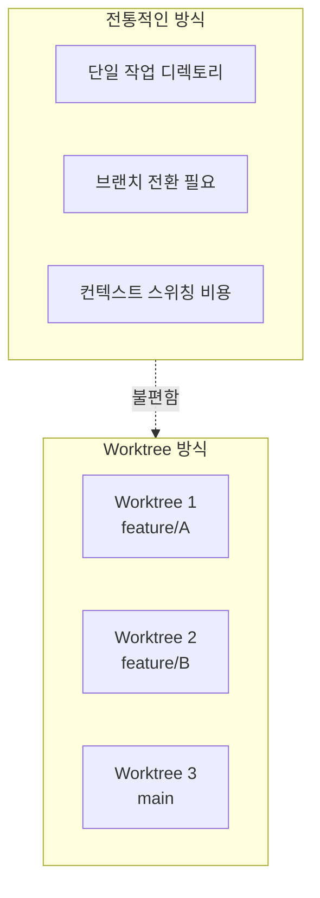
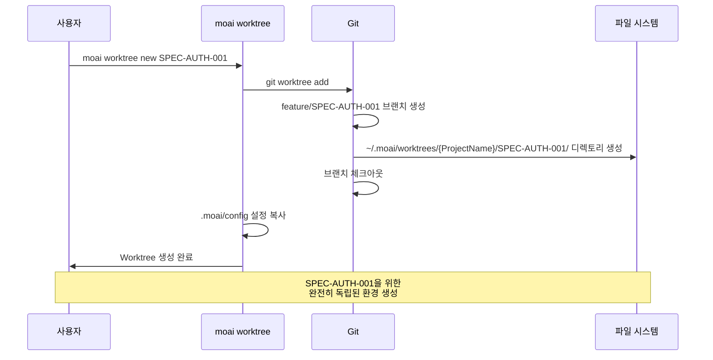
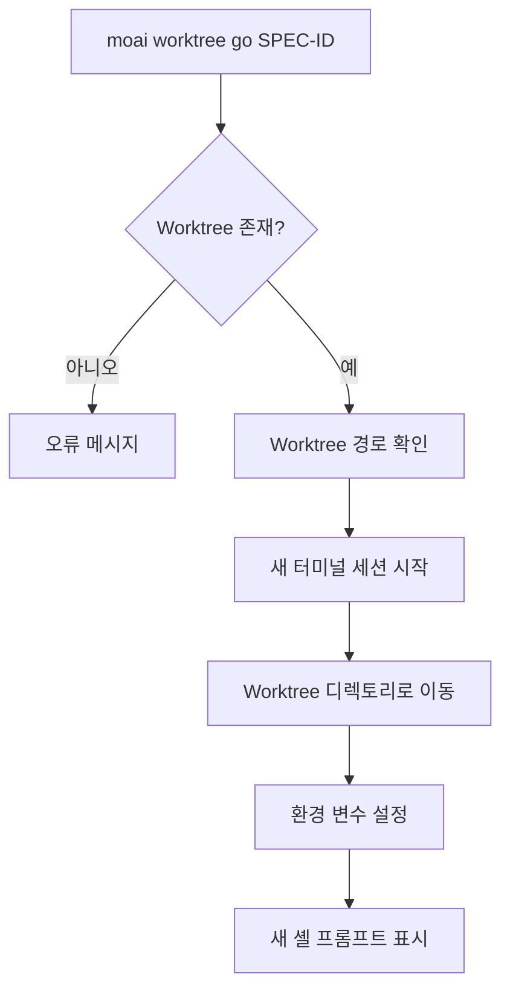
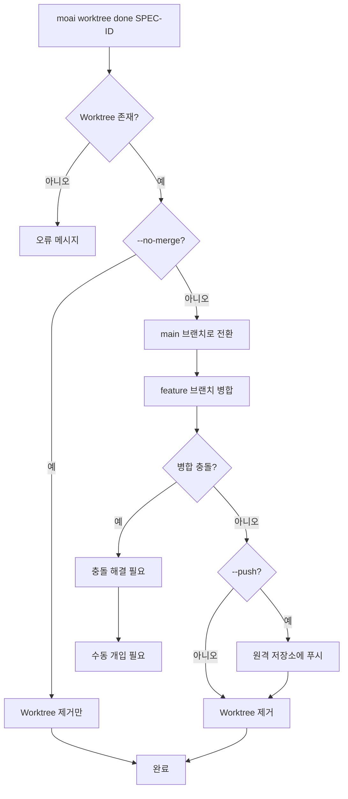
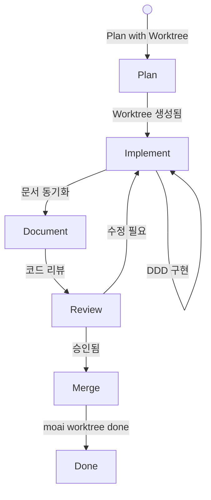
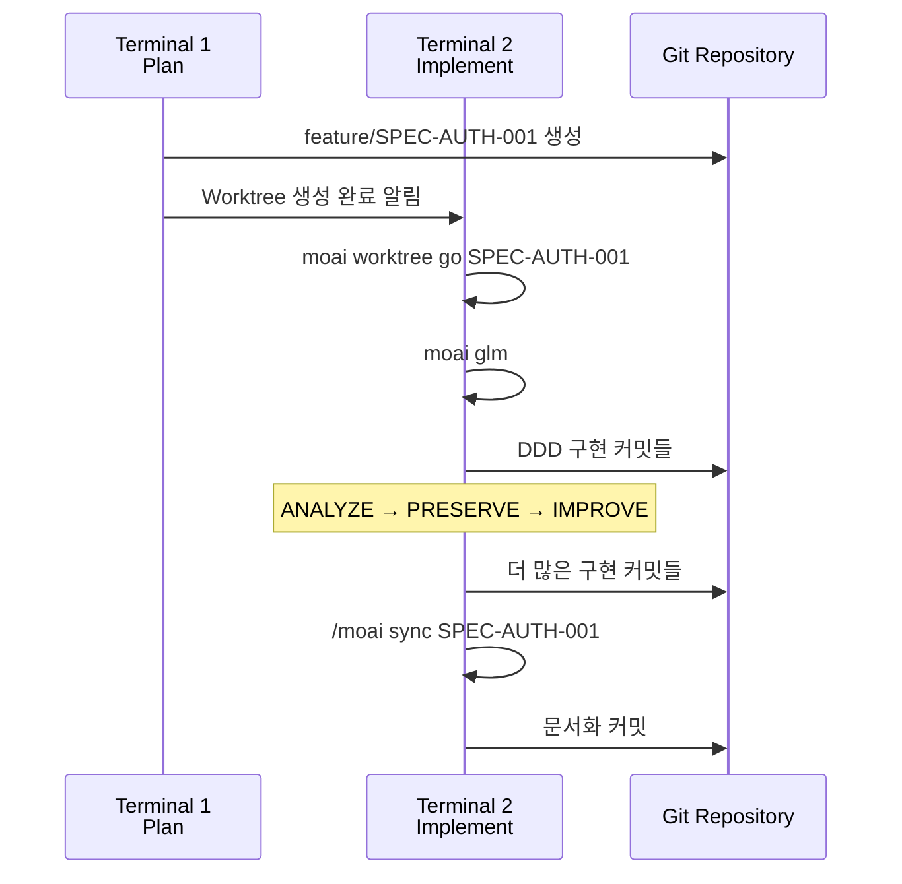
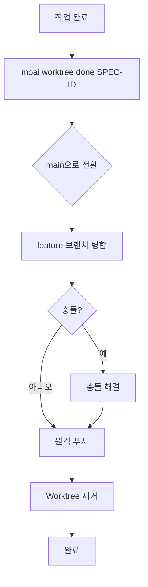
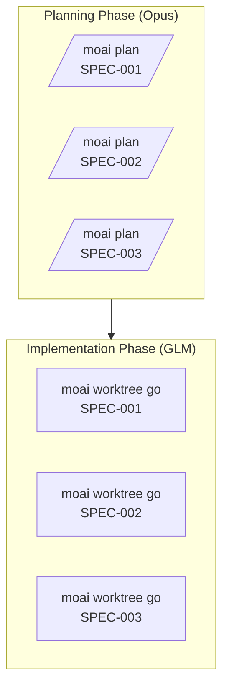
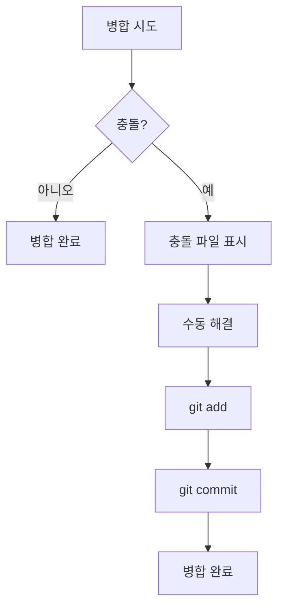
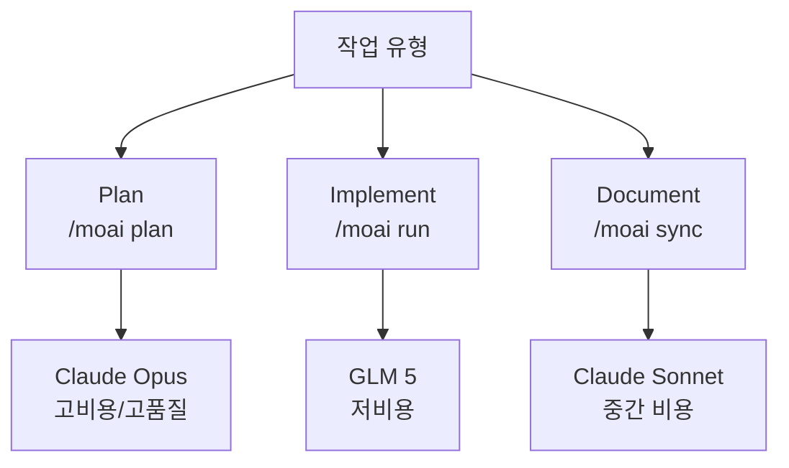

이 가이드는 Git Worktree를 사용한 MoAI-ADK 병렬 개발의 모든 측면을 상세히
설명합니다.

## 목차

1. [Worktree 기초](#worktree-기초)
2. [명령어 상세 참조](#명령어-상세-참조)
3. [워크플로우 가이드](#워크플로우-가이드)
4. [고급 기능](#고급-기능)
5. [모범 사례](#모범-사례)

---

## Worktree 기초

### Git Worktree란 무엇인가요?

Git Worktree는 **동일한 Git 저장소를 여러 디렉토리에서 동시에 작업**할 수 있게
해주는 Git의 기능입니다.



### MoAI-ADK에서의 Worktree

MoAI-ADK는 Git Worktree를 활용하여 **각 SPEC을 완전히 독립된 환경**에서 개발할
수 있게 합니다:

- **독립적인 Git 상태**: 각 Worktree는 자체 브랜치와 커밋 histories 유지
- **분리된 LLM 설정**: 각 Worktree에서 다른 LLM 사용 가능
- **격리된 작업 공간**: 파일 시스템 레벨의 완전한 분리

---

## 명령어 상세 참조

### moai worktree new

새로운 Worktree를 생성합니다.

#### 문법

```bash
moai worktree new SPEC-ID [options]
```

#### 매개변수

- **SPEC-ID** (필수): 생성할 SPEC의 ID (예: `SPEC-AUTH-001`)

#### 옵션

- `-b, --branch BRANCH`: 사용할 브랜치 이름 지정 (기본값: `feature/SPEC-ID`)
- `--from BASE`: 기본 브랜치 지정 (기본값: `main`)
- `--force`: 기존 Worktree가 있을 경우 강제 재생성

#### 사용 예시

```bash
# 기본 사용법
moai worktree new SPEC-AUTH-001

# 특정 브랜치에서 생성
moai worktree new SPEC-AUTH-001 --from develop

# 강제 재생성
moai worktree new SPEC-AUTH-001 --force
```

#### 동작 과정



---

### moai worktree go

Worktree로 진입하여 새로운 셸 세션을 시작합니다.

#### 문법

```bash
moai worktree go SPEC-ID
```

#### 매개변수

- **SPEC-ID** (필수): 진입할 Worktree의 ID

#### 사용 예시

```bash
# Worktree 진입
moai worktree go SPEC-AUTH-001

# 진입 후 LLM 변경
moai glm

# Claude Code 시작
claude

# 작업 시작
> /moai run SPEC-AUTH-001
```

#### 동작 과정



---

### moai worktree list

모든 Worktree의 목록을 표시합니다.

#### 문법

```bash
moai worktree list [options]
```

#### 옵션

- `-v, --verbose`: 상세 정보 포함
- `--porcelain`: 파싱 가능한 형식으로 출력

#### 사용 예시

```bash
# 기본 목록
moai worktree list

# 상세 정보
moai worktree list --verbose

# 출력 예시
SPEC-AUTH-001  feature/SPEC-AUTH-001  /path/to/worktree/SPEC-AUTH-001  [active]
SPEC-AUTH-002  feature/SPEC-AUTH-002  /path/to/worktree/SPEC-AUTH-002
SPEC-AUTH-003  feature/SPEC-AUTH-003  /path/to/worktree/SPEC-AUTH-003
```

---

### moai worktree done

Worktree의 작업을 완료하고 병합 후 정리합니다.

#### 문법

```bash
moai worktree done SPEC-ID [options]
```

#### 매개변수

- **SPEC-ID** (필수): 완료할 Worktree의 ID

#### 옵션

- `--push`: 병합 후 원격 저장소에 푸시
- `--no-merge`: 병합하지 않고 Worktree만 제거
- `--force`: 충돌이 있어도 강제 병합

#### 사용 예시

```bash
# 기본 병합 및 정리
moai worktree done SPEC-AUTH-001

# 원격 저장소에 푸시
moai worktree done SPEC-AUTH-001 --push

# 병합 없이 제거만
moai worktree done SPEC-AUTH-001 --no-merge
```

#### 동작 과정



---

### moai worktree remove

Worktree를 제거합니다 (병합 없이).

#### 문법

```bash
moai worktree remove SPEC-ID [options]
```

#### 매개변수

- **SPEC-ID** (필수): 제거할 Worktree의 ID

#### 옵션

- `--force`: 변경 사항이 있어도 강제 제거
- `--keep-branch`: 브랜치는 유지하고 Worktree만 제거

#### 사용 예시

```bash
# 기본 제거
moai worktree remove SPEC-AUTH-001

# 강제 제거
moai worktree remove SPEC-AUTH-001 --force

# 브랜치 유지
moai worktree remove SPEC-AUTH-001 --keep-branch
```

---

### moai worktree status

Worktree의 상태를 확인합니다.

#### 문법

```bash
moai worktree status [SPEC-ID]
```

#### 매개변수

- **SPEC-ID** (선택): 특정 Worktree의 상태 확인 (지정하지 않으면 모두 표시)

#### 사용 예시

```bash
# 모든 Worktree 상태
moai worktree status

# 특정 Worktree 상태
moai worktree status SPEC-AUTH-001

# 출력 예시
Worktree: SPEC-AUTH-001
Branch: feature/SPEC-AUTH-001
Path: /path/to/worktree/SPEC-AUTH-001
Status: Clean (2 commits ahead of main)
LLM: GLM 5
```

---

### moai worktree clean

병합되거나 완료된 Worktree를 정리합니다.

#### 문법

```bash
moai worktree clean [options]
```

#### 옵션

- `--merged-only`: 병합된 Worktree만 정리
- `--older-than DAYS`: N일 이상된 Worktree만 정리
- `--dry-run`: 실제로 제거하지 않고 표시만

#### 사용 예시

```bash
# 병합된 Worktree 정리
moai worktree clean --merged-only

# 7일 이상된 Worktree 정리
moai worktree clean --older-than 7

# 미리보기
moai worktree clean --dry-run
```

---

### moai worktree config

Worktree 설정을 확인하거나 수정합니다.

#### 문법

```bash
moai worktree config [key] [value]
```

#### 매개변수

- **key** (선택): 설정 키
- **value** (선택): 설정 값

#### 사용 예시

```bash
# 모든 설정 표시
moai worktree config

# 특정 설정 확인
moai worktree config root

# 설정 변경
moai worktree config root /new/path/to/worktrees
```

---

## 워크플로우 가이드

### 완전한 개발 사이클



### 1단계: SPEC 계획 (Phase 1)

```bash
# Terminal 1에서
> /moai plan "사용자 인증 시스템 구현" --worktree
```

**출력**:

```
✓ SPEC 문서 생성: .moai/specs/SPEC-AUTH-001/spec.md
✓ Worktree 생성: ~/.moai/worktrees/{ProjectName}/SPEC-AUTH-001
✓ 브랜치 생성: feature/SPEC-AUTH-001
✓ 브랜치 전환 완료

다음 단계:
1. 새 터미널에서 실행: moai worktree go SPEC-AUTH-001
2. LLM 변경: moai glm
3. 개발 시작: claude
```

### 2단계: 구현 (Phase 2)

```bash
# Terminal 2에서
moai worktree go SPEC-AUTH-001

# Worktree에 진입하면 프롬프트가 변경됨
(SPEC-AUTH-001) $ moai glm
→ GLM 5로 설정되었습니다.

(SPEC-AUTH-001) $ claude
> /moai run SPEC-AUTH-001
```

**작업 흐름**:



### 3단계: 완료 및 병합 (Phase 3)

```bash
# Terminal 2에서 작업 완료 후
exit

# Terminal 1에서
moai worktree done SPEC-AUTH-001 --push
```

**프로세스**:



---

## 고급 기능

### 병렬 작업 전략

#### 전략 1: Plan과 Implement 분리



#### 전략 2: 동시 개발

```bash
# Terminal 1: SPEC-001 Plan
> /moai plan "인증" --worktree

# Terminal 2: SPEC-002 Plan (완료 후)
> /moai plan "로그" --worktree

# Terminal 3, 4, 5: 병렬 구현
moai worktree go SPEC-001 && moai glm  # Terminal 3
moai worktree go SPEC-002 && moai glm  # Terminal 4
moai worktree go SPEC-003 && moai glm  # Terminal 5
```

### Worktree 간 전환

```bash
# 현재 Worktree 확인
moai worktree status

# 다른 Worktree로 전환
moai worktree go SPEC-AUTH-002

# 또는 직접 이동
cd ~/.moai/worktrees/SPEC-AUTH-002
```

### 충돌 해결



---

## 모범 사례

### 1. Worktree 명명 규칙

```bash
# 좋은 예
moai worktree new SPEC-AUTH-001      # 명확한 SPEC ID
moai worktree new SPEC-FRONTEND-007  # 카테고리 포함

# 피해야 할 예
moai worktree new feature-branch     # SPEC ID 미사용
moai worktree new temp               # 모호한 이름
```

### 2. 정기적인 정리

```bash
# 매주 실행
moai worktree clean --merged-only

# 매월 실행
moai worktree clean --older-than 30
```

### 3. LLM 선택 가이드



### 4. 커밋 메시지 규칙

```bash
# Worktree에서 커밋할 때
git commit -m "feat(SPEC-AUTH-001): JWT 기반 인증 구현

- JWT 토큰 생성/검증 로직 추가
- 리프레시 토큰 로테이션 구현
- 로그아웃 시 토큰 무효화

Co-Authored-By: Claude <noreply@anthropic.com>"
```

### 5. 터미널 관리

```bash
# 각 Worktree에 별도 터미널 사용
# iTerm2, VS Code, 또는 tmux 사용 권장

# tmux 예시
tmux new-session -d -s spec-001 'moai worktree go SPEC-001'
tmux new-session -d -s spec-002 'moai worktree go SPEC-002'

# 세션 전환
tmux attach-session -t spec-001
```

### 6. 진행 상황 추적

```bash
# 모든 Worktree 상태 확인
moai worktree status --verbose

# Git 로그 확인
cd ~/.moai/worktrees/{ProjectName}/SPEC-AUTH-001
git log --oneline --graph --all

# 변경 사항 확인
git diff main
```

## v2.9.0 신규 기능

### moai worktree new --tmux 플래그

tmux 세션을 자동 생성하여 워크트리 환경에서 격리된 개발이 가능합니다.

```bash
moai worktree new SPEC-AUTH-001 --tmux
```

**동작 흐름:**
1. Worktree 생성 (기존 동작)
2. tmux 세션 자동 생성 (이름: `moai-{ProjectName}-{SPEC-ID}`)
3. LLM 모드에 따라 환경 변수 주입 (GLM/CG 모드)
4. Worktree로 cd 후 `/moai run {SPEC-ID}` 실행

```bash
# tmux 세션 부착
tmux attach-session -t moai-my-project-SPEC-AUTH-001
```


tmux가 설치되지 않은 경우 graceful degradation: 수동 cd 안내 메시지가 표시됩니다.


### 실행 모드 선택 게이트 (Decision Point 3.5)

`/moai plan` 완료 후 Run 시작 전, 실행 모드를 자동 감지하고 사용자에게 선택을 요청합니다.

**tmux 사용 가능 시 (3가지 옵션):**
- Worktree + \{현재 모드\} (Recommended): 워크트리 + tmux 세션 생성
- Team Mode: Agent Teams 병렬 실행
- Sub-agent Mode: 순차 실행

**tmux 사용 불가 시 (2가지 옵션):**
- Sub-agent Mode (Recommended)
- Team Mode (in-process)

### Auto-merge 기본 동작

워크트리 컨텍스트에서 `/moai sync`를 실행하면 auto-merge가 기본 동작입니다.

| 플래그 | 동작 |
|--------|------|
| (없음) | 워크트리 컨텍스트에서 자동 머지 |
| `--no-merge` | 자동 머지 건너뛰기 |
| `--merge` | Deprecated (경고 표시) |

### 포스트-머지 자동 클린업

PR 머지 성공 시 자동 정리:
- 워크트리 디렉토리 제거
- 피처 브랜치 삭제 (`--delete-branch`)
- 레지스트리 업데이트


클린업 실패는 머지 결과에 영향을 주지 않습니다. 실패 시 수동 정리: `moai worktree done SPEC-{ID}`


### 에러 핸들링 (errors.go)

구조화된 에러 타입과 복구 명령어를 제공합니다.

| 에러 타입 | 설명 | 복구 명령어 |
|-----------|------|-----------|
| `WorktreeCreateError` | Worktree 생성 실패 | `moai worktree new {SPEC-ID}` |
| `TmuxNotAvailableError` | tmux 사용 불가 | `cd {path} && /moai run {SPEC-ID}` |
| `AutoMergeBlockedError` | 자동 머지 차단 | `/moai sync {SPEC-ID}` |
| `CleanupFailedError` | 정리 실패 | `moai worktree done {SPEC-ID}` |

## 관련 문서

- [Git Worktree 개요](./index)
- [실제 사용 예시](./examples)
- [자주 묻는 질문](./faq)
