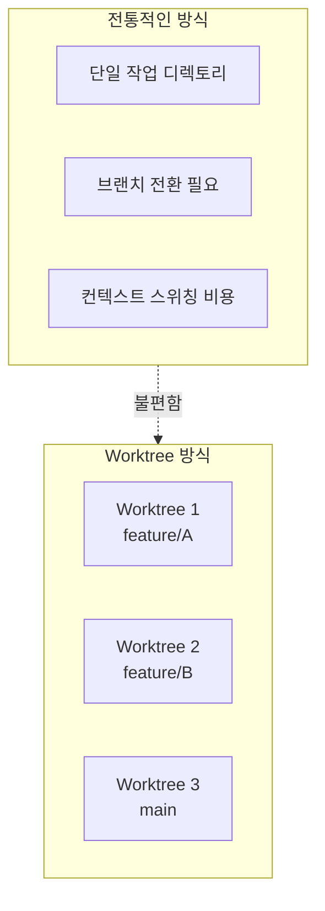
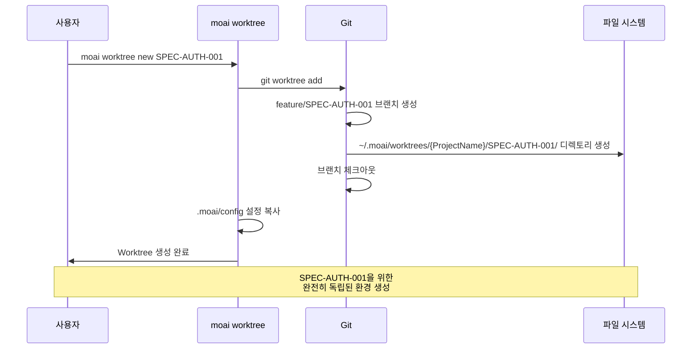
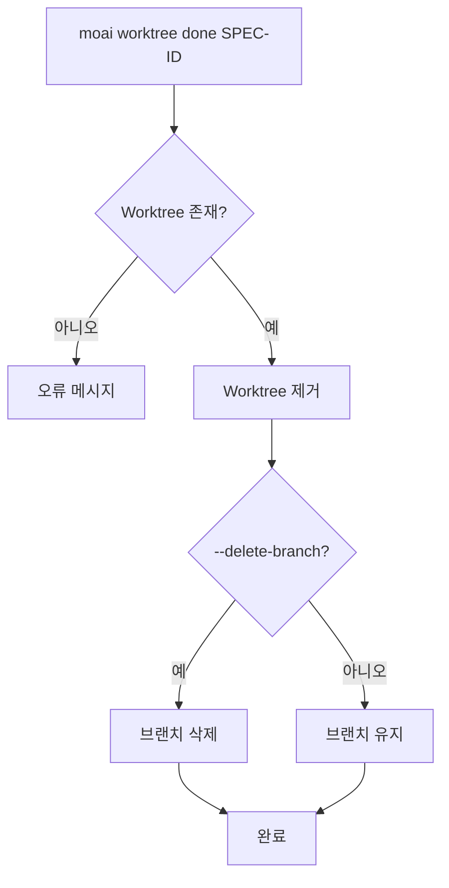
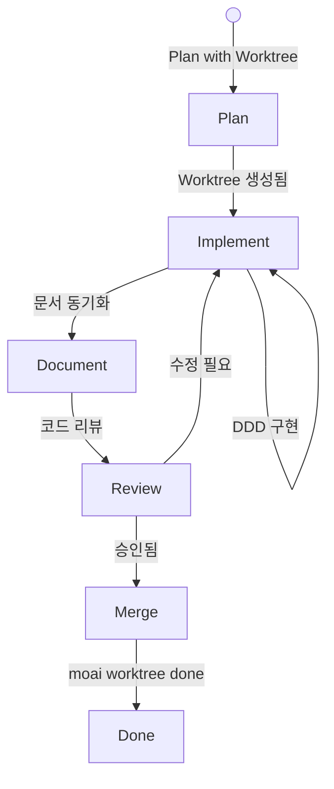
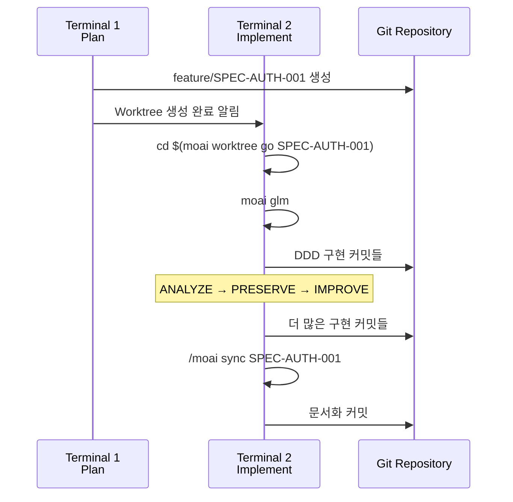
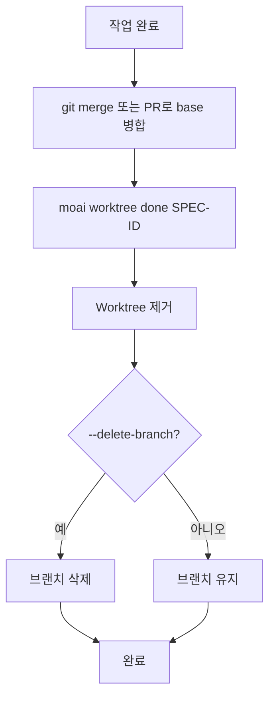
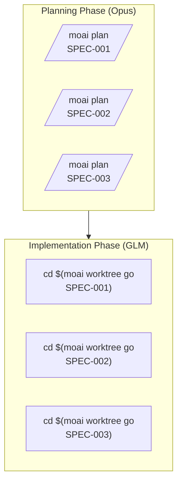
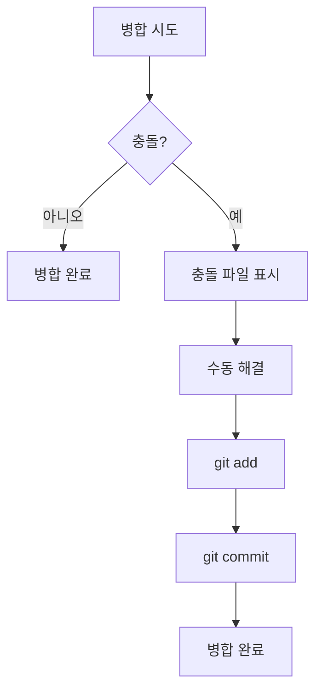
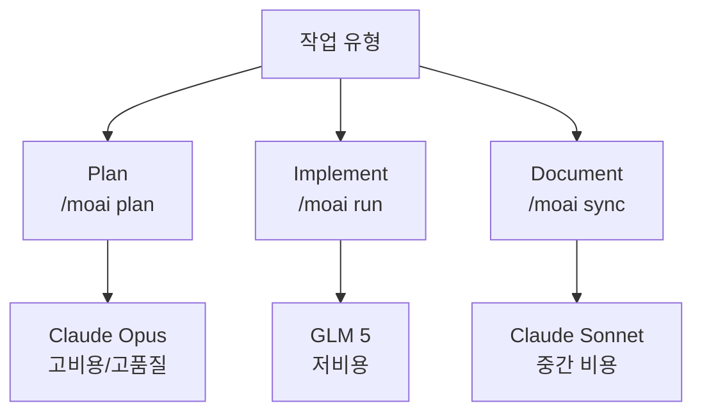

Git Worktree를 사용한 MoAI-ADK 병렬 개발의 모든 것 — 기초 개념부터 명령어
레퍼런스, 워크플로우, 모범 사례까지 이 문서 한 편으로 정리합니다.

## 목차

1. [Worktree 기초](#worktree-기초)
2. [명령어 상세 참조](#명령어-상세-참조)
3. [워크플로우 가이드](#워크플로우-가이드)
4. [고급 기능](#고급-기능)
5. [모범 사례](#모범-사례)

---

## Worktree 기초

### Git Worktree란 무엇인가요?

Git Worktree는 **하나의 Git 저장소를 여러 디렉토리에서 동시에 작업**할 수 있게
해주는 Git 내장 기능입니다. 브랜치를 오갈 때마다 `git checkout`으로 컨텍스트를
갈아끼우는 대신, 브랜치마다 디렉토리를 하나씩 열어둡니다.


```mermaid
graph TB
    subgraph Traditional["전통적인 방식"]
        T1[단일 작업 디렉토리]
        T2[브랜치 전환 필요]
        T3[컨텍스트 스위칭 비용]
    end

    subgraph Worktree["Worktree 방식"]
        W1[Worktree 1<br/>feature/A]
        W2[Worktree 2<br/>feature/B]
        W3[Worktree 3<br/>main]
    end

    Traditional -.->|불편함| Worktree
```

### MoAI-ADK에서의 Worktree

MoAI-ADK는 이 기능 위에 SPEC 단위의 격리 환경을 얹습니다. 각 SPEC이 완전히
독립된 환경을 갖기 때문에, 에이전트가 병렬로 일해도 서로의 작업을 밟지
않습니다:

- **독립적인 Git 상태** — 각 Worktree는 자체 브랜치와 커밋 이력을 유지합니다
- **분리된 LLM 설정** — Worktree마다 다른 LLM 실행 모드를 쓸 수 있습니다.
  계획에는 Claude, 구현에는 GLM을 배정하는 토크노믹스 운용이 여기서 나옵니다
- **격리된 작업 공간** — 파일 시스템 레벨에서 완전히 분리됩니다

---

## 명령어 상세 참조

### moai worktree new

새로운 Worktree를 생성합니다.

#### 문법

```bash
moai worktree new SPEC-ID [options]
```

#### 매개변수

- **SPEC-ID** (필수): 생성할 SPEC의 ID (예: `SPEC-AUTH-001`)

#### 옵션

- `--path PATH`: Worktree 경로 직접 지정 (기본값: SPEC ID면 `~/.moai/worktrees/<ProjectName>/<SPEC-ID>`, 그 외는 `../<branch-name>`)
- `--base BRANCH`: 기준 브랜치 (기본값: `origin/main`, 자동 fetch). 로컬 전용 커밋에는 `--base main` 사용
- `--from-current`: 현재 HEAD를 기준으로 사용 (`git fetch origin main`을 건너뜀, `--base`와 상호 배타)
- `--tmux`: Worktree 생성 후 tmux 세션 생성
- `--team`: 새 Worktree에서 Claude/GLM 세션 자동 실행

#### 사용 예시

```bash
# 기본 사용법 (origin/main 기준)
moai worktree new SPEC-AUTH-001

# 로컬 main 기준으로 생성
moai worktree new SPEC-AUTH-001 --base main

# 현재 HEAD 기준으로 생성
moai worktree new SPEC-AUTH-001 --from-current

# tmux 세션과 함께 생성
moai worktree new SPEC-AUTH-001 --tmux
```

#### 동작 과정


```mermaid
sequenceDiagram
    participant User as 사용자
    participant CLI as moai worktree
    participant Git as Git
    participant FS as 파일 시스템

    User->>CLI: moai worktree new SPEC-AUTH-001
    CLI->>Git: git worktree add
    Git->>Git: feature/SPEC-AUTH-001 브랜치 생성
    Git->>FS: ~/.moai/worktrees/{ProjectName}/SPEC-AUTH-001/ 디렉토리 생성
    Git->>Git: 브랜치 체크아웃
    CLI->>CLI: .moai/config 설정 복사
    CLI->>User: Worktree 생성 완료

    Note over User,FS: SPEC-AUTH-001을 위한<br/>완전히 독립된 환경 생성
```

---

### moai worktree go

Worktree 경로를 출력합니다. 셸에서 이동할 때 쓰도록 경로 문자열만 표준
출력으로 내보내고, 셸 세션 자체는 띄우지 않습니다. 셸의 `cd`와 함께
사용합니다.

#### 문법

```bash
moai worktree go SPEC-ID
```

#### 매개변수

- **SPEC-ID** (필수): 경로를 출력할 Worktree의 ID

#### 사용 예시

```bash
# 경로만 출력
moai worktree go SPEC-AUTH-001

# 출력된 경로로 이동
cd "$(moai worktree go SPEC-AUTH-001)"

# 이동 후 개발 시작
moai glm
claude
> /moai run SPEC-AUTH-001
```

#### 동작 과정

```mermaid
flowchart TD
    A[moai worktree go SPEC-ID] --> B{Worktree 존재?}
    B -->|아니오| C[오류 메시지]
    B -->|예| D[Worktree 경로를 stdout에 출력]
    D --> E["cd \"$(...)\" 등 셸에서 활용"]
```

---

### moai worktree list

모든 Worktree의 목록을 표시합니다.

#### 문법

```bash
moai worktree list [options]
```

#### 옵션

- `-v, --verbose`: 각 Worktree의 상세 정보 포함

#### 사용 예시

```bash
# 기본 목록
moai worktree list

# 상세 정보
moai worktree list --verbose

# 출력 예시
SPEC-AUTH-001  feature/SPEC-AUTH-001  ~/.moai/worktrees/your-project/SPEC-AUTH-001  [active]
SPEC-AUTH-002  feature/SPEC-AUTH-002  ~/.moai/worktrees/your-project/SPEC-AUTH-002
SPEC-AUTH-003  feature/SPEC-AUTH-003  ~/.moai/worktrees/your-project/SPEC-AUTH-003
```

---

### moai worktree done

Worktree를 제거하고 선택적으로 브랜치를 삭제합니다. **병합·푸시는
수행하지 않습니다** — base 브랜치로의 병합은 `git merge`나 PR로 별도로
진행합니다.

#### 문법

```bash
moai worktree done SPEC-ID [options]
```

#### 매개변수

- **SPEC-ID** (필수): 완료할 Worktree의 ID

#### 옵션

- `--force`: 커밋되지 않은 변경이 있어도 강제 제거
- `--delete-branch`: Worktree 제거 후 브랜치도 삭제
- `--auto`: 자동화용 무출력 모드 (예: PR 머지 이후 정리)

#### 사용 예시

```bash
# Worktree 제거
moai worktree done SPEC-AUTH-001

# Worktree 제거 + 브랜치 삭제
moai worktree done SPEC-AUTH-001 --delete-branch

# PR 머지 후 자동 정리 (무출력)
moai worktree done SPEC-AUTH-001 --auto
```

#### 동작 과정


```mermaid
flowchart TD
    A[moai worktree done SPEC-ID] --> B{Worktree 존재?}
    B -->|아니오| C[오류 메시지]
    B -->|예| D[Worktree 제거]
    D --> E{--delete-branch?}
    E -->|예| F[브랜치 삭제]
    E -->|아니오| G[브랜치 유지]
    F --> H[완료]
    G --> H[완료]
```

---

### moai worktree remove

Worktree를 제거합니다 (병합 없음). 브랜치는 유지됩니다.

#### 문법

```bash
moai worktree remove PATH [options]
```

#### 매개변수

- **PATH** (필수): 제거할 Worktree의 경로

#### 옵션

- `--force`: 커밋되지 않은 변경이 있어도 강제 제거

#### 사용 예시

```bash
# 기본 제거
moai worktree remove ~/.moai/worktrees/your-project/SPEC-AUTH-001

# 강제 제거
moai worktree remove ~/.moai/worktrees/your-project/SPEC-AUTH-001 --force
```

---

### moai worktree status

Worktree의 상태를 확인합니다.

#### 문법

```bash
moai worktree status [options]
```

#### 옵션

- `--all`: 전체 커밋 해시를 포함한 모든 상세 정보 표시

#### 사용 예시

```bash
# Worktree 상태
moai worktree status

# 전체 상세 정보
moai worktree status --all

# 출력 예시 (rounded-border 카드; status는 stale 참조를 자동 prune 후 표시)
╭─ Worktree Status ────────────────────────────────────────────╮
│ Repository: /path/to/your-project                            │
│ Total worktrees: 1                                           │
│                                                              │
│ feature/SPEC-AUTH-001                                        │
│   Path: ~/.moai/worktrees/your-project/SPEC-AUTH-001         │
│   HEAD: 4f3a2b1c                                             │
╰──────────────────────────────────────────────────────────────╯
```

---

### moai worktree clean

병합되거나 완료된 Worktree를 정리합니다.

#### 문법

```bash
moai worktree clean [options]
```

#### 옵션

- `--merged-only`: 브랜치가 base에 병합된 Worktree만 제거
- `--base BRANCH`: `--merged-only` 판정에 쓸 base 브랜치 (기본값: `main`)

#### 사용 예시

```bash
# 병합된 Worktree 정리 (base=main)
moai worktree clean --merged-only

# 다른 base 브랜치 기준으로 정리
moai worktree clean --merged-only --base develop
```

---

### moai worktree config

Worktree 설정을 표시합니다. 설정 값은 Git 저장소에서 파생되므로 **읽기 전용**
입니다 (`config set`은 지원되지 않습니다).

#### 문법

```bash
moai worktree config [key]
```

#### 매개변수

- **key** (선택): 표시할 설정 키. 사용 가능한 키는 `root` (저장소 루트),
  `all` (전체 설정, 기본값)

#### 사용 예시

```bash
# 모든 설정 표시
moai worktree config
# Worktree Configuration:
#   root: /path/to/your-project

# 특정 설정 확인
moai worktree config root
# Worktree root: /path/to/your-project
```

---

### moai worktree sync

Worktree를 base 브랜치의 변경 사항과 동기화합니다.

```bash
# 현재 디렉토리 Worktree를 main과 동기화 (merge 전략, 기본)
moai worktree sync

# 특정 Worktree를 rebase 전략으로 동기화
moai worktree sync SPEC-AUTH-001 --strategy rebase

# 다른 base 브랜치 기준
moai worktree sync SPEC-AUTH-001 --base develop
```

옵션: `--base` (기준 브랜치, 기본 `main`), `--strategy` (`merge` 또는 `rebase`,
기본 `merge`).

---

### moai worktree switch

주어진 브랜치에 연결된 Worktree 디렉토리로 전환합니다.

```bash
moai worktree switch SPEC-AUTH-001
```

경로만 출력하는 `go`와 달리 `switch`는 브랜치 이름으로 Worktree를 찾아 이동
안내를 제공합니다.

---

### moai worktree recover

디스크를 스캔하고 `git worktree repair`를 실행해 손상된 Worktree 레지스트리를
복구합니다.

```bash
moai worktree recover
```

---

### moai worktree clean vs recover vs 상태 가드

`clean`은 stale 참조를 정리하고, `recover`는 레지스트리를 복구합니다. 아래 세
명령은 오케스트레이터가 `Agent(isolation: "worktree")` 호출 전후로 작업 트리
상태를 스냅샷·검증·복원하는 상태 가드 프리미티브입니다.

#### moai worktree snapshot

HEAD·브랜치·porcelain·`.moai/specs/` 하위 untracked 파일 상태를 캡처해
`.moai/state/`에 JSON으로 기록합니다.

```bash
moai worktree snapshot --agent-name my-agent --out .moai/state/snap.json
```

#### moai worktree verify

현재 작업 트리를 스냅샷과 비교합니다. 종료 코드: `0`=clean, `1`=divergence,
`2`=suspect(빈 worktreePath), `3`=둘 다.

```bash
moai worktree verify --snapshot .moai/state/snap.json --agent-name my-agent
```

#### moai worktree restore

`git restore --source=<snapshot HEAD> --staged --worktree :/`를 실행해 작업
트리를 스냅샷 HEAD 상태로 복원합니다. Untracked 파일은 git에서 복원되지
않으므로 경로만 안내하고 수동 재생성이 필요합니다.

```bash
moai worktree restore --snapshot .moai/state/snap.json

# 실행 없이 명령만 출력
moai worktree restore --snapshot .moai/state/snap.json --dry-run
```

---

## 워크플로우 가이드

### 완전한 개발 사이클


```mermaid
flowchart TD
    Start(( )) -->|"Plan with Worktree"| Plan["Plan"]
    Plan -->|"Worktree 생성됨"| Implement["Implement"]
    Implement -->|"DDD 구현"| Implement
    Implement -->|"문서 동기화"| Document["Document"]
    Document -->|"코드 리뷰"| Review["Review"]
    Review -->|"승인됨"| Merge["Merge"]
    Review -->|"수정 필요"| Implement
    Merge -->|"moai worktree done"| Done["Done"]
```

### 1단계: SPEC 계획 (Phase 1)

```bash
# Terminal 1에서
> /moai plan "사용자 인증 시스템 구현" --worktree
```

**출력**:

```
✓ SPEC 문서 생성: .moai/specs/SPEC-AUTH-001/spec.md
✓ Worktree 생성: ~/.moai/worktrees/{ProjectName}/SPEC-AUTH-001
✓ 브랜치 생성: feature/SPEC-AUTH-001
✓ 브랜치 전환 완료

다음 단계:
1. 새 터미널에서 실행: cd "$(moai worktree go SPEC-AUTH-001)"
2. LLM 변경: moai glm
3. 개발 시작: claude
```

### 2단계: 구현 (Phase 2)

```bash
# Terminal 2에서 (moai worktree go는 경로를 출력 → cd로 이동)
cd "$(moai worktree go SPEC-AUTH-001)"

# Worktree로 이동한 뒤 LLM 백엔드 전환
$ moai glm

$ claude
> /moai run SPEC-AUTH-001
```

**작업 흐름**:


```mermaid
sequenceDiagram
    participant T1 as Terminal 1<br/>Plan
    participant T2 as Terminal 2<br/>Implement
    participant Git as Git Repository

    T1->>Git: feature/SPEC-AUTH-001 생성
    T1->>T2: Worktree 생성 완료 알림

    T2->>T2: cd $(moai worktree go SPEC-AUTH-001)
    T2->>T2: moai glm
    T2->>Git: DDD 구현 커밋들
    Note over T2: ANALYZE → PRESERVE → IMPROVE

    T2->>Git: 더 많은 구현 커밋들
    T2->>T2: /moai sync SPEC-AUTH-001
    T2->>Git: 문서화 커밋
```

### 3단계: 완료 및 병합 (Phase 3)

```bash
# Terminal 2에서 작업 완료 후 (push는 별도로 git/PR로 진행)
exit

# base 브랜치 병합은 git merge 또는 PR로 처리한 뒤,
# Terminal 1에서 Worktree 정리
moai worktree done SPEC-AUTH-001 --delete-branch
```

**프로세스**:


```mermaid
flowchart TD
    A[작업 완료] --> B[git merge 또는 PR로 base 병합]
    B --> C[moai worktree done SPEC-ID]
    C --> D[Worktree 제거]
    D --> E{--delete-branch?}
    E -->|예| F[브랜치 삭제]
    E -->|아니오| G[브랜치 유지]
    F --> H[완료]
    G --> H[완료]
```

---

## 고급 기능

### 병렬 작업 전략

#### 전략 1: Plan과 Implement 분리

토크노믹스의 기본 전략입니다. 계획 단계는 고추론 모델(Opus)로 몰아서 처리하고,
구현 단계는 저비용 모델(GLM)로 병렬 분산합니다:


```mermaid
graph TB
    subgraph Planning["Planning Phase (Opus)"]
        P1[/moai plan<br/>SPEC-001/]
        P2[/moai plan<br/>SPEC-002/]
        P3[/moai plan<br/>SPEC-003/]
    end

    subgraph Implementation["Implementation Phase (GLM)"]
        I1["cd $(moai worktree go<br/>SPEC-001)"]
        I2["cd $(moai worktree go<br/>SPEC-002)"]
        I3["cd $(moai worktree go<br/>SPEC-003)"]
    end

    Planning --> Implementation
```

#### 전략 2: 동시 개발

```bash
# Terminal 1: SPEC-001 Plan
> /moai plan "인증" --worktree

# Terminal 2: SPEC-002 Plan (완료 후)
> /moai plan "로그" --worktree

# Terminal 3, 4, 5: 병렬 구현
cd "$(moai worktree go SPEC-001)" && moai glm  # Terminal 3
cd "$(moai worktree go SPEC-002)" && moai glm  # Terminal 4
cd "$(moai worktree go SPEC-003)" && moai glm  # Terminal 5
```

### Worktree 간 전환

```bash
# 현재 Worktree 확인
moai worktree status

# 다른 Worktree로 전환 (경로 출력 → cd)
cd "$(moai worktree go SPEC-AUTH-002)"

# 또는 직접 이동
cd ~/.moai/worktrees/your-project/SPEC-AUTH-002
```

### 충돌 해결


```mermaid
flowchart TD
    A[병합 시도] --> B{충돌?}
    B -->|아니오| C[병합 완료]
    B -->|예| D[충돌 파일 표시]
    D --> E[수동 해결]
    E --> F[git add]
    F --> G[git commit]
    G --> H[병합 완료]
```

---

## 모범 사례

### 1. Worktree 명명 규칙

```bash
# 좋은 예
moai worktree new SPEC-AUTH-001      # 명확한 SPEC ID
moai worktree new SPEC-FRONTEND-007  # 카테고리 포함

# 피해야 할 예
moai worktree new feature-branch     # SPEC ID 미사용
moai worktree new temp               # 모호한 이름
```

### 2. 정기적인 정리

```bash
# 병합된 Worktree 정기 정리
moai worktree clean --merged-only
```

### 3. LLM 선택 가이드

작업 단계별로 모델을 나눠 배정하는 것이 Worktree 토크노믹스의 핵심입니다:


```mermaid
graph TD
    A[작업 유형] --> B[Plan<br/>/moai plan]
    A --> C[Implement<br/>/moai run]
    A --> D[Document<br/>/moai sync]

    B --> E[Claude Opus<br/>고비용/고품질]
    C --> F[GLM 5<br/>저비용]
    D --> G[Claude Sonnet<br/>중간 비용]
```

### 4. 커밋 메시지 규칙

```bash
# Worktree에서 커밋할 때
git commit -m "feat(SPEC-AUTH-001): JWT 기반 인증 구현

- JWT 토큰 생성/검증 로직 추가
- 리프레시 토큰 로테이션 구현
- 로그아웃 시 토큰 무효화

Co-Authored-By: Claude <noreply@anthropic.com>"
```

### 5. 터미널 관리

```bash
# 각 Worktree에 별도 터미널 사용
# iTerm2, VS Code, 또는 tmux 사용 권장

# tmux 예시
tmux new-session -d -s spec-001 -c "$(moai worktree go SPEC-001)"
tmux new-session -d -s spec-002 -c "$(moai worktree go SPEC-002)"

# 세션 전환
tmux attach-session -t spec-001
```

### 6. 진행 상황 추적

```bash
# 모든 Worktree 상태 확인
moai worktree status --all

# Git 로그 확인
cd ~/.moai/worktrees/{ProjectName}/SPEC-AUTH-001
git log --oneline --graph --all

# 변경 사항 확인
git diff main
```

## tmux 통합과 자동 머지

### moai worktree new --tmux 플래그

tmux 세션을 자동으로 만들어 워크트리 안에서 격리된 채로 개발할 수 있게 합니다.

```bash
moai worktree new SPEC-AUTH-001 --tmux
```

**동작 흐름:**
1. Worktree 생성 (기존 동작)
2. tmux 세션 자동 생성 (이름: `moai-{ProjectName}-{SPEC-ID}`)
3. LLM 모드에 따라 환경 변수 주입 (GLM/CG 모드)
4. Worktree로 cd 후 `/moai run {SPEC-ID}` 실행

```bash
# tmux 세션 부착
tmux attach-session -t moai-my-project-SPEC-AUTH-001
```


tmux가 설치되지 않은 경우 graceful degradation: 수동 cd 안내 메시지가 표시됩니다.


### 실행 모드 선택 게이트 (Decision Point 3.5)

`/moai plan` 완료 후 Run 시작 전, 실행 모드를 자동 감지하고 사용자에게 선택을 요청합니다.

**tmux 사용 가능 시 (2가지 옵션):**
- Worktree + \{현재 모드\} (Recommended): 워크트리 + tmux 세션 생성 후 실행
- Sub-agent Mode: 순차 서브에이전트 실행

**tmux 사용 불가 시:**
- Sub-agent Mode (Recommended): 순차 서브에이전트 실행


정적 Agent Teams 오케스트레이션 레이어는 폐기되었습니다. 병렬 협업은 Claude
Code 네이티브 팀메이트 런타임 (`moai cg`의 GLM tmux 페인, CG 모드)으로
운용합니다 — 자세한 내용은 CG 모드 문서를 참고하세요.


### Auto-merge 기본 동작

워크트리 컨텍스트에서 `/moai sync`를 실행하면 auto-merge가 기본 동작입니다.

| 플래그 | 동작 |
|--------|------|
| (없음) | 워크트리 컨텍스트에서 자동 머지 |
| `--merge` | Deprecated (경고 표시) |
| `--skip-mx` | @MX 태그 스캔 단계 건너뛰기 |

### 포스트-머지 자동 클린업

PR 머지 성공 시 자동 정리:
- 워크트리 디렉토리 제거
- 피처 브랜치 삭제 (`--delete-branch`)
- 레지스트리 업데이트


클린업 실패는 머지 결과에 영향을 주지 않습니다. 실패 시 수동 정리: `moai worktree done SPEC-{ID}`


### 에러 핸들링 (errors.go)

구조화된 에러 타입과 복구 명령어를 제공합니다.

| 에러 타입 | 설명 | 복구 명령어 |
|-----------|------|-----------|
| `WorktreeCreateError` | Worktree 생성 실패 | `moai worktree new {SPEC-ID}` |
| `TmuxNotAvailableError` | tmux 사용 불가 | `cd {path} && /moai run {SPEC-ID}` |
| `AutoMergeBlockedError` | 자동 머지 차단 | `/moai sync {SPEC-ID}` |
| `CleanupFailedError` | 정리 실패 | `moai worktree done {SPEC-ID}` |

## 관련 문서

- [Git Worktree 개요](/ko/worktree/)
- [실제 사용 예시](/ko/worktree/examples)
- [자주 묻는 질문](/ko/worktree/faq)
