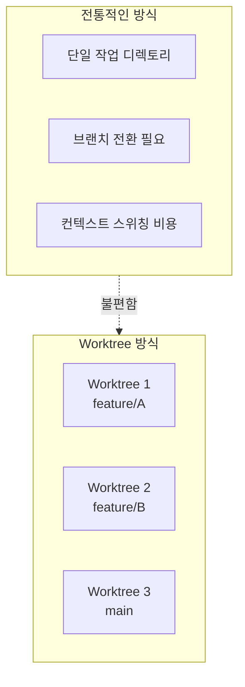
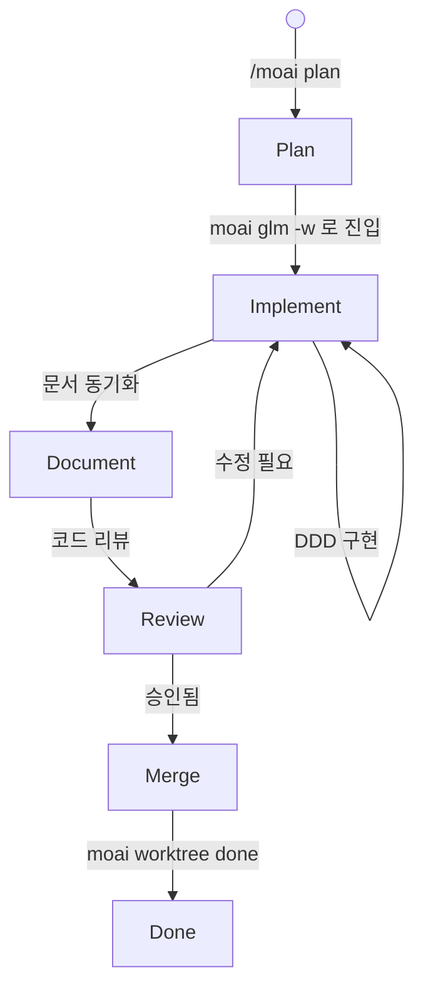
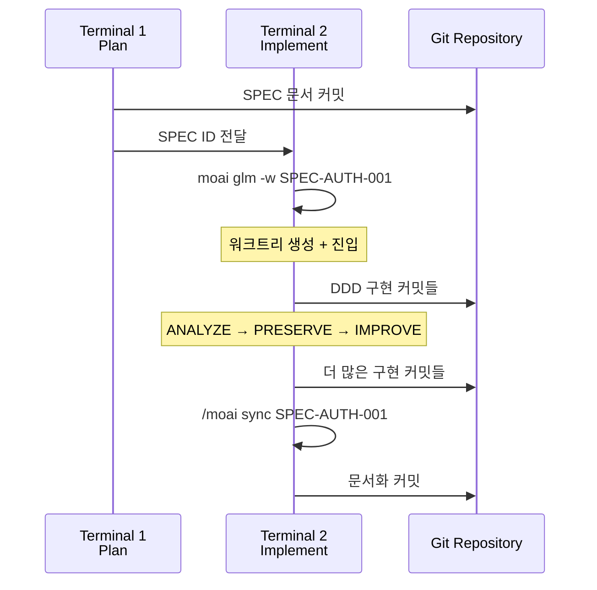
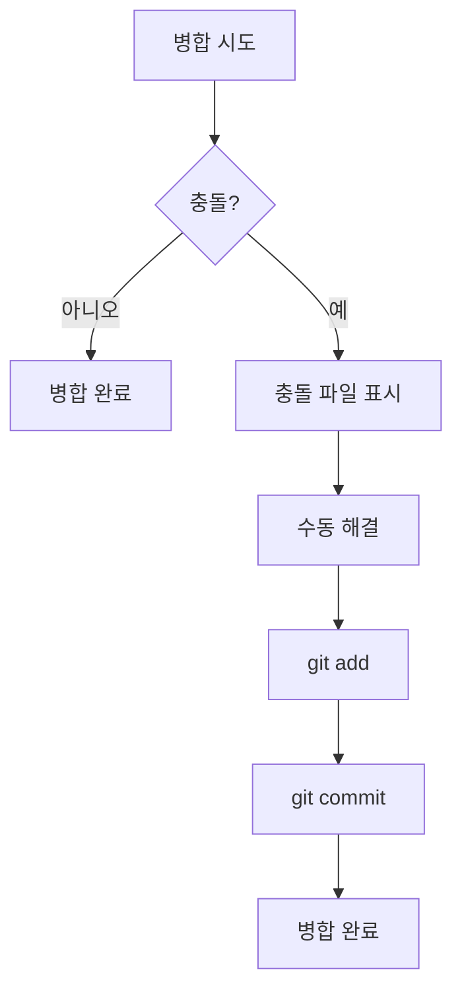
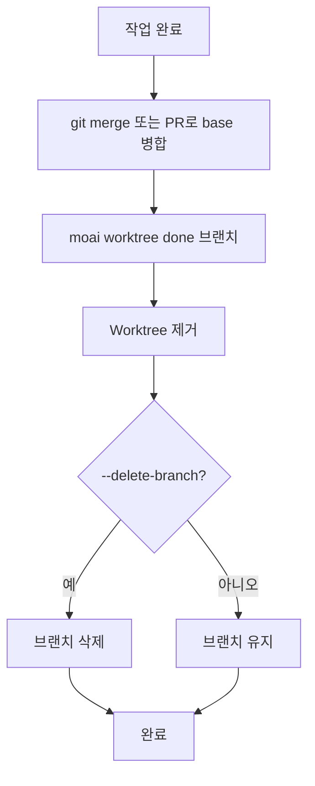
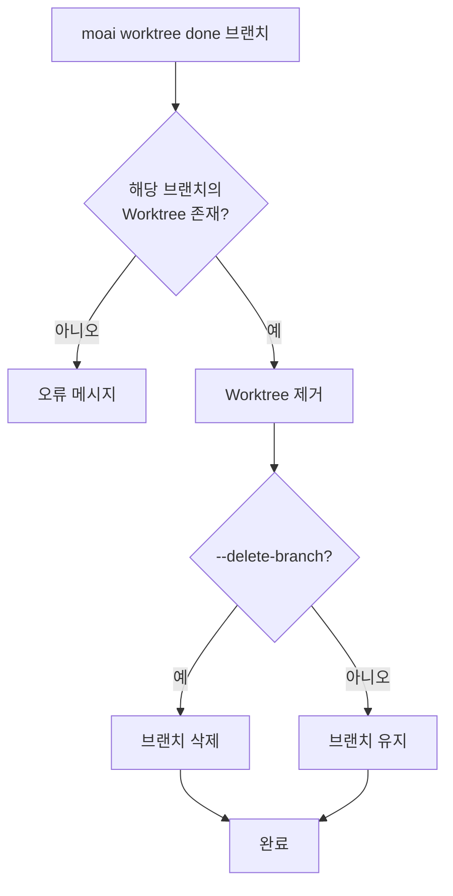
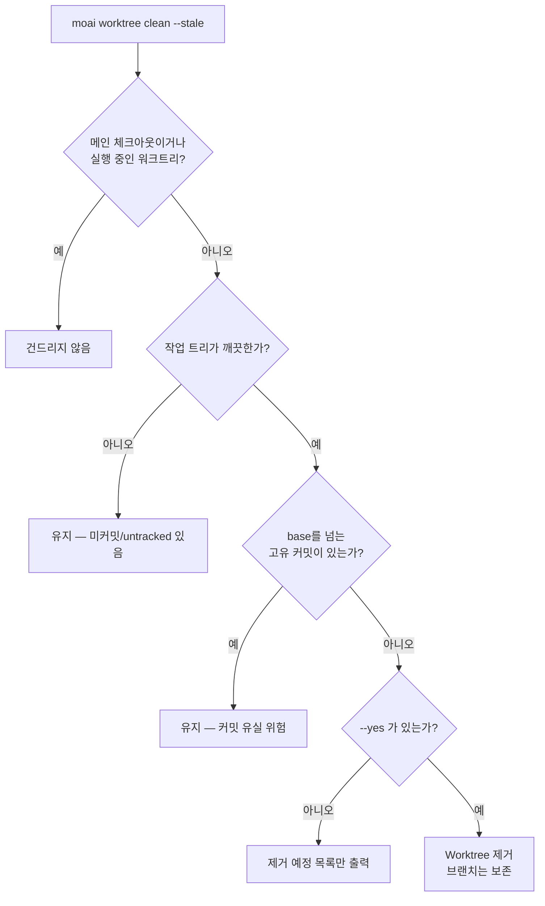
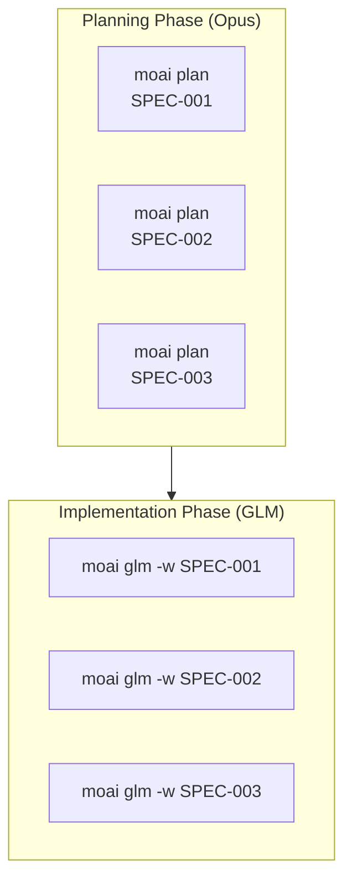
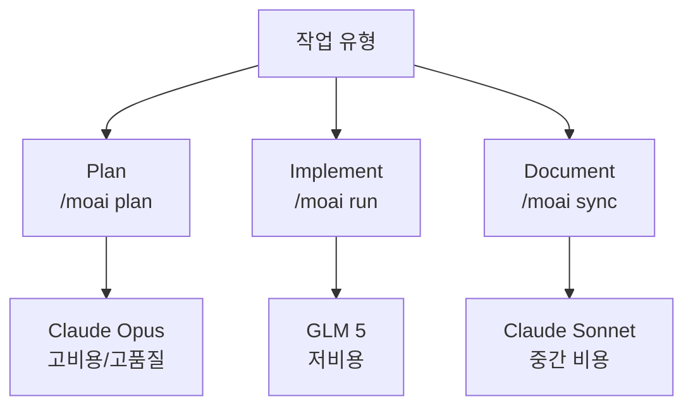

Git Worktree(작업 트리)는 **하나의 Git 저장소를 여러 폴더에서 동시에 다룰 수
있게 해주는 Git 내장 기능**입니다. 브랜치(독립된 변경 이력 줄기)를 바꿀 때마다
`git checkout`으로 현재 폴더의 내용을 통째로 갈아끼우는 대신, 브랜치마다 폴더를
하나씩 열어둡니다.

비유하자면 원본 책 한 권을 두고, 읽고 싶은 장마다 책상을 따로 펼쳐놓는 것과
같습니다. 책상이 여러 개여도 원본은 한 권이므로, 어느 책상에서 글을 적더라도 모두
같은 책에 기록됩니다. Git Worktree도 폴더가 여러 개여도 역사를 저장하는 `.git`은
하나뿐이라, 어떤 폴더에서 커밋(변경 이력의 한 점)하든 같은 저장소에 쌓입니다.

MoAI-ADK는 이 기능 위에 **SPEC(단위 작업 명세서) 단위의 격리 환경**을 얹습니다.
작업마다 폴더가 완전히 갈라지므로, 여러 에이전트(스스로 일을 수행하는 AI)가 동시에
움직여도 서로의 파일을 덮어쓰지 않습니다. 덕분에 계획은 추론이 강한 모델에 맡기고
구현은 가격이 낮은 모델에 맡기는 단계별 모델 배정, 즉 토크노믹스(토큰 비용을
효율적으로 나누어 쓰는 운용)가 자연스럽게 가능해집니다.

이 페이지는 워크트리를 처음 쓰는 분도 따라할 수 있도록, 워크트리가 무엇인지
생각하는 법부터 시작해 생성 → 진입 → 작업 → 병합 → 정리까지의 전 과정을
단계별로 짚어줍니다. 뒤쪽에는 모든 플래그를 모아둔 명령어 상세 참조가 있어, 익숙해진 뒤에는 찾아보기 도구로 쓸 수 있습니다.

## Worktree, 왜 MoAI에서 쓰나요?

전통적인 방식에서는 폴더가 하나뿐이라, 브랜치를 바꿀 때마다 작업 중이던 파일을
잠시 치워야 합니다. 워크트리는 브랜치마다 폴더를 하나씩 만들어 이 부담을 없앱니다.


```mermaid
graph TD
    subgraph Traditional["전통적인 방식"]
        T1[단일 작업 디렉토리]
        T2[브랜치 전환 필요]
        T3[컨텍스트 스위칭 비용]
    end

    subgraph Worktree["Worktree 방식"]
        W1[Worktree 1<br/>feature/A]
        W2[Worktree 2<br/>feature/B]
        W3[Worktree 3<br/>main]
    end

    Traditional -.->|불편함| Worktree
```

MoAI-ADK는 워크트리를 SPEC 단위로 한 겹 더 감쌉니다. SPEC마다 환경이 완전히
갈라지므로, 에이전트가 병렬로 움직여도 서로의 작업을 덮어쓰지 않습니다.

- **독립적인 Git 상태** — Worktree마다 자체 브랜치와 커밋 이력이 따로 쌓입니다
- **분리된 LLM 설정** — Worktree마다 다른 LLM(대형 언어 모델) 실행 모드를 쓸 수
  있습니다. 계획에는 Claude, 구현에는 GLM을 배정하는 토크노믹스 운용이 여기서
  나옵니다
- **격리된 작업 공간** — 파일 시스템 수준에서 완전히 갈라집니다

### 역할 분담: 진입은 런처, 관리는 worktree, 조회는 git

워크트리를 다루는 일은 세 가지로 나뉩니다. 처음에 이 경계를 잡아 두면 나머지가
쉽게 읽힙니다. MoAI는 일부러 "만들기"와 "정리하기"를 서로 다른 명령어에
나누어두었습니다. 그래서 만드는 일은 런처에, 정리·동기화·복구는 `moai worktree`
하위 명령어에 맡겨, 각 명령어가 한 가지 역할만 담당하게 했습니다.

| 하려는 일 | 담당 |
|-----------|------|
| Worktree 만들기 · 들어가기 | 런처 `moai cc` · `moai glm` · `moai cg` 의 `-w` 플래그 |
| Worktree 목록 보기 | `git worktree list` |
| 동기화 · 정리 · 복구 · 상태 가드 | `moai worktree` (별칭 `moai wt`) 하위 명령어 |

## 전체 개발 흐름 한눈에 보기

워크트리를 포함한 한 번의 개발 사이클은 대략 이렇게 흘러갑니다. 계획은 메인
체크아웃(원본 폴더)에서 세우고, 구현은 워크트리에 들어가서 하고, 다 쓰고 나면
정리합니다. 아래 단계들이 이 흐름의 각 마디에 해당합니다.


```mermaid
flowchart TD
    Start(( )) -->|"/moai plan"| Plan["Plan"]
    Plan -->|"moai glm -w 로 진입"| Implement["Implement"]
    Implement -->|"DDD 구현"| Implement
    Implement -->|"문서 동기화"| Document["Document"]
    Document -->|"코드 리뷰"| Review["Review"]
    Review -->|"승인됨"| Merge["Merge"]
    Review -->|"수정 필요"| Implement
    Merge -->|"moai worktree done"| Done["Done"]
```

## Step 1 — 워크트리를 만들고 진입하기

워크트리는 생각보다 단순합니다. 평소 쓰던 런처 명령어에 `-w` 플래그만 붙이면,
워크트리가 없으면 새로 만들고, 있으면 그대로 들어가 세션까지 띄워줍니다. 핵심은
"만드는 명령어가 따로 없다"는 점입니다. `moai worktree`에는 생성 명령이 없고,
런처의 `-w` 플래그가 생성과 진입을 한 번에 처리합니다.

### 문법

```bash
moai cc  -w [이름] [--spawn]
moai glm -w [이름] [--spawn]
moai cg  -w [이름] [--spawn]
```

#### `-w` 값이 해석되는 방식

`-w`에 무엇을 넣느냐에 따라 동작이 세 가지로 갈립니다. 처음에는 "짧은 이름을
주면 된다"만 기억해도 충분합니다. 나머지 두 가지는 이전에 만들어둔 워크트리에
다시 들어가거나, 이름을 자동으로 지을 때 쓰입니다.

- **짧은 이름** (`feat-auth`) — `.claude/worktrees/feat-auth/` 아래에서
  해석됩니다. 없으면 새로 만들어집니다
- **절대 경로** — `~/.moai/worktrees/` 또는 `<프로젝트>/.claude/worktrees/`
  아래의 기존 워크트리로 다시 들어갑니다
- **값 생략** (`-w` 만) — 이름이 자동으로 지어집니다
- 위 두 접두어 밖의 절대 경로는 거부됩니다. 실수로 엉뚱한 위치에 워크트리가
  생기는 것을 막기 위해서입니다

#### `--spawn`: 현재 세션을 지키면서 하나 더 열기

`-w`만 주면 현재 프로세스가 워크트리 세션으로 **교체**됩니다. 지금 창을 그대로 두고
워크트리를 하나 더 열려면 `--spawn`을 붙입니다. tmux 새 창이 뜨고(포커스는
그대로), 이동할 pane ID가 출력됩니다. 한 터미널 안에서 여러 워크트리를 돌릴 때
필요한 스위치입니다.

`--spawn`은 tmux 세션 안에서만 동작합니다. tmux 밖에서 쓰면 아무것도 바꾸지 않고
오류로 끝냅니다.

#### 사용 예시

```bash
# 워크트리를 만들면서 Claude 백엔드로 진입
moai cc -w feat-auth

# 같은 워크트리를 GLM 백엔드로 진입
moai glm -w feat-auth

# 현재 세션 유지 + 새 tmux 창에 GLM 팀원 띄우기
moai cg -w feat-auth --spawn

# 임의 위치에 워크트리를 직접 만들고 싶다면 git 을 그대로 사용
git worktree add -b feature/SPEC-AUTH-001 \
    ~/.moai/worktrees/your-project/SPEC-AUTH-001 origin/main
moai glm -w ~/.moai/worktrees/your-project/SPEC-AUTH-001
```

#### 목록 확인

어떤 워크트리가 있는지, 각각 어느 브랜치를 가리키는지 한눈에 보려면 `git worktree
list`를 칩니다. MoAI가 아닌 Git 자체 명령어라, 워크트리를 만든 뒤에는 언제든 이
한 줄로 현재 상태를 점검할 수 있습니다.

```bash
git worktree list
```

## Step 2 — 워크트리 안에서 작업하기

워크트리에 들어왔다면, 그 다음은 평소와 같은 개발입니다. 폴더가 갈라져 있을 뿐,
안에서는 보통의 Git 작업 흐름을 그대로 따릅니다. 커밋을 쌓고, 브랜치 위에서
작업하고, 필요하면 동기화(Step 3)와 정리(Step 4)로 넘어갑니다. 한 가지 짚고 갈
것은, 이 안에서 일어나는 모든 변화는 "이 브랜치의 이야기"로 기록된다는 점입니다.
그래서 다른 워크트리의 작업과 섞이지 않습니다.

구현 예시로, SPEC 하나를 워크트리에 들어가서 진행하는 흐름을 보겠습니다. 터미널을
하나 더 열어 워크트리를 만들면서 GLM 백엔드로 진입하고, 그 안에서 곧바로 run
단계로 넘어갑니다.

```bash
# Terminal 2에서 — 워크트리를 만들면서 GLM 백엔드로 진입
$ moai glm -w SPEC-AUTH-001

# 진입한 세션에서 바로 실행
> /moai run SPEC-AUTH-001
```

두 터미널이 SPEC ID를 주고받으며 어떻게 엮이는지는 아래 순서도에 나와 있습니다.
계획 터미널이 SPEC 문서를 커밋하면, 구현 터미널이 그 SPEC ID를 받아 워크트리를
만들고 구현 커밋을 쌓은 뒤 문서화까지 마무리합니다.


```mermaid
sequenceDiagram
    participant T1 as Terminal 1<br/>Plan
    participant T2 as Terminal 2<br/>Implement
    participant Git as Git Repository

    T1->>Git: SPEC 문서 커밋
    T1->>T2: SPEC ID 전달

    T2->>T2: moai glm -w SPEC-AUTH-001
    Note over T2: 워크트리 생성 + 진입
    T2->>Git: DDD 구현 커밋들
    Note over T2: ANALYZE → PRESERVE → IMPROVE

    T2->>Git: 더 많은 구현 커밋들
    T2->>T2: /moai sync SPEC-AUTH-001
    T2->>Git: 문서화 커밋
```

## Step 3 — base 브랜치와 동기화하고 병합하기

작업이 어느 정도 쌓이면 두 가지 일이 필요해집니다. 하나는 base 브랜치(병합의
기준이 되는 중심 브랜치, 보통 `main`)의 최신 변경을 워크트리로 당겨오는 것이고,
다른 하나는 반대로 워크트리의 작업을 base 브랜치로 올리는 것입니다. MoAI는
당겨오는 쪽을 `moai worktree sync`로, 올리는 쪽은 `git merge`나 PR(병합 요청)로
나누어 다룹니다. 그래서 동기화는 자동으로, 병합은 사람이 확인하며 진행하게
했습니다.

병합 때 충돌이 나면 당황하지 말고 아래 흐름을 따라가면 됩니다. 충돌은 같은 줄을
두 번 고쳤을 때 일어나는, 자연스러운 신호일 뿐입니다.


```mermaid
flowchart TD
    A[병합 시도] --> B{충돌?}
    B -->|아니오| C[병합 완료]
    B -->|예| D[충돌 파일 표시]
    D --> E[수동 해결]
    E --> F[git add]
    F --> G[git commit]
    G --> H[병합 완료]
```

기본 동기화 명령은 한 줄입니다. 현재 워크트리를 `main` 기준으로 맞출 때 아래처럼
칩니다. 모든 플래그와 전략 옵션은 [명령어 상세 참조](#명령어-상세-참조)의
`moai worktree sync` 항목에 정리해두었습니다.

```bash
# 현재 디렉토리 Worktree를 main과 동기화 (merge 전략, 기본)
moai worktree sync
```

작업을 base에 올리는 병합은 워크트리 밖에서 처리합니다. 워크트리를 나와 base
브랜치로 돌아간 뒤, `git merge`로 합치거나 PR을 엽니다. 아래 순서도가 "작업 완료
→ base 병합 → 워크트리 정리"까지의 한 흐름을 보여줍니다. 병합이 끝나면 자연스럽게
Step 4의 정리로 이어집니다.


```mermaid
flowchart TD
    A[작업 완료] --> B[git merge 또는 PR로 base 병합]
    B --> C[moai worktree done 브랜치]
    C --> D[Worktree 제거]
    D --> E{--delete-branch?}
    E -->|예| F[브랜치 삭제]
    E -->|아니오| G[브랜치 유지]
    F --> H[완료]
    G --> H[완료]
```

## Step 4 — 워크트리 정리하기

병합까지 끝났으면 워크트리를 정리합니다. MoAI는 정리 명령 세 개를 상황에 따라
나누어두었습니다. 하나는 브랜치 이름으로 지우는 `done`, 하나는 폴더 경로로 지우는
`remove`, 하나는 더 이상 필요 없는 워크트리를 한꺼번에 쓸어 담는 `clean`입니다.
이 중 `done`을 가장 자주 쓰게 됩니다. 주의할 점이 하나 있습니다. 정리 명령은
**병합도 푸시(원격 저장소로 올리기)도 하지 않습니다**. base 브랜치에 병합하는 일은
`git merge`나 PR로 따로 진행하세요. 그래서 "병합 → 정리" 순서를 반드시 지켜야,
커밋이 사라지는 일이 없습니다.

브랜치 이름으로 워크트리를 지우고, 필요하면 브랜치까지 삭제합니다.

```bash
# Worktree 제거
moai worktree done feature/SPEC-AUTH-001

# Worktree 제거 + 브랜치 삭제
moai worktree done feature/SPEC-AUTH-001 --delete-branch
```

쌓여있는 워크트리를 한꺼번에 정리할 때는 `clean`을 씁니다. 병합된 것만 지우거나,
방치된 것을 미리보기로 살펴볼 수 있습니다. `--stale`의 안전 규칙과 흐름도는
[명령어 상세 참조](#moai-worktree-clean)에 자세히 적어두었습니다.

```bash
# 병합된 Worktree 정리 (base=main)
moai worktree clean --merged-only

# 방치된 Worktree 미리보기 — 아무것도 지우지 않음
moai worktree clean --stale

# 미리보기 내용을 확인한 뒤 실제 제거
moai worktree clean --stale --yes
```

## 명령어 상세 참조

앞의 단계에서는 기본 흐름만 짚었습니다. 이 절에서는 모든 플래그와 옵션, 안전
규칙을 모아둡니다. 익숙해진 뒤에는 찾아보기 용도로 쓰세요.

### moai worktree sync

Worktree를 base 브랜치의 변경 사항과 동기화합니다.

#### 문법

```bash
moai worktree sync [branch-name]
```

#### 매개변수

- **branch-name** (선택): 동기화할 워크트리의 브랜치. 생략하면 현재 디렉터리의
  워크트리를 대상으로 합니다

#### 옵션

- `--base BRANCH`: 기준 브랜치 (기본값: `main`)
- `--strategy MODE`: `merge` (기본값) 또는 `rebase`

#### 사용 예시

```bash
# 현재 디렉토리 Worktree를 main과 동기화 (merge 전략, 기본)
moai worktree sync

# 특정 Worktree를 rebase 전략으로 동기화
moai worktree sync feature/SPEC-AUTH-001 --strategy rebase

# 다른 base 브랜치 기준
moai worktree sync feature/SPEC-AUTH-001 --base develop
```

### moai worktree done

브랜치에 딸린 Worktree를 지우고, 원하면 브랜치까지 삭제합니다. 다만 **병합도
푸시도 하지 않습니다**. base 브랜치에 병합하는 일은 `git merge`나 PR로 따로
진행하세요.

#### 문법

```bash
moai worktree done <branch-name>
```

#### 매개변수

- **branch-name** (필수, 정확히 한 개): 정리할 워크트리의 브랜치 이름.
  `SPEC-AUTH-001` 같은 SPEC ID 형태를 주면 `feature/SPEC-AUTH-001` 로 풀립니다

#### 옵션

- `--force`: 커밋되지 않은 변경이 있어도 강제 제거
- `--delete-branch`: Worktree 제거 후 브랜치도 삭제
- `--auto`: 자동화용 무출력 모드. 워크트리를 찾지 못해도 오류로 끝내지 않으므로
  PR 머지 직후 정리 단계에 걸어 두기 좋습니다

#### 사용 예시

```bash
# Worktree 제거
moai worktree done feature/SPEC-AUTH-001

# Worktree 제거 + 브랜치 삭제
moai worktree done feature/SPEC-AUTH-001 --delete-branch

# PR 머지 후 자동 정리 (무출력)
moai worktree done feature/SPEC-AUTH-001 --auto
```

#### 동작 과정


```mermaid
flowchart TD
    A[moai worktree done 브랜치] --> B{해당 브랜치의<br/>Worktree 존재?}
    B -->|아니오| C[오류 메시지]
    B -->|예| D[Worktree 제거]
    D --> E{--delete-branch?}
    E -->|예| F[브랜치 삭제]
    E -->|아니오| G[브랜치 유지]
    F --> H[완료]
    G --> H[완료]
```

### moai worktree remove

Worktree를 제거합니다 (병합 없음). 브랜치는 유지됩니다.

#### 문법

```bash
moai worktree remove <path>
```

#### 매개변수

- **path** (필수, 정확히 한 개): 제거할 Worktree의 **파일 시스템 경로**.
  브랜치 이름이나 SPEC ID가 아닙니다

#### 옵션

- `--force`: 커밋되지 않은 변경이 있어도 강제 제거

#### 사용 예시

```bash
# 기본 제거
moai worktree remove ~/.moai/worktrees/your-project/SPEC-AUTH-001

# 강제 제거
moai worktree remove ~/.moai/worktrees/your-project/SPEC-AUTH-001 --force
```

### moai worktree clean

stale 참조를 정리하고, 병합되었거나 방치된 Worktree를 골라 제거합니다.

#### 문법

```bash
moai worktree clean [options]
```

#### 옵션

- (플래그 없음): stale 워크트리 참조만 prune
- `--merged-only`: 브랜치가 base에 병합된 Worktree만 제거
- `--stale`: 잃을 것이 없는 방치된 Worktree를 쓸어 담기 (기본은 미리보기)
- `--yes`: `--stale` 미리보기 대신 실제 제거 수행
- `--json`: `--stale` 과 함께 쓰면, 보호 대상이 아닌 모든 Worktree를 유지 사유와 그 네 가지 판정(dirty·병합·앵커·무시된 콘텐츠)을 함께 JSON 으로 출력. 아무것도 제거하지 않으며 `--yes` 보다 우선합니다
- `--base BRANCH`: `--merged-only` · `--stale` 판정에 쓸 base 브랜치 (기본값: `origin/main`)

`--stale` 과 `--merged-only` 는 함께 쓸 수 없습니다.

#### --stale 의 안전 규칙

`--stale` 은 다음 두 조건을 **모두** 만족하는 워크트리만 제거 대상으로
분류합니다. 이 두 조건은 "잃을 것이 하나라도 있으면 건드리지 않는다"는
보수적인 태도를 담고 있습니다. 그래서 실행 중인 작업을 실수로 날릴 일이
없습니다.

1. 작업 트리가 깨끗하다 — 미커밋 변경도, untracked 파일도 없다
2. 브랜치에 base를 넘어서는 고유 커밋이 없다

둘 중 하나라도 어긋나면 그 워크트리는 유지되고, 유지한 이유가 함께 출력됩니다.
**브랜치는 어떤 경우에도 삭제하지 않습니다** — 워크트리 디렉터리가 사라져도
커밋은 브랜치 이름으로 그대로 남습니다. 메인 체크아웃과 지금 명령을 실행 중인
워크트리는 항상 보호 대상에서 빠집니다.


```mermaid
flowchart TD
    A[moai worktree clean --stale] --> B{메인 체크아웃이거나<br/>실행 중인 워크트리?}
    B -->|예| C[건드리지 않음]
    B -->|아니오| D{작업 트리가 깨끗한가?}
    D -->|아니오| E[유지 — 미커밋/untracked 있음]
    D -->|예| F{base를 넘는<br/>고유 커밋이 있는가?}
    F -->|예| G[유지 — 커밋 유실 위험]
    F -->|아니오| H{--yes 가 있는가?}
    H -->|아니오| I[제거 예정 목록만 출력]
    H -->|예| J[Worktree 제거<br/>브랜치는 보존]
```

#### 사용 예시

```bash
# stale 참조만 정리
moai worktree clean

# 병합된 Worktree 정리 (base=main)
moai worktree clean --merged-only

# 다른 base 브랜치 기준으로 정리
moai worktree clean --merged-only --base develop

# 방치된 Worktree 미리보기 — 아무것도 지우지 않음
moai worktree clean --stale

# 미리보기 내용을 확인한 뒤 실제 제거
moai worktree clean --stale --yes
```


 `--stale` 은 미리보기가 기본값입니다. 목록을 눈으로
확인하고 `--yes` 를 붙여 다시 실행하세요.


### moai worktree recover

디스크를 스캔하고 `git worktree repair`를 실행해 손상된 Worktree 레지스트리를
복구합니다. 복구 후 stale 참조를 prune 하고, 최종적으로 인식된 워크트리 목록을
출력합니다. 플래그는 없습니다.

```bash
moai worktree recover
```

## 상태 가드: snapshot · verify · restore

아래 세 명령은 오케스트레이터가 `Agent(isolation: "worktree")` 호출 전후로 작업
트리 상태를 찍고, 대조하고, 되돌리는 데 쓰는 상태 가드 프리미티브입니다. 에이전트가
워크트리에서 예상치 못한 변경을 남기지 않았는지 확인하는 안전망이라고 생각하면
됩니다. 일반적인 개발 흐름에서는 직접 쓸 일이 적지만, 자동화 과정에서 변경을
추적할 때 핵심 역할을 합니다.

### moai worktree snapshot

HEAD·브랜치·porcelain·`.moai/specs/` 하위 untracked 파일 상태를 캡처해
`.moai/state/`에 JSON으로 기록합니다.

옵션: `--out` (저장 경로, 기본값 `.moai/state/worktree-snapshot-<id>.json`),
`--agent-name` (에이전트 이름 기록).

```bash
moai worktree snapshot --agent-name my-agent --out .moai/state/snap.json
```

### moai worktree verify

현재 작업 트리를 스냅샷과 견줍니다. `--snapshot` 은 필수이고,
`--agent-response` 를 주면 에이전트 응답 JSON의 빈 `worktreePath` 까지
탐지합니다.

종료 코드: `0`=clean, `1`=divergence, `2`=suspect(빈 worktreePath), `3`=둘 다.

```bash
moai worktree verify --snapshot .moai/state/snap.json --agent-name my-agent
```

### moai worktree restore

`git restore --source=<snapshot HEAD> --staged --worktree :/`를 실행해 추적 중인
파일을 스냅샷 HEAD 상태로 되돌립니다. Untracked 파일은 git으로 되살릴 수 없어
경로만 알려 주며, 직접 다시 만들어야 합니다.

```bash
moai worktree restore --snapshot .moai/state/snap.json

# 실행 없이 명령만 출력
moai worktree restore --snapshot .moai/state/snap.json --dry-run
```


 `restore` 는 추적 파일의 로컬 변경을 버립니다. 되돌리기
전에 남길 것이 없는지 확인하세요.


## Step 5 — 여러 작업을 동시에 진행하기 (선택)

한 번에 SPEC 하나만 처리한다면 앞의 네 단계로 충분합니다. 하지만 여러 SPEC을
동시에 돌려야 한다면, 워크트리의 진가가 드러납니다. 각 SPEC마다 워크트리를 하나씩
만들면 터미널만 바꿔가며 작업할 수 있고, 모델 배정까지 다르게 줄 수 있습니다.
이 절은 그런 병렬 운용의 패턴을 소개합니다.

### 전략 1: 계획과 구현을 모델별로 나누기

토크노믹스의 기본 전략입니다. 계획 단계는 추론이 강한 모델(Opus, 고비용 고품질
추론 모델)로 몰아서 끝내고, 구현 단계는 값싼 모델(GLM, 저비용 구현용 모델)로 여러
갈래에 나눠 돌립니다. 같은 시간에 더 많은 SPEC을 움직일 수 있는 이유가 여기에
있습니다.


```mermaid
graph TD
    subgraph Planning["Planning Phase (Opus)"]
        P1["moai plan<br/>SPEC-001"]
        P2["moai plan<br/>SPEC-002"]
        P3["moai plan<br/>SPEC-003"]
    end

    subgraph Implementation["Implementation Phase (GLM)"]
        I1["moai glm -w SPEC-001"]
        I2["moai glm -w SPEC-002"]
        I3["moai glm -w SPEC-003"]
    end

    Planning --> Implementation
```

### 전략 2: 동시에 여러 워크트리 돌리기

터미널을 여러 개 쓰면 각 터미널에서 한 줄씩 쳐서 병렬 구현을 올립니다.

```bash
# Terminal 1: 계획을 몰아서 처리
> /moai plan "인증"
> /moai plan "로그"

# Terminal 3, 4, 5: 병렬 구현 (각 터미널에서 한 줄씩)
moai glm -w SPEC-001   # Terminal 3
moai glm -w SPEC-002   # Terminal 4
moai glm -w SPEC-003   # Terminal 5
```

tmux를 쓰고 있다면 창을 옮겨 다니지 않고 한 터미널에서 전부 띄울 수 있습니다.
`--spawn`이 현재 세션을 둔 채 새 창을 만들어주기 때문입니다.

```bash
moai glm -w SPEC-001 --spawn
moai glm -w SPEC-002 --spawn
moai glm -w SPEC-003 --spawn
```

### 워크트리 사이를 오가기

어떤 워크트리들이 있는지 확인한 뒤, 다른 워크트리 세션으로 진입합니다.

```bash
# 현재 어떤 Worktree들이 있는지 확인
git worktree list

# 다른 Worktree 세션으로 진입
moai glm -w SPEC-AUTH-002
```

### 작업 단계별로 모델 나누기

작업 단계마다 모델을 나눠 배정하는 것이 Worktree 토크노믹스의 핵심입니다. 같은
워크트리 안에서도 단계에 따라 모델을 바꿔, 비용과 품질의 균형을 잡습니다.


```mermaid
graph TD
    A[작업 유형] --> B[Plan<br/>/moai plan]
    A --> C[Implement<br/>/moai run]
    A --> D[Document<br/>/moai sync]

    B --> E[Claude Opus<br/>고비용/고품질]
    C --> F[GLM 5<br/>저비용]
    D --> G[Claude Sonnet<br/>중간 비용]
```

## 모범 사례

### 1. Worktree 명명 규칙

이름은 "무슨 작업인지"를 한눈에 알려주어야 합니다. SPEC ID를 그대로 쓰는 것이
가장 안전합니다.

```bash
# 좋은 예
moai glm -w SPEC-AUTH-001      # 명확한 SPEC ID
moai glm -w SPEC-FRONTEND-007  # 카테고리 포함

# 피해야 할 예
moai glm -w feature-branch     # SPEC ID 미사용
moai glm -w temp               # 모호한 이름
```

### 2. 정기적인 정리

쌓여있는 워크트리는 `git worktree list`를 흐려지게 만듭니다. 병합이 끝난 것은
수시로 비워주세요.

```bash
# 병합된 Worktree 정기 정리
moai worktree clean --merged-only

# 방치된 Worktree 확인 후 정리
moai worktree clean --stale
moai worktree clean --stale --yes
```

### 3. 커밋 메시지 규칙

워크트리 안에서 커밋할 때도 Conventional Commits 형식을 지키면, 나중에 어느
SPEC의 작업인지 바로 알 수 있습니다.

```bash
# Worktree에서 커밋할 때
git commit -m "feat(SPEC-AUTH-001): JWT 기반 인증 구현

- JWT 토큰 생성/검증 로직 추가
- 리프레시 토큰 로테이션 구현
- 로그아웃 시 토큰 무효화

Co-Authored-By: Claude <noreply@anthropic.com>"
```

### 4. 터미널 관리

`--spawn` 이 tmux 창 관리를 대신하므로, 세션을 손으로 만들 일이 거의 없습니다.
출력된 pane ID로 이동합니다.

```bash
# tmux 안에서 워크트리 세션 세 개를 한 번에 띄우기
moai glm -w SPEC-001 --spawn
moai glm -w SPEC-002 --spawn
moai cc  -w SPEC-003 --spawn

# 출력된 pane ID로 이동
tmux select-window -t %7
```

### 5. 진행 상황 추적

어디까지 했는지 잊어버렸다면, 아래 세 명령으로 현재 상태를 빠르게 점검합니다.

```bash
# 등록된 Worktree 확인
git worktree list

# Git 로그 확인
git -C ~/.moai/worktrees/your-project/SPEC-AUTH-001 log --oneline --graph --all

# 변경 사항 확인
git -C ~/.moai/worktrees/your-project/SPEC-AUTH-001 diff main
```

## 관련 문서

- [Git Worktree 개요](/ko/worktree/)
- [실제 사용 예시](/ko/worktree/examples)
- [자주 묻는 질문](/ko/worktree/faq)
- [moai worktree CLI 레퍼런스](/ko/cli-reference/worktree)
