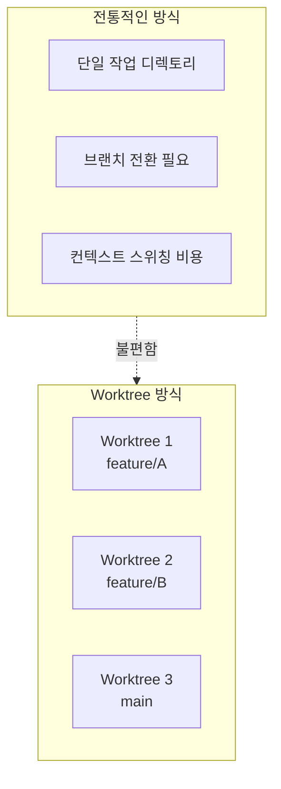
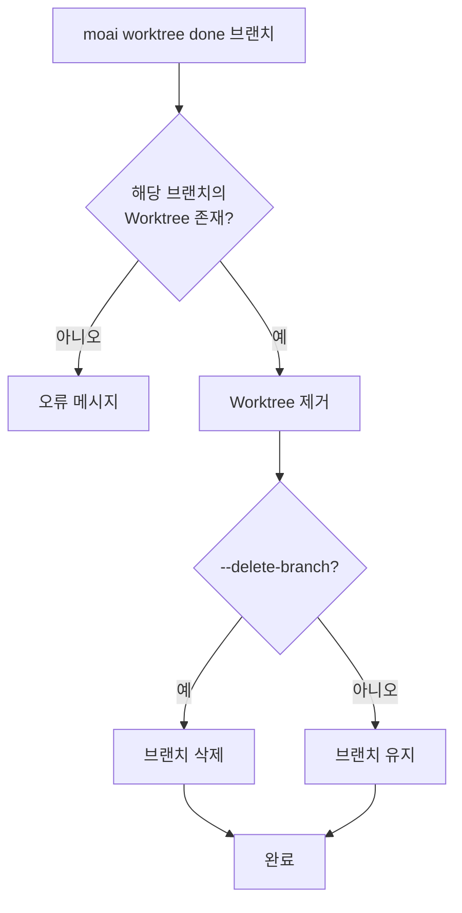
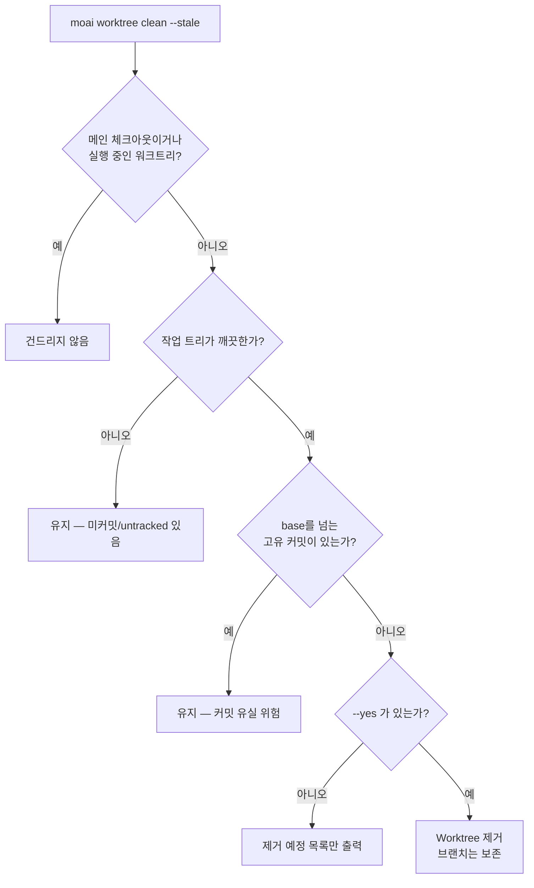
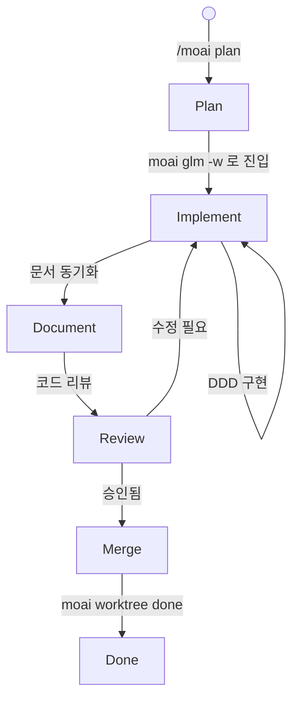
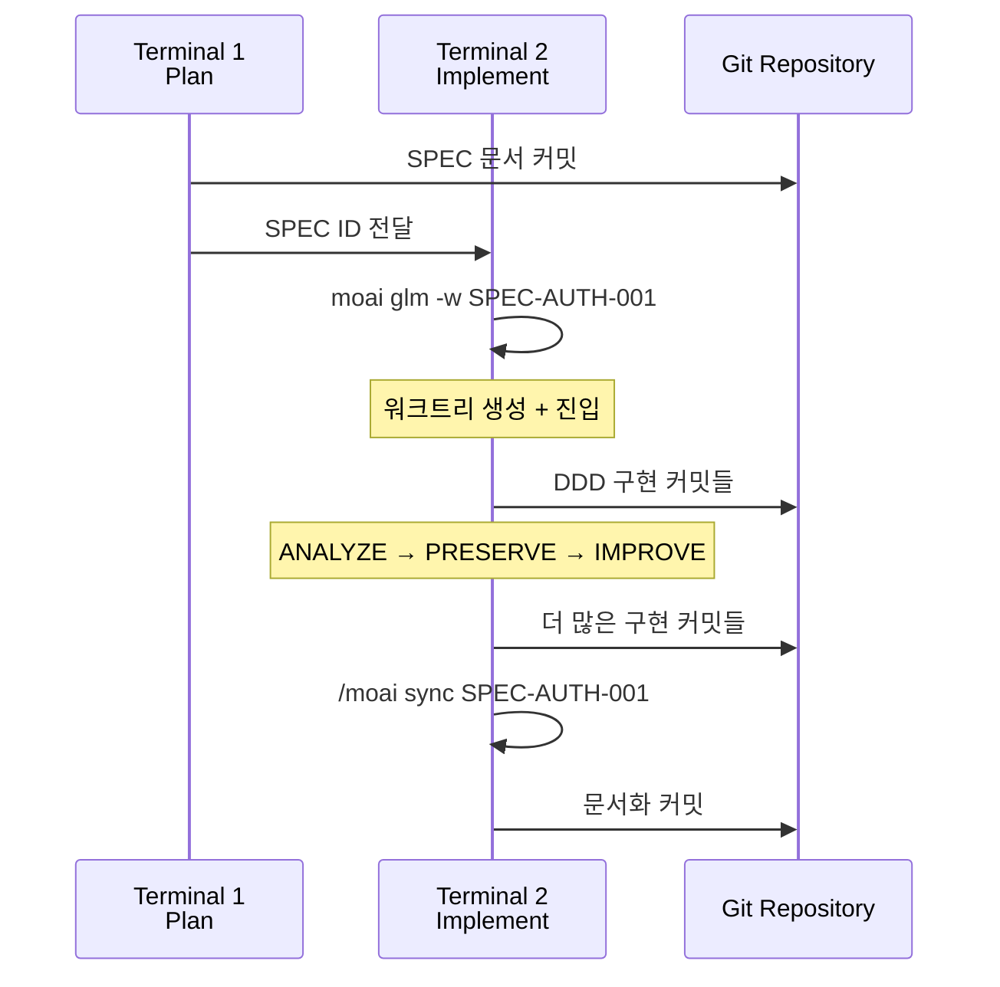
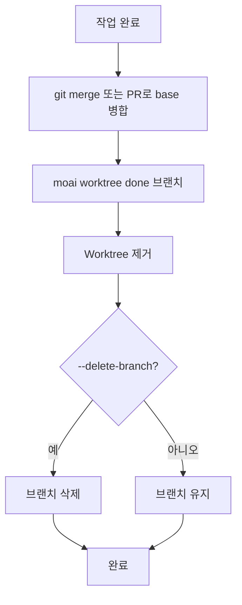
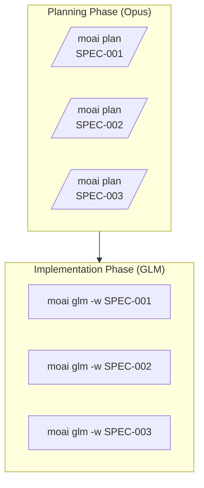
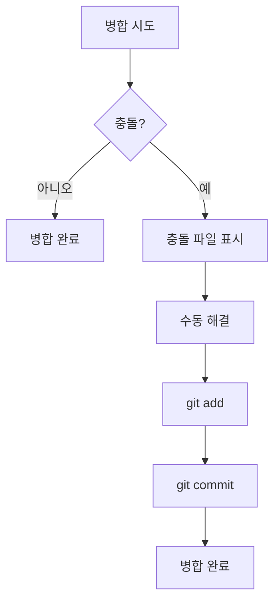
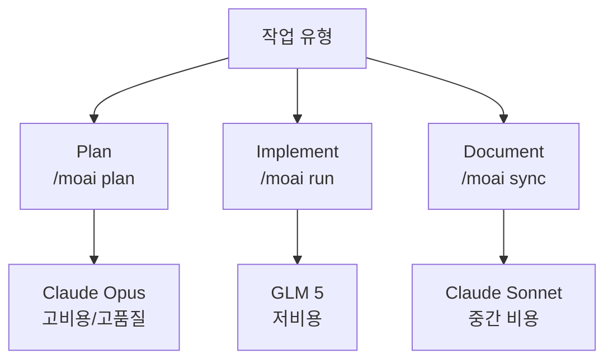

Git Worktree로 MoAI-ADK 병렬 개발을 하는 방법을 한 편에 모았습니다. 기초
개념부터 명령어 레퍼런스, 워크플로우, 모범 사례까지 다룹니다.

## 목차

1. [Worktree 기초](#worktree-기초)
2. [명령어 상세 참조](#명령어-상세-참조)
3. [워크플로우 가이드](#워크플로우-가이드)
4. [고급 기능](#고급-기능)
5. [모범 사례](#모범-사례)

---

## Worktree 기초

### Git Worktree란 무엇인가요?

Git Worktree는 **하나의 Git 저장소를 여러 디렉토리에서 동시에 작업**할 수 있게
해주는 Git 내장 기능입니다. 브랜치를 오갈 때마다 `git checkout`으로 컨텍스트를
갈아끼우는 대신, 브랜치마다 디렉토리를 하나씩 열어둡니다.


```mermaid
graph TB
    subgraph Traditional["전통적인 방식"]
        T1[단일 작업 디렉토리]
        T2[브랜치 전환 필요]
        T3[컨텍스트 스위칭 비용]
    end

    subgraph Worktree["Worktree 방식"]
        W1[Worktree 1<br/>feature/A]
        W2[Worktree 2<br/>feature/B]
        W3[Worktree 3<br/>main]
    end

    Traditional -.->|불편함| Worktree
```

### MoAI-ADK에서의 Worktree

MoAI-ADK는 이 기능 위에 SPEC 단위의 격리 환경을 얹습니다. SPEC마다 환경이
완전히 갈라지므로, 에이전트가 병렬로 움직여도 서로의 작업을 덮어쓰지
않습니다:

- **독립적인 Git 상태** — Worktree마다 자체 브랜치와 커밋 이력이 따로 쌓입니다
- **분리된 LLM 설정** — Worktree마다 다른 LLM 실행 모드를 쓸 수 있습니다.
  계획에는 Claude, 구현에는 GLM을 배정하는 토크노믹스 운용이 여기서 나옵니다
- **격리된 작업 공간** — 파일 시스템 수준에서 완전히 갈라집니다

### 역할 분담: 진입은 런처, 관리는 worktree, 조회는 git

세 가지 일이 서로 다른 명령어에 나뉘어 있습니다. 이 경계를 먼저 잡아 두면
나머지가 쉽게 읽힙니다.

| 하려는 일 | 담당 |
|-----------|------|
| Worktree 만들기 · 들어가기 | 런처 `moai cc` · `moai glm` · `moai cg` 의 `-w` 플래그 |
| Worktree 목록 보기 | `git worktree list` |
| 동기화 · 정리 · 복구 · 상태 가드 | `moai worktree` (별칭 `moai wt`) 하위 명령어 |

---

## 명령어 상세 참조

### Worktree 만들기와 진입

`moai worktree` 에는 생성 명령이 없습니다. 워크트리는 런처의 `-w` 플래그가
만들고, 그 자리에서 세션까지 띄웁니다.

#### 문법

```bash
moai cc  -w [이름] [--spawn]
moai glm -w [이름] [--spawn]
moai cg  -w [이름] [--spawn]
```

#### `-w` 값이 해석되는 방식

- **짧은 이름** (`feat-auth`) — `.claude/worktrees/feat-auth/` 아래에서
  해석됩니다. 없으면 새로 만들어집니다
- **절대 경로** — `~/.moai/worktrees/` 또는 `<프로젝트>/.claude/worktrees/`
  아래의 기존 워크트리로 다시 들어갑니다
- **값 생략** (`-w` 만) — 이름이 자동으로 지어집니다
- 위 두 접두어 밖의 절대 경로는 거부됩니다. 실수로 엉뚱한 위치에 워크트리가
  생기는 것을 막기 위해서입니다

#### `--spawn`: 현재 세션을 지키면서 하나 더 열기

`-w` 만 주면 현재 프로세스가 워크트리 세션으로 **교체**됩니다. 지금 창을
그대로 두고 워크트리를 하나 더 열려면 `--spawn` 을 붙입니다. tmux 새 창이
뜨고(포커스는 그대로), 이동할 pane ID가 출력됩니다.

`--spawn` 은 tmux 세션 안에서만 동작합니다. tmux 밖에서 쓰면 아무것도 바꾸지
않고 오류로 끝냅니다.

#### 사용 예시

```bash
# 워크트리를 만들면서 Claude 백엔드로 진입
moai cc -w feat-auth

# 같은 워크트리를 GLM 백엔드로 진입
moai glm -w feat-auth

# 현재 세션 유지 + 새 tmux 창에 GLM 팀원 띄우기
moai cg -w feat-auth --spawn

# 임의 위치에 워크트리를 직접 만들고 싶다면 git 을 그대로 사용
git worktree add -b feature/SPEC-AUTH-001 \
    ~/.moai/worktrees/your-project/SPEC-AUTH-001 origin/main
moai glm -w ~/.moai/worktrees/your-project/SPEC-AUTH-001
```

#### 목록 확인

```bash
git worktree list
```

---

### moai worktree sync

Worktree를 base 브랜치의 변경 사항과 동기화합니다.

#### 문법

```bash
moai worktree sync [branch-name]
```

#### 매개변수

- **branch-name** (선택): 동기화할 워크트리의 브랜치. 생략하면 현재 디렉터리의
  워크트리를 대상으로 합니다

#### 옵션

- `--base BRANCH`: 기준 브랜치 (기본값: `main`)
- `--strategy MODE`: `merge` (기본값) 또는 `rebase`

#### 사용 예시

```bash
# 현재 디렉토리 Worktree를 main과 동기화 (merge 전략, 기본)
moai worktree sync

# 특정 Worktree를 rebase 전략으로 동기화
moai worktree sync feature/SPEC-AUTH-001 --strategy rebase

# 다른 base 브랜치 기준
moai worktree sync feature/SPEC-AUTH-001 --base develop
```

---

### moai worktree done

브랜치에 딸린 Worktree를 지우고, 원하면 브랜치까지 삭제합니다. 다만 **병합도
푸시도 하지 않습니다**. base 브랜치에 병합하는 일은 `git merge`나 PR로 따로
진행하세요.

#### 문법

```bash
moai worktree done <branch-name>
```

#### 매개변수

- **branch-name** (필수, 정확히 한 개): 정리할 워크트리의 브랜치 이름.
  `SPEC-AUTH-001` 같은 SPEC ID 형태를 주면 `feature/SPEC-AUTH-001` 로 풀립니다

#### 옵션

- `--force`: 커밋되지 않은 변경이 있어도 강제 제거
- `--delete-branch`: Worktree 제거 후 브랜치도 삭제
- `--auto`: 자동화용 무출력 모드. 워크트리를 찾지 못해도 오류로 끝내지 않으므로
  PR 머지 직후 정리 단계에 걸어 두기 좋습니다

#### 사용 예시

```bash
# Worktree 제거
moai worktree done feature/SPEC-AUTH-001

# Worktree 제거 + 브랜치 삭제
moai worktree done feature/SPEC-AUTH-001 --delete-branch

# PR 머지 후 자동 정리 (무출력)
moai worktree done feature/SPEC-AUTH-001 --auto
```

#### 동작 과정


```mermaid
flowchart TD
    A[moai worktree done 브랜치] --> B{해당 브랜치의<br/>Worktree 존재?}
    B -->|아니오| C[오류 메시지]
    B -->|예| D[Worktree 제거]
    D --> E{--delete-branch?}
    E -->|예| F[브랜치 삭제]
    E -->|아니오| G[브랜치 유지]
    F --> H[완료]
    G --> H[완료]
```

---

### moai worktree remove

Worktree를 제거합니다 (병합 없음). 브랜치는 유지됩니다.

#### 문법

```bash
moai worktree remove <path>
```

#### 매개변수

- **path** (필수, 정확히 한 개): 제거할 Worktree의 **파일 시스템 경로**.
  브랜치 이름이나 SPEC ID가 아닙니다

#### 옵션

- `--force`: 커밋되지 않은 변경이 있어도 강제 제거

#### 사용 예시

```bash
# 기본 제거
moai worktree remove ~/.moai/worktrees/your-project/SPEC-AUTH-001

# 강제 제거
moai worktree remove ~/.moai/worktrees/your-project/SPEC-AUTH-001 --force
```

---

### moai worktree clean

stale 참조를 정리하고, 병합되었거나 방치된 Worktree를 골라 제거합니다.

#### 문법

```bash
moai worktree clean [options]
```

#### 옵션

- (플래그 없음): stale 워크트리 참조만 prune
- `--merged-only`: 브랜치가 base에 병합된 Worktree만 제거
- `--stale`: 잃을 것이 없는 방치된 Worktree를 쓸어 담기 (기본은 미리보기)
- `--yes`: `--stale` 미리보기 대신 실제 제거 수행
- `--base BRANCH`: `--merged-only` · `--stale` 판정에 쓸 base 브랜치 (기본값: `main`)

`--stale` 과 `--merged-only` 는 함께 쓸 수 없습니다.

#### --stale 의 안전 규칙

`--stale` 은 다음 두 조건을 **모두** 만족하는 워크트리만 제거 대상으로
분류합니다.

1. 작업 트리가 깨끗하다 — 미커밋 변경도, untracked 파일도 없다
2. 브랜치에 base를 넘어서는 고유 커밋이 없다

둘 중 하나라도 어긋나면 그 워크트리는 유지되고, 유지한 이유가 함께 출력됩니다.
**브랜치는 어떤 경우에도 삭제하지 않습니다** — 워크트리 디렉터리가 사라져도
커밋은 브랜치 이름으로 그대로 남습니다. 메인 체크아웃과 지금 명령을 실행 중인
워크트리는 항상 보호 대상에서 빠집니다.


```mermaid
flowchart TD
    A[moai worktree clean --stale] --> B{메인 체크아웃이거나<br/>실행 중인 워크트리?}
    B -->|예| C[건드리지 않음]
    B -->|아니오| D{작업 트리가 깨끗한가?}
    D -->|아니오| E[유지 — 미커밋/untracked 있음]
    D -->|예| F{base를 넘는<br/>고유 커밋이 있는가?}
    F -->|예| G[유지 — 커밋 유실 위험]
    F -->|아니오| H{--yes 가 있는가?}
    H -->|아니오| I[제거 예정 목록만 출력]
    H -->|예| J[Worktree 제거<br/>브랜치는 보존]
```

#### 사용 예시

```bash
# stale 참조만 정리
moai worktree clean

# 병합된 Worktree 정리 (base=main)
moai worktree clean --merged-only

# 다른 base 브랜치 기준으로 정리
moai worktree clean --merged-only --base develop

# 방치된 Worktree 미리보기 — 아무것도 지우지 않음
moai worktree clean --stale

# 미리보기 내용을 확인한 뒤 실제 제거
moai worktree clean --stale --yes
```


 `--stale` 은 미리보기가 기본값입니다. 목록을 눈으로
확인하고 `--yes` 를 붙여 다시 실행하세요.


---

### moai worktree recover

디스크를 스캔하고 `git worktree repair`를 실행해 손상된 Worktree 레지스트리를
복구합니다. 복구 후 stale 참조를 prune 하고, 최종적으로 인식된 워크트리 목록을
출력합니다. 플래그는 없습니다.

```bash
moai worktree recover
```

---

### 상태 가드: snapshot · verify · restore

아래 세 명령은 오케스트레이터가 `Agent(isolation: "worktree")` 호출 전후로 작업
트리 상태를 찍고, 대조하고, 되돌리는 데 쓰는 상태 가드 프리미티브입니다.

#### moai worktree snapshot

HEAD·브랜치·porcelain·`.moai/specs/` 하위 untracked 파일 상태를 캡처해
`.moai/state/`에 JSON으로 기록합니다.

옵션: `--out` (저장 경로, 기본값 `.moai/state/worktree-snapshot-<id>.json`),
`--agent-name` (에이전트 이름 기록).

```bash
moai worktree snapshot --agent-name my-agent --out .moai/state/snap.json
```

#### moai worktree verify

현재 작업 트리를 스냅샷과 견줍니다. `--snapshot` 은 필수이고,
`--agent-response` 를 주면 에이전트 응답 JSON의 빈 `worktreePath` 까지
탐지합니다.

종료 코드: `0`=clean, `1`=divergence, `2`=suspect(빈 worktreePath), `3`=둘 다.

```bash
moai worktree verify --snapshot .moai/state/snap.json --agent-name my-agent
```

#### moai worktree restore

`git restore --source=<snapshot HEAD> --staged --worktree :/`를 실행해 추적 중인
파일을 스냅샷 HEAD 상태로 되돌립니다. Untracked 파일은 git으로 되살릴 수 없어
경로만 알려 주며, 직접 다시 만들어야 합니다.

```bash
moai worktree restore --snapshot .moai/state/snap.json

# 실행 없이 명령만 출력
moai worktree restore --snapshot .moai/state/snap.json --dry-run
```


 `restore` 는 추적 파일의 로컬 변경을 버립니다. 되돌리기
전에 남길 것이 없는지 확인하세요.


---

## 워크플로우 가이드

### 완전한 개발 사이클


```mermaid
flowchart TD
    Start(( )) -->|"/moai plan"| Plan["Plan"]
    Plan -->|"moai glm -w 로 진입"| Implement["Implement"]
    Implement -->|"DDD 구현"| Implement
    Implement -->|"문서 동기화"| Document["Document"]
    Document -->|"코드 리뷰"| Review["Review"]
    Review -->|"승인됨"| Merge["Merge"]
    Review -->|"수정 필요"| Implement
    Merge -->|"moai worktree done"| Done["Done"]
```

### 1단계: SPEC 계획 (Phase 1)

계획은 메인 체크아웃에서 진행합니다.

```bash
# Terminal 1에서
> /moai plan "사용자 인증 시스템 구현"
```

**출력 (예시)**:

```
✓ SPEC 문서 생성: .moai/specs/SPEC-AUTH-001/spec.md

다음 단계:
1. 새 터미널에서 실행: moai glm -w SPEC-AUTH-001
2. 개발 시작: /moai run SPEC-AUTH-001
```

### 2단계: 구현 (Phase 2)

```bash
# Terminal 2에서 — 워크트리를 만들면서 GLM 백엔드로 진입
$ moai glm -w SPEC-AUTH-001

# 진입한 세션에서 바로 실행
> /moai run SPEC-AUTH-001
```

**작업 흐름**:


```mermaid
sequenceDiagram
    participant T1 as Terminal 1<br/>Plan
    participant T2 as Terminal 2<br/>Implement
    participant Git as Git Repository

    T1->>Git: SPEC 문서 커밋
    T1->>T2: SPEC ID 전달

    T2->>T2: moai glm -w SPEC-AUTH-001
    Note over T2: 워크트리 생성 + 진입
    T2->>Git: DDD 구현 커밋들
    Note over T2: ANALYZE → PRESERVE → IMPROVE

    T2->>Git: 더 많은 구현 커밋들
    T2->>T2: /moai sync SPEC-AUTH-001
    T2->>Git: 문서화 커밋
```

### 3단계: 완료 및 병합 (Phase 3)

```bash
# Terminal 2에서 작업 완료 후 (push는 별도로 git/PR로 진행)
exit

# base 브랜치 병합은 git merge 또는 PR로 처리한 뒤,
# Terminal 1에서 Worktree 정리
moai worktree done feature/SPEC-AUTH-001 --delete-branch
```

**프로세스**:


```mermaid
flowchart TD
    A[작업 완료] --> B[git merge 또는 PR로 base 병합]
    B --> C[moai worktree done 브랜치]
    C --> D[Worktree 제거]
    D --> E{--delete-branch?}
    E -->|예| F[브랜치 삭제]
    E -->|아니오| G[브랜치 유지]
    F --> H[완료]
    G --> H[완료]
```

---

## 고급 기능

### 병렬 작업 전략

#### 전략 1: Plan과 Implement 분리

토크노믹스의 기본 전략입니다. 계획 단계는 추론이 강한 모델(Opus)로 몰아서
끝내고, 구현 단계는 값싼 모델(GLM)로 여러 갈래에 나눠 돌립니다:


```mermaid
graph TB
    subgraph Planning["Planning Phase (Opus)"]
        P1[/moai plan<br/>SPEC-001/]
        P2[/moai plan<br/>SPEC-002/]
        P3[/moai plan<br/>SPEC-003/]
    end

    subgraph Implementation["Implementation Phase (GLM)"]
        I1["moai glm -w SPEC-001"]
        I2["moai glm -w SPEC-002"]
        I3["moai glm -w SPEC-003"]
    end

    Planning --> Implementation
```

#### 전략 2: 동시 개발

```bash
# Terminal 1: 계획을 몰아서 처리
> /moai plan "인증"
> /moai plan "로그"

# Terminal 3, 4, 5: 병렬 구현 (각 터미널에서 한 줄씩)
moai glm -w SPEC-001   # Terminal 3
moai glm -w SPEC-002   # Terminal 4
moai glm -w SPEC-003   # Terminal 5
```

tmux를 쓰고 있다면 창을 옮겨 다니지 않고 한 터미널에서 전부 띄울 수 있습니다:

```bash
moai glm -w SPEC-001 --spawn
moai glm -w SPEC-002 --spawn
moai glm -w SPEC-003 --spawn
```

### Worktree 간 전환

```bash
# 현재 어떤 Worktree들이 있는지 확인
git worktree list

# 다른 Worktree 세션으로 진입
moai glm -w SPEC-AUTH-002
```

### 충돌 해결


```mermaid
flowchart TD
    A[병합 시도] --> B{충돌?}
    B -->|아니오| C[병합 완료]
    B -->|예| D[충돌 파일 표시]
    D --> E[수동 해결]
    E --> F[git add]
    F --> G[git commit]
    G --> H[병합 완료]
```

---

## 모범 사례

### 1. Worktree 명명 규칙

```bash
# 좋은 예
moai glm -w SPEC-AUTH-001      # 명확한 SPEC ID
moai glm -w SPEC-FRONTEND-007  # 카테고리 포함

# 피해야 할 예
moai glm -w feature-branch     # SPEC ID 미사용
moai glm -w temp               # 모호한 이름
```

### 2. 정기적인 정리

```bash
# 병합된 Worktree 정기 정리
moai worktree clean --merged-only

# 방치된 Worktree 확인 후 정리
moai worktree clean --stale
moai worktree clean --stale --yes
```

### 3. LLM 선택 가이드

작업 단계마다 모델을 나눠 배정하는 것이 Worktree 토크노믹스의 핵심입니다:


```mermaid
graph TD
    A[작업 유형] --> B[Plan<br/>/moai plan]
    A --> C[Implement<br/>/moai run]
    A --> D[Document<br/>/moai sync]

    B --> E[Claude Opus<br/>고비용/고품질]
    C --> F[GLM 5<br/>저비용]
    D --> G[Claude Sonnet<br/>중간 비용]
```

### 4. 커밋 메시지 규칙

```bash
# Worktree에서 커밋할 때
git commit -m "feat(SPEC-AUTH-001): JWT 기반 인증 구현

- JWT 토큰 생성/검증 로직 추가
- 리프레시 토큰 로테이션 구현
- 로그아웃 시 토큰 무효화

Co-Authored-By: Claude <noreply@anthropic.com>"
```

### 5. 터미널 관리

`--spawn` 이 tmux 창 관리를 대신하므로, 세션을 손으로 만들 일이 거의 없습니다.

```bash
# tmux 안에서 워크트리 세션 세 개를 한 번에 띄우기
moai glm -w SPEC-001 --spawn
moai glm -w SPEC-002 --spawn
moai cc  -w SPEC-003 --spawn

# 출력된 pane ID로 이동
tmux select-window -t %7
```

### 6. 진행 상황 추적

```bash
# 등록된 Worktree 확인
git worktree list

# Git 로그 확인
git -C ~/.moai/worktrees/your-project/SPEC-AUTH-001 log --oneline --graph --all

# 변경 사항 확인
git -C ~/.moai/worktrees/your-project/SPEC-AUTH-001 diff main
```

## 관련 문서

- [Git Worktree 개요](/ko/worktree/)
- [실제 사용 예시](/ko/worktree/examples)
- [자주 묻는 질문](/ko/worktree/faq)
- [moai worktree CLI 레퍼런스](/ko/cli-reference/worktree)
