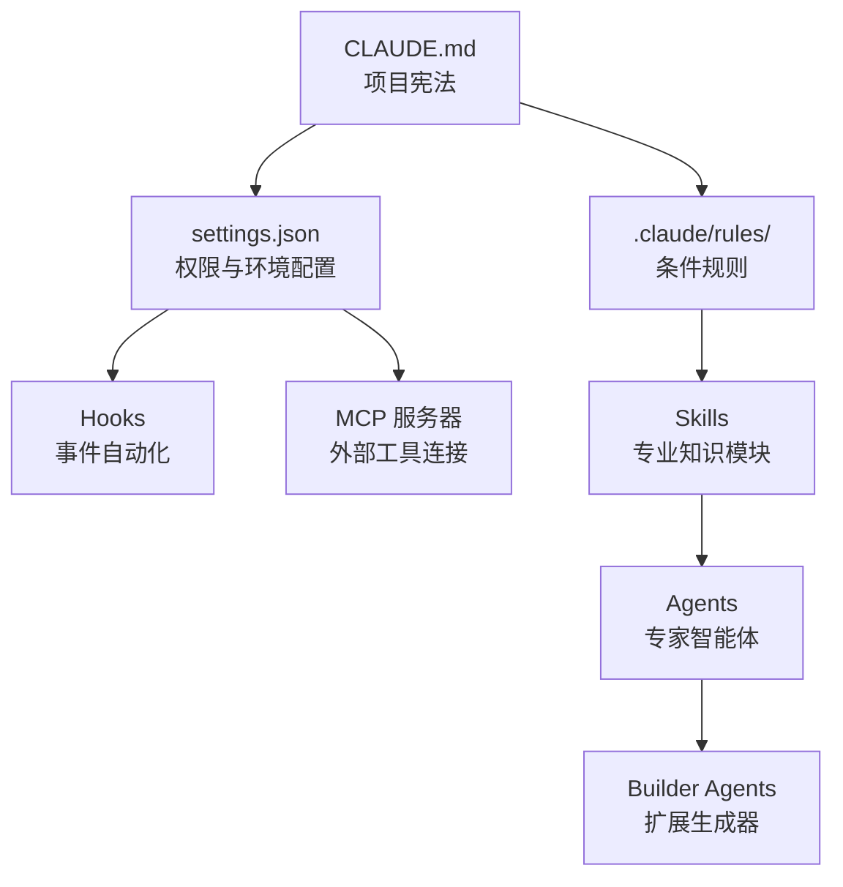

本节面向想深入拆解 MoAI-ADK 内部结构的开发者。如果你已经熟悉了基本工作流（plan → run → sync），可以在这里看到 Harness 实际是如何组装起来的。


本节文档主要讲解 v3.0 三大支柱 — **代币经济学** (Token Economics)、**智能体循环工程** (Agentic Loop Engineering)、**智能体 Harness** (Agentic Harness) — 中第三根支柱的实现细节。让智能体写好代码的秘诀不在模型本身，而在于围绕模型的环境设计。


## Harness 是如何组装的

MoAI-ADK Harness 由 7 个组成部分分层协作。越往下的层越动态。

如果说 `CLAUDE.md` 是项目的宪法，那么 settings.json 就是权限的边界线，Hook 是确定性 (deterministic) 控制点，Skill 与 Agent 则是真正干活的双手。而 Builder Agents 可以重新生成这整个结构 — 这是一个 Harness 制造 Harness 的递归结构。

## 目录

### Harness 的组成部分

| 主题 | 说明 |
|------|------|
| [技能指南](/zh/advanced/skill-guide) | 赋予 AI 专业知识的技能系统 |
| [智能体指南](/zh/advanced/agent-guide) | 专业化 AI 任务执行者体系 |
| [构建器智能体指南](/zh/advanced/builder-agents) | 生成技能、智能体、命令与插件 |
| [Harness v4 Builder](/zh/advanced/harness-v4-builder) | 用一句自然语言生成项目专属 Harness |
| [Harness 配置档案与评估系统](/zh/advanced/harness-profiles) | 3 层验证深度 + 4 维评分 |
| [目录系统](/zh/advanced/catalog-system) | 3 层清单与 slim init |

### 控制与自动化

| 主题 | 说明 |
|------|------|
| [Hooks 指南](/zh/advanced/hooks-guide) | 基于事件的自动化脚本 |
| [Hooks 参考](/zh/advanced/hooks-reference) | MoAI-ADK 分发的 Hook 列表 |
| [settings.json 指南](/zh/advanced/settings-json) | Claude Code 全局设置管理 |
| [CLAUDE.md 指南](/zh/advanced/claude-md-guide) | 项目指令文件体系 |
| [安全说明](/zh/advanced/security-notes) | 权限栈与沙箱 |

### 循环与观察

| 主题 | 说明 |
|------|------|
| [决策记忆](/zh/advanced/decision-memory) | 学习用户选择的观察系统 |
| [ultracode 工作流](/zh/advanced/ultracode-workflows) | 动态工作流编排 |
| [statusline](/zh/advanced/statusline) | 上下文使用率、缓存命中率常驻仪表盘 |

### 外部工具集成

| 主题 | 说明 |
|------|------|


每篇文档均可独立阅读。不过如果想系统地理解整体架构，推荐按 **技能指南 → 智能体指南 → 构建器智能体** 的顺序阅读 — 从知识模块到执行者、再从执行者到生成器的脉络，正是 Harness 递归结构的直接体现。

