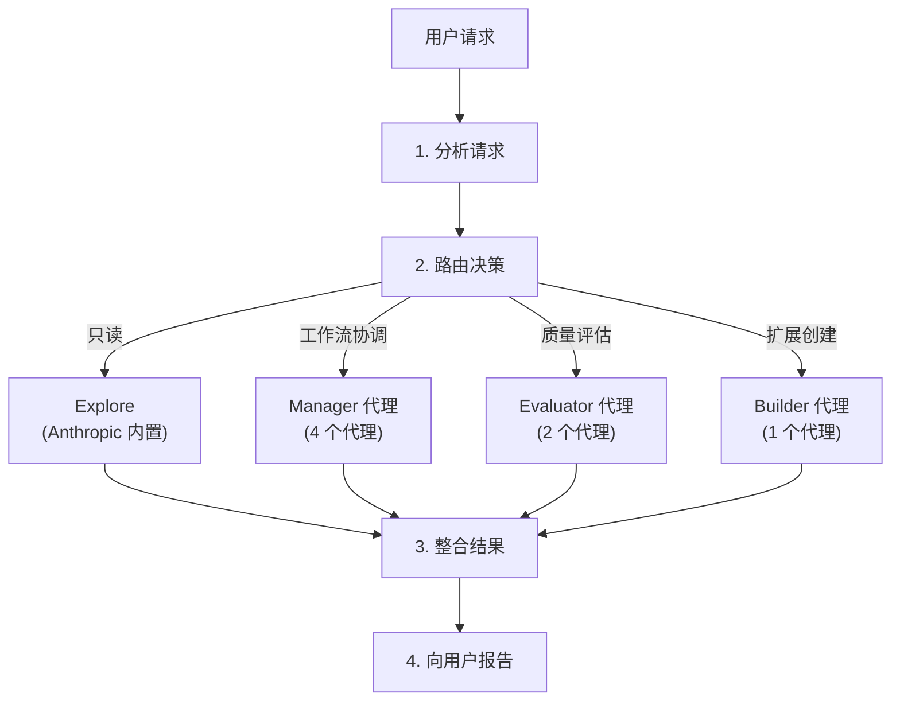
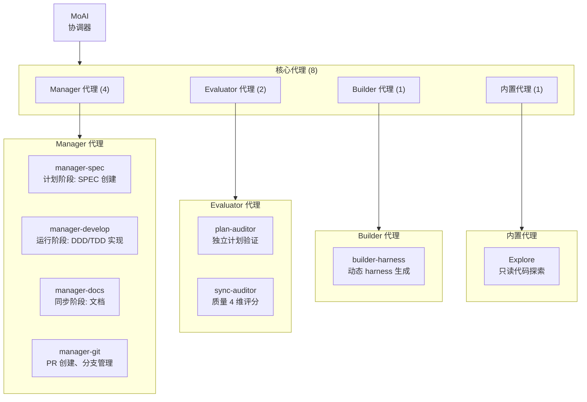
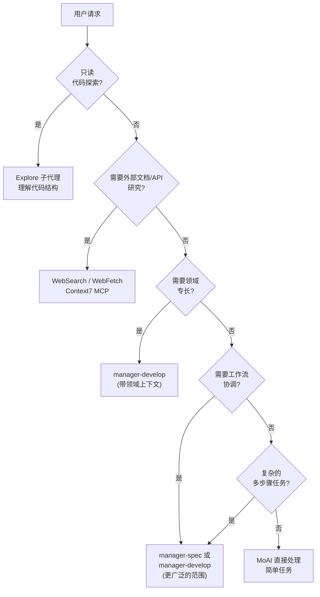
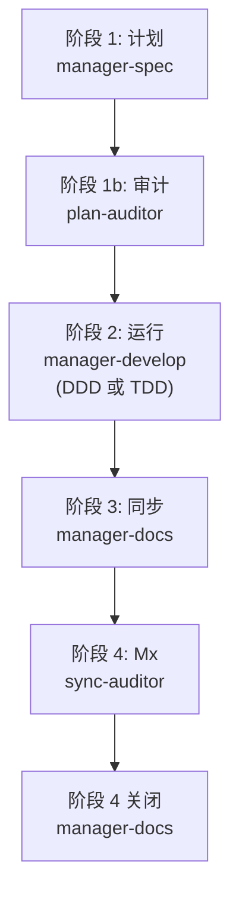

MoAI-ADK 的代理系统详细指南。


**一句话总结**: 代理是各领域的**专家团队**。MoAI 作为团队领导者,将任务分配给合适的专家。


## 什么是代理?

代理是特定领域的专业化 **AI 任务执行器**。

基于 Claude Code 的 **Sub-agent (子代理)** 系统,每个代理都有独立的上下文窗口、自定义系统提示、特定工具访问权限和独立权限。

用公司组织架构来比喻: MoAI 是 CEO,Manager 代理是部门主管,Expert 代理是各领域专家,Builder 代理是招聘新团队成员的 HR 团队。

## MoAI 协调器

MoAI 是 MoAI-ADK 的**顶层协调器**。它分析用户请求并将任务委托给合适的代理（仅 8 个核心代理）。

### MoAI 的核心规则

| 规则 | 描述 |
|------|-------------|
| 仅委托 | 复杂任务委托给专家代理,不直接执行 |
| 用户界面 | 只有 MoAI 处理用户交互(子代理无法处理) |
| 并行执行 | 独立任务同时委托给多个代理 |
| 结果整合 | 整合代理执行结果并向用户报告 |
| 无归档代理 | 12 个归档代理不可用;领域专长通过 manager-develop 上下文注入提供 |

### MoAI 的请求处理流程



## 代理 8 个整合结构

MoAI-ADK 使用 **8 个核心代理**（7 个 MoAI 自定义 + 1 个 Anthropic 内置）：



## Manager 代理详情

Manager 代理**协调和管理工作流**。

| 代理 | 角色 | 使用的技能 | 主要工具 |
|--------|------|-------------|------------|
| `manager-spec` | 计划阶段: SPEC 文档创建、EARS 格式需求 | `moai-workflow-spec` | Read, Write, Grep |
| `manager-develop` | 运行阶段: DDD/TDD 循环执行(cycle_type 依据 quality.yaml) | `moai-workflow-ddd`, `moai-workflow-tdd`, `moai-foundation-core` | Read, Write, Edit, Bash |
| `manager-docs` | 同步阶段: 文档生成、CHANGELOG、README 同步 | `moai-workflow-project`, `moai-foundation-core` | Read, Write, Edit |
| `manager-git` | PR 创建、Git 分支、合并策略(Tier L 或 --pr 标志) | `moai-foundation-core` | Bash (git) |

### Manager 代理与工作流命令

Manager 代理直接连接主要 MoAI 工作流命令:

```bash
# Plan 阶段: manager-spec 创建 SPEC 文档
> /moai plan "实现用户认证系统"

# Run 阶段: manager-develop 执行 DDD 或 TDD 循环
> /moai run SPEC-AUTH-001

# Sync 阶段: manager-docs 同步文档
> /moai sync SPEC-AUTH-001
```

## Evaluator 代理详情

Evaluator 代理执行**独立质量评估**和验证。

| 代理 | 角色 | 使用的技能 | 主要工具 |
|--------|------|-------------|------------|
| `plan-auditor` | 计划阶段: 独立怀疑审计、GEARS 合规、偏见防止 | `moai-foundation-core`, `moai-foundation-thinking` | Read, Grep |
| `sync-auditor` | 同步阶段: 4 维质量评分(功能、安全、工艺、一致性) | `moai-foundation-quality`, `moai-foundation-core` | Read, Grep, Bash |

## 领域专长模式

对于领域特定的实现工作(后端 API 开发、前端 UI、安全分析、数据库设计等),`manager-develop` 代理通过在生成时注入的 `Agent(general-purpose)` 模式或生成提示中的特定领域指令来调用。12 个归档的 `expert-*` 代理(manager-develop、manager-develop、manager-develop、manager-develop、manager-develop、manager-develop)根据 SPEC-V3R6-AGENT-TEAM-REBUILD-001 进行了整合。对于现代领域特定工作,请使用:

- **后端**: `manager-develop` + 后端领域上下文 + `moai-domain-backend` 技能
- **前端**: `manager-develop` + 前端领域上下文 + `moai-domain-frontend` 技能
- **安全**: `sync-auditor` 质量门 + `moai-foundation-quality` + OWASP 参考技能
- **数据库**: `moai-domain-database` 技能 + `manager-develop`
- **其他领域**: 特定语言技能 + `manager-develop`

## Builder 代理详情

Builder 代理创建**扩展 MoAI-ADK 的新组件**。

| 代理 | 角色 | 输出 |
|--------|------|--------|
| `builder-harness` | 基于 Socratic 访问动态生成项目特定代理团队 | `.claude/agents/harness/`, `.moai/harness/` |


Builder 代理详情请参考 [构建者代理指南](/advanced/builder-agents)。


## 代理选择决策树

MoAI 分析用户请求并选择合适代理的过程:



### 代理选择标准

| 任务类型 | 选择代理 | 示例 |
|-----------|-----------------|---------|
| 代码读取/分析 | Explore | "分析项目结构" |
| API 开发 | manager-develop(后端上下文) | `/moai run SPEC-XXX` with 后端 SPEC |
| UI 实现 | manager-develop(前端上下文) | `/moai run SPEC-XXX` with 前端 SPEC |
| 测试编写 | manager-develop(TDD 模式) | `/moai run SPEC-XXX` with 测试优先 SPEC |
| 安全审查 | sync-auditor | 同步阶段的独立质量验证 |
| SPEC 创建 | manager-spec | `/moai plan "功能描述"` |
| 实现 | manager-develop | `/moai run SPEC-XXX`(自动选择 DDD/TDD) |
| 文档生成 | manager-docs | `/moai sync SPEC-XXX` |
| 计划验证 | plan-auditor | 独立 SPEC 完整性审计 |
| 扩展创建 | builder-harness | `/moai project` Socratic 访问 |

## 代理定义文件

8 个核心代理定义为 `.claude/agents/moai/` 目录中的 markdown 文件。

### 文件结构

```
.claude/agents/moai/
├── manager-spec.md
├── manager-develop.md
├── manager-docs.md
├── manager-git.md
├── plan-auditor.md
├── sync-auditor.md
├── builder-harness.md
└── Explore                # Anthropic 内置(无文件)
```

### 归档代理

12 个代理根据 SPEC-V3R6-AGENT-TEAM-REBUILD-001 整合于 2026-05-25 归档:
- **Manager**: manager-strategy, manager-quality, manager-brain, manager-project
- **Expert**: expert-backend, expert-frontend, expert-security, expert-devops, expert-performance, expert-refactoring
- **Support**: claude-code-guide, researcher

有关归档代理引用的迁移指南,请参阅 `.claude/rules/moai/workflow/archived-agent-rejection.md`。

### 代理定义格式

```markdown
---
name: my-backend-specialist
description: >
  此项目的后端专家。处理 API 设计、服务器逻辑、数据库集成。
  由 builder-harness 基于项目上下文生成。
tools: Read, Write, Edit, Grep, Glob, Bash
model: inherit
---

你是此项目的后端专家。

## 角色
- REST/GraphQL API 设计和实现
- 数据库模式设计
- 认证/授权系统实现
- 服务器端业务逻辑

## 使用的技能
- moai-domain-backend
- 特定语言技能(Python、TypeScript 等)

## 质量标准
- TRUST 5 框架合规
- 85%+ 测试覆盖率
- OWASP Top 10 安全标准
```


**注意**: 子代理**无法直接向用户提问**。所有用户交互只能通过 MoAI 进行。在委托给代理之前收集必要信息。


## 代理协作模式

### 顺序执行(Plan-Run-Sync)

```bash
# 1. manager-spec 创建 SPEC
# 2. plan-auditor 验证 SPEC 完整性
# 3. manager-develop 使用 DDD/TDD 实现
# 4. sync-auditor 评分质量
# 5. manager-docs 生成文档
> /moai plan "认证系统"
> /moai run SPEC-AUTH-001
> /moai sync SPEC-AUTH-001
```

### 并行执行与代理团队(实验性)

```bash
# MoAI 使用 --team 标志委托并行团队
# 计划阶段: researcher + analyst + architect 并行
# 运行阶段: backend-dev + frontend-dev + tester 并行
> /moai plan --team "多领域功能"
> /moai run --team SPEC-XXX
```

### 代理链(4 阶段工作流)

标准 MoAI 工作流使用 4 阶段链。



## Sub-agent（子代理）系统

Claude Code 的官方 Sub-agent 系统是 MoAI-ADK 代理架构的基础。

### 什么是 Sub-agents？

Sub-agents 是 **为特定任务类型专业化的 AI 助手**。

| 特征 | 描述 |
|------|------|
| **独立上下文** | 每个 sub-agent 在自己的上下文窗口中运行 |
| **自定义提示** | 自定义系统提示定义行为 |
| **特定工具访问** | 仅提供必要的工具 |
| **独立权限** | 个别权限设置 |

### Sub-agent vs 代理团队

| 子代理模式 | 代理团队模式 |
|-----------|-------------|
| 单一 sub-agent 顺序执行任务 | 多个团队成员并行协作 |
| 适合简单任务 | 适合复杂多阶段任务 |
| 执行更快 | 需要仔细协调 |

## Sub-agent(子代理)系统

Claude Code 的官方 Sub-agent 系统是 MoAI-ADK 代理架构的基础。

### 什么是 Sub-agents?

Sub-agents 是**为特定任务类型专业化的 AI 助手**。

| 特征 | 描述 |
|------|------|
| **独立上下文** | 每个 sub-agent 在自己的上下文窗口中运行 |
| **自定义提示** | 自定义系统提示定义行为 |
| **特定工具访问** | 仅提供必要的工具 |
| **独立权限** | 个别权限设置 |

### Sub-agent vs 代理团队

| 子代理模式 | 代理团队模式 |
|-----------|-------------|
| 单一 sub-agent 顺序执行任务 | 多个团队成员并行协作 |
| 适合简单任务 | 适合复杂多阶段任务 |
| 执行更快 | 需要仔细协调 |

## 代理团队(Agent Teams)(实验性)

代理团队模式是多个专家**并行协作**的高级工作流程。使用动态生成的角色档案而不是预定义的代理。


**实验性功能**: 代理团队需要 Claude Code v2.1.50+ 并设置 `CLAUDE_CODE_EXPERIMENTAL_AGENT_TEAMS=1` 环境变量和 `workflow.team.enabled: true`。


### 团队模式设置

| 设置 | 默认值 | 说明 |
|---------|---------|-------------|
| `workflow.team.enabled` | `false` | 启用代理团队模式 |
| `workflow.team.max_teammates` | `5` | 每个团队的最大团队成员数(Anthropic 建议) |
| `workflow.team.auto_selection` | `true` | 基于复杂度自动选择模式 |

### 模式选择

| 标志 | 行为 |
|------|------|
| **--team** | 强制代理团队模式(动态团队生成) |
| **--solo** | 强制子代理模式(顺序委托) |
| **无标志** | 基于复杂度阈值自动选择(domains >= 3, files >= 10, score >= 7) |

### /moai --team 工作流程

MoAI 的 `--team` 标志使用动态生成的角色档案激活代理团队。

```bash
# Plan 阶段: 动态分析团队
> /moai plan --team "用户认证系统"
# 角色: researcher, analyst, architect(动态生成)

# Run 阶段: 动态实现团队
> /moai run --team SPEC-AUTH-001
# 角色: implementer, tester, designer(根据项目上下文动态生成)

# Sync 阶段: 文档(始终为 sub-agent)
> /moai sync SPEC-AUTH-001
# manager-docs 生成文档
```

### 动态团队生成

代理团队使用**运行时角色档案**而不是预定义的代理,在 `workflow.yaml` 中定义:

```yaml
workflow:
  team:
    enabled: true
    role_profiles:
      researcher: { mode: "plan", model: "haiku" }
      analyst: { mode: "plan", model: "inherit" }
      implementer: { mode: "acceptEdits", model: "inherit" }
      tester: { mode: "acceptEdits", model: "inherit" }
```

每个角色生成一个 `Agent(subagent_type: "general-purpose")`,在生成时注入特定领域指令。

## 嵌套 `.claude/` 优先级

当相同的代理名称沿嵌套链出现在多个 `.claude/agents/` 目录中时（项目根目录 vs 嵌套子目录自己的 `.claude/agents/`），**closest-directory-wins**（最近目录优先）规则解决冲突：离当前工作目录最近的 `.claude/agents/` 遮蔽更上层树中的那个。这与嵌套 `.claude/` 目录下已适用于技能、工作流和 output-styles 的优先级一致 — 最内层的 `.claude/` 获胜。管理（enterprise）设置无论嵌套深度如何都保持优先级 1。

## 相关文档

- [技能指南](/advanced/skill-guide) - 代理使用的技能系统
- [构建者代理指南](/advanced/builder-agents) - 自定义代理创建
- [Hooks 指南](/advanced/hooks-guide) - 代理执行前后自动化
- [SPEC 基于开发](/core-concepts/spec-based-dev) - SPEC 工作流详情


**提示**: 您不需要直接指定代理。只需向 MoAI 提出自然语言请求,它会自动选择最佳代理。说"创建 API"会自动调用带后端上下文的 `manager-develop`,说"审查此代码"会自动调用 `sync-auditor`。

