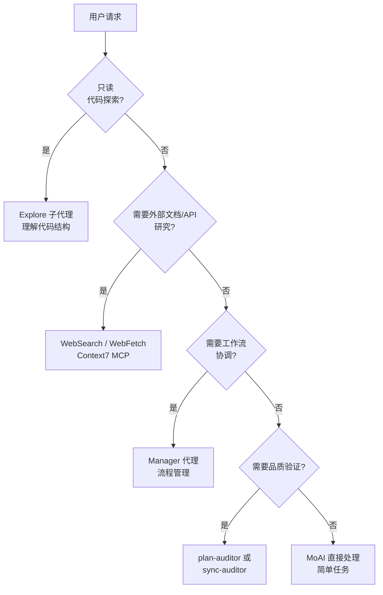

MoAI-ADK 的 8 个核心代理系统详细指南。


**一句话总结**: 代理是各领域的**专家团队**。MoAI 作为团队领导者，将任务分配给合适的专家。


## 什么是代理?

代理是特定领域的专业化 **AI 任务执行器**。

基于 Claude Code 的 **Sub-agent (子代理)** 系统，每个代理都有独立的上下文窗口、自定义系统提示、特定工具访问权限和独立权限。

用公司组织架构来比喻: MoAI 是 CEO，Manager 代理是部门主管，Evaluator 代理是质量监察官，Builder 代理是招聘新团队的 HR 团队。

## MoAI 协调器

MoAI 是 MoAI-ADK 的**顶层协调器**。它分析用户请求并将任务委托给合适的代理（仅 8 个核心代理）。

### MoAI 的核心规则

| 规则 | 描述 |
|------|------|
| 仅委托 | 复杂任务委托给专家代理，不直接执行 |
| 用户界面 | 只有 MoAI 处理用户交互 (子代理无法处理) |
| 并行执行 | 独立任务同时委托给多个代理 |
| 结果整合 | 整合代理执行结果并向用户报告 |

## 8 个核心代理目录

MoAI-ADK 使用 **8 个核心代理** (7 个 MoAI 自定义 + 1 个 Anthropic 内置)。

### Manager 代理 (4 个)

| 代理 | 角色 | 阶段 | 主要技能 |
|----------|------|------|----------|
| `manager-spec` | SPEC 文档生成，GEARS 格式需求 | Plan | `moai-workflow-spec` |
| `manager-develop` | DDD/TDD 循环实现 (quality.yaml 中的 cycle_type) | Run | `moai-workflow-ddd`, `moai-workflow-tdd` |
| `manager-docs` | 文档生成，CHANGELOG，README 同步 | Sync | `moai-workflow-project` |
| `manager-git` | PR 创建，Git 分支，合并策略 | PR (Tier L) | `moai-foundation-core` |

### Evaluator 代理 (2 个)

| 代理 | 角色 | 评估对象 | 主要技能 |
|----------|------|---------|----------|
| `plan-auditor` | Plan 阶段独立审计，GEARS 准规，偏见防止 | SPEC 完整性 | `moai-foundation-core`, `moai-foundation-thinking` |
| `sync-auditor` | Sync 阶段 4 维质量评分 (功能、安全、工艺、一致性) | 实现质量 | `moai-foundation-quality`, `moai-foundation-core` |

### Builder 代理 (1 个)

| 代理 | 角色 | 输出 |
|----------|------|--------|
| `builder-harness` | 基于 Socratic 访谈动态生成项目特定代理团队 | `.claude/agents/harness/`, `.moai/harness/manifest.json` |

### 内置代理 (1 个，Anthropic)

| 代理 | 角色 | 特征 |
|----------|------|------|
| `Explore` | 只读代码探索和分析 | Haiku 模型，Read-only 工具 |

## Manager-Develop 域上下文注入

`manager-develop` 接受域特定的上下文注入进行调用。

- **后端工作**: `manager-develop` + 后端域上下文 + `moai-domain-backend` 技能
- **前端工作**: `manager-develop` + 前端域上下文 + `moai-domain-frontend` 技能
- **其他域**: 语言特定技能 + 专业性提示

## 代理选择决策树

MoAI 分析用户请求并选择合适代理的过程。



## 代理定义文件

8 个核心代理定义为 `.claude/agents/moai/` 目录中的 markdown 文件。

### 文件结构

```
.claude/agents/moai/
├── manager-spec.md
├── manager-develop.md
├── manager-docs.md
├── manager-git.md
├── plan-auditor.md
├── sync-auditor.md
├── builder-harness.md
└── (Explore: Anthropic 内置，无文件)
```

### 代理定义格式

```markdown
---
name: my-specialist
description: >
  该项目的专家。特定域专业性说明。
tools: Read, Write, Edit, Grep, Glob, Bash
model: inherit
---

你是该项目的[域]专家。

## 角色

- 责任 1
- 责任 2
- 责任 3

## 使用技能

- moai-domain-[domain]
- 语言特定技能
```

## 代理间协作模式

### Plan-Run-Sync 顺序工作流

```bash
# 1. manager-spec 创建 SPEC
/moai plan "功能描述"

# 2. plan-auditor 验证 SPEC 质量
# (自动执行)

# 3. manager-develop 执行 DDD/TDD 实现
/moai run SPEC-XXX

# 4. sync-auditor 评分 4 维质量
# (自动执行)

# 5. manager-docs 同步文档
/moai sync SPEC-XXX
```

### 使用代理团队的并行执行 (实验性)

```bash
# MoAI 使用 --team 标志同时委托多个专家
> /moai plan --team "用户认证系统"
> /moai run --team SPEC-AUTH-001
```

## Sub-agent 系统基础

Claude Code 的官方 Sub-agent 系统是 MoAI-ADK 代理架构的基础。

### Sub-agent 特征

| 特征 | 说明 |
|------|------|
| **独立上下文** | 每个 sub-agent 在自己的 200K 令牌上下文窗口中运行 |
| **自定义提示** | 自定义系统提示定义行为 |
| **特定工具访问** | 仅提供必要的工具 |
| **独立权限** | 个别权限设置 |

### Sub-agent 约束

| 约束 | 说明 |
|------|------|
| 不能生成子代理 | 下位代理不能生成其他下位代理 |
| AskUserQuestion 限制 | 下位代理无法直接与用户交互 |
| 技能非继承 | 不继承父会话的技能 |
| 独立上下文 | 每个代理都有独立的 200K 令牌上下文 |

## 代理团队 (实验性)

代理团队模式是多个专家**并行协作**的高级工作流。

### 团队模式设置

| 设置 | 默认值 | 说明 |
|---------|---------|-------------|
| `workflow.team.enabled` | `false` | 启用代理团队模式 |
| `workflow.team.max_teammates` | `5` | 每个团队的最大成员数 (Anthropic 建议) |
| `workflow.team.auto_selection` | `true` | 基于复杂度自动选择模式 |

### 模式选择

| 标志 | 行为 |
|-------|------|
| **--team** | 强制代理团队模式 |
| **--solo** | 强制 Sub-agent 模式 |
| **无标志** | 基于复杂度阈值自动选择 |

## 相关文档

- [Harness v4 Builder](/zh/advanced/builder-agents) - 动态代理团队生成
- [技能指南](/zh/advanced/skill-guide) - 代理使用的技能系统
- [SPEC 基础开发](/zh/workflow-commands/moai-plan) - SPEC 工作流详情


**提示**: 你不需要直接指定代理。只需向 MoAI 提出自然语言请求，它会自动选择最佳代理。

