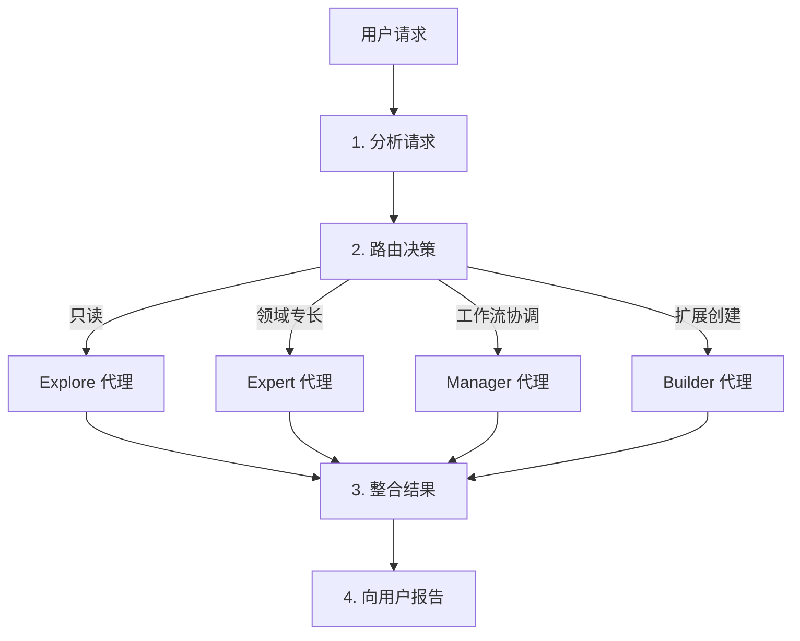
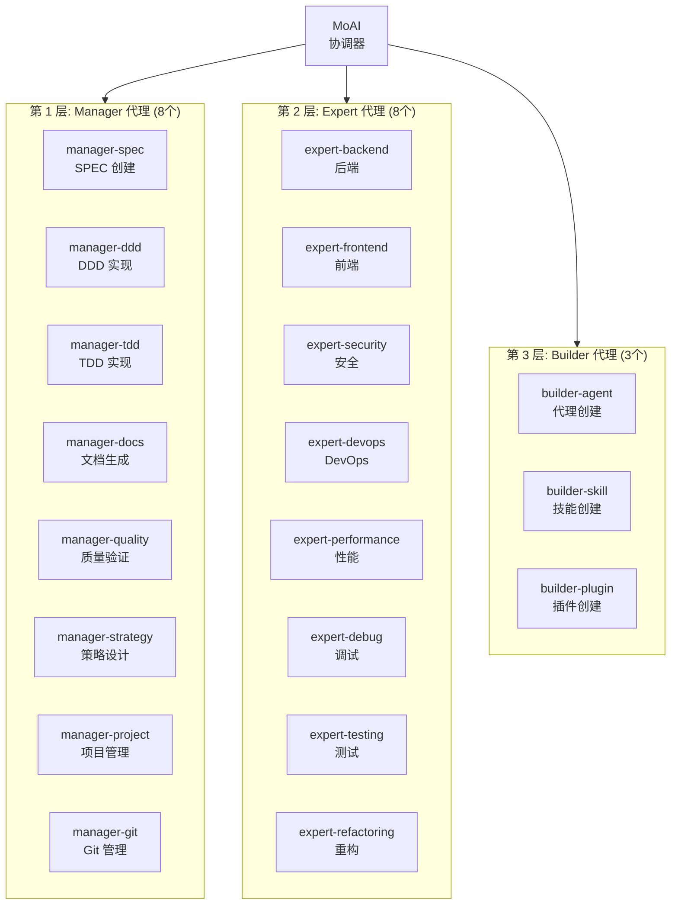
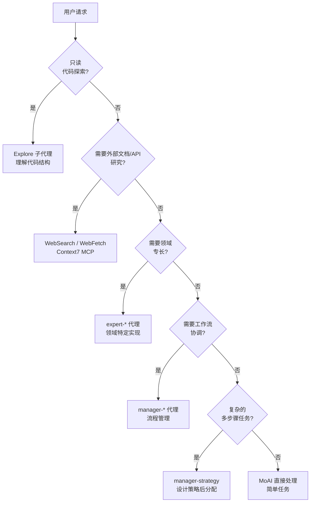
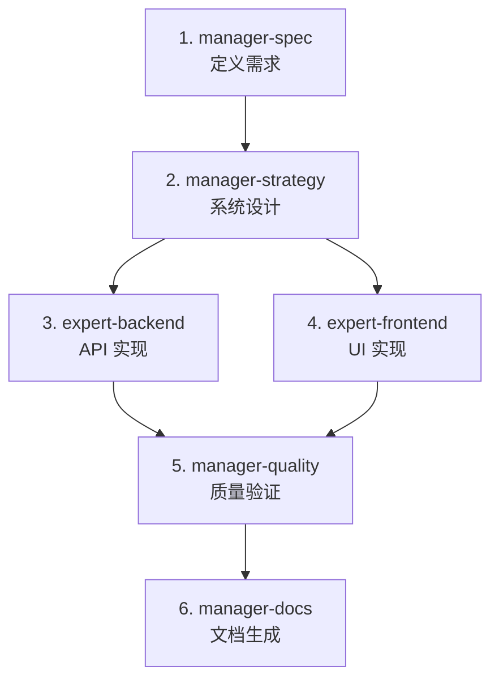

MoAI-ADK 的代理系统详细指南。


**一句话总结**: 代理是各领域的**专家团队**。MoAI 作为团队领导者,将任务分配给合适的专家。


## 什么是代理?

代理是特定领域的专业化 **AI 任务执行器**。

基于 Claude Code 的 **Sub-agent (子代理)** 系统,每个代理都有独立的上下文窗口、自定义系统提示、特定工具访问权限和独立权限。

用公司组织架构来比喻: MoAI 是 CEO,Manager 代理是部门主管,Expert 代理是各领域专家,Builder 代理是招聘新团队成员的 HR 团队。

## MoAI 协调器

MoAI 是 MoAI-ADK 的**顶层协调器**。它分析用户请求并将任务委托给合适的代理。

### MoAI 的核心规则

| 规则 | 描述 |
|------|-------------|
| 仅委托 | 复杂任务委托给专家代理,不直接执行 |
| 用户界面 | 只有 MoAI 处理用户交互(子代理无法处理) |
| 并行执行 | 独立任务同时委托给多个代理 |
| 结果整合 | 整合代理执行结果并向用户报告 |

### MoAI 的请求处理流程



## 代理 3 层结构

MoAI-ADK 代理分为 **3 层**:



## Manager 代理详情

Manager 代理 **协调和管理工作流**。

| 代理 | 角色 | 使用的技能 | 主要工具 |
|--------|------|-------------|------------|
| `manager-spec` | SPEC 文档创建,EARS 格式需求 | `moai-workflow-spec` | Read, Write, Grep |
| `manager-ddd` | ANALYZE-PRESERVE-IMPROVE 循环执行 | `moai-workflow-ddd`, `moai-foundation-core` | Read, Write, Edit, Bash |
| `manager-docs` | 文档生成,Nextra 集成 | `moai-library-nextra`, `moai-docs-generation` | Read, Write, Edit |
| `manager-quality` | TRUST 5 验证,代码审查 | `moai-foundation-quality` | Read, Grep, Bash |
| `manager-strategy` | 系统设计,架构决策 | `moai-foundation-core`, `moai-foundation-philosopher` | Read, Grep, Glob |
| `manager-project` | 项目配置,初始化 | `moai-workflow-project` | Read, Write, Bash |
| `manager-tdd` | RED-GREEN-REFACTOR 循环执行 | `moai-workflow-tdd`, `moai-foundation-core` | Read, Write, Edit, Bash |
| `manager-git` | Git 分支,合并策略 | `moai-foundation-core` | Bash (git) |

### Manager 代理与工作流命令

Manager 代理直接连接主要 MoAI 工作流命令:

```bash
# Plan 阶段: manager-spec 创建 SPEC 文档
> /moai plan "实现用户认证系统"

# Run 阶段: manager-ddd 执行 DDD 循环
> /moai run SPEC-AUTH-001

# Sync 阶段: manager-docs 同步文档
> /moai sync SPEC-AUTH-001
```

## Expert 代理详情

Expert 代理在特定领域执行**实际实现工作**。

| 代理 | 角色 | 使用的技能 | 主要工具 |
|--------|------|-------------|------------|
| `expert-backend` | API 开发,服务器逻辑,DB 集成 | `moai-domain-backend`, 语言特定技能 | Read, Write, Edit, Bash |
| `expert-frontend` | React 组件,UI 实现 | `moai-domain-frontend`, `moai-lang-typescript` | Read, Write, Edit, Bash |
| `expert-security` | 安全分析,OWASP 合规 | `moai-foundation-core` (TRUST 5) | Read, Grep, Bash |
| `expert-devops` | CI/CD,基础设施,部署自动化 | 平台特定技能 | Read, Write, Bash |
| `expert-performance` | 性能优化,性能分析 | 领域特定技能 | Read, Grep, Bash |
| `expert-debug` | 调试,错误分析,问题解决 | 语言特定技能 | Read, Grep, Bash |
| `expert-testing` | 测试创建,覆盖率提升 | `moai-workflow-testing` | Read, Write, Bash |
| `expert-refactoring` | 代码重构,架构改进 | `moai-workflow-ddd` | Read, Write, Edit |

### Expert 代理使用示例

```bash
# 后端 API 开发请求
> 用 FastAPI 创建用户 CRUD API
# → MoAI 委托给 expert-backend
# → 激活 moai-lang-python + moai-domain-backend 技能

# 安全分析请求
> 分析此代码的安全漏洞
# → MoAI 委托给 expert-security
# → 基于 OWASP Top 10 标准分析

# 性能优化请求
> 这个查询很慢,请优化
# → MoAI 委托给 expert-performance
# → 性能分析和优化建议
```

## Builder 代理详情

Builder 代理创建**扩展 MoAI-ADK 的新组件**。

| 代理 | 角色 | 输出 |
|--------|------|--------|
| `builder-agent` | 创建新代理定义 | `.claude/agents/moai/*.md` |
| `builder-skill` | 创建新技能 | `.claude/skills/my-skills/*/skill.md` |
| `builder-plugin` | 创建新插件 | `.claude-plugin/plugin.json` |


Builder 代理详情请参考 [构建者代理指南](/advanced/builder-agents)。


## 代理选择决策树

MoAI 分析用户请求并选择合适代理的过程:



### 代理选择标准

| 任务类型 | 选择代理 | 示例 |
|-----------|-----------------|---------|
| 代码读取/分析 | Explore | "分析项目结构" |
| API 开发 | expert-backend | "创建 REST API 端点" |
| UI 实现 | expert-frontend | "创建登录页面" |
| Bug 修复 | expert-debug | "查找错误原因" |
| 测试编写 | expert-testing | "添加函数测试" |
| 安全审查 | expert-security | "检查安全漏洞" |
| SPEC 创建 | manager-spec | `/moai plan "功能描述"` |
| DDD 实现 | manager-ddd | `/moai run SPEC-XXX` |
| 文档生成 | manager-docs | `/moai sync SPEC-XXX` |
| 代码审查 | manager-quality | "审查此 PR" |
| 扩展创建 | builder-* | "创建新技能" |

## 代理定义文件

代理是 `.claude/agents/moai/` 目录中的 markdown 文件。

### 文件结构

```
.claude/agents/moai/
├── expert-backend.md
├── expert-frontend.md
├── expert-security.md
├── expert-devops.md
├── expert-performance.md
├── expert-debug.md
├── expert-testing.md
├── expert-refactoring.md
├── manager-spec.md
├── manager-ddd.md
├── manager-docs.md
├── manager-quality.md
├── manager-strategy.md
├── manager-project.md
├── manager-git.md
├── builder-agent.md
├── builder-skill.md
└── builder-plugin.md
```

### 代理定义格式

```markdown
---
name: expert-backend
description: >
  后端 API 开发专家。负责 API 设计、服务器逻辑、数据库集成。
  PROACTIVELY 用于后端实现任务时自动委托。
tools: Read, Write, Edit, Grep, Glob, Bash, TodoWrite
model: sonnet
---

你是后端开发专家。

## 角色
- REST/GraphQL API 设计和实现
- 数据库模式设计
- 认证/授权系统实现
- 服务器端业务逻辑

## 使用的技能
- moai-domain-backend
- moai-lang-python (用于 Python 项目)
- moai-lang-typescript (用于 TypeScript 项目)

## 质量标准
- TRUST 5 框架合规
- 85%+ 测试覆盖率
- OWASP Top 10 安全标准
```


**注意**: 子代理**无法直接向用户提问**。所有用户交互只能通过 MoAI 进行。在委托给代理之前收集必要信息。


## 代理协作模式

### 顺序执行(有依赖)

```bash
# 1. manager-spec 创建 SPEC
# 2. manager-ddd 基于 SPEC 实现
# 3. manager-docs 生成文档
> /moai plan "认证系统"
> /moai run SPEC-AUTH-001
> /moai sync SPEC-AUTH-001
```

### 并行执行(独立任务)

```bash
# MoAI 同时委托独立任务
# - expert-backend: API 实现
# - expert-frontend: UI 实现
# - expert-testing: 测试编写
> 同时创建后端 API 和前端 UI
```

### 代理链

对于复杂任务,多个代理按顺序工作,相互传递。



## Sub-agent（子代理）系统

Claude Code 的官方 Sub-agent 系统是 MoAI-ADK 代理架构的基础。

### 什么是 Sub-agents？

Sub-agents 是 **为特定任务类型专业化的 AI 助手**。

| 特征 | 描述 |
|------|------|
| **独立上下文** | 每个 sub-agent 在自己的上下文窗口中运行 |
| **自定义提示** | 自定义系统提示定义行为 |
| **特定工具访问** | 仅提供必要的工具 |
| **独立权限** | 个别权限设置 |

### Sub-agent vs 代理团队

| 子代理模式 | 代理团队模式 |
|-----------|-------------|
| 单一 sub-agent 顺序执行任务 | 多个团队成员并行协作 |
| 适合简单任务 | 适合复杂多阶段任务 |
| 执行更快 | 需要仔细协调 |

## 代理团队 (Agent Teams)

代理团队模式是多个专家 **并行协作** 的高级工作流程。


**实验性功能**: 代理团队需要 Claude Code v2.1.32+ 和 `CLAUDE_CODE_EXPERIMENTAL_AGENT_TEAMS=1` 环境变量以及 `workflow.team.enabled: true` 设置。


### 团队模式设置

| 设置 | 默认值 | 说明 |
|---------|---------|-------------|
| `workflow.team.enabled` | `false` | 启用代理团队模式 |
| `workflow.team.max_teammates` | `10` | 每个团队的最大团队成员数 |
| `workflow.team.auto_selection` | `true` | 基于复杂度自动选择模式 |

### 模式选择

| 标志 | 行为 |
|------|------|
| **--team** | 强制团队模式 |
| **--solo** | 强制子代理模式 |
| **无标志** | 基于复杂度阈值自动选择 |

### /moai --team 工作流程

MoAI 的 `--team` 标志为 SPEC 工作流程激活代理团队。

```bash
# Plan 阶段: 团队模式进行研究和分析
> /moai plan --team "用户认证系统"
# researcher、analyst、architect 并行工作

# Run 阶段: 团队模式进行实现
> /moai run --team SPEC-AUTH-001
# backend-dev、frontend-dev、tester 并行工作

# Sync 阶段: 文档生成（始终为 sub-agent）
> /moai sync SPEC-AUTH-001
# manager-docs 生成文档
```

### 团队组成

| 角色 | Plan Phase | Run Phase | 权限 |
|------|------------|-----------|------|
| **团队负责人** | MoAI | MoAI | 协调所有工作 |
| **研究员** | researcher (haiku) | - | 只读代码分析 |
| **分析师** | analyst (inherit) | - | 需求分析 |
| **架构师** | architect (inherit) | - | 技术设计 |
| **后端开发** | - | backend-dev (acceptEdits) | 服务器端文件 |
| **前端开发** | - | frontend-dev (acceptEdits) | 客户端文件 |
| **测试员** | - | tester (acceptEdits) | 测试文件 |
| **设计师** | - | designer (acceptEdits) | UI/UX 设计 |
| **质量** | - | quality (plan) | TRUST 5 验证 |

### 团队文件所有权

代理团队明确区分文件所有权以防止冲突。

| 文件类型 | 所有权 |
|----------|--------|
| `.md` 文档 | 所有团队成员 |
| `src/` | backend-dev |
| `components/` | frontend-dev |
| `tests/` | tester |
| `*.design.pen` | designer |
| 共享配置 | 所有团队成员 |

## 相关文档

- [技能指南](/advanced/skill-guide) - 代理使用的技能系统
- [构建者代理指南](/advanced/builder-agents) - 自定义代理创建
- [Hooks 指南](/advanced/hooks-guide) - 代理执行前后自动化
- [SPEC 基于开发](/core-concepts/spec-based-dev) - SPEC 工作流详情


**提示**: 您不需要直接指定代理。只需向 MoAI 提出自然语言请求,它会自动选择最佳代理。说"创建 API"会自动调用 `expert-backend`,说"审查此代码"会自动调用 `manager-quality`。

