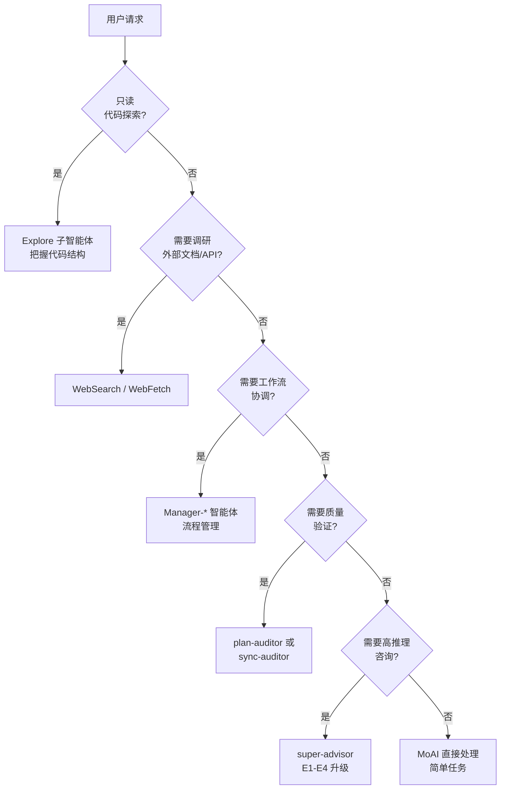

详细介绍 MoAI-ADK v3.0 的 10 个核心智能体目录。


**一句话总结**：智能体是各领域的 **专家团队**。MoAI 作为团队负责人把任务分派给合适的专家 — 并且制定计划的智能体与审计它的智能体必须分离。


## 什么是智能体？

智能体是专注于特定领域的 **AI 任务执行者**。

它基于 Claude Code 的 **Sub-agent（子智能体）** 系统，每个智能体拥有独立的上下文窗口、自定义系统提示词、特定工具访问权以及独立权限。

用公司组织来类比：MoAI 是 CEO，Manager 智能体是部门负责人，Evaluator 智能体是质量监察官，Builder 智能体是新团队组建负责人，Advisor 智能体则是外部顾问。

智能体数量在 v3 期间经历了 22 → 17 → 8 → **10** 的精炼。智能体并非越多越好 — 每一次委派都有上下文成本，因此缩减目录本身就是代币经济学的一部分。

## MoAI 编排器

MoAI 是 MoAI-ADK 的 **最高层协调者**。它分析用户请求，并把任务委派给合适的智能体。

### MoAI 的核心规则

| 规则 | 说明 |
|------|------|
| 只做委派 | 复杂任务不亲自执行，委派给专业智能体 |
| 用户窗口 | 与用户的交互只由 MoAI 进行（子智能体不可） |
| 并行执行 | 独立的只读任务同时委派给多个智能体 |
| 结果整合 | 汇总智能体执行结果并向用户汇报 |

## 10 个核心智能体目录

MoAI-ADK 使用 **10 个核心智能体**（9 个 MoAI 自定义 + 1 个 Anthropic 内置）。

### Manager 智能体（5 个）

| 智能体 | 角色 | 阶段 | 主要技能 |
|----------|------|------|----------|
| `manager-spec` | 生成 SPEC 文档、GEARS 格式需求 | Plan | `moai-workflow-spec` |
| `manager-develop` | DDD/TDD/autofix 循环实现（quality.yaml 的 cycle_type） | Run | `moai-workflow-ddd`, `moai-workflow-tdd` |
| `manager-docs` | 文档生成、CHANGELOG、README 同步 | Sync | `moai-workflow-project` |
| `manager-git` | PR 创建、Git 分支、合并策略 | PR (Tier L) | `moai-foundation-core` |
| `manager-design` | Claude Design 双向协作（D1-D5 管线） | Design | `moai-foundation-core` |

### Evaluator 智能体（2 个）

| 智能体 | 角色 | 评估对象 | 主要技能 |
|----------|------|---------|----------|
| `plan-auditor` | Plan 阶段独立审计、GEARS 遵循、偏差防范 | SPEC 完成度 | `moai-foundation-core`, `moai-foundation-thinking` |
| `sync-auditor` | Sync 阶段质量评分（4 维：Functionality、Security、Craft、Consistency） | 实现质量 | `moai-foundation-quality`, `moai-foundation-core` |

核心在于计划与审计是分离的 — 做的人不检查自己的工作。

### Builder 智能体（1 个）

| 智能体 | 角色 | 产物 |
|----------|------|--------|
| `builder-harness` | 生成项目专属的动态智能体团队（基于苏格拉底式访谈） | `.claude/agents/harness/`, `.moai/harness/manifest.json` |

### Advisor 智能体（1 个）

| 智能体 | 角色 | 特点 |
|----------|------|------|
| `super-advisor` | 高推理咨询 — 僵局、设计决策点、第二意见（E1-E4 升级） | 非约束性处方 — 最终决定权在编排器 |

### 内置智能体（1 个，Anthropic）

| 智能体 | 角色 | 特点 |
|----------|------|------|
| `Explore` | 只读代码探索与分析 | Haiku 模型、只读工具 |

## Manager-Develop 领域上下文注入

MoAI-ADK 不为每个领域各设一个智能体，而是由 `manager-develop` 一个智能体在被调用时注入按领域的上下文。

- **后端任务**：`manager-develop` + 后端领域上下文 + `moai-domain-backend` 技能
- **前端任务**：`manager-develop` + 前端领域上下文 + `moai-domain-frontend` 技能
- **其他领域**：按语言的技能 + 专业性提示词

## 智能体选择决策树

MoAI 分析用户请求并选择合适智能体的过程如下。


```mermaid
flowchart TD
    START[用户请求] --> Q1{只读<br>代码探索?}

    Q1 -->|是| EXPLORE["Explore 子智能体<br>把握代码结构"]
    Q1 -->|否| Q2{需要调研<br>外部文档/API?}

    Q2 -->|是| WEB["WebSearch / WebFetch"]
    Q2 -->|否| Q3{需要工作流<br>协调?}

    Q3 -->|是| MANAGER["Manager-* 智能体<br>流程管理"]
    Q3 -->|否| Q4{需要质量<br>验证?}

    Q4 -->|是| EVAL["plan-auditor 或<br>sync-auditor"]
    Q4 -->|否| Q5{需要高推理<br>咨询?}

    Q5 -->|是| ADVISOR["super-advisor<br>E1-E4 升级"]
    Q5 -->|否| DIRECT["MoAI 直接处理<br>简单任务"]
```

## 智能体定义文件

9 个 MoAI 自定义智能体以 Markdown 文件的形式定义在 `.claude/agents/moai/` 目录中。

### 文件结构

```
.claude/agents/moai/
├── manager-spec.md
├── manager-develop.md
├── manager-docs.md
├── manager-git.md
├── manager-design.md
├── plan-auditor.md
├── sync-auditor.md
├── builder-harness.md
├── super-advisor.md
└── (Explore: Anthropic 内置，无文件)
```

### 智能体定义格式

```markdown
---
name: my-specialist
description: >
  本项目的专家。描述特定领域的专业性。
tools: Read, Write, Edit, Grep, Glob, Bash
model: inherit
---

你是本项目的 [领域] 专家。

## 角色

- 职责 1
- 职责 2
- 职责 3

## 使用技能

- moai-domain-[domain]
- 按语言的技能
```

## 智能体间协作模式

### Plan-Run-Sync 顺序工作流

最基础的协作流程。每个阶段之间都插入独立审计。

```bash
# 1. manager-spec 生成 SPEC
/moai plan "功能描述"

# 2. plan-auditor 验证 SPEC 质量
# (自动执行)

# 3. manager-develop 进行 DDD/TDD 实现
/moai run SPEC-XXX

# 4. sync-auditor 给出 4 维质量评分
# (自动执行)

# 5. manager-docs 同步文档
/moai sync SPEC-XXX
```

## Sub-agent 系统基础

Claude Code 官方的 Sub-agent 系统是 MoAI-ADK 智能体结构的基石。

### Sub-agent 的特点

| 特点 | 说明 |
|------|------|
| **独立上下文** | 每个 sub-agent 在自己的 200K 代币上下文窗口中运行 |
| **自定义提示词** | 用专业系统提示词定义角色与行为 |
| **特定工具访问** | 只选择性地提供所需工具 |
| **独立权限** | 可单独设置权限模式 |

### Sub-agent 约束

| 约束 | 说明 |
|------|------|
| 子智能体生成限制 | 子智能体的嵌套生成由是否允许 `Agent` 工具控制 — MoAI 智能体不做嵌套 |
| AskUserQuestion 限制 | 子智能体不能直接与用户交互（以 blocker 报告返回） |
| 技能不继承 | 不继承父对话的技能 |
| 独立上下文 | 每个智能体拥有独立的 200K 代币上下文 |

## Agent Teams 静态层 — 在 v3.0 退役

先前版本中的 Agent Teams 静态编排层（`workflow.team.*` 配置、`--team` 强制标志）在 v3.0.0-rc11 中 **退役**。

- 强制 `--team` 时会提示 `MODE_TEAM_UNAVAILABLE` 并自动回退到 sub-agent 模式。
- 需要并行性的调研、审查任务用并行 sub-agent 扇出处理；顺序编码任务用 sub-agent 链处理。
- 原生 Claude Code teammate 运行时（`moai cg` 的 GLM pane、`moai worktree --team`）与此无关，继续正常工作 — 从代币经济学的角度看，CG 模式的 Claude 领队 + GLM 工作者分工承担了这一角色。

## 相关文档

- [构建器智能体与 Harness v4](/zh/advanced/builder-agents) - 动态智能体团队生成
- [技能指南](/zh/advanced/skill-guide) - 智能体使用的技能体系
- [基于 SPEC 的开发](/zh/workflow-commands/moai-plan) - SPEC 工作流详解


**提示**：不需要手动指定智能体。用自然语言向 MoAI 提出请求，Analyze-First 路由会分析意图并自动选择最合适的智能体。

