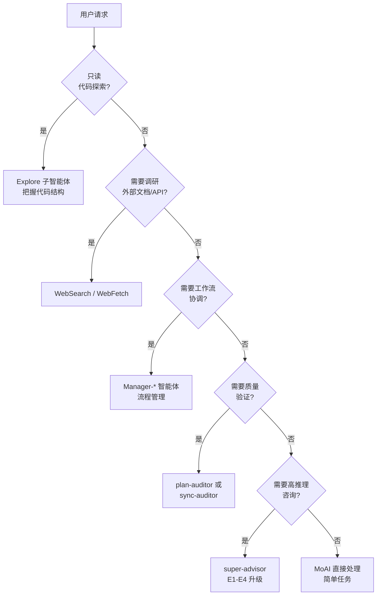
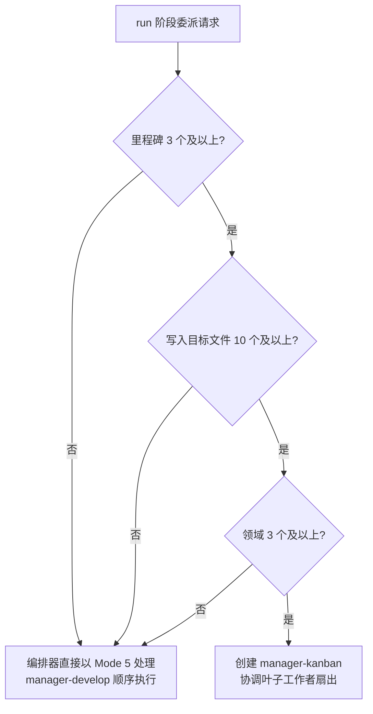
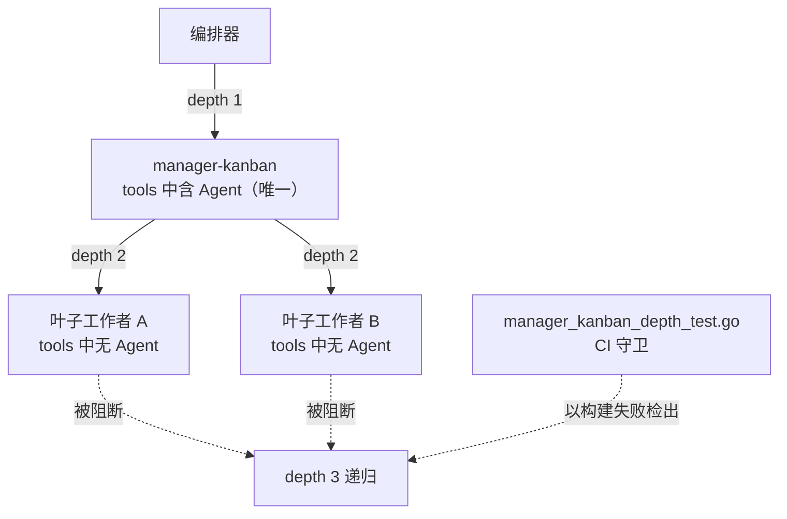
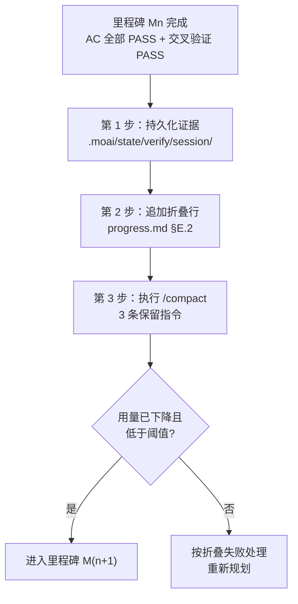
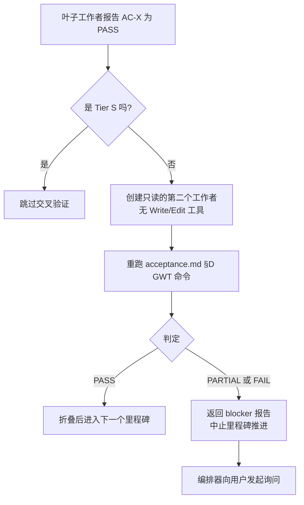

详细介绍 MoAI-ADK v3.0 的 12 个核心智能体目录。


**一句话总结**：智能体是各领域的 **专家团队**。MoAI 作为团队负责人把任务分派给合适的专家 — 并且制定计划的智能体与审计它的智能体必须分离。



平台层的背景说明见 [子智能体](/zh/claude-code/agentic/sub-agents)。本页是 MoAI-ADK 视角的说明。


## 什么是智能体？

智能体是专注于特定领域的 **AI 任务执行者**。

它基于 Claude Code 的 **Sub-agent（子智能体）** 系统，每个智能体拥有独立的上下文窗口、自定义系统提示词、特定工具访问权以及独立权限。

用公司组织来类比：MoAI 是 CEO，Manager 智能体是部门负责人，Evaluator 智能体是质量监察官，Builder 智能体是新团队组建负责人，Advisor 智能体则是外部顾问。

智能体数量在 v3 期间经历了 22 → 17 → 8 → 10 → **11** 的精炼。智能体并非越多越好 — 每一次委派都有上下文成本，因此缩减目录本身就是代币经济学的一部分。

## MoAI 编排器

MoAI 是 MoAI-ADK 的 **最高层协调者**。它分析用户请求，并把任务委派给合适的智能体。

### MoAI 的核心规则

| 规则 | 说明 |
|------|------|
| 只做委派 | 复杂任务不亲自执行，委派给专业智能体 |
| 用户窗口 | 与用户的交互只由 MoAI 进行（子智能体不可） |
| 并行执行 | 独立的只读任务同时委派给多个智能体 |
| 结果整合 | 汇总智能体执行结果并向用户汇报 |

## 12 个核心智能体目录

MoAI-ADK 使用 **12 个核心智能体**（11 个 MoAI 自定义 + 1 个 Anthropic 内置）。

### Manager 智能体（6 个）

| 智能体 | 角色 | 阶段 | 模型 / effort | 主要技能 |
|----------|------|------|---------------|----------|
| `manager-spec` | 生成 SPEC 文档、GEARS 格式需求 | Plan | inherit / medium  | `moai-workflow-spec` |
| `manager-develop` | DDD/TDD/autofix 循环实现（quality.yaml 的 cycle_type） | Run | inherit / medium  | `moai-workflow-ddd`, `moai-workflow-tdd` |
| `manager-docs` | 文档生成、CHANGELOG、README 同步 | Sync | inherit / low  | `moai-workflow-project` |
| `manager-git` | PR 创建、Git 分支、合并策略 | PR (Tier L) | sonnet / low  | `moai-foundation-core` |
| `manager-design` | Claude Design 双向协作（D1-D5 管线） | Design | inherit / medium  | `moai-foundation-core` |
| `manager-kanban` | 层级团队 Tier L 协调（唯一 Agent-carrier，depth-2 封闭） | Run (Tier L) | inherit / xhigh  | `moai-foundation-core`, `moai-workflow-project` |

### Evaluator 智能体（2 个）

| 智能体 | 角色 | 评估对象 | 模型 / effort | 主要技能 |
|----------|------|---------|---------------|----------|
| `plan-auditor` | Plan 阶段独立审计、GEARS 遵循、偏差防范 | SPEC 完成度 | inherit / medium  | `moai-foundation-core`, `moai-foundation-thinking` |
| `sync-auditor` | Sync 阶段质量评分（4 维：Functionality、Security、Craft、Consistency） | 实现质量 | inherit / medium  | `moai-foundation-quality`, `moai-foundation-core` |

核心在于计划与审计是分离的 — 做的人不检查自己的工作。审计智能体以怀疑立场（fresh-judgment）介入，分数按调和平均而非简单平均计算，一个维度塌了整体分数就跟着掉——这种设计正是 TRUST 5 质量框架所支撑的信任。

### Builder 智能体（1 个）

| 智能体 | 角色 | 模型 / effort | 产物 |
|----------|------|---------------|--------|
| `builder-harness` | 生成项目专属的动态智能体团队（基于苏格拉底式访谈） | inherit / medium  | `.claude/agents/harness/`, `.moai/harness/manifest.json` |

### Advisor 智能体（1 个）

| 智能体 | 角色 | 模型 / effort | 特点 |
|----------|------|---------------|------|
| `super-advisor` | 高推理咨询 — 僵局、设计决策点、第二意见（E1-E4 升级） | inherit / high  | 非约束性处方 — 最终决定权在编排器 |

### Specialist 智能体（1 个）

| 智能体 | 角色 | 模型 / effort | 特点 |
|----------|------|---------------|------|
| `e2e-tester` | 网页/移动/桌面 E2E 测试执行（旅程脚本、CLI 优先套件执行、产物管理） | inherit / low  | `/moai e2e` 工作流的执行主体 — 选择问题由编排器负责 |

### 内置智能体（1 个，Anthropic）

| 智能体 | 角色 | 模型 / effort | 特点 |
|----------|------|---------------|------|
| `Explore` | 只读代码探索与分析 | sonnet / low（调用时默认值） | 只读工具；磁盘上没有智能体文件，因此 effort 在 spawn 提示词中说明，而非固定在 frontmatter 中 |


**4 级 token 成本层级**（ max ·  high ·  medium ·  low）：`model: inherit` 继承父会话模型，effort 决定推理 token 的预算。

上表数值是**随附的 frontmatter**，它固定在[配置矩阵](/zh/advanced/profile-matrix/)的 `medium` 列上，使全新部署与默认配置文件保持一致。切换配置文件会重写这些数值 — 在 `high` 下，`manager-develop` 与 `super-advisor` 移到 `max`（仅这两格使用它），在 `low` 下代理式行降到 `low`，同时 `manager-docs` 与 `e2e-tester` 回退到 Sonnet。可用 `moai model profile` 查看活动配置文件下解析出的数值。


## Manager-Develop 领域上下文注入

MoAI-ADK 不为每个领域各设一个智能体，而是由 `manager-develop` 一个智能体在被调用时注入按领域的上下文。

- **后端任务**：`manager-develop` + 后端领域上下文 + `moai-domain-backend` 技能
- **前端任务**：`manager-develop` + 前端领域上下文 + `moai-domain-frontend` 技能
- **其他领域**：按语言的技能 + 专业性提示词

## 智能体选择决策树

MoAI 分析用户请求并选择合适智能体的过程如下。


```mermaid
flowchart TD
    START[用户请求] --> Q1{只读<br>代码探索?}

    Q1 -->|是| EXPLORE["Explore 子智能体<br>把握代码结构"]
    Q1 -->|否| Q2{需要调研<br>外部文档/API?}

    Q2 -->|是| WEB["WebSearch / WebFetch"]
    Q2 -->|否| Q3{需要工作流<br>协调?}

    Q3 -->|是| MANAGER["Manager-* 智能体<br>流程管理"]
    Q3 -->|否| Q4{需要质量<br>验证?}

    Q4 -->|是| EVAL["plan-auditor 或<br>sync-auditor"]
    Q4 -->|否| Q5{需要高推理<br>咨询?}

    Q5 -->|是| ADVISOR["super-advisor<br>E1-E4 升级"]
    Q5 -->|否| DIRECT["MoAI 直接处理<br>简单任务"]
```

## 分层团队 — manager-kanban 的运作原理

`manager-kanban` 是专门用于协调 Tier L 规模 run 阶段的智能体。它自己不写代码，而是把工作拆成若干里程碑交给叶子工作者（leaf worker），并在每个里程碑边界折叠上下文、执行交叉验证。叶子工作者通过 `Agent(general-purpose)` 按需创建，运行在 worktree 隔离的分支上，因此各自的写入面互不重叠。

这条委派路径是 Mode 5（顺序子智能体）的一种变体，并非新的执行模式。它与已退役的 Agent Teams 静态层也没有关系 —— Mode 3 的墓碑标记与 `MODE_TEAM_UNAVAILABLE` 行为保持不变。

### 进入条件 — 三项必须同时成立

只有当下面三个条件**全部**成立时，编排器才会创建 `manager-kanban`。只要有一项不达标，编排器就以 Mode 5 自行顺序处理各里程碑。给达不到门槛的工作套上 `manager-kanban`，只会增加永远收不回来的协调成本。

| 维度 | 门槛 |
|------|------|
| 里程碑数量 | plan.md §F 里程碑列表中 3 个及以上 |
| 文件面 | 所有里程碑的写入目标合计 10 个及以上 |
| 领域跨度 | 3 个及以上互不相同的领域（例如后端 + 前端 + devops） |

这三个条件是 AND 而非 OR。门槛刻意收得很窄，为的是不把只涉及单一维度的工作卷进来 —— 比如单个里程碑的 10 文件重构。编排器会先把三项条件均已满足的判定记录到 `progress.md` § Mode Selection，然后再创建。


```mermaid
flowchart TD
    START["run 阶段委派请求"] --> Q1{"里程碑 3 个及以上?"}
    Q1 -->|"否"| MODE5["编排器直接以 Mode 5 处理<br>manager-develop 顺序执行"]
    Q1 -->|"是"| Q2{"写入目标文件 10 个及以上?"}
    Q2 -->|"否"| MODE5
    Q2 -->|"是"| Q3{"领域 3 个及以上?"}
    Q3 -->|"否"| MODE5
    Q3 -->|"是"| LEAD["创建 manager-kanban<br>协调叶子工作者扇出"]
```

### depth-2 封印

`manager-kanban` 是目录中**唯一**在 `tools:` 列表里带有 `Agent` 的智能体。其余智能体一律省略 `Agent`，扁平层级正是这样维持的 —— 而这里是唯一开口的地方，且只开一层。因此编排器 → `manager-kanban` 是深度 1，`manager-kanban` → 叶子工作者是深度 2，深度 3 永远不会出现。

叶子工作者的 `tools:` 列表在创建时下发，其中始终不含 `Agent`。今后即便把叶子工作者定义成文件，只要它通过 frontmatter 字段 `leaf_of: manager-kanban` 或正文标记 `<!-- manager-kanban leaf-worker -->` 声明自身，`internal/template/manager_kanban_depth_test.go` 中的 CI 守卫就会检查该文件的 `tools:` 是否含有 `Agent`，若有则让构建失败。


这道封印是 **MoAI 的策略不变式，而非运行时不变式**。Claude Code 运行时本身允许更深的递归 —— 自 v2.1.219 起嵌套创建默认开启，默认深度上限为 3。既然运行时不会拦，真正把深度按住的只有两样东西：在 `tools:` 中省略 `Agent` 的惯例，以及上面那道 CI 守卫。



```mermaid
flowchart TD
    ORCH["编排器"] -->|"depth 1"| LEAD["manager-kanban<br>tools 中含 Agent（唯一）"]
    LEAD -->|"depth 2"| W1["叶子工作者 A<br>tools 中无 Agent"]
    LEAD -->|"depth 2"| W2["叶子工作者 B<br>tools 中无 Agent"]
    W1 -.->|"被阻断"| X["depth 3 递归"]
    W2 -.->|"被阻断"| X
    GUARD["manager_kanban_depth_test.go<br>CI 守卫"] -.->|"以构建失败检出"| X
```

### 上下文折叠三步

当里程碑 Mn 的所有 AC 行都是 PASS、且这些行的交叉验证同样返回 PASS 后，`manager-kanban` 会在进入下一个里程碑之前走完三步。该流程**只组合已有工具** —— 不新增 Go 代码，不新增钩子，也不新增 CLI 子命令。

1. **持久化证据** —— 把每个 AC 的验证命令输出重定向到 `.moai/state/verify/<session>/M<n>.<AC-id>.{log,out}`。不使用 `/tmp`，因为操作系统会清空它。只有审计时这个路径确实能打开，所引用的证据才算有效。未能采集到证据的 AC 标记为 `GAP`，而不是 `PASS`。
2. **追加折叠行** —— 按既有行格式在 `progress.md` §E.2 追加一行：`M<n>: <AC-id-1>=PASS, ... | evidence: .moai/state/verify/<session>/M<n>.* | fold-at: <ISO-8601>`。`M<n>:` 前缀是特意选来避免与 `internal/spec/era.go` 中 §E 标题匹配器冲突的，因此两者无需改动匹配器即可共存。
3. **执行 `/compact`** —— 压缩时明确给出保留指令：retain-current-milestone（刚完成的里程碑及其折叠行）、retain-fold-rows（§E.2 中此前的全部折叠行）、retain-armed-goal（若通过 `/moai goal` 挂载了条件，则保留该条件）。

折叠之后有两条不变式：压缩后的 token 用量必须低于压缩前，并且同时低于按模型划分的移交阈值（1M 级别为 50%，200K/256K 级别为 90%）。若用量没有下降，就按折叠失败处理并重新规划。当子智能体上下文中无法使用 `/compact` 时，返回 blocker 报告，由编排器代为压缩，或改走 `/clear` 加恢复消息的路径绕开。


```mermaid
flowchart TD
    MN["里程碑 Mn 完成<br>AC 全部 PASS + 交叉验证 PASS"] --> S1["第 1 步：持久化证据<br>.moai/state/verify/session/"]
    S1 --> S2["第 2 步：追加折叠行<br>progress.md §E.2"]
    S2 --> S3["第 3 步：执行 /compact<br>3 条保留指令"]
    S3 --> CHECK{"用量已下降且<br>低于阈值?"}
    CHECK -->|"是"| NEXT["进入里程碑 M(n+1)"]
    CHECK -->|"否"| REPLAN["按折叠失败处理<br>重新规划"]
```

### peer 交叉验证

当叶子工作者把某个 AC 标记为 PASS 时，`manager-kanban` 会创建第二个只读的 `Agent(general-purpose)`，且这个工作者**没有做过那份工作**。只读通过在 `tools:` 中省略 Write/Edit/NotebookEdit 来强制。该工作者原样重跑 `acceptance.md` §D 中的 Given-When-Then 命令，并返回 `PASS` / `PARTIAL` / `FAIL` 三者之一。

第二个工作者对作者的说法没有任何利害关系。正因如此，诸如把 grep 结果数错、引用过时的 baseline、漏跑一条验证命令这类自我报告失效，才会暴露出来。

一旦出现 `FAIL` 或 `PARTIAL`，`manager-kanban` 就不会推进到下一个里程碑，而是向编排器返回一份 blocker 报告，其中包含 AC ID、作者给出的证据、交叉验证工作者的证据，以及两者出现分歧的地方。向用户提问是编排器的职责 —— 子智能体不使用用户通道。Tier S 跳过交叉验证（范围小到验证成本高于收益）。

它与 sync 阶段的 `sync-auditor` 角色不同。`sync-auditor` 是实现完成后给出 4 维评分的最终怀疑式判读；peer 交叉验证则是实现过程中挂在每一个 AC 上的二元判定。两者互不替代。


```mermaid
flowchart TD
    AUTHOR["叶子工作者报告 AC-X 为 PASS"] --> TIER{"是 Tier S 吗?"}
    TIER -->|"是"| SKIP["跳过交叉验证"]
    TIER -->|"否"| PEER["创建只读的第二个工作者<br>无 Write/Edit 工具"]
    PEER --> RERUN["重跑 acceptance.md §D GWT 命令"]
    RERUN --> VERDICT{"判定"}
    VERDICT -->|"PASS"| NEXT["折叠后进入下一个里程碑"]
    VERDICT -->|"PARTIAL 或 FAIL"| BLOCK["返回 blocker 报告<br>中止里程碑推进"]
    BLOCK --> ORCH["编排器向用户发起询问"]
```

## 智能体定义文件

10 个 MoAI 自定义智能体以 Markdown 文件的形式定义在 `.claude/agents/moai/` 目录中。

### 文件结构

```
.claude/agents/moai/
├── manager-spec.md
├── manager-develop.md
├── manager-docs.md
├── manager-git.md
├── manager-design.md
├── plan-auditor.md
├── sync-auditor.md
├── builder-harness.md
├── super-advisor.md
├── e2e-tester.md
└── (Explore: Anthropic 内置，无文件)
```

### 智能体定义格式

```markdown
---
name: my-specialist
description: >
  本项目的专家。描述特定领域的专业性。
tools: Read, Write, Edit, Grep, Glob, Bash
model: inherit
---

你是本项目的 [领域] 专家。

## 角色

- 职责 1
- 职责 2
- 职责 3

## 使用技能

- moai-domain-[domain]
- 按语言的技能
```

## 智能体间协作模式

### Plan-Run-Sync 顺序工作流

最基础的协作流程。每个阶段之间都插入独立审计。

```bash
# 1. manager-spec 生成 SPEC
/moai plan "功能描述"

# 2. plan-auditor 验证 SPEC 质量
# (自动执行)

# 3. manager-develop 进行 DDD/TDD 实现
/moai run SPEC-XXX

# 4. sync-auditor 给出 4 维质量评分
# (自动执行)

# 5. manager-docs 同步文档
/moai sync SPEC-XXX
```

## Sub-agent 系统基础

Claude Code 官方的 Sub-agent 系统是 MoAI-ADK 智能体结构的基石。

### Sub-agent 的特点

| 特点 | 说明 |
|------|------|
| **独立上下文** | 每个 sub-agent 在自己的 200K 代币上下文窗口中运行 |
| **自定义提示词** | 用专业系统提示词定义角色与行为 |
| **特定工具访问** | 只选择性地提供所需工具 |
| **独立权限** | 可单独设置权限模式 |

### Sub-agent 约束

| 约束 | 说明 |
|------|------|
| 子智能体生成限制 | 子智能体的嵌套生成由是否允许 `Agent` 工具控制 — MoAI 智能体不做嵌套 |
| AskUserQuestion 限制 | 子智能体不能直接与用户交互（以 blocker 报告返回） |
| 技能不继承 | 不继承父对话的技能 |
| 独立上下文 | 每个智能体拥有独立的 200K 代币上下文 |

## Agent Teams 静态层 — 在 v3.0 退役

先前版本中的 Agent Teams 静态编排层（`workflow.team.*` 配置、`--team` 强制标志）在 v3.0.0 中 **退役**。

- 强制 `--team` 时会提示 `MODE_TEAM_UNAVAILABLE` 并自动回退到 sub-agent 模式。
- 需要并行性的调研、审查任务用并行 sub-agent 扇出处理；顺序编码任务用 sub-agent 链处理。
- 原生 Claude Code teammate 运行时（`moai cg` 的 GLM pane、`moai worktree --team`）与此无关，继续正常工作 — 从代币经济学的角度看，CG 模式的 Claude 领队 + GLM 工作者分工承担了这一角色。

## 相关文档

- [构建器智能体与 Harness v4](/zh/advanced/builder-agents) - 动态智能体团队生成
- [技能指南](/zh/advanced/skill-guide) - 智能体使用的技能体系
- [基于 SPEC 的开发](/zh/workflow-commands/moai-plan) - SPEC 工作流详解


**提示**：不需要手动指定智能体。用自然语言向 MoAI 提出请求，Analyze-First 路由会分析意图并自动选择最合适的智能体。

