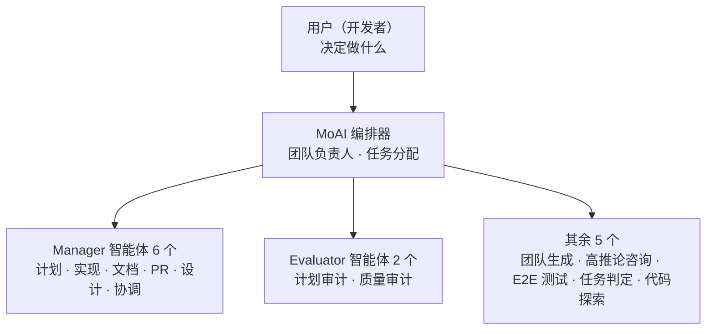
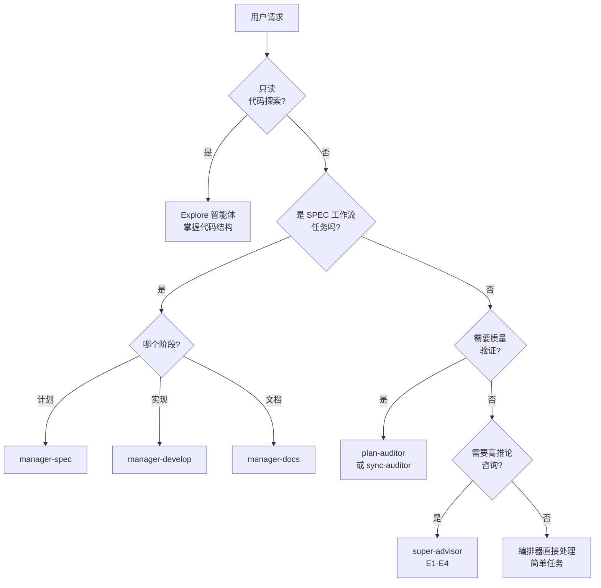
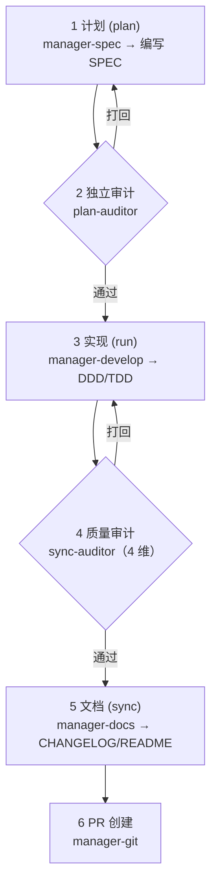
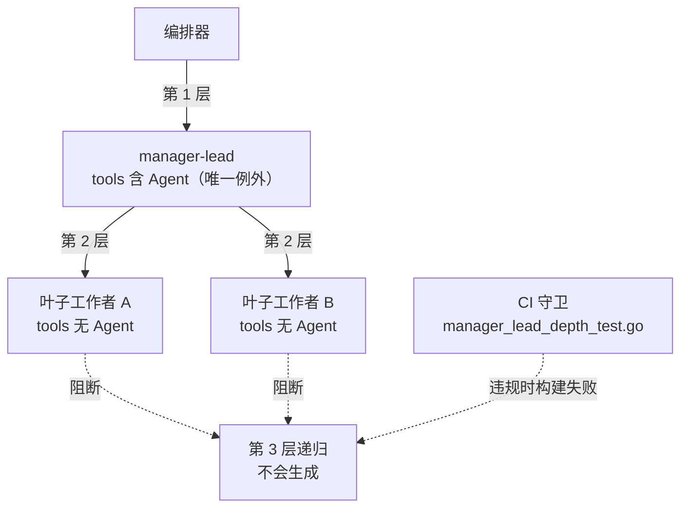

本页从零开始、按部就班地介绍 MoAI-ADK 使用的 13 个智能体（自驱工作的 AI 助手）目录。它把"智能体是什么、为什么要用多个、如何协作"讲得足够清楚，可以讲给朋友听。


**一句话总结**：智能体是各领域的专家。MoAI 作为团队负责人把任务交给合适的人选，并且 **制定计划的智能体与审计该计划的智能体永远不是同一个**。这个设计是为了让做的人不给自己的工作打分。


## 什么是智能体？

智能体是专注于特定领域的 AI 任务执行者。MoAI-ADK 不是让一个巨大的 AI 包揽一切，而是按工作性质拆成多个智能体，每个智能体拥有自己的上下文窗口（记忆空间）、系统指令和工具权限。

套用到公司组织上，这个结构就自然成形了。用户是决定产品的所有者，MoAI 编排器（统筹全部工作的中央指挥者）是团队负责人，Manager 智能体是各部门主管，Evaluator 智能体是质量监察员。这个类比会原样映射到结构上。

```mermaid
flowchart TD
    USER["用户（开发者）<br>决定做什么"] --> MOAI["MoAI 编排器<br>团队负责人 · 任务分配"]
    MOAI --> MGR["Manager 智能体 6 个<br>计划 · 实现 · 文档 · PR · 设计 · 协调"]
    MOAI --> EVAL["Evaluator 智能体 2 个<br>计划审计 · 质量审计"]
    MOAI --> ETC["其余 5 个<br>团队生成 · 高推论咨询 · E2E 测试 · 任务判定 · 代码探索"]
```

所有智能体都运行在 Claude Code 的 Sub-agent（子智能体）系统之上。每个子智能体都拥有独立的上下文窗口、定制的系统指令、精选的工具和单独的权限。MoAI-ADK 把 13 个专业角色架在这个地基之上。

## 为什么用多个智能体

一个智能体包办一切看似方便，但在实际工作中质量和成本会一起垮掉。

第一是 **质量**。如果制定计划的智能体还要判定计划执行得好不好，它很容易对自己的工作手下留情。人也是一样——自己校对自己写的文章，错误往往看不出来。所以 MoAI-ADK 从设计阶段就把负责计划与实现的 Manager 系和负责检查结果的 Evaluator 系分开。

第二是 **成本**。每个智能体都要重新填充上下文并运行推理，每一次委派都要花代币。"越多越好"并不成立。目录在 v3 周期里经历了 22 → 17 → 8 → 10 → 12 → 13 的精炼，如今保持在各角色互不重叠的最小规模。缩减智能体数量本身就是代币经济学（把代币用在刀刃上）的一部分。


本页反复用到的四个词，先在这里理清。

- **智能体**（自驱工作的 AI 助手）—— 承担特定领域工作的 AI 执行者
- **线束**（自动化的质量检验装置）—— 让智能体好好干活的规则与门禁
- **技能**（可复用的工作说明书集合）—— 智能体调用使用的领域知识集合
- **SPEC**（需求规格说明书）—— 写明做什么、为什么做、怎么做的文档


## MoAI 编排器 — 团队负责人

MoAI 编排器是最高层的协调者：接收用户请求、分析意图（Analyze-First 路由）、把工作委派给合适的智能体，然后汇拢结果并向用户汇报。它的核心规则是复杂工作不亲自做，而是委派出去。

| 规则 | 做什么 |
|------|--------|
| 只做委派 | 复杂工作交给专业智能体 |
| 单一窗口 | 只有编排器与用户对话；子智能体不会向用户搭话 |
| 并行执行 | 互不依赖的只读任务同时委派给多个智能体 |
| 结果整合 | 汇总智能体的结果并向用户报告 |

编排器调用哪个智能体，默认由 `.moai/config/sections/delegation.yaml` 中的委派映射（delegation map）决定。但这张映射只是默认值而非壁垒——编排器可以根据工作语境自行判断并改变它。

## 13 个智能体目录

MoAI-ADK 使用 **13 个智能体**（12 个 MoAI 自定义 + 1 个 Anthropic 内置 `Explore`）。以下是按角色归类的完整清单。

### Manager 智能体 — 6 个

产出实际交付物的主力部队。各自承担 SPEC 工作流的一个阶段。

| 智能体 | 担任的工作 | 阶段 |
|----------|--------|------|
| `manager-spec` | 撰写 SPEC 文档，把需求整理成合规的形态 | 计划 |
| `manager-develop` | 通过 DDD/TDD/autofix 循环实现代码 | 实现 |
| `manager-docs` | CHANGELOG · README · frontmatter 同步 | 文档 |
| `manager-git` | PR 创建、分支策略、合并 | PR |
| `manager-design` | 与设计工具双向交换设计方案 | 设计 |
| `manager-lead` | 按里程碑协调 Tier L 规模的实现 | 实现 (Tier L) |

### Evaluator 智能体 — 2 个

由不是做的人的智能体来检查。这道分离是质量的主心骨。

| 智能体 | 评估对象 | 时机 |
|----------|----------|------|
| `plan-auditor` | SPEC 完成度、需求规则遵循情况、偏差 | 计划完成后立即 |
| `sync-auditor` | 实现质量的 4 维评分（功能 · 安全 · 手艺 · 一致性） | 文档阶段 |

### Builder · Advisor · Specialist 智能体 — 4 个

| 智能体 | 担任的工作 |
|----------|--------|
| `builder-harness` | 创建项目专属的动态智能体团队（基于用户访谈） |
| `super-advisor` | 高推论咨询——僵局、设计决策点、第二意见（E1-E4 升级） |
| `e2e-tester` | 执行网页/移动/桌面 E2E 测试 |
| `manager-todo` | 管理待办队列（队列生命周期、`/moai:todo --auto` 串行循环、调度指导）；其只读判定子角色读取已批准 GTD 自动任务的封存快照，只返回一条结构化判定（只读） |

在其只读判定子角色中，`manager-todo` 只返回判定，**自己不执行任何事**。它不写文件、不跑 shell 或 Git 命令、不碰队列、不向泳道派活，也不做提交、合并、批准或审计判定。检查返回的判定并真正改变状态的，是确定性执行器（只按既定规则行动的自动处理器）。它的工具清单只有 `Read`、`Grep`、`Glob`、`Skill` 四项；一旦请求超出封存范围，或判定所需的证据缺失、过期，它就返回 blocker 判定。


`manager-todo` 在下面的[智能体选择决策树](#智能体选择决策树)中 **有意没有位置**。它不是编排器挑选后调用的智能体，其判定子角色是由 GTD 自动任务工作流直接调用的判定角色。它没出现在决策树里是设计使然，并非遗漏。


### 内置智能体 — 1 个

| 智能体 | 担任的工作 |
|----------|--------|
| `Explore` | 只读代码探索 · 分析（Anthropic 内置，无文件） |


按智能体逐一分配模型和 effort 的旧方式已经退役。**子代理原样沿用主会话的模型与推理深度**——调用子代理时不传 `model` 也不传 `effort`，MoAI 智能体定义对两者都不作声明。更改会话的 effort（`/effort`、`ultrathink`），该会话中的所有智能体都会一并跟随。


## 计划与审计的分离 — 为什么做的人不检查

这条原则是贯穿整个目录的设计哲学。`manager-spec` 写完计划，`plan-auditor` 在另一个上下文里检查；`manager-develop` 完成实现，`sync-auditor` 打出 4 维评分。因为实现的智能体和审计的智能体不是同一个，数错 grep 结果、引用过时 baseline、漏跑一步验证这类自我报告失效，会在检查那一侧浮出水面。

审计智能体以 fresh-judgment（怀疑立场）介入——每条主张都怀疑到证据出现为止，只承认可复现的结果，不承认"看起来过了"。评分用调和平均而非简单平均计算，一个维度塌了整体分数就跟着掉。这道设计撑起了 TRUST 5 质量框架的信任。

## 领域专业性如何注入

MoAI-ADK 不为后端、前端、安全等领域各设一个智能体，而是由 `manager-develop` 一个智能体在被调用时按工作语境注入领域知识与技能。

- 后端工作 → `manager-develop` + 后端上下文 + `moai-domain-backend` 技能
- 前端工作 → `manager-develop` + 前端上下文 + `moai-domain-frontend` 技能
- 其他领域 → 对应语言的技能 + 专业性指令

这样目录保持在 13 个的小规模，领域深度靠技能注入来补足。不靠增加智能体数量去抬高代币成本，而是换装技能（可复用的工作说明书集合）。

## 智能体选择决策树

这是编排器接到请求后决定调用哪个智能体的流程。大多数时候 Analyze-First 路由仅凭自然语言意图就能分类，所以用户几乎不需要亲自指定智能体。

```mermaid
flowchart TD
    START["用户请求"] --> Q1{"只读<br>代码探索?"}
    Q1 -->|"是"| EXPLORE["Explore 智能体<br>掌握代码结构"]
    Q1 -->|"否"| Q2{"是 SPEC 工作流<br>任务吗?"}
    Q2 -->|"是"| Q3{"哪个阶段?"}
    Q3 -->|"计划"| SPEC["manager-spec"]
    Q3 -->|"实现"| DEV["manager-develop"]
    Q3 -->|"文档"| DOCS["manager-docs"]
    Q2 -->|"否"| Q4{"需要质量<br>验证?"}
    Q4 -->|"是"| EV["plan-auditor<br>或 sync-auditor"]
    Q4 -->|"否"| Q5{"需要高推论<br>咨询?"}
    Q5 -->|"是"| ADV["super-advisor<br>E1-E4"]
    Q5 -->|"否"| DIRECT["编排器直接处理<br>简单任务"]
```

## 协作的顺序 — Plan-Run-Sync

展示智能体实际如何衔接的基本流程。关键在于阶段与阶段之间插着独立审计。用户用 `/moai plan`、`/moai run`、`/moai sync` 推进这条流程。

```mermaid
flowchart TD
    PLAN["1 计划 (plan)<br>manager-spec → 编写 SPEC"] --> A1{"2 独立审计<br>plan-auditor"}
    A1 -->|"打回"| PLAN
    A1 -->|"通过"| RUN["3 实现 (run)<br>manager-develop → DDD/TDD"]
    RUN --> A2{"4 质量审计<br>sync-auditor（4 维）"}
    A2 -->|"打回"| RUN
    A2 -->|"通过"| SYNC["5 文档 (sync)<br>manager-docs → CHANGELOG/README"]
    SYNC --> PR["6 PR 创建<br>manager-git"]
```

审计打回就退回上一个阶段。这种"往回走"把返工成本提前——质量问题在各阶段刚结束就被抓住，而不是拖到 PR 前。这就避免了同一个错误流进下一个阶段、变成昂贵的代价。

## 已退役的智能体与拒绝规则

过去使用的智能体名字可能还留在旧文档或复制来的消息里。以下 12 个名字已经 **退役（archived）**，调用它们会被拒绝生成。

`manager-strategy`、`manager-quality`、`manager-brain`、`manager-project`、`claude-code-guide`（仅限 MoAI 自定义文件）、`researcher`、`expert-backend`、`expert-frontend`、`expert-security`、`expert-devops`、`expert-performance`、`expert-refactoring`。


**注意**：如果从旧会话复制来的恢复消息里带着这些名字，编排器会拒绝生成。这时要么把同样的工作交给附带领域指令的 `Agent(general-purpose)`，要么改用 13 个现役智能体之一。替代路径整理在 `.claude/rules/moai/workflow/archived-agent-rejection.md`。


有一点容易混淆。有一个 Claude Code 内置助手与退役的 MoAI 自定义文件 `claude-code-guide` 同名。调用内置助手不属于拒绝对象——拒绝只作用于 MoAI 自定义文件。

## 分层团队 — manager-lead

`manager-lead` 是专门协调 Tier L 规模实现的智能体。它自己不写代码：把工作拆成里程碑交给叶子工作者（leaf worker），并在每个里程碑边界折叠上下文、交叉运行验证。叶子工作者按需通过 `Agent(general-purpose)` 创建，运行在 worktree 隔离的分支上，写入面互不重叠。

### 只有三个条件全部满足时

编排器只在下面三个条件 **全部（AND）** 成立时才创建 `manager-lead`。缺任何一项，编排器就自己按顺序处理——给不达门槛的工作配协调智能体，只会增加收不回的成本。

| 条件 | 门槛 |
|------|------|
| 里程碑数量 | 3 个及以上 |
| 写入目标文件 | 10 个及以上 |
| 领域跨度 | 3 个及以上互不相同的领域（例如后端 + 前端 + devops） |

三个条件是 AND 而非 OR。这些门槛刻意收得很窄，为的是不把只擦到一条边的工作卷进来——比如单个里程碑的 10 文件重构。

### depth-2 封印 — 层级为什么只开两层

13 个智能体中只有 `manager-lead` 在 `tools:` 列表里带有 `Agent` 工具。其余一律省略 `Agent`，以此维持扁平层级。于是编排器 → `manager-lead` 是第 1 层，`manager-lead` → 叶子工作者是第 2 层，第 3 层永远不会生成。

```mermaid
flowchart TD
    ORCH["编排器"] -->|"第 1 层"| LEAD["manager-lead<br>tools 含 Agent（唯一例外）"]
    LEAD -->|"第 2 层"| W1["叶子工作者 A<br>tools 无 Agent"]
    LEAD -->|"第 2 层"| W2["叶子工作者 B<br>tools 无 Agent"]
    W1 -.->|"阻断"| X["第 3 层递归<br>不会生成"]
    W2 -.->|"阻断"| X
    GUARD["CI 守卫<br>manager_lead_depth_test.go"] -.->|"违规时构建失败"| X
```


这道封印是 **策略不变式，不是运行时不变式**。Claude Code 运行时本身允许更深的递归——自 v2.1.219 起嵌套创建默认开启，默认深度上限为 3。所以真正把深度按住的只有两样：从智能体的 `tools:` 里省略 `Agent` 的惯例，以及在叶子工作者文件里发现 `Agent` 就让构建失败的 CI 守卫。


### 上下文折叠与交叉验证

一个里程碑结束后，进入下一个之前要走三步。先把每条验收标准（AC）的验证输出收进机器本地暂存区，只把决定判定的那几行写进受版本跟踪的判定书 `.moai/reports/<卡片id>/verdict.md`，让它们在审计时打得开——卡片目录里受跟踪的名字只有这份判定书。接着在进度记录里追加一行指名这份判定书的一行式摘要行。最后用 `/compact` 压缩上下文。压缩后代币下降、并落到移交阈值以下（1M 系 50%，200K 系 90%），才进入下一个里程碑——没有下降就按折叠失败处理、重新规划。

当叶子工作者把某条 AC 标记为 PASS 时，会调入一个 **没有做过那份工作** 的第二个工作者，以只读方式（`tools:` 去掉写工具）重跑同样的验证命令。第二个工作者对结果没有利害关系，自我报告失效因此原样暴露。判定不一致时里程碑停下，向编排器返回 blocker 报告——向用户提问是编排器的职责。Tier S 跳过这一步：范围小到交叉验证的成本高于收益。

它与 sync 阶段的 `sync-auditor` 角色不同。`sync-auditor` 是实现完成后给出 4 维评分的最终怀疑式判读；peer 交叉验证是实现过程中挂在每条 AC 上的二元判定。两者互不替代。

## 智能体定义文件

12 个 MoAI 自定义智能体全部以 Markdown 文件形式放在 `.claude/agents/moai/` 目录。`Explore` 是 Anthropic 内置的，磁盘上没有对应文件。


每个文件由 YAML frontmatter 和正文组成。frontmatter 写 `name`、`description`、`tools`（CSV 字符串）；正文用文字写明角色 · 职责 · 使用的技能。model 和 effort 不写——子代理原样沿用会话的模型与推理深度，智能体定义无需声明。要亲手创建新智能体，用 `builder-harness` 智能体，或遵循智能体编写规则（`.claude/rules/moai/development/agent-authoring.md`）。


## Sub-agent 系统基础

MoAI-ADK 智能体结构的地基是 Claude Code 官方的子智能体系统。

| 特点 | 说明 |
|------|------|
| 独立上下文 | 每个智能体在随模型而定的自有上下文窗口中运行 |
| 定制指令 | 专门的系统指令定义角色与行为 |
| 精选工具 | 只挑选需要的工具 |
| 单独权限 | 可以单独设置权限模式 |

子智能体不能直接与用户对话——所需输入缺失时返回 blocker 报告，由编排器询问用户后带着答案重新派出。这道边界守住了"单一窗口"规则。

## 子智能体工具过滤 — 两级

子智能体能用哪些工具，不是由一次设置决定，而是由两级过滤决定：spawn 时的静态允许列表是第 1 级，运行时延迟加载是第 2 级。

**第 1 级 — spawn 时的静态过滤。** 所有智能体定义都在 frontmatter 携带 `tools:` 允许列表（CSV 字符串，例：`tools: Read, Write, Edit`），列表之外的工具无法调用。只读角色靠缩减这份列表本身来构造权限——审计者与交叉验证工作者把写工具（Write、Edit）从列表里拿掉，堵死误改文件的路径。但这是收窄不是封死——`Bash` 若还留在列表里，仍能从那条路写入，所以是否只读要看有没有写入 **能力**，而不是看有没有那几个工具名。

**第 2 级 — 运行时延迟加载。** 部分工具在 spawn 时不会加载 schema。`AskUserQuestion`（向用户询问选项的工具）和 `Task*`（任务列表管理）系列就是如此。这类延迟（deferred）工具必须在需要的时刻用 ToolSearch 的 `select:` 查询显式加载 schema 后才能调用，是在通过第 1 级的工具之上再收窄一道的第二道闸门。

这两级合在一起造就两条规则。

| 规则 | 内容 |
|------|------|
| 向用户提问仅限编排器 | `AskUserQuestion` 只有编排器使用，运行时强制这条边界。需要用户输入的子智能体不发提示，而是返回结构化的 blocker 报告，由编排器询问用户后把答案捎回来重新派出 |
| sweep 子智能体同样不能提问 | 动态工作流（sweep）的子智能体在主会话之下运行，无法向用户发出提示。需要提问时经由编排器的通道进行 |

前文"子智能体不能直接与用户对话"这条规则，正是由这两级过滤在运行时支撑的。

## Agent Teams 静态层 — v3.0 退役后实验性重新允许

先前版本的 Agent Teams 静态编排层（`workflow.team.*` 配置、`--team` 强制标志）在 v3.0.0 退役，之后作为实验性表面重新允许（仅经显式 `--team` 请求选择，不会被自动选择）。退役时期强制 `--team` 会提示 `MODE_TEAM_UNAVAILABLE` 并回退到 sub-agent 模式；该哨兵字符串保留为已文档化的历史。

需要并行性的调研、审查用并行 sub-agent 扇出处理；顺序编码任务用 sub-agent 链处理。CG 已停用。迁移选项请先用 `moai migrate cg` 确认。

## 相关文档

- [构建器智能体与 Harness v4](/zh/advanced/builder-agents) —— 动态智能体团队生成
- [技能指南](/zh/advanced/skill-guide) —— 智能体使用的技能体系
- [基于 SPEC 的开发](/zh/workflow-commands/moai-plan) —— SPEC 工作流详解
- [配置矩阵](/zh/advanced/profile-matrix/) —— 模型 · effort 如今如何由会话继承决定


**提示**：不需要亲自指定智能体。用自然语言向 MoAI 提出请求，Analyze-First 路由会分析意图并自动挑出最合适的人选。

