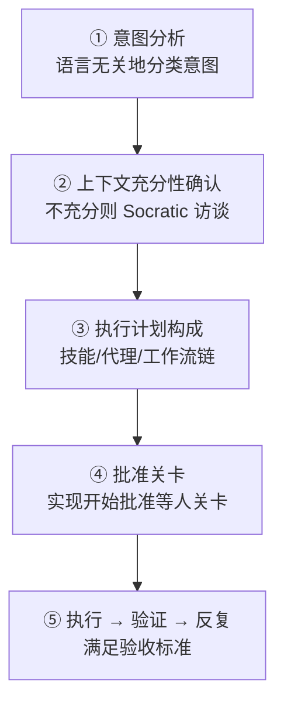

# Analyze-First 路由

从 v3 开始,`/moai` 的默认路由是 **Analyze-First**。不是匹配英语关键字,而是分析请求的意图。所以无论用什么语言请求,都能以相同质量路由 — 用韩语说"로그인 버그 고쳐줘"也好,用英语说"fix the login bug"也好,经过意图分析后到达同一个工作流。

这个页面沿着 Analyze-First 将请求转为执行的五个阶段。

## 五阶段管道

所有请求 — `/moai` 子命令还是自然语言,任何输入语言 — 都流经一个顺序管道。每个阶段接收前一阶段的结果作为输入。

### ① 意图分析

语言无关地分类请求的意图。无论输入语言是韩语·英语·日语,技术信号只在 ③ 阶段的上下文中使用,不在路由的分叉口立起来。"이거 고쳐줘"和"fix this"分类为同一意图(修改)。

### ② 上下文充分性确认

意图分类后,检查执行请求的上下文是否充分。不充分则通过 Rule 5 Context-First Discovery 的 Socratic 访谈用 `AskUserQuestion` 提出澄清问题。充分则进入下一阶段。

### ③ 执行计划构成

上下文具备后构成执行计划。决定加载哪些技能,以什么顺序 spawn 哪些代理。这个计划在非琐碎任务中在执行前向用户展示(Approach-First)。这里也选择 Phase 4 编排模式,决定是否需要并行扇出,还是顺序子代理合适。

### ④ 批准关卡

计划确定后按顺序通过管道的命名关卡。特别是**实现开始批准**(plan → run 人关卡)不是自律绕过对象 — 即使计划产出物达到 audit-ready 状态,在 run 阶段进入前也必须通过 `AskUserQuestion` 接收用户的明确批准。自律性轴(半自律 vs 自律)只选择批准**之后**发生什么,不跳过关卡本身。

### ⑤ 执行 → 验证 → 反复

批准后运行计划。按验收标准验证,需要则反复。如果武装了目标(`/moai goal`),目标评估器会做出终止决定。

## 管道关卡

默认管道按顺序通过以下四个关卡。每个关卡独立,出现 FAIL 或 INCONCLUSIVE 则链条停止。

| 关卡 | 负责 | 角色 |
|--------|------|------|
| **Plan-audit 关卡** | plan-auditor | 单独审计 SPEC 计划产出物。为防止偏差,评估代理与计划代理不同 |
| **实现开始批准** | 人(人关卡) | 管道进入时恰好 1 次,与分数无关总是批准 |
| **Phase 4 模式选择** | 编排器 | 实现开始批准后自律选择,记录在 `progress.md` |
| **Sync-audit 关卡** | sync-auditor | 以 4 维(功能·安全·工艺·一致性)评估同步结果 |


**实现开始批准与分数无关。** 即使 Plan-audit 达到 PASS-eligible(0.90 以上),也不会跳过 run 阶段进入前的用户批准。Phase 0.5 SKIP 和实现开始批准是不同的决定 — 前者是 plan-auditor 重新执行与否(可自动化),后者是用户是否进入 run(必须用户决定)。


## 自然语言输入转为工作流

只输入自然语言不带子命令时,① 意图分析会自动选择合适的工作流。

- **修改**意图 → `fix` 系列工作流
- **新功能**意图 → `plan → run → sync` 管道
- **探索**意图 → 只读子代理扇出

例如只输入 `/moai "로그인 버그 고쳐줘"`,意图分析分类为"修改"并连接到 `fix` 系列。`/moai "소셜 로그인 추가하고 싶어"`分类为"新功能"并到达 3-阶段管道。`/moai status` 这样的单字意图也会到达相应的路由。

## Analyze-First 给用户带来的

- **没有语言不便** — 不需要记英语关键字。用母语请求也能得到相同路由质量。
- **透明的关卡** — 执行前会展示按顺序调用哪些技能·代理。
- **一致的批准点** — 即使是自律模式,run 进入前用户也可以阻止一次。

## 相关文档

- [/moai](/zh/utility-commands/moai/) — Analyze-First 的入口命令
- [基于 SPEC 的开发](/zh/core-concepts/spec-based-dev/) — plan → run → sync 管道的上层框架
- [Harness 配置和评估](/zh/advanced/harness-profiles/) — 关卡评估和 Tier 分类
