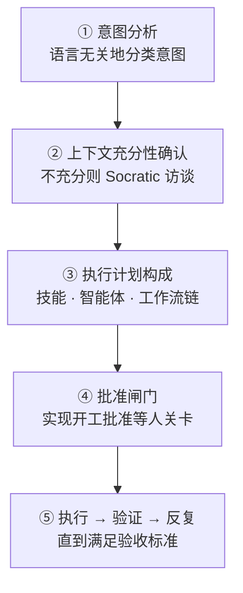
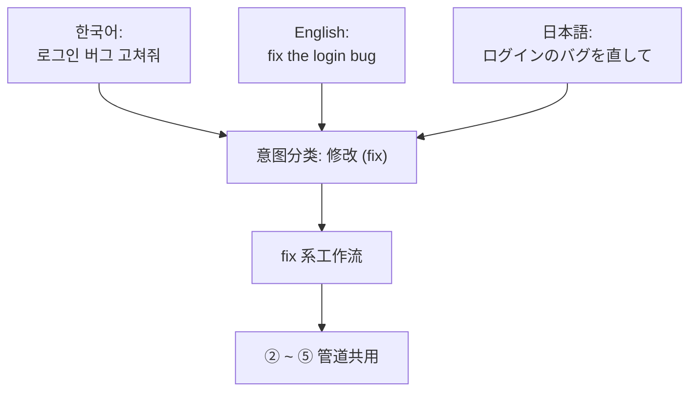

# Analyze-First 路由

智能体（自主工作的 AI 工具）编排器最先做的事，是决定"这个请求送到哪里去"的路由。从 v3 起，`/moai` 的默认路由是 **Analyze-First**（先分析请求的含义再选路的方式）。它不做英语关键词匹配，而是分类请求想要什么。因此无论用什么语言请求，都能得到同样质量的路由 —— 韩语说"로그인 버그 고쳐줘"、英语说 "fix the login bug"、日语说"ログインのバグを直して"，都会经过意图分析到达同一个工作流。

本页讲 Analyze-First 为什么必要、把请求变成执行的五个阶段如何衔接、中间立着哪些批准闸门。

## 为什么是含义而不是关键词

关键词匹配路由看起来简单。用户敲 `/moai fix` 就送进 fix 工作流，敲 `/moai plan` 就送进 plan 工作流。但这种方式在两处折断。

首先，用户得背下英语命令词汇。像"로그인 버그 고쳐줘"这样用母语自然地说，路由器听不懂。于是用户每次都要想"啊，这个得先想清楚是 fix 还是 plan 还是 run，再用英语敲出来"。其次，相近的说法可能走向不同的路。"고쳐줘"、"수정해 줘"、"버그 잡아 줘"是同一个意图，关键词不同结果就不同。路由器按词分岔，用户的体验就取决于自己恰好用了哪个词。

Analyze-First 用"分类含义就够了"来解决这两个问题。路由器分类的不是表面的词，而是**意图** (用户想要什么)。意图相同，无论以哪种语言、哪种表达进来都走同一条路。技术信号（比如"这是 Go 项目"、"这是测试文件"）只作为上下文使用，不立在路由的分岔口上。这个区分是 Analyze-First 的核心，承担它的分类器称为**意图路由器** (Intent Router，分类意图以选路的装置)。


**类比医院挂号台**

关键词匹配路由像是必须准确说出"骨科"这个英语单词才肯把你送到对应诊室的挂号台。用韩语说"팔이 부러졌어요"它就听不懂。

Analyze-First 路由是听症状、分类**需要 (need)** 的挂号台。"팔이 부러졌어요"、"I broke my arm"、"腕が折れました"，无论哪种进来都分类为"骨骼受伤"，送进同一间诊室。用户不需要知道诊室的英语名字。


## 五阶段管道

所有请求 —— 无论是 `/moai` 子命令还是自然语言，无论输入语言是什么 —— 都流经同一条顺序管道。每个阶段以上一阶段的结果为输入，任何一处卡住"上下文不够"或"需要批准"，都无法进入下一阶段。

### ① 意图分析

语言无关地分类请求的意图。输入语言无论是韩语、英语还是日语，"이거 고쳐줘"、"fix this"、"これを直して"都分类为同一意图（修改）。此时的技术信号 —— 比如"这是 Go 文件"、"在测试目录里" —— 不用于路由判定，只作为 ③ 阶段的上下文传递。意图与技术混在一起看，"Go 项目的 bug 修复"和"Python 项目的 bug 修复"就可能走向不同的路，而这是路由器学坏了的样子。语言与框架是关于"怎么做"的信息，不是对"做什么"的判定。

意图路由器有两条路径。**P1 子命令快速通道**（用户像 `/moai plan` 这样明确写出子命令时，跳过分类直接进入对应工作流）与 **P3 语义分类**（没有子命令、只来自然语言时，分类意图选出合适的工作流）。知道子命令就不必分类，不知道就分类 —— 两条路径汇入同一条管道。

### ② 上下文充分性确认

意图分类之后，检查执行这个请求的上下文是否充分。"버그 고쳐줘"意图明确，但**哪个 bug**、**在哪里**复现、**什么行为算正常**都空着就无法执行。不充分时，用 `AskUserQuestion`（向用户展示选项以获取回答的提问通道）运行 Rule 5 Context-First Discovery 的 **Socratic 访谈**（一次收窄一步的澄清对话）提出澄清问题。访谈一轮轮进行直到上下文 100% 明确，够了就进入下一阶段。

### ③ 执行计划构成

上下文齐备后制定执行计划。决定加载哪些技能、以什么顺序调用哪些智能体、是否需要动态工作流。这份计划只在非琐碎的任务上于执行前展示给用户（Approach-First，先亮出"我打算这么做"的方式）。计划以用户可查看、可修改的形式呈现。

这里还同时选出**编排模式**。任务是顺序推进的编码为主，就选子智能体模式（把工作一步步交给智能体的默认形态）；调查 · 审查需要多个独立视角，就选并行扇出（同时撒出 3~5 个只读智能体的形态）；要给几十上百个文件施加同一转换的机械大批量工作，就选动态工作流（由脚本协调大量智能体的形态）。模式选择是自主判断，其依据留在任务日志里。

### ④ 批准闸门

计划定下后，依次通过管道中的各个命名闸门。其中最重要的是**实现开工批准** (Implementation Kickoff Approval，从 plan 转入 run 之前由人按下的必需批准)。这道闸门不是自主绕过的对象 —— 即使计划产出物已通过审计，进入 run 阶段的前一刻也必须拿到用户的明确批准。

为什么与分数无关、永远要批准？因为质量分数只说明"这份计划编得有多好"，说明不了"现在是不是可以开始花代币、开始改工作树"。后者不是质量问题，是用户的决定。所以审计分数再高，那分数也只是"计划好"，成不了"可以进行"。

批准通过后，自主轴随之打开：在**半自主**（每一步由用户确认）与**自主**（条件齐备则无需人工介入推进）中选一个。这根轴只选择批准**过后**发生什么，不会跳过闸门本身。"批准之后自主推进到什么程度"与"要不要批准"是两个不同的决定。

### ⑤ 执行 → 验证 → 反复

批准下来就执行计划。按 SPEC（需求规格书）的验收标准验证，必要时反复。若处于目标已武装的状态（`/moai goal`），由**目标评估器**（每个回合结束时检查完成条件的装置）下终止判定。没有目标时，由各阶段的闸门判定是否通过。

## 语言换了，工作流不变

下图展示同一个意图以三种语言表达时，Analyze-First 如何把它们收束到同一个工作流。词不同但意图（修改）相同，意图路由器就送进同一个节点。

这个收束要成立，有一个前提。路由器必须按**含义**分类意图，而不是按表面的**词**分类。按词分类，三种输入分成三路；按含义分类，三种输入合成一路。Analyze-First 选的是后者。

## 一句自然语言变成工作流

不带子命令、只给自然语言时，① 意图分析（P3 语义分类路径）会自动选出合适的工作流。下面是常见的三种意图与它们的去向。

- **修改**意图 → `fix` 系工作流（连环修复诊断工具找到的问题）
- **新功能**意图 → `plan → run → sync` 三阶段管道
- **探索**意图 → 只读子智能体并行扇出

比如只敲 `/moai "로그인 버그 고쳐줘"`，意图分析分类为"修改"并接上 `fix` 系。`/moai "소셜 로그인 추가하고 싶어"`分类为"新功能"，接上三阶段管道。`/moai "이 코드베이스 구조 한 번 분석해 줘"`分类为"探索"，只读智能体们并行扑上去。知道子命令时直接敲 `/moai fix`、`/moai plan` 更快（P1 快速通道），不知道就用自然语言叫（P3 语义分类替你选）。

## 管道闸门

默认管道依次通过以下四道闸门。各闸门独立，出现 FAIL 或 INCONCLUSIVE 链条即停。

| 闸门 | 负责 | 角色 |
|--------|------|------|
| **Plan-audit 闸门** | plan-auditor 智能体 | 单独审计 SPEC 计划产出物。为防偏差，评估者不是制定计划的一方 |
| **实现开工批准** | 人（人关卡） | 每次进入管道恰好 1 次，与分数无关总是要批准 |
| **编排模式选择** | 编排器 | 实现开工批准之后自主选择，记入任务日志 |
| **Sync-audit 闸门** | sync-auditor 智能体 | 以四维（功能 · 安全 · 工艺 · 一致性）评估同步结果 |


**实现开工批准与分数无关。** 即使 Plan-audit 拿到可通过的分数（比如 0.90 以上），也不会跳过 run 阶段进入前的用户批准。计划阶段审计是否重跑（可自动化）与实现开工批准（必须由用户决定）是不同的决定 —— 前者可以凭质量分数放行，后者是"现在可以开始动工吗"的用户判断，分数代替不了。


## Analyze-First 给用户的东西

- **没有语言负担** —— 不用背英语关键词。用母语请求也能得到同样的路由质量。这是引入 Analyze-First 最大的理由。
- **透明的计划** —— 执行前就能看到哪些技能与智能体按什么顺序被调用。用户看了计划可以改。
- **一致的批准点** —— 即使在自主模式下，进入 run 之前用户仍能拦一次。自主轴只在这道闸门之后打开。

## 相关文档

- [/moai](/zh/utility-commands/moai/) —— Analyze-First 的入口命令
- [基于 SPEC 的开发](/zh/core-concepts/spec-based-dev/) —— plan → run → sync 管道的上层框架
- [自主级别](/zh/advanced/autonomy-tier/) —— 实现开工批准之后自主轴放开到哪一步
- [线束配置与评估](/zh/advanced/harness-profiles/) —— 闸门评估与 Tier 分类
