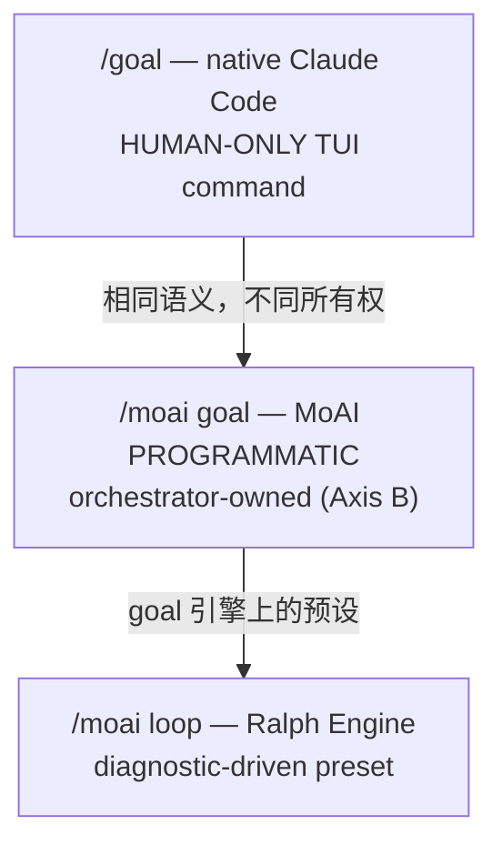

代理式循环的核心问题是"何时停止、何时继续"。MoAI-ADK 提供 `/moai goal` 和 `/moai loop` 两种连续循环原语，Claude Code 自身则提供原生 goal 命令。本页区分这三者，并解释各自的所有权、实现状态和安全护栏。

## 何时停止、何时继续

有些任务在单个回合内完成，但有些需要数十个回合才能收敛 — 例如"直到所有测试 PASS"或"直到诊断工具的问题队列清空"。如果用户每回合都要输入提示，自主性的优势就丧失了。

连续循环原语解决这个问题。声明完成条件，会话就会持续工作直到条件满足或回合限额到达。

## 三种连续循环原语

连续循环原语共三种 — 其中两种由 MoAI-ADK 拥有，另一种由 Claude Code 自身拥有 — 各有不同的触发语义。

| 原语 | 所有权 | 触发 | 适用场景 |
|------|--------|------|---------|
| `/goal` | 用户 TUI (HUMAN-ONLY) | 模型评估条件 | "持续直到此条件为真" |
| `/moai goal` | 编排器 (PROGRAMMATIC) | stop-goal Stop-hook 评估 | MoAI 管道内的自主连续 |
| `/moai loop` | Ralph Engine (诊断驱动) | 诊断工具问题队列 | "修复工具找到的所有问题" |



### `/goal` — native Claude Code (HUMAN-ONLY)

 `/goal` 是 Claude Code 的原生 TUI 命令。它是用户输入的命令，模型不能代表用户调用。这就是 **HUMAN-ONLY** 约束。

声明完成条件后，每个回合结束时一个小型快速模型(默认 Haiku)评估条件是否满足。不满足则开始下一回合; 满足则循环结束。

```text
/goal go test ./... exits 0 && lint is clean, or stop after 20 turns
```

条件最多 4,000 字符，可包含回合/时间限额来约束循环。裸 `/goal` 查看状态; `/goal clear` 提前终止。

### `/moai goal` — MoAI PROGRAMMATIC (Axis B)

 `/moai goal` 是 MoAI 拥有的编程式重新实现。由于原生 `/goal` 是 HUMAN-ONLY，这是编排器在管道内注册和武装(arm)自主连续循环的唯一路径。

提供四个动词:

```bash
moai goal arm "<completion-condition>"  # 注册条件 + 武装 (arm-only)
moai goal status                        # 查看当前条件 + 回合/token 消耗
moai goal clear                         # 删除条件 (结束循环)
moai goal render                        # 把当前 goal 仪表板渲染为 HTML
```

> **arm-only 属性**:`arm` 只负责注册并激活条件,其自身不启动任何工作。已 arm 的 goal 在每个回合结束时由 `stop-goal` Stop-hook 评估器判定条件是否满足,以此决定是否继续下一回合。必须与真正的工作启动命令(例如 `/moai run SPEC-XXX`)搭配使用 —— 只 arm 而无工作命令,只会白白消耗回合。

### 无限 goal 与 block cap (SPEC-INFINITE-GOAL-001)

传入 `--max-turns 0` 即可得到取消回合上限的 **无限 goal**。无限 goal 必须搭配 `--max-duration <sec>`(墙上时间上限,单位秒),否则在 arm 时会被 fail-closed 拒绝 —— 没有真实 bound 的"无限"无法构成安全护栏。

- `--cost-cap <value>` 是 **仅记录(recorded-only)** —— 它只把调用次数上限写下来,当前没有 enforce 逻辑,无法承担真实 bound 的角色。因此单独靠 cost-cap 无法满足 `--max-turns 0` 对真实 bound 的要求,会被拒绝。
- **block cap 抢占**:Claude Code 运行时的连续 block 上限 `CLAUDE_CODE_STOP_HOOK_BLOCK_CAP`(默认 8)会先于回合上限打断循环。要让无限 goal(`--max-turns 0`)真正跑起来,必须把这个上限调高(例如 `200`)。`moai cc` / `moai cg` 启动器在为已 arm 无限 goal 的会话启动时会自动注入这个值。在已经运行的会话中,需要在 arm 之前手动设置该环境变量。
- **回合上限到达时的判定**:触及回合上限(或 block cap)时,评估器会输出 5-段式判定(verdict) —— `Claim / Evidence / Baseline-attribution / Gaps / Residual-risk`。该判定不是"已收敛"的信号,而是"已达上限、停止"的报告。
- **Progression Mode**:自主(autonomous)与半自主(semi-autonomous)的选择在 Implementation Kickoff Approval 门禁进行。arm 本身不会跳过这个门禁。

会话启动时 `PruneOrphans` 会清理遗留的孤儿 goal。该机制在 SPEC-GOAL-ENGINE-001(CLOSED)中实现。

要用静态 HTML 仪表板渲染当前循环状态,可使用 `moai goal render` —— 详见 [/moai goal - 目标看板](/zh/utility-commands/moai-goal/)。

### `/moai loop` — Ralph Engine (诊断驱动预设)

 `/moai loop` 是扫描诊断工具找到的问题队列、修复每个问题、重复直到队列清空或诊断干净的确定性循环。它是 goal 引擎上的预设。

`/moai loop` 不是 `/moai run --mode loop` 的别名。`/moai run --mode loop` 是运行时模式分发值; `/moai loop` 是独立子命令。两者使用相同 goal 引擎，但入口路径和预设行为不同。

## 原生 /goal 详情

`/goal <condition>` 设置完成条件，Claude 无需提示持续工作直到条件为真。每个回合后，小型快速模型评估条件。

编写有效条件:

- **一个可测量的终态** — 测试结果、构建 exit code、文件数、空队列
- **明确的验证方法** — Claude 应如何证明("`go test ./... exits 0`")
- **重要约束** — 过程中不应改变的("禁止修改其他测试文件")

包含回合限额来约束循环("`or stop after 20 turns`")。运行 `/clear` 也会删除活动 goal。用 `--resume` / `--continue` 恢复会话时 goal 被还原。

## 实现 vs 路线图

 **REQ-DA-062 诚实性区分**: 三个原语的实现状态明确区分。

-  `/goal` (原生) — 在 Claude Code 运行时实现(需 v2.1.139+)
-  `/moai goal` (PROGRAMMATIC) — SPEC-GOAL-ENGINE-001 CLOSED，4 动词 CLI 完整实现
-  `/moai loop` (Ralph Engine) — 以诊断驱动循环实现
-  AGENTIC-CORE Epic — 进行中。SPEC-1 (Analyze-First 路由) CLOSED。SPEC-2 (自主/半自主 kickoff REQ)等待用户需求。

## 安全护栏

 所有循环原语的安全护栏不变。

- **Implementation Kickoff Approval** (plan → run HUMAN GATE) 不能被任何循环绕过。即使 `/goal` 活动，run-phase 进入前的用户批准仍是强制的。
- **安全边界不变** — 即使循环活动，"难以逆转/共享系统操作前确认"边界不会被放宽。goal 评估器仅决定是否继续; 不预批准破坏性操作。
- **与 auto mode 组合** — 将 Claude Code auto mode(每工具自动批准)与 `/moai goal`(每回合连续)组合可实现无人值守 `ac_converge` 循环。auto mode 移除每工具批准提示; `/moai goal` 移除每回合 STOP 提示。Implementation Kickoff Approval 在 run-phase 进入前仍强制。

## 下一步

- [代币经济学概述](/zh/advanced/tokenomics-overview/) — 自主循环与代币经济学的连接点
- [线束自我进化](/zh/advanced/self-evolving/) — `/moai loop` / `/moai goal` 收敛轨迹整合到 Loop 0 观察
