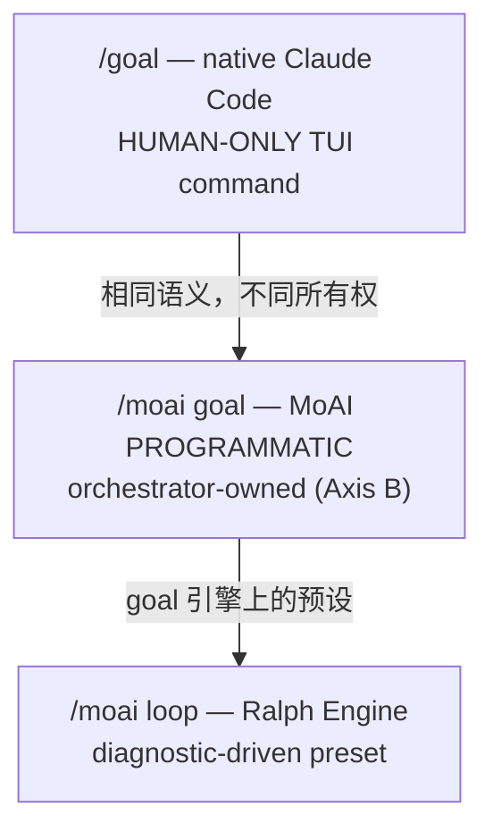

代理式循环的核心问题是"何时停止、何时继续"。MoAI-ADK 提供三种连续循环原语，各有不同的触发语义和所有权。本页区分 `/goal`、`/moai goal`、`/moai loop`，并解释各自的实现状态和安全护栏。

## 何时停止、何时继续

有些任务在单个回合内完成，但有些需要数十个回合才能收敛 — 例如"直到所有测试 PASS"或"直到诊断工具的问题队列清空"。如果用户每回合都要输入提示，自主性的优势就丧失了。

连续循环原语解决这个问题。声明完成条件，会话就会持续工作直到条件满足或回合限额到达。

## 三种连续循环原语

MoAI-ADK 有三种连续循环原语，各有不同的触发语义和所有权。

| 原语 | 所有权 | 触发 | 适用场景 |
|------|--------|------|---------|
| `/goal` | 用户 TUI (HUMAN-ONLY) | 模型评估条件 | "持续直到此条件为真" |
| `/moai goal` | 编排器 (PROGRAMMATIC) | stop-goal Stop-hook 评估 | MoAI 管道内的自主连续 |
| `/moai loop` | Ralph Engine (诊断驱动) | 诊断工具问题队列 | "修复工具找到的所有问题" |



### `/goal` — native Claude Code (HUMAN-ONLY)

 `/goal` 是 Claude Code 的原生 TUI 命令。它是用户输入的命令，模型不能代表用户调用。这就是 **HUMAN-ONLY** 约束。

声明完成条件后，每个回合结束时一个小型快速模型(默认 Haiku)评估条件是否满足。不满足则开始下一回合; 满足则循环结束。

```text
/goal go test ./... exits 0 && lint is clean, or stop after 20 turns
```

条件最多 4,000 字符，可包含回合/时间限额来约束循环。裸 `/goal` 查看状态; `/goal clear` 提前终止。

### `/moai goal` — MoAI PROGRAMMATIC (Axis B)

 `/moai goal` 是 MoAI 拥有的编程式重新实现。由于原生 `/goal` 是 HUMAN-ONLY，这是编排器在管道内注册和武装自主连续循环的唯一路径。

提供四个动词:

```bash
moai goal arm "<completion-condition>"  # 注册 + 武装条件
moai goal status                        # 查看当前条件 + 回合/token 消耗
moai goal clear                         # 删除条件 (结束循环)
```

会话开始时 `PruneOrphans` 清理孤立 goal。此机制在 SPEC-GOAL-ENGINE-001 (CLOSED)中实现。

### `/moai loop` — Ralph Engine (诊断驱动预设)

 `/moai loop` 是扫描诊断工具找到的问题队列、修复每个问题、重复直到队列清空或诊断干净的确定性循环。它是 goal 引擎上的预设。

`/moai loop` 不是 `/moai run --mode loop` 的别名。`/moai run --mode loop` 是运行时模式分发值; `/moai loop` 是独立子命令。两者使用相同 goal 引擎，但入口路径和预设行为不同。

## 原生 /goal 详情

`/goal <condition>` 设置完成条件，Claude 无需提示持续工作直到条件为真。每个回合后，小型快速模型评估条件。

编写有效条件:

- **一个可测量的终态** — 测试结果、构建 exit code、文件数、空队列
- **明确的验证方法** — Claude 应如何证明("`go test ./... exits 0`")
- **重要约束** — 过程中不应改变的("禁止修改其他测试文件")

包含回合限额来约束循环("`or stop after 20 turns`")。运行 `/clear` 也会删除活动 goal。用 `--resume` / `--continue` 恢复会话时 goal 被还原。

## 实现 vs 路线图

 **REQ-DA-062 诚实性区分**: 三个原语的实现状态明确区分。

-  `/goal` (原生) — 在 Claude Code 运行时实现(需 v2.1.139+)
-  `/moai goal` (PROGRAMMATIC) — SPEC-GOAL-ENGINE-001 CLOSED，4 动词 CLI 完整实现
-  `/moai loop` (Ralph Engine) — 以诊断驱动循环实现
-  AGENTIC-CORE Epic — 进行中。SPEC-1 (Analyze-First 路由) CLOSED。SPEC-2 (自主/半自主 kickoff REQ)等待用户需求。

## 安全护栏

 所有循环原语的安全护栏不变。

- **Implementation Kickoff Approval** (plan → run HUMAN GATE) 不能被任何循环绕过。即使 `/goal` 活动，run-phase 进入前的用户批准仍是强制的。
- **安全边界不变** — 即使循环活动，"难以逆转/共享系统操作前确认"边界不会被放宽。goal 评估器仅决定是否继续; 不预批准破坏性操作。
- **与 auto mode 组合** — 将 Claude Code auto mode(每工具自动批准)与 `/goal`(每回合连续)组合可实现无人值守 `ac_converge` 循环。auto mode 移除每工具批准提示; `/goal` 移除每回合 STOP 提示。Implementation Kickoff Approval 在 run-phase 进入前仍强制。

## 下一步

- [代币经济学概述](/zh/advanced/tokenomics-overview/) — 自主循环与代币经济学的连接点
- [线束自我进化](/zh/advanced/self-evolving/) — `/moai loop` / `/goal` 收敛轨迹整合到 Loop 0 观察
