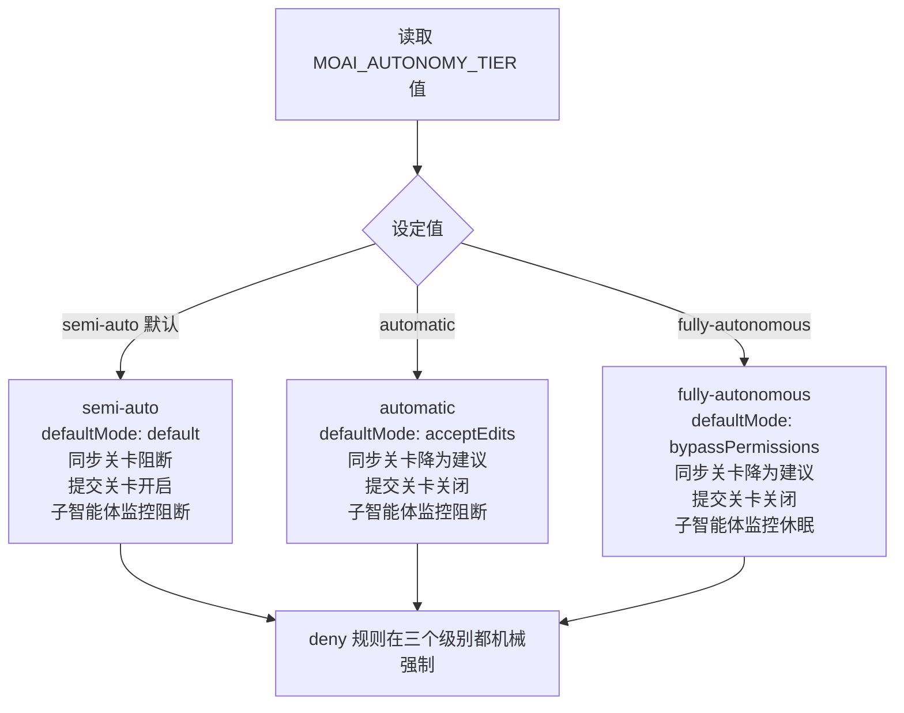
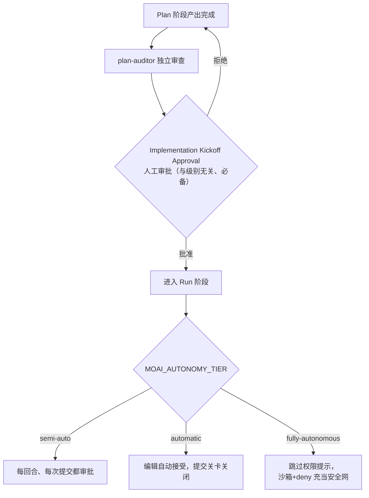

MoAI-ADK 提供三个自主级别（autonomy tier，决定自主行动到何种程度的等级）——从每个回合都要用户确认的半自主模式，到条件满足后无需人工介入就能把任务一推到底的完全自主模式。这个等级通过 `MOAI_AUTONOMY_TIER` 环境变量令牌来表达，贯穿把单个 SPEC（需求规格书）从计划到实现、文档化、审计的全周期，决定哪里仍需用户审批、哪里可以自动放行。

本页以实操为主线，点明三个级别的结构、各级别触碰的权限范围，以及自主性越高就越要扎实的那些安全装置。

## 三个级别触碰的四张面

自主级别改变的既不是模型也不是 effort（推理深度），而是人通过审批关卡介入到哪一步。级别越高，下面四张面上人工的手就越少。

 **别和模型级别混淆**：本页的"自主级别"与[三层智能体架构](/zh/advanced/no-haiku-3tier/)中的"模型级别"是**不同的轴**。模型级别选的是"用什么模型、以什么 effort 来调用"（单发、代理式、峰值），自主级别选的是"人工审批撤到哪一步"。两条轴互不替代，彼此正交——用户**分别**选择与能力匹配的模型级别和与监控强度匹配的自主级别。



四张面的具体行为因级别而异。

| 面 | semi-auto（默认） | automatic | fully-autonomous |
|------|------------------|-----------|------------------|
| `defaultMode`（默认权限模式） | `default` | `acceptEdits` | `bypassPermissions` |
| 同步关卡（sync gate） | 阻断 | 建议 | 建议 |
| 提交关卡 | 开启 | 关闭 | 关闭 |
| 子智能体生命周期监控（SubagentStop/TeammateIdle） | 阻断 | 阻断 | 休眠 |

有一条线在所有级别上都不变：用 `deny` 拦住的危险动作，哪怕升级级别也绝不会松开，即便处于 `bypassPermissions` 也会被机械强制。因为自主性的安全网最终就靠这张 `deny` 清单——以及在 `fully-autonomous` 下还要额外依赖——经过验证的沙箱（隔离执行环境）。

## Step 1 — 读取并解释级别值

自主级别通过环境变量 `MOAI_AUTONOMY_TIER` 来读取。可以在 shell 里直接打出当前值。

```bash
# 输出当前会话生效的自主级别
echo "${MOAI_AUTONOMY_TIER:-semi-auto}"
```

值为空或从未设置时，按 `semi-auto` 解释。这是一条向下兼容的不变式——未显式选择自主级别的既有会话继续保持与今天一模一样的行为，没有 opt-in（opt-in，用户主动开启的选择）的会话不为任何行为变化买单。

三个值的含义归纳如下。

- **`semi-auto`**（默认）——维持今天的行为不变。`defaultMode: default`、同步关卡阻断、提交关卡开启、基于允许清单（allowlist）的 Bash 执行，对每个工具逐一询问审批。
- **`automatic`**——半自主执行。编辑工具不再询问直接接受（`acceptEdits`），提交关卡关闭，同步关卡从阻断降为建议。子智能体生命周期监控仍保持阻断，实现智能体若漏掉完成条件就会被拦下。
- **`fully-autonomous`**——无人自主。直接跳过权限提示（`bypassPermissions`），子智能体监控也转入休眠。取而代之的是沙箱证明与 `deny` 规则、管理员kill开关（manager kill-switch，紧急时一次性收回自主性的装置）共同构成这一级别的安全边界。

## Step 2 — 在 `moai init` 向导中选择级别

自主级别在项目首次设置时由 `moai init` 向导（交互式配置工具）选择。向导会询问三个级别之一，并把选择保存为项目配置。

```bash
# 创建新项目的同时选择自主级别
moai init myproject --autonomy-tier semi-auto
```

`--autonomy-tier` 标志只接受封闭的三个值之一。填错会被拒绝并告知原因。这种封闭集合（closed set，只接受预定值的约束）保证自主级别始终作为唯一真相（single source of truth）被读取——这是防止运行时钩子和渲染器各自解释的第一颗扣子。

若不经过向导、想在既有项目上改级别，可以用 `moai web` 的开关，或直接改配置文件里的 `workflow.yaml` 键。不过，`fully-autonomous` 在没有沙箱证明时会在网页开关中被禁用——无人自主必须以经过验证的隔离环境为前提。

## Step 3 — 追踪级别如何改变权限包

选定的级别经过配置渲染器（把权限包实际生成出来的装置）落到两处。`defaultMode` 写入**用户域**（USER scope，个人配置），`deny`/`ask` 规则写入**项目域**（PROJECT scope，团队共享配置）。这种分离保证即便某个人调高了自主性，团队共享的安全规则也不被动摇。

```bash
# 确认渲染器在各级别下产出的 deny/ask 规则完全一致
diff <(grep -A20 'deny:' .claude/settings.json) \
     <(grep -A20 'deny:' .claude/settings.local.json) && echo "deny 清单一致"
```

上述检查之所以应当通过，是因为 `deny`/`ask` **规则集对级别不变**。无论选哪个级别，被 `deny` 拦住的动作种类不会减少，被 `ask` 询问的动作种类也不会缺失。级别改变的只有 `defaultMode`、同步关卡模式、提交关卡开关、子智能体监控是否激活——即上表的四张面。这条不变式阻止了"调高自主性就打开新的危险动作"。

`deny` 规则的强制力在 `bypassPermissions` 下依然存活。权限评估始终按 `deny → ask → allow` 的顺序进行，第一个匹配做出决定。`fully-autonomous` 下 `ask` 规则降为建议，但 `deny` 规则仍机械阻断。所以完全自主的实效安全网是"经过验证的沙箱 + `deny` 清单 + 附带内容范围的 `ask` 规则"——这正是它不单靠 `ask` 的原因。

## Step 4 — 点明与 Implementation Kickoff Approval 及 Stop-chain 的关系

即便调高自主级别，也有一道关卡绝不能跳过。那就是 **Implementation Kickoff Approval**（从计划跨入实现的人工审批关卡）。这道关卡与自主级别无关、始终必备，plan-auditor（计划审查智能体）的通过判定或高分都不会自动放行这道关卡。



一旦通过人工审批关卡，此后的自主程度就由级别决定。`semi-auto` 每回合、每次提交都回来询问审批；`automatic` 自动接受编辑；`fully-autonomous` 直接跳过权限提示。不过要再强调一次，`fully-autonomous` 的安全网不是 `ask` 提示而是沙箱与 `deny`——级别越高，安全装置就越是从提示转向机械强制。

自主级别还与 Stop-chain（回合末运行的验证环）的自愿放宽成对。Stop-chain 钩子原本每回合末、每次提交都把 `moai` 二进制以冷启动（cold start，每次重新拉起的开销）方式跑一遍验证。在无人循环里这个往返开销会累积，因此读取 `MOAI_AUTONOMY_TIER` 令牌后有条件地跳过建议性关卡。若目标状态文件（goal state file）不存在，就跳过目标评估钩子；若当前提交不是同步提交，就不跑同步质量关卡的重检查。但 `deny` 与安全规则不在放宽范围内——Stop-chain 终归只是"在用户已审批范围内削减往返开销"的装置。

## 级别选择指南

哪个级别合适，取决于任务性质与验证环境的准备度。

- **`semi-auto`**——首次使用、处理陌生代码库、或混杂了难以撤销的动作时。每个步骤都能让用户重新确认意图，最安全。
- **`automatic`**——要把单个 SPEC 从计划一路推到实现、文档化时。不必为每次编辑停下审批，长实现节奏不被打断；子智能体监控仍在，完成条件散了就会被拦下。
- **`fully-autonomous`**——在经过验证的沙箱里、对已获批的任务、即便人不在位也要跑到最后时。但前提是沙箱证明，且随时能用管理员kill开关收回自主性。

所有级别下 `deny` 清单都不变，Implementation Kickoff Approval 始终必备。提高自主性是"少接受人工审批"，不是"放松安全边界"。级别改变的是审批的频率，不是安全的强度。

## 下一步

- [三层智能体架构](/zh/advanced/no-haiku-3tier/)——模型级别（单发、代理式、峰值）。与自主级别正交的"用什么模型"轴
- [配置矩阵](/zh/advanced/profile-matrix/)——为每个智能体挑选 `{model, effort}` 的单一矩阵
- [自主循环](/zh/advanced/autonomous-loops/)——基于目标引擎的无人连续执行
- [看板模式](/zh/advanced/kanban-mode/)——用多会话看板并行运作自主级别
