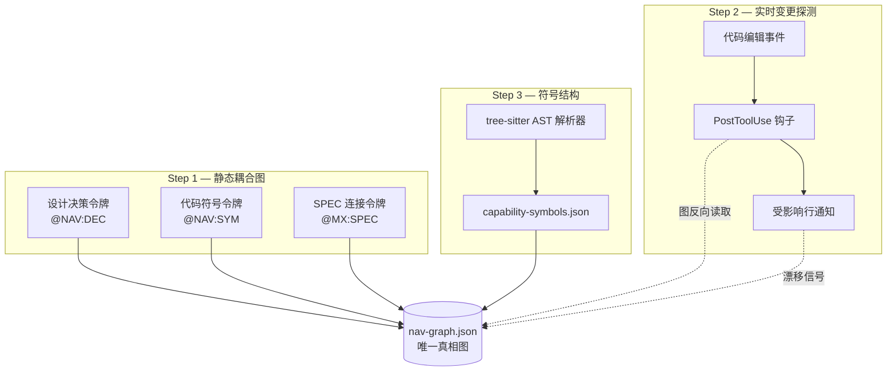

代码不断在变，文档却原地踏步的项目比比皆是。BAS Navigator（把代码地图锚定到蓝图上的同步层）正是缩小这道鸿沟的装置。本页是一份教程，跟随 BAS Navigator 如何以三个阶段同步代码地图（以符号为单位摘要项目结构的地图）。可以一边逐条命令亲手跑、一边读。


**BAS Navigator 一句话总结**

BAS（BluePrint-Anchored Synchronization，蓝图锚定同步）Navigator 把设计决策、SPEC（需求规格书）、代码符号拢进一张图，代码变化的瞬间立刻报出受影响的行，并把代码结构按符号拆开展示——是这样一个三阶段同步层。出发点是这样一个问题意识："没有更新基础设施的文档不是活的，而只是一份出处更可靠的快照。"


## 为什么需要它

智能体（自己干活的 AI 助手）要在大型仓库里找对方位，就得一眼看清"哪个设计决策落实成了哪段代码，那段代码又来自哪份 SPEC"。过去 MoAI-ADK 里，重画代码地图的命令（`regen`）、检查设计与实现差距的命令（`audit`）、用 tree-sitter（把源码解析成语法树的解析器）抽出符号的命令（`enrich`）各自分散。三条命令各自都跑得不错，却互不指认，所以一边变了，另一边无从知晓。

BAS Navigator 把这三条同步轴重排为**静态耦合 · 实时探测 · 符号结构**三个阶段，并把结果汇聚到 `nav-graph.json`（Navigator 图的唯一真相文件）一份里。正因为图是唯一真相，无论哪个阶段出现漂移（设计与实现错位的现象），都能经由同一张图追溯。

下图展示了三个阶段如何环绕这张图。



每个阶段只生产或消费图，不触碰其他阶段的生产者。正是这条"只搭桥、不吞并（bridge not absorb）"原则，让改任何阶段都不会动摇其余阶段。下面逐阶段亲手练一遍。

## Step 1 — 构建静态耦合图

第一步是用把设计决策、代码符号、SPEC 拢进一张图的**绑定令牌 trio（三连绑定令牌）**。令牌是直接嵌进文档和代码里的小标记，共三种。

| 令牌                   | 放置位置               | 指向对象             |
| ---------------------- | ---------------------- | -------------------- |
| `@NAV:DEC-<id>`        | `.moai/project/*.md`、ADR | 设计决策记录       |
| `@NAV:SYM:<symbol>`    | 代码注释、设计文档     | 命名的代码符号       |
| `@MX:SPEC:<id>`        | 代码注释               | SPEC 反向链接        |

把三种令牌散布到文档和代码里之后，Navigator 会把它们收拢为 `nav-graph.json` 的边。节点是决策、SPEC、符号三类实体，边按令牌种类各带来源文件和行号。所以读图时能一路追到"这个决策最初出现在哪个文件的第几行"。

先打一枚令牌试试，再重画图。

```bash
# 1) 在设计文档里留决策令牌（在 .moai/project/tech.md 里加一行）
#    @NAV:DEC-auth-token — 认证以令牌而非会话为基础 ...

# 2) 在代码注释里挂 SPEC 反向链接（在 internal/auth/token.go 里）
#    // @MX:SPEC:SPEC-AUTH-001

# 3) 重画图
moai codemaps
```


`@MX:SPEC` 原本是用作代码注释指向 SPEC 的反向链接令牌。BAS Navigator 并未新造这枚令牌，而是把已有的 moai-adk 连接结果**搭桥**带进图。得益于此，既有注释不必改动。


## Step 2 — 在编辑瞬间抓漂移

第二步是 **Falconer Detect（监视每次编辑的实时探测层）**。文件保存的瞬间，PostToolUse 钩子（工具执行后立即响应的自动钩子）读取变更路径，反向扫图，立刻报出受影响的行。

探测是只读的。它不拦截编辑，结果留在两处。一处是会话里弹出的简短通知，另一处是机器可读的影响记录（`.moai/state/navigator-detect/` 下的 `jsonl` 文件）。这份记录由下一步的更新管道消费。

直接观察探测是如何运作的。

```bash
# 1) 编辑一个源文件（例如修改 internal/auth/token.go 里的一个函数）
#    在 Claude Code 里用 Edit 工具保存

# 2) 查看钩子留下的影响记录——编辑后这个文件会立即出现
ls .moai/state/navigator-detect/

# 3) 看最近一条记录的内容——受影响的节点和边按行列在里面
tail -n 3 .moai/state/navigator-detect/*.jsonl
```

看输出会发现，刚选中的文件连到了哪些决策节点、哪些 SPEC 节点、哪些符号节点，一行一个地列出来。这正是"在漂移即将产生的最便宜时刻"弹窗警告的探测核心。像用 Bash 移动文件这种没有结构化路径的编辑不在探测范围内。这是有意设计，是为了减少误报的边界。

## Step 3 — 以符号为单位抽取代码结构

第三步是把代码按符号拆开的 **tree-sitter AST 增强**。靠手工无法把标记全标到设计文档上。于是支持 16 种语言的 tree-sitter 解析器自动抽出函数、类型、调用关系，填入 `capability-symbols.json`。这份结果反过来丰富图的符号节点。

这一阶段分两层。下层是确定性结构层（解析器机械抽出的签名、声明、引用），上层是 LLM 叙述层（把文档字符串与调用语境以自然语言填入的层）。两层分离，所以在无法使用 LLM 的环境里确定性层也不卡壳。 结构在先，叙事在后。

跑一次增强。

```bash
# 更新代码地图——tree-sitter 重新抽取符号，填充 capability-symbols.json
/moai codemaps

# 查看符号增强结果
jq '.symbols | length' .moai/project/navigator/capability-symbols.json
```

命令的详细标志和输出格式另行整理在 `utility-commands/moai-codemaps.md` 命令参考页里。本教程只点出"一行就能跑增强"这条主线。

## Step 4 — 读整张图、抓差异

最后一步是把前三阶段绑成一个循环。探测报出受影响的行，增强重抽符号，更新把图对齐到最新。检查设计意图与已实现功能差距的审计模式（`--audit`）读这个循环留下的图，报告"文档有/代码无"的对子。

把整个循环一次跑完。

```bash
# 1) 设计意图 vs 实现差异审计
/moai codemaps --audit

# 2) 把探测记录指向的受影响行与最新图对照
jq '.affected_rows[] | {node: .identifier, type: .entity_type}' \
  .moai/state/navigator-detect/*.jsonl | head

# 3) 查看审计报告的摘要
cat .moai/project/navigator/audit-report.json | jq '.summary'
```

审计干净，图就照样活着。若报告了差异，可顺 Step 1 的令牌与 Step 3 的符号增强回溯，缩小到是哪个阶段空了。这就是 BAS Navigator"不一次性重画整体"也能让代码地图保持存活的循环。

## 收尾

三个阶段再整理如下。

| 阶段   | 做的事                         | 产物                            |
| ------ | ------------------------------ | ------------------------------- |
| Step 1 | 用令牌 trio 构建耦合图         | `nav-graph.json`                |
| Step 2 | 编辑瞬间探测受影响行           | `navigator-detect/*.jsonl`      |
| Step 3 | 用 tree-sitter AST 增强符号    | `capability-symbols.json`       |
| Step 4 | 审计抓差异、闭合循环           | `audit-report.json`             |

BAS Navigator 在一份唯一真相图上搭起三条同步轴，让代码变了文档也不掉队。若想看命令规格，见 `utility-commands/moai-codemaps.md`；若想看设计背景，见定义各阶段的 SPEC（SPEC-NAVIGATOR-SYNC-001、002、003）。接下来读起来顺手的页面是同属高级章节的 `manager-lead.md` 与 `autonomy-tier.md`。两者分别讨论在这张代码地图之上运作的智能体组织和自主等级。
