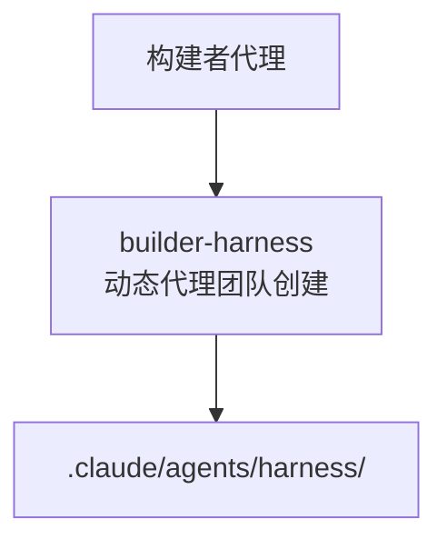

详细介绍扩展 MoAI-ADK 的构建者代理。


  **一句话总结**: 构建者代理是 MoAI-ADK 的**扩展工具制作所**。您可以通过 Socratic 访问为项目创建定制的代理团队。


## 什么是构建者代理?

除了 MoAI-ADK 提供的 31 个内置技能和 8 个代理外,MoAI-ADK 还提供 1 个构建者代理供用户扩展系统。



### 扩展的 1 种类型

| 类型 | 构建器 | 目的 | 调用方式 |
| -------- | ------------------- | --------------------------------------------- | ----------------------- |
| 项目特定代理团队 | `builder-harness` | 基于 Socratic 访问动态生成专家代理 | `/moai project` 访问 |

## Harness(工具包)创建 (builder-harness)

### 什么是 Harness?

Harness 是一套**项目特定的代理团队**,由 builder-harness 基于 Socratic 访问动态生成。它根据项目的技术栈、架构、约定生成定制的实现、测试和审查代理。

### Harness 目录结构

Harness 由 builder-harness 基于 Socratic 访问动态生成,创建以下目录结构:

```text
.claude/agents/harness/
├── main.md                 # Harness 编排主文档
├── interview-results.md    # Socratic 访问结果
└── extensions/             # 可选: 扩展定义
    └── custom-specialist.md

.moai/harness/
├── requirements.yaml       # 项目需求和约束
└── specializations.yaml    # 生成的专家角色定义
```


  Harness 细节请参考 [代理指南](/advanced/agent-guide) 的 builder-harness 部分。


## 创建自定义 Harness

### 生成 Harness

在项目中运行 Socratic 访问以生成项目特定的 Harness:

```bash
> /moai project
```

此命令启动 builder-harness 来:

1. 询问关于项目的问题(技术栈、架构、团队)
2. 分析项目结构和代码约定
3. 生成定制的专家代理
4. 创建 harness/ 目录和配置文件

### Harness 主文件示例

生成的 `.claude/agents/harness/main.md` 示例:

```markdown
---
name: project-harness
description: >
  项目 [ProjectName] 的定制代理团队。由 builder-harness 基于项目约定生成。
tools: Read, Write, Edit, Grep, Glob, Bash
model: inherit
---

# [ProjectName] 项目 Harness

此 harness 包含根据项目技术栈和架构定制的专家代理。

## 生成的专家

- **实现者** (implementer): React 19 + Python FastAPI 实现
- **测试者** (tester): 单元和集成测试
- **设计者** (designer): UI/UX 设计和审查

## Socratic 访问结果

技术栈:
- 前端: React 19, Next.js 16, TypeScript
- 后端: Python, FastAPI, PostgreSQL
- 测试: Jest (前端), pytest (后端)

架构约定:
- 组件驱动开发
- API 优先设计
- 测试驱动开发
```


  **约束**: 不要手动编辑 harness/ 目录中生成的文件。运行 `/moai project` 时重新生成。要修改 harness,编辑项目配置并重新运行 Socratic 访问。


## 相关文档

- [代理指南](/advanced/agent-guide) - 代理系统详情
- [技能指南](/advanced/skill-guide) - 技能系统详情
- [Hooks 指南](/advanced/hooks-guide) - 代理生命周期钩子


  **提示**: 有关 builder-harness 的详细信息,请参考 [代理指南](/advanced/agent-guide) 的 Builder Agent Details 部分。

