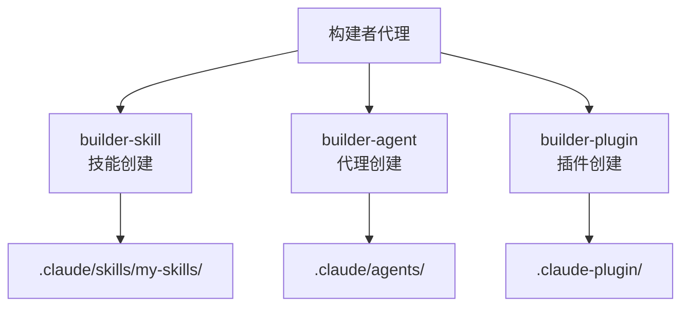

详细介绍扩展 MoAI-ADK 的 3 种构建者代理。


  **一句话总结**: 构建者代理是 MoAI-ADK 的**扩展工具制作所**。您可以创建技能、代理、插件来定制系统。


## 什么是构建者代理?

除了 MoAI-ADK 提供的 52 个技能和 28 个代理外,还有 3 种构建者代理供用户扩展。



### 扩展的 3 种类型

| 类型 | 构建器 | 目的 | 调用方式 |
| -------- | ----------------- | ------------------------------ | ----------------------- |
| 技能 | `builder-skill` | 为 AI 提供新的专业知识 | 自动触发 / `Skill()` |
| 代理 | `builder-agent` | 定义新的专家角色 | MoAI 委托 |
| 插件 | `builder-plugin` | 打包分发技能+代理+命令 | `plugin install` |

## 技能创建 (builder-skill)

### 什么是技能?

技能是向 Claude Code 提供特定领域专业知识的**知识模块**。当技能加载后,Claude Code 就会掌握该领域的最佳实践、模式和规则。

### YAML 前置架构模式

技能的 `SKILL.md` 文件必须以 YAML 前置开头。

```yaml
---
# 官方字段
name: my-custom-skill # 技能标识符 (kebab-case,最多 64 字符)
description: > # 目的说明 (50~1024 字,第三人称)
  自定义技能的说明。描述用于什么任务,提供什么专业知识,
  以第三人称撰写。
allowed-tools: # 允许的工具 (逗号分隔或列表)
  - Read
  - Grep
  - Glob
model: claude-sonnet-4-20250514 # 使用的模型 (省略时为当前模型)
context: fork # 在子代理上下文中执行
agent: general-purpose # context: fork 时使用的代理
hooks: # 技能生命周期钩子
  PreToolUse: ...
user-invocable: true # 斜杠命令菜单显示
disable-model-invocation: false # false 时 Claude 也可以直接调用
argument-hint: "[issue-number]" # 自动补全提示

# MoAI-ADK 扩展字段
version: 1.0.0 # 语义版本 (MAJOR.MINOR.PATCH)
category: domain # 8 个类别之一
modularized: false # 是否使用 modules/ 目录
status: active # active | experimental | deprecated
updated: "2025-01-28" # 最后修改日期
tags: # 用于发现的标签数组
  - graphql
  - api
related-skills: # 关联技能
  - moai-domain-backend
  - moai-lang-typescript
context7-libraries: # MCP Context7 库 ID
  - graphql
aliases: # 别名
  - graphql-expert
author: YourName # 作者
---
```

### 前置字段详情

| 字段 | 必填 | 描述 | 示例 |
| -------------------------- | ---- | ------------------------------------- | -------------------------------- |
| `name` | 可选 | kebab-case 标识符 (最多 64 字符) | `my-graphql-patterns` |
| `description` | 推荐 | 50~1024 字,第三人称,用于发现 | "提供 GraphQL API 模式..." |
| `allowed-tools` | 可选 | 技能激活时允许的工具 | `["Read", "Grep"]` |
| `model` | 可选 | 使用的模型 | `claude-sonnet-4-20250514` |
| `context` | 可选 | `fork` 设置时在子代理中执行 | `fork` |
| `agent` | 可选 | `context: fork` 时使用的代理 | `general-purpose` |
| `hooks` | 可选 | 技能生命周期钩子 | `PreToolUse: ...` |
| `user-invocable` | 可选 | 斜杠菜单显示 (默认: true) | `true` |
| `disable-model-invocation` | 可选 | true 时只有用户可以调用 | `false` |
| `argument-hint` | 可选 | 自动补全提示 | `"[issue-number]"` |
| `version` | MoAI | 语义版本 | `1.0.0` |
| `category` | MoAI | 类别 | `domain` |
| `modularized` | MoAI | 是否模块化 | `false` |
| `status` | MoAI | 活跃状态 | `active` |

### 技能目录结构

```text
.claude/skills/my-skills/
└── my-graphql-patterns/
    ├── SKILL.md            # 主技能文档 (500 行以下)
    ├── modules/            # 深度文档 (无限制)
    │   ├── schema-design.md
    │   └── resolver-patterns.md
    ├── examples.md         # 实战示例
    └── reference.md        # 外部参考
```


  **重要**: 文件名必须使用**大写** `SKILL.md`。用户自定义技能必须在 `.claude/skills/my-skills/` 目录中创建。`moai-*` 前缀保留给 MoAI-ADK 官方技能使用。


### 字符串替换

技能正文中可以使用以下运行时替换。

| 替换 | 描述 | 示例 |
| ------------------------- | ----------------------- | ---------------------------- |
| `$ARGUMENTS` | 技能调用时的所有参数 | `/skill foo bar` → `foo bar` |
| `$ARGUMENTS[N]` 或 `$N` | 第 N 个参数 (从 0 开始) | `$0`, `$1` |
| `${CLAUDE_SESSION_ID}` | 当前会话 ID | 用于会话跟踪 |

### 动态上下文注入

使用 `!`command`` 语法可以在技能加载前执行 shell 命令并注入其输出。

```markdown
---
# YAML
---

# 项目信息

项目名称: !basename $(pwd) Git 分支: !git branch --show-current
```

### 调用控制模式

有三种调用模式。

| 模式 | 设置 | 描述 | 用途 |
| ----------- | -------------------------------- | ------------------------------ | --------------------- |
| 基本 | 两个字段都省略 | 用户和 Claude 都可以调用 | 一般技能 |
| 用户专用 | `disable-model-invocation: true` | 只有用户可以通过 `/name` 调用 | 部署、提交工作流 |
| Claude 专用 | `user-invocable: false` | 从菜单中隐藏,只有 Claude 调用 | 后台知识 |

### 存储库优先级

技能重复定义时的优先级:

1. **Enterprise**: 托管设置 (最高优先级)
2. **Personal**: `~/.claude/skills/` (个人)
3. **Project**: `.claude/skills/` (团队共享,版本管理)
4. **Plugin**: 安装的插件包 (最低优先级)

### 技能存储库优先级

```bash
# Claude Code 中调用 builder-skill
> 创建一个 GraphQL API 设计模式的自定义技能
```

生成文件: `.claude/skills/my-skills/my-graphql-patterns/SKILL.md`

```markdown
---
name: my-graphql-patterns
description: >
  GraphQL API 设计专家。提供模式设计、解析器模式、N+1 问题解决、DataLoader
  模式。GraphQL API 开发时使用。
version: 1.0.0
category: domain
status: active
triggers:
  keywords: ["graphql", "schema", "resolver", "dataloader"]
  agents: ["expert-backend"]
allowed-tools: ["Read", "Grep", "Glob"]
---

# GraphQL API 设计专家

## Quick Reference

- 模式优先设计 (Schema-First)
- 为防止 N+1 问题必须使用 DataLoader
- 分页使用 Relay Cursor 方式

## Implementation Guide

(详细实现指南)

## Advanced Patterns

(高级模式)

## Works Well With

- moai-domain-backend
- moai-lang-typescript
```


  **约束**: 用户技能名称**绝不要使用 `moai-` 前缀**。此命名空间保留给 MoAI-ADK 系统技能。只有在管理员模式 (admin mode, system skill) 请求时才例外允许。


## 代理创建 (builder-agent)

### 代理定义结构

代理以 markdown 文件定义,包含 YAML 前置元数据。

```markdown
---
name: my-data-analyst
description: >
  数据分析专家。负责数据管道设计、ETL 流程、分析查询优化。
  PROACTIVELY 用于数据分析任务时自动委托。
tools: Read, Write, Edit, Grep, Glob, Bash, TodoWrite
disallowedTools: Task, Skill # 可选:排除的工具
model: sonnet # sonnet | opus | haiku | inherit
permissionMode: default # 权限模式
skills: # 预加载的技能
  - moai-lang-python
  - moai-domain-database
hooks: # 代理生命周期钩子
  PostToolUse:
    - matcher: "Write|Edit"
      hooks:
        - type: command
          command: "echo 'File modified'"
---

你是数据分析专家。

## Primary Mission

通过数据管道设计和实现提供数据驱动的洞察。

## Core Capabilities

- 数据管道设计和实现
- ETL 流程自动化
- 分析查询优化
- 数据可视化

## Scope Boundaries

IN SCOPE:

- 数据分析和可视化
- ETL 流程设计
- 查询性能优化

OUT OF SCOPE:

- ML 模型开发 (委托给 expert-data-science)
- 基础设施配置 (委托给 expert-devops)

## Delegation Protocol

- 需要 ML 模型时: expert-data-science
- 基础设施设置时: expert-devops

## Quality Standards

- TRUST 5 框架合规
- 数据完整性验证
- 查询性能优化
```

### 代理前置字段详情

| 字段 | 必填 | 描述 |
| ----------------- | ---- | ---------------------------------------------------------- |
| `name` | 必填 | 代理标识符 (kebab-case,最多 64 字符) |
| `description` | 必填 | 角色描述。包含 `PROACTIVELY` 关键词时自动委托 |
| `tools` | 可选 | 可用工具 (逗号分隔,省略时继承所有工具) |
| `disallowedTools` | 可选 | 排除的工具 (从继承的工具中移除) |
| `model` | 可选 | `sonnet`, `opus`, `haiku`, `inherit` (默认: 设置的模型) |
| `permissionMode` | 可选 | 权限模式 (见下文) |
| `skills` | 可选 | 预加载技能列表 (不继承) |
| `hooks` | 可选 | 代理生命周期钩子 |

### 权限模式

5 种权限模式控制工具批准处理。

| 模式 | 描述 | 用途 |
| ------------------- | ----------------------- | ------------------------- |
| `default` | 标准权限提示 | 一般代理 |
| `acceptEdits` | 自动批准文件编辑 | 编辑中心任务 |
| `dontAsk` | 自动拒绝所有提示 | 只使用预批准的工具 |
| `bypassPermissions` | 跳过所有权限检查 | 仅限可信代理 |
| `plan` | 只读探索模式 | 防止修改时需要 |

### 代理创建方法

有 4 种创建代理的方法:

| 方法 | 描述 | 位置 |
| -------------- | ----------------------- | ----------------- |
| `/agents` 命令 | 交互式界面 | 项目/个人 |
| 手动文件创建 | 直接编写 markdown 文件 | `.claude/agents/` |
| CLI 标志 | `--agents` JSON 定义 | 会话专用 |
| 插件分发 | 插件包 | 已安装的插件 |

### 代理存储库优先级

相同代理名称在多处定义时:

1. **项目级别**: `.claude/agents/` (最高优先级,版本管理)
2. **用户级别**: `~/.claude/agents/` (个人,非版本管理)
3. **CLI 标志**: `--agents` JSON (会话专用)
4. **插件**: 已安装的插件 (最低优先级)

### 内置代理类型

Claude Code 包含多个内置代理。

| 代理 | 模型 | 特征 |
| ------------------- | ------- | -------------------------------------- |
| `Explore` | haiku | 只读工具,代码库搜索优化 |
| `Plan` | inherit | plan 权限模式,只读工具 |
| `general-purpose` | inherit | 所有工具,复杂多步骤任务 |
| `Bash` | inherit | 终端命令执行 |
| `Claude Code Guide` | haiku | Claude Code 功能问答 |

### 技能预加载

`skills` 字段中列出的技能在代理启动时**注入全部内容**。

- **不继承**父对话的技能
- 每个技能的完整内容注入到系统提示中
- 为最小化 token 消耗只列出必需技能
- 顺序很重要:高优先级技能在前

### 钩子配置

代理可以在前置中定义生命周期钩子。

| 事件 | 描述 |
| ------------- | --------------------------------- |
| `PreToolUse` | 工具使用前 (验证,预检查) |
| `PostToolUse` | 工具完成后 (lint,格式化,日志) |
| `Stop` | 代理执行完成时 |

### 核心约束

| 约束 | 描述 |
| ----------------------- | ---------------------------------------------------------- |
| 子代理无法创建 | 下级代理无法创建其他下级代理 |
| AskUserQuestion 限制 | 下级代理无法与用户直接交互 |
| 技能不继承 | 不继承父对话的技能 |
| MCP 工具限制 | 后台下级代理中无法使用 MCP 工具 |
| 独立上下文 | 每个下级代理拥有独立的 200K token 上下文 |

## 插件创建 (builder-plugin)

### 什么是插件?

插件是将技能、代理、命令、Hooks、MCP 服务器打包为一个包的**分发单位**。


  **重要约束**: commands/, agents/, skills/, hooks/ 目录必须位于**插件根目录**。不能放在 .claude-plugin/ 内部。


### 插件目录结构

```text
my-plugin/
├── .claude-plugin/
│   └── plugin.json         # 插件清单
├── commands/               # 斜杠命令 (根级别!)
│   └── analyze.md
├── agents/                 # 代理定义 (根级别!)
│   └── data-expert.md
├── skills/                 # 技能定义 (根级别!)
│   └── my-skill/
│       └── SKILL.md
├── hooks/                  # Hooks 设置 (根级别!)
│   └── hooks.json
├── .mcp.json               # MCP 服务器设置
├── .lsp.json               # LSP 服务器设置
├── LICENSE
├── CHANGELOG.md
└── README.md
```


  **错误示例**: .claude-plugin/commands/ (commands 在 .claude-plugin 内部)
  **正确示例**: commands/ (commands 在插件根目录)


### 插件清单 (plugin.json)

```json
{
  "name": "my-data-plugin",
  "version": "1.0.0",
  "description": "数据分析任务的综合插件",
  "author": {
    "name": "My Team",
    "email": "team@example.com",
    "url": "https://example.com"
  },
  "homepage": "https://example.com/docs",
  "repository": {
    "type": "git",
    "url": "https://github.com/owner/repo"
  },
  "license": "MIT",
  "keywords": ["data", "analytics", "etl"],
  "commands": ["./commands/"],
  "agents": ["./agents/"],
  "skills": ["./skills/"],
  "hooks": "./hooks/hooks.json",
  "mcpServers": "./.mcp.json",
  "lspServers": "./.lsp.json",
  "outputStyles": "./output-styles/"
}
```

### 字段详情

| 字段 | 必填 | 描述 |
| ------------- | ---- | ---------------------------------- |
| `name` | 必填 | kebab-case 插件标识符 |
| `version` | 必填 | 语义版本 (例如: "1.0.0") |
| `description` | 必填 | 明确的目的说明 |
| `author` | 可选 | name, email, url 属性 |
| `homepage` | 可选 | 文档或项目 URL |
| `repository` | 可选 | 源代码存储库 URL |
| `license` | 可选 | SPDX 许可证标识符 |
| `keywords` | 可选 | 用于发现的标签数组 |
| `commands` | 可选 | 命令路径 (必须以 "./" 开头) |
| `agents` | 可选 | 代理路径 (必须以 "./" 开头) |
| `skills` | 可选 | 技能路径 (必须以 "./" 开头) |
| `hooks` | 可选 | Hooks 路径 (必须以 "./" 开头) |
| `mcpServers` | 可选 | MCP 服务器设置路径 |
| `lspServers` | 可选 | LSP 服务器设置路径 |

### 路径规则

- 所有路径都是插件根目录的**相对路径**
- 所有路径必须以 **"./"** 开头
- 可用环境变量: `${CLAUDE_PLUGIN_ROOT}`, `${CLAUDE_PROJECT_DIR}`

### Marketplace 设置 (marketplace.json)

要分发多个插件,创建 marketplace.json。

```json
{
  "name": "my-marketplace",
  "owner": {
    "name": "My Organization",
    "email": "plugins@example.com"
  },
  "plugins": [
    {
      "name": "plugin-one",
      "source": "./plugins/plugin-one"
    },
    {
      "name": "plugin-two",
      "source": {
        "type": "github",
        "repo": "owner/repo"
      }
    }
  ]
}
```

### 安装范围

| 范围 | 位置 | 描述 |
| --------- | ----------------------------- | ----------------------------- |
| `user` | `~/.claude/settings.json` | 个人插件 (默认) |
| `project` | `.claude/settings.json` | 团队共享 (版本管理) |
| `local` | `.claude/settings.local.json` | 开发者专用 (gitignored) |
| `managed` | `managed-settings.json` | 企业管理 (只读) |

### 插件安装和管理

```bash
# 从 GitHub 安装插件
$ /plugin install owner/repo

# 本地插件验证
$ /plugin validate .

# 激活插件
$ /plugin enable my-data-plugin

# 添加 Marketplace
$ /plugin marketplace add ./path/to/marketplace

# 列出已安装的插件
$ /plugin list
```

### 插件缓存和安全

**缓存行为**:

- 插件为了安全和验证被复制到缓存目录
- 所有相对路径在缓存插件目录内解析
- `../shared-utils` 路径遍历不工作

**安全警告**:

- 安装插件前确认来源可信
- Anthropic 不控制第三方插件的 MCP 服务器、文件、软件
- 安装前审查插件源代码

### 插件创建实战示例

```bash
# 插件创建请求
> 创建一个数据分析插件。
> 包含技能、代理、命令。
```

## 用户自定义保留位置

整理 MoAI-ADK 更新时用户自定义文件被保留的位置。

| 类型 | 保留位置 | 覆盖位置 |
| -------- | ----------------------------- | ------------------------ |
| 技能 | `.claude/skills/my-skills/` | `.claude/skills/moai-*/` |
| 代理 | 用户定义代理 | `.claude/agents/moai/` |
| 命令 | 用户定义命令 | `.claude/commands/moai/` |
| Hooks | 用户定义 Hooks | `.claude/hooks/moai/` |
| 规则 | `.claude/rules/local/` | `.claude/rules/moai/` |
| 设置 | `.claude/settings.local.json` | `.claude/settings.json` |
| 指南 | `CLAUDE.local.md` | `CLAUDE.md` |


  **推荐**: 个人扩展始终在 `my-skills/` 或 `local/` 目录中创建。MoAI-ADK 更新时也会安全保留。


## 构建者代理调用方法

向 MoAI 提出自然语言请求时会自动调用构建者代理。

```bash
# 技能创建
> @"builder-skill (agent)" 创建 GraphQL 模式的自定义技能

# 代理创建
> @"builder-agent (agent)" 创建数据分析专家代理

# 插件创建
> @"builder-plugin (agent)" 创建数据分析综合插件
```

## 核心约束

| 约束 | 描述 |
| ----------------------- | -------------------------------------------------------------------- |
| 子代理无法创建 | 下级代理无法创建其他下级代理 |
| 用户交互限制 | 下级代理无法与用户直接交互 (仅 MoAI 可以) |
| 技能不继承 | 不继承父对话的技能 (需要明确列出) |
| 独立上下文 | 每个下级代理拥有独立的 200K token 上下文 |
| moai- 前缀禁止 | 用户技能/代理禁止使用 `moai-` 前缀 |
| SKILL.md 命名 | 技能主文件必须使用大写 `SKILL.md` |
| 插件组件位置 | 插件的 commands/, agents/, skills/ 位于根目录 |

## 相关文档

- [技能指南](/advanced/skill-guide) - 技能系统详情
- [代理指南](/advanced/agent-guide) - 代理系统详情
- [Hooks 指南](/advanced/hooks-guide) - 事件自动化
- [settings.json 指南](/advanced/settings-json) - 设置管理


  **提示**: 建议从**技能创建**开始。这是扩展 MoAI-ADK 最轻量最快的方法。

