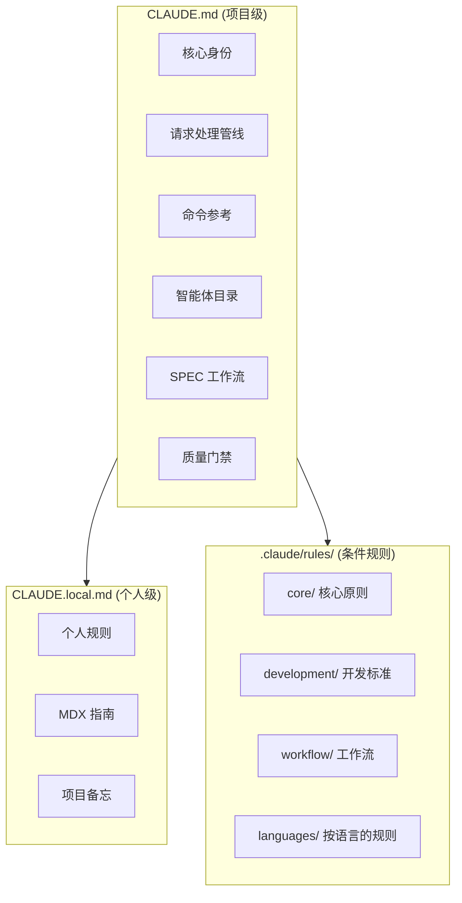
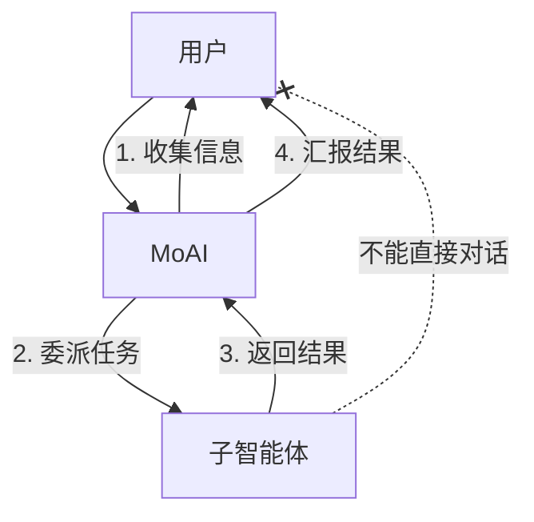
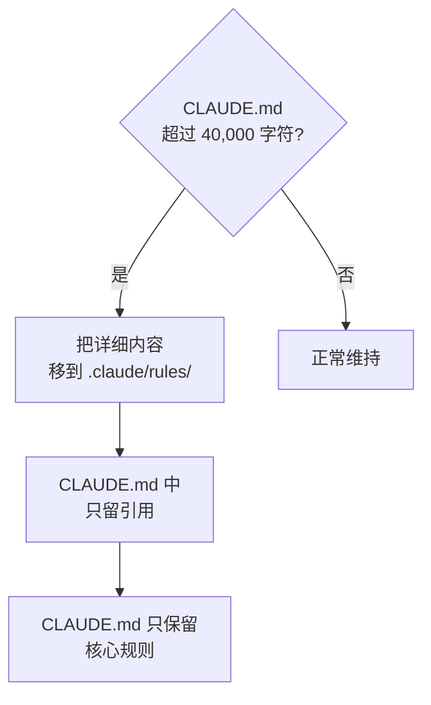
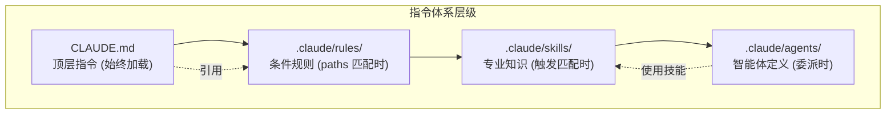

详细介绍 Claude Code 的核心指令文件体系。`CLAUDE.md` 是每个会话都会加载的文件，因此这份文件的每一行都是常驻的上下文成本 — 指令体系设计既是 Harness 设计，也是代币经济学。


**一句话总结**：`CLAUDE.md` 是项目的 **宪法**。Claude Code 如何理解项目、遵循哪些规则、调用哪些智能体，都由这份文件决定。


## 什么是 CLAUDE.md？

`CLAUDE.md` 是 Claude Code 开始会话时 **最先读取的指令文件**。项目的规则、智能体结构、工作流、质量标准等都定义在这份文件中。

就像人入职新公司要读员工手册一样，Claude Code 在会话开始时读取 `CLAUDE.md` 来把握项目脉络。

## 文件结构

MoAI-ADK 使用 2 个指令文件与一个规则目录。



| 文件/目录 | 用途 | Git 跟踪 | 更新时 |
|---------------|------|----------|-------------|
| `CLAUDE.md` | MoAI-ADK 核心指令 | 是 | 覆盖 |
| `CLAUDE.local.md` | 个人定制指令 | 否 | 保留 |
| `.claude/rules/moai/` | 条件化细则 | 是 | 覆盖 |
| `.claude/rules/local/` | 个人定制规则 | 否 | 保留 |

## MoAI CLAUDE.md 主要章节

### 1. 核心身份

定义 MoAI 编排器的角色与 HARD 规则。

```markdown
## 1. 核心身份

MoAI 是 Claude Code 的战略编排器。

### HARD 规则 (必须)
- [HARD] 语言感知响应: 以用户的 conversation_language 响应
- [HARD] 并行执行: 独立的工具调用并行执行
- [HARD] 不显示 XML 标签: 面向用户的响应中不显示 XML
- [HARD] Markdown 输出: 所有沟通使用 Markdown
```

### 2. 请求处理管线 (Analyze-First)

所有请求无论输入语言如何，都经过同一条有序管线。v3.0 的核心是 **意图分析永远先行** — 不靠英文关键字匹配，而是以语言无关的语义分类进行路由。

| 阶段 | 说明 |
|------|------|
| 1. 意图分析 | 以语言无关的方式对请求意图分类 (Analyze-First) |
| 2. 上下文充分性检查 | 不足时在执行前用苏格拉底式访谈确认 |
| 3. 组建执行计划 | 技能/智能体/工作流链 + 选择编排模式 |
| 4. 审批门禁 | 包括实现启动审批（plan→run 人工门禁） |
| 5. 执行 → 验证 → 迭代 | 对照验收标准验证；若设置了 goal，则由 goal 评估器判定终止 |

### 3. 命令参考

`/moai` 是所有 MoAI 开发工作流的单一入口。

| 类型 | 命令 | 用途 |
|------|--------|------|
| SPEC 管线 | `/moai plan`, `/moai run`, `/moai sync` | 3-phase 开发工作流 |
| 循环/修复 | `/moai goal`, `/moai loop`, `/moai fix` | 条件声明循环、迭代修复、单次修复 |
| 项目/Harness | `/moai project`, `/moai harness` | 项目文档 + Harness 生成/管理 |
| 质量/工具 | `/moai review`, `/moai gate`, `/moai clean`, `/moai mx`, `/moai codemaps`, `/moai feedback` | 评审、门禁、清理、注解、文档、反馈 |
| （自然语言） | `/moai "请求"` | Analyze-First 路由 → 自主管线 |

### 4. 智能体目录

MoAI-ADK 由 **11 个保留智能体**（10 个 MoAI-custom + 1 个 Anthropic built-in）组成。经过架构简化，manager-strategy、manager-quality、manager-brain、manager-project 等 12 个 archived 智能体被面向特定领域的 per-spawn `Agent(general-purpose)` 委派所取代。

| 分类 | 智能体 | 角色 |
|------|----------|------|
| Manager (5) | manager-spec, manager-develop, manager-docs, manager-git, manager-design | 核心生命周期各阶段专家 |
| Evaluator (2) | plan-auditor, sync-auditor | 计划/完成阶段独立质量评估 |
| Builder (1) | builder-harness | 生成按项目的动态 Harness |
| Advisor (1) | super-advisor | 高推理咨询（E1-E4 升级） |
| Specialist (1) | e2e-tester | 网页/移动/桌面 E2E 测试执行 |
| Built-in (1) | Explore (Anthropic) | 只读代码库探索 |

### 5. SPEC 工作流

定义 3 阶段的基于 SPEC 的开发工作流。

```bash
# Plan: 生成 SPEC 文档 (30K 代币)
> /moai plan "功能描述"

# Run: DDD 实现 (180K 代币)
> /moai run SPEC-XXX

# Sync: 文档同步 (40K 代币)
> /moai sync SPEC-XXX

# E2E: 运行 Web/移动端/桌面端 E2E 测试
> /moai e2e
```

### 6. 质量门禁

定义 TRUST 5 框架与 LSP 质量门禁。

| 质量标准 | 要求 |
|-----------|----------|
| Tested | 85%+ 覆盖率，LSP 类型错误 0 |
| Readable | 命名清晰，LSP lint 错误 0 |
| Unified | 风格一致，LSP 警告 10 个以下 |
| Secured | 遵循 OWASP，LSP 安全警告 0 |
| Trackable | 提交清晰，LSP 状态跟踪 |

### 7. 用户交互架构

子智能体不能直接与用户对话。用户接触点固定为 MoAI 一个。



### 8. 配置参考

引用语言设置、用户设置与项目规则。

```yaml
language:
  conversation_language: ko           # 用户响应语言
  agent_prompt_language: en           # 智能体内部语言
  git_commit_messages: en             # Git 提交信息
  code_comments: en                   # 代码注释
  documentation: en                   # 文档文件
```

## CLAUDE.local.md 的用法

`CLAUDE.local.md` 是编写个人规则与备忘的文件。它与 MoAI-ADK 更新无关，始终保留。

### 编写示例

```markdown
# 项目本地配置

## 文档编写指南

### 防止 MDX 渲染错误
- 强调标记与括号之间必须留空格

### Mermaid 图方向
- 所有图使用纵向 (flowchart TD)

## 个人备忘
- DB 迁移前必须备份
- API 端点命名: 使用 kebab-case
```

### 使用技巧

| 用途 | 内容示例 |
|------|-----------|
| 编码规则 | "变量名 camelCase，文件名 kebab-case" |
| 项目备忘 | "认证用 JWT，过期 24 小时，续期 7 天" |
| 禁止事项 | "不要在生产代码中留下 console.log" |
| 偏好模式 | "React 组件只用函数式" |
| MDX 规则 | "强调标记与括号之间必须留空格" |

## .claude/rules/ 系统

`.claude/rules/` 目录存放 **按条件加载的细则**。之所以不把所有规则都塞进 CLAUDE.md，而是拆分为条件化文件，理由只有一个 — 让用不到的规则不占用上下文。

### 目录结构

```
.claude/rules/moai/
├── core/                          # 核心原则
│   └── moai-constitution.md       # TRUST 5、核心规则
├── development/                   # 开发标准
│   ├── skill-authoring.md         # 技能编写指南
│   └── coding-standards.md        # 编码标准
├── workflow/                      # 工作流
│   ├── workflow-modes.md          # Plan/Run/Sync 定义
│   └── spec-workflow.md           # SPEC 工作流
└── languages/                     # 按语言的规则 (16 种)
    ├── python.md
    ├── typescript.md
    ├── javascript.md
    └── ...
```

### 条件加载 (paths frontmatter)

规则文件通过 `paths` frontmatter **仅在操作特定文件时加载**。

```yaml
---
paths:
  - "**/*.py"
  - "**/pyproject.toml"
---

# Python 编码规则
- 使用 ruff 格式化工具
- type hints 必需
- docstring 使用 Google 风格
```

此规则仅在修改 Python 文件时加载，**节省代币**。

### 规则文件种类

| 目录 | 文件 | 加载条件 |
|----------|------|-----------|
| `core/` | `moai-constitution.md` | 始终加载 |
| `development/` | `skill-authoring.md` | 技能相关工作时 |
| `development/` | `coding-standards.md` | 代码工作时 |
| `workflow/` | `workflow-modes.md` | 工作流命令时 |
| `workflow/` | `spec-workflow.md` | SPEC 相关工作时 |
| `languages/` | `python.md` 等 | 修改对应语言文件时 |

## 大小限制

`CLAUDE.md` 应保持在 **40,000 字符以下**。MoAI-ADK 自身在 v3 期间也在持续为 CLAUDE.md 瘦身 — 常驻加载的指令越短，每个会话就越便宜。

### 超出大小时的应对方法



**应对策略：**

1. **迁移详细内容**：长说明拆分到 `.claude/rules/` 文件
2. **使用引用**：在 `CLAUDE.md` 中以 `@文件路径` 引用
3. **只留核心**：只保留身份、HARD 规则、智能体目录
4. **转为技能**：长模式说明转换为技能

## 实战示例：CLAUDE.local.md 定制规则

### 前端项目

```markdown
# 项目本地配置

## React 规则
- 组件必须以函数式编写
- Props 接口定义在组件文件顶部
- 状态管理使用 Zustand
- CSS 只使用 Tailwind CSS

## 命名规则
- 组件: PascalCase (UserProfile.tsx)
- 工具函数: camelCase (formatDate.ts)
- 常量: UPPER_SNAKE_CASE (MAX_RETRY_COUNT)
- API 端点: kebab-case (/api/user-profiles)

## 禁止事项
- 禁止使用 any 类型
- 生产代码中禁止 console.log
- 禁止 default export (只用 named export)
```

### 后端项目

```markdown
# 项目本地配置

## Python 规则
- 使用 FastAPI
- 优先异步函数 (async/await)
- 使用 Pydantic v2 模型
- SQLAlchemy 2.0 风格

## 数据库规则
- 迁移前必须备份
- 索引在分析查询模式后再添加
- 使用 soft delete 模式 (is_deleted 标志)

## API 规则
- RESTful 端点命名
- 统一响应格式: {"data": ..., "message": ...}
- 错误码标准化
```

## CLAUDE.md、rules、skills 的关系

指令体系分为 4 层，越往下加载条件越窄。



| 层级 | 文件 | 加载时机 | 角色 |
|------|------|-----------|------|
| 1. CLAUDE.md | `CLAUDE.md` | 始终 | 项目身份、核心规则 |
| 2. Rules | `.claude/rules/*.md` | 文件模式匹配时 | 条件化细则 |
| 3. Skills | `.claude/skills/*/skill.md` | 触发匹配时 | 专业知识、模式 |
| 4. Agents | `.claude/agents/*.md` | 委派时 | 专家角色定义 |

## 相关文档

- [技能指南](/zh/advanced/skill-guide) - 技能系统详解
- [智能体指南](/zh/advanced/agent-guide) - 智能体系统详解
- [settings.json 指南](/zh/advanced/settings-json) - 配置文件管理
- [Hooks 指南](/zh/advanced/hooks-guide) - 事件自动化


**提示**：与其直接修改 `CLAUDE.md`，更推荐把个人规则加到 `CLAUDE.local.md`。这样在 MoAI-ADK 更新时个人规则也会被安全保留。

