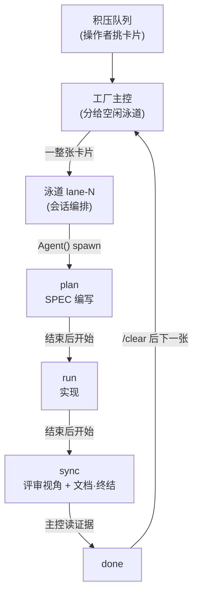



# 工厂模式 (Factory Mode)


 <strong>所属价值</strong>: 多会话编排 · token 经济学


工厂模式是看板模式的第二种形态。如果说看板是“三个角色的伴随会话把一张卡片在各列之间搬运”的板子，那么工厂就是**N 条编号泳道**同时搬运多张卡片的装配线。卡片不在列与列之间移动 —— 它**整张**进入一条空闲泳道，由那条泳道在会话内按顺序把 `plan → run → sync` 负责到底。

进入用的专用标记是 `-f`。看板链用 `-k`，工厂用 `-f`。队列、证据判读、集成、废弃的规则与看板完全相同 —— 变化的只有卡片在板上流动的形状。

## 工厂与看板的分岔点

| | 看板模式 (`-k`) | 工厂模式 (`-f`) |
|---|---|---|
| 会话构成 | 主控 1 + 角色伴随会话 3 (`plan`·`run`·`sync`) | 主控 1 + 泳道 `lane-1` … `lane-N` |
| 卡片的移动 | 在列与列之间、从会话到会话 | 整张进一条泳道，在泳道内按顺序过阶段 |
| 阶段执行 | 由各列坐镇的伴随会话承担 | 泳道把各阶段作为 `Agent()` 子智能体 spawn 执行 |
| 卡片类别 | A/B/C 定义卡片**经过的列** | A/B/C 只为卡片**跳过的仪式**命名 —— 任何卡片都不换会话 |
| `/clear` 边界 | 阶段与阶段之间 | 卡片与卡片之间 |

在看板里，卡片类别定义的是捷径的形状 —— 类别 A 跳过 `plan` 列，类别 B 也跳过 `plan` 列。工厂里没有坐在各列上的会话，这个区分随之消失。类别仍然为卡片跳过的仪式命名（类别 B 不经 `plan` 推进所以没有 SPEC，类别 A 直奔立即关闭），但不再改变卡片在哪个会话里工作。所有泳道都把自己卡片剩下的阶段 —— 无论是什么 —— 串行地执行完。

## 进入 —— 打开主控与泳道

```bash
# 主控 —— 4 条泳道的工厂 run (会告知 lane-1..lane-4 的启动命令)
$ moai cc -f 4

# 泳道 —— 各自在自己的终端里，一条命令里带编号
$ moai cc -f lane-1
$ moai cc -f lane-2
$ moai cc -f lane-3
$ moai cc -f lane-4

# GLM 后端的泳道也是同样的形式
$ moai glm -f lane-3
```

`-f` 后面不接数量时，默认以一条泳道（`lane-1`）起步。队列开始积压之后，再用 `moai cc -f lane-<n>`（或 `moai glm -f lane-<n>`）一条一条地加泳道。泳道与看板的伴随会话一样，由**人在各自的终端里亲自**启动 —— 会话替别的会话启动的路径不存在。

一次运行只能带一个进入标记 —— `-k` 与 `-f` 同时给出会报错。v1.2.0 的统一进入形式 —— `-k <N>`（主控）和 `-k <N> --name lane-<i>`（泳道）—— 仍是有效的兼容形式（不带 N、只写 `-k --name lane-<i>` 时默认 8 条泳道）。混合后端启动器 `moai cg` 出于与看板相同的原因拒绝工厂（`FACTORY_MODE_UNSUPPORTED_BACKEND`）。看板主控的套接字开在 `/tmp/moai-socket-kanban/<run-id>`，工厂主控的套接字开在 `/tmp/moai-socket-factory/<run-id>`，引导信息会一并给出实际路径。

## 主控的路由 —— 卡片整张进空闲泳道

工厂主控干的事与看板主控不同。看板主控协调的是一张卡片的各个阶段，而工厂主控**把已挑选的卡片分给空闲的泳道**。这里的“空闲泳道”指的是上一张卡片已到达 `done`、其证据已被主控读过 —— 正拿着卡片的泳道不会被呼叫，所有泳道都忙时，卡片不会被分配，只在队列里等待。

挑卡片的主体永远是操作者（`moai todo next <n>`）。工厂主控不会翻遍队列给卡片排序。看板工头循环（单独的 `/loop`）也不例外，它只派送已被标记为 `picked` 的下一张卡片，绝不自己挑。派单块的形式与看板相同，`cmd` 字段指向由类别决定的进入阶段 —— 类别 C 是 `/moai plan`，类别 B 是 `/moai run`，类别 A 是立即关闭。泳道自己把剩下的阶段推进下去，不需要追加派单。

## 泳道内的 3 个阶段 —— 串行推进

一条泳道如何通过一张卡片，三句话就能说清。**plan 结束之后 run 才开始，run 结束之后 sync 才开始** —— 泳道不会同时转动同一张卡片的两个阶段。各阶段的执行由泳道以 `Agent()` 子智能体的形式 spawn，泳道自己只做编排。子智能体的输出留在它自己的会话窗口里，泳道读取他们留下的证据来拼合结果。



阶段推进期间，人工门禁照常触发。实现启动审批这类需要人批准的节点，在泳道里也不会被自动放行。

## 并行的上限与隔离

每条泳道各自最多可以**同时运行 10 个智能体** —— 启动器会向泳道会话注入 `CLAUDE_CODE_MAX_CONCURRENT_SUBAGENTS` 上限，所以 N 条泳道同时扇出时，机器容量是靠结构切分，而不是靠操作者克制。

并行有两个轴，彼此不混用：

- **卡片之间（扇出）**—— 每张卡片配上工作者，可以同时推进多张。工作者各自只写自己的卡片目录（`.moai/specs/<SPEC-ID>/`），所以并行写入不会冲突。
- **卡片之内（阶段）**—— 一张卡片的阶段是串行的。不会给同一张卡片并行挂两个写入智能体 —— 一张卡片，同一时间只有一个写入者。

并行 spawn 承担写入的子智能体时，一定带上 worktree 隔离（`isolation: "worktree"`）—— 每个写入智能体在自己的 worktree 副本里工作，所以在卡片目录之外文件写入也不冲突，泳道用证据和合并来收拢。只读的调查、审计扇出不隔离 —— 那是设置 worktree 的成本什么也买不到的地方。

### 错峰启动，禁止模型覆盖

启动泳道时，千万不要把全部泳道一次性激活。先启动第一条泳道，等到有证据表明它已经开始产出（拿到第一个任务或出现可见进展）之后，再激活其余泳道 —— 并发请求读不到还在写入中的缓存条目，同时启动会破坏缓存效率。同样的理由，也不要在派单消息里附带模型覆盖 —— GLM 的层级映射是搭着 `ANTHROPIC_DEFAULT_*_MODEL` 槽位环境变量走的，逐次 spawn 附加覆盖会把缓存打散，还可能绕开槽位到 GLM 的映射。

## 泳道编号的归属 —— workers.json

哪个编号被哪条泳道握着，记录在 `.moai/state/factory/workers.json` 里。新泳道启动时，编号只跳过**仍被活着的会话握住的**那些，落到下一个空号 —— 已死泳道的编号会被释放并重新使用，残留的 claim 也从这个文件里清掉。`-f lane-<n>` 形式已经定下了名字，所以与 `--name`/`-n` 同时给出会报错。

## 不变的东西

工厂改变的只是卡片流动的形状。其余规则与看板一字不差地继续生效：

- **委任的通道是磁盘上的队列。** 派单是指针而不是副本，消息只是催促，不是委任本身。
- **完成只凭读到的证据判定。** 推进卡片看的是进度记录有没有被读过，不是泳道有没有回话。最终的 PASS/FAIL 判定永远是主控的 —— 让产出工作的泳道审查自己的输出，这种形态不被允许。
- **`/clear` 边界在卡片之间。** 阶段之间的交接消失正是这个模式的要点，但卡片之间的交接不会消失 —— 卡片到达 `done` 后，在接下一张卡片之前，先对那条泳道做 `/clear`。
- **卡片的 worktree 在远程合并落地之前不废弃。** 分支还没合并时，worktree 就是那份工作的唯一副本。

## 相关文档

- [看板模式](/zh/advanced/kanban-mode) — 三个角色把卡片在列间搬运的第一种形态。卡片类别与看板·队列的共用规则
- [`/moai todo`](/zh/utility-commands/moai-todo) — 把卡片放进看板的积压队列。挑卡片的主体是操作者
- [manager-lead 领导协调者](/zh/advanced/manager-lead) — 在看板与工厂的主控会话里负责派单的协调智能体
- [`/moai loop`](/zh/utility-commands/moai-loop) — 用 bare `/loop` 驱动的无人工头。与工厂主控相同的“只搬运、不挑选”边界
- [看板术语](/zh/core-concepts/kanban-board-terms) — 卡片·列·泳道·主控的定义与示例俱全的正式术语表
