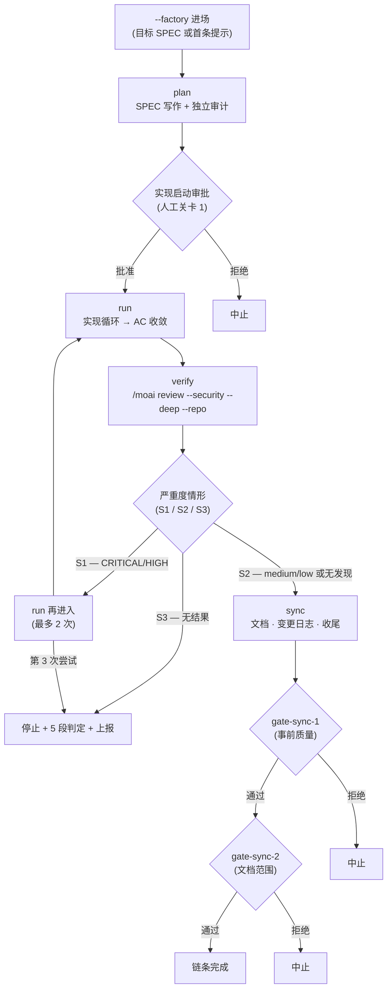




 <strong>所属价值</strong>：代理式循环工程 · 代理式线束

<!-- @value: self-learning, agentic-harness -->

给会话启动器加上 `--factory`（简写 `-f`）开关，编排器（指挥工作的指挥家）就会在一个会话里一次跑完 `plan → run → verify → sync` 四个阶段，把一份 SPEC（需求规格书）从计划推到收尾。这不是新的子命令，也不是新的运行时。只是把 `factory_chain` 这个目标预设（预先定好完成条件的组合）搭上已有的 `/moai goal` 无限持续循环之上的进场契约。

本页把用工厂模式把一份 SPEC 推到底的流程拆成四段讲解。工作流命令视角的简短介绍请先看 [`/moai` 统一命令](/zh/workflow-commands/)的工厂模式条目。这里再深一层：进场条件、链条阶段、四道人工关卡（人审批的决策点）、严重度分流、终止条件，以及"什么不被自动化"。

## 本页讲什么

工厂模式是扩展 `full-pipeline` 契约（对单份 SPEC 缔结 run→sync 自动链的约定）的进场契约。它确切地多加两样东西。

1. **plan 阶段作为链头**——链不再逐阶段调用，而是从 plan 开始。
2. **verify 出入关卡**——在 run 阶段出口部署自动安全审查（`/moai review --security --deep --repo`）。

其余链式规则按继承原样。没有第二套链式机制。整条链的流向一张图就能抓住。



## Step 1 — 以工厂模式开启会话


**不是斜杠命令**：工厂模式不是 Claude Code 对话框里的 `/` 命令，而是开启会话本身的开关。在终端启动会话时加上。对话框内无法开关。


在终端给会话启动器加上 `--factory` 启动。一并给出 SPEC 标识符就以该 SPEC 为目标，省略则从首条提示开始 plan 阶段。

```bash
# 以 SPEC 为目标进入工厂链
$ claude --factory SPEC-AUTH-001

# 简写形式
$ claude -f SPEC-AUTH-001

# 不带目标 SPEC——从首条提示开始 plan
$ claude --factory

# 用 moai cc 启动器作同样进场
$ moai cc --factory SPEC-AUTH-001
```

进场成功后，启动器往会话里塞两样东西。第一，即将看到的 `factory_chain` 目标预设会在（实现启动审批通过之后）挂载。第二，把 Claude Code 运行时的连续拦截上限（`CLAUDE_CODE_STOP_HOOK_BLOCK_CAP`，默认 8）通过 `MOAI_FACTORY` 环境变量上调到 200。这种上调并不越过关卡——人工关卡不是靠拦截上限而是靠 `AskUserQuestion` 触发，所以上限是 8 还是 200，关卡的触发条件都一样。会话结束时用 `defer` 恢复进场前的值，不触碰全局环境。

```bash
# 概念流程——启动器在会话开始/结束时塞入
# (用户无需自己动环境变量)
enter_factory_session():
    set CLAUDE_CODE_STOP_HOOK_BLOCK_CAP=200 via MOAI_FACTORY
    defer restore original CAP value
    start factory_chain preset
```

有一条硬边界。工厂模式在混合后端启动器 `moai cg` 中被拒绝。`moai cg` 让一个后端跑领导者、另一个后端跑队员，这与链条前提"一个会话 / 一个后端 / 一条链"矛盾——verify 阶段究竟在哪个后端跑过将无法判定。会话不会开启，并伴随拒绝哨兵 `FACTORY_MODE_UNSUPPORTED_BACKEND`。这不是要变通绕过的空子，而是有意的边界。

## Step 2 — plan 通过与实现启动审批

plan 阶段写作 SPEC 文档，独立审计（plan-auditor 子智能体）验证其内容。这部分与有没有工厂模式都一样地跑，是链条的头。

plan 结束后链条并不直接进 run。挡在 plan 与 run 之间的是第一道人工关卡——**实现启动审批**（Implementation Kickoff Approval）。编排器用 `AskUserQuestion` 向用户询问"是否就按这份 SPEC 开始实现"，获批才进入 run 阶段。这道关卡不是工厂模式新造的，而是继承的——`/moai run` 平时也守的是同一道门。

这道关卡通过的位置也正是挂载目标预设的位置。链条此后没有再问用户偏好的途径，所以在偏好全部落地的这扇门过后才挂载 `factory_chain`。挂载规则有三。

- **仅在关卡 1 通过后挂载。** 用户偏好落地的位置是 plan→run 关卡。
- **与活儿一起挂载，而非代替活儿。** `arm-only` 只登记条件、什么都不启动。所以编排器在启动预设驱动的阶段的同一回合挂载预设。
- **用标志绑定，而非散文。** `--max-turns 0 --max-duration 14400`——无限回合、4 小时挂钟上限（wall-clock，以经过时长为基准的额度）。若在条件句里用散文写"20 回合后停"，评估器不会解析，于是信以为真的上限根本不起作用。

`factory_chain` 的完成条件**完全由模型条件**（判定对话记录的谓词）组成。每个回合末由既有的 `stop-goal` Stop 钩子评估器评估。没有新运行时、没有新钩子、没有新评估器——只是给既有机器搭上一个条件。

```text
The plan-phase artifacts for the targeted SPEC are surfaced as authored and
the plan audit verdict is surfaced as PASS; AND every blocking acceptance
criterion has its PASS evidence surfaced in the conversation; AND the verify
stage is surfaced as having produced a readable result, with its severity case
(S1 / S2 / S3) and its rung stated in the transcript; AND the sync phase is
surfaced as closed, with the SPEC status transition recorded. All of these
hold — that is the end state.
```

每个子句指向的都是编排器一边干活一边写进对话的内容。若是要打开文件路径才能判断的谓词，就不算模型条件，无法安静收敛。承受的风险也写得很清楚——无人工厂 run 在挂钟上限触发前最多可消耗 4 小时的代币。这是为了让那些合理地需要很多回合的链条不被半路砍掉而做的取舍。不想要，就别用这个上限挂载。

## Step 3 — run 收尾与 verify 严重度分流

run 阶段里，设定好的实现循环（TDD 或 DDD）向验收标准（Acceptance Criterion，AC——SPEC 必须满足的通过条件）收敛，实现代码。这一阶段本身有没有工厂模式都一样。

工厂链引入的结构装置在 run 阶段的出口。run 一结束 verify 阶段跑一次，`/moai review --security --deep --repo` 给出安全审查结果。结果出来后按严重度分三路。这个分流正是工厂链新加人工关卡诞生的地方。

```bash
# S1 — 发现 CRITICAL/HIGH：回到 run 重写 fix
plan(不变) → run(再进入) → verify(重评估)

# S2 — medium/low 或无发现：把发现带进 sync 往前走
plan(完成) → run(完成) → verify(S2) → sync

# S3 — 连可读的结果都没有：不计入再进入 ceiling
verify(S3) → 停止 + 5 段判定 + 上报
```

S1 是一次拦截。run 阶段修掉发现的 CRITICAL/HIGH 之后重跑 verify。再进入**最多 2 次**，第三次仍是 S1 则链条停止，上报 5 段判定（主张/证据/baseline 归属/未验证/残余风险）。这道 ceiling 是防止无限再进入循环的安全装置。S2 不是拦截——把 medium/low 发现随前进步伐带交 sync 阶段。不是无视发现，而是把发现移到"sync 能处理的重量"。S3 是与 S1/S2 不同性质的失败。verify 因超时、工具失败、格式不符给不出结果时，链条立刻停止。S3 **不计入再进入 ceiling（2 次）的次数**——以免"再跑一次大概就有了"这种猜测浪费 ceiling。

发现 CRITICAL/HIGH 时编排器发起的 `AskUserQuestion` 回合，正是工厂模式引入的**新人工关卡**（关卡 2）。工厂模式新造的关卡只此一个，其余三个都是继承。

verify 结果除严重度外还多带一个属性——**rung**（审查工具的可信等级）。rung 用三档表示审查工具跑到了哪一档。

| rung | 含义 | 对 sync 的影响 |
|------|------|---------------------|
| `PRIMARY` | 基本检查工具正常工作 | sync Phase 8 的安全审查步骤正常执行 |
| `FALLBACK` | 基本工具失败、改走备用工具 | sync Phase 8 同样执行（内容基于 fallback 结果） |
| `DEGRADED` | 跳过安全审查就结束 run | **强制打开**对 sync Phase 8 安全审查抑制的关闭（Step 0.55.1） |

`DEGRADED` 这档很重要。因为它意味着"run 要跑完，但不在 sync 里留下跳过安全审查的原状"。这是让 sync 补上 run 缺失的安全审查的装置。

## Step 4 — sync 收尾与链条终止

sync 阶段更新文档、写变更日志、收尾阶段。这里也有两道继承的人工关卡触发——检查事前质量的 `gate-sync-1`（关卡 3）和检查文档范围的 `gate-sync-2`（关卡 4）。两道关卡都是 `/moai sync` 平时也守的同一道门。

工厂链的 verify 与 sync 阶段之间以记录交换"run 最后跑了哪些安全检查"。这份记录让 sync Phase 8 不重跑同一批检查。设计上是**允许清单而非拒绝清单**这点很重要——不是减检查的方向，而是显式承认 run 已跑过的检查的方向。

```bash
# 检查 revision-match 谓词（概念性）
# run 最后提交的扫描结果 vs sync 想跑的检查
if revision_match(scanned_commit, current_commit):
    skip_duplicate_scan()    # run 已看过的检查跳过
    record_skip_reason("already scanned at <sha>")
else:
    run_scan_normally()      # 有差异就正常跑
```

谓词为假时——即 run 跑安全检查的提交与 sync 要看的提交不同——sync 正常执行安全审查步骤。跳过仅适用于在相同提交上已观察到的结果。跳过的检查在结果目录和匹配的 `scanned_commit` 中显式留痕，之后可追溯"为什么这项检查被省了"。依赖清单审计（`go.mod`、`package-lock.json` 等）在这份契约里**无例外地始终执行**——依赖变更是不分提交、每次都要检查的无条件领域。

链条在下列情况之一首次出现时结束。没有第五种出口。

- **条件成立**——链条完成。
- **4 小时挂钟上限**——`--max-duration 14400` 触发。
- **停滞守卫**——目标引擎抓到连续 N 次无进展而停。
- **人工关卡拒绝**——四道关卡任一处拒绝。
- **到达 S3 或 S1 ceiling**——verify 给不出可读结果，或再进入 2 次仍出 S1，则停止。

工厂会话在 `.moai/state/factory/` 下按会话键各留一份记录。启动器进场时写一份，会话结束时清理。记录包含 `session_id`、`spec_id`、`backend`、`entered_at`、`deepscan_dir`、`verify_rung`、`verify_reentries` 字段，在会话中途结束时能告诉你停在哪。再次进场时是从头开始还是续跑，交给运维者判断——工厂模式本身不承诺自动续跑。

## 什么时候用，什么时候不用


**一份 SPEC、一个会话、一个后端。** 工厂模式一次只一份 SPEC。这份 SPEC 一结束链条也结束；要让下一份 SPEC 接着跑，就得开一个新的工厂会话。


**用的时候**——要把一份 SPEC 一口气推到收尾时。合理预期在挂钟上限（4 小时）内结束时。在单后端作业时。

**不用的时候**——想在阶段之间由人逐一判断、审查中间产出时（这种情况下请按回合推进普通的 `plan → run → sync`）。必须用混合后端（`moai cg`）时。一两回合就能完的短任务挂上 4 小时上限的无限循环是过度的。

## 本页不做的事（范围边界）

- **不是新的子命令**——`--factory` 是启动器开关，不是 `/moai factory` 之类的对话命令。
- **不是新的运行时**——`stop-goal` 评估器、`full-pipeline` 链式、四道人工关卡都用既有机器。
- **不跳过人工关卡**——四道关卡不变地触发。上调拦截上限并不越过关卡。
- **不在混合后端工作**——在 `moai cg` 启动器中被拒绝。

## 相关文档

- [`/moai` 统一命令 — 工厂模式](/zh/workflow-commands/)——工作流命令视角的简短介绍
- [`/moai goal`](/zh/workflow-commands/moai-goal)——驱动工厂链的 `factory_chain` 预设所搭载的目标引擎
- [自主连续循环](/zh/advanced/autonomous-loops)——`/moai goal`、`/moai loop`、原生 `/goal` 的所有权与护栏比较
- [`/moai run`](/zh/workflow-commands/moai-run)——run 阶段自主性接线（`ac_converge`），工厂链的 run 阶段继承的就是它
- [线束工程](/zh/core-concepts/harness-engineering)——阶段链式与观察如何在线束设计之上就位
