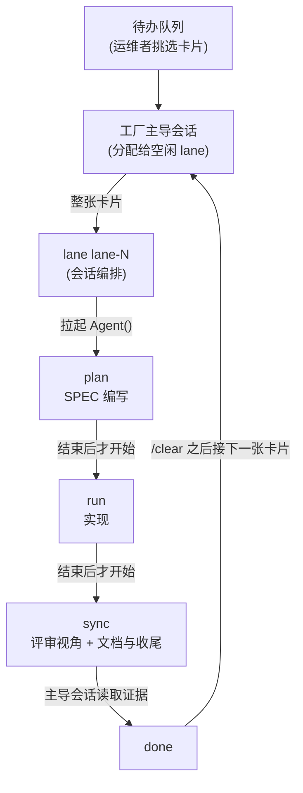



# 工厂模式 (Factory Mode)


 <strong>所属价值</strong>：多会话编排 · Token 经济学


工厂模式是一条装配线：一个**主导**会话加上若干带编号的**lane**会话，同时搬运多张卡片。卡片不会在各列之间来回移动，而是**整张**交给一条空闲的 lane，由这条 lane 在自己的会话里按顺序负责完 `plan → run → sync`。

进入令牌只有两个，都不带参数。`-f` 打开主导会话，`-l` 以 lane 的身份加入。这两个令牌只负责启动或加入会话，不会运行流水线、不会设置目标，也不会选定 SPEC。

## 进入形式

| 想做的事 | 命令 | 角色 |
|----------|------|------|
| 打开工厂主导会话 | `moai cc -f` · `moai glm -f`（长形式 `--factory`） | 主导 |
| 以 lane 身份加入正在运行的工厂 | `moai cc -l` · `moai glm -l` · `moai codex -l`（长形式 `--lane`） | lane |

- `-l` 会加入正在运行的工厂，并**自动领取下一个 lane 编号**。编号不由运维者挑选，取存活 lane 中最大编号的下一个。没有正在运行的工厂时，加入会被拒绝。
- `moai codex` 没有主导入口，只能以 lane 身份加入；主导会话要用 `moai cc -f` 或 `moai glm -f` 打开。
- 一次启动最多带一个进入令牌，`-f` 与 `-l` 同时出现会报错。

```bash
# 主导：打开工厂主导会话
$ moai cc -f

# lane：各自在自己的终端里，按下一个编号 (lane-1, lane-2, ...) 加入
$ moai cc -l
$ moai cc -l
$ moai glm -l      # GLM 后端的 lane，形式相同
$ moai codex -l    # Codex 的 lane
```

lane 由**人在各自的终端里手动**启动。没有哪个会话能替你去启动另一个会话。

### 被拒绝的形式

带了值的进入会被一行错误拒绝，错误信息会指明正确的形式。

| 被拒绝的形式 | 原因 |
|--------------|------|
| `moai cc -f <值>`（SPEC ID、数字、lane 标签） | `-f` 不接受参数。主导会话只用 `-f` 打开，lane 用 `-l` 加入 |
| `moai cc -l <值>`（如 `lane-2` 之类的名字） | lane 不自己命名，编号是自动分配的 |
| `moai codex` 上的 `-f` | Codex 没有主导入口（请用 `moai cc -f` 或 `moai glm -f`） |
| 同时使用 `-f` 与 `-l` | 只允许一个进入令牌 |
| 已停用的 `-k` 入口 | 早先那种多会话分列运行的模式已被移除，错误信息会指向 `-f` 和 `-l` |
| `moai cg`、`moai gpt` | `moai cg` 已停用，会给出迁移提示后退出（可用 `moai migrate cg` 预览）；`moai gpt` 不存在，GPT 模型通过 `moai codex` 运行 |

## 同时存在多个运行时

lane 加入时会先读取运行记录。`-l` 可以搭配两个选择器。

| 选择器 | 作用 |
|--------|------|
| `--leader <名称>` | 指定要加入的主导会话（默认 `leader`）。只能与 `-l` 或 `--lane` 一起用，不是任何进入令牌的短形式 |
| `--factory-run <run-id>` | 按 id 指定要加入的运行 |

`--leader` 与 `--factory-run` 是不同的选择器，不能同时使用。如果存活的运行不止一个，无法判断该加入哪个，加入会被拒绝，错误信息会提示在 `--factory-run <run-id>` 与 `--leader <主导会话名>` 之间选一个，并与 `-l` 一起使用。所有者已经退出的运行，可以用 `moai factory runs --retire <run-id>` 退役。

**运行记录缺失，只要主导会话还活着，也能加入。** 当一条有效记录都没有时（记录自动退役，或主导会话没有写过记录），加入不会直接被拒绝。它会用 pid 和进程启动指纹验证本项目中存活的主导会话，以该主导会话的身份恢复运行记录，再走普通关卡加入。若验证出多个主导会话，会列出全部候选并以失败收场；一个都没有，则维持拒绝。

## lane 选项

下面的选项只用在 `moai cc -l` 和 `moai glm -l` 的 lane 上，Codex 的 lane 不接受策略。

| 选项 | 作用 |
|------|------|
| `--clear-policy <值>` | 决定 lane 做完一张卡片后如何清理上下文。`clear-each`（默认，每张卡片后请求 `/clear`）、`clear-when-full`（上下文用量达到按模型而定的交接阈值时才请求）、`relaunch`（请求结束会话，由监督启动器为下一张卡片拉起全新会话） |
| `--no-auto-dispatch` | 以手动模式启动 lane。默认是**自主派单**的 lane：不等主导会话分配，自己用 `moai factory next` 租用队列里的下一张卡片。加上此选项后，lane 只接收主导会话发来的卡片 |

## 卡片如何流动

主导会话做的事，是**把已经选好的卡片分配给空闲的 lane**。空闲 lane 指上一张卡片已到 `done`，且主导会话已读过其证据的 lane。所有 lane 都忙时，卡片不会被分配，留在队列里等待。

挑选卡片的永远是运维者。主导会话不会自行浏览队列、给卡片排序。自主派单的 lane 也不改变这条规则：lane 对队列只做一件事，就是用 `moai factory next` 租用队列里已有的下一张卡片；创建、删除、修改卡片之类的队列变更，仍然禁止 lane 执行。

派单块由 `card`、`cmd`、`wt`、`evidence` 这几个固定字段组成，不超过 10 行。`cmd` 指向卡片等级规定的入口阶段：设计变更（C 类）是 `/moai plan`，原因不明的缺陷（B 类）是 `/moai run`，一行就能收尾的杂务（A 类）直接关闭。其余阶段由 lane 自己推进，不再另行派单。

## lane 内部三个阶段的运转

一条 lane 如何处理一张卡片，三句话就能说清。**plan 结束后 run 才开始，run 结束后 sync 才开始。** lane 不会同时运行同一张卡片的两个阶段。各阶段的执行由 lane 以 `Agent()` 子智能体的方式拉起，lane 自己只做编排；子智能体的输出留在它自己的窗口里，lane 通过它们留下的证据来汇总结果。


```mermaid
flowchart TD
    Queue["待办队列<br/>(运维者挑选卡片)"] --> Lead["工厂主导会话<br/>(分配给空闲 lane)"]
    Lead -->|"整张卡片"| Lane["lane lane-N<br/>(会话编排)"]
    Lane -->|"拉起 Agent()"| Plan["plan<br/>SPEC 编写"]
    Plan -->|"结束后才开始"| Run["run<br/>实现"]
    Run -->|"结束后才开始"| Sync["sync<br/>评审视角 + 文档与收尾"]
    Sync -->|"主导会话读取证据"| Done["done"]
    Done -->|"/clear 之后接下一张卡片"| Lead
```

卡片等级只说明 lane 跳过哪些环节。B 类不经过 `plan`，所以没有 SPEC；A 类直接走关闭。没有哪张卡片会更换会话，每条 lane 都在自己的卡片上串行完成剩下的阶段。阶段推进期间，实现启动审批之类的人工关卡照常触发。

lane 在 `run` 结束、进入集成之前，还要走一个 `card-review` 阶段：卡片范围内的自我评审，结果写入 `.moai/reports/<card-id>/card-review.md`。它只是参考信号，既不替代主导会话对证据的阅读，也不替代独立审计。

## 并行上限与隔离

每条 lane 可以**同时运行最多 10 个智能体**。启动器会在 lane 会话里设置 `CLAUDE_CODE_MAX_CONCURRENT_SUBAGENTS=10`（已有取值时不会改动），所以即便 N 条 lane 同时扇出，机器容量也是靠配置来分摊，而不是靠运维者自觉。

并行有两个轴，互不混用。

- **卡片之间（扇出）**：每张卡片配一条 lane，就能同时推进多张。各 lane 只写自己的卡片目录（`.moai/specs/<SPEC-ID>/`），并行写入不会冲突。
- **卡片之内（阶段）**：同一张卡片的各阶段串行。不会给同一张卡片同时挂两个有写权限的智能体，一张卡片，同一时刻只有一个写入者。

并行拉起有写权限的子智能体时，必须加上 worktree 隔离（`isolation: "worktree"`）。每个写入智能体在自己的 worktree 副本里工作，所以卡片目录之外的文件写入也不会冲突，lane 再通过证据和合并来整合。只读的调查、审计扇出不做隔离，因为创建 worktree 在那里换不来任何好处。

不要一次把所有 lane 全部启动。先起第一条 lane，确认它确实开始产出，再启动其余的。并发请求读不到仍在写入中的缓存条目，同时启动会破坏缓存效率。

## lane 编号与运行记录

哪个编号被哪条 lane 占用，记录在 `~/.moai/db/<project-key>/factory/factory.db`。新 lane 领取存活 lane 中**最大编号的下一个**，不会回填中间的空位：存活的是 lane-1 和 lane-3 时，新 lane 是 lane-4。已死 lane 的 claim 不再占住编号。lane 编号是自动分配的，所以与 `--name`/`-n` 同时使用会报错。

主导会话的 socket 开在 `/tmp/moai-socket-factory/<run-id>`，引导提示会告诉你实际路径。主导会话和 lane 会话启动时，会各在 `.moai/state/todo/<session-id>.json` 写入一份会话记录，包含角色、后端和进入时间。

工厂会话启动时，会把连续 Stop 钩子的拦截上限提高到 `CLAUDE_CODE_STOP_HOOK_BLOCK_CAP=200`。这是允许无人值守运行更久的设置，并不是绕过关卡的手段，因为人工审批关卡是编排者发出的提问，而不是 Stop 钩子的拦截。

## 不变的部分

- **委派通道是磁盘上的队列。** 派单是指针而不是副本，消息只是催促，本身不构成委派。
- **完成与否，只以读过的证据判定。** 卡片能否往前走，看的是进度记录有没有被读过，而不是 lane 回没回复。最终的 PASS/FAIL 判定始终属于主导会话，不允许产出工作的 lane 自己审查自己的输出。
- **`/clear` 的边界在卡片与卡片之间。** 卡片到达 `done` 后，先对该 lane 执行 `/clear`，再接下一张卡片（可用 `--clear-policy` 调整）。
- **卡片的 worktree 在远端合并完成之前不会被丢弃。** 分支若还没合并，这个 worktree 就是这项工作唯一的副本。
- **一张卡片，一个 worktree。** 新卡片在新的 worktree 中开始，lane 会话在自己卡片的 worktree 里启动并一直留在那里。

## 相关文档

- [会话溯源链](/zh/advanced/origin-trail-chain)（worktree 会话谱系的记录方式，以及如何用 `moai chain` 查询）
- [`/moai todo`](/zh/utility-commands/moai-todo)（存放卡片的待办队列，挑选卡片的是运维者）
- [manager-lead 主导协调者](/zh/advanced/manager-lead)（为工厂主导会话承担派单的协调智能体）
- [`/moai loop`](/zh/utility-commands/moai-loop)（由裸 `/loop` 驱动的无人值守 foreman，与工厂主导会话遵循同样的“只搬运、不挑选”边界）
- [moai cc / glm 启动器](/zh/cli-reference/launchers)（包含 `-f`、`-l` 在内的全部启动器参数）
