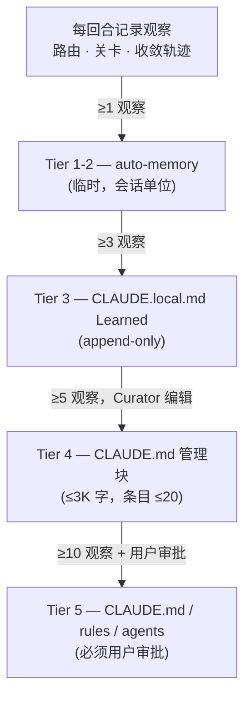
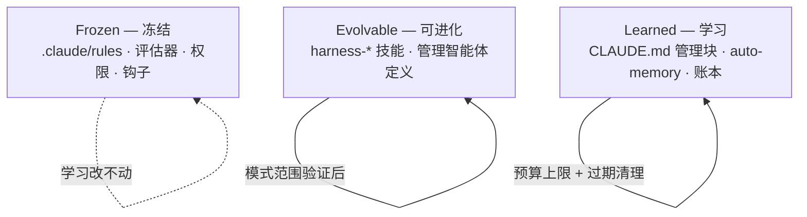



线束（环绕智能体的质量验证自动装置）随着会话反复而变好，原因不在模型权重，而在改变了线束代码与指令。本页整理其中用户可直接观察并审批的接面——**学习面**（learning surface，线束把累积的观察变成规则展示给用户的接面）。管道内部结构（ACE 角色模型、3-Loop、晋升引擎）另行放在[线束自我进化](/zh/advanced/self-evolving/)页面，这里只讲"什么作为观察累积、自动改到哪里、用户在哪里介入"。

## 学习面是什么

学习面指的是从线束每回合自动留下的**观察**（observation，以隐私保留摘要记录路由决策、关卡证据、收敛轨迹的一行）出发，观察汇成**模式**，再晋升为**指令**抵达用户可见的文件——这条完整路径。用户直接动手的面只有三个——临时累积的 auto-memory（会话单位记忆）、留在项目里的 CLAUDE.local.md（本地开发指南）的 Learned 段，以及全团队共同遵循的 CLAUDE.md（项目指令文件）的管理块。观察经由这三张面浮上来，用户决定其中哪些当作规则接受。

这个接面之所以重要，是因为线束的自我改进终究必须只发生在"用户可审查的文件"上。在看不见的地方改了指令就没法调试，昨天还奏手的例程悄悄变了会让人难以找到原因。所以 MoAI-ADK 把发生晋升的面固定为三个，并机械地界定每张面何时、如何被使用。无论 SPEC（需求规格书）工作流有多深，学习结果始终出现在这三个文件里。

## 观察变成规则的路

一行观察要变成用户可读的规则，要经历按频率划分的四档阶梯。一两次观察到的事只留在临时记忆里消失，相同模式反复触及阈值后才升到更持久的面。

这条阶梯的核心是**阈值**。观察到一次的事可能只是例外，但重复五次的模式就是规则。所以在低档只放进临时记忆吸收噪声，越过阈值的观察才升到更持久的面。用户感受到的变化大多发生在 Tier 3 与 Tier 4——某天 CLAUDE.local.md 的 Learned 段多出一行，模式固化后 CLAUDE.md 的管理块会冒出一个条目。

| 档 | 阈值 | 抵达的面 | 谁来写 |
|------|--------|---------------|-------------|
| Tier 1-2 | ≥1 观察 | auto-memory（临时） | 自动 |
| Tier 3 | ≥3 观察 | CLAUDE.local.md（append-only） | 自动 |
| Tier 4 | ≥5 观察 | CLAUDE.md 管理块（≤3K 字，条目 ≤20） | Curator |
| Tier 5 | ≥10 观察 + 用户审批 | CLAUDE.md / rules / agents | 必须用户审批 |

管理块有字数与条目数上限。这道上限是为了阻止线束以学习为借口无限膨胀指令——每次会话开始都要读的文件变大就会击穿提示缓存命中，最终成本与响应时间双双上涨。Curator（更新指令的角色）在这道上限内、不以整条重写既有条目而以条目为单位增减。

## 3-Zone 编辑面

为了不让线束改自己的成绩单，可编辑的面严格划分为三个 Zone。这一划分是阻止学习循环陷入奖励黑客（reward hacking，为提高自己得分而改动评价标准的行为）的最重要的安全装置。

 **Frozen Zone 是线束的栅栏。** 判定 SPEC 工作流的评估器、权限模式、钩子注册、frozen-guard 本身都放在这里。学习循环不能把自己的权限或自己的安全装置当作提案对象——这道约束一旦破裂，线束掩盖自身缺陷的口子就打开了。

Evolvable Zone 是线束自身定义（用户自定义技能、管理者智能体定义、自动检测块）所栖身之处。这层面可改，但要经过模式范围验证（只在预先定好的格式之内允许变更）与回归测试。Learned Zone 是学习结果累积之处，适用预算上限（字数、条目数）与过期清理（stale pruning，裁掉旧条目的行为）。从用户视角看，三个 Zone 中日常要打开的只有 Learned Zone 一个，另外两个当成"不要碰 / 只有限度地变更的区域"即可。

## 用户审批关卡

Tier 5，也就是改动 CLAUDE.md 规则、`.claude/rules/`、智能体定义的变更，**没有用户审批绝不生效**。线束可以生成晋升提案（proposal）展示给用户，但把那份提案写进实际文件的主体是用户。这道关卡让学习把"观察 → 模式 → 规则"自动化，而"规则 → 项目指令"这最后一步始终由人决定。

 提案被拒或回滚，该模式键就作为**反面证据**（negative evidence，"这份提案未被接受"的记录）留在账本里。以此可阻止同一份提案卷土重来再次打扰用户——被说过一次"否"的提案，在阈值再次填满之前不会反复冒头。

这种设计把"自动化"与"掌控"分开。线束自动完成收集观察、识别模式、组装提案，但把提案确定为规则的最后一下点击留给用户。所以学习既快、又不迷失方向。

## 与自我进化管道的关系

本页讲的学习面只限于"用户可见可触碰的接面"。在其之下，收集观察、抽取模式、组装晋升提案的内部管道——ACE 角色模型（Generator → Reflector → Curator）、3-Loop 结构（观察 → 反思 → 晋升）、GLM observe-only 策略——整理在[线束自我进化](/zh/advanced/self-evolving/)页面。把两页分开，是因为日常使用线束的用户所需的是"打开哪个文件能看到学习结果、自动到哪里"，而非内部循环的工作原理。想了解内部结构的用户去 self-evolving 页面，想了解"今天我的 CLAUDE.md 为什么多了一个条目"的用户读本页即可。

## 下一步

- [线束自我进化](/zh/advanced/self-evolving/)——在学习面之下把观察组装成晋升提案的内部管道
- [决策记忆](/zh/advanced/decision-memory/)——学习结果与项目决策相连的位置
- [代币经济学概述](/zh/advanced/tokenomics-overview/)——管理块的大小上限与代币成本相遇之处
