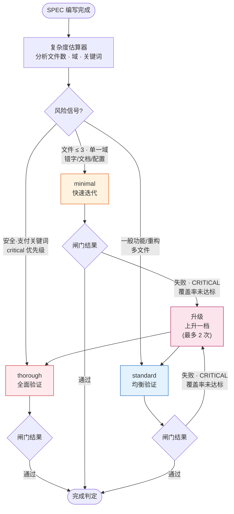
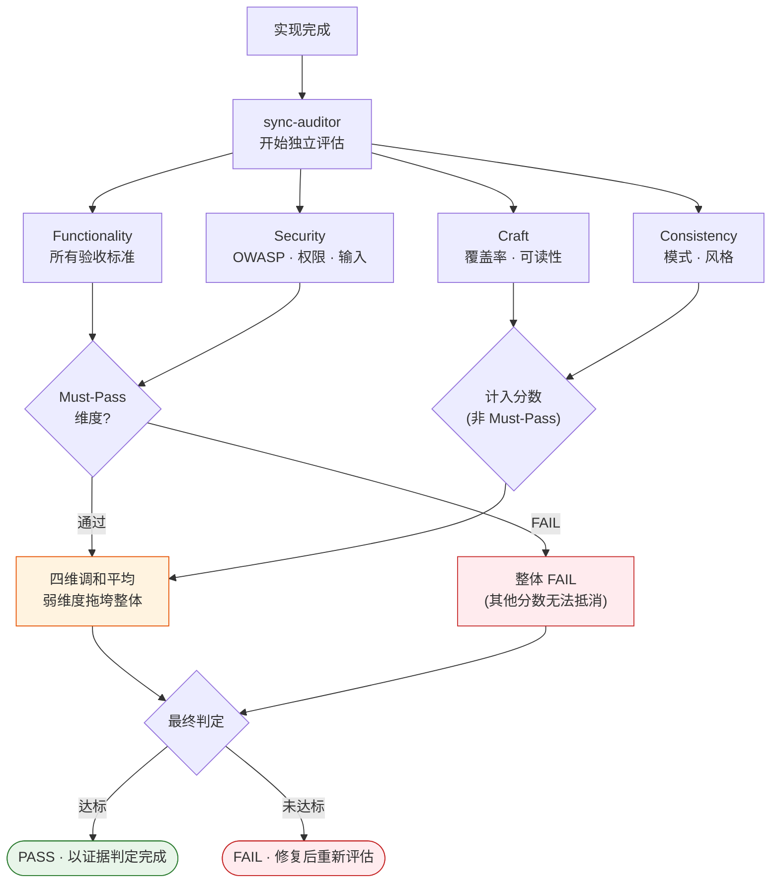

为修一行错字跑一遍全面安全审计，代币在漏；反过来，动支付系统只过一遍轻量确认，事故在等。对所有变更浇上同样深度的验证，这两种失败必然撞上其中一种。MoAI-ADK 解决的就是这个问题 —— 按变更的分量自行调节验证深度，并把评估交给独立的评估智能体，而不是写代码的那一方。


**一句话概括**： 验证深度按 SPEC（需求规格书）的复杂度自动决定，完成判定不靠"差不多了"，而是靠独立评估者的分数与依据。


## 两种想法咬合成一个

线束（harness，自动执行质量验证的装置）系统由两种不同的想法咬合运转。一个是**深度的自适应**，另一个是**评估的独立**。

**深度的自适应** —— 看 SPEC 的规模与风险度，把验证深度定为三档之一。修错字不跑全面审计，动支付域也不轻描淡写地放行。系统替人抓住与任务刚好匹配的验证强度，省去了每次手动选档的麻烦，验证成本与结果的风险度成正比。

**评估的独立** —— 让编写代码的智能体（自主工作的 AI 助手）给自己的成果打分，分数永远偏松。所以评估交给另一个独立的智能体 sync-auditor，从结构上把编写方与评估方分开。制定计划的智能体、实现代码的智能体，都碰不到评估。

## 三档线束级别

验证深度分三档。各档在跳过的步骤、评估者参与、闸门严格度上都不同。

| 级别 | 何时使用 | 评估者 | 特点 |
|------|--------------|--------|------|
| **minimal** | 简单变更 —— 错字、文档、配置修改，3 个文件以下的单一域 | 省略 | 快速迭代。跳过大部分验证步骤 |
| **standard** | 一般开发 —— 新功能、重构、多文件 | 最终一遍 | 均衡的质量确认。大多数任务在这里 |
| **thorough** | 高风险变更 —— 安全 · 支付关键词、认证 · 迁移 · 公开 API、critical 优先级 | 按冲刺反复评估 | 全量验证 + TRUST 5 闸门 + 交叉验证 |

级别由读取 SPEC 范围的**复杂度估算器** (Complexity Estimator) 自动决定。它以文件数、域数、SPEC 类型，以及安全 · 支付关键词与 critical 优先级为条件，在 minimal · standard · thorough 中选一个。不给错字修复跑 thorough 验证，这本身就是让成本与结果风险成正比的设计。

级别也不是一旦定下就锁死到底。验证途中质量闸门失败、审查出现 CRITICAL 级、覆盖率跌破 70%，就升一档。这种**升级**最多发生两次，即使以既定深度开始，中途暴露风险也会转入更深的验证，让被归类为"简单变更"的工作不留缝隙。

有一点要注意。minimal 级别跳过大部分验证步骤，但**计划审计 (plan-auditor) 闸门无一例外始终开启**。过去 minimal 级别下计划审计是关着的，结果 30 个 SPEC 未过审计就被造了出来，386 个交叉缺陷一次性爆发。这次事件之后，计划审计闸门被全局固定为与级别无关、始终运行 —— 验证深度可以省，计划本身不受检查的事不再发生。

CG 模式（Claude 领队 + GLM 工作者的混合执行）下，级别与自动检测无关，始终设为 thorough。实现交给 GLM 工作者、评估交给 Claude 领队的结构，天然就是生成器-判别器 (Generator-Evaluator) 分离。

## 四维评分

独立评估者 sync-auditor 从四个维度检查成果。每个维度问的问题各不相同。

| 维度 | 问的问题 | 默认权重 | Must-Pass |
|------|----------|------------|-----------|
| **Functionality**（功能） | 是否达成预期目的 —— 所有验收标准是否通过 | 40% |  是 |
| **Security**（安全） | 是否安全 —— OWASP、认证、权限、输入验证有没有洞 | 25% |  是 |
| **Craft**（工艺） | 做得好不好 —— 可读性、结构、测试覆盖率 | 20% |  否 |
| **Consistency**（一致性） | 是否遵循项目规则 —— 代码风格、模式遵守 | 15% |  否 |

### 调和平均 —— 弱的维度拖垮整体

把四个维度的分数合起来时，MoAI-ADK 用的不是简单平均，而是**调和平均** (harmonic mean)。两者的差距在一个结果垫底时急剧拉开。

设想一个安全拿 0.25 分、功能拿 1.00 满分的结果。简单平均是 (1.00 + 0.25) / 2 = 0.625，"勉强"能过。但调和平均对弱的一侧极为敏感 —— 一个维度垫底，其他维度再高也拉不起整体。这意图很明确：安全上的洞不能用出色的功能性"抵消"。从结构上堵死拿强维度补弱维度的路。

### Must-Pass 防火墙

比调和平均更强的装置是 **Must-Pass 防火墙**。Functionality 与 Security 是 Must-Pass 维度 —— 这两个不能用其他维度的分数来补。Security 一旦发现 Critical 或 High 级漏洞，哪怕 Functionality 与 Craft 拿满分，整体判定立刻 FAIL。"安全有洞但功能出色所以通过"这种妥协在结构上不可能。

Craft 与 Consistency 不是 Must-Pass。两者贡献总分、留下质量信号，但不会单独拦下通过 —— 代码质量与一致性重要，但不像功能与安全那样构成即时拦截理由，这是一个判断。

## 让分数踩在评分锚点上

LLM 评估者放着不管，分数就会随评估者的"心情"摆动。为了杜绝今天宽松、明天严苛的判定，每个分数都挂着四档**评分锚点** (rubric anchor)。评估者在 0.25 / 0.50 / 0.75 / 1.00 中选一个，并必须附上为什么落在该锚点的依据。

| 分数 | 水平 | 含义 |
|------|------|------|
| 0.25 | 未达标 | 未满足基本要求 |
| 0.50 | 部分 | 满足一部分，但需要改进 |
| 0.75 | 达标 | 大部分满足，只剩小规模改进 |
| 1.00 | 优秀 | 完美满足所有标准 |

分数不是连续的数字，而是四块固定的踏脚石。评估者给不出"大概 0.6"这种含糊值，判定便只能靠依据而不是评估者的状态立足。

## 压住评估者偏差的五道装置

分数不随惯性漂移，靠五道装置一起工作。单靠任何一道都不够，叠起来评估才能一致。

| # | 装置 | 做的事 |
|---|------|--------|
| 1 | **锚点约束** | 强制每个分数附上对应的评分依据 |
| 2 | **回归基线监视** | 分数相对以往项目异常蹿升时，怀疑为偏差 |
| 3 | **Must-Pass 防火墙** | Functionality · Security 失败无法用其他维度分数遮盖 |
| 4 | **独立复评** | 反复评估之间偏差越过阈值时重新校准分数 |
| 5 | **反模式交叉检查** | 发现已知反模式时，压低该维度分数的上限 |

五道装置共同的方向只有一个 —— 把评估者凭"看着还不错"就下 PASS 的路，一层层收窄。

## 评估配置档案 —— 按任务性质换标准

`.moai/config/evaluator-profiles/` 里放着四份配置档案。同样是四个维度，依任务性质不同，重心放在哪里、通过门槛定多高都会变。

| 配置档案 | 性格 | Must-Pass 门槛 | 适合的工作 |
|--------|------|---------------|--------------|
| `default` | 均衡的默认 | Functionality 全部 PASS · Security 无 Critical/High | 大多数一般工作 |
| `strict` | 最严格 | 四个维度各自 0.80 以上 · Security 漏洞为零 | 安全 · 支付 · 迁移 · 公开 API |
| `lenient` | 宽松 | Security 只需无 Critical · 允许未验证 | 原型 · 实验 · 非运营代码 |
| `frontend` | UI/UX 特化 | 按前端质量标准 | 界面 · 交互工作 |

`strict` 与 thorough 级别成对 —— 在认证或支付这类高风险域，验证深度的同时拉高评估标准，两边一起堵缝隙。反过来 `lenient` 允许原型阶段"能跑就行"的判断，让快速实验不被过重的验证成本压垮。

## 每次迭代都重新开始的评估者

GAN Loop（生成器-判别器对抗循环，为质量改进反复验证的模式）每转一圈，sync-auditor 都以**全新上下文**重新开始。上一轮迭代的判断依据不进入新提示，迭代之间传递的只有 Sprint Contract（冲刺契约，记录每个迭代目标与状态的协议）的状态。

这个设计是有意的。为的是不让评估者攥着自己先前的判断、凭惯性打分。与其让一次"大致没问题"的判定靠惯性在下一轮继续 PASS，不如每次都用新的眼光重看。这个记忆范围被 **FROZEN**（冻结，系统强制的不变规则）处理，设置里改不了。

## 配置

所有值都集中在 `.moai/config/sections/harness.yaml`。核心条目如下。

- **默认评估配置档案** —— SPEC 未单独指定配置时用 `default`。
- **记忆范围** —— 固定为 `per_iteration`，不可变更。
- **自动检测规则** —— 写着 minimal · standard · thorough 各自的进入条件（文件数、域、关键词、优先级）。
- **升级** —— 质量闸门失败 · CRITICAL 审查 · 覆盖率未达标是升一档的触发器，最多两次。
- **effort 映射** —— 定义各档如何映射到模型的推理深度 (minimal→low, standard→medium, thorough→high)。
- **计划审计全局固定** —— 强制计划审计闸门与级别无关、始终开启。

直接编辑这个文件，可以按项目调整自动检测的灵敏度、升级次数、各档跳过的步骤。但记忆范围与计划审计全局固定出于设计不可更改。

## 为什么要做到这个地步

验证深度贴合任务、评估与编写方分开、分数踩着锚点、评估者的记忆每次清零 —— 所有这些装置都是为守住同一个结论：让"代码完成了"这个判定不站在谁的手感或惯性上，而站在证据与独立的判断上。验证应与结果的风险度成正比，完成判定应从怀疑出发。这两条原则由系统从外部强制，所以会话换了、任务换了，同一把尺子仍然落在代码上。

## 相关文档

- [线束工程](/zh/core-concepts/harness-engineering) —— 线束概念的全景
- [TRUST 5 质量](/zh/core-concepts/trust-5) —— Tested · Readable · Unified · Secured · Trackable 五项质量标准
- [Constitution 系统](/zh/core-concepts/constitution) —— FROZEN（冻结）规则与 Evolvable（进化）规则的区分
- [线束学习](/zh/advanced/harness-learning) —— 观察积累成规则的学习面
