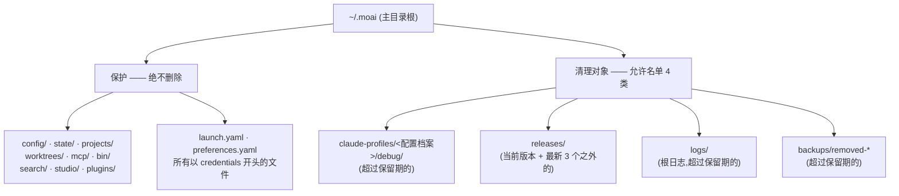
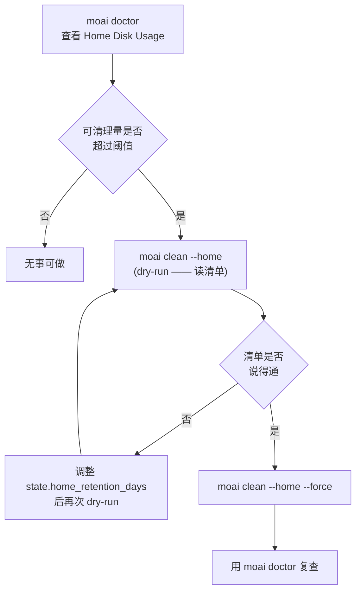



# 主目录卫生 (~/.moai)

MoAI 放在项目之外的状态,全部汇集在 `~/.moai` 这一个地方。按配置档案划分的调试日志、下载的发行版二进制、会话注册表、工作树台账、备份都堆在这里。在用了很久的机器上,这个目录会悄悄涨到好几 GB —— 没人会去看它,所以直到磁盘塞满才会被发现。


**一句话**: `MOAI_HOME` 决定主目录根的位置,`moai doctor` 告诉你塞了多满,`moai clean --home` 只清理允许名单以内的东西。三个表面讲的是同一件事。


## 什么堆在哪里



不在允许名单上的东西,扫描器根本看不见。而且保护在允许名单**内部**同样胜出 —— 老旧的 `backups/removed-*` 目录里只要有一个以 `credentials` 开头的文件,整个目录就被跳过。与其把备份删成半截,不如完全不碰。

`~/.claude` 在任何路径下都不会被删除。`moai doctor` 只**报告**它的大小,`moai clean --home` 连读都不读。

## `MOAI_HOME` —— 迁移主目录根

要把 `~/.moai` 挪到别处,把 `MOAI_HOME` 环境变量指向想要的根路径。

```bash
export MOAI_HOME=/Volumes/work/moai-home
```

规则有三条。

| 值 | 行为 |
|---|---|
| 非空的**绝对路径** | 该路径成为主目录根 |
| 空字符串 | 等同于未设置 —— 回退到 `~/.moai` |
| 相对路径 | 被忽略 —— 回退到 `~/.moai` |


 **Shell 钩子不遵循 `MOAI_HOME`。** 读取这个变量的只有 Go 二进制(`moai` CLI 及其子命令)。`.claude/hooks/` 下的 shell 脚本包装器,以及把 `~/.moai` 路径当字符串直接写死的外部工具,都不会查阅这个变量,因此仍然看默认位置。也就是说,迁移 `MOAI_HOME` 只会带走 **Go 一侧的状态**,和 shell 钩子使用的路径会分叉。只有在能接受这个限制时才使用它。


用户主目录本身按 HOME 优先解析:`HOME` 非空就用它的值,只有这时才回退到操作系统的主目录查询。因此在测试或容器里替换 `HOME`,在每个平台上的效果都一致。

## `moai doctor` —— 先看塞了多满

`moai doctor` 的诊断清单里带有 **Home Disk Usage** 项。它是建议 (advisory) 性质的,超标也不会拦住其他命令。

```bash
$ moai doctor
```

该项报告的内容:

| 项目 | 内容 |
|---|---|
| 总体大小 | `~/.moai` 的总容量与最大的 3 个条目 |
| 按配置档案分解 | 每个 `claude-profiles/<配置档案>` 的大小与分类拆分 |
| 发行版数量 | `releases/` 中剩余的二进制数量与当前版本 |
| 可清理量 | 下面的 `moai clean --home` 实际能删除的估算字节数 |
| `~/.claude` | 只报告大小 —— 绝不是清理对象 |

当可清理量超过阈值(编译默认值 500 MB)时,状态转为 WARN,消息会推荐 `moai clean --home`。低于阈值则保持 OK。可清理量的估算调用的是与 `moai clean --home` **同一个扫描器**,所以 doctor 报出的数字和 clean 删除的清单不会脱节。

## `moai clean --home` —— 只清理允许名单以内

```bash
# 默认是 dry-run —— 只报告会删什么,不删
$ moai clean --home

# 实际删除
$ moai clean --home --force
```

- **dry-run 是默认值**。不显式给出 `--force` 就什么都不删。
- 删除范围正是上图中允许名单的 4 类。
- 在 `releases/` 里,**当前正在运行的版本**和**其余中最新的 3 个**受保护,其他二进制及其配对的 `.sha256` 文件成为候选。`version.json` 与 `LATEST` 永远不是候选。
- 其余三类(`debug/`、根 `logs/`、`backups/removed-*`)只有超过**保留期**的才成为候选。

### `state.home_retention_days`

保留期从 **HOME 层级**的配置文件 `~/.moai/config/sections/state.yaml` 读取。

```yaml
state:
  home_retention_days: 30
```

| 值 | 行为 |
|---|---|
| 无该键 / 无该文件 | 编译默认值 **30 天** |
| 正整数 | 只有比该天数更旧的条目才成为候选 |
| `0` | 清理**停用** —— 一个候选都不会产生 |


这个键与项目 `.moai/config/sections/state.yaml` 中的 `state.retention_days`(项目运行产物保留)是**不同的键、不同的层级**。主目录只有一个而项目有多个,所以把读取位置分开,免得多个项目用不同的保留期去清理同一个主目录。


## 动手的顺序



## 相关文档

- [/moai clean](/zh/utility-commands/moai-clean) —— 项目死代码清理与 `--home` 表面的区别
- [moai doctor 诊断](/zh/cli-reference/doctor) —— 完整的诊断项与子命令
- [config 章节参考](/zh/advanced/config-sections) —— 配置层级与章节文件的结构
- [moai update](/zh/cli-reference/update) —— 创建 `backups/removed-*` 的那一侧
