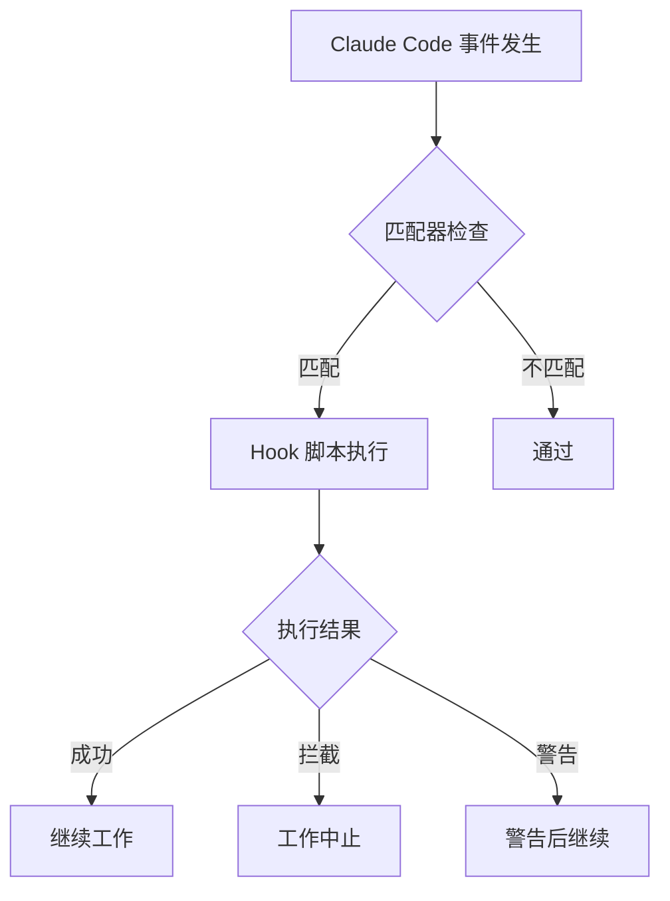
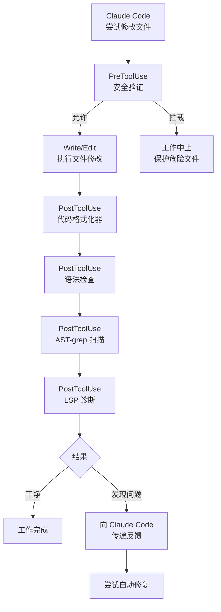

Claude Code 的 Hooks 系统和 MoAI-ADK 的默认 Hook 脚本详细介绍。


**一句话总结**: Hooks 是 Claude Code 的 **自动反射神经**。文件保存后自动格式化,危险命令自动拦截。


## Hooks 是什么?

Hooks 是响应 Claude Code 特定事件 **自动执行的脚本**。

用医生的反射神经检查来比喻:敲击膝盖时(事件发生)腿部会自动抬起(脚本执行),同样,Claude Code 修改文件时(PostToolUse 事件)会自动执行格式化器(代码整理)。



## Hook 事件类型

Claude Code 支持 **10 种事件类型**。

### 完整事件列表

| 事件 | 执行时机 | 主要用途 |
|--------|-----------|----------|
| `Setup` | 使用 `--init`,`--init-only`,`--maintenance` 标志启动时 | 初始设置、环境检查 |
| `SessionStart` | 会话开始时 | 显示项目信息、环境初始化 |
| `SessionEnd` | 会话结束时 | 清理工作、上下文保存 |
| `PreCompact` | 上下文压缩前 (`/clear` 等) | 备份重要上下文 |
| `PreToolUse` | 工具使用前 | 安全验证、拦截危险命令 |
| **`PermissionRequest`** | 显示权限对话框时 | 自动允许/拒绝决定 |
| `PostToolUse` | 工具使用后 | 代码格式化、语法检查、LSP 诊断 |
| **`UserPromptSubmit`** | 用户提交提示时 | 提示预处理、验证 |
| **`Notification`** | Claude Code 发送通知时 | 自定义桌面通知 |
| `Stop` | 响应完成后 | 循环控制、完成条件检查 |
| **`SubagentStop`** | 子代理任务完成后 | 处理子任务结果 |

### 事件详细说明

#### 1. Setup
当 Claude Code 使用 `--init`、`--init-only` 或 `--maintenance` 标志启动时执行。用于初始设置工作和环境检查。

#### 2. SessionStart
会话开始或恢复现有会话时执行。用于显示项目状态、环境初始化。

#### 3. SessionEnd
Claude Code 会话结束时执行。用于清理工作、上下文保存、指标收集。

#### 4. PreCompact
Claude Code 执行上下文压缩操作 (`/clear` 命令等) 之前执行。用于备份重要上下文。

#### 5. PreToolUse
工具调用 **之前** 执行。可以拦截或修改工具调用。用于安全验证、拦截危险命令。

#### 6. PermissionRequest
向用户显示权限对话框时执行。可以自动允许或拒绝。

#### 7. PostToolUse
工具调用 **完成后** 执行。用于代码格式化、语法检查、LSP 诊断收集。

#### 8. UserPromptSubmit
用户提交提示时执行,**在 Claude 处理之前**。用于提示预处理、验证。

#### 9. Notification
Claude Code 发送通知时执行。可以自定义桌面通知、声音通知等。

#### 10. Stop
Claude Code 完成响应时执行。用于循环控制、完成条件检查。

#### 11. SubagentStop
子代理任务完成时执行。用于处理子任务结果。

### MoAI-ADK 已实现的事件

MoAI-ADK 实际实现了以下事件:

| 事件 | 状态 | Hook 文件 |
|--------|------|-----------|
| `SessionStart` | ✅ | `session_start__show_project_info.py` |
| `PreToolUse` | ✅ | `pre_tool__security_guard.py` |
| `PostToolUse` | ✅ | `post_tool__code_formatter.py`, `post_tool__linter.py`, `post_tool__ast_grep_scan.py`, `post_tool__lsp_diagnostic.py` |
| `PreCompact` | ✅ | `pre_compact__save_context.py` |
| `SessionEnd` | ✅ | `session_end__auto_cleanup.py` |
| `Stop` | ✅ | `stop__loop_controller.py` |
| `Setup` | ⚪ | 参考官方示例 |
| `PermissionRequest` | ⚪ | 参考官方示例 |
| `UserPromptSubmit` | ⚪ | 参考官方示例 |
| `Notification` | ⚪ | 参考官方示例 |
| `SubagentStop` | ⚪ | 参考官方示例 |

### 事件执行顺序

一般文件修改工作中 Hook 的执行顺序。



## Claude Code 官方示例

这些示例是 Claude Code 官方文档提供的标准模式。

### Bash 命令日志 Hook

将所有 Bash 命令记录到日志文件。

```json
{
  "hooks": {
    "PreToolUse": [
      {
        "matcher": "Bash",
        "hooks": [
          {
            "type": "command",
            "command": "jq -r '\"\\(.tool_input.command) - \\(.tool_input.description // \"No description\")\"' >> ~/.claude/bash-command-log.txt"
          }
        ]
      }
    ]
  }
}
```

### TypeScript 格式化 Hook

编辑 TypeScript 文件后自动运行 Prettier。

```json
{
  "hooks": {
    "PostToolUse": [
      {
        "matcher": "Edit|Write",
        "hooks": [
          {
            "type": "command",
            "command": "jq -r '.tool_input.file_path' | { read file_path; if echo \"$file_path\" | grep -q '\\.ts$'; then npx prettier --write \"$file_path\"; fi; }"
          }
        ]
      }
    ]
  }
}
```

### Markdown 格式化器 Hook

自动检测并添加 Markdown 文件的语言标签。

```json
{
  "hooks": {
    "PostToolUse": [
      {
        "matcher": "Edit|Write",
        "hooks": [
          {
            "type": "command",
            "command": "\"$CLAUDE_PROJECT_DIR\"/.claude/hooks/markdown_formatter.py"
          }
        ]
      }
    ]
  }
}
```

`.claude/hooks/markdown_formatter.py` 文件:

```python
#!/usr/bin/env python3
"""
Markdown formatter for Claude Code output.
Fixes missing language tags and spacing issues while preserving code content.
"""
import json
import sys
import re
import os

def detect_language(code):
    """Best-effort language detection from code content."""
    s = code.strip()

    # JSON detection
    if re.search(r'^\\s*[{\\[]', s):
        try:
            json.loads(s)
            return 'json'
        except:
            pass

    # Python detection
    if re.search(r'^\\s*def\\s+\\w+\\s*\\(', s, re.M) or \
       re.search(r'^\\s*(import|from)\\s+\\w+', s, re.M):
        return 'python'

    # JavaScript detection
    if re.search(r'\\b(function\\s+\\w+\\s*\\(|const\\s+\\w+\\s*=)', s) or \
       re.search('=>|console\\.(log|error)', s):
        return 'javascript'

    # Bash detection
    if re.search(r'^#!.*\\b(bash|sh)\\b', s, re.M) or \
       re.search(r'\\b(if|then|fi|for|in|do|done)\\b', s):
        return 'bash'

    return 'text'

def format_markdown(content):
    """Format markdown content with language detection."""
    # Fix unlabeled code fences
    def add_lang_to_fence(match):
        indent, info, body, closing = match.groups()
        if not info.strip():
            lang = detect_language(body)
            return f"{indent}```{lang}\\n{body}{closing}\\n"
        return match.group(0)

    fence_pattern = r'(?ms)^([ \\t]{0,3})```([^\\n]*)\\n(.*?)(\\n\\1```)\\s*$'
    content = re.sub(fence_pattern, add_lang_to_fence, content)

    # Fix excessive blank lines
    content = re.sub(r'\\n{3,}', '\\n\\n', content)

    return content.rstrip() + '\\n'

# Main execution
try:
    input_data = json.load(sys.stdin)
    file_path = input_data.get('tool_input', {}).get('file_path', '')

    if not file_path.endswith(('.md', '.mdx')):
        sys.exit(0)  # Not a markdown file

    if os.path.exists(file_path):
        with open(file_path, 'r', encoding='utf-8') as f:
            content = f.read()

        formatted = format_markdown(content)

        if formatted != content:
            with open(file_path, 'w', encoding='utf-8') as f:
                f.write(formatted)
            print(f"✓ Fixed markdown formatting in {file_path}")

except Exception as e:
    print(f"Error formatting markdown: {e}", file=sys.stderr)
    sys.exit(1)
```

### 桌面通知 Hook

当 Claude 等待输入时显示桌面通知。

```json
{
  "hooks": {
    "Notification": [
      {
        "matcher": "",
        "hooks": [
          {
            "type": "command",
            "command": "notify-send 'Claude Code' 'Awaiting your input'"
          }
        ]
      }
    ]
  }
}
```

### 文件保护 Hook

拦截敏感文件的修改。

```json
{
  "hooks": {
    "PreToolUse": [
      {
        "matcher": "Edit|Write",
        "hooks": [
          {
            "type": "command",
            "command": "python3 -c \"import json, sys; data=json.load(sys.stdin); path=data.get('tool_input',{}).get('file_path',''); sys.exit(2 if any(p in path for p in ['.env', 'package-lock.json', '.git/']) else 0)\""
          }
        ]
      }
    ]
  }
}
```

## MoAI 默认 Hooks

MoAI-ADK 提供 **11 个默认 Hook 脚本**。

### Hook 列表

| Hook 文件 | 事件 | 匹配器 | 角色 | 超时 |
|-----------|--------|------|------|----------|
| `session_start__show_project_info.py` | SessionStart | 全部 | 显示项目状态、更新检查 | 5 秒 |
| `pre_tool__security_guard.py` | PreToolUse | `Write\|Edit\|Bash` | 拦截危险文件修改/命令 | 5 秒 |
| `post_tool__code_formatter.py` | PostToolUse | `Write\|Edit` | 自动代码格式化 | 30 秒 |
| `post_tool__linter.py` | PostToolUse | `Write\|Edit` | 自动语法检查 | 60 秒 |
| `post_tool__ast_grep_scan.py` | PostToolUse | `Write\|Edit` | AST 基础安全扫描 | 30 秒 |
| `post_tool__lsp_diagnostic.py` | PostToolUse | `Write\|Edit` | LSP 诊断结果收集 | 默认值 |
| `pre_compact__save_context.py` | PreCompact | 全部 | `/clear` 前保存上下文 | 3 秒 |
| `session_end__auto_cleanup.py` | SessionEnd | 全部 | 会话结束时清理工作 | 5 秒 |

| `stop__loop_controller.py` | Stop | 全部 | Ralph 循环控制及完成检查 | 默认值 |
| `quality_gate_with_lsp.py` | 手动 | 全部 | LSP 基础质量门控验证 | 默认值 |

### SessionStart: 显示项目信息

会话开始时显示项目的当前状态。

**显示信息:**
- MoAI-ADK 版本及更新状态
- 当前项目名称和技术栈
- Git 分支、变更、最后提交
- Git 策略 (Github-Flow 模式、Auto Branch 设置)
- 语言设置(对话语言)
- 上一次会话上下文 (SPEC 状态、任务列表)
- 个性化欢迎消息或设置指南

### PreToolUse: Security Guard (安全守卫)

文件修改/命令执行前 **保护危险操作**。

**保护文件类别:**

| 类别 | 保护文件 | 原因 |
|----------|-----------|------|
| 密钥存储 | `secrets/`, `*.secrets.*`, `*.credentials.*` | 保护敏感信息 |
| SSH 密钥 | `~/.ssh/*`, `id_rsa*`, `id_ed25519*` | 保护服务器访问密钥 |
| 证书 | `*.pem`, `*.key`, `*.crt` | 保护证书文件 |
| 云凭证 | `~/.aws/*`, `~/.gcloud/*`, `~/.azure/*`, `~/.kube/*` | 保护云账户 |
| Git 内部 | `.git/*` | 保护 Git 仓库完整性 |
| 令牌文件 | `*.token`, `.tokens/*`, `auth.json` | 保护认证令牌 |

**注意:** `.env` 文件不受保护。允许开发者编辑环境变量。

**拦截行为:**
- 检测对保护文件的 Write/Edit 尝试
- 返回 JSON 格式 `"permissionDecision": "deny"` 响应
- Claude Code 停止修改该文件

**拦截危险 Bash 命令:**
- 数据库删除: `supabase db reset`, `neon database delete`
- 危险文件删除: `rm -rf /`, `rm -rf .git`
- Docker 全部删除: `docker system prune -a`
- 强制推送: `git push --force origin main`
- Terraform 销毁: `terraform destroy`

### PostToolUse: Code Formatter (代码格式化器)

文件修改后 **自动整理代码**。

**支持语言及格式化器:**

| 语言 | 格式化器 (优先级) | 配置文件 |
|------|------------------|----------|
| Python | `ruff format`, `black` | `pyproject.toml` |
| TypeScript/JavaScript | `biome`, `prettier`, `eslint_d` | `.prettierrc`, `biome.json` |
| Go | `gofmt`, `goimports` | 默认值 |
| Rust | `rustfmt` | `rustfmt.toml` |
| Ruby | `prettier` | `.prettierrc` |
| PHP | `prettier` | `.prettierrc` |
| Java | `prettier` | `.prettierrc` |
| Kotlin | `prettier` | `.prettierrc` |
| Swift | `swiftformat` | `.swiftformat` |
| C# | `prettier` | `.prettierrc` |

**排除对象:**
- `.json`, `.lock`, `.min.js`, `.svg` 等
- `node_modules`, `.git`, `dist`, `build` 目录

### PostToolUse: Linter (语法检查器)

文件修改后 **自动检查代码质量**。

**支持语言及检查器:**

| 语言 | 检查器 (优先级) | 检查项目 |
|------|----------------|----------|
| Python | `ruff check`, `flake8` | PEP 8、类型提示、复杂度 |
| TypeScript/JavaScript | `eslint`, `biome lint`, `eslint_d` | 编码标准、潜在错误 |
| Go | `golangci-lint` | 代码质量、性能 |
| Rust | `clippy` | Rust 惯用法、性能 |

### PostToolUse: AST-grep 扫描

文件修改后 **扫描结构安全漏洞**。

**支持语言:**
Python, JavaScript/TypeScript, Go, Rust, Java, Kotlin, C/C++, Ruby, PHP

**扫描模式示例:**
- SQL 注入漏洞 (字符串连接查询)
- 硬编码密钥 (API 密钥、令牌)
- 不安全的函数调用
- 未使用的导入

**配置:** `.claude/skills/moai-tool-ast-grep/rules/sgconfig.yml` 或项目根目录的 `sgconfig.yml`

### PostToolUse: LSP 诊断

文件修改后 **收集 LSP(Language Server Protocol) 诊断信息**。

**支持语言:**
Python, TypeScript/JavaScript, Go, Rust, Java, Kotlin, Ruby, PHP, C/C++

**Fallback 诊断:**
无法使用 LSP 时使用命令行工具:
- Python: `ruff check --output-format=json`
- TypeScript: `tsc --noEmit`

**配置:** `.moai/config/sections/ralph.yaml`

```yaml
ralph:
  enabled: true
  hooks:
    post_tool_lsp:
      enabled: true
      severity_threshold: error  # error | warning | info
```

### PreCompact: 上下文保存

`/clear` 执行前 **将当前上下文保存到文件**。

**保存位置:** `.moai/memory/context-snapshot.json`

**保存内容:**
- 当前活动 SPEC 状态 (ID、阶段、进度)
- 进行中任务列表 (TodoWrite)
- 已完成任务列表
- 修改文件列表
- Git 状态信息 (分支、未提交的变更)
- 核心决策事项

**归档:** 之前的快照自动归档到 `.moai/memory/context-archive/`

### SessionEnd: 自动清理

会话结束时执行以下工作:

**P0 任务 (必需):**
- 保存会话指标 (修改文件数、提交数、工作的 SPEC)
- 保存任务状态快照 (`.moai/memory/last-session-state.json`)
- 未提交变更警告

**P1 任务 (可选):**
- 清理临时文件 (7 天以上的文件)
- 清理缓存文件
- 扫描根目录文档管理违规
- 生成会话摘要

### Stop: 循环控制器

控制 Ralph Engine 反馈循环。

**完成条件检查:**
- LSP 错误数 (目标 0 错误)
- LSP 警告数
- 测试通过情况
- 覆盖率目标 (默认 85%)
- 完成标记 (`<moai>DONE</moai>`, `<moai>COMPLETE</moai>`) 检测

**状态文件:** `.moai/cache/.moai_loop_state.json`

**配置:** `.moai/config/sections/ralph.yaml`

```yaml
ralph:
  enabled: true
  loop:
    max_iterations: 10
    auto_fix: false
    completion:
      zero_errors: true
      zero_warnings: false
      tests_pass: true
      coverage_threshold: 85
```

### Quality Gate with LSP

使用 LSP 诊断验证质量门控。

**质量标准:**
- 最大错误数: 0 (默认值)
- 最大警告数: 10 (默认值)
- 类型错误: 0 允许
- 语法错误: 0 允许

**配置:** `.moai/config/sections/quality.yaml`

```yaml
constitution:
  quality_gate:
    max_errors: 0
    max_warnings: 10
    enabled: true
```

**结果示例:**
```json
{
  "lsp_errors": 0,
  "lsp_warnings": 2,
  "type_errors": 0,
  "lint_errors": 0,
  "passed": true,
  "reason": "Quality gate passed: LSP diagnostics clean"
}
```

## lib/ 共享库

MoAI Hooks 在 `lib/` 目录中提供共享功能模块。

```
.claude/hooks/moai/lib/
├── __init__.py
├── atomic_write.py           # 原子写入操作
├── checkpoint.py             # 检查点管理
├── common.py                 # 通用工具
├── config.py                 # 配置管理
├── config_manager.py         # 配置管理器 (高级)
├── config_validator.py       # 配置验证
├── context_manager.py        # 上下文管理 (快照、归档)
├── enhanced_output_style_detector.py  # 输出样式检测
├── file_utils.py             # 文件工具
├── git_collector.py          # Git 数据收集
├── git_operations_manager.py # Git 运算管理器 (优化)
├── language_detector.py      # 语言检测
├── language_validator.py     # 语言验证
├── main.py                   # 主入口点
├── memory_collector.py       # 内存收集
├── metrics_tracker.py        # 指标追踪
├── models.py                 # 数据模型
├── path_utils.py             # 路径工具
├── project.py                # 项目相关
├── renderer.py               # 渲染器
├── timeout.py                # 超时处理
├── tool_registry.py          # 工具注册表 (格式化器、语法检查器)
├── unified_timeout_manager.py # 统一超时管理器
├── update_checker.py         # 更新检查
├── version_reader.py         # 版本读取
├── alfred_detector.py        # Alfred 检测
└── shared/utils/
    └── announcement_translator.py  # 公告翻译
```

**主要模块:**

- **tool_registry.py**: 16 种编程语言的格式化器/语法检查器自动检测
- **git_operations_manager.py**: 连接池、缓存优化的 Git 运算
- **unified_timeout_manager.py**: 统一超时管理和优雅降级
- **context_manager.py**: 上下文快照、归档、Memory MCP 载荷生成

## settings.json 中配置 Hook

Hooks 在 `.claude/settings.json` 文件的 `hooks` 部分配置。

```json
{
  "hooks": {
    "SessionStart": [
      {
        "matcher": "",
        "hooks": [
          {
            "type": "command",
            "command": "${SHELL:-/bin/bash} -l -c 'uv run \"$CLAUDE_PROJECT_DIR/.claude/hooks/moai/session_start__show_project_info.py\"'"
          }
        ]
      }
    ],
    "PreToolUse": [
      {
        "matcher": "Write|Edit",
        "hooks": [
          {
            "type": "command",
            "command": "${SHELL:-/bin/bash} -l -c 'uv run \"$CLAUDE_PROJECT_DIR/.claude/hooks/moai/pre_tool__security_guard.py\"'",
            "timeout": 5000
          }
        ]
      }
    ],
    "PostToolUse": [
      {
        "matcher": "Write|Edit",
        "hooks": [
          {
            "type": "command",
            "command": "${SHELL:-/bin/bash} -l -c 'uv run \"$CLAUDE_PROJECT_DIR/.claude/hooks/moai/post_tool__code_formatter.py\"'",
            "timeout": 30000
          },
          {
            "type": "command",
            "command": "${SHELL:-/bin/bash} -l -c 'uv run \"$CLAUDE_PROJECT_DIR/.claude/hooks/moai/post_tool__linter.py\"'",
            "timeout": 60000
          },
          {
            "type": "command",
            "command": "${SHELL:-/bin/bash} -l -c 'uv run \"$CLAUDE_PROJECT_DIR/.claude/hooks/moai/post_tool__ast_grep_scan.py\"'",
            "timeout": 30000
          },
          {
            "type": "command",
            "command": "${SHELL:-/bin/bash} -l -c 'uv run \"$CLAUDE_PROJECT_DIR/.claude/hooks/moai/post_tool__lsp_diagnostic.py\"'"
          }
        ]
      }
    ],
    "PreCompact": [
      {
        "matcher": "",
        "hooks": [
          {
            "type": "command",
            "command": "${SHELL:-/bin/bash} -l -c 'uv run \"$CLAUDE_PROJECT_DIR/.claude/hooks/moai/pre_compact__save_context.py\"'",
            "timeout": 5000
          }
        ]
      }
    ],
    "SessionEnd": [
      {
        "matcher": "",
        "hooks": [
          {
            "type": "command",
            "command": "${SHELL:-/bin/bash} -l -c 'uv run \"$CLAUDE_PROJECT_DIR/.claude/hooks/moai/session_end__auto_cleanup.py\"'",
            "timeout": 5000
          }
        ]
      }
    ],
    "Stop": [
      {
        "matcher": "",
        "hooks": [
          {
            "type": "command",
            "command": "${SHELL:-/bin/bash} -l -c 'uv run \"$CLAUDE_PROJECT_DIR/.claude/hooks/moai/stop__loop_controller.py\"'"
          }
        ]
      }
    ]
  }
}
```

### 配置结构

| 字段 | 说明 | 示例 |
|------|------|------|
| `matcher` | 工具名称匹配模式 (正则) | `"Write\|Edit"` |
| `type` | Hook 类型 | `"command"` |
| `command` | 执行命令 | Shell 脚本路径 |
| `timeout` | 执行时间限制 (毫秒) | `5000` (5 秒) |

### 匹配器模式

| 模式 | 说明 |
|------|------|
| `""` (空字符串) | 匹配所有工具 |
| `"Write"` | 仅匹配 Write 工具 |
| `"Write\|Edit"` | 匹配 Write 或 Edit 工具 |
| `"Bash"` | 仅匹配 Bash 工具 |

## 自定义 Hook 编写方法

### 基本模板

自定义 Hook 脚本可以用 Python 编写。

```python
#!/usr/bin/env python3
"""自定义 PostToolUse Hook: 文件修改后执行特定检查"""

import json
import sys

def main():
    # 从 stdin 读取 Hook 输入数据
    input_data = json.loads(sys.stdin.read())

    tool_name = input_data.get("tool_name", "")
    tool_input = input_data.get("tool_input", {})
    file_path = tool_input.get("file_path", "")

    # 检查逻辑
    if file_path.endswith(".py"):
        # Python 文件自定义检查
        result = check_python_file(file_path)

        if result["has_issues"]:
            # 向 Claude Code 传递反馈
            output = {
                "hookSpecificOutput": {
                    "hookEventName": "PostToolUse",
                    "additionalContext": result["message"]
                }
            }
            print(json.dumps(output))
            return

    # 没有问题则抑制输出
    output = {"suppressOutput": True}
    print(json.dumps(output))

def check_python_file(file_path: str) -> dict:
    """Python 文件自定义检查"""
    # 实现检查逻辑
    return {"has_issues": False, "message": ""}

if __name__ == "__main__":
    main()
```

### Hook 响应格式

| 字段 | 值 | 行为 |
|------|-----|------|
| `suppressOutput` | `true` | 不显示任何内容 |
| `hookSpecificOutput` | 对象 | 提供额外上下文 |
| `permissionDecision` | `"allow"` | 允许操作 (PreToolUse) |
| `permissionDecision` | `"deny"` | 拦截操作 (PreToolUse) |
| `permissionDecision` | `"ask"` | 请求用户确认 (PreToolUse) |

### Hook 输入数据

Hook 脚本通过标准输入 (stdin) 接收 JSON 数据。

```json
{
  "tool_name": "Write",
  "tool_input": {
    "file_path": "/path/to/file.py",
    "content": "文件内容..."
  },
  "tool_output": "文件输出结果 (仅 PostToolUse)"
}
```

## Hook 目录结构

```
.claude/hooks/moai/
├── __init__.py                        # 包初始化
├── session_start__show_project_info.py # 会话开始
├── pre_tool__security_guard.py         # 安全守卫
├── post_tool__code_formatter.py        # 代码格式化器
├── post_tool__linter.py                # 语法检查器
├── post_tool__ast_grep_scan.py         # AST-grep 扫描
├── post_tool__lsp_diagnostic.py        # LSP 诊断
├── pre_compact__save_context.py        # 上下文保存
├── session_end__auto_cleanup.py        # 自动清理

├── stop__loop_controller.py            # 循环控制器
├── quality_gate_with_lsp.py            # 质量门控
└── lib/                                # 共享库
    ├── atomic_write.py                 # 原子写入
    ├── checkpoint.py                   # 检查点
    ├── common.py                       # 通用工具
    ├── config.py                       # 配置
    ├── config_manager.py               # 配置管理器
    ├── config_validator.py             # 配置验证
    ├── context_manager.py              # 上下文管理
    ├── git_operations_manager.py       # Git 运算管理
    ├── tool_registry.py                # 工具注册表
    ├── unified_timeout_manager.py      # 超时管理
    └── ...                             # 其他模块
```


**注意**: Hook 脚本超时设置过长会导致 Claude Code 响应变慢。建议格式化器 30 秒、语法检查器 60 秒、安全守卫 5 秒以内。


## 环境变量禁用 Hook

可以用环境变量禁用特定 Hook:

| Hook | 环境变量 |
|------|-----------|
| AST-grep 扫描 | `MOAI_DISABLE_AST_GREP_SCAN=1` |
| LSP 诊断 | `MOAI_DISABLE_LSP_DIAGNOSTIC=1` |
| 循环控制器 | `MOAI_DISABLE_LOOP_CONTROLLER=1` |

```bash
export MOAI_DISABLE_AST_GREP_SCAN=1
```

## 相关文档

- [settings.json 指南](/advanced/settings-json) - Hook 配置方法
- [CLAUDE.md 指南](/advanced/claude-md-guide) - 项目指令管理
- [代理指南](/advanced/agent-guide) - 代理与 Hook 联动


**提示**: Hook 是 MoAI-ADK 质量保证的核心。自动代码格式化和语法检查使开发者能专注于逻辑。添加自定义 Hook 构建适合项目的自动化。

