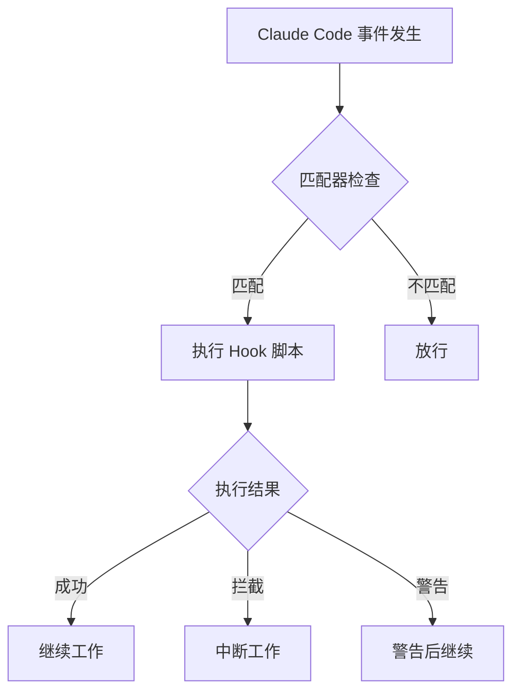
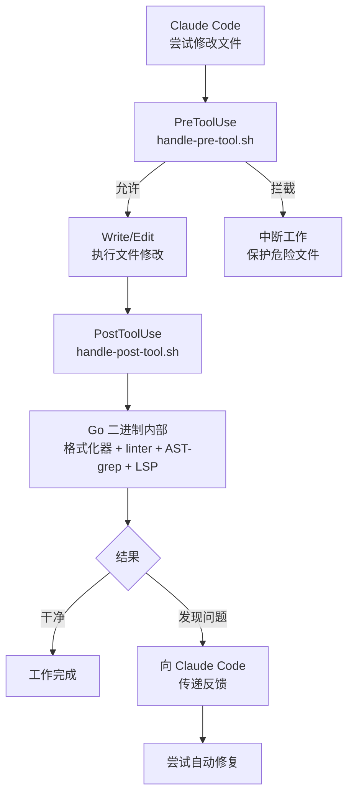

详细介绍 Claude Code 的 Hooks 系统与 MoAI-ADK 的默认 Hook 脚本。在智能体式框架中，提示词是"应当遵循的指引"，而钩子是"必定执行的代码"——钩子正是把质量门禁与安全防线建立在确定性而非概率之上的那一层。


**一句话总结**：Hooks 是 Claude Code 的 **自动反射神经**。保存文件时自动格式化，危险命令自动拦截。


## 什么是 Hooks？

Hooks 是响应 Claude Code 特定事件而 **自动执行的脚本**。

用医生的反射检查来比喻，敲击膝盖（事件发生）时腿会自动抬起（脚本执行），同理，Claude Code 修改文件时（PostToolUse 事件）格式化器会自动运行（整理代码）。


```mermaid
flowchart TD
    EVENT["Claude Code 事件发生"] --> MATCH{匹配器检查}

    MATCH -->|匹配| HOOK["执行 Hook 脚本"]
    MATCH -->|不匹配| SKIP["放行"]

    HOOK --> RESULT{执行结果}
    RESULT -->|成功| CONTINUE["继续工作"]
    RESULT -->|拦截| BLOCK["中断工作"]
    RESULT -->|警告| WARN["警告后继续"]
```

## Hook 事件类型

本指南涵盖常用的核心事件。（全部 29 个事件请参阅 [Hooks 事件参考](/zh/advanced/hooks-reference)。）

### 主要事件列表

| 事件 | 执行时机 | 主要用途 |
|--------|-----------|----------|
| `Setup` | 以 `--init`、`--init-only`、`--maintenance` 标志启动时 | 初始设置、环境检查 |
| `SessionStart` | 会话开始时 | 显示项目信息、初始化环境 |
| `SessionEnd` | 会话结束时 | 清理工作、保存上下文 |
| `PostSession` | 会话结束后（self-hosted runner，CC 2.1.169+） | 会话后清理/遥测；在会话完全释放之后触发，比 `SessionEnd` 更晚。MoAI-ADK 目前未接入此钩子——它作为面向 self-hosted 部署的可用选项被记录在案。 |
| `PreCompact` | 上下文压缩前（`/clear` 等） | 备份重要上下文 |
| `PreToolUse` | 工具使用前 | 安全校验、拦截危险命令 |
| **`PermissionRequest`** | 显示权限对话框时 | 自动允许/拒绝决策 |
| `PostToolUse` | 工具使用后 | 代码格式化、lint 检查、LSP 诊断 |
| **`UserPromptSubmit`** | 用户提交提示词时 | 提示词预处理、校验 |
| **`Notification`** | Claude Code 发送通知时 | 自定义桌面通知 |
| `Stop` | 响应完成后 | 循环控制、完成条件确认 |
| **`SubagentStop`** | 子智能体工作完成后 | 处理子任务结果 |

### 事件详细说明

#### 1. Setup
在 Claude Code 以 `--init`、`--init-only` 或 `--maintenance` 标志启动时执行。用于初始设置工作与环境检查。

#### 2. SessionStart
在会话开始或恢复已有会话时执行。用于显示项目状态、初始化环境。

#### 3. SessionEnd
在 Claude Code 会话结束时执行。用于清理工作、保存上下文、收集指标。

#### 4. PreCompact
在 Claude Code 执行上下文压缩工作（如 `/clear` 命令）之前执行。用于备份重要的上下文。

#### 5. PreToolUse
在工具被调用 **之前** 执行。可以拦截或修改工具调用。用于安全校验、拦截危险命令。

#### 6. PermissionRequest
在权限对话框显示给用户时执行。可以自动允许或拒绝。

#### 7. PostToolUse
在工具调用 **完成之后** 执行。用于代码格式化、lint 检查、LSP 诊断收集。

#### 8. UserPromptSubmit
在用户提交提示词时执行，在 Claude 处理 **之前**。用于提示词预处理、校验。

#### 9. Notification
在 Claude Code 发送通知时执行。可以自定义为桌面通知、声音提醒等。

#### 10. Stop
在 Claude Code 完成响应时执行。用于循环控制、完成条件确认——`/moai loop` 与 goal 引擎在此事件之上运作。

#### 11. SubagentStop
在子智能体工作完成时执行。用于处理子任务结果。

### MoAI-ADK 中实现的事件

MoAI-ADK 以 **shell 包装脚本 + Go 二进制** 架构实现钩子。settings.json 中的 `command` 指向 `.claude/hooks/moai/handle-<event>.sh` shell 包装器，该包装器将 stdin JSON 转发给 `moai hook <event>` Go 子命令来执行实际逻辑。没有 Python 或 `uv run` 依赖——仅凭 shell 脚本与单个 Go 二进制即可运行。

| 事件 | 状态 | shell 包装器 | Go 子命令 |
|--------|------|---------|---------------|
| `SessionStart` |  | `handle-session-start.sh` | `moai hook session-start` |
| `PreToolUse` |  | `handle-pre-tool.sh` | `moai hook pre-tool` |
| `PostToolUse` |  | `handle-post-tool.sh` | `moai hook post-tool` |
| `PreCompact` |  | `handle-compact.sh` | `moai hook compact` |
| `SessionEnd` |  | `handle-session-end.sh` | `moai hook session-end` |
| `Stop` |  | `handle-stop.sh` | `moai hook stop` |
| `SubagentStart` |  | `handle-subagent-start.sh` | `moai hook subagent-start` |
| `SubagentStop` |  | `handle-subagent-stop.sh` | `moai hook subagent-stop` |
| `PermissionRequest` |  | `handle-permission-request.sh` | `moai hook permission-request` |
| `UserPromptSubmit` |  | `handle-user-prompt-submit.sh` | `moai hook user-prompt-submit` |
| `Notification` |  | `handle-notification.sh` | `moai hook notification` |
| `TeammateIdle` |  | `handle-teammate-idle.sh` | `moai hook teammate-idle` |
| `TaskCompleted` |  | `handle-task-completed.sh` | `moai hook task-completed` |

除上述 13 种外，Go 二进制还实现了 `PostToolUseFailure`、`StopFailure`、`PostCompact`、`InstructionsLoaded`、`ConfigChange`、`TaskCreated`、`CwdChanged`、`FileChanged`、`PermissionDenied`、`WorktreeCreate`、`WorktreeRemove`、`Elicitation`、`ElicitationResult`，共计 26 个子命令。（完整列表可通过 `moai hook --help` 查看。）

### 团队协作事件

MoAI 的静态 Agent Teams 编排层已 RETIRED，但 Claude Code 的原生团队成员运行时（基于 tmux pane）仍受支持，`TeammateIdle`、`TaskCompleted` 钩子事件仍可运作。

#### TeammateIdle 事件
在团队成员完成工作并进入 idle 状态时执行。

- `continue: false`（exit code 2）→ 拒绝 idle，团队成员执行更多工作
- `continue: true`（默认值）→ 批准 idle

#### TaskCompleted 事件
在团队成员完成任务时执行。

- Exit code 2 → 拒绝完成（需要修改）
- Exit code 0（默认值）→ 批准完成

#### Team Shutdown Sequence [HARD]

关闭团队时 **必须** 遵循以下顺序。

1. **发送 shutdown_request**：向各团队成员发送 `SendMessage(shutdown_request)`
2. **等待响应**：从各团队成员接收 `shutdown_response approve:true`
3. **[HARD] tmux pane 清理**：显式终止 tmux pane
   - 读取 `~/.claude/teams/{team-name}/config.json`
   - 提取各成员的 `tmuxPaneId`（例如 "%184"）
   - 执行 `tmux kill-pane -t {paneId}`（从高索引开始）

团队目录清理会在会话结束时自动执行。无需显式的 teardown 调用（显式团队 teardown 工具已在 Claude Code v2.1.178 中移除——每个会话都拥有一个隐式团队，清理是自动的）。


**为什么 tmux pane 清理是必需的？** `shutdown_response` 会将团队成员在逻辑上标记为完成，但不会终止 tmux pane 进程。团队目录清理会在会话结束时自动进行，但这不会终止 tmux pane 进程。没有显式的 pane 终止，pane 会无限存活，Leader 会卡在 "Drain" 状态。


### 事件执行顺序

一般文件修改工作中 Hook 的执行顺序。


```mermaid
flowchart TD
    A["Claude Code<br>尝试修改文件"] --> B["PreToolUse<br>handle-pre-tool.sh"]

    B -->|允许| C["Write/Edit<br>执行文件修改"]
    B -->|拦截| BLOCK["中断工作<br>保护危险文件"]

    C --> D["PostToolUse<br>handle-post-tool.sh"]
    D --> D1["Go 二进制内部<br>格式化器 + linter + AST-grep + LSP"]

    D1 --> H{结果}
    H -->|干净| I["工作完成"]
    H -->|发现问题| J["向 Claude Code<br>传递反馈"]
    J --> K["尝试自动修复"]
```

这条流水线承担了智能体循环反馈的一半——智能体书写，钩子检查，若有问题便成为下一轮的修复输入。

## Claude Code 官方示例

这些示例是 Claude Code 官方文档提供的标准模式。

### Bash 命令日志 Hook

将所有 Bash 命令记录到日志文件。

```json
{
  "hooks": {
    "PreToolUse": [
      {
        "matcher": "Bash",
        "hooks": [
          {
            "type": "command",
            "command": "jq -r '\"\\(.tool_input.command) - \\(.tool_input.description // \"No description\")\"' >> ~/.claude/bash-command-log.txt"
          }
        ]
      }
    ]
  }
}
```

### TypeScript 格式化 Hook

编辑 TypeScript 文件后自动运行 Prettier。

```json
{
  "hooks": {
    "PostToolUse": [
      {
        "matcher": "Edit|Write",
        "hooks": [
          {
            "type": "command",
            "command": "jq -r '.tool_input.file_path' | { read file_path; if echo \"$file_path\" | grep -q '\\.ts$'; then npx prettier --write \"$file_path\"; fi; }"
          }
        ]
      }
    ]
  }
}
```

### Markdown 格式化器 Hook

自动检测并为 Markdown 文件添加语言标签。

```json
{
  "hooks": {
    "PostToolUse": [
      {
        "matcher": "Edit|Write",
        "hooks": [
          {
            "type": "command",
            "command": "\"$CLAUDE_PROJECT_DIR/.claude/hooks/markdown_formatter.sh\""
          }
        ]
      }
    ]
  }
}
```

`.claude/hooks/markdown_formatter.sh` 文件：

```bash
#!/bin/bash
# Markdown 格式化器：修复缺失的代码栅栏语言标签，整理过多的空行

input_data=$(cat)
file_path=$(echo "$input_data" | jq -r '.tool_input.file_path // ""')

# 不是 Markdown 文件则放行
case "$file_path" in
  *.md|*.mdx) ;;
  *) exit 0 ;;
esac

[ -f "$file_path" ] || exit 0

# 整理过多的空行（3 行以上 → 2 行）
content=$(cat "$file_path")
formatted=$(echo "$content" | awk 'BEGIN{blank=0} /^$/{blank++; if(blank<=2) print; next} {blank=0; print}')

if [ "$formatted" != "$content" ]; then
  echo "$formatted" > "$file_path"
  echo "Markdown 格式化修复: $file_path" >&2
fi
```

### 桌面通知 Hook

在 Claude 等待输入时显示桌面通知。

```json
{
  "hooks": {
    "Notification": [
      {
        "matcher": "",
        "hooks": [
          {
            "type": "command",
            "command": "notify-send 'Claude Code' 'Awaiting your input'"
          }
        ]
      }
    ]
  }
}
```

### 文件保护 Hook

拦截敏感文件的修改。

```json
{
  "hooks": {
    "PreToolUse": [
      {
        "matcher": "Edit|Write",
        "hooks": [
          {
            "type": "command",
            "command": "f=$(jq -r '.tool_input.file_path // \"\"'); case \"$f\" in *.env|*package-lock.json|*.git/*) exit 2;; esac"
          }
        ]
      }
    ]
  }
}
```

## MoAI 默认 Hooks

MoAI-ADK 以 **shell 包装器 + Go 二进制** 架构提供 Hook。每个 `handle-<event>.sh` 包装器将 stdin JSON 转发给 `moai hook <event>` 子命令，格式化、lint、安全扫描、LSP 诊断等实际逻辑全部在 Go 二进制内部执行。无需 Python 运行时或 `uv` 依赖。

### Hook 列表

| shell 包装器 | Go 子命令 | 事件 | 匹配器 | 作用 | 超时 |
|---------|---------------|--------|------|------|----------|
| `handle-session-start.sh` | `session-start` | SessionStart | 全部 | 显示项目状态、检查更新 | 30 秒 |
| `handle-pre-tool.sh` | `pre-tool` | PreToolUse | `Write\|Edit\|Bash` | 拦截危险文件修改/命令 | 5 秒 |
| `handle-post-tool.sh` | `post-tool` | PostToolUse | `Write\|Edit` | 代码格式化、lint、AST-grep 扫描、LSP 诊断 | 10 秒 |
| `handle-compact.sh` | `compact` | PreCompact | 全部 | `/clear` 前保存上下文 | 30 秒 |
| `handle-session-end.sh` | `session-end` | SessionEnd | 全部 | 会话结束时清理工作 | 10 秒 |
| `handle-stop.sh` | `stop` | Stop | 全部 | 循环控制与完成确认 | 默认值 |
| `handle-subagent-stop.sh` | `subagent-stop` | SubagentStop | 全部 | 处理子智能体工作结果 | 默认值 |
| `handle-permission-request.sh` | `permission-request` | PermissionRequest | 全部 | 权限自动允许/拒绝决策 | 5 秒 |

### SessionStart：显示项目信息

会话开始时显示项目的当前状态。

**显示信息：**
- MoAI-ADK 版本以及是否有更新
- 当前项目名称与技术栈
- Git 分支、变更事项、最近一次提交
- Git 策略（Github-Flow 模式、Auto Branch 设置）
- 语言设置（对话语言）
- 之前的会话上下文（SPEC 状态、任务列表）
- 个性化欢迎消息或设置指南

### PreToolUse：Security Guard（安全守卫）

在文件修改/命令执行前 **保护危险操作**。

**保护对象文件：**

| 类别 | 保护文件 | 原因 |
|----------|-----------|------|
| 秘密存储 | `secrets/`、`*.secrets.*`、`*.credentials.*` | 保护敏感信息 |
| SSH 密钥 | `~/.ssh/*`、`id_rsa*`、`id_ed25519*` | 保护服务器访问密钥 |
| 证书 | `*.pem`、`*.key`、`*.crt` | 保护证书文件 |
| 云凭证 | `~/.aws/*`、`~/.gcloud/*`、`~/.azure/*`、`~/.kube/*` | 保护云账户 |
| Git 内部 | `.git/*` | Git 仓库完整性 |
| 令牌文件 | `*.token`、`.tokens/*`、`auth.json` | 保护认证令牌 |

**注意：** `.env` 文件不受保护，以允许开发者编辑环境变量。

**拦截动作：**
- 检测对保护对象文件的 Write/Edit 尝试
- 以 JSON 形式返回 `"permissionDecision": "deny"` 响应
- Claude Code 中断对该文件的修改

**拦截危险的 Bash 命令：**
- 数据库删除：`supabase db reset`、`neon database delete`
- 危险文件删除：`rm -rf /`、`rm -rf .git`
- Docker 全量清理：`docker system prune -a`
- 强制推送：`git push --force origin main`
- Terraform 销毁：`terraform destroy`

### PostToolUse：Code Formatter（代码格式化器）

文件修改后 **自动整理代码**。

**支持的语言与格式化器：**

| 语言 | 格式化器（优先级） | 配置文件 |
|------|------------------|----------|
| Python | `ruff format`、`black` | `pyproject.toml` |
| TypeScript/JavaScript | `biome`、`prettier`、`eslint_d` | `.prettierrc`、`biome.json` |
| Go | `gofmt`、`goimports` | 默认值 |
| Rust | `rustfmt` | `rustfmt.toml` |
| Ruby | `prettier` | `.prettierrc` |
| PHP | `prettier` | `.prettierrc` |
| Java | `prettier` | `.prettierrc` |
| Kotlin | `prettier` | `.prettierrc` |
| Swift | `swiftformat` | `.swiftformat` |
| C# | `prettier` | `.prettierrc` |

**排除对象：**
- `.json`、`.lock`、`.min.js`、`.svg` 等
- `node_modules`、`.git`、`dist`、`build` 目录

### PostToolUse：Linter（linter）

文件修改后 **自动检查代码质量**。

**支持的语言与 linter：**

| 语言 | linter（优先级） | 检查项 |
|------|----------------|----------|
| Python | `ruff check`、`flake8` | PEP 8、类型提示、复杂度 |
| TypeScript/JavaScript | `eslint`、`biome lint`、`eslint_d` | 编码规范、潜在缺陷 |
| Go | `golangci-lint` | 代码质量、性能 |
| Rust | `clippy` | Rust 惯用法、性能 |

### PostToolUse：AST-grep 扫描

文件修改后 **扫描结构性安全漏洞**。

**支持的语言：**
Python、JavaScript/TypeScript、Go、Rust、Java、Kotlin、C/C++、Ruby、PHP

**扫描模式示例：**
- SQL Injection 漏洞（字符串拼接查询）
- 硬编码的秘钥（API 密钥、令牌）
- 不安全的函数调用
- 未使用的 import

**配置：** `.claude/skills/moai-tool-ast-grep/rules/sgconfig.yml` 或项目根目录的 `sgconfig.yml`

### PostToolUse：LSP 诊断

文件修改后 **收集 LSP（Language Server Protocol）诊断信息**。

**支持的语言：**
Python、TypeScript/JavaScript、Go、Rust、Java、Kotlin、Ruby、PHP、C/C++

**Fallback 诊断：**
在无法使用 LSP 时，使用命令行工具：
- Python：`ruff check --output-format=json`
- TypeScript：`tsc --noEmit`

**配置：** `.moai/config/sections/ralph.yaml`

```yaml
ralph:
  enabled: true
  hooks:
    post_tool_lsp:
      enabled: true
      severity_threshold: error  # error | warning | info
```

### PreCompact：保存上下文

在 `/clear` 执行前 **将当前上下文保存为文件**。它是在上下文阈值处切断并续接会话的 handoff 流程的安全网。

**保存位置：** `.moai/memory/context-snapshot.json`

**保存内容：**
- 当前活动 SPEC 状态（ID、阶段、进度）
- 进行中的任务列表（TodoWrite）
- 已完成的任务列表
- 已修改的文件列表
- Git 状态信息（分支、未提交的变更）
- 核心决策事项

**归档：** 之前的快照会自动保存到 `.moai/memory/context-archive/`。

### SessionEnd：自动清理

会话结束时执行以下工作。

**P0 工作（必需）：**
- 保存会话指标（修改的文件数、提交数、处理过的 SPEC）
- 保存工作状态快照（`.moai/memory/last-session-state.json`）
- 警告未提交的变更

**P1 工作（可选）：**
- 清理临时文件（超过 7 天的文件）
- 清理缓存文件
- 扫描根目录的文档管理违规
- 生成会话摘要

### Stop：循环控制器

控制 Ralph Engine 反馈循环。`/moai loop` 之所以能"反复直到全部修复"，是因为此钩子在每一轮结束时机械地判定完成条件。

**完成条件确认：**
- LSP 错误数（目标为 0 错误）
- LSP 警告数
- 测试是否通过
- 覆盖率目标（默认 85%）
- 完成语句检测（自然语言的循环终止信号）

**状态文件：** `.moai/cache/.moai_loop_state.json`

**配置：** `.moai/config/sections/ralph.yaml`

```yaml
ralph:
  enabled: true
  loop:
    max_iterations: 10
    auto_fix: false
    completion:
      zero_errors: true
      zero_warnings: false
      tests_pass: true
      coverage_threshold: 85
```

### Quality Gate with LSP

使用 LSP 诊断校验质量门禁。

**质量标准：**
- 最大错误数：0（默认值）
- 最大警告数：10（默认值）
- 类型错误：允许 0
- lint 错误：允许 0

**配置：** `.moai/config/sections/quality.yaml`

```yaml
constitution:
  quality_gate:
    max_errors: 0
    max_warnings: 10
    enabled: true
```

**结果示例：**
```json
{
  "lsp_errors": 0,
  "lsp_warnings": 2,
  "type_errors": 0,
  "lint_errors": 0,
  "passed": true,
  "reason": "Quality gate passed: LSP diagnostics clean"
}
```

## Go 二进制架构

MoAI Hooks 的共享逻辑被编译进 **`moai` Go 二进制内部**，而非 Python 的 `lib/` 目录。shell 包装器（`handle-<event>.sh`）只是一层薄薄的转发层，以下功能全部在 Go 二进制中实现：

- **16 种语言的格式化器/linter 注册表**：自动检测项目语言后运行相应工具链（Go：gofmt/golangci-lint，Python：ruff/black，Rust：cargo fmt/clippy 等）
- **Git 数据收集**：缓存分支、变更事项、提交信息以优化重复查询
- **统一超时管理**：各钩子事件各自的超时与优雅降级处理
- **上下文快照**：`/clear` 前的上下文归档、内存负载生成
- **LSP 诊断收集**：汇总基于语言服务器协议的诊断结果

此架构的好处：无需安装 Python 运行时（`uv`、虚拟环境），只要单个二进制（`moai`）在 PATH 中，所有钩子即可运作。若二进制缺失，包装器会安全退出（exit 0），从而不会阻断 Claude Code 的流程。

## 在 settings.json 中配置 Hook

Hooks 在 `.claude/settings.json` 文件的 `hooks` 部分进行配置。

```json
{
  "hooks": {
    "SessionStart": [
      {
        "matcher": "",
        "hooks": [
          {
            "type": "command",
            "command": "\"$CLAUDE_PROJECT_DIR/.claude/hooks/moai/handle-session-start.sh\"",
            "timeout": 30
          }
        ]
      }
    ],
    "PreToolUse": [
      {
        "matcher": "Write|Edit|Bash",
        "hooks": [
          {
            "type": "command",
            "command": "\"$CLAUDE_PROJECT_DIR/.claude/hooks/moai/handle-pre-tool.sh\"",
            "timeout": 5
          }
        ]
      }
    ],
    "PostToolUse": [
      {
        "matcher": "Write|Edit",
        "hooks": [
          {
            "type": "command",
            "command": "\"$CLAUDE_PROJECT_DIR/.claude/hooks/moai/handle-post-tool.sh\"",
            "timeout": 10
          }
        ]
      }
    ],
    "PreCompact": [
      {
        "matcher": "",
        "hooks": [
          {
            "type": "command",
            "command": "\"$CLAUDE_PROJECT_DIR/.claude/hooks/moai/handle-compact.sh\"",
            "timeout": 30
          }
        ]
      }
    ],
    "SessionEnd": [
      {
        "matcher": "",
        "hooks": [
          {
            "type": "command",
            "command": "\"$CLAUDE_PROJECT_DIR/.claude/hooks/moai/handle-session-end.sh\"",
            "timeout": 10
          }
        ]
      }
    ],
    "Stop": [
      {
        "matcher": "",
        "hooks": [
          {
            "type": "command",
            "command": "\"$CLAUDE_PROJECT_DIR/.claude/hooks/moai/handle-stop.sh\""
          }
        ]
      }
    ]
  }
}
```

### 配置结构

| 字段 | 说明 | 示例 |
|------|------|------|
| `matcher` | 工具名匹配模式（正则表达式） | `"Write\|Edit"` |
| `type` | Hook 类型 | `"command"` |
| `command` | 要执行的命令 | Shell 脚本路径 |
| `timeout` | 执行限制时间（毫秒） | `5000`（5 秒） |

### 匹配器模式

| 模式 | 说明 |
|------|------|
| `""`（空字符串） | 匹配所有工具 |
| `"Write"` | 仅匹配 Write 工具 |
| `"Write\|Edit"` | 匹配 Write 或 Edit 工具 |
| `"Bash"` | 仅匹配 Bash 工具 |

## 自定义 Hook 编写方法

### 基本模板

自定义 Hook 脚本可以用 shell 脚本（bash）编写。Claude Code 通过 stdin 传入 JSON 数据，并期望在 stdout 得到 JSON 响应。使用 `jq` 可以让 JSON 解析变得简单。

```bash
#!/bin/bash
# 自定义 PostToolUse Hook：文件修改后执行特定检查

# 从 stdin 读取 Hook 输入数据
input_data=$(cat)
file_path=$(echo "$input_data" | jq -r '.tool_input.file_path // ""')

# 检查逻辑
if [[ "$file_path" == *.env ]]; then
  # 检测到危险文件时向 Claude Code 传递反馈
  jq -n --arg msg ".env 文件已被修改。请确认没有敏感信息被泄露。" \
    '{hookSpecificOutput: {hookEventName: "PostToolUse", additionalContext: $msg}}'
  exit 0
fi

# 没有问题则抑制输出
echo '{"suppressOutput": true}'
```

### Hook 响应格式

| 字段 | 值 | 动作 |
|------|-----|------|
| `suppressOutput` | `true` | 什么都不显示 |
| `hookSpecificOutput` | 对象 | 提供额外上下文 |
| `permissionDecision` | `"allow"` | 允许操作（PreToolUse） |
| `permissionDecision` | `"deny"` | 拦截操作（PreToolUse） |
| `permissionDecision` | `"ask"` | 请求用户确认（PreToolUse） |

### Hook 输入数据

Hook 脚本通过标准输入（stdin）接收 JSON 数据。

```json
{
  "tool_name": "Write",
  "tool_input": {
    "file_path": "/path/to/file.py",
    "content": "文件内容..."
  },
  "tool_output": "文件输出结果（仅 PostToolUse）"
}
```

## Hook 目录结构

```
.claude/hooks/moai/
├── handle-session-start.sh          # SessionStart → moai hook session-start
├── handle-pre-tool.sh               # PreToolUse → moai hook pre-tool
├── handle-post-tool.sh              # PostToolUse → moai hook post-tool
├── handle-compact.sh                # PreCompact → moai hook compact
├── handle-post-compact.sh           # PostCompact → moai hook post-compact
├── handle-session-end.sh            # SessionEnd → moai hook session-end
├── handle-stop.sh                   # Stop → moai hook stop
├── handle-stop-goal.sh              # Stop (goal 引擎) → moai hook stop-goal
├── handle-stop-failure.sh           # StopFailure → moai hook stop-failure
├── handle-subagent-start.sh         # SubagentStart → moai hook subagent-start
├── handle-subagent-stop.sh          # SubagentStop → moai hook subagent-stop
├── handle-notification.sh           # Notification → moai hook notification
├── handle-user-prompt-submit.sh     # UserPromptSubmit → moai hook user-prompt-submit
├── handle-permission-request.sh     # PermissionRequest → moai hook permission-request
├── handle-permission-denied.sh      # PermissionDenied → moai hook permission-denied
├── handle-teammate-idle.sh          # TeammateIdle → moai hook teammate-idle
├── handle-task-completed.sh         # TaskCompleted → moai hook task-completed
├── handle-task-created.sh           # TaskCreated → moai hook task-created
├── handle-config-change.sh          # ConfigChange → moai hook config-change
├── handle-cwd-changed.sh            # CwdChanged → moai hook cwd-changed
├── handle-file-changed.sh           # FileChanged → moai hook file-changed
├── handle-instructions-loaded.sh    # InstructionsLoaded → moai hook instructions-loaded
├── handle-worktree-create.sh        # WorktreeCreate → moai hook worktree-create
├── handle-worktree-remove.sh        # WorktreeRemove → moai hook worktree-remove
├── handle-elicitation.sh            # Elicitation → moai hook elicitation
├── handle-elicitation-result.sh     # ElicitationResult → moai hook elicitation-result
├── handle-post-tool-failure.sh      # PostToolUseFailure → moai hook post-tool-failure
├── handle-agent-hook.sh             # Agent 钩子通用包装器
├── status-transition-ownership.sh    # SPEC 状态转换审计 (PostToolUse)
├── handle-harness-observe-stop.sh   # 框架观察 (Stop)
├── handle-harness-observe-subagent-stop.sh  # 框架观察 (SubagentStop)
└── handle-harness-observe-user-prompt-submit.sh  # 框架观察 (UserPromptSubmit)
```


**注意**：将 Hook 脚本的超时设置得过长会拖慢 Claude Code 的响应。建议将安全守卫（pre-tool）控制在 5 秒内，格式化器/lint（post-tool）控制在 10 秒内。SessionStart 与 PreCompact 为加载上下文允许至多 30 秒。


## 用环境变量禁用 Hook

可以用环境变量禁用特定的 Hook。

| Hook | 环境变量 |
|------|-----------|
| AST-grep 扫描 | `MOAI_DISABLE_AST_GREP_SCAN=1` |
| LSP 诊断 | `MOAI_DISABLE_LSP_DIAGNOSTIC=1` |
| 循环控制器 | `MOAI_DISABLE_LOOP_CONTROLLER=1` |

```bash
export MOAI_DISABLE_AST_GREP_SCAN=1
```

## 相关文档

- [Hooks 事件参考](/zh/advanced/hooks-reference) - 全部 29 个事件的完整参考
- [settings.json 指南](/zh/advanced/settings-json) - Hook 配置方法
- [CLAUDE.md 指南](/zh/advanced/claude-md-guide) - 项目指令管理
- [智能体指南](/zh/advanced/agent-guide) - 智能体与 Hook 的联动


**提示**：Hook 是 MoAI-ADK 质量保障的核心。它将代码格式化与 lint 检查自动化，让开发者能只专注于逻辑。添加自定义 Hook 以构建契合项目的自动化。

