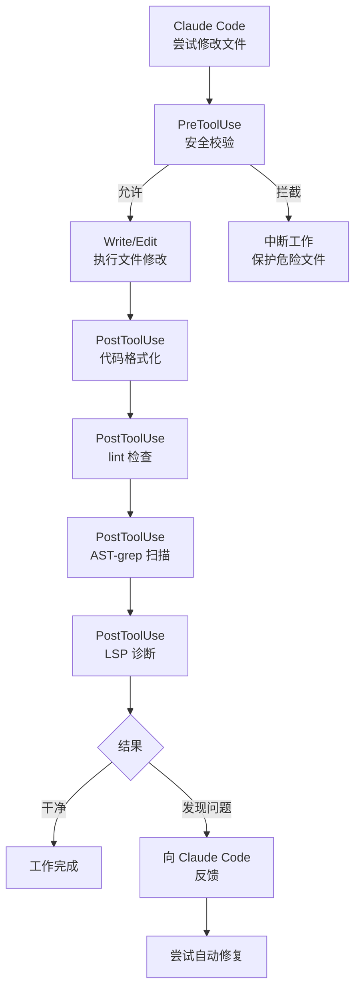

详细介绍 Claude Code 的 Hooks 系统与 MoAI-ADK 的默认 Hook 脚本。在智能体 Harness 中，提示词是"应当遵守的指令"，而 Hook 是"一定会执行的代码" — 把质量门禁与安全防线建立在确定性而非概率之上的那一层，正是 Hook。


**一句话总结**：Hooks 是 Claude Code 的 **自动反射神经**。保存文件时自动格式化，危险命令自动拦截。


## 什么是 Hooks？

Hooks 是对 Claude Code 特定事件做出反应并 **自动执行的脚本**。

用医生的反射神经检查来类比：敲击膝盖（事件发生）腿会自动抬起（脚本执行）；同样地，Claude Code 修改文件时（PostToolUse 事件），格式化工具会自动运行（整理代码）。


```mermaid
flowchart TD
    EVENT["Claude Code 事件发生"] --> MATCH{检查匹配器}

    MATCH -->|匹配| HOOK["执行 Hook 脚本"]
    MATCH -->|不匹配| SKIP["通过"]

    HOOK --> RESULT{执行结果}
    RESULT -->|成功| CONTINUE["继续工作"]
    RESULT -->|拦截| BLOCK["中断工作"]
    RESULT -->|警告| WARN["警告后继续"]
```

## Hook 事件类型

本指南介绍常用的核心事件。（完整 29 个事件见 [Hooks 事件参考](/zh/advanced/hooks-reference)。）

### 主要事件列表

| 事件 | 执行时机 | 主要用途 |
|--------|-----------|----------|
| `Setup` | 以 `--init`、`--init-only`、`--maintenance` 标志启动时 | 初始设置、环境检查 |
| `SessionStart` | 会话开始时 | 显示项目信息、初始化环境 |
| `SessionEnd` | 会话结束时 | 清理工作、保存上下文 |
| `PostSession` | 会话结束后（self-hosted runner，CC 2.1.169+） | 会话后清理/遥测；在会话完全释放后、晚于 `SessionEnd` 触发。MoAI-ADK 目前未接线此 Hook — 记录为供 self-hosted 部署使用的可用选项。 |
| `PreCompact` | 上下文压缩前（`/clear` 等） | 备份重要上下文 |
| `PreToolUse` | 使用工具前 | 安全校验、拦截危险命令 |
| **`PermissionRequest`** | 显示权限对话框时 | 自动允许/拒绝的决策 |
| `PostToolUse` | 使用工具后 | 代码格式化、lint 检查、LSP 诊断 |
| **`UserPromptSubmit`** | 用户提交提示词时 | 提示词预处理、校验 |
| **`Notification`** | Claude Code 发送通知时 | 定制桌面通知 |
| `Stop` | 响应完成后 | 循环控制、检查完成条件 |
| **`SubagentStop`** | 子智能体任务完成后 | 处理子任务结果 |

### 事件详解

#### 1. Setup
Claude Code 以 `--init`、`--init-only` 或 `--maintenance` 标志启动时执行。用于初始设置工作与环境检查。

#### 2. SessionStart
会话开始或恢复既有会话时执行。用于显示项目状态、初始化环境。

#### 3. SessionEnd
Claude Code 会话结束时执行。用于清理工作、保存上下文、收集指标。

#### 4. PreCompact
Claude Code 执行上下文压缩操作（`/clear` 命令等）之前执行。用于备份重要上下文。

#### 5. PreToolUse
在工具被调用 **之前** 执行。可以拦截或修改工具调用。用于安全校验、拦截危险命令。

#### 6. PermissionRequest
权限对话框展示给用户时执行。可以自动允许或拒绝。

#### 7. PostToolUse
工具调用 **完成之后** 执行。用于代码格式化、lint 检查、收集 LSP 诊断。

#### 8. UserPromptSubmit
用户提交提示词、Claude 处理 **之前** 执行。用于提示词预处理、校验。

#### 9. Notification
Claude Code 发送通知时执行。可以定制为桌面通知、声音提醒等。

#### 10. Stop
Claude Code 完成响应时执行。用于循环控制、检查完成条件 — `/moai loop` 与 goal 引擎就运行在这个事件之上。

#### 11. SubagentStop
子智能体任务完成时执行。用于处理子任务的结果。

### MoAI-ADK 已实现的事件

MoAI-ADK 实际实现了以下事件（✓ = 已实现，— = 参考官方示例）。

| 事件 | 状态 | Hook 文件 |
|--------|------|-----------|
| `SessionStart` | ✓ | `session_start__show_project_info.py` |
| `PreToolUse` | ✓ | `pre_tool__security_guard.py` |
| `PostToolUse` | ✓ | `post_tool__code_formatter.py`, `post_tool__linter.py`, `post_tool__ast_grep_scan.py`, `post_tool__lsp_diagnostic.py` |
| `PreCompact` | ✓ | `pre_compact__save_context.py` |
| `SessionEnd` | ✓ | `session_end__auto_cleanup.py` |
| `Stop` | ✓ | `stop__loop_controller.py` |
| `Setup` | — | 参考官方示例 |
| `PermissionRequest` | — | 参考官方示例 |
| `UserPromptSubmit` | — | 参考官方示例 |
| `Notification` | — | 参考官方示例 |
| `SubagentStop` | — | 参考官方示例 |
| `TeammateIdle` | ✓ | 检测团队成员空闲并校验质量 |
| `TaskCompleted` | ✓ | 校验任务完成 |


**SubagentStop 处理器未实现问题 (v2.9.0)**：`SubagentStop` 事件已注册在 settings.json 中，但 Go 处理器未注册到 `deps.go`。目前只返回空响应（`{}`）。


### Agent Teams 事件详解 (v2.9.0)

#### TeammateIdle 事件
团队成员完成工作、进入空闲状态时执行。

- `continue: false`（exit code 2）→ 拒绝空闲，成员继续执行额外工作
- `continue: true`（默认）→ 批准空闲

#### TaskCompleted 事件
团队成员完成任务时执行。

- Exit code 2 → 拒绝完成（需要修改）
- Exit code 0（默认）→ 批准完成

#### Team Shutdown Sequence [HARD]

结束团队时 **必须** 遵循以下顺序。

1. **发送 shutdown_request**：向每名成员发送 `SendMessage(shutdown_request)`
2. **等待响应**：从每名成员收到 `shutdown_response approve:true`
3. **[HARD] 清理 tmux pane**：显式结束 tmux pane
   - 读取 `~/.claude/teams/{team-name}/config.json`
   - 提取每名成员的 `tmuxPaneId`（例："%184"）
   - 执行 `tmux kill-pane -t {paneId}`（从高索引开始）

团队目录的清理在会话结束时自动执行。不需要显式调用 teardown（显式的团队 teardown 工具已在 Claude Code v2.1.178 中移除 — 每个会话拥有一个隐式团队，清理是自动的）。


**为什么必须清理 tmux pane？** `shutdown_response` 只是把成员在逻辑上标记为完成，并不会结束 tmux pane 进程。团队目录清理在会话结束时自动进行，但它不会结束 tmux pane 进程。若不显式结束 pane，pane 会无限存活，Leader 会卡在 "Drain" 状态。


### 事件执行顺序

一次典型的文件修改工作中 Hook 的执行顺序如下。


```mermaid
flowchart TD
    A["Claude Code<br>尝试修改文件"] --> B["PreToolUse<br>安全校验"]

    B -->|允许| C["Write/Edit<br>执行文件修改"]
    B -->|拦截| BLOCK["中断工作<br>保护危险文件"]

    C --> D["PostToolUse<br>代码格式化"]
    D --> E["PostToolUse<br>lint 检查"]
    E --> F["PostToolUse<br>AST-grep 扫描"]
    F --> G["PostToolUse<br>LSP 诊断"]

    G --> H{结果}
    H -->|干净| I["工作完成"]
    H -->|发现问题| J["向 Claude Code<br>反馈"]
    J --> K["尝试自动修复"]
```

这条管线承担了智能体循环反馈的一半 — 智能体写、Hook 检查，有问题就成为下一回合的修复输入。

## Claude Code 官方示例

以下示例是 Claude Code 官方文档提供的标准模式。

### Bash 命令日志 Hook

把所有 Bash 命令记录到日志文件。

```json
{
  "hooks": {
    "PreToolUse": [
      {
        "matcher": "Bash",
        "hooks": [
          {
            "type": "command",
            "command": "jq -r '\"\\(.tool_input.command) - \\(.tool_input.description // \"No description\")\"' >> ~/.claude/bash-command-log.txt"
          }
        ]
      }
    ]
  }
}
```

### TypeScript 格式化 Hook

编辑 TypeScript 文件后自动运行 Prettier。

```json
{
  "hooks": {
    "PostToolUse": [
      {
        "matcher": "Edit|Write",
        "hooks": [
          {
            "type": "command",
            "command": "jq -r '.tool_input.file_path' | { read file_path; if echo \"$file_path\" | grep -q '\\.ts$'; then npx prettier --write \"$file_path\"; fi; }"
          }
        ]
      }
    ]
  }
}
```

### Markdown 格式化 Hook

自动检测并补充 Markdown 文件的语言标签。

```json
{
  "hooks": {
    "PostToolUse": [
      {
        "matcher": "Edit|Write",
        "hooks": [
          {
            "type": "command",
            "command": "\"$CLAUDE_PROJECT_DIR\"/.claude/hooks/markdown_formatter.py"
          }
        ]
      }
    ]
  }
}
```

`.claude/hooks/markdown_formatter.py` 文件：

```python
#!/usr/bin/env python3
"""
Markdown formatter for Claude Code output.
Fixes missing language tags and spacing issues while preserving code content.
"""
import json
import sys
import re
import os

def detect_language(code):
    """Best-effort language detection from code content."""
    s = code.strip()

    # JSON detection
    if re.search(r'^\\s*[{\\[]', s):
        try:
            json.loads(s)
            return 'json'
        except:
            pass

    # Python detection
    if re.search(r'^\\s*def\\s+\\w+\\s*\\(', s, re.M) or \
       re.search(r'^\\s*(import|from)\\s+\\w+', s, re.M):
        return 'python'

    # JavaScript detection
    if re.search(r'\\b(function\\s+\\w+\\s*\\(|const\\s+\\w+\\s*=)', s) or \
       re.search(r'=>|console\\.(log|error)', s):
        return 'javascript'

    # Bash detection
    if re.search(r'^#!.*\\b(bash|sh)\\b', s, re.M) or \
       re.search(r'\\b(if|then|fi|for|in|do|done)\\b', s):
        return 'bash'

    return 'text'

def format_markdown(content):
    """Format markdown content with language detection."""
    # Fix unlabeled code fences
    def add_lang_to_fence(match):
        indent, info, body, closing = match.groups()
        if not info.strip():
            lang = detect_language(body)
            return f"{indent}```{lang}\\n{body}{closing}\\n"
        return match.group(0)

    fence_pattern = r'(?ms)^([ \\t]{0,3})```([^\\n]*)\\n(.*?)(\\n\\1```)\\s*$'
    content = re.sub(fence_pattern, add_lang_to_fence, content)

    # Fix excessive blank lines
    content = re.sub(r'\\n{3,}', '\\n\\n', content)

    return content.rstrip() + '\\n'

# Main execution
try:
    input_data = json.load(sys.stdin)
    file_path = input_data.get('tool_input', {}).get('file_path', '')

    if not file_path.endswith(('.md', '.mdx')):
        sys.exit(0)  # Not a markdown file

    if os.path.exists(file_path):
        with open(file_path, 'r', encoding='utf-8') as f:
            content = f.read()

        formatted = format_markdown(content)

        if formatted != content:
            with open(file_path, 'w', encoding='utf-8') as f:
                f.write(formatted)
            print(f"✓ Fixed markdown formatting in {file_path}")

except Exception as e:
    print(f"Error formatting markdown: {e}", file=sys.stderr)
    sys.exit(1)
```

### 桌面通知 Hook

Claude 等待输入时显示桌面通知。

```json
{
  "hooks": {
    "Notification": [
      {
        "matcher": "",
        "hooks": [
          {
            "type": "command",
            "command": "notify-send 'Claude Code' 'Awaiting your input'"
          }
        ]
      }
    ]
  }
}
```

### 文件保护 Hook

拦截对敏感文件的修改。

```json
{
  "hooks": {
    "PreToolUse": [
      {
        "matcher": "Edit|Write",
        "hooks": [
          {
            "type": "command",
            "command": "python3 -c \"import json, sys; data=json.load(sys.stdin); path=data.get('tool_input',{}).get('file_path',''); sys.exit(2 if any(p in path for p in ['.env', 'package-lock.json', '.git/']) else 0)\""
          }
        ]
      }
    ]
  }
}
```

## MoAI 默认 Hooks

MoAI-ADK 提供 **11 个默认 Hook 脚本**。

### Hook 列表

| Hook 文件 | 事件 | 匹配器 | 角色 | 超时 |
|-----------|--------|------|------|----------|
| `session_start__show_project_info.py` | SessionStart | 全部 | 显示项目状态、检查更新 | 5 秒 |
| `pre_tool__security_guard.py` | PreToolUse | `Write\|Edit\|Bash` | 拦截危险文件修改/命令 | 5 秒 |
| `post_tool__code_formatter.py` | PostToolUse | `Write\|Edit` | 自动代码格式化 | 30 秒 |
| `post_tool__linter.py` | PostToolUse | `Write\|Edit` | 自动 lint 检查 | 60 秒 |
| `post_tool__ast_grep_scan.py` | PostToolUse | `Write\|Edit` | 基于 AST 的安全扫描 | 30 秒 |
| `post_tool__lsp_diagnostic.py` | PostToolUse | `Write\|Edit` | 收集 LSP 诊断结果 | 默认值 |
| `pre_compact__save_context.py` | PreCompact | 全部 | `/clear` 前保存上下文 | 3 秒 |
| `session_end__auto_cleanup.py` | SessionEnd | 全部 | 会话结束时的清理工作 | 5 秒 |
| `stop__loop_controller.py` | Stop | 全部 | Ralph 循环控制与完成确认 | 默认值 |
| `quality_gate_with_lsp.py` | 手动 | 全部 | 基于 LSP 的质量门禁校验 | 默认值 |

### SessionStart：显示项目信息

会话开始时展示项目当前状态。

**显示信息：**
- MoAI-ADK 版本与是否可更新
- 当前项目名称与技术栈
- Git 分支、变更、最后提交
- Git 策略（Github-Flow 模式、Auto Branch 设置）
- 语言设置（对话语言）
- 上一会话上下文（SPEC 状态、任务列表）
- 个性化欢迎信息或设置引导

### PreToolUse：Security Guard（安全守卫）

在文件修改/命令执行前 **保护危险操作**。

**受保护的文件：**

| 类别 | 保护文件 | 理由 |
|----------|-----------|------|
| 密钥存储 | `secrets/`, `*.secrets.*`, `*.credentials.*` | 保护敏感信息 |
| SSH 密钥 | `~/.ssh/*`, `id_rsa*`, `id_ed25519*` | 保护服务器访问密钥 |
| 证书 | `*.pem`, `*.key`, `*.crt` | 保护证书文件 |
| 云凭据 | `~/.aws/*`, `~/.gcloud/*`, `~/.azure/*`, `~/.kube/*` | 保护云账号 |
| Git 内部 | `.git/*` | 保障 Git 仓库完整性 |
| Token 文件 | `*.token`, `.tokens/*`, `auth.json` | 保护认证 token |

**注意：** 不保护 `.env` 文件。允许开发者编辑环境变量。

**拦截行为：**
- 检测对受保护文件的 Write/Edit 尝试
- 以 JSON 形式返回 `"permissionDecision": "deny"` 响应
- Claude Code 中止对该文件的修改

**拦截危险 Bash 命令：**
- 删除数据库：`supabase db reset`, `neon database delete`
- 危险文件删除：`rm -rf /`, `rm -rf .git`
- Docker 全量删除：`docker system prune -a`
- 强制推送：`git push --force origin main`
- Terraform 销毁：`terraform destroy`

### PostToolUse：Code Formatter（代码格式化）

文件修改后 **自动整理代码**。

**支持的语言与格式化工具：**

| 语言 | 格式化工具（优先级） | 配置文件 |
|------|------------------|----------|
| Python | `ruff format`, `black` | `pyproject.toml` |
| TypeScript/JavaScript | `biome`, `prettier`, `eslint_d` | `.prettierrc`, `biome.json` |
| Go | `gofmt`, `goimports` | 默认值 |
| Rust | `rustfmt` | `rustfmt.toml` |
| Ruby | `prettier` | `.prettierrc` |
| PHP | `prettier` | `.prettierrc` |
| Java | `prettier` | `.prettierrc` |
| Kotlin | `prettier` | `.prettierrc` |
| Swift | `swiftformat` | `.swiftformat` |
| C# | `prettier` | `.prettierrc` |

**排除对象：**
- `.json`、`.lock`、`.min.js`、`.svg` 等
- `node_modules`、`.git`、`dist`、`build` 目录

### PostToolUse：Linter（代码检查）

文件修改后 **自动检查代码质量**。

**支持的语言与 linter：**

| 语言 | Linter（优先级） | 检查项目 |
|------|----------------|----------|
| Python | `ruff check`, `flake8` | PEP 8、类型提示、复杂度 |
| TypeScript/JavaScript | `eslint`, `biome lint`, `eslint_d` | 编码标准、潜在缺陷 |
| Go | `golangci-lint` | 代码质量、性能 |
| Rust | `clippy` | Rust 惯用法、性能 |

### PostToolUse：AST-grep 扫描

文件修改后 **扫描结构性安全漏洞**。

**支持的语言：**
Python、JavaScript/TypeScript、Go、Rust、Java、Kotlin、C/C++、Ruby、PHP

**扫描模式示例：**
- SQL Injection 漏洞（字符串拼接查询）
- 硬编码密钥（API 密钥、token）
- 不安全的函数调用
- 未使用的导入

**配置：** `.claude/skills/moai-tool-ast-grep/rules/sgconfig.yml` 或项目根目录的 `sgconfig.yml`

### PostToolUse：LSP 诊断

文件修改后 **收集 LSP (Language Server Protocol) 诊断信息**。

**支持的语言：**
Python、TypeScript/JavaScript、Go、Rust、Java、Kotlin、Ruby、PHP、C/C++

**Fallback 诊断：**
LSP 不可用时使用命令行工具：
- Python：`ruff check --output-format=json`
- TypeScript：`tsc --noEmit`

**配置：** `.moai/config/sections/ralph.yaml`

```yaml
ralph:
  enabled: true
  hooks:
    post_tool_lsp:
      enabled: true
      severity_threshold: error  # error | warning | info
```

### PreCompact：保存上下文

在执行 `/clear` 之前 **把当前上下文保存到文件**。这是在上下文临界点切断会话并延续工作的 handoff 流程的安全网。

**保存位置：** `.moai/memory/context-snapshot.json`

**保存内容：**
- 当前活动 SPEC 状态（ID、阶段、进度）
- 进行中的任务列表 (TodoWrite)
- 已完成任务列表
- 已修改文件列表
- Git 状态信息（分支、未提交变更）
- 关键决策事项

**归档：** 旧快照自动保存到 `.moai/memory/context-archive/`。

### SessionEnd：自动清理

会话结束时执行以下工作。

**P0 工作（必须）：**
- 保存会话指标（修改文件数、提交数、经手的 SPEC）
- 保存工作状态快照（`.moai/memory/last-session-state.json`）
- 未提交变更警告

**P1 工作（可选）：**
- 清理临时文件（超过 7 天的文件）
- 清理缓存文件
- 扫描根目录文档管理违规
- 生成会话摘要

### Stop：循环控制器

控制 Ralph Engine 反馈循环。`/moai loop` 之所以能"反复直到全部修好"，是因为这个 Hook 在每个回合结束时机械地判定完成条件。

**完成条件检查：**
- LSP 错误数（目标 0 错误）
- LSP 警告数
- 测试是否通过
- 覆盖率目标（默认 85%）
- 完成语句检测（自然语言循环终止信号）

**状态文件：** `.moai/cache/.moai_loop_state.json`

**配置：** `.moai/config/sections/ralph.yaml`

```yaml
ralph:
  enabled: true
  loop:
    max_iterations: 10
    auto_fix: false
    completion:
      zero_errors: true
      zero_warnings: false
      tests_pass: true
      coverage_threshold: 85
```

### Quality Gate with LSP

使用 LSP 诊断校验质量门禁。

**质量标准：**
- 最大错误数：0（默认）
- 最大警告数：10（默认）
- 类型错误：允许 0 个
- lint 错误：允许 0 个

**配置：** `.moai/config/sections/quality.yaml`

```yaml
constitution:
  quality_gate:
    max_errors: 0
    max_warnings: 10
    enabled: true
```

**结果示例：**
```json
{
  "lsp_errors": 0,
  "lsp_warnings": 2,
  "type_errors": 0,
  "lint_errors": 0,
  "passed": true,
  "reason": "Quality gate passed: LSP diagnostics clean"
}
```

## lib/ 共享库

MoAI Hooks 在 `lib/` 目录中提供共享功能模块。

```
.claude/hooks/moai/lib/
├── __init__.py
├── atomic_write.py           # 原子写操作
├── checkpoint.py             # 检查点管理
├── common.py                 # 通用工具
├── config.py                 # 配置管理
├── config_manager.py         # 配置管理器 (高级)
├── config_validator.py       # 配置校验
├── context_manager.py        # 上下文管理 (快照、归档)
├── enhanced_output_style_detector.py  # 输出风格检测
├── file_utils.py             # 文件工具
├── git_collector.py          # Git 数据收集
├── git_operations_manager.py # Git 操作管理器 (已优化)
├── language_detector.py      # 语言检测
├── language_validator.py     # 语言校验
├── main.py                   # 主入口
├── memory_collector.py       # 记忆收集
├── metrics_tracker.py        # 指标跟踪
├── models.py                 # 数据模型
├── path_utils.py             # 路径工具
├── project.py                # 项目相关
├── renderer.py               # 渲染器
├── timeout.py                # 超时处理
├── tool_registry.py          # 工具注册表 (格式化、lint)
├── unified_timeout_manager.py # 统一超时管理器
├── update_checker.py         # 更新检查
├── version_reader.py         # 版本读取
├── alfred_detector.py        # Alfred 检测
└── shared/utils/
    └── announcement_translator.py  # 公告翻译
```

**主要模块：**

- **tool_registry.py**：自动检测 16 种编程语言的格式化工具/linter
- **git_operations_manager.py**：通过连接池、缓存实现的优化 Git 操作
- **unified_timeout_manager.py**：统一的超时管理与优雅降级
- **context_manager.py**：上下文快照、归档、生成 Memory MCP 载荷

## 在 settings.json 中配置 Hook

Hooks 在 `.claude/settings.json` 文件的 `hooks` 部分配置。

```json
{
  "hooks": {
    "SessionStart": [
      {
        "matcher": "",
        "hooks": [
          {
            "type": "command",
            "command": "${SHELL:-/bin/bash} -l -c 'uv run \"$CLAUDE_PROJECT_DIR/.claude/hooks/moai/session_start__show_project_info.py\"'"
          }
        ]
      }
    ],
    "PreToolUse": [
      {
        "matcher": "Write|Edit",
        "hooks": [
          {
            "type": "command",
            "command": "${SHELL:-/bin/bash} -l -c 'uv run \"$CLAUDE_PROJECT_DIR/.claude/hooks/moai/pre_tool__security_guard.py\"'",
            "timeout": 5000
          }
        ]
      }
    ],
    "PostToolUse": [
      {
        "matcher": "Write|Edit",
        "hooks": [
          {
            "type": "command",
            "command": "${SHELL:-/bin/bash} -l -c 'uv run \"$CLAUDE_PROJECT_DIR/.claude/hooks/moai/post_tool__code_formatter.py\"'",
            "timeout": 30000
          },
          {
            "type": "command",
            "command": "${SHELL:-/bin/bash} -l -c 'uv run \"$CLAUDE_PROJECT_DIR/.claude/hooks/moai/post_tool__linter.py\"'",
            "timeout": 60000
          },
          {
            "type": "command",
            "command": "${SHELL:-/bin/bash} -l -c 'uv run \"$CLAUDE_PROJECT_DIR/.claude/hooks/moai/post_tool__ast_grep_scan.py\"'",
            "timeout": 30000
          },
          {
            "type": "command",
            "command": "${SHELL:-/bin/bash} -l -c 'uv run \"$CLAUDE_PROJECT_DIR/.claude/hooks/moai/post_tool__lsp_diagnostic.py\"'"
          }
        ]
      }
    ],
    "PreCompact": [
      {
        "matcher": "",
        "hooks": [
          {
            "type": "command",
            "command": "${SHELL:-/bin/bash} -l -c 'uv run \"$CLAUDE_PROJECT_DIR/.claude/hooks/moai/pre_compact__save_context.py\"'",
            "timeout": 5000
          }
        ]
      }
    ],
    "SessionEnd": [
      {
        "matcher": "",
        "hooks": [
          {
            "type": "command",
            "command": "${SHELL:-/bin/bash} -l -c 'uv run \"$CLAUDE_PROJECT_DIR/.claude/hooks/moai/session_end__auto_cleanup.py\"'",
            "timeout": 5000
          }
        ]
      }
    ],
    "Stop": [
      {
        "matcher": "",
        "hooks": [
          {
            "type": "command",
            "command": "${SHELL:-/bin/bash} -l -c 'uv run \"$CLAUDE_PROJECT_DIR/.claude/hooks/moai/stop__loop_controller.py\"'"
          }
        ]
      }
    ]
  }
}
```

### 配置结构

| 字段 | 说明 | 示例 |
|------|------|------|
| `matcher` | 工具名匹配模式（正则） | `"Write\|Edit"` |
| `type` | Hook 类型 | `"command"` |
| `command` | 要执行的命令 | Shell 脚本路径 |
| `timeout` | 执行限时（毫秒） | `5000`（5 秒） |

### 匹配器模式

| 模式 | 说明 |
|------|------|
| `""`（空字符串） | 匹配所有工具 |
| `"Write"` | 仅匹配 Write 工具 |
| `"Write\|Edit"` | 匹配 Write 或 Edit 工具 |
| `"Bash"` | 仅匹配 Bash 工具 |

## 编写自定义 Hook

### 基本模板

自定义 Hook 脚本可以用 Python 编写。

```python
#!/usr/bin/env python3
"""自定义 PostToolUse Hook: 文件修改后执行特定检查"""

import json
import sys

def main():
    # 从 stdin 读取 Hook 输入数据
    input_data = json.loads(sys.stdin.read())

    tool_name = input_data.get("tool_name", "")
    tool_input = input_data.get("tool_input", {})
    file_path = tool_input.get("file_path", "")

    # 检查逻辑
    if file_path.endswith(".py"):
        # 针对 Python 文件的自定义检查
        result = check_python_file(file_path)

        if result["has_issues"]:
            # 向 Claude Code 反馈
            output = {
                "hookSpecificOutput": {
                    "hookEventName": "PostToolUse",
                    "additionalContext": result["message"]
                }
            }
            print(json.dumps(output))
            return

    # 无问题则抑制输出
    output = {"suppressOutput": True}
    print(json.dumps(output))

def check_python_file(file_path: str) -> dict:
    """Python 文件自定义检查"""
    # 实现检查逻辑
    return {"has_issues": False, "message": ""}

if __name__ == "__main__":
    main()
```

### Hook 响应格式

| 字段 | 值 | 行为 |
|------|-----|------|
| `suppressOutput` | `true` | 不显示任何内容 |
| `hookSpecificOutput` | 对象 | 提供额外上下文 |
| `permissionDecision` | `"allow"` | 允许操作 (PreToolUse) |
| `permissionDecision` | `"deny"` | 拦截操作 (PreToolUse) |
| `permissionDecision` | `"ask"` | 请求用户确认 (PreToolUse) |

### Hook 输入数据

Hook 脚本通过标准输入 (stdin) 接收 JSON 数据。

```json
{
  "tool_name": "Write",
  "tool_input": {
    "file_path": "/path/to/file.py",
    "content": "文件内容..."
  },
  "tool_output": "文件输出结果 (仅 PostToolUse)"
}
```

## Hook 目录结构

```
.claude/hooks/moai/
├── __init__.py                        # 包初始化
├── session_start__show_project_info.py # 会话开始
├── pre_tool__security_guard.py         # 安全守卫
├── post_tool__code_formatter.py        # 代码格式化
├── post_tool__linter.py                # 代码检查
├── post_tool__ast_grep_scan.py         # AST-grep 扫描
├── post_tool__lsp_diagnostic.py        # LSP 诊断
├── pre_compact__save_context.py        # 保存上下文
├── session_end__auto_cleanup.py        # 自动清理
├── stop__loop_controller.py            # 循环控制器
├── quality_gate_with_lsp.py            # 质量门禁
└── lib/                                # 共享库
    ├── atomic_write.py                 # 原子写
    ├── checkpoint.py                   # 检查点
    ├── common.py                       # 通用工具
    ├── config.py                       # 配置
    ├── config_manager.py               # 配置管理器
    ├── config_validator.py             # 配置校验
    ├── context_manager.py              # 上下文管理
    ├── git_operations_manager.py       # Git 操作管理
    ├── tool_registry.py                # 工具注册表
    ├── unified_timeout_manager.py      # 超时管理
    └── ...                             # 其他模块
```


**注意**：Hook 脚本的超时设置过长会拖慢 Claude Code 的响应。建议格式化 30 秒、lint 60 秒、安全守卫 5 秒以内。


## 用环境变量禁用 Hook

可以用环境变量禁用特定 Hook。

| Hook | 环境变量 |
|------|-----------|
| AST-grep 扫描 | `MOAI_DISABLE_AST_GREP_SCAN=1` |
| LSP 诊断 | `MOAI_DISABLE_LSP_DIAGNOSTIC=1` |
| 循环控制器 | `MOAI_DISABLE_LOOP_CONTROLLER=1` |

```bash
export MOAI_DISABLE_AST_GREP_SCAN=1
```

## 相关文档

- [Hooks 事件参考](/zh/advanced/hooks-reference) - 29 个事件的完整参考
- [settings.json 指南](/zh/advanced/settings-json) - Hook 配置方法
- [CLAUDE.md 指南](/zh/advanced/claude-md-guide) - 项目指令管理
- [智能体指南](/zh/advanced/agent-guide) - 智能体与 Hook 联动


**提示**：Hook 是 MoAI-ADK 质量保障的核心。把代码格式化与 lint 检查自动化，让开发者专注于逻辑。添加自定义 Hook，构建适合你项目的自动化。

