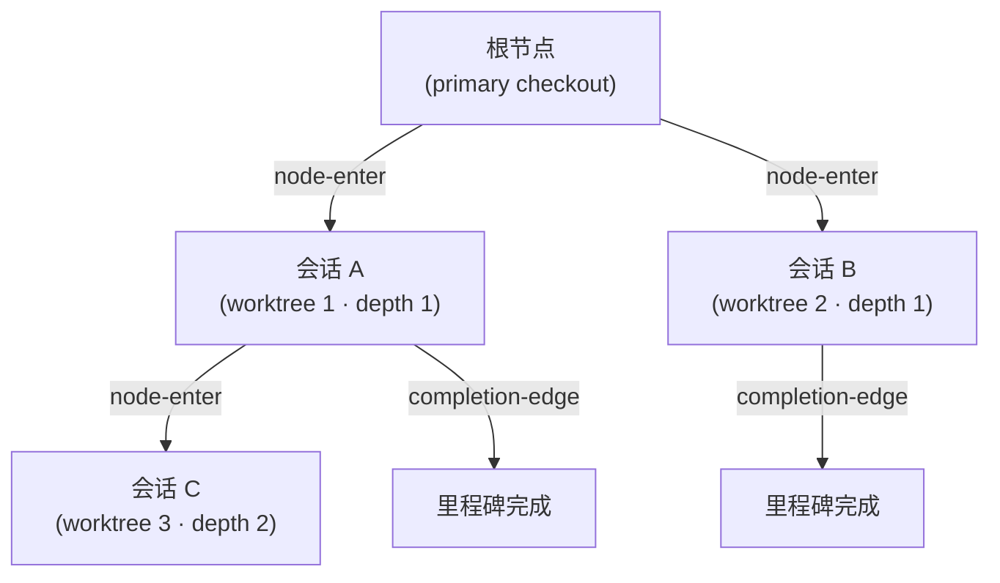
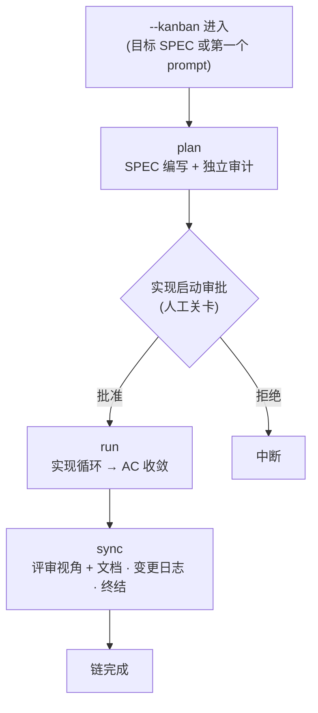



# 看板模式 (Kanban Mode)


 <strong>所属价值</strong>: 智能体循环工程 · 多会话编排

<!-- @value: self-learning, multi-session-orchestration -->

看板模式把"一次一个 SPEC、单一会话推进"的旧模型改造成**多会话看板**。一个主导会话负责指挥，多个伴随会话在各自的 worktree 中同时工作，完成的卡片在看板上流动。这块看板的骨架就是 Origin-Trail Chain。

在会话启动器上加上 `--kanban`（简写 `-k`）开关即可启动。它不是新的子命令，也不是新的运行时——只是启动器武装看板模式环境的进入契约。链的三个阶段（plan → run → sync —— 评审判定由 sync 关卡吸收）和人工关卡，都直接继承现有的 `/moai goal` 引擎和 `full-pipeline` 链接规则。

本页涵盖看板模式的进入条件、Origin-Trail Chain 设计、链的阶段，以及"什么没有被自动化"。从工作流命令视角的简短介绍请先看 [`/moai` 统一命令](/zh/workflow-commands/)。

## 为什么叫"看板"


**比喻**: 看板上的每张卡片就是一个 worktree 会话。卡片在板上流动，就像会话在链上流动。


在旧模型中，一个 SPEC 从头到尾由一个会话包揽——写 plan、用 run 实现、用 sync 整理文档。SPEC 变大时一个会话难以承受，撞到上下文窗口极限就得切分会话。

看板模式把这个结构改成**看板视角**:

- **一个主导会话**写 plan 并协调进度。
- **多个 run 会话**在各自的 worktree 中并行实现。
- 每个会话是看板上的一张**卡片**，卡片在阶段间流动。

要让这个多会话看板运作起来，就不能丢失"这个会话从哪里来"、"父会话还活着吗"、"做到哪了"。承担这个角色的是 **Origin-Trail Chain**。

## Origin-Trail Chain — 设计方向

Origin-Trail Chain 是一个追踪多会话 worktree 谱系（lineage）的 append-only 树。每个 worktree 会话是一个节点，父子边记录"这个会话是从那个会话分出来的"。

### append-only JSONL 事件流

链存储在 `.moai/state/chain/events.jsonl`。所有写入都通过 `O_APPEND` 逐行追加——不覆盖、不截断。内核会序列化并发 append，所以即使多个会话同时写，也不会让一行破坏另一行。



三种事件类型会被写入流中:

| 事件 | 记录时机 | 内容 |
|--------|-----------|------|
| `node-enter` | worktree spawn 时 | 节点 ID、父节点、深度、谱系链、worktree 路径、SPEC ID、进入时间 |
| `node-update` | 子 SessionStart 或里程碑完成时 | 回填会话 ID 或更新里程碑状态 |
| `completion-edge` | 会话结束时（SubagentStop 钩子） | 父子节点、已完成的里程碑、下一个恢复目标 |

事件流是一个**平坦的（flat）文件**，但在读取时 `BuildNodes()` 会回放事件来导出当前的节点状态。不存在可变的（mutable）树文件。

### WorktreeNode — 13 个字段

每个节点在读取时被重建为拥有 13 个字段的状态视图:

| 字段 | 含义 |
|------|------|
| `node_id` | 单调可排序的唯一 ID（毫秒时间戳 + 随机数） |
| `parent_node_id` | spawn 它的父节点。根节点为空 |
| `depth` | 嵌套深度。primary checkout 为 0，第一个 worktree 为 1 |
| `origin_chain` | 从根到本节点的 ID 路径（无需遍历即可 O(1) 查询谱系） |
| `worktree_path` | worktree 绝对路径 |
| `session_id` | 运行时分配的 Claude Code 会话 ID（通过 two-phase backfill 填充） |
| `spec_id` | 本节点工作的 SPEC 标识符 |
| `milestone` | 当前里程碑标签 |
| `entered_at` | 节点创建时间（RFC 3339） |
| `exited_at` | 会话结束时间。由心跳过期推导（不是 exit 事件） |
| `last_completed_milestone` | 最近被标记为完成的里程碑 |
| `resume_target` | 恢复时应做之事的一行说明 |
| `resume_command` | 恢复时执行的单条命令 |

### CWD 冲突解决

复用同一 worktree 路径的会话可能冲突——删除 worktree 又在同一路径重建时，两个会话拥有相同的 `worktree_path`。链用 `(worktree_path, session_id)` 对来区分:

1. **主键**: 用 `(worktree_path, session_id)` 对精确匹配的节点。
2. **fallback**: 当 `session_id` 为空或没有匹配的节点时，归结到在该路径最近进入的节点。

这个机制在 `/clear` 后恢复会话时精确还原"这个路径的当前节点是什么"。

### 两个核心问题与解决

Origin-Trail Chain 解决两个问题:

**深度遗忘（depth amnesia）** — 在深度嵌套的 worktree 中 `/clear` 后再进入时，会丢失"这个会话的祖先是谁"。过去要靠 grep 或 scrollback 考古来恢复。链在 `origin_chain` 字段中非规范化（denormalize）了从根到叶的完整 ID 路径，无需遍历就能 O(1) 恢复谱系。

**dead leader socket** — 主导会话已死但子会话不知情的状态。子会话停在原地等待死掉的领导者。链通过 `completion-edge` 事件记录会话结束，配合心跳过期（`exited_at` 推导），子会话可以检测到父会话的状态。

### 深度上限（depth ceiling）

无限深嵌套的会话树会让复杂度无法控制。链对深度设了上限来管理复杂度——超过上限就拒绝更深的 spawn，引导在更浅的层级工作。

### 会话 ID two-phase backfill

spawn worktree 的时刻还不知道会话 ID——因为 Claude Code 运行时在启动子进程后才分配会话 ID。所以分两步:

1. **spawn 时**: 追加 `node-enter` 事件但 `session_id` 留空。此时通过 `MOAI_CHAIN_NODE_ID` 环境变量向子进程传递节点 ID。
2. **子 SessionStart**: 运行时分配会话 ID 后，用 `node-update` 事件回填 `session_id`。

这个协议弥合了 spawn 时刻与会话 ID 分配时刻之间的间隙。

## 当前实现状态

v3.1 中，看板模式的进入路径已经完整接通。不过各表面的完成度不同，下面区分哪些现在就能用命令触及、哪些还只存在于库层。

### 现在就能用命令触及的

- **`-k` / `--kanban` 启动器开关** — 已在 `moai cc` 和 `moai glm` 两边接线。不带参数（或带上 SPEC 标识符）就以主导身份进入；以 `-k --name <角色>` 形式给出，则作为伴随会话加入已经打开的 run。混合后端启动器 `moai cg` 会带着拒绝哨兵拒绝进入。
- **引导提示** — 主导会话打开后，SessionStart 钩子会以用户语言输出 run 标识符和三个伴随会话的启动命令（`moai cc -k --name plan` 等）。伴随会话收到的提示只说明它加入的是哪个 run；加入的角色不在提示里，而是另行记录在会话记录中。
- **会话记录** — 进入的会话的角色、后端、目标 SPEC 会被记录下来。
- **`moai chain` CLI** — `status`（当前节点摘要）、`lineage`（从根到叶的谱系）、`back`（父节点的恢复目标与命令）、`list`（所有节点及其新鲜度）、`prune`（把已结束的陈旧节点折叠进归档）五个子命令可用。其底层就是下文的 `internal/chain/` 存储层。
- **调度** — 把卡片在列之间移动的主体是主导会话的编排器。规约位于 `.claude/rules/moai/workflow/kanban-dispatch.md`，伴随会话由人分别在各个终端手动启动。不存在一个会话拉起另一个会话的路径。

### 链存储层

- `internal/chain/store.go` — append-only JSONL writer/reader。用 `O_APPEND` 逐行追加，损坏行以 skip + warn 跳过。
- `internal/chain/node.go` — `WorktreeNode`（13 字段）+ `ChainEvent` 类型定义。
- `internal/chain/populate.go` — `Populator`: spawn 时节点创建、会话 ID 回填、里程碑更新、completion-edge 记录、当前节点解析。
- `GenerateNodeID` — 用单调时间戳 + 随机数在无外部依赖的情况下生成 ID。

### 尚无调用方的部分

`internal/kanban/` 的**看板状态存储**在代码层面已经完成——五列闭合枚举（backlog → plan → run → sync → done）、收敛到 primary checkout 一处的单一起点状态文件、文件锁、损坏恢复、与 SPEC frontmatter 状态的协调（只标记不一致而不修复）都有了。但目前还没有任何生产调用方读写它。也就是说，卡片所在的列由主导会话的记忆和 SPEC 状态维护，并不存在查看看板或移动卡片的 CLI 动词。


 **不存在 `moai kanban` 这个命令。** 看板模式的 CLI 表面只有启动器开关 `-k` 和谱系查询命令 `moai chain`。


## 用看板模式打开会话


**不是斜杠命令**: 看板模式不是 Claude Code 对话框中的 `/` 命令，而是打开会话本身的开关。在终端启动会话时附加上。


在终端的 MoAI 启动器（`moai cc` 或 `moai glm`）上加上 `--kanban`（简写 `-k`）启动。同时给出 SPEC 标识符就以该 SPEC 为目标，省略则在第一个 prompt 中开始 plan-phase。

```bash
# 以主导身份进入 — 以 SPEC 为目标启动看板链
$ moai cc --kanban SPEC-AUTH-001

# 简短形式
$ moai cc -k SPEC-AUTH-001

# 无目标 SPEC — 在第一个 prompt 中开始 plan
$ moai cc -k

# GLM 后端同样进入
$ moai glm -k SPEC-AUTH-001
```

主导会话打开后，会输出 run 标识符和三个伴随会话的启动命令。每一条都由**人在单独的终端中**手动运行，把看板填满。

```bash
# 伴随会话 — 只用角色名加入 (run-id 是主导会话的标识符)
$ moai cc -k --name plan
$ moai cc -k --name run
$ moai cc -k --name sync
```

进入成功后，启动器会在会话中武装看板模式环境（`MOAI_KANBAN` 链种子），主导的 SessionStart 提示会告知 run 标识符和伴随会话的启动命令——不是新的运行时或新的钩子，而是搭在已有机器上的进入契约。

## 用四个终端跑起一个 run

用 `moai cc -k` 打开主导会话后，会随 run 标识符一起为每个伴随会话打印一条启动命令。操作者把每条命令**在各自的终端里**打开，凑齐四会话的 run——主导负责指挥，plan · run · sync 各自在自己的 worktree 里工作。


卡片这样流动：主导指示 `plan` 会话撰写，`run` 会话从那份计划接手实现，`sync` 会话把代码与 SPEC 对齐整理并提交。评审不是单独的列——由 sync 关卡吸收，sync 阶段亲自运行评审视角得出判定。每一次派发，都发生在主导读完该阶段的进度证据之后。


**为什么是这个形态——按角色分配后端。** 设计与指挥跑在 Opus 上，实现跑在 GLM 上。打开伴随会话时用 `moai glm -k --name ...` 代替 `moai cc -k --name ...`，该会话就以 GLM 后端加入。把昂贵的模型只放在需要判断的位置、把实现的份额分流到更便宜的后端，正是让多会话 run 的 token 成本可持续的关键。会话之间可以互发消息，跨会话消息通过注入的 `--settings` 自动放行。


截图中状态栏里显示的模型标签反映的是截图时某一位操作者的会话配置，并不是发行默认值。

## 在浏览器里看板

与其用眼睛扫四个终端，`moai web` 能把同样的状态放在一个页面上。看板页面把看板链看板与 SPEC 流水线并排展示，旁边还有 Overview、Specs、Monitor、Settings 页面。


控制台只绑定回环地址。完整用法参见 [moai web 控制台](/zh/advanced/moai-web-console)。

## 链的阶段

看板链扩展了 `full-pipeline` 契约（对单个 SPEC 约定自动链接 run → sync）。三个阶段按顺序进行:



各阶段的详细流程继承现有的链接规则:

- **plan** — 编写 SPEC 文档，独立审计（plan-auditor）验证内容。参考 [`/moai plan`](/zh/workflow-commands/moai-plan)。
- **run** — 实现循环（TDD 或 DDD）向验收标准（AC）收敛，实现代码。参考 [`/moai run`](/zh/workflow-commands/moai-run)。
- **sync** — sync 关卡亲自运行评审视角（与改动触及的表面相匹配的检查点）得出评审判定，然后更新文档、写变更日志、终结 phase。参考 [`/moai sync`](/zh/workflow-commands/moai-sync)。

看板模式新加上的是**多会话看板视角**——主导会话协调，run 会话并行工作，Origin-Trail Chain 追踪谱系。链阶段本身的详细规则请参考 `/moai` 统一命令和 `/moai goal`。

## 何时用，何时不用


**一个主导，三个伴随。** 进入与调度在 v3.1 已经工作。只是把卡片列位置固化为文件的状态存储目前还没有调用方，卡片当前位置由主导会话和 SPEC 状态维护。


**用的时候** — 用多个 worktree 会话同时推进一个（或多个）SPEC 时。需要用 Origin-Trail Chain 追踪会话谱系时。要把一个 SPEC 一口气推到终结时。

**不用的时候** — 想在每个 phase 之间由人工判断、审查中间产物时（这种情况请用普通的 `plan → run → sync` 按回合推进）。一两个回合就能结束的短任务。需要用混合后端（`moai cg`）时。

## 范围边界

明确本页不做的事:

- **不是新的子命令** — `--kanban` 是启动器开关，不是 `/moai kanban` 之类的对话命令。
- **不跳过人工关卡** — 实现启动审批、pre-quality 门、文档范围门照常触发。即使链自动流动，每个关卡仍然需要人的批准。
- **不支持的后端** — 在混合后端启动器 `moai cg` 中看板模式会被拒绝。`moai cg` 让一个后端跑领导者、另一个后端跑队员，这与链条前提"一个会话 / 一个后端 / 一条链"矛盾。伴随拒绝哨兵会话不会打开。

## 相关文档

- [`/moai` 统一命令](/zh/workflow-commands/) — 工作流命令视角的简短介绍
- [`/moai todo`](/zh/utility-commands/moai-todo) — 把卡片送入看板的 backlog 队列
- [`/moai goal`](/zh/workflow-commands/moai-goal) — 驱动看板链的目标引擎
- [自治连续循环](/zh/advanced/autonomous-loops) — `/moai goal`、`/moai loop`、原生 `/goal` 的所有权与 guardrail 对比
- [`/moai run`](/zh/workflow-commands/moai-run) — run-phase 自治性接线，看板链的 run 阶段继承的规则
- [Harness 工程](/zh/core-concepts/harness-engineering) — phase 链接与观察如何在 harness 设计之上落地
- [状态显示栏](/zh/advanced/statusline) — 会话谱系和 worktree 状态如何显示在状态栏
