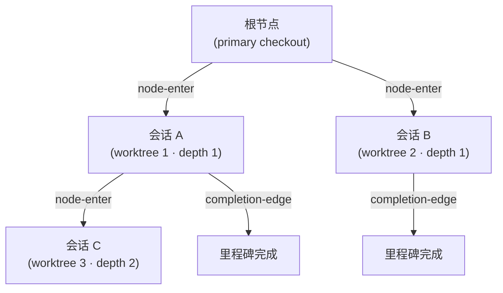
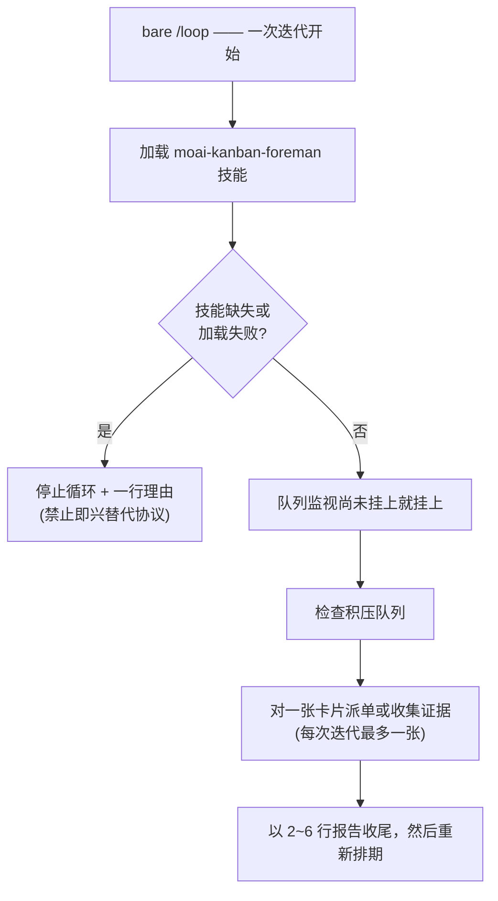



# 看板模式 (Kanban Mode)


 <strong>所属价值</strong>: 智能体循环工程 · 多会话编排

<!-- @value: self-learning, multi-session-orchestration -->

看板模式把“一次一个 SPEC、单一会话推进”的旧模型改造成**多会话看板**。一个主控会话负责指挥，伴随会话在各自的 worktree 中同时工作，完成的卡片在看板上流动。这块看板的骨架就是 Origin-Trail Chain。

在会话启动器上加上 `--kanban`（简写 `-k`）开关即可启动。它不是新的子命令，也不是新的运行时 —— 只是启动器武装看板模式环境的进入契约。链的三个阶段（plan → run → sync —— 评审判定由 sync 门禁吸收）和人工门禁，都直接继承现有的 `/moai goal` 引擎和 `full-pipeline` 链接规则。把多张卡片分到编号泳道上同时搬运的批量处理形态，已经分岔为**工厂模式**（`-f`），由本页靠后的“工厂模式”一节讲解。

本页涵盖看板模式的进入条件、Origin-Trail Chain 设计、链的阶段，以及“什么没有被自动化”。从工作流命令视角的简短介绍请先看 [`/moai` 统一命令](/zh/workflow-commands/)。

## 为什么叫“看板”


**比喻**: 看板上的每张卡片就是一个 worktree 会话。卡片在板上流动，就像会话在链上流动。


在旧模型中，一个 SPEC 从头到尾由一个会话包揽 —— 写 plan、用 run 实现、用 sync 整理文档。SPEC 变大时一个会话难以承受，撞到上下文窗口极限就得切分会话。

看板模式把这个结构改成**看板视角**:

- **一个主控会话**写 plan 并协调进度。
- **多个 run 会话**在各自的 worktree 中并行实现。
- 每个会话是看板上的一张**卡片**，卡片在阶段间流动。

要让这个多会话看板运作起来，就不能丢失“这个会话从哪里来”、“父会话还活着吗”、“做到哪了”。承担这个角色的是 **Origin-Trail Chain**。

## Origin-Trail Chain — 设计方向

Origin-Trail Chain 是一棵追踪多会话 worktree 谱系 (lineage) 的 append-only 树。每个 worktree 会话是一个节点，父子边记录“这个会话是从那个会话分出来的”。

### append-only JSONL 事件流

链存储在 `.moai/state/chain/events.jsonl`。所有写入都以 `O_APPEND` 逐行追加 —— 没有覆盖，也没有截断。内核会把并发 append 串行化，所以多个会话同时写入，也不会有一行破坏另一行。



三种事件类型会写入流中:

| 事件 | 记录时机 | 内容 |
|--------|-----------|------|
| `node-enter` | worktree 生成之时 | 节点 ID、父节点、深度、谱系链、worktree 路径、SPEC ID、进入时刻 |
| `node-update` | 子会话 SessionStart 或里程碑完成 | 会话 ID backfill 或里程碑状态更新 |
| `completion-edge` | 会话结束（SubagentStop 钩子） | 父子节点、已完成的里程碑、下一个恢复目标 |

事件流是**扁平 (flat) 文件**，但读取时 `BuildNodes()` 会重放事件推导出当前节点状态。可变 (mutable) 的树文件并不存在。

### WorktreeNode — 13 个字段

每个节点在读取时被重建为一个拥有 13 个字段的状态视图:

| 字段 | 含义 |
|------|------|
| `node_id` | 可单调排序的唯一 ID（毫秒时间戳 + 随机数） |
| `parent_node_id` | 生成此节点的父节点。根节点为空 |
| `depth` | 嵌套深度。primary checkout 为 0，第一个 worktree 为 1 |
| `origin_chain` | 从根到此节点的 ID 路径（无需遍历即可 O(1) 查询谱系） |
| `worktree_path` | worktree 绝对路径 |
| `session_id` | 运行时分配的 Claude Code 会话 ID（经 two-phase backfill 填入） |
| `spec_id` | 此节点处理的 SPEC 标识符 |
| `milestone` | 当前里程碑标签 |
| `entered_at` | 节点创建时刻 (RFC 3339) |
| `exited_at` | 会话结束时刻。由心跳陈旧度推导（不是 exit 事件） |
| `last_completed_milestone` | 最近标记完成的里程碑 |
| `resume_target` | 恢复时该做什么的一行说明 |
| `resume_command` | 恢复时执行的单条命令 |

### CWD 冲突解决

复用同一 worktree 路径的会话可能冲突 —— worktree 被删掉后在同一路径重建，两个会话就会有相同的 `worktree_path`。链用 `(worktree_path, session_id)` 对来区分:

1. **主键**: 查找与 `(worktree_path, session_id)` 对精确匹配的节点。
2. **fallback**: `session_id` 为空或找不到匹配节点时，归到最近进入该路径的节点。

正是这个机制让 `/clear` 之后恢复会话时，“这个路径的当前节点是什么”得以精确还原。

### 两个核心问题与解法

Origin-Trail Chain 解决两个问题:

**深度遗忘 (depth amnesia)** —— 在深度嵌套的 worktree 里 `/clear` 之后重新进入时，“这个会话的祖先是谁”丢了。过去只能靠 grep 或翻滚动记录做考古。链把从根到叶的完整 ID 路径反规范化 (denormalize) 进 `origin_chain` 字段，无需遍历即可 O(1) 还原谱系。

**dead leader socket** —— 主控会话已死、子会话却不知情的状态。子会话停在原地等一个死了的主控。链用 `completion-edge` 事件记录会话结束，配合心跳陈旧度（推导 `exited_at`），子会话得以感知父节点的状态。

### 深度上限（depth ceiling）

无限深的会话树会让复杂度失去控制。链给 depth 设了上限来管理复杂度 —— 超过上限就拒绝更深的生成，引导在更浅的层级工作。

### 会话 ID two-phase backfill

生成 worktree 的时点还不知道会话 ID —— 因为 Claude Code 运行时要在启动子进程之后才分配会话 ID。所以分成两步:

1. **生成时**: 追加 `node-enter` 事件，`session_id` 留空。此时通过 `MOAI_CHAIN_NODE_ID` 环境变量把节点 ID 传给子进程。
2. **子会话 SessionStart**: 运行时分配会话 ID 后，用 `node-update` 事件把 `session_id` backfill 进去。

有了这个协议，生成时刻与会话 ID 分配时刻之间的空档就能补上。

## 当前实现状态

v3.1 中看板模式的进入路径已经接通。不过各个表面的完成度不同，所以这里把“现在就能用的”和“还只存在于库层”的区分清楚。

### 现在用命令能触及的

- **`-k` / `--kanban` 启动器开关** —— 同时接在 `moai cc` 和 `moai glm` 上。不带参数（或带上 SPEC 标识符）进入为主控；以 `-k --name <角色>` 形式给出则作为伴随会话加入已经打开的 run。混合后端启动器 `moai cg` 会带着哨兵一起被拒绝。
- **`-f` / `--factory` 启动器开关** —— 工厂模式的专用入口。`moai cc -f N` 会连同主控一起告诉你 `lane-1`…`lane-N` 各条泳道的启动命令，`moai cc -f lane-<n>` 则一次加一条泳道。详见下面的“工厂模式”一节。
- **引导信息** —— 主控会话打开时，SessionStart 钩子会用用户语言输出 run 标识符和三条伴随会话启动命令（`moai cc -k --name plan` 等）。加入伴随会话时的信息会告知加入了哪个 run、会话名叫什么。名字只用角色名（`plan`、`run`、`sync`），同一角色名已被活着的会话占用时，下一个拿编号（`plan-1`、`plan-2`、…）。引导信息里还会一并带上推荐的后端组合，以及每会话的并发智能体上限（10 个）。
- **会话记录** —— 进入的会话的角色、后端、目标 SPEC 都会被记录。
- **`moai chain` CLI** —— `status`（当前节点摘要）、`lineage`（从根到叶的谱系）、`back`（父节点的恢复目标与命令）、`list`（所有节点与新鲜度）、`prune`（把终止的陈旧节点折叠进归档）五个子命令可用。后端是下面讲的 `internal/chain/` 存储层。
- **派单** —— 在列之间移动卡片的主体是主控会话的编排器。规约在 `.claude/rules/moai/workflow/kanban-dispatch.md`，伴随会话由人手在各终端亲自启动。会话替别的会话启动的路径不存在。

### 链存储层

- `internal/chain/store.go` — append-only JSONL writer/reader。用 `O_APPEND` 逐行追加，损坏的行以 skip + warn 跳过。
- `internal/chain/node.go` — `WorktreeNode`（13 字段）+ `ChainEvent` 类型定义。
- `internal/chain/populate.go` — `Populator`: 生成时创建节点、会话 ID backfill、里程碑更新、completion-edge 记录、当前节点解析。
- `GenerateNodeID` — 单调时间戳 + 随机数，无外部依赖地生成 ID。

### 尚无调用方的部分

`internal/kanban/` 的**看板状态存储**在代码层面是完成的 —— 五列封闭枚举（backlog → plan → run → sync → done）、收敛到 primary checkout 一处的单一原点状态文件、文件锁、损坏恢复、与 SPEC frontmatter 状态的协调（只标记不一致、不去修）都有。但读写它的生产调用方还不存在。也就是说，列位置目前由主控会话的记忆和 SPEC 状态维持，查看看板或移动卡片的 CLI 动词并不存在。


 **没有 `moai kanban` 这个命令。** 看板模式的 CLI 表面只有启动器开关 `-k` 和谱系查询命令 `moai chain`。


## 用看板模式打开会话


**不是斜杠命令**: 看板模式不是 Claude Code 对话框里的 `/` 命令，而是打开会话本身的开关。在终端启动会话时加上。


在终端给 MoAI 启动器（`moai cc` 或 `moai glm`）加上 `--kanban`（简写 `-k`）启动。带上 SPEC 标识符就以该 SPEC 为目标，省略则在第一个提示词进入 plan 阶段。

```bash
# 以主控进入 —— 以 SPEC 为目标启动看板链
$ moai cc --kanban SPEC-AUTH-001

# 简写形式
$ moai cc -k SPEC-AUTH-001

# 不带目标 SPEC —— 第一个提示词开始 plan
$ moai cc -k

# GLM 后端同样的进入方式
$ moai glm -k SPEC-AUTH-001
```

主控会话打开后，会输出 run 标识符和三条伴随会话启动命令。每一条都由**人在单独的终端里**亲自执行，把看板填满。

```bash
# 伴随会话 —— 以角色名加入 (run-id 是主控的标识符)
$ moai cc -k --name plan
$ moai cc -k --name run
$ moai cc -k --name sync
```

进入成功后，启动器把看板模式环境（`MOAI_KANBAN` 链种子）武装进会话，主控的 SessionStart 引导会告知 run id 和伴随会话启动命令 —— 不是新的运行时或新的钩子，而是骑在既有机器上的进入契约。

## 用四个终端跑起一个 run

用 `moai cc -k` 打开主控后，它会告知 run 标识符和每个伴随会话各一条启动命令。操作者把那些命令**各自在自己的终端里**亲自打开，四会话的 run 就完成了 —— 主控发指令，plan · run · sync 在各自的 worktree 里工作。


卡片这样流动: 主控指示 `plan` 会话进行编写，`run` 会话接过计划里的实现继续干活，`sync` 会话把代码对照 SPEC 整理并提交。评审判定不是单独的列，而是由 sync 门禁吸收 —— sync 阶段亲自运行评审视角来决定是否通过。每次派单都发生在主控读过进度证据确认之后。

三个伴随会话各自都能并行调用子智能体。尤其是 `plan` 会话，会把多张卡片的 SPEC 编写按卡片目录拆开，扇出给并行的 `Agent()` 工作者 —— 编写不必一张一张排队等。并发智能体数按每会话 10 个封顶：启动器会向每个伴随会话注入 `CLAUDE_CODE_MAX_CONCURRENT_SUBAGENTS` 上限，所以即便四个会话同时扇出，机器容量也是靠结构切分，而不是靠操作者克制。


**为什么是这个形态 —— 按角色分后端。** 设计和指挥跑在 Opus 上，实现跑在 GLM 上。打开伴随会话时把 `moai cc -k --name ...` 换成 `moai glm -k --name ...`，该会话就以 GLM 后端加入。把贵模型只放在需要判断的位置、把实现的份额送去便宜的后端 —— 正是这种分配让多会话 run 的 token 成本可持续。会话之间互相收发消息，跨会话消息收发已通过注入的 `--settings` 自动允许。


### 后端组合 —— 默认推荐及其理由

引导信息会一并给出默认推荐。若优先考虑 token 可用性:

```bash
moai glm -k                    # 主控 —— 守着队列搬卡片的位置
moai cc  -k --name plan        # plan —— 设计·判断交给 Claude
moai glm -k --name run         # run —— 实现为主交给 GLM
moai cc  -k --name sync        # sync —— 评审·整理交给 Claude
```

这样部署的依据是每个角色需要的推理种类。plan 和 sync 是做判断和评审的列，放在 Claude；run 以实现为主，用 GLM 压低成本。主控不是下判定的位置，而是守着队列搬卡片的位置，适合常驻等待成本不大的 GLM。GLM 主控之下需要 Claude 判定时，会经名为 `judge` 的会话绕出去 —— 这是 GLM 主控使用 Claude 的唯一途径。一个账号开始被 429 限流时，把各个会话分散到不同账号来安排是行之有效的做法。这个组合终究只是默认推荐，换别的组合、或把全部会话统一到单一后端都没问题。

截图里状态栏上显示的模型标签反映的是拍摄当时某位操作者会话的配置，不是发布默认值。

## 工厂模式 —— N 条泳道同时搬运多张卡片


 **所属价值**: 多会话编排 · token 经济学


如果说看板的形态是“三个角色接力搬运一张卡片”，那么**工厂模式**就是“N 条编号泳道同时搬运多张卡片”。从 v3.1.1 起，工厂有了自己的进入标记 `-f` —— 看板链继续用 `-k`，工厂用 `-f`。

```bash
# 主控 —— 4 条泳道的工厂 run (会告知 lane-1..lane-4 的启动命令)
$ moai cc -f 4

# 泳道 —— 各自在自己的终端里，一条命令里带编号
$ moai cc -f lane-1
$ moai cc -f lane-2
$ moai cc -f lane-3
$ moai cc -f lane-4

# GLM 后端的泳道也是同样的形式
$ moai glm -f lane-3
```

`-f` 后面不接数量时，默认以一条泳道（`lane-1`）起步。队列开始积压之后，再用 `moai cc -f lane-<n>`（或 glm 形式）一条一条地加泳道。编号若已被活着的会话占用，会顺延到下一个空号。

### 卡片整张进一条泳道

工厂主控干的事与看板主控不同。看板主控协调的是一张卡片的各个阶段，而工厂主控**把已挑选的卡片分给空闲的泳道**。读队列、挑卡片不是工厂主控的活儿 —— 由操作者亲自挑，或由看板工头循环（单独的 `/loop`）挑，工厂只路由这些**已挑选（picked）**的卡片。分配的单位永远是整张卡片 —— 每张卡片都完整地进一条泳道，由那条泳道在会话内把串行三阶段路径（`plan → run → sync`，一个阶段结束才进下一个）走到底。每个阶段都由泳道以 `Agent()` 子智能体的形式生成并运行，卡片绝不会被拆到多条泳道上。

每条泳道最多可以并行运行 10 个智能体 —— 启动器会向每个泳道会话注入 `CLAUDE_CODE_MAX_CONCURRENT_SUBAGENTS` 上限，所以 N 条泳道同时扇出时，机器容量是靠结构切分，而不是靠操作者克制。

### 错峰启动，禁止模型覆盖

千万不要把所有泳道一次性全部激活。先启动第一条泳道，等到有证据表明它已经开始产出（拿到第一个任务或出现可见进展）之后，再激活其余泳道 —— 并发请求读不到还在写入中的缓存条目，所以同时启动会破坏缓存效率。也不要在派单消息里附带模型覆盖 —— GLM 的层级映射是搭着 `ANTHROPIC_DEFAULT_*_MODEL` 槽位环境变量走的，逐次生成时附加覆盖会把缓存打散，还可能绕开槽位到 GLM 的映射。

看板主控的套接字开在 `/tmp/moai-socket-kanban/<run-id>`，工厂主控的开在 `/tmp/moai-socket-factory/<run-id>`；引导信息会一并给出实际路径。混合后端启动器（`moai cg`）出于与看板相同的原因被拒绝（`FACTORY_MODE_UNSUPPORTED_BACKEND`）。


**早先的形式依然有效。** v1.2.0 的统一进入形式 —— `-k <N>`（主控）和 `-k <N> --name lane-<i>`（泳道）—— 仍是有效的兼容形式（不带 N、只写 `-k --name lane-<i>` 时默认 8 条泳道）。不过一次启动只能带一个进入标记 —— `-k` 和 `-f` 同时给出会报错。


## 在浏览器里看板

与其用眼睛逐个扫过四个终端，不如用 `moai web` 把同样的状态放进一个画面。看板画面把看板链看板和 SPEC 流水线放在一起展示，还附带 Overview·Specs·Monitor·Settings 画面。


控制台只监听本地主机。详细用法见 [moai web 控制台](/zh/advanced/moai-web-console)。

## 链的阶段

看板链扩展 `full-pipeline` 契约（针对一个 SPEC 约定自动链接 run → sync 的协议）。三个阶段按顺序推进:


各阶段的详细流程继承既有的链接规则:

- **plan** — 编写 SPEC 文档，独立审计 (plan-auditor) 验证内容。参见 [`/moai plan`](/zh/workflow-commands/moai-plan)。
- **run** — 实现循环（TDD 或 DDD）持续实现代码，直到收敛到验收标准 (AC)。参见 [`/moai run`](/zh/workflow-commands/moai-run)。
- **sync** — sync 门禁亲自运行评审视角（与变更所触及表面相匹配的目光）做出评审判定，然后更新文档、写变更日志、终结阶段。参见 [`/moai sync`](/zh/workflow-commands/moai-sync)。

看板模式新叠上去的是**多会话看板视角** —— 主控会话协调、run 会话并行工作、Origin-Trail Chain 追踪谱系。链阶段本身的详细规则请参照 `/moai` 统一命令和 `/moai goal`。

## 无人工头 —— 单独的 `/loop` 

在这个项目里，不带参数直接输入 **`/loop`**，该会话就会无人值守地重复一轮**看板工头 (foreman)** 循环。它不是普通的反复修复循环，而是盯着积压队列、搬动卡片的监视—派单—收集循环。

一次迭代做的事很小，而且幂等。



三条边界约束着这个循环。

- **它无法询问操作者。** 技能生效期间，`AskUserQuestion` 会从工具池里移除。这个循环在无人观看的状态下运行，因此没有可询问的通道 —— 需要判断的事项改为写进迭代输出的报告里。
- **它只调度工作，从不生成工作。** 把卡片放进积压队列 (`moai todo add`) 和挑选下一张卡片，仍然是操作者的行为。工头只是把已挑好的卡片搬进空闲车道。
- **它不代替操作者回答任何审批门。** 实施启动审批以及其他人工门，在无人循环里照样触发，工头绝不代为放行。

完成判定始终基于**它读到的证据** —— 卡片按磁盘上的进度记录推进，而不是按车道的回复。想手动试一轮，可以直接调用 `moai-kanban-foreman` 技能。

## 何时用，何时不用


**一个主控，三个伴随。** 进入和派单在 v3.1 已可用。不过把列位置用文件固定下来的看板状态存储还没有调用方，卡片的当前位置由主控会话和 SPEC 状态维持。


**用的时候** —— 想用多个 worktree 会话同时推进一个（或多个）SPEC 时。需要用 Origin-Trail Chain 追踪会话谱系时。想把一个 SPEC 一口气推到完结时。同一套路的卡片堆了好几张、想分到泳道上并行处理时，工厂模式（`-f`）就是那个形态。

**不用的时候** —— 想在每个阶段之间亲自判断、审查中间产物时（这种情况请以回合为单位走普通 `plan → run → sync`）。一两回合就结束的短工作。必须用混合后端（`moai cg`）时。

## 范围边界

明确写出本页不做的事:

- **不是新的子命令** —— `--kanban` 是启动器开关，不是 `/moai kanban` 之类的对话命令。
- **不跳过人工门禁** —— 实现启动审批、事前质量门禁、文档范围门禁照常触发。即使链自动流转，每个门禁都需要人的批准。
- **不支持的后端** —— 混合后端启动器 `moai cg` 下看板模式被拒绝。`moai cg` 让主控跑在一个后端、队员跑在另一个后端上，这与链所假定的“一个会话 / 一个后端 / 一条链”相矛盾。伴随拒绝哨兵，会话不会打开。

## 相关文档

- [`/moai` 统一命令](/zh/workflow-commands/) — 工作流命令视角的简短介绍
- [`/moai todo`](/zh/utility-commands/moai-todo) — 把卡片放进看板的积压队列
- [`/moai loop`](/zh/utility-commands/moai-loop) — 用 bare `/loop` 驱动的无人值守工头: 在一个会话里循环执行 —— 盯积压队列、把操作者选中的卡片分给空闲泳道、收集证据
- [`/moai goal`](/zh/workflow-commands/moai-goal) — 驱动看板链的 goal 引擎
- [manager-lead 领导协调者](/zh/advanced/manager-lead) — 在看板与工厂的主控会话里负责派单的协调智能体
- [自主连续循环](/zh/advanced/autonomous-loops) — `/moai goal`、`/moai loop`、原生 `/goal` 的所有权与护栏比较
- [`/moai run`](/zh/workflow-commands/moai-run) — run 阶段自主性接线，看板链 run 阶段继承的规则
- [挽具工程](/zh/core-concepts/harness-engineering) — 阶段链接与观察在挽具设计上如何就位
- [状态栏](/zh/advanced/statusline) — 会话谱系和 worktree 状态如何显示在状态栏上
