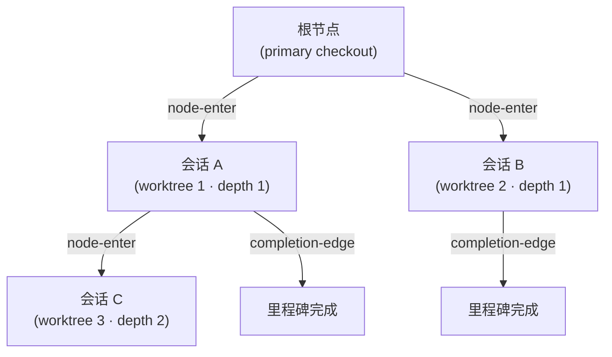
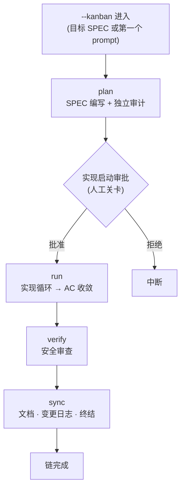



# 看板模式 (Kanban Mode)


 <strong>所属价值</strong>: 智能体循环工程 · 多会话编排

<!-- @value: self-learning, multi-session-orchestration -->

看板模式标志着从"一次一个 SPEC、单一会话推进"的旧模型，向**多会话看板**进化的方向。看板的一个主导会话负责指挥，多个 run 会话在各自的 worktree 中同时工作，完成的卡片在看板上流动。这块看板的骨架就是 Origin-Trail Chain。

在会话启动器上加上 `--kanban`（简写 `-k`）开关即可启动。它不是新的子命令，也不是新的运行时——只是一个让看板链（`kanban_chain`，即预设了完成条件的目标预设）搭上去的进入契约。链的四个阶段（plan → run → verify → sync）和人工关卡，都直接继承现有的 `/moai goal` 引擎和 `full-pipeline` 链接规则。

本页涵盖看板模式的进入条件、Origin-Trail Chain 设计、链的阶段，以及"什么没有被自动化"。从工作流命令视角的简短介绍请先看 [`/moai` 统一命令](/zh/workflow-commands/)。

## 为什么叫"看板"


**比喻**: 看板上的每张卡片就是一个 worktree 会话。卡片在板上流动，就像会话在链上流动。


在旧模型中，一个 SPEC 从头到尾由一个会话包揽——写 plan、用 run 实现、用 verify 审查、用 sync 整理文档。SPEC 变大时一个会话难以承受，撞到上下文窗口极限就得切分会话。

看板模式将这个结构改为**看板视角**:

- **一个主导会话**写 plan 并协调进度。
- **多个 run 会话**在各自的 worktree 中并行实现。
- 每个会话是看板上的一张**卡片**，卡片在阶段间流动。

要让这个多会话看板运作起来，就不能丢失"这个会话从哪里来"、"父会话还活着吗"、"做到哪了"。承担这个角色的是 **Origin-Trail Chain**。

## Origin-Trail Chain — 设计方向

Origin-Trail Chain 是一个追踪多会话 worktree 谱系（lineage）的 append-only 树。每个 worktree 会话是一个节点，父子边记录"这个会话是从那个会话分出来的"。

### append-only JSONL 事件流

链存储在 `.moai/state/chain/events.jsonl`。所有写入都通过 `O_APPEND` 逐行追加——不覆盖、不截断。内核会序列化并发 append，所以即使多个会话同时写，也不会让一行破坏另一行。



三种事件类型会被写入流中:

| 事件 | 记录时机 | 内容 |
|--------|-----------|------|
| `node-enter` | worktree spawn 时 | 节点 ID、父节点、深度、谱系链、worktree 路径、SPEC ID、进入时间 |
| `node-update` | 子 SessionStart 或里程碑完成时 | 回填会话 ID 或更新里程碑状态 |
| `completion-edge` | 会话结束时（SubagentStop 钩子） | 父子节点、已完成的里程碑、下一个恢复目标 |

事件流是一个**平坦的（flat）文件**，但在读取时 `BuildNodes()` 会回放事件来导出当前的节点状态。不存在可变的（mutable）树文件。

### WorktreeNode — 13 个字段

每个节点在读取时被重建为拥有 13 个字段的状态视图:

| 字段 | 含义 |
|------|------|
| `node_id` | 单调可排序的唯一 ID（毫秒时间戳 + 随机数） |
| `parent_node_id` | spawn 它的父节点。根节点为空 |
| `depth` | 嵌套深度。primary checkout 为 0，第一个 worktree 为 1 |
| `origin_chain` | 从根到本节点的 ID 路径（无需遍历即可 O(1) 查询谱系） |
| `worktree_path` | worktree 绝对路径 |
| `session_id` | 运行时分配的 Claude Code 会话 ID（通过 two-phase backfill 填充） |
| `spec_id` | 本节点工作的 SPEC 标识符 |
| `milestone` | 当前里程碑标签 |
| `entered_at` | 节点创建时间（RFC 3339） |
| `exited_at` | 会话结束时间。由心跳过期推导（不是 exit 事件） |
| `last_completed_milestone` | 最近被标记为完成的里程碑 |
| `resume_target` | 恢复时应做之事的一行说明 |
| `resume_command` | 恢复时执行的单条命令 |

### CWD 冲突解决

复用同一 worktree 路径的会话可能冲突——删除 worktree 又在同一路径重建时，两个会话拥有相同的 `worktree_path`。链用 `(worktree_path, session_id)` 对来区分:

1. **主键**: 用 `(worktree_path, session_id)` 对精确匹配的节点。
2. **fallback**: 当 `session_id` 为空或没有匹配的节点时，归结到在该路径最近进入的节点。

这个机制在 `/clear` 后恢复会话时精确还原"这个路径的当前节点是什么"。

### 两个核心问题与解决

Origin-Trail Chain 解决两个问题:

**深度遗忘（depth amnesia）** — 在深度嵌套的 worktree 中 `/clear` 后再进入时，会丢失"这个会话的祖先是谁"。过去要靠 grep 或 scrollback 考古来恢复。链在 `origin_chain` 字段中非规范化（denormalize）了从根到叶的完整 ID 路径，无需遍历就能 O(1) 恢复谱系。

**dead leader socket** — 主导会话已死但子会话不知情的状态。子会话停在原地等待死掉的领导者。链通过 `completion-edge` 事件记录会话结束，配合心跳过期（`exited_at` 推导），子会话可以检测到父会话的状态。

### 深度上限（depth ceiling）

无限深嵌套的会话树会让复杂度无法控制。链对深度设了上限来管理复杂度——超过上限就拒绝更深的 spawn，引导在更浅的层级工作。

### 会话 ID two-phase backfill

spawn worktree 的时刻还不知道会话 ID——因为 Claude Code 运行时在启动子进程后才分配会话 ID。所以分两步:

1. **spawn 时**: 追加 `node-enter` 事件但 `session_id` 留空。此时通过 `MOAI_CHAIN_NODE_ID` 环境变量向子进程传递节点 ID。
2. **子 SessionStart**: 运行时分配会话 ID 后，用 `node-update` 事件回填 `session_id`。

这个协议弥合了 spawn 时刻与会话 ID 分配时刻之间的间隙。

## 当前实现状态


Origin-Trail Chain 目前已合并到 **Phase 1**（internal/chain/ 包——append-only JSONL 存储层）。

`moai chain` / `moai kanban` CLI 表面和多会话看板的主导/run 列将在后续 phase 引入。本文档描述的是 rename 之后的目标状态——不把尚不工作的功能叙述为"已经在工作"。


Phase 1 提供的:

- `internal/chain/store.go` — append-only JSONL writer/reader。用 `O_APPEND` 逐行追加，以 skip + warn 跳过 corrupt line。
- `internal/chain/node.go` — `WorktreeNode`（13 字段）+ `ChainEvent` 类型定义。
- `internal/chain/populate.go` — `Populator`: spawn 时节点创建、会话 ID 回填、里程碑更新、completion-edge 记录、当前节点解析。
- `GenerateNodeID` — 用单调时间戳 + 随机数在无外部依赖的情况下生成 ID。

Phase 1 尚未提供的:

- `moai chain status` / `moai chain lineage` / `moai kanban` CLI 命令
- 多会话看板的主导/run 列表面
- `--kanban` / `-k` 启动器开关的实际连线

## 用看板模式打开会话


**不是斜杠命令**: 看板模式不是 Claude Code 对话框中的 `/` 命令，而是打开会话本身的开关。在终端启动会话时附加上。


在终端的会话启动器上加上 `--kanban` 启动。同时给出 SPEC 标识符就以该 SPEC 为目标，省略则在第一个 prompt 中开始 plan-phase。

```bash
# 以 SPEC 为目标进入看板链
$ claude --kanban SPEC-AUTH-001

# 简短形式
$ claude -k SPEC-AUTH-001

# 无目标 SPEC — 在第一个 prompt 中开始 plan
$ claude --kanban

# 用 moai cc 启动器进入
$ moai cc -k SPEC-AUTH-001
```

进入成功后，启动器会在会话中武装 `kanban_chain` 目标预设（在实现启动审批通过之后）。目标预设是 `stop-goal` Stop-钩子评估器在每个回合结束时评估的完成条件——不是新的运行时或新的钩子，而是在已有的机器上搭了一个条件。

## 链的阶段

看板链扩展了 `full-pipeline` 契约（对单个 SPEC 约定自动链接 run → sync）。四个阶段按顺序进行:



各阶段的详细流程继承现有的链接规则:

- **plan** — 编写 SPEC 文档，独立审计（plan-auditor）验证内容。参考 [`/moai plan`](/zh/workflow-commands/moai-plan)。
- **run** — 实现循环（TDD 或 DDD）向验收标准（AC）收敛，实现代码。参考 [`/moai run`](/zh/workflow-commands/moai-run)。
- **verify** — 用 `/moai review --security --deep --repo` 给出安全审查结果。根据严重度返回 run 或进入 sync。
- **sync** — 更新文档、写变更日志、终结 phase。参考 [`/moai sync`](/zh/workflow-commands/moai-sync)。

看板模式新加上的是**多会话看板视角**——主导会话协调，run 会话并行工作，Origin-Trail Chain 追踪谱系。链阶段本身的详细规则请参考 `/moai` 统一命令和 `/moai goal`。

## 何时用，何时不用


**一个 SPEC、一个会话（当前），多会话看板（目标）。** 看板模式的设计方向是多会话看板，但当前实现停留在 Phase 1（存储层）。


**用的时候** — 用多个 worktree 会话同时推进一个（或多个）SPEC 时。需要用 Origin-Trail Chain 追踪会话谱系时。要把一个 SPEC 一口气推到终结时。

**不用的时候** — 想在每个 phase 之间由人工判断、审查中间产物时（这种情况请用普通的 `plan → run → sync` 按回合推进）。一两个回合就能结束的短任务。需要用混合后端（`moai cg`）时。

## 范围边界

明确本页不做的事:

- **不是新的子命令** — `--kanban` 是启动器开关，不是 `/moai kanban` 之类的对话命令。
- **不跳过人工关卡** — 实现启动审批、pre-quality 门、文档范围门照常触发。即使链自动流动，每个关卡仍然需要人的批准。
- **不支持的后端** — 在混合后端启动器 `moai cg` 中看板模式会被拒绝。`moai cg` 让一个后端跑领导者、另一个后端跑队员，这与链条前提"一个会话 / 一个后端 / 一条链"矛盾。伴随拒绝哨兵会话不会打开。

## 相关文档

- [`/moai` 统一命令](/zh/workflow-commands/) — 工作流命令视角的简短介绍
- [`/moai goal`](/zh/workflow-commands/moai-goal) — 驱动看板链的目标引擎
- [自治连续循环](/zh/advanced/autonomous-loops) — `/moai goal`、`/moai loop`、原生 `/goal` 的所有权与 guardrail 对比
- [`/moai run`](/zh/workflow-commands/moai-run) — run-phase 自治性接线，看板链的 run 阶段继承的规则
- [Harness 工程](/zh/core-concepts/harness-engineering) — phase 链接与观察如何在 harness 设计之上落地
- [状态显示栏](/zh/advanced/statusline) — 会话谱系和 worktree 状态如何显示在状态栏
