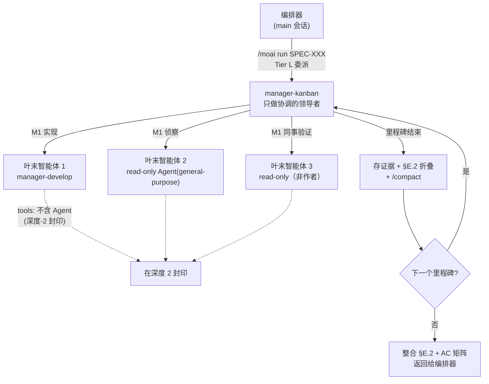




 <strong>所属价值</strong>：代理式循环工程 · 代理式线束

<!-- @value: self-learning, agentic-harness -->

实现规模大的 SPEC（需求规格书）时总会撞上两道极限。一道是上下文窗口。越过五个里程碑（SPEC 内的分段步骤）之后，实现初期读过的文件内容和智能体（自己干活的 AI 助手）的输出不断堆积，迟早会到不 `/clear` 就无法继续的地步。另一道是信任。负责实现的智能体自己报告"通过了验收标准"时，旁边若没有独立视线去核验这份报告，我们就只能相信这句话。

`manager-kanban` 是 v3.1 新引入的第十二个管理者智能体（协调智能体们的智能体），为的是同时应对这两道极限。编排器把 Tier L 规模的 SPEC 交给 `manager-kanban`，这个智能体就在每个里程碑折叠上下文（Context-Folding）让窗口保持轻盈，对每条已通过的验收标准（AC——完成判定的标准）跑同事交叉验证（peer cross-validation），使之能在一个窗口里走到最后。它不亲自写代码，只做协调。

本页是深度页面。再深一层地讲层级结构、进场条件、每里程碑的上下文折叠、同事验证，以及"什么不变"。

## 本页讲什么

`manager-kanban` 不是单个智能体，而是一种工作**形状**。这种形状由五条轴组成。

1. **只做协调的领导者**——`manager-kanban` 不写代码、不改 SPEC 正文、也不直接向用户提问。
2. **深度-2 封印**——管理者智能体中只有 `manager-kanban` 带 `Agent` 工具，其下调用的叶末智能体不能再带 `Agent`。
3. **每里程碑折叠上下文**——每个里程碑结束时把证据存为文件、在 `progress.md` 写一行摘要，然后用 `/compact` 清窗口。
4. **同事交叉验证**——由非作者的第二个智能体重跑同一命令，确认 AC 通过判定。
5. **基于模式的花瓣展开**——侦察智能体按固定标题格式返回时，领导者机械地拼合。

五条轴齐备，才成立得起能叫"层级团队"的工作流。

## 为什么需要它

把 Tier L 规模的 SPEC 用顺序模式（Mode 5）实现时，编排器逐个里程碑调用 `manager-develop` 智能体。这条流大多数时候都很合适，但 SPEC 一变大就会出现两种现象。

先是上下文涨满。实现初期读过的文件、第一个里程碑写的测试、AC 验证命令的输出都一直留在同一个窗口里。到了第五个里程碑左右窗口几乎满了，最终要 `/clear` 再续，就得把前面的进度作为摘要交接。经由这些摘要，语境变模糊的成本累积起来。

接着是自报的极限暴露。智能体报告"AC-003 通过"时，若编排器不逐一重新确认该判定的依据命令输出，错误报告要到 sync 阶段才勉强被抓到。中间抓了就便宜的缺陷一路跑到最后。

`manager-kanban` 分别回应这两种现象。上下文在里程碑边界折叠以保持窗口轻盈，AC 判定当场由非作者的同事智能体再确认。所以 Tier L 执行能在一个会话里活到最后，"通过了"这话以结构性验证过的状态走向下一个里程碑。

## 层级结构一览



图中要细看的是箭头方向。编排器只调到 `manager-kanban`，其下调用叶末智能体的只有 `manager-kanban`。叶末智能体不能再调智能体（虚线指向的封印）。这就是"深度-2 封印"，是阻止层级无限变深的结构性安全网。

## Step 1 — 确认进场条件是否吻合

`manager-kanban` 不是所有执行默认铺设的路径。编排器只在 SPEC **同时**满足下列三个条件时才把工作交给 `manager-kanban`。三个条件缺一个就以标准顺序模式（Mode 5）原样走。

| 条件 | 标准 | 为什么需要 |
|------|------|-------------|
| 里程碑数 | ≥ 3 个 | 折叠效果要累积至少需要三个边界 |
| 文件数 | ≥ 10 个 | 规模小的话顺序模式更便宜 |
| 领域铺开 | 跨领域花瓣展开 | 侦察分到多个领域时模式拼合才发挥威力 |

这三个条件不是"任一为真即可"，而是"全部为真才可"。触碰单一领域的 10 文件单里程碑重构看似少一个条件，实际三个都不达标，所以不会走 `manager-kanban` 路径。这是有意的设计——顺序模式更便宜更快。

编排器在调用 `manager-kanban` 之前把这次选择记录到 `progress.md` 的 `§F Phase 4 Mode Selection` 栏。用户可以 grep 这条记录确认当前执行走了哪条路径。

```bash
# 在 progress.md 里确认当前 SPEC 是否走了 manager-kanban 路径
grep -A 2 "Mode Selection" .moai/specs/SPEC-EXAMPLE-001/progress.md | grep -i "manager-kanban"
```

## Step 2 — 把 Tier L 执行交给 manager-kanban

编排器调用 `manager-kanban` 时，`manager-kanban` 收下 SPEC 标识符、里程碑地图、AC 矩阵。从这里开始分工就清楚了。

- **编排器**——守住用户关卡，接收 `manager-kanban` 返回的整合结果转交 sync 阶段。
- **manager-kanban**——每个里程碑调用叶末智能体、折叠上下文、跑同事验证。不亲自写代码、不改 SPEC 正文。也不直接调用 `AskUserQuestion`——卡住了就把拦截报告（blocker report）退给编排器。
- **叶末智能体**——用 `manager-develop` 做实现、用只读的 `Agent(general-purpose)` 做侦察、或用非作者的同事智能体重跑 AC 验证。

这份分工里最显眼的是只有 `manager-kanban` 带 `Agent` 工具。十二个管理者智能体中带 `Agent` 工具的只有 `manager-kanban`，其余管理者智能体都把 `Agent` 从工具列表中去掉以维持扁平层级。只在唯一一处打开扁平层级的同时，其下的叶末智能体不能再带 `Agent`，把层级封在不超过两步。这就是"深度-2 封印"。

```text
# manager-kanban 调用叶末智能体时的工具列表（概念示例）
manager-kanban:         [Read, Write, Edit, Grep, Glob, Bash, TaskCreate, TaskUpdate, TaskList, TaskGet, Agent, Skill]
叶末 manager-develop: [Read, Write, Edit, Grep, Glob, Bash, TaskCreate, TaskUpdate, TaskList, TaskGet, Skill]  ← 无 Agent
叶末 read-only 验证:  [Read, Grep, Glob, Bash]  ← 无 Write/Edit/Agent
```

这里 `manager-kanban` 的 `Write` 与 `Edit` 只用于协调目的。也就是只用来在 `progress.md` 的 §E.2 栏追加折叠行、或在 `.moai/state/verify/` 下写证据文件，不碰源代码。代码始终是叶末智能体的份内事。

要强调的一点是 `manager-kanban` 不是新的执行模式。Phase 4 的六种模式（1 trivial、2 background、3 agent-team——已废除、4 parallel、5 sub-agent、6 workflow）照旧，`manager-kanban` 是 Mode 5（顺序调用）形状的委派对象。没有新增"Mode 7"，也没有复活已废除的 Mode 3。

## Step 3 — 每个里程碑结束时折叠上下文

`manager-kanban` 最独特的习惯是在里程碑边界轻盈地折叠窗口。这套流程叫**上下文折叠（Context-Folding）**。一个里程碑的所有 AC 都拿到通过判定后，`manager-kanban` 依次走三步。

1. **存证据**——把该里程碑跑过的 AC 验证命令的输出留作文件。路径遵循 `.moai/state/verify/<会话>/M<里程碑>.<AC-id>.{log,out}` 形式。放在 `.moai/state/` 而不是 `/tmp` 之下，是因为操作系统清空 `/tmp` 时引用路径会断。
2. **写折叠行**——在 `progress.md` 的 §E.2 栏追加一行摘要。这行遵循 "M2: AC-004=PASS, AC-005=PASS | evidence: .moai/state/verify/.../M2.* | fold-at: 2026-08-12T..." 形式。之后审计阶段里这行的证据路径必须指向真实文件。
3. **折窗口**——带上显式的保留指令调用 `/compact`，只留下当前里程碑计划与迄今为止的折叠行，其余清理掉。

```text
# progress.md §E.2 里追加的折叠行示例
M1: AC-001=PASS, AC-002=PASS | evidence: .moai/state/verify/abc123/M1.* | fold-at: 2026-08-12T10:14:00Z
M2: AC-003=PASS, AC-004=PASS | evidence: .moai/state/verify/abc123/M2.* | fold-at: 2026-08-12T11:42:00Z
```

这套流程走完后，`manager-kanban` 的活跃上下文只与"当前里程碑规模 + 迄今为止的折叠行 + 始终铺设的规则前段"成正比。即便面对第五个里程碑，第一个里程碑的原始记录也不占窗口。所以 6 里程碑的 Tier L 执行能在一个窗口里活到最后。

```bash
# 里程碑 2 结束后查看留下的证据文件（持久化在 .moai/state/verify 下）
ls .moai/state/verify/"$(moai session current)"/M2.*
```

要注意的是流程并不绕过关卡。即便折叠，到达模型对应的上下文极限（例如 1M 窗口模型是 50%）时，`manager-kanban` 会生成粘贴式恢复消息并建议 `/clear`。折叠是让窗口保持轻盈的技术，不是脱手的技术。

留证据的路径也不能断。某个 AC 的证据文件空了或路径断了，那个 AC 不标 `PASS` 而标 `GAP`，`manager-kanban` 不进入下一个里程碑。空着不放是不允许的。

## Step 4 — 用同事交叉验证给验收标准加信任

实现智能体报告"AC-003 通过"时，`manager-kanban` 以只读方式调用非作者的第二个智能体重跑同一 AC 验证命令。这一步叫**同事交叉验证**。

为什么要再跑一次？作者已对自己的通过判定投入了成本。可能把失败的 grep 数错伪装成通过，也可能拉来以前执行的输出冒充本次执行的输出。同事智能体对作者的通过主张没有任何投入。它就在同一棵树上重跑同一命令，只查明结果是否复现（通过）、命令能跑但输出不同（部分）、命令根本跑不起来或与主张矛盾（失败）。

这一步的结果有三种情形。

- **PASS**——验证命令以与作者主张相同的结果复现。进入下一个里程碑。
- **PARTIAL**——命令能跑但输出与作者主张不同。记录差异，向编排器发拦截报告。
- **FAIL**——命令跑不起来或与作者的通过主张矛盾。同样发拦截报告。

```bash
# 同事验证智能体在同一棵树上重跑 AC-003 的验证命令示例
go test -run AC-003 ./internal/hierarchical/...
# 退出码 0 即 PASS，非 0 即 FAIL——与作者主张对照判断是 PARTIAL 还是 FAIL
```

返回 PARTIAL 或 FAIL 时，`manager-kanban` 不进入下一个里程碑。而是把 AC 标识符、作者给出的通过证据、同事抓到的差异点凑成拦截报告退给编排器。向用户给出选项是编排器的份内事——是用 `AskUserQuestion` 询问再调一次作者、把差异作为文档化的债务接受、还是中止里程碑。`manager-kanban` 不直接向用户提问。

Tier S 跳过这一步。因为规模小则同事验证的成本超过价值。Tier M 与 Tier L 是义务。同事交叉验证不替代 sync 阶段的 sync-auditor——sync-auditor 是实现完成后给四维评分的最终会议式的读，同事交叉验证是执行过程中逐 AC 跑的二元判定。两者是互补关系。

## 用基于模式的花瓣展开合拢侦察

Tier L 执行常常从跨多个领域的侦察开始。例如实现新认证系统时，智能体可能要同时查看既有的会话层、数据库迁移规约、前端路由三处。这时 `manager-kanban` 同时调用多个只读侦察智能体。

这里侦察智能体若返回各自为政的散文，`manager-kanban` 就得逐个返回值重新梳理结构。侦察越多这份成本线性变大。所以 `manager-kanban` 让侦察智能体按 `plan-research-fanout` 技能定下的固定标题格式返回。于是合拢（reduce）不再是重新梳理，而是把固定格式的 N 份结果机械地拼在一起。

两个侦察智能体对同一信号返回矛盾的发现时，`manager-kanban` 不偷偷挑一个，而是在显式的一栏里写下矛盾。矛盾显露则用户可判断，藏起来则一路走到最后才爆。

同时调用的智能体数不超过 MoAI Mode 4 的 3–5 并发上限。需要超过五个侦察时，`manager-kanban` 把它们按顺序成组调用。

## 工作树隔离的重新挂接

`manager-kanban` 同时调用多个叶末智能体时，可写的智能体彼此不应碰同一棵工作树。为防止一个智能体改的文件被另一个智能体覆盖，并行调用的可写智能体以 `isolation: "worktree"` 隔离。这种隔离给每个智能体独立的工作目录（worktree），让彼此的变更不混淆。

v3.1 之前，这条隔离规则挂在"团队模式"这个已经废除的概念上。团队模式废除后，看起来连隔离规则也作废了，但 `manager-kanban` 引入后，规则的条件被重新挂到"层级团队内并行跑的可写智能体"上。使隔离成为可能的原理不变，只是不再依赖已废除的那一层。

只读智能体不隔离也可安全调用——只读所以不会弄脏工作树。

## 不是 Mode 7（非回归保证）

`manager-kanban` 进来并不增加 Phase 4 的执行模式。这一点已成为显式的非回归承诺。

- **执行模式清单**——1 trivial、2 background、3 agent-team（已废除）、4 parallel、5 sub-agent、6 workflow。照旧。
- **新模式**——没有"Mode 7"。`manager-kanban` 是 Mode 5 形状的顺序委派对象。
- **`--mode` 值**——`autopilot`、`loop`、`team`、`pipeline` 值照旧。没有新增值，已废除的 Mode 3 也没有复活。

这份承诺是对"加了一个智能体，编排层会变复杂吗"这种自然担忧的回答。`manager-kanban` 只是装进既有 Mode 5 容器里的一个智能体，不造新容器。

## 小结

`manager-kanban` 是为把 Tier L 规模的执行在一个会话里推到底而设的只做协调的智能体。只在三个条件（≥3 里程碑、≥10 文件、跨领域花瓣展开）全部为真时才介入，进去之后每个里程碑折叠上下文让窗口保持轻盈，对每条通过的 AC 用同事交叉验证加信任。不亲自写代码也不直接向用户提问，工作卡住就把拦截报告退给编排器。

得益于深度-2 封印，层级不超过两步；得益于基于模式的花瓣展开，多份侦察结果被机械合拢。而这一切在没有给执行模式清单添新行的情况下完成。当需要把跨度大的 SPEC 一次推到最后时，`manager-kanban` 是撑起那份执行的结构骨架。
