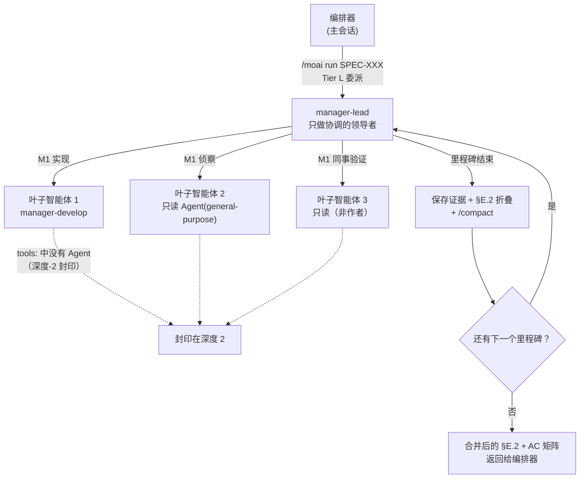



# manager-lead 领导协调者


 <strong>所属价值</strong>：代理式循环工程 · 代理式线束

<!-- @value: self-learning, agentic-harness -->

大到一个智能体扛不下来的工作，通常会撞上两道极限。一道是上下文窗口。越过五个里程碑（SPEC 内部的分段步骤）之后，实现初期读过的文件内容和智能体的输出不断堆积，迟早会到不 `/clear` 就无法继续的地步。另一道是信任。负责实现的智能体自己报告"验收标准通过了"，而旁边没有独立视线去核验这份报告时，我们就只能相信这句话。

`manager-lead` 是第十二个管理者智能体——协调其他智能体的智能体——它把这两道极限，连同多会话、多卡片的协调，一并收进同一套技能里。它在 v3.1.1 由 `manager-kanban` 改名而来，改名的同时职责也扩展到协调看板与工厂的领导会话。它不亲自写代码，只做协调。

本页是深度页面。它再深一层地讲两个角色之间的边界、层级结构、进场条件、每里程碑的上下文折叠、同事验证、领导会话的姿态，以及_什么不变_。

## 本页讲什么 — 两个角色，一套技能

`manager-lead` 不是单个智能体，而是一种工作**形状**，这种形状由两个彼此绝不混同的角色构成。

| | 角色 A — 会话内扇出 | 角色 B — 跨会话派工 |
|---|---|---|
| 工作单位 | 一个 SPEC 内部的里程碑 | 看板（-k）上的卡片，或分配给工厂泳道（-f）的卡片 |
| 谁来干活 | 它直接创建的叶子 `Agent()` 派生 | 操作者亲手启动的伴随会话（-k：plan · run · sync）与泳道（-f：lane-1…lane-N） |
| 进场方式 | 在 Tier L 阈值上由编排器委派 | SessionStart 上下文声明了领导角色的 -k/-f 会话 |

角色 A 承担 Tier L 规模 SPEC 的执行：在每个里程碑折叠上下文（Context-Folding）让窗口保持轻盈，对每条判定为通过的验收标准（AC——通过判定的标准）跑同事交叉验证，使整段实现在一个窗口里走到最后。

角色 B 是**由领导会话掌管派工循环**的工作，出现在看板模式（`moai cc -k`）和工厂模式（`moai cc -f N`）里。看板领导沿 `lead > plan > run > sync` 这条链把卡片往前推——其中 `plan` 会话会把每张卡片的 SPEC 撰写扇出给并行的 `Agent()` 工作者——而工厂领导则把操作者挑中的卡片整张交给一条空闲泳道。两者都不创建会话。伴随会话和泳道由操作者亲手逐个终端启动，领导按名字寻址发消息。

有三条纪律贯穿两个角色。工作**按顺序推进而非彼此抢跑**，完成**只凭读到的证据判定，绝不凭一句声称**，向用户提问的通道归编排器所有——这个智能体被卡住时，返回的是阻塞报告。

## 领导会话的姿态 — 对话继续，活在后面跑

在角色 B 里，领导会话的姿态是双向非阻塞的。与用户的对话照常往前走，并行的工作在后面跑；泳道与伴随会话的协调也不会停下来等用户的下一句回答。领导会话通过编排器通道与用户交谈（智能体本身只返回阻塞报告），凡是能并行的部分——只读验证批处理、交叉核对报告、领导自己握着的每卡片 SPEC 撰写——都以后台 `Agent()` 派生推出去。

叠在这之上的，是**子智能体优先的代币纪律**。只有协调留在领导和泳道的上下文里，实质性工作全部下推给子智能体。若每卡片的撰写、验证、报告都在领导的窗口里发生，四个窗口会同时变重；下推给子智能体后，各自在自己的窗口里收尾，回到领导手里的只是一份摘要。并发派生上限是每会话 10 个，而在 GLM 后端上派生一律**不带名字**——带名字的派生在 `CLAUDE_CODE_EXPERIMENTAL_AGENT_TEAMS` 下可能变成进程内队友，从而不返回任何结果。

## 为什么需要它

把 Tier L 规模的 SPEC 用顺序模式（serial）实现时，编排器逐个里程碑调用 `manager-develop` 智能体。这条流大多数时候都很合适，但 SPEC 一变大就会出现两种现象。

先是上下文涨满。实现初期读过的文件、第一个里程碑写的测试、AC 验证命令的输出，都一直留在同一个窗口里。到第五个里程碑左右窗口几乎满了，要 `/clear` 之后再续，就得把前面的进度作为摘要交接。经由这些摘要，语境变模糊的成本会累积起来。

接着是自报的极限暴露。智能体报告"AC-003 通过"，而编排器不去逐一重新确认该判定背后的命令输出时，错误报告要到 sync 阶段才被抓住。中途抓住本来很便宜的缺陷，就这样一路跑到了最后。

`manager-lead` 分别回应这两种现象。上下文在里程碑边界被折叠，窗口因此保持轻盈；每条 AC 判定都由非作者的同事智能体当场重跑核验。这样一来，Tier L 的实现能在一个会话里走到最后，"通过了"这句声称也带着结构性的验证进入下一个里程碑。角色 B 把同一条纪律延伸到会话之外——领导同样要亲自读进度记录里的证据才推动卡片，读不到证据就让卡片停在原地。

## 层级结构一览



这张图里要盯住的是箭头方向。编排器只调用到 `manager-lead` 为止，其下叶子智能体的唯一调用者就是 `manager-lead`。叶子智能体不能再去调用别的智能体（虚线所指的那道封印）。这就是"深度-2 封印"，一张防止层级无限加深的结构性安全网。角色 B 里也一样——领导的后台 `Agent()` 派生只走一层，而伴随会话和泳道本来就不是领导创建的，它们是操作者启动的独立会话。

## Step 1 — 确认进场条件是否成立

角色 A 并不是默认铺在每次实现底下的通路。只有当 SPEC 同时满足下面**三个**条件时，编排器才把工作交给 `manager-lead`。哪怕缺一个条件，实现就留在标准顺序模式（serial）里。

| 条件 | 阈值 | 为什么需要 |
|------|------|-------------|
| 里程碑数 | ≥ 3 | 折叠至少要有三个边界，效果才积得起来 |
| 文件数 | ≥ 10 | 规模小的时候，顺序模式更便宜 |
| 领域跨度 | 跨领域扇出 | 侦察分散到多个领域时，模式合并才划算 |

这三个条件是"全部成立"，不是"任一成立"。一个里程碑、10 个文件、只碰一个领域的重构看上去只差一个条件，实际上三个条件一个都不成立，所以不会进入 `manager-lead` 通路。这是有意为之的——顺序模式更便宜也更快。

角色 B 的进场更简单。只要会话的 SessionStart 上下文声明了看板模式（`moai cc -k`）或工厂模式（`moai cc -f N`）的 `lead` 角色就够了，上面的阈值不适用——因为看板（或那组泳道）本身就是工作。子智能体派生没有 SessionStart 上下文，所以角色 B 无法通过派生进入。

调用 `manager-lead` 之前，编排器会把这次选择记进 `progress.md` 的 `§F Phase 4 Mode Selection` 字段。用户可以 grep 这条记录，确认本次实现走的是哪条通路。

```bash
# Check in progress.md whether the current SPEC took the manager-lead path
grep -A 2 "Mode Selection" .moai/specs/SPEC-EXAMPLE-001/progress.md | grep -i "manager-lead"
```

## Step 2 — 把执行交出去

在角色 A 里，编排器调用 `manager-lead` 时，`manager-lead` 接过 SPEC 标识符、里程碑地图和 AC 矩阵。从这里开始，分工变得明确。

- **编排器**——守住用户闸门，接收 `manager-lead` 返回的合并结果，再交给 sync 阶段。
- **manager-lead**——逐里程碑调用叶子智能体、折叠上下文、跑同事验证。它不亲自写代码，也不改 SPEC 正文。它同样不调用 `AskUserQuestion`——一旦卡住，就向编排器返回阻塞报告。
- **叶子智能体**——用 `manager-develop` 做实现，用只读的 `Agent(general-purpose)` 做侦察，或者作为非作者的同事智能体重跑 AC 验证。

这套分工最醒目的一点是：只有 `manager-lead` 带着 `Agent` 工具。十二个管理者智能体中，`manager-lead` 是唯一持有 `Agent` 的；其余管理者智能体的工具列表都省掉 `Agent`，以此守住扁平层级。作为在唯一一处打开扁平层级的代价，其下的叶子智能体被禁止再带 `Agent`，层级因此被封死在不超过两层。这就是"深度-2 封印"，由 CI 守卫（`manager_lead_depth_test.go`）强制执行。

```text
# Tool lists when manager-lead calls leaf agents (conceptual example)
manager-lead:        [Read, Write, Edit, Grep, Glob, Bash, TaskCreate, TaskUpdate, TaskList, TaskGet, Agent, Skill]
leaf manager-develop: [Read, Write, Edit, Grep, Glob, Bash, TaskCreate, TaskUpdate, TaskList, TaskGet, Skill]  ← no Agent
leaf read-only validation: [Read, Grep, Glob, Bash]  ← no Write/Edit/Agent
```

这里 `manager-lead` 的 `Write` 和 `Edit` 只用于协调。也就是说，它们用来往 `progress.md` 的 §E.2 字段添一行折叠记录，或者在 `.moai/state/verify/` 下写证据文件——绝不碰源代码。代码永远是叶子智能体的活。

委派路由把顺序与并行分开挂。必须在一个窗口里依次进行的工作（每里程碑的实现）以顺序派生发出；与其余部分互不相干的工作（侦察、只读验证批处理、每卡片的 SPEC 撰写）以并行派生发出。技能访问完全开放——`Skill` 工具随时按需加载所需的领域技能。

有一点值得强调：`manager-lead` 不是新的执行模式。Phase 4 的四种模式（direct、serial、fanout、sweep）保持不变，`manager-lead` 只是一个形状类似 serial（依次调用）的委派目标。没有新造模式，实验性的 agent-team 面（只在明确使用 `--team` 请求时才选中）也没有变成目录里的模式。

## Step 3 — 每到里程碑边界就折叠上下文

`manager-lead` 最有辨识度的习惯，是在里程碑边界把窗口折轻。这道流程叫 **Context-Folding**。一个里程碑内的每条 AC 都拿到通过判定后，`manager-lead` 依次走三步。

1. **保存证据**——把该里程碑跑过的 AC 验证命令输出留成文件。路径遵循 `.moai/state/verify/<session>/M<milestone>.<AC-id>.{log,out}` 的形式。放在 `.moai/state/` 下而不是 `/tmp` 下，是因为操作系统一清 `/tmp`，引用的路径就断了。
2. **写下折叠行**——往 `progress.md` 的 §E.2 字段添一行摘要。这行遵循 "M2: AC-004=PASS, AC-005=PASS | evidence: .moai/state/verify/.../M2.* | fold-at: 2026-08-12T..." 的形式。之后到审计阶段，这行上的证据路径必须指向一个真实存在的文件。
3. **折叠窗口**——带上明确的保留指令调用 `/compact`，只留下当前里程碑的计划和到此为止的折叠行，其余清空。

```text
# Example fold lines added to progress.md §E.2
M1: AC-001=PASS, AC-002=PASS | evidence: .moai/state/verify/abc123/M1.* | fold-at: 2026-08-12T10:14:00Z
M2: AC-003=PASS, AC-004=PASS | evidence: .moai/state/verify/abc123/M2.* | fold-at: 2026-08-12T11:42:00Z
```

走完这道流程之后，`manager-lead` 的活跃上下文只与"当前里程碑的大小 + 到此为止的折叠行 + 规则中常驻加载的开头部分"成正比。哪怕前面还横着第五个里程碑，第一个里程碑的原始记录也不再占着窗口。6 个里程碑的 Tier L 实现能在一个窗口里走到最后，靠的就是这一点。

```bash
# Check the evidence files left after milestone 2 (persisted under .moai/state/verify)
ls .moai/state/verify/"$(moai session current)"/M2.*
```

要留意的是，这道流程并不绕开任何闸门。即便有折叠，一旦触到各模型的上下文上限（例如 1M 窗口模型的 50%），`manager-lead` 也会写好可直接粘贴的续接消息并建议 `/clear`。折叠是让窗口保持轻盈的手法，不是可以撒手不管的手法。

留证据的那条路同样不能堵上。若某条 AC 的证据文件是空的，或者路径断了，那条 AC 会被标成 `GAP` 而不是 `PASS`，`manager-lead` 也不会进入下一个里程碑。留着空白往前走是不被允许的。

## Step 4 — 用同事交叉验证给验收标准加上信任

负责实现的智能体报告"AC-003 通过"时，`manager-lead` 会调用第二个非作者的只读智能体，重跑同一条 AC 验证命令。这一步叫**同事交叉验证**。

为什么非要跑第二遍？作者对自己下的通过判定已经有了投入。它可能把失败的 grep 数错成通过，也可能把更早一次运行的输出当作本次输出引用过来。同事智能体对作者的通过声称没有任何投入。它的活是在同一棵树上重跑同一条命令，只判断结果是否复现（通过）、命令跑得起来但输出不同（部分通过），还是命令根本跑不起来或与声称相矛盾（失败）。

这一步会给出三种结果。

- **PASS**——验证命令复现了与作者声称相同的结果。实现进入下一个里程碑。
- **PARTIAL**——命令跑得起来，但输出与作者的声称不同。差异被记录下来，同时向编排器发出阻塞报告。
- **FAIL**——命令跑不起来，或者与作者的通过声称相矛盾。这里同样发出阻塞报告。

```bash
# Example verification command the peer agent reruns for AC-003 on the same tree
go test -run AC-003 ./internal/hierarchical/...
# Exit code 0 means PASS, non-zero means FAIL — compare against the author's claim to decide PARTIAL vs FAIL
```

一旦回来的是 PARTIAL 或 FAIL，`manager-lead` 就不进入下一个里程碑。它会把 AC 标识符、作者拿出的通过证据、同事抓到的差异汇成一份阻塞报告，返回给编排器。向用户摆出选项是编排器的活——由它通过 `AskUserQuestion` 询问是再叫一次作者、把差异作为有记录的债务接受，还是中止该里程碑。`manager-lead` 绝不直接问用户。

Tier S 跳过这一步。规模小的时候，同事验证的成本超过它带来的价值。Tier M 和 Tier L 则是必做。同事交叉验证不替代 sync 阶段的 sync-auditor——sync-auditor 是实现结束后跨四个维度打分的终局阅读，同事交叉验证则是实现途中逐条 AC 给出的二值判定。两者互补。

## 用基于模式的扇出合并侦察

Tier L 的实现常常从横跨多个领域的侦察开始。比方说实现一套新的认证系统时，智能体可能得同时看现有的会话层、数据库迁移约定和前端路由。这种情况下，`manager-lead` 会同时调用多个只读的侦察智能体。

如果这些侦察智能体各按各的格式返回散文，`manager-lead` 就得从每个返回值里重新推导结构。侦察越多，这份成本涨得越线性。所以 `manager-lead` 让侦察智能体按 `plan-research-fanout` 技能定义的固定标题格式返回。这样一来，归并就不再是重新推导，而是把 N 份固定格式的结果机械拼合。

当两个侦察智能体就同一个信号返回互相矛盾的发现时，`manager-lead` 不会悄悄挑其中一个，而是把矛盾写进一个明确指定的字段。被摊开的矛盾能让用户来判断；被藏起来的矛盾只会在最后一刻炸开。

同时调用的智能体数量不超过 MoAI fanout 的 3–5 并发上限。若需要跑超过五份侦察，`manager-lead` 会分组依次调用。

## 工作树隔离 — 写的隔离，读的照旧

`manager-lead` 同时调用多个叶子智能体时，有写权限的智能体不能碰同一棵工作树。为了防止一个智能体覆盖掉另一个正在编辑的文件，**并行调用的写子智能体一律用 `isolation: "worktree"` 隔离**。这道隔离给每个智能体一个独立的工作目录（worktree），它们的改动因此不会混在一起。

**只读的扇出不带隔离调用也是安全的**——因为它只读，弄不脏工作树。侦察和验证批处理照原样跑，规则是只给写派生挂上隔离。

v3.1 之前，这条隔离规则挂在"团队模式"这个概念上，而该概念此后已被退役。团队模式退役时，这条隔离规则看上去也一并失去了用处；但随着 `manager-lead` 的到来，规则的条件被重新锚定到"并行运行的写子智能体"上。让隔离成立的原理没有变，变的只是条件不再依附于一个已退役的层。

## 不是新的执行模式（非回归保证）

`manager-lead` 的到来，不会让 Phase 4 的执行模式变多。这一点作为明确的非回归承诺被固定下来。

- **执行模式清单**——direct、serial、fanout、sweep。保持不变（agent-team 仍是仅凭明确请求才可用的实验性脚注，绝不会被自动选中）。
- **新模式**——没有。`manager-lead` 是一个形状类似 serial 的顺序委派目标。
- **`--mode` 取值**——`autopilot`、`loop`、`team`、`pipeline` 保持不变。没有新增取值，agent-team 仍是仅凭明确请求才可用的实验性面（`MODE_TEAM_UNAVAILABLE` 哨兵作为有记录的历史被保留）。

这份承诺回应了一个很自然的担心："多加一个智能体，编排层不就更复杂了吗？"`manager-lead` 是一个装进现有 serial 容器里的智能体，它没有另造容器。看板与工厂的领导会话里也一样——派工循环跑在已经存在的跨会话消息与待办队列之上，不安装任何新的运行时。

## 小结

`manager-lead` 是一个只做协调的智能体，覆盖两个面。在角色 A 里，它把 Tier L 规模的实现在一个会话内推到底——只有三个条件（里程碑 ≥ 3、文件 ≥ 10、跨领域扇出）全部成立时它才登场，一旦登场，就在每个里程碑折叠上下文让窗口保持轻盈，并用同事交叉验证给每条通过的 AC 加上信任。在角色 B 里，它掌管看板与工厂领导会话的派工——卡片只凭读到的证据移动，并行的工作以后台派生推出去，用户对话因此不会停顿，阶段之间则请求 `/clear`。

它不亲自写代码，也不直接问用户；工作卡住时，向编排器返回阻塞报告。靠深度-2 封印，层级永远不超过两层；靠基于模式的扇出，多份侦察结果机械地合并；靠写派生上的工作树隔离，并行是安全的。而这一切的发生，没有给执行模式清单添上哪怕一行。
